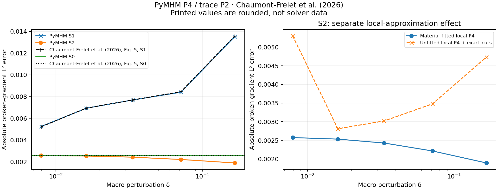
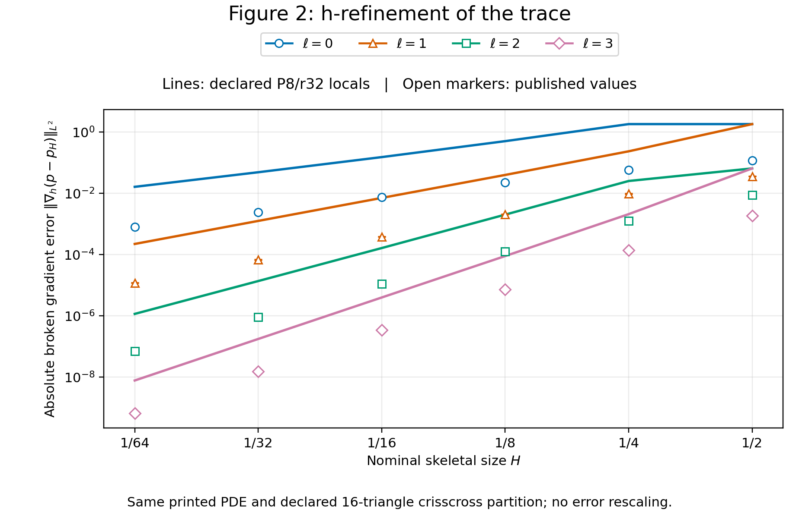
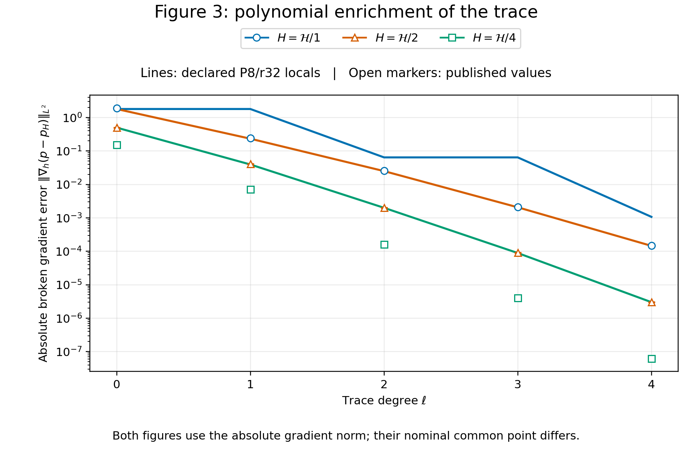

# Material interfaces inside macroelements

The two-layer problem in §6.2 of
[Chaumont-Frelet, Paredes and Valentin (2026)](https://doi.org/10.1016/j.camwa.2026.01.016) isolates the role of the
skeletal partition. On the unit square,

$$
-\nabla\!\cdot(a\nabla p)=1,\qquad p|_{\partial\Omega}=0,\qquad
 a(x,y)=\begin{cases}10,&y<1/2,\\1,&y>1/2.\end{cases}
$$

Pressure and normal physical flux are continuous across the material interface;
the normal pressure derivative generally jumps. Coordinates and coefficients
are dimensionless.

**This case has been executed and checked against an analytical reference and
selected published numerical values. It is not a complete reproduction of the
article.** The S0 and S1 gradient errors agree closely with the rounded values
in Figure 5; the S2 curve agrees in its lower sensitivity to the perturbation,
but not in all its numerical values. The comparisons below distinguish these
two statements. The 2022 preprint [Chaumont-Frelet, Paredes and Valentin (2022, preprint v1)](https://inria.hal.science/hal-03834748v1)
is an earlier version of the same work; the numerical target is the final
2026 publication [Chaumont-Frelet, Paredes and Valentin (2026)](https://doi.org/10.1016/j.camwa.2026.01.016),
§6.2 and Figures 4–6, printed pages 24–26.

The macro mesh contains 16 crisscross triangles. S0 uses a middle row at
\(y=1/2\). S1 moves that row to \(1/2+\delta\), retaining one polynomial
multiplier per original macroface. S2 uses the same perturbed geometry and
splits each multiplier face where it crosses the physical interface. The
macro triangles remain unchanged between S1 and S2. This is the distinction
in the article's Figures 4–6.

| Feature | Published target | This numerical study |
|---|---|---|
| PDE, boundary data and contrast | Unit square, source 1, zero pressure, lower/upper coefficients 10/1 | Same data |
| Macro partition | 16 crisscross triangles; perturb the middle row | Explicit 16-triangle construction; the four square centers move with their rows |
| Skeleton | Degree 2; S2 splits material crossings | Discontinuous degree-2 polynomials on each segment; seven new breakpoints in S2 |
| Local solves | Sufficiently accurate; local degree and mesh not specified numerically | Continuous P4 on individually material-fitted meshes, with initial refinement 4, 8 or 16 |
| Reference for errors | Standard continuous piecewise-linear Galerkin reference on 1,048,576 material-fitted squares | Independently derived Fourier solution, with truncation and quadrature checks; separate Q1 refinement sequence |

Here “unfitted” refers primarily to the **macro partition**. The displayed main
campaign deliberately fits the *local* approximation meshes to the material
interface. An additional campaign keeps local triangles unfitted and integrates
their material intersections exactly; its error is shown separately below.

The theoretical mechanism is that each skeletal subface belongs to one physical
material region. Theorem 2 and equation (20) of
[Chaumont-Frelet, Paredes and Valentin (2026)](https://doi.org/10.1016/j.camwa.2026.01.016) use piecewise regularity on the
physical partition, positive coefficient bounds and geometric regularity. They
do not cover a multiplier segment that straddles an unresolved coefficient
jump. S1 is such a diagnostic configuration; S2 restores the fitted-subface
condition. The theorem analyzes exact local problems. The finite P4 local solves
add a discretization error, which must be examined independently. Neither the
theorem nor this one-contrast experiment proves contrast-independent accuracy
for arbitrary cuts or materials.

## Integration, local approximation and skeletal approximation

These are three independent operations:

1. `material_triangle_quadrature` integrates each fine triangle on its
   intersections with `CartesianCellField` pixels. The scalar primal, RT0,
   BDM2 and RAD assemblers use this operation for their material coefficient.
   Positive weights and explicit pixel indices preserve discontinuous values.
2. `fit_material_mesh` triangulates those intersections into a material-fitted
   local approximation mesh. This allows a continuous pressure space to
   represent different gradients on the two sides. Supplying its result through
   `solve_darcy(local_meshes=...)` preserves the original macro mesh.
3. `fit_material_faces` splits only the skeletal partition. It preserves each
   segment's degree and the continuous/discontinuous choice of its `FaceSpace`.
   It does not refine the local approximation space.

Exact coefficient integration alone does not resolve the approximation of a
pressure-gradient jump. Conversely, a fitted local mesh does not enlarge the
multiplier space. `cartesian_trace_values` and `cartesian_edge_quadrature`
evaluate a specified incident-cell material trace without averaging the two
sides or perturbing evaluation points.

The local primal equations use the coefficient-weighted bilinear form

$$
a_K(w,v)=\int_K a\,\nabla w\cdot\nabla v.
$$

The local constant mode is retained in the global MHM system; the remaining
responses have zero physical mean. The skeleton unknown represents normal
physical flux, with one shared orientation and opposite signs on adjacent
macrocells. Global coupling enforces pressure continuity through its skeletal
moments and the source balance against each retained constant. Consequently,
the reconstructed pressure can still jump across macrofaces, and its raw
gradient need not produce an H(div)-conforming flux.

To relate this convention to equations (11)–(15) of [Chaumont-Frelet, Paredes and Valentin (2026)](https://doi.org/10.1016/j.camwa.2026.01.016), define the positive
local maps by

$$
\begin{aligned}
a_K(T\mu,v)&=\langle\mu,v\rangle_{\partial K},\\
a_K(\widehat T f,v)&=(f,v)_K
\end{aligned}
$$

on the zero-mean local space. With the **physical** multiplier
$\lambda=q\cdot n_K=-a\nabla p\cdot n_K$, the consistent reconstruction and
global equations are

$$
\begin{aligned}
p_h&=p_0-T\lambda+\widehat T f,\\
\langle\mu,T\lambda\rangle_{\partial\mathcal T}
-\langle\mu,p_0\rangle_{\partial\mathcal T}
&=\langle\mu,\widehat T f\rangle_{\partial\mathcal T},\\
\langle\lambda,v_0\rangle_{\partial\mathcal T}
&=(f,v_0)_{\mathcal T}.
\end{aligned}
$$

Replacing $\lambda$ by the conormal $-\lambda=a\nabla p\cdot n_K$
changes both the reconstruction sign and the source-balance sign. The printed
equations (12)/(14) and (13)/(15), taken together with the positive maps in
(11), instead imply
$\langle\mu,p_h\rangle_{\partial\mathcal T}
=2\langle\mu,\widehat T f\rangle_{\partial\mathcal T}$,
which is not generally the homogeneous Dirichlet and continuity condition.
The calculations use the consistent physical equations above. This distinction
does not identify the convention used to generate the published numerical curves.

The following repository example constructs S2 at $\delta=1/6$, using the
same sixteen macrotriangles as the campaign and initial local refinement four.

The example helpers below are repository sources, supplied separately from the
installed library. Open the corresponding notebook to acquire its verified
companion, as described in the [notebook guide](../tutorials.md#execute-downloaded-notebooks).

```python
import numpy as np
from examples.unfitted_geometry import macro_mesh
from pymhm import FaceSpace, SkeletonSpace
from examples.formulations.application import darcy as solve_darcy
from pymhm.fem.quadrature.material import fit_material_faces, fit_material_mesh
from pymhm.io.reservoir import CartesianCellField

macro = macro_mesh(delta=1/6)
a = CartesianCellField(np.array([[10.0, 1.0]]), (1.0, 0.5))
skeleton = SkeletonSpace(macro, tuple(FaceSpace.uniform(2) for _ in macro.faces))
skeleton = fit_material_faces(skeleton, a)
locals_ = tuple(fit_material_mesh(macro.submesh(i, 4), a)
                for i in range(len(macro.cells)))
solution = solve_darcy(macro, permeability=a, source=1.0, degree=4,
                       skeleton=skeleton, local_meshes=locals_, quadrature_order=7)
```

The mesher handles affine triangular elements and Cartesian material regions.
It preserves all polygon-boundary vertices and uses centroid fans for nontriangular
intersections. Coordinates indistinguishable from material-grid lines at roundoff
are identified consistently. Arbitrarily small geometric features and uniform
minimum-angle guarantees are outside this contract. RT0/BDM normal traces still
require their skeletal partition to be representable on local boundary edges;
automatic face fitting is not an exemption from that algebraic condition.

## Recorded perturbation study

The campaign uses skeletal degree \(\ell=2\), local continuous P4 elements,
and five perturbations
\(\delta=1/126,1/62,1/30,1/14,1/6\). These rational values are inferred from the
rounded tick labels in Figure 5. The local degree and local mesh used for that
published figure are not specified numerically. Consequently these records
compare the same PDE, skeletal degree and macro configurations; equality with
the historical curves is not claimed.

For each configuration the local mesh begins with a uniform triangular refinement
and is then fitted to the material interface. S0/S1 use 84 trace unknowns, while
S2 uses 105. The same material integration and local approximation procedure is
used for all three settings.

There are 11 solves per local refinement: one S0 case and five perturbations
for each of S1 and S2. The fitted-local study therefore contains 33 solves.
At the displayed refinement 16 and \(\delta=1/6\), S0 has 4,096 fine triangles
and S1/S2 have 4,128. Each solve retains 16 coarse constants in addition to
84 trace coefficients for S0/S1 or 105 for S2. These trace counts include the
boundary multipliers used to impose zero pressure weakly. S1 and S2 use
identical macro geometry, local meshes, material integration and local degree;
the 21 additional S2 trace coefficients isolate the skeletal change.

All tabulated errors are **absolute**, not percentages. With broken gradients
taken separately inside each macrocell, the three recorded quantities are

$$
\begin{aligned}
E_p^2&=\sum_K\int_K(p-p_h)^2,\\
E_g^2&=\sum_K\int_K\lvert\nabla p-\nabla p_h\rvert^2,\\
E_A^2&=\sum_K\int_K a\,\lvert\nabla p-\nabla p_h\rvert^2.
\end{aligned}
$$

Figure 5 of [Chaumont-Frelet, Paredes and Valentin (2026)](https://doi.org/10.1016/j.camwa.2026.01.016) reports \(E_g\). The coefficient-weighted energy error is
\(E_A\), while the physical flux error would weight the squared gradient error
by \(a^2\). Those are different norms. None includes an added macroface jump
penalty, and no denominator such as the exact solution norm is used here.


The red line is the material interface. Black markers in S2 identify new
skeletal breakpoints. The fields are sampled independently on each fine element;
no averaging removes macro discontinuities.


The displayed records use initial local refinement 16 before material fitting.
The S0 broken-gradient error is 0.00259414. For the perturbed meshes:

| Perturbation $\delta$ | S1 broken-gradient error | S2 broken-gradient error |
|---:|---:|---:|
| 1/126 | 0.00524884 | 0.00257547 |
| 1/62 | 0.00692767 | 0.00253379 |
| 1/30 | 0.00768156 | 0.00242950 |
| 1/14 | 0.00840071 | 0.00221603 |
| 1/6 | 0.01353598 | 0.00189484 |

At $\delta=1/6$, initial local refinements 4, 8 and 16 give S2 gradient
errors 0.00189353, 0.00189433 and 0.00189484; the corresponding S1 errors are
0.01338148, 0.01350263 and 0.01353598. This local sensitivity is distinct
from changing the skeletal partition. With order ten and 1023 Fourier modes,
the final S2 value changes by $5.1\times10^{-9}$.

Changing the macro geometry changes the global approximation as well as interface
alignment. S2 therefore need not have exactly the S0 error. Local-refinement
sensitivity is recorded separately from the perturbation sequence.

### Direct comparison with Figure 5


Original Figure 5, p. 25, from
[Chaumont-Frelet, Paredes and Valentin (2026)](https://doi.org/10.1016/j.camwa.2026.01.016),
© 2026 Elsevier Ltd.; this PDF extract retains all axes, curves and the caption
so that the published S2 curve can be compared directly with the results below.

The following article values are transcribed from the explicitly printed
y-axis tick labels at the S1 markers. Their rounding is retained; they are not
original solver output. The signed difference uses the printed value as its
denominator and measures agreement between studies, not PDE error.

| Perturbation | Published S1 value | PyMHM S1 value | Difference from printed value |
|---:|---:|---:|---:|
| 1/126 | 0.005220 | 0.00524884 | +0.553% |
| 1/62 | 0.006935 | 0.00692767 | −0.106% |
| 1/30 | 0.007685 | 0.00768156 | −0.0448% |
| 1/14 | 0.008443 | 0.00840071 | −0.501% |
| 1/6 | 0.013580 | 0.01353598 | −0.324% |

The printed S0 value is 0.002601, compared with 0.00259414 here, a difference
of −0.264%. Thus the five S1 values and S0 are quantitatively close. Figure 5
places S2 at approximately 0.0025–0.0026 over this range, without printing its
individual values. Our S2 value at \(\delta=1/6\) is 0.00189484, roughly 28%
below its plotted value near 0.00263. Therefore **the full S2 curve is not
quantitatively reproduced**. The historical local discretization and complete norm-evaluation procedure
are not specified sufficiently to identify the cause. The quantitative checks
below exclude fine-reference error alone as an explanation. No coefficient, local degree or perturbation was adjusted to fit it.

The two most direct construction alternatives are checked explicitly. In
§3.2 and the space definition before equation (14), the article assigns a
polynomial of degree at most two to **each subface**, without endpoint
continuity between subfaces. The implementation uses exactly that discontinuous
space, not one quadratic constrained across the cut. There are 28 original
macroedges, hence 84 trace coefficients; seven split edges add 21 coefficients,
giving 105. Five splits are interior and two are on the Dirichlet boundary.
These are counts derived from the stated spaces, not DOF counts printed in
the article.

The middle row moves by \(\delta\), and each of the four crisscross centers
moves by \(\delta/2\); the centers are not kept fixed. At \(\delta=1/6\),
the seven new points have \(y=1/2\) and
\(x=0,1/8,3/8,1/2,5/8,7/8,1\), matching the arrangement drawn in Figure 4.
Both settings use the same coordinates and connectivity. The explicit
coordinates, segment degrees and continuity flags are recorded in
`geometry-verification.json`. These checks rule out a continuous-multiplier
variant or fixed crisscross centers as explanations of the present S2 result;
they do not recover the unpublished historical local solve.



The right panel keeps S2 and the same macro and skeletal spaces, comparing
material-fitted versus unfitted local P4 triangles. At \(\delta=1/6\), their
gradient errors are 0.00189484 and 0.00473545, respectively. Both use exact
material-intersection integration. This is direct evidence that accurate
integration and a fitted skeleton alone do not remove local approximation error.

### What the remaining S2 difference means

A separately assembled reference solves the stated aligned problem on
$1024\times1024$ squares. Both common interpretations of the article's
“piecewise linear” description are checked: bilinear Q1 on each square, and
continuous P1 on two triangles per square. Separation in the $x$ direction
reduces these independently assembled systems to tridiagonal systems in $y$.
On grids of 8, 16 and 32 intervals, their nodal solutions agree with independent
sparse element assembly within $4.3\times10^{-16}$.

Since $a\ge1$, Galerkin orthogonality gives

$$
\begin{aligned}
 \lVert\nabla(p-p_{\mathrm{ref}})\rVert_{\Omega}
 &\le \lVert a^{1/2}\nabla(p-p_{\mathrm{ref}})\rVert_{\Omega},\\
 \lVert a^{1/2}\nabla(p-p_{\mathrm{ref}})\rVert_{\Omega}^2
 &=\int_\Omega fp-\int_\Omega fp_{\mathrm{ref}}.
\end{aligned}
$$

The first integral uses 8191 odd Fourier modes; the positive omitted energy
has an analytical upper bound of $3.43\times10^{-15}$. The computed energy
errors are $1.74957\times10^{-4}$ for Q1 and $2.38348\times10^{-4}$ for P1.
These are numerical evaluations of the bound, not interval-arithmetic
certificates. Their margin is ample for the following comparison:

$$
\left|E_g(p_h;p)-E_g(p_h;p_{\mathrm{ref}})\right|
\le \lVert\nabla(p-p_{\mathrm{ref}})\rVert_{\Omega}.
$$

Consequently, replacing the analytical reference by either of these fine
Galerkin references can increase the present final S2 error to at most about
0.002134. It cannot explain a published value around 0.00263. The article's
fine reference and the analytical reference are different, but that difference
alone is quantitatively too small.

The gradient of a continuous interpolant of broken pressure is not the
broken gradient used in Figure 5. For example, transferring the same local P4
fields to a global $1024\times1024$ P1 mesh with averaged incident nodal values
gives 0.01001872 for S0 and 0.00496509 for S2. The underlying broken-gradient
errors at local refinement eight are 0.00259415 and 0.00189433. Such a transfer
resolves pressure jumps into continuous layers and therefore defines a different
norm; it cannot explain the printed S0 and S2 values simultaneously. The
[verification record](../figures/unfitted/discrepancy-diagnostics.json) includes
four transfer resolutions and both averaging and first-incident conventions.

A complete Figure 5 reproduction still requires the original macro coordinates,
local meshes and polynomial degrees, coefficient quadrature, trace connectivity,
raw S2 values, and the executable norm-evaluation procedure. Section 6 states
that local errors are negligible without giving those local parameters.
The [institutional software page](https://ipes.lncc.br/#software) describes
access to the authors' implementations by request; the article and its
institutional preprint by [Chaumont-Frelet, Paredes and Valentin (2023)](https://www.ci2ma.udec.cl/pdf/pre-publicaciones2/2023/pp23-02.pdf)
do not identify a Figure 5 input archive. Inspection of MSL Core, MSL MHM and
the separately supplied MHMUN-RAD source does not establish which implementation
generated this figure. The present evidence therefore establishes the stated
equations and excludes two concrete explanations; it does not establish an
error in the published curve or identify a unique historical cause.
The [diagnostic record](../figures/unfitted/discrepancy-diagnostics.json)
contains all levels, assembly checks, bounds, source revisions and digests.

### Independent native assembly

An independent DOLFINx/UFL construction assembles the same P4 local spaces,
piecewise coefficient, source and signed DG-P2 trace functionals, then solves
the complete uncondensed saddle system with PETSc/MUMPS. It covers all eleven
heterogeneous configurations declared in this study, using the same sixteen macrotriangles
and material-fitted local refinement 16. The S2 trace partitions follow the
material intersections, while S1 retains its unsplit macrofaces.

The comparison integrates differences of the complete pressure, broken gradient
and physical flux fields on the same local triangles. It also verifies the
pressure and skeletal coefficients, original full-system equations and the
analytical-error norms of each displayed result. Thus the native calculation
checks the operator assembly and the global coupling independently of PyMHM's
condensation.

| Configuration | Macro-interface offset delta | Full-system unknowns | Relative physical-flux L2 difference |
|---|---:|---:|---:|
| S0 | 0 | 34,404 | 1.450e-12 |
| S1 | 1/126 | 36,540 | 1.058e-12 |
| S2 | 1/126 | 36,561 | 1.131e-12 |
| S1 | 1/62 | 34,444 | 2.002e-12 |
| S2 | 1/62 | 34,465 | 1.935e-12 |
| S1 | 1/30 | 34,468 | 2.058e-12 |
| S2 | 1/30 | 34,489 | 2.002e-12 |
| S1 | 1/14 | 34,532 | 1.153e-12 |
| S2 | 1/14 | 34,553 | 1.150e-12 |
| S1 | 1/6 | 34,660 | 1.584e-12 |
| S2 | 1/6 | 34,681 | 1.486e-12 |

Across these eleven systems, the maximum relative pressure, broken-gradient
and physical-flux differences are 1.488e-12,
1.993e-12 and 2.058e-12, respectively.
The denominator is the corresponding independent native field norm, without
smoothing or projection across material interfaces. The compensated defects
of the original complete equations, divided by the physical load norm, are at
most 2.845e-12 for the native fields and 8.287e-11 for PyMHM.
The analytical-error norms agree between the current fields within
1.839e-14 in absolute value. Each numerical archive retains both pressure
fields, both multiplier vectors and their physical mesh coordinates.

The [eleven-case native verification record](../figures/unfitted/ufl-r16-verification.json)
preserves individual norms, operator-source digests, package builds and the
verified upstream release of [FEniCS/DOLFINx 0.9.0](https://github.com/FEniCS/dolfinx/tree/6443e3b27d29aec04ce83d8424b57c339e35f865).
The application independently assembles the specified case through UFL; it is
not an original Figure-5 application supplied by the article's authors.
These results establish discrete agreement for the declared configuration,
while the unidentified historical local discretization prevents a claim of
literal Figure-5 reproduction. Three smaller r4 configurations are retained
in the [additional native record](../figures/unfitted/ufl-verification.json);
the light native regression is `tests/test_unfitted_fenics.py`.

The smooth problem of §6.1 has a separate full-system verification on the
same 16 crisscross macrotriangles, with local P6 on four fine triangles per
macroelement and discontinuous traces of degree zero or one on one or two
segments per face. Across these four systems, native UFL and PyMHM pressure
coefficients differ by at most \(4.31\times10^{-14}\), trace coefficients by
\(2.86\times10^{-13}\), and the native relative residual is below
\(6.29\times10^{-14}\).
With one segment, the independently assembled P0 and P1 trace solutions
coincide to \(2.60\times10^{-14}\) in their pressure coefficients; both have
absolute broken-gradient error 1.7935786992. With two segments, that error
remains 1.7935786992 for P0 and decreases to 0.2320020704 for P1.
The [smooth native record](../figures/unfitted/smooth-native-verification.json)
identifies every operator, quadrature and source digest. This establishes the
discrete symmetry and global coupling for these specified spaces; it does not
identify the article's unspecified local resolution.

The [independent MSL MHM controls](../figures/unfitted/convergence/msl-smooth-verification.json)
use the same sine forcing, homogeneous weak Dirichlet data and sixteen
crisscross macrotriangles, with continuous **local P1** pressures.
The record identifies the executed msl_mhm, msl_cg and msl_core
revisions and their source URLs. It compares every pressure node and raw-flux
triangle by physical coordinates. The largest differences between codes
are \(2.14\times10^{-14}\) in nodal pressure and
\(1.64\times10^{-12}\) in a raw-flux component. Independent reintegration
of the exported fields agrees with MSL's gradient-error norm to
\(1.56\times10^{-15}\) in absolute value.

| Local refinement \(r\) | Trace degree \(\ell\) | Segments per macroface | Absolute gradient error |
|---:|---:|---:|---:|
| 8 | 0 | 1 | 1.816304932 |
| 16 | 0 | 1 | 1.799324401 |
| 32 | 0 | 1 | 1.795023635 |
| 32 | 0 | 2 | 1.795023635 |
| 32 | 1 | 1 | 1.795023635 |
| 32 | 1 | 2 | 0.262056788 |

Thus local refinement preserves the coarse-trace error plateau, and the
three coarse trace choices at \(r=32\) give the same norm to rounding.
Refining both trace degree and segmentation reduces that error. These
local-P1 controls are distinct from the local-P6 UFL checks and the
high-order local-resolution campaign. They establish agreement of matching
discrete problems across codes; they do not identify an unavailable
historical driver or reproduce the plotted Figure-2 values.

### Flux, transmission and balance

At \(\delta=1/6\), the errors and macro balances are:

| Setting | Pressure error \(E_p\) | Gradient error \(E_g\) | Energy error \(E_A\) | Maximum macro balance defect |
|---|---:|---:|---:|---:|
| S0 | 9.07627e−5 | 2.59414e−3 | 2.83051e−3 | 1.735e−16 |
| S1 | 4.37023e−4 | 1.35360e−2 | 1.59734e−2 | 1.804e−16 |
| S2 | 6.12546e−5 | 1.89484e−3 | 2.11294e−3 | 1.527e−16 |

The balance uses the conservative skeletal flux: total outward flux minus
the integral of the source on each macrocell. Across all 33 fitted-local
solves, its largest absolute defect is below \(2.0\times10^{-16}\).
This verifies the discrete constant-test equations, not pointwise continuity
of the raw primal flux or accuracy of the pressure. S1 satisfies this balance
while having substantially larger approximation errors.


The displayed flux is \(q_h=-a\nabla p_h\), evaluated independently on each
fine triangle. Material values at interface samples are selected from the
incident triangle; opposite traces are not averaged. The plots use the existing
P4 gradient samples and preserve separate fine-cell connectivity. Their linear
color interpolation is only a display device, not the error quadrature used
in the tables.


On the horizontal material interface, the exact normal component \(q_y\) is
continuous; the tangential component \(q_x\) generally jumps because pressure
has a continuous tangential derivative but the coefficient changes by ten.
The black profile ticks mark actual macroface intersections. The numerical
curves retain both material traces and every sampled discrepancy. Raw primal
flux is not asserted to satisfy exact pointwise transmission or fine-cell mass
conservation; those stronger properties require an appropriate H(div) mixed
solution or flux reconstruction.

For these archived samples, the largest absolute normal-flux discrepancies
are 0.04598, 0.57248 and 0.04787 for S0, S1 and S2. These are sampled maxima,
not integrated errors or certified suprema. Pressure minima are respectively
−0.001345, −0.004728 and −0.001152: the formulation imposes boundary data weakly
and does not enforce a discrete maximum principle. The improved S2 norms and
transmission profiles therefore do not imply exact pointwise positivity or
elimination of every local overshoot.

## Smooth h/p refinement and material contrast

Section 6.1 uses $a=1$ and the manufactured solution

$$
\begin{aligned}
p(x,y)&=\sin(2\pi x)\sin(2\pi y),\\
f(x,y)&=8\pi^2\sin(2\pi x)\sin(2\pi y).
\end{aligned}
$$

The macro mesh has sixteen crisscross triangles and homogeneous weak
Dirichlet data. The trace sweeps retain the article's degree and segmentation:
$\ell=0,1,2,3$ with $H=\mathcal H/2^j$, $j=0,\ldots,5$, and
$\ell=0,\ldots,4$ with one, two or four segments per macroface;
$\mathcal H=1/2$. The sixteen selected macrotriangles have diameter $1/2$;
their 28 distinct faces comprise twelve edges of length $1/2$ and sixteen
diagonals of length $\sqrt{2}/4$. Dividing every face into $s=2^j$ equal
segments therefore gives maximum subface length $H=1/(2s)$ and minimum
length $\sqrt{2}/(4s)$, rather than one common physical length for all faces.
This follows the repeated-face-bisection construction in Section 6.1 and
the macro diameter specified in the Figure-2 caption. Section 3.2 distinguishes
the characteristic skeletal size $H$ from each actual local diameter $H_D$.

The selected local pressures are continuous P8 on
uniform triangular refinements 16, 24 and 32. Those local discretizations
are declared controls, since the article does not provide its numerical
local degree or mesh. Error integration uses orders 11 and 13.

The labels `P8/r32` and `ell3/s32` describe independent spaces. `P8` is
the pressure polynomial degree on each fine triangle; `r32` divides each
original macro edge into 32 intervals and gives $32^2=1024$ fine triangles
per macro. `ell3` is the multiplier polynomial degree on each skeletal
segment, and `s32` divides each original macroface into 32 segments.
Thus `ell3/s32` has four polynomial coefficients per segment, or 128 per
original macroface before boundary elimination. Adjacent segments have
independent polynomials and may be discontinuous at their endpoints. Each
interior segment has one shared multiplier, with opposite outward-normal
signs for its two incident macros.
Doubling $r$ quadruples the fine-triangle count in two dimensions, without
changing the sixteen macrotriangles. Here $r$ is a subdivision factor,
not a count of successive refinement rounds.

The acquisition driver selects assembly quadrature with `--assembly-order`
and independent error quadratures with `--norm-orders`. These orders count Gauss
points per Duffy coordinate on each integration triangle, rather than polynomial
exactness degrees. Darcy applies a local-degree-plus-two floor to volume
integration; boundary data also apply a trace-degree-plus-two floor. Polynomial
trace coupling retains its separate exact degree-dependent rule. The defaults
are local degree plus three for assembly and local degree plus three and five
for norms. Requested and executed assembly orders are recorded separately.
Filename labels such as `q13` and `nq13-15` denote these quadrature counts;
the physical Darcy field $q=-a\nabla p$ has a separate meaning.

The integer $q$ in Theorem 2 of [Chaumont-Frelet, Paredes and Valentin (2026)](https://doi.org/10.1016/j.camwa.2026.01.016) is a regularity index, with
$0\leq q\leq\ell$; it does not denote a numerical Gauss count. The theorem
uses exact local solution maps and does not prescribe a finite local polynomial
degree or refinement. A finite local space must resolve the skeletal functionals:
a nonzero multiplier with zero pairing against every local pressure trace is
an algebraic kernel. For local P8, refinement 16 and 32 segments per macroface,
the degree-three trace has such a cyclic multiplier kernel. Increasing volume
quadrature does not restore uniqueness of that multiplier. With refinement 32
and the same traces, the local coupling has full column rank. This injectivity check is
separate from a uniform inf-sup estimate and from local approximation accuracy.

On the full sixteen-macro smooth problem, the admissible P8/r16 and P2/s32
control gives a pressure $L^2$ difference of $1.23574\times10^{-11}$ and a
broken-gradient $L^2$ difference of $1.10148\times10^{-10}$ between assembly
orders 11 and 13. Integrating these differences with orders 13 and 15 changes
the gradient difference by less than $2\times10^{-19}$. The exact-gradient
error is approximately $2.15797\times10^{-7}$, so the assembly increment is
about 0.051% of that error. This measures quadrature sensitivity for this
specified pair; it does not measure the local-refinement error. The lightweight
record `examples/results/unfitted/convergence/quadrature-control.json` retains
the fields' digests, independent norms, source hashes and coupling-rank checks.

For example, the following fixed-space control acquires both assembly orders
with the same independent norm orders, source, macro mesh and trace spaces:

```bash
for order in 11 13; do
  pixi run --locked -e test-core python -m examples.unfitted_convergence \
    --study smooth --degree 8 --refinement 32 --maximum-segments 32 \
    --names ell2-s32 ell3-s32 --workers 1 --assembly-order "$order" \
    --norm-orders 13 15 --output build/results/unfitted/quadrature
done
```

The default assembly order keeps the `smooth-p8-r32` filename prefix; selecting
order 13 appends `-q13`. Independent norm orders 13 and 15 append `-nq13-15`
to both acquisition and field filenames. Thus these commands produce
`smooth-p8-r32-nq13-15.json` and `smooth-p8-r32-q13-nq13-15.json`, with
distinct corresponding field archives. A resumed acquisition requires matching
configuration and numerical-source digests. Compare the physical fields with
`examples.unfitted_local_resolution`, passing the two explicit archives and
`--order 13`, then `--order 15`; an increment in the integrated field differs
from an increment between two exact-error norms. These controls quantify
quadrature sensitivity of the declared local discretization and do not establish
agreement with an unidentified historical local solver.

The field-comparison reader supports monolithic version-2 archives and complete
version-2 phase acquisitions. A phase field requires its accompanying acquisition
receipt and cell archives, including the executed retained basis and ordered
field corrections. Both schemas verify the cardinal nodes, nodal DOF maps and
macro orientation before evaluating the independent physical polynomials. The
integration uses each archived local geometry and DOF map; compatible dimensions
alone do not identify a coefficient vector's basis.

The [published-marker record](../figures/unfitted/published-convergence.json)
contains 51 values extracted from vector paths in Figures 2, 3 and 7,
independently of the PyMHM results. Its intervals propagate one raster pixel
at 600 dpi, the vector-coordinate precision and both axis anchors. They
measure graphical reading uncertainty, not uncertainty in the original solves.





The last three consecutive interval rates of the computed P8/r32 sequence
are measured from $\log(E_j/E_{j+1})/\log(H_j/H_{j+1})$, where
$E_j$ is the absolute broken-gradient error. They approach the
$\ell+3/2$ reference order of the smooth experiment:

| Trace degree | Reference order | s=4 → 8 | s=8 → 16 | s=16 → 32 |
|---:|---:|---:|---:|---:|
| 0 | 1.5 | 1.729447 | 1.640736 | 1.581800 |
| 1 | 2.5 | 2.491382 | 2.491988 | 2.497230 |
| 2 | 3.5 | 3.623119 | 3.576559 | 3.560654 |
| 3 | 4.5 | 4.492916 | 4.494987 | 4.501484 |

The [interval-rate record](../figures/unfitted/convergence/rate-verification.json)
retains all five intervals and verifies every input field digest. These are
rates of the stated finite-dimensional sequence. The local-resolution
comparisons below separately quantify the effect of the local meshes;
a matching slope alone does not establish negligible local error. The
smooth-data rate is not assigned to the discontinuous-material cases.

Figure 2 places its rightmost $\ell=0$ marker at $H=0.5$ and
absolute gradient error 0.11730413; Figure 3 places
the nominal $\ell=0$, $H=\mathcal H$ marker at 1.91044.
Their ratio is 16.2862. Both captions and axes use the
absolute gradient norm, with no squared error or normalization denominator.
These nominal labels therefore do not determine a common numerical value.
The calculated curves retain the textual PDE and mesh, and both printed
marker sets are displayed without rescaling or changing the trace count.

Under that stated bisection construction, all twelve shared nominal
$(\ell,H)$ labels in the two figures have disjoint
graphical-reading intervals. The table below lists their central values;
the complete record retains every interval. The factor $c=4$ in the
Figure-3 legend belongs to its theoretical guide curves,
$(cH/(\ell+1))^{\ell+3/2}$, and does not prescribe a normalization
of the reported gradient error. These nominal correspondences do not
recover the historical input meshes or exclude an unreported change
of the abscissa convention. No horizontal or vertical adjustment is
fitted to the curves.

| Trace degree | Segments per macroface | Figure 2 | Figure 3 | Figure 3 / Figure 2 |
|---:|---:|---:|---:|---:|
| 0 | 1 | 0.11730413 | 1.91044 | 16.2862 |
| 0 | 2 | 0.057349594 | 0.49858142 | 8.69372 |
| 0 | 4 | 0.022003928 | 0.15018719 | 6.82547 |
| 1 | 1 | 0.035579612 | 0.24226976 | 6.80923 |
| 1 | 2 | 0.0096668506 | 0.040487773 | 4.18831 |
| 1 | 4 | 0.0020522808 | 0.007110258 | 3.46456 |
| 2 | 1 | 0.0088391497 | 0.02541887 | 2.87571 |
| 2 | 2 | 0.0012325119 | 0.0019961891 | 1.61961 |
| 2 | 4 | 0.00012520915 | 0.00016145653 | 1.28949 |
| 3 | 1 | 0.0018565133 | 0.0021075589 | 1.13522 |
| 3 | 2 | 0.00013608683 | 9.0015936e-05 | 0.66146 |
| 3 | 4 | 7.315596e-06 | 3.9711888e-06 | 0.542839 |

The following independent local-resolution series uses the same specified
operator and skeletal partitions at all levels.

| Trace | P8/r16 error | P8/r24 error | P8/r32 error |
|---|---:|---:|---:|
| ell0-s1 | 1.7935787 | 1.7935787 | 1.7935787 |
| ell0-s2 | 1.7935787 | 1.7935787 | 1.7935787 |
| ell1-s1 | 1.7935787 | 1.7935787 | 1.7935787 |
| ell1-s2 | 0.23207961 | 0.23207961 | 0.23207961 |
| ell0-s32 | — | 0.01560128 | 0.016087787 |
| ell1-s32 | — | 0.0002190427 | 0.00022013897 |
| ell2-s32 | — | 8.6666152e-07 | 1.1489802e-06 |
| ell3-s16 | 1.7428698e-07 | 1.7279946e-07 | 1.7471554e-07 |
| ell3-s32 | — | 6.4014269e-09 | 7.7134683e-09 |
| ell4-s4 | 3.0019745e-06 | 3.005129e-06 | 3.0062236e-06 |

The coarse-trace plateau also occurs in the complete UFL saddle systems and
independent MSL controls above. Its persistence under local refinement is
distinct from the finite local-resolution effects on enriched traces.
The following table measures differences between the actual fields on a
common physical subdivision, with each trace space held fixed. It does not
subtract two scalar exact-error norms.

| Trace | Local refinements | Pressure difference | Broken-gradient difference | Difference / finer exact-gradient error | Order 9/11 gradient change |
|---|---:|---:|---:|---:|---:|
| ell0-s32 | 24 → 32 | 2.3396165e-06 | 0.0039394028 | 24.4869% | 1.54e-16 |
| ell1-s32 | 24 → 32 | 1.2780033e-08 | 2.1864745e-05 | 9.93225% | 9.13e-16 |
| ell2-s32 | 24 → 32 | 5.4627706e-10 | 7.5682747e-07 | 65.8695% | 3.55e-17 |
| ell3-s32 | 24 → 32 | 2.930455e-12 | 4.2849947e-09 | 55.5521% | 7.19e-15 |
| ell4-s4 | 24 → 32 | 4.8366661e-11 | 8.1114362e-08 | 2.69821% | 6.95e-16 |
| ell3-s16 | 16 → 32 | 9.4724503e-12 | 1.2256108e-08 | 7.01489% | 1.23e-15 |

These observed increments test the selected local resolutions; they are not
certified bounds for the exact local problems. In particular, the measured
field differences must be compared with the corresponding exact-solution
errors; a small change between two scalar error norms does not establish
that local approximation errors are negligible. The two independent quadrature
orders are preserved in the [complete comparison record](../figures/unfitted/convergence-comparison.json).

### Aligned local-refinement endpoints

Two additional controls retain $s=32$ and $\ell=0,1$, and double only
the local P8 refinement from $r=32$ to $r=64$. Both local meshes resolve
the trace breakpoints. The operator, forcing, macro mesh and boundary
conditions are identical. The prepared P1 trace contains both target
spaces; its restriction preserves the local constant mode.

| Trace | r32 exact-gradient error | r64 exact-gradient error | Pressure difference | Gradient difference | Difference / r64 error | Order 9/11 gradient change |
|---|---:|---:|---:|---:|---:|---:|
| ell0-s32 | 0.016087787 | 0.016116063 | 3.1834621e-07 | 0.00095424449 | 5.92108% | 1.1e-16 |
| ell1-s32 | 0.00022013897 | 0.00022015193 | 7.7936302e-10 | 2.3892456e-06 | 1.08527% | 3.75e-15 |

These differences measure the remaining effect of local resolution at fixed
trace space. They are not exact local-error bounds. The endpoint acquisition
retains error quadratures 11/13 and field-difference quadratures 9/11.
The [endpoint record](../figures/unfitted/smooth-p8-r64-endpoints.json)
identifies the two physical archives and original-equation checks.


The contrast study retains $a=a^\star$ below $y=1/2$ and $a=1$ above,
source one and zero pressure on the exterior. It compares S0 with S2 for
$a^\star=10,10^2,\ldots,10^6$, selecting $\ell=2$ and $\delta=1/6$ for S2.
Figure 7 does not restate the latter two parameters; this is an explicitly
declared control, not identification of a unique historical configuration.
Local material-fitted P4 meshes use initial refinements 8 and 16. Their
norms use the analytical Fourier solution, orders 7/9 and 1023 odd modes,
with a separate 2047-mode check. The reported gradient error is unweighted,
so it must not be identified with energy or physical-flux error as the
contrast changes.

| Setting | Contrast | P4/r8 gradient error | P4/r16 gradient error | 2047-mode control | Published marker |
|---|---:|---:|---:|---:|---:|
| S0 | 10 | 0.0025941539 | 0.0025941473 | 0.0025941471 | 0.0026008482 |
| S2 | 10 | 0.0018943281 | 0.0018948416 | 0.0018948413 | 0.0026371064 |
| S0 | 100 | 0.0027850351 | 0.0027850278 | 0.0027850276 | 0.0027916203 |
| S2 | 100 | 0.0018860674 | 0.0018868842 | 0.0018868843 | 0.0039434426 |
| S0 | 1000 | 0.0028114428 | 0.0028114356 | 0.0028114354 | 0.0028180629 |
| S2 | 1000 | 0.0018882466 | 0.0018891045 | 0.0018891046 | 0.0044762816 |
| S0 | 10000 | 0.0028141644 | 0.0028141571 | 0.002814157 | 0.0028207478 |
| S2 | 10000 | 0.0018885022 | 0.0018893643 | 0.0018893644 | 0.0045683013 |
| S0 | 100000 | 0.0028144374 | 0.0028144301 | 0.0028144299 | 0.0028210249 |
| S2 | 100000 | 0.0018885282 | 0.0018893907 | 0.0018893908 | 0.0050523257 |
| S0 | 1000000 | 0.0028144647 | 0.0028144574 | 0.0028144572 | 0.0028210249 |
| S2 | 1000000 | 0.0018885308 | 0.0018893933 | 0.0018893934 | 0.0055104489 |

The same twelve P4/r16 MHM systems are independently assembled with
DOLFINx/Basix triangular P4 volume forms and segmented DG-P2 trace forms in
UFL. An explicit independent hybrid coupling gives the full saddle system,
solved with PETSc/MUMPS. This uses the same physical material, source,
boundary data and local and skeletal spaces as each PyMHM calculation.
Across contrasts $10$ through $10^6$, the maximum relative $L^2$ differences
are $1.69\times10^{-12}$ for pressure, $1.98\times10^{-12}$ for its broken
gradient and $6.66\times10^{-10}$ for physical flux. Each denominator is the
corresponding independently computed field norm. The largest relative residual
of the native full system is $2.55\times10^{-12}$.

The [twelve-case contrast verification record](../figures/unfitted/ufl-contrast-verification.json)
provides individual field differences, separate evaluations of the PyMHM
solution in both original operators, native-solution residuals and verified
DOLFINx release provenance. The PyMHM runs use
`solve_darcy(..., hybrid_refinement_steps=3)` with the unchanged original-equation
relative tolerance $10^{-10}$. Their archives retain complete corrected
pressure fields and physical trace coefficients as portable high/correction/tail
components. The field writer records the cardinal nodal coordinates, local DOF
maps, barycentric multiindices, skeletal subface partitions and normal
orientations. Replay evaluates the complete corrected pressure polynomials on
their original elements and checks the declared cardinal coordinates and
orientation maps; the declared coefficient precision must be available
on the consuming host. The two-pass acquisition also archives its executed
retained matrix, initial fields and ordered physical corrections.
Assembly and norm/export sources
are identified separately. This establishes same-discretization agreement
for the declared S0/S2 cases; the unspecified Figure-7 parameters remain a
limit on literal reproduction of its S2 curve.

The final comparison record retains every signed discrepancy and graphical
interval, together with the executed field and source digests. Agreement of
individual markers does not establish reproduction of the complete figures.

## Analytical and classical references

The numerical norms use an independently derived separation-of-variables
solution. For odd \(n\), set \(\kappa_n=n\pi\), \(f_n=4/\kappa_n\), and

$$
C_n=\frac{2f_n}{11\kappa_n^2}
       \tanh(\kappa_n/4)\tanh(\kappa_n/2).
$$

On either half-domain, let \(z\) be distance from the horizontal exterior
boundary and \(a\) its coefficient. Then

$$
p(x,y)=\sum_{n\ \mathrm{odd}}\sin(\kappa_n x)
\left[\frac{f_n}{a\kappa_n^2}
 \left(1-\frac{\cosh(\kappa_n(z-1/4))}{\cosh(\kappa_n/4)}\right)
 +C_n\frac{\sinh(\kappa_n z)}{\sinh(\kappa_n/2)}\right].
$$

The implementation evaluates equivalent decaying-exponential expressions.
Pressure continuity, flux transmission, the forcing series and analytical
energy are tested independently. Main norms use 511 odd modes and integration
order 8; the three displayed configurations also use 1023 modes and order 10
as an independent sensitivity check.

A separate conforming Q1 assembly uses material-fitted Cartesian grids with
32, 64, 128, 256 and 512 intervals per axis. Its energy errors are
0.00559578, 0.00279890, 0.00139960, 0.000699820 and 0.000349913,
computed from Galerkin orthogonality and a 4095-mode analytical energy.
This is an independently refined numerical baseline using PyMHM basis kernels,
not an independent external code or the article's finest reference mesh.

Recreate the numerical records outside CI and render their figures with:

```bash
pixi run --locked -e notebooks python -m examples.unfitted_campaign --collect --fit-locals --refinement 4
pixi run --locked -e notebooks python -m examples.unfitted_campaign --collect --fit-locals --refinement 8
pixi run --locked -e notebooks python -m examples.unfitted_campaign --collect --fit-locals --refinement 16
pixi run --locked -e notebooks python -m examples.unfitted_campaign --fit-locals --refinement 16
pixi run --locked -e notebooks python -m examples.plot_unfitted_validation
```

The light tests include polynomial moments on material intersections,
independent analytical coefficient integrals, complete-operator invariance
under sufficient cut quadrature, one-sided material traces and mesh conformity.
A fitted P1 transmission patch represents a kinked pressure exactly with
continuous physical normal flux; pressure and flux L2 errors must be below
\(2\times10^{-13}\) and \(2\times10^{-12}\), respectively. The analytical
series is separately checked for boundary values, transmission, differentiated
forcing and its energy integral. The targeted suite can be run with:

```bash
pixi run --locked -e test-core python -m pytest -q tests/test_cut_cells.py tests/test_scalar_cut_material.py tests/test_layered_poisson_data.py
```

The full numerical campaign is separate from CI. The published-value record
`examples/results/unfitted/published-figure5.json` states the transcription
method, rounded values, article identifier and source digest. The flux replay
records archive digests and explicitly distinguishes sampled diagnostics from
integrated norms. The additional h/p and contrast studies above execute the
printed data with explicit local-resolution controls and compare all
51 extracted markers; the stated configuration ambiguities and numerical
differences prevent a claim of complete historical reproduction.
It validates the stated two-dimensional, two-layer scalar problem and the
material/skeleton operations used for it; it is not a validation of arbitrary
three-dimensional interfaces or an unconditional robustness result.

## References

- Théophile Chaumont-Frelet, Diego Paredes, and Frédéric Valentin (2026). *Flux approximation on unfitted meshes and application to multiscale hybrid-mixed methods*, Computers & Mathematics with Applications 209, 16–27. [DOI: 10.1016/j.camwa.2026.01.016](https://doi.org/10.1016/j.camwa.2026.01.016).

- Théophile Chaumont-Frelet, Diego Paredes, and Frédéric Valentin (2022). *Flux approximation on unfitted meshes and application to multiscale hybrid-mixed methods*, preprint, HAL version 1, 31 October 2022. [HAL: hal-03834748v1](https://inria.hal.science/hal-03834748v1).

- Théophile Chaumont-Frelet, Diego Paredes, and Frédéric Valentin (2023). *Flux approximation on unfitted meshes and application to multiscale hybrid-mixed methods*. Universidad de Concepción, CI²MA, Preprint 2023-02. [Institutional preprint](https://www.ci2ma.udec.cl/pdf/pre-publicaciones2/2023/pp23-02.pdf).
