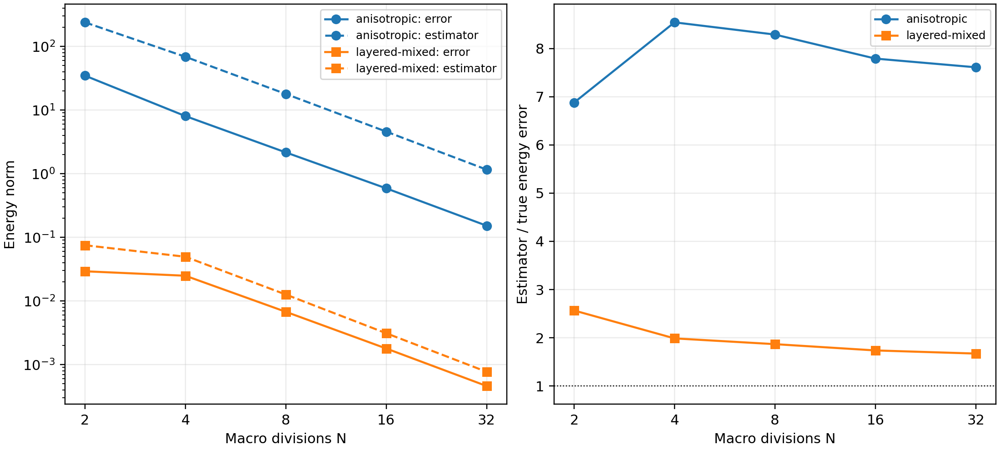

# Energy estimator with material weights and mixed boundary data

`estimate_weighted_darcy_error` uses the flux reconstruction and orthogonal
energy decomposition of
[Barrenechea, Martins, Pereira and Valentin](https://doi.org/10.1137/24M1673073).
It extends the identity-diffusion implementation to symmetric positive-definite
permeability, with explicit material-dependent constants and represented mixed
boundary data.

## Published and energy-normalized conventions

`estimate_darcy_indicator(..., convention="published")` evaluates the printed
equations (5.3)–(5.7) directly:

$$
\eta^{\rm pub}_{1,K}=\|A\nabla u_h+\sigma_h\|_K,\qquad
\eta^{\rm pub}_{3,K}=\frac{H_K}{\pi}
\|\Pi_m\operatorname{div}\sigma_h-\operatorname{div}\sigma_h\|_K,
$$

with the same nonconformity term and the factor \(H_K/\pi\) in data oscillation.
The returned `PublishedDarcyIndicator` identifies that convention explicitly.
For general SPD material, its total is the published numerical indicator;
it is not assigned a coefficient-independent physical-energy upper bound.
Its `energy_error` method still measures the genuine material-weighted error.
No ellipticity certificate enters the printed terms.

`convention="energy"` selects the material weights derived below.
`estimate_weighted_darcy_error` is the corresponding direct entry point.
The two conventions coincide for identity diffusion. Keeping the pressure
problem fixed while scaling diffusion and source by \(c\) scales the printed
flux, divergence and oscillation terms by \(c\), while the nonconformity term
scales by \(\sqrt c\). Every energy-normalized term scales by \(\sqrt c\).
The API tests verify these distinct scalings.

Both adaptive Darcy entry points accept `estimator_convention`, with
`"energy"` as their default. Selecting `"published"` changes only the indicators
and resulting marking, not the assembled finite-element equations.
The [SPE10 study](spe10-adaptive.md) uses the printed convention in its
four-local-triangle P2/P0 campaign and distinguishes its remeshing policy from
the article's unspecified FreeFem++ metric.

## Norms and reliability conditions

Let $A$ be the permeability, $u_h$ the broken primal field, $s_h$ its conforming
Oswald potential and $\sigma_h$ the reconstructed physical flux. On each
macrotriangle $K$, let $\alpha_K>0$ be a certified lower bound for the smallest
eigenvalue of $A$. Define

$$
\begin{aligned}
\eta_{1,K}&=\|A^{-1/2}(A\nabla u_h+\sigma_h)\|_K,\\
\eta_{2,K}&=\|A^{1/2}\nabla(u_h-s_h)\|_K,\\
\eta_{3,K}&=\frac{H_K}{\pi\sqrt{\alpha_K}}
\|\Pi_m\operatorname{div}\sigma_h-\operatorname{div}\sigma_h\|_K,\\
\eta_{\mathrm{osc},K}&=\frac{H_K}{\pi\sqrt{\alpha_K}}
\|f-\Pi_m f\|_K.
\end{aligned}
$$

Here $\Pi_m$ is the continuous macro-local polynomial projection and $H_K$
is the macrotriangle diameter. The energy-normalized estimate is

$$
\|A^{1/2}\nabla_h(u-u_h)\|^2
\leq\sum_K\left[(\eta_{1,K}+\eta_{3,K}+
\eta_{\mathrm{osc},K})^2+\eta_{2,K}^2\right].
$$

The derivation takes the dual supremum in the **energy norm**. Cauchy–Schwarz
gives the $A^{-1/2}$ weight in the flux term. Subtracting the macrocell mean
and applying Poincaré's inequality gives $H_K/(\pi\sqrt{\alpha_K})$.
Orthogonal energy projection separates the conforming residual and
nonconformity contributions. For $A=I$ and zero Dirichlet data, the implementation
reduces to the existing [unit-diffusion estimator](https://github.com/volpatto/pymhm/blob/main/docs/cases/estimator.md).

This bound requires continuous-test flux equilibrium, conforming local fine
meshes, $k\geq\ell+2$, $\ell\leq m\leq k$, and exact integration. The code
checks equilibrium numerically and evaluates the indicators by quadrature;
it does not provide interval-certified integrals. Point-source wells are outside
this $L^2$-source energy estimate.

Literal constant tensors and Cartesian material fields provide eigenvalue bounds
directly. Other coefficient callbacks require `ellipticity_lower_bound`, either
one scalar or one value per macrocell. Sampling checks that the bound is not
violated at quadrature points; the caller supplies its validity between them.

## Boundary and interface treatment

The recovered potential imposes $g_D$ only on Dirichlet nodes. Its trace must
represent that boundary function exactly. The reconstructed normal flux must
also represent $g_N$ on Neumann faces. Both conditions are checked; an unmeasured
boundary approximation term is not omitted. The Neumann convention is outward
physical flux, $\sigma\cdot n=g_N$.

Cartesian material interfaces split volume and face quadrature geometrically.
At an interface, each incident fine cell supplies its own material limit.
The original pressure field and its discontinuous gradients are preserved.

## Verification

The lightweight tests check energy scaling under $A\mapsto cA$, reduction to
the identity case, anisotropic polynomial patches with nonzero mixed boundary
data, and tangential flux jumps between materials. Scaling diffusion by $c$
must scale both the true energy error and all estimator terms by $\sqrt c$.

The research campaign uses five macro resolutions for two exact problems:

- The oscillatory pressure $\sin(2\pi x)\sin(2\pi y)$ with a rotated tensor
  of eigenvalues $100$ and $1$ and homogeneous Dirichlet data.
- A two-layer field with permeabilities $1$ and $100$, exact flux
  $(\cos(2\pi x),0)$, represented pressure data on the vertical sides and
  zero flux on the horizontal sides.

Both use local $P_3$, degree-one skeletal traces and RT2 reconstruction.
These manufactured material-weight checks complement the published smooth
case; they are identified separately from the article's heterogeneous reservoir
experiment.

Effectivity above one verifies the bound numerically for these runs. Its size
also measures how conservative the material and Poincaré weights are; a large
effectivity is not evidence of a correspondingly large solution error.

Run `pixi run -e notebooks python examples/verify_weighted_estimator.py`.
The records in `examples/results/weighted-estimator.json` retain every separate
term, true error, effectivity and equilibrium defect. Research refinement runs
are separate from CI.
