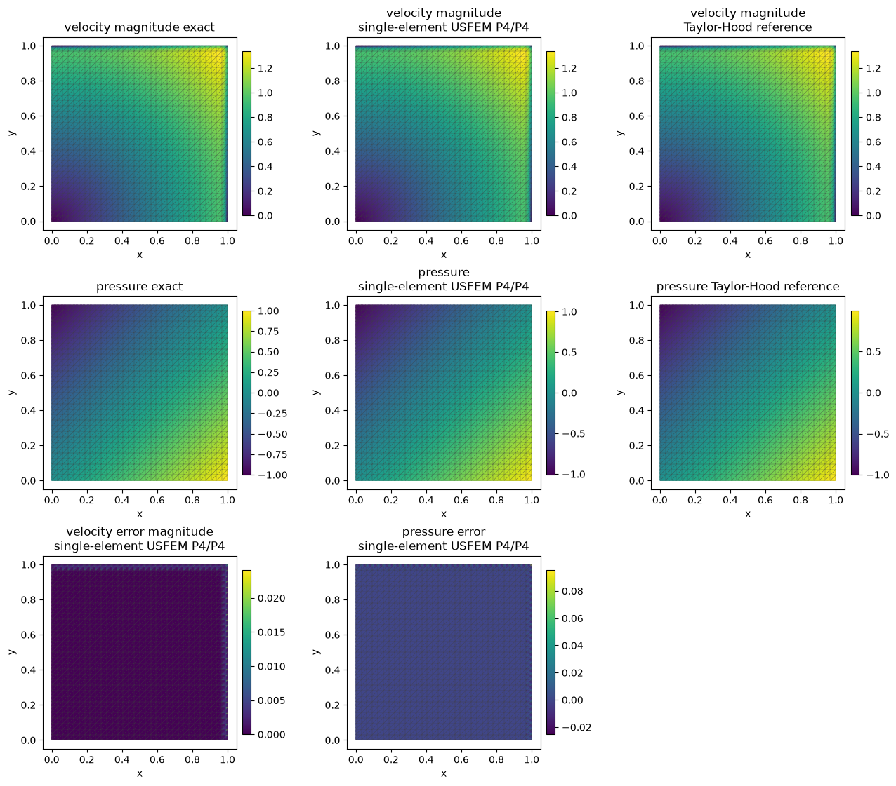

# Incompressible Brinkman boundary layers

This analytical velocity/pressure problem contains exponential layers near
the upper and right walls. MHM with Taylor–Hood local spaces and MHM-USFEM
with equal-order local spaces solve the same physical operator, boundary
data and pressure gauge.

## Physical problem

On $\Omega=(0,1)^2$, the vector-Laplacian Brinkman equation is

$$
\begin{aligned}
-\nu\Delta\boldsymbol u+\gamma\boldsymbol u+\nabla p&=\boldsymbol f,
&\nabla\cdot\boldsymbol u&=0,\\
\nu&=10^{-2}, &\gamma&=1.
\end{aligned}
$$

The independently defined analytical fields are

$$
\begin{aligned}
g(s)&=\frac{e^{(s-1)/\nu}-e^{-1/\nu}}{1-e^{-1/\nu}},\\
\boldsymbol u_*&=(y-g(y),\,x-g(x)), &p_*&=x-y,\\
\boldsymbol f&=
\frac{(e^{(y-1)/\nu},e^{(x-1)/\nu})}
{\nu(1-e^{-1/\nu})}
+\gamma\boldsymbol u_*+(1,-1).
\end{aligned}
$$

Velocity equals $\boldsymbol u_*$ on the complete exterior; pressure has
zero volume mean. The layer width is $\nu$ for these manufactured data.

## Multiscale formulation and implementation

For each macrotriangle, the symmetric saddle form is

$$
\begin{aligned}
a_T((\boldsymbol u,p),(\boldsymbol v,q))
&=(\nu\nabla\boldsymbol u,\nabla\boldsymbol v)_T
+(\gamma\boldsymbol u,\boldsymbol v)_T\\
&\quad-(p,\nabla\cdot\boldsymbol v)_T
-(q,\nabla\cdot\boldsymbol u)_T.
\end{aligned}
$$

The local interface variable is
$\boldsymbol\lambda_F=(-\nu\nabla\boldsymbol u+pI)\boldsymbol n_F$,
the negative vector-Laplacian pseudotraction. The global equations enforce
velocity-continuity moments, prescribed exterior velocity, and the
single physical mean-pressure constraint. Symmetric Cauchy stress would
define a different boundary form.

The local UFL form in the application mirrors the variational equation:

~~~python
a = (
    nu * ufl.inner(ufl.grad(u), ufl.grad(v))
    + gamma * ufl.inner(u, v)
    - p * ufl.div(v)
    - q * ufl.div(u)
) * dx
load = ufl.inner(force, v) * dx
~~~

USFEM additionally subtracts the momentum-residual pairing
$\sum_\tau\tau_\tau(R(\boldsymbol u,p),R(\boldsymbol v,q))_\tau$ and its
matching source term, where
$R=-\nu\Delta\boldsymbol u+\gamma\boldsymbol u+\nabla p$.
The inverse bound is evaluated on the executed local polynomial space.

The [complete application](../notebooks/stokes_brinkman_boundary_layer.md)
defines these residuals, spaces, boundary coupling and gauge before assembly.
Four local subdivisions supply interior vertices for the 2D Taylor–Hood
$P_2/P_1$ submesh. Its equal-order USFEM comparison uses the same local
velocity mesh and trace space. Separate single-element
$P_{\ell+2}/P_{\ell+2}$ families use the literature's unsplit traces.

## Results and reproducibility

Velocity, pressure, gradient and divergence are evaluated separately against
the exact fields. A classical conforming Taylor–Hood reference is also
refined independently on the same data. Macro mass balance and fine-cell
divergence are distinct diagnostics.

The unsplit-trace single-element family with $\ell=2$ and 64 macro divisions
has velocity L2 error $6.0896\times10^{-5}$, pressure L2 error
$2.4764\times10^{-4}$ and gradient error $3.569\times10^{-2}$.
These recorded layer results are distinct from the smooth asymptotic
qualification in the [Stokes–Brinkman tutorial](../../tutorials/methods/stokes-brinkman.md).

The [application notebook and downloads](../notebooks/stokes_brinkman_boundary_layer.md)
include analytical fields, one-sided profiles, error integration and precise
space/parameter records. The [result report](../../cases/introduction-layers.md#incompressible-brinkman-flow)
retains measured refinement slopes and independently assembled checks.
Historical mesh connectivity and inverse constants are not completely
specified by the article; agreement with every original plotted ordinate
is not asserted.

## References

- Rodolfo Araya, Christopher Harder, Abner H. Poza and Frédéric Valentin
  (2017). *Multiscale hybrid-mixed method for the Stokes and Brinkman
  equations—The method*.
  [DOI: 10.1016/j.cma.2017.05.027](https://doi.org/10.1016/j.cma.2017.05.027).
- Rodolfo Araya, Christopher Harder, Abner H. Poza and Frédéric Valentin
  (2025). *Multiscale Hybrid-Mixed Methods for the Stokes and Brinkman
  Equations—A Priori Analysis*.
  [DOI: 10.1137/24M1649368](https://doi.org/10.1137/24M1649368).
