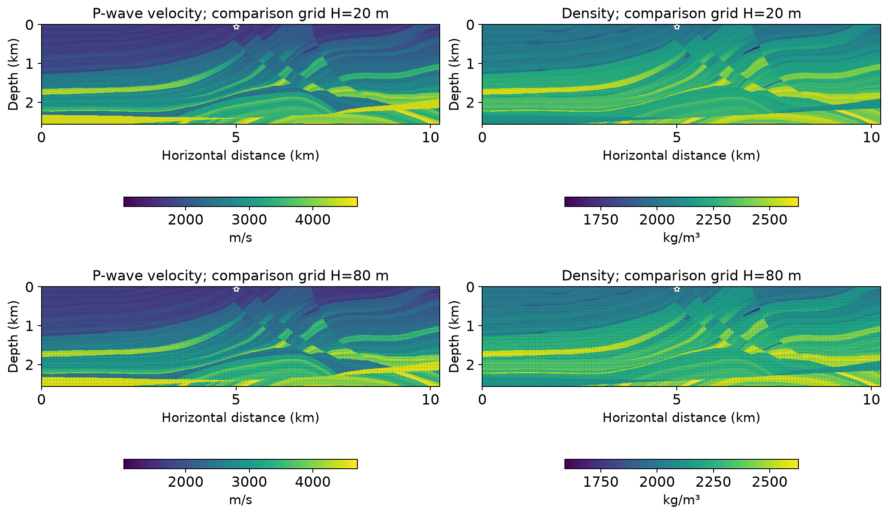

# Acoustic propagation in Marmousi II

A 20 Hz point source generates a complex pressure field in a heterogeneous
geological model. This frequency-domain application uses a declared crop of
the primary Marmousi II velocity and density data, with material interfaces
resolved by the local meshes.



The **top row** overlays the comparison grid with $H=20$ m; the **bottom
row** overlays the grid with $H=80$ m. The **left column** shows P-wave
velocity in m/s, and the **right column** shows density in kg/m$^3$.
Both rows use the same material samples; only the overlaid grid changes.
The white star marks the acoustic source. These panels describe the
physical material used in the pressure equation.

## Physical problem

Horizontal distance $x$ and depth $z$ are in metres. With density $\rho$,
sound speed $c$ and bulk modulus $\kappa=\rho c^2$, the equation is

$$
\begin{aligned}
\Omega&=(0,10240)\times(0,2560),\\
-\nabla\cdot(\rho^{-1}\nabla p)
-\omega^2\kappa^{-1}p&=\delta_{(5000,50)},\\
\omega&=2\pi(20\ {\rm Hz}).
\end{aligned}
$$

The top has $p=0$. The remaining sides impose outgoing impedance:

$$
\rho^{-1}\partial_n p
-\mathrm i\omega(\rho\kappa)^{-1/2}p=0.
$$

The selected $2048\times512$ material cells have width 5 m and crop origin
$(3395,515)$ m in the primary data. Each cell value is a primary sample,
without interpolation or averaging. Density and velocity are converted to
kg/m$^3$ and m/s before computing $\kappa$.

## Multiscale formulation and implementation

The executed MHM field uses $512\times128$ macroquadrilaterals of width
$H=20$ m, local continuous $Q_3$ on $8\times8$ fine quadrilaterals, and
linear conormal traces. There are 261,888 free complex trace unknowns.

Inside each macroelement, the volume form is

$$
a_T(p,v)=\int_T\rho^{-1}\nabla p\cdot\nabla\overline v
-\omega^2\int_T\kappa^{-1}p\overline v
-\mathrm i\omega\int_{\partial T\cap\Gamma_A}
\frac{p\overline v}{\sqrt{\rho\kappa}}.
$$

The local equation adds the oriented normal-flux trace pairing on active
faces. The global equation sets pressure-jump moments to zero on interior
faces and prescribed-pressure moments on the top. Absorbing flux follows
the impedance condition; it is not an independently prescribed zero flux.
The point functional is evaluated at its physical location. Since this
source lies on a macroface, each incident macroelement receives half its
unit strength.

The application's provider builds the complex form and passes its exact
real/imaginary embedding to the generic equation API:

```python
matrix = stiffness - omega**2 * mass
# Outgoing boundary integrals are included in matrix before this declaration.
coupling = sparse.kron(pairing, sparse.eye(2)).toarray()
local_equations = LocalEquations(
    a=realify_operator(matrix),
    L=realify_vector(load),
    b=coupling,
    c=-coupling.T,
    dofs=skeleton.cell_dofs(cell),
    g=-realify_vector(boundary),
)
```

See the [Helmholtz method tutorial](../../tutorials/methods/helmholtz.md) for
the local/global derivation and the
[Marmousi notebook](https://github.com/ipes-lncc/pymhm/blob/main/notebooks/waves/helmholtz/72_marmousi.ipynb)
for data preparation, a smaller full-crop solve and the complete-study option.
The default notebook configuration and the large acquired calculation have
different approximation spaces; both are stated explicitly.

## Results and reproducibility

An independent DOLFINx/UFL conforming reference is refined from $P_1$ to
$P_4$ on the material mesh. Its last global pressure L2 increment is
0.0786%; the MHM/P4 pressure difference is 2.6935%. Derivative comparisons
exclude the fixed $50\times50$ m square containing the singular source;
the MHM/P4 acoustic-flux difference on that domain is 3.0369%.

These are differences from a refined numerical reference, not exact errors.
The selected data are not identified with the historical coefficient arrays
in the method article, so this application does not claim a literal
reproduction of its table. The [full report](../../cases/marmousi.md)
provides source URLs, checksums, norm definitions, original-equation checks
and the acquisition/replay commands.

## References

- Gary S. Martin, Robert Wiley and Kurt J. Marfurt (2006). *Marmousi2: An
  elastic upgrade for Marmousi*.
  [DOI: 10.1190/1.2172306](https://doi.org/10.1190/1.2172306).
- Théophile Chaumont-Frelet and Frédéric Valentin (2020). *A Multiscale
  Hybrid-Mixed Method for the Helmholtz Equation in Heterogeneous Domains*.
  [DOI: 10.1137/19M1255616](https://doi.org/10.1137/19M1255616).
