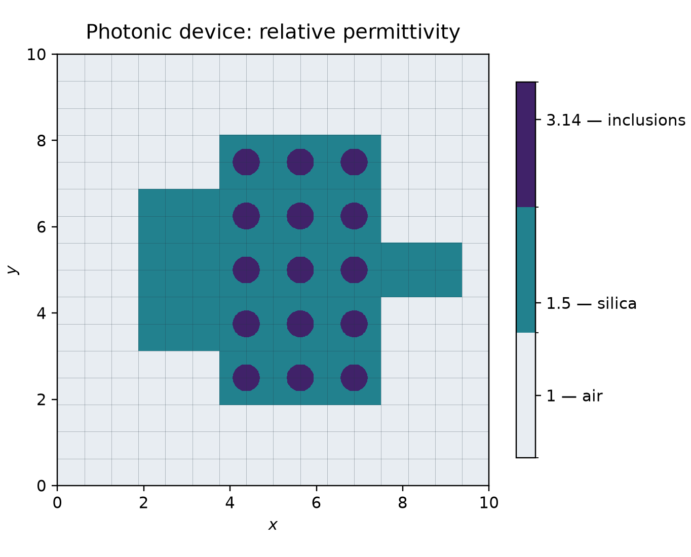

# Waves in a photonic device

An incident electromagnetic wave crosses a silica device containing fifteen
circular inclusions. The material geometry redirects the wave; local DG
electric and magnetic fields communicate through tangential macroface traces.

This figure shows the declared material, rather than a computed wave snapshot.
Its three colors denote air, silica and inclusions.

## Physical problem

The two-dimensional TM system on $\Omega=(0,10)^2$ has electric component
$E_z$ and magnetic vector $\boldsymbol H=(H_x,H_y)$:

$$
\begin{aligned}
\epsilon\,\partial_t E_z-\operatorname{curl}\boldsymbol H&=0,\\
\mu\,\partial_t\boldsymbol H+\operatorname{curl}E_z&=0.
\end{aligned}
$$

Here $\operatorname{curl}\boldsymbol H=\partial_xH_y-\partial_yH_x$ and
$\operatorname{curl}E_z=(\partial_yE_z,-\partial_xE_z)$. Magnetic
permeability is one. Relative permittivity is 1 in air, 1.5 in silica and
3.14 in the circular inclusions; these are permittivities, not refractive
indices to be squared.

The silica is the union of three rectangles:
$[3.75,7.5]\times[1.875,8.125]$,
$[1.875,3.75]\times[3.125,6.875]$ and
$[7.5,9.375]\times[4.375,5.625]$.
Inclusions have radius 0.3125 and centers

$$
\{4.375,5.625,6.875\}\times\{2.5,3.75,5,6.25,7.5\}.
$$

Initial fields vanish. A causal unit-amplitude incident wave and absorbing
boundary data are

$$
\begin{aligned}
E_i(t,x,y)&=\mathbf1_{t\geq x}\sin(\pi(t-x)),\\
\boldsymbol H_i&=(0,-E_i),\\
E_z-(\boldsymbol H\times\boldsymbol n)&=(1-n_x)E_i.
\end{aligned}
$$

The publication supplies frequency and final time, but not a unique phase
and turn-on convention. These declared data are identical in every
comparison; they are not identified with an unspecified historical transient.

## Multiscale formulation and implementation

The two acquired MHM configurations use $16\times16$ macros with
$8\times8$ local DG $Q_2$ cells, or $8\times8$ macros with $16\times16$
local cells. Both have $128\times128$ fine quadrilaterals. Tangential
$P_1$ traces use one segment per local boundary edge. The macro time
increment is 0.01.

For an electric kick of duration $\tau$, midpoint electric field $w$ and
canonical trace $\lambda=\boldsymbol H\times\boldsymbol n$ satisfy

$$
\begin{aligned}
M_e w+\tfrac{\tau}{2}Q\lambda
&=M_e E_{\rm old}+\tfrac{\tau}{2}(F-C^{\mathsf T}H),\\
-\sum_T Q_T^{\mathsf T}w_T+Z\lambda&=-b,\\
E_{\rm new}&=2w-E_{\rm old}.
\end{aligned}
$$

The first row is local; the second is the global tangential equation,
including exterior impedance $Z$ and boundary moments $b$.
With $C=-\operatorname{curl}$, the magnetic update is the independent
local mass problem $M_hH_{\rm new}=M_hH_{\rm old}+\Delta t\,CE$.

The application passes the electric equation to the generic API:

~~~python
return LocalEquations(
    a=local.electric_mass,
    L=local.electric_mass @ electric + duration / 2 * (source - local.curl.T @ magnetic),
    b=duration / 2 * local.coupling,
    c=-local.coupling.T,
    dofs=local.trace_dofs,
)
~~~

The [Maxwell tutorial](../../tutorials/methods/maxwell.md) explains these
providers and the global equation separately from the device. The
[application notebook](https://github.com/ipes-lncc/pymhm/blob/main/notebooks/waves/maxwell/66_maxwell_nanoguide.ipynb)
specifies the material and transient, invokes the declared equations, and
reads the archived componentwise comparisons.

## Results and reproducibility

At matched staggered times $t_E=11.315$ and $t_H=11.31$, the two MHM
configurations differ from the finest classical DG reference by 0.835%
and 0.724% in combined unweighted physical L2 field norm. A coarse
$32\times32$ classical DG calculation differs by 13.01%.

The finest reference has $1024\times1024$ DG $Q_2$ cells and time step
0.00125. Separate reference spatial, temporal and material-quadrature
controls give increments 0.127%, 0.080% and 0.035%, respectively.
These numerical-reference increments quantify sensitivity; they are not
rigorous bounds on its remaining error.

The [complete result report](https://github.com/ipes-lncc/pymhm/blob/main/docs/cases/maxwell-nanoguide.md)
provides componentwise norms, physical times, reference controls and reproduction
commands. The material figure is reproducible from the application's
permittivity function; its [plot record](../../assets/gallery/maxwell-permittivity.json)
states source hashes and its material-only scope.

## References

- Stéphane Lanteri, Diego Paredes, Claire Scheid and Frédéric Valentin (2018).
  *The Multiscale Hybrid-Mixed method for the Maxwell Equations in
  Heterogeneous Media*.
  [DOI: 10.1137/16M110037X](https://doi.org/10.1137/16M110037X).
