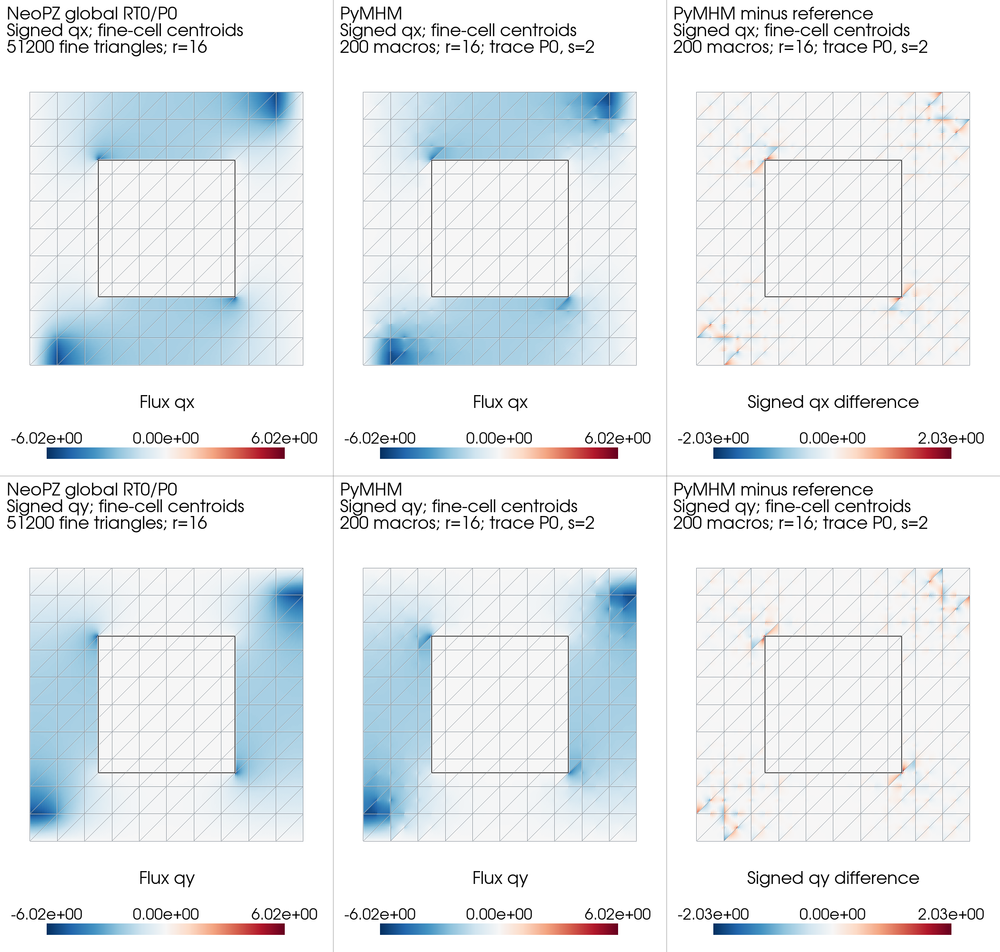

# Flow around a low-permeability obstacle

A central barrier redirects Darcy flow between an injection region and an
extraction region. The barrier crosses macroelement interiors, while local
fine meshes retain both materials. This application illustrates the effect
of resolving a material intersection in the macroface trace space.



## Physical problem

On the unit square, the centered obstacle occupies one quarter of the area:

$$
\begin{aligned}
D&=[0.25,0.75]^2,\\
K&=\begin{cases}10^{-4},&(x,y)\in D,\\1,&(x,y)\notin D,\end{cases}\\
\boldsymbol q&=-K\nabla p, &\nabla\cdot\boldsymbol q&=f,\\
f&=-100\mathbf1_{[0,0.1]^2}+100\mathbf1_{[0.9,1]^2}.
\end{aligned}
$$

The integrated extraction and injection rates are $-1$ and $+1$. Every
exterior face has zero normal flux, and $\int_\Omega p=0$ fixes the pressure.
The finite-area wells remain fixed during refinement. They define a separate
benchmark from the corner Dirac wells also documented in the accompanying
notebook.

## Multiscale formulation and implementation

The macro mesh has 200 triangles from a $10\times10$ square grid. The mixed
local method uses RT0 Darcy flux and P0 pressure on material-fitted fine
triangles. For a prescribed oriented macroface flux $\lambda$, each local
problem satisfies

$$
\begin{aligned}
(K^{-1}\boldsymbol q_T,\boldsymbol v)_T
-(p_T,\nabla\cdot\boldsymbol v)_T&=0
&&\text{for }\boldsymbol v\cdot\boldsymbol n_T=0,\\
(\nabla\cdot\boldsymbol q_T,w)_T&=(f,w)_T,\\
\boldsymbol q_T\cdot\boldsymbol n_T&=s_{TF}\lambda.
\end{aligned}
$$

The retained local pressure constants and global pressure-continuity moments
complete the hybrid system, with the physical mean-pressure constraint.
RT0 normal continuity and fine-cell balance apply to this mixed flux.
A primal local pressure alternative instead produces the broken flux
$-K\nabla p_h$, with different fine-scale conservation properties.

The application declares its material and fixed wells directly:

```python
def permeability(points):
    x, y = points.T
    obstacle = (x >= 0.25) & (x <= 0.75) & (y >= 0.25) & (y <= 0.75)
    return np.where(obstacle, 1e-4, 1.0)


def source(points):
    x, y = points.T
    extraction = (x <= 0.1) & (y <= 0.1)
    injection = (x >= 0.9) & (y >= 0.9)
    return 100.0 * (injection.astype(float) - extraction.astype(float))
```

The [mixed MHM tutorial](../../tutorials/methods/mixed-mhm.md) derives the
local and global operators. The
[quarter-five-spot notebook](https://github.com/ipes-lncc/pymhm/blob/main/notebooks/darcy/22_quarter_five_spot.ipynb)
checks geometry and well rates and displays the archived fields. The
[complete application report](../../cases/quarter-five-spot.md#supplemental-central-obstacle)
specifies spaces, assembly, gauges and reproduction commands.

## Results

At 16 local subdivisions, increasing the constant trace partition from one
to two to four segments reduces the flux difference from the same-grid
classical RT0 field from 42.90% to 6.20% to 2.54%. Two segments place a
trace endpoint at each midpoint material intersection; four further enrich
the trace space. Local refinement alone does not remove a fixed trace error.

The classical reference is independently refined through 204,800 fine
triangles. Its final flux increment is 1.73%, so reference sensitivity remains
significant in the best comparison. These numerical differences are not
certified errors against an exact solution. Separate matching-operator
comparisons with independently assembled Basix and NeoPZ operators verify
the declared discrete equations.

## References

- Christopher Harder, Diego Paredes and Frédéric Valentin (2013). *A family
  of Multiscale Hybrid-Mixed finite element methods for the Darcy equation
  with rough coefficients*.
  [DOI: 10.1016/j.jcp.2013.03.019](https://doi.org/10.1016/j.jcp.2013.03.019).
- Omar Durán, Philippe R. B. Devloo, Sônia M. Gomes and Frédéric Valentin
  (2019). *A multiscale hybrid method for Darcy’s problems using mixed finite
  element local solvers*.
  [DOI: 10.1016/j.cma.2019.05.013](https://doi.org/10.1016/j.cma.2019.05.013).
