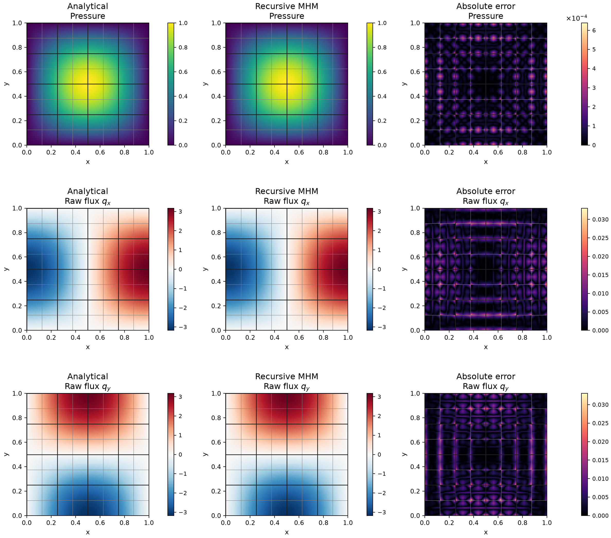

# Darcy flow on nested scales

An outer MHM problem can use another MHM problem as each local solver.
This application compares that recursive construction with a flat MHM
system using exactly the same leaf meshes and approximation spaces.

## Physical problem

On the unit square, permeability is the identity. Two boundary conditions
share the same source:

$$
\begin{aligned}
p_{*,0}&=\sin(\pi x)\sin(\pi y),\\
p_{*,1}&=1+x-y+\sin(\pi x)\sin(\pi y),\\
-\Delta p&=2\pi^2\sin(\pi x)\sin(\pi y),\\
\boldsymbol q&=-\nabla p.
\end{aligned}
$$

The corresponding exact pressure is prescribed weakly on the whole
exterior. The first problem has zero pressure there; the second has
$1+x-y$. These Dirichlet data fix the global pressure constant without a
mean-pressure constraint.

## Multiscale formulation and implementation

Each outer rectangle contains $2\times2$ inner macrorectangles, each of
which contains $2\times2$ fine quadrilaterals. Leaf pressures use continuous
$Q_2$ and inner faces use $P_1$ conormal traces. Two independent $P_1$
segments per parent face exactly represent its two inner boundary faces.

Let $A_{\rm in}x=b_{\rm in}$ be an inner hybrid system, including its
retained constant modes. The selector $P$ extracts its boundary trace and
the signed map $T$ injects the outer trace into that boundary. The outer
local equation is

$$
\begin{bmatrix}-A_{\rm in}&P\\P^{\mathsf T}&0\end{bmatrix}
\begin{bmatrix}x\\\mu\end{bmatrix}
+\begin{bmatrix}0\\-T\end{bmatrix}\lambda
=\begin{bmatrix}-b_{\rm in}\\0\end{bmatrix}.
$$

Thus $P^{\mathsf T}x=T\lambda$. The parent continuity pairing is
$-T^{\mathsf T}\mu$. The outer global equation imposes pressure-jump
moments and the stated exterior pressure moments. No projection or
averaging changes the inner trace space.

The [recursive MHM tutorial](../../tutorials/methods/recursive-mhm.md)
shows how the nested local problem delegates condensation to the shared
local-problem machinery. The
[application notebook](https://github.com/ipes-lncc/pymhm/blob/main/notebooks/darcy/36_recursive_mhm.ipynb)
defines the two physical loads, inner and outer meshes, nested restriction,
assembly and field evaluation. The executed numerical basis and its moments
are retained for reconstruction at every level.

## Results and reproducibility

Five outer mesh levels, from $1\times1$ to $16\times16$, give final measured
orders 3.0019 for pressure L2 and 2.0009 for raw-flux L2. The relative
physical difference between recursive and flat fields is at most
$7.01\times10^{-14}$. Their finest global systems have 2,432 and 5,248
unknowns, respectively; this unknown reduction is not a measured runtime
speedup.

An independently assembled complete original Q2/P1 hybrid system verifies
the same discrete geometry, sources, boundaries and spaces. This is a
matching-system reference, rather than a classical conforming baseline.
The exact solution supplies the accuracy assessment.

The [full result report](../../cases/nested.md) provides integrated norms,
archive digests and reproduction commands. The displayed physical flux is
the leafwise raw gradient; it is not an H(div) reconstruction, and macro
conservation does not imply fine-cell conservation of that gradient.

## References

- Christopher Harder, Diego Paredes and Frédéric Valentin (2013). *A family
  of Multiscale Hybrid-Mixed finite element methods for the Darcy equation
  with rough coefficients*, Remarks 7 and 10.
  [DOI: 10.1016/j.jcp.2013.03.019](https://doi.org/10.1016/j.jcp.2013.03.019).
- Christopher Harder and Frédéric Valentin (2016). *Foundations of the MHM
  Method*.
  [DOI: 10.1007/978-3-319-41640-3_13](https://doi.org/10.1007/978-3-319-41640-3_13).
