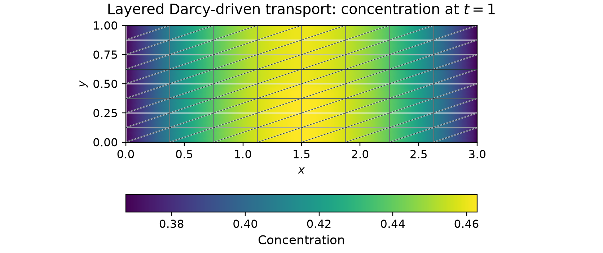

# Transport driven by layered Darcy flow

Two permeability layers create different Darcy velocities and dispersion
tensors. The computed conservative Darcy field drives a backward-Euler
concentration solve. An independently manufactured concentration makes the
temporal accuracy measurable without a numerical reference.

## Physical problem

On $\Omega=(0,3)\times(0,1)$, the steady Darcy pressure and flux are

$$
\begin{aligned}
K(y)&=\begin{cases}1,&y<1/2,\\10,&y\geq1/2,\end{cases}\\
p_*&=3-x, &\boldsymbol q_*&=(K(y),0).
\end{aligned}
$$

The pressure $3-x$ is prescribed on the exterior. Darcy has zero source.
The transport velocity is the computed RT0 flux, $\beta=\boldsymbol q_h$.
Unit capacity, zero reaction and hydrodynamic dispersion give

$$
\begin{aligned}
\partial_t c+\nabla\cdot(-D\nabla c+\beta c)&=f,\\
D(\beta)&=(\alpha_m+\alpha_t\lvert\beta\rvert)I+
(\alpha_l-\alpha_t)\frac{\beta\otimes\beta}{\lvert\beta\rvert},\\
\alpha_m&=10^{-6},\qquad
\alpha_l=10^{-2},\qquad\alpha_t=10^{-3}.
\end{aligned}
$$

At zero velocity the dispersion law is $\alpha_m I$. For this layered
field, $D_{xx}=\alpha_m+\alpha_lK$ and
$D_{yy}=\alpha_m+\alpha_tK$.

The independently derived analytical concentration and source are

$$
\begin{aligned}
c_*(x,y,t)&=e^{-t}b(x),
&b(x)&=1+\frac{x(3-x)}9,\\
f&=e^{-t}\left[-b(x)+\frac{2(\alpha_m+\alpha_lK)}9
+\frac{K(3-2x)}9\right].
\end{aligned}
$$

Initial concentration is $b(x)$. The vertical walls prescribe
$c=e^{-t}$, and the horizontal walls have zero diffusive flux.
Normal advective and diffusive fluxes vanish across the horizontal material
interface for the exact field.

## Multiscale formulation and implementation

The displayed calculation uses 128 actual macrotriangles, fitted to the
material interface, with 16 fine triangles inside each macrotriangle:
2,048 fine triangles in total. Darcy uses RT0/P0; transport uses local continuous
$P_3$ with SUPG and degree-two macroface traces. Both problems retain the
same physical fine partition.

The backward-Euler local equation includes both mass terms:

$$
\begin{aligned}
\left(\frac{c_T^{n+1}-c_T^n}{\Delta t},v\right)_T
+a_T(c_T^{n+1},v)
+\langle\lambda_T^{n+1},v\rangle_{\partial T}
&=(f^{n+1},v)_T,\\
a_T(c,v)&=(D\nabla c,\nabla v)_T\\
&\quad+\tfrac12\big[(\beta\cdot\nabla c,v)_T
-(c,\beta\cdot\nabla v)_T\big].
\end{aligned}
$$

SUPG adds the full time/spatial residual against the streamline test,
including the matching source and previous-state mass. The global
equation imposes concentration-continuity moments. Its interior multiplier
is $(-D\nabla c+\tfrac12\beta c)\cdot n_T$; it differs from the full
physical transport flux. Exterior natural data prescribe diffusive flux,
and the vertical concentration is imposed strongly.

The [transient transport tutorial](../../tutorials/methods/transient-transport.md)
writes the mass, local and global UFL equations and time loop explicitly.
The [Darcy-coupled application notebook](https://github.com/ipes-lncc/pymhm/blob/main/notebooks/transport/26_adaptive_transient_transport.ipynb)
and [full report](https://github.com/ipes-lncc/pymhm/blob/main/docs/cases/transient-transport.md#a-five-level-temporal-verification)
provide coupling data, dispersion conventions and separate transient studies.
The figure above is a current acquisition of this layered analytical case;
it is not the report's separate random-material pilot.

## Results and reproducibility

The field uses 128 backward-Euler steps. Separate controls refine the actual
macro mesh at fixed time step and halve the time step at fixed spatial spaces:

| Macrotriangles | Fine triangles | Time steps | Concentration L2 error at $t=1$ |
| ---: | ---: | ---: | ---: |
| 32 | 512 | 64 | 0.00601754 |
| 128 | 2,048 | 64 | 0.00602908 |
| 128 | 2,048 | 128 | 0.00302876 |

The errors at the two spatial resolutions are close because the time
discretization dominates this smooth manufactured case. Their small
nonmonotonic change is retained rather than presented as a spatial
convergence rate. Halving the time step gives an observed order of 0.993,
consistent with first-order backward Euler.

For the displayed field, error quadrature orders 10 and 12 give
$0.00302876309360$ and differ by $6.1\times10^{-18}$. The computed Darcy
flux differs from its exactly representable field by $2.06\times10^{-14}$
in L2. The maximum original-equation relative residual over the trajectory
is $7.02\times10^{-16}$ and the maximum discrete balance defect is
$5.77\times10^{-15}$. The
[refinement record](../../assets/gallery/transient-refinement.json) retains
all three configurations and their physical checks.

The [figure record](../../assets/gallery/transient-concentration.json)
identifies the executed source hashes, numerical spaces, physical data and
errors. Broken display samples preserve independent local values and the
actual macro mesh. They are visualization data, rather than restart
coefficients or quadrature points used for the error norms.

## Reproduce the refined field and controls

Use a source checkout with the locked notebook environment. The
[Gallery acquisition helper](https://github.com/ipes-lncc/pymhm/blob/main/examples/gallery_visuals.py)
delegates numerical preparation and time integration to the shared
[layered application owner](https://github.com/ipes-lncc/pymhm/blob/main/examples/transport_campaign.py).
It reuses the material, analytical source, dispersion and boundary definitions
given above; the plotting code does not implement another solver.

Run the following Python code in the notebook environment. Eight Cartesian
divisions in each direction give $2(8^2)=128$ actual macrotriangles;
four edge subdivisions inside each macrotriangle give 16 fine triangles.
Both spatial and temporal resolutions are explicit arguments:

~~~python
from pathlib import Path

from examples.gallery_visuals import layered_transport

directory = Path("build/gallery-transport")
field = layered_transport(
    output=directory / "concentration.png",
    archive=directory / "concentration-display.npz",
    macro_divisions=8,
    steps=128,
    preview=directory / "concentration-preview.png",
)

controls = []
for macro_divisions, steps in ((4, 64), (8, 64)):
    label = f"macro-{macro_divisions}-steps-{steps}"
    controls.append(
        layered_transport(
            output=directory / f"{label}.png",
            archive=directory / f"{label}-display.npz",
            macro_divisions=macro_divisions,
            steps=steps,
        )
    )
~~~

Each call performs the requested solve and original-equation checks, computes
the exact-solution error with two quadrature orders, and writes a figure,
broken display samples and a JSON receipt. The previews use the same computed
field and actual macro mesh. The display archive is not a restart checkpoint.
The source owner's historical defaults remain separate from these explicit
refined settings.

## References

- Christopher Harder, Diego Paredes and Frédéric Valentin (2015). *On a
  Multiscale Hybrid-Mixed Method for Advective-Reactive Dominated Problems
  with Heterogeneous Coefficients*.
  [DOI: 10.1137/130938499](https://doi.org/10.1137/130938499).
