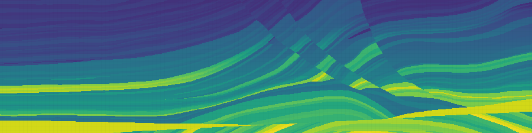
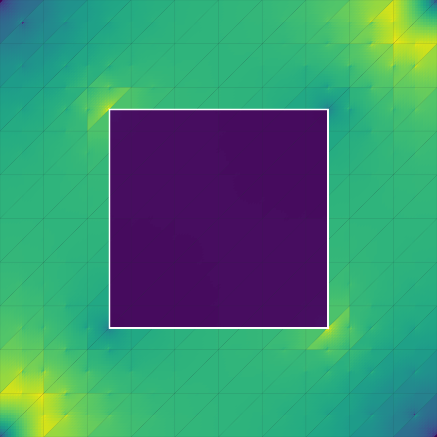
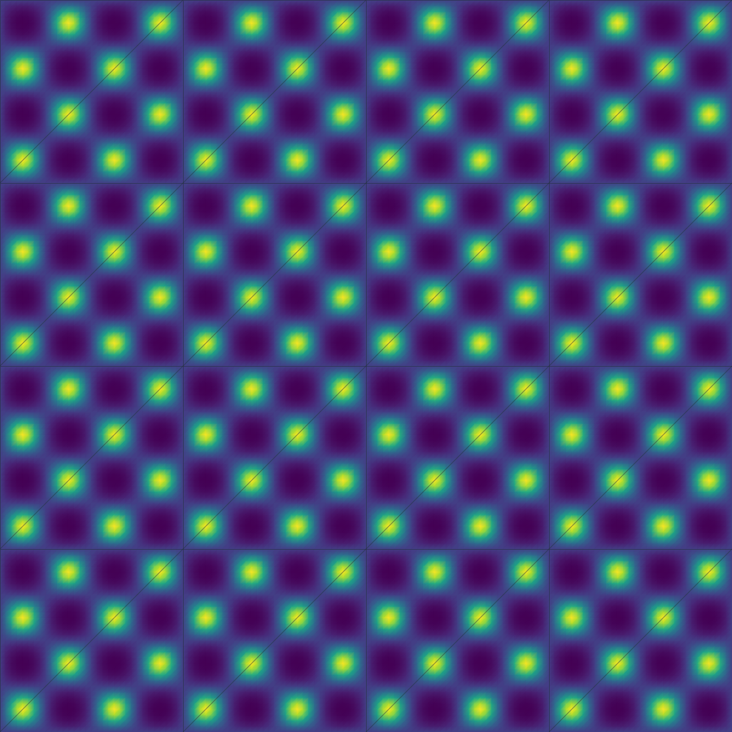
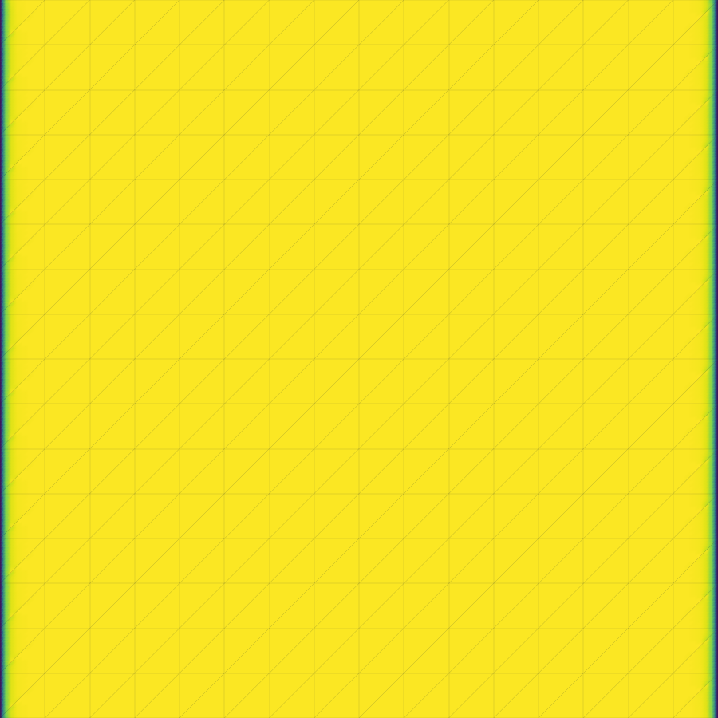
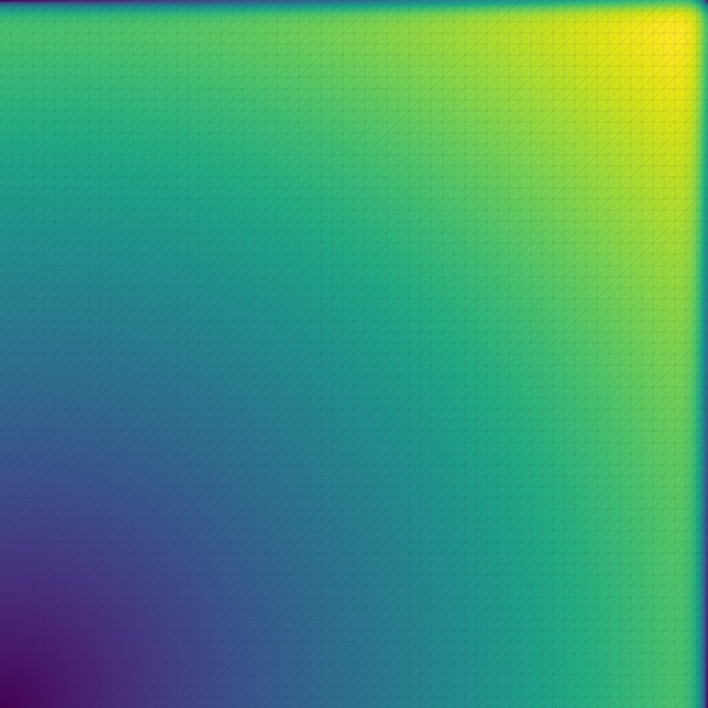
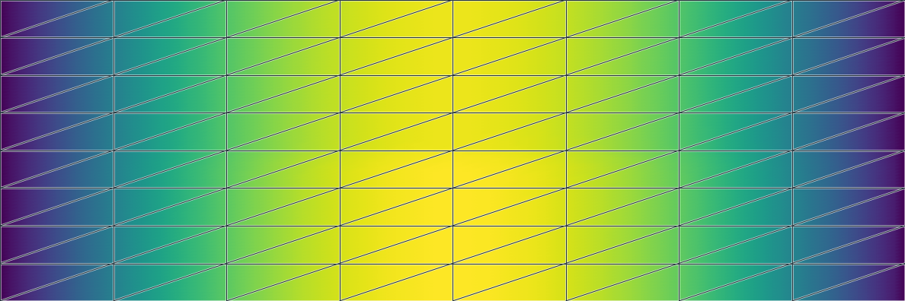
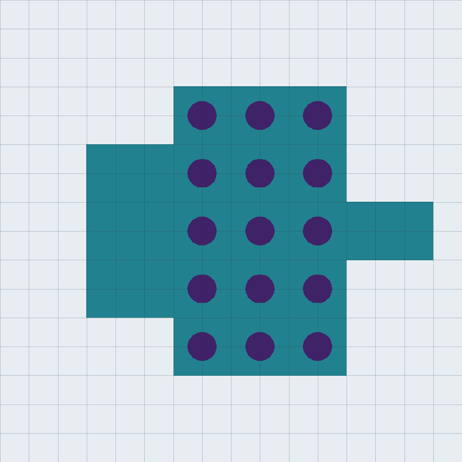
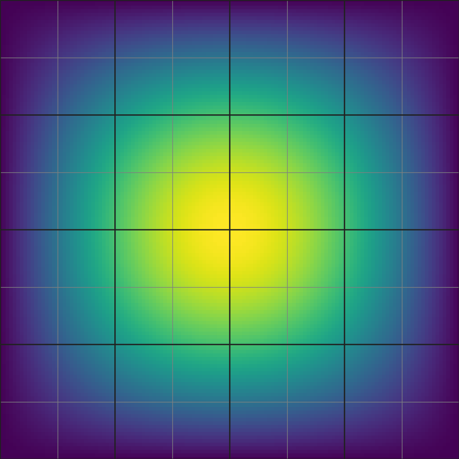

---
hide:
  - toc
---

# Gallery

Explore applications built with PyMHM. Each case states its physical data,
mathematical formulation and implementation, then presents figures and
numerical results. Select a card to open the case.

To learn a method step by step, use the [Tutorials](../tutorials/index.md).
For mesh, solver and execution settings, use the [Guides](../guides/index.md).

  <a class="pymhm-gallery-card" href="applications/spe10/">
    

    

      <h2>SPE10 reservoir flow</h2>
      
Resolve permeability channels in a complete SPE10 layer and compare pressure and Darcy flux.

      Open case →
    

  </a>

  <a class="pymhm-gallery-card" href="applications/marmousi/">
    

    

      <h2>Marmousi II acoustics</h2>
      
Compute the complex pressure generated by a 20 Hz point source in a heterogeneous acoustic medium.

      Open case →
    

  </a>

  <a class="pymhm-gallery-card" href="applications/quarter-five-spot/">
    

    

      <h2>Flow around an obstacle</h2>
      
Explore how a low-permeability inclusion changes pressure and the paths of Darcy flow.

      Open case →
    

  </a>

  <a class="pymhm-gallery-card" href="applications/heterogeneous-elasticity/">
    

    

      <h2>Extension of a heterogeneous solid</h2>
      
Resolve material variations through local displacement fields and compare the physical stress.

      Open case →
    

  </a>

  <a class="pymhm-gallery-card" href="applications/rad-layer/">
    

    

      <h2>Reaction–diffusion boundary layers</h2>
      
Compare Galerkin and residual-stabilized local problems when a narrow layer is difficult to resolve.

      Open case →
    

  </a>

  <a class="pymhm-gallery-card" href="applications/brinkman-layer/">
    

    

      <h2>Incompressible Brinkman layers</h2>
      
Resolve velocity and pressure near a boundary with an analytical layer profile for comparison.

      Open case →
    

  </a>

  <a class="pymhm-gallery-card" href="applications/transient-transport/">
    

    

      <h2>Transport in a layered medium</h2>
      
Follow concentration transported by Darcy flow through materials with different permeabilities.

      Open case →
    

  </a>

  <a class="pymhm-gallery-card" href="applications/maxwell-device/">
    

    

      <h2>Waves in a photonic device</h2>
      
Describe a dielectric waveguide and its holes, excite electromagnetic waves and compare electric and magnetic fields.

      Open case →
    

  </a>

  <a class="pymhm-gallery-card" href="applications/recursive-darcy/">
    

    

      <h2>Darcy flow on nested scales</h2>
      
Use a multiscale local problem inside another multiscale problem and reconstruct its leaf fields.

      Open case →
    

  </a>

  <a class="pymhm-gallery-card" href="applications/parallel-darcy/">
    

    

      <h2>Parallel Darcy simulations</h2>
      
Compare local CPU workers and GPU solvers on the same multiscale operator, with complete workflow timings.

      Open case →
    

  </a>

