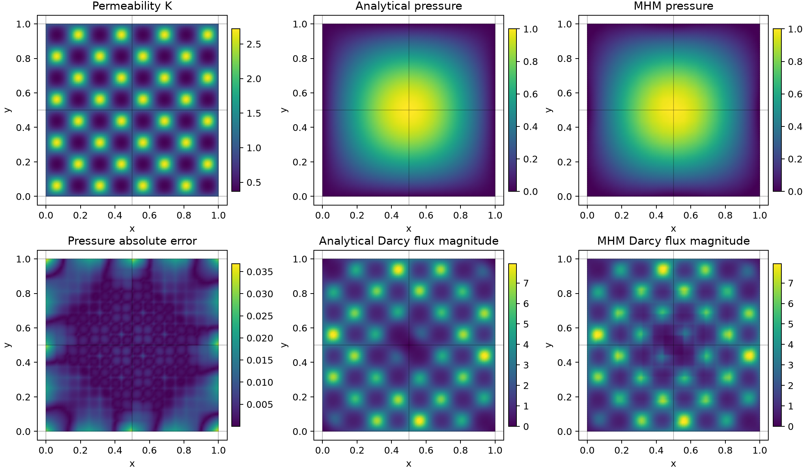
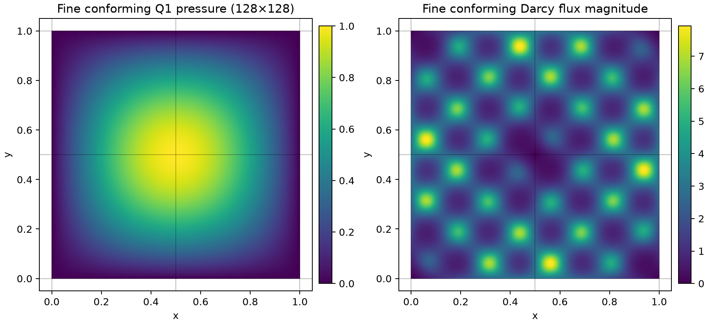

# One heterogeneous Darcy problem

All execution guides use the unit square, the same isotropic heterogeneous
permeability, the same independently differentiated source and the same pressure
boundary data:

$$
\begin{aligned}
K(x,y)&=\exp\!\left(\sin(8\pi x)\sin(8\pi y)\right),\\
p_{\rm exact}(x,y)&=\sin(\pi x)\sin(\pi y),\\
q_{\rm exact}&=-K\nabla p_{\rm exact},\\
f&=2\pi^2Kp_{\rm exact}-\nabla K\cdot\nabla p_{\rm exact}.
\end{aligned}
$$

The equation is $-\nabla\cdot(K\nabla p)=f$ with $p=0$ on the boundary.
The material period is 0.25 in physical coordinates and its contrast is $e^2$.
This smooth coefficient keeps an analytical solution available. Replacing it
with [SPE10 data](../tutorials/introduction/darcy_spe10_layer.md) requires the same
material in every backend and an independently refined numerical reference;
the analytical source above is specific to the displayed coefficient.

## 1. Declare the meshes and spaces

Use four Cartesian macrocells. Each local mesh has 8×8 quadrilaterals with Q1
pressure, one retained constant and a physical integral moment. Each complete
macroface has two continuous P1 normal-flux coordinates. The local mesh is
created inside its worker through a portable callable.

```python
from functools import partial
from pymhm import Equation, MeshHierarchy, bind_interface, bind_problem
from pymhm.fem.traces.interval import FaceSpace, SkeletonSpace
from pymhm.meshes.cartesian import CartesianMacroMesh
from examples.guides.heterogeneous_execution import LocalMeshes
from examples.introduction.scaling_forms import (
    PeriodicDarcyData, define_ufl_local_equations,
)

macro = CartesianMacroMesh(2, 2)
trace = SkeletonSpace(
    macro, tuple(FaceSpace.uniform(1, 1, continuous=True) for _ in macro.faces)
)
hierarchy = MeshHierarchy(macro, LocalMeshes(macro, refinement=8))
interface = bind_interface(trace, convention="normal")
```

The imports under `examples` are the notebook's inspectable companion helpers,
not installed library modules. Download them through the notebook workflow in
[data and notebooks](../data.md). `define_ufl_local_equations` is an importable
user-written callback so spawn workers can import its definition. The notebook
displays its actual source before using it.

## 2. Write the local variational equations

For the normal-flux multiplier $\lambda$ the callback writes

$$
\begin{aligned}
(K\nabla p_K,\nabla v)_K+\langle\lambda_K,v\rangle_{\partial K}
  &=(f,v)_K,\\
C_Kp_K&=\langle p_K,\mu_K\rangle_{\partial K}.
\end{aligned}
$$

Its central UFL expressions are:

```python
a = K * ufl.inner(ufl.grad(p), ufl.grad(v)) * dx
L = f * v * dx
b = local.trace_pairings(lambda phi, ds: phi * v * ds)
c = local.trace_pairings(lambda phi, ds: phi * p * ds, axis="rows")
```

`local.native_space(degree=1)` creates the worker-owned native mesh/space.
`local.equations(...)` compiles these forms and applies the declared canonical
normal orientation once. The constant kernel and `columns(v * dx)` moment
remain explicit. Quadrature degree six is fixed in the callback.

The positive `c` pairing declares the pressure-continuity equation. Summing its
outward-normal maps gives a pressure jump on interior faces and prescribed
pressure moments on exterior faces. Its choice is consistent with the displayed
local energy equation; it is not an extra sign applied by a scheduling backend.

## 3. Declare the global balance

```python
provider = partial(define_ufl_local_equations, data=PeriodicDarcyData(period=0.25))
problem = bind_problem(
    hierarchy,
    interface,
    provider,
    global_equation=Equation(0, 0),
    retained=1,
)
```

There is no additional global volume operator. The local `c` equations produce
the global balance, and the boundary pressure is zero. Dirichlet data remove
the global pressure ambiguity; the local integral moment selects each local
complement while its constant remains a global retained coordinate.

For nonzero pressure data, integrate their exterior face moments and supply
them with the sign of the declared global balance. The
[MPI guide](mpi.md#boundary-and-gauge-ownership) explains why each additive
boundary contribution must belong to exactly one rank.

## 4. Assemble, solve and measure

Choose the execution policy in [CPU execution](cpu.md), [MPI](mpi.md) or
[CUDA](gpu.md). Physical measurements remain pressure L2, vector Darcy-flux L2
and the permeability-inverse flux energy. Error quadrature uses order six on
every fine cell. Compare independently reconstructed coefficient vectors and
the original equations in addition to these field errors.

The 2×2/8×8 guide problem has pressure L2 error about 0.0070 and Darcy-flux L2
error about 0.192. These are discretization errors of this deliberately small
problem, not solver stopping criteria or an asymptotic convergence study.
The guide's serial, thread, spawn, MPI and CUDA runs agree within their stated
floating-point comparison budgets.



## Classical accuracy baseline

The notebook also assembles the same UFL volume operator on independent
global conforming Q1 grids, using strong zero exterior pressure. It verifies
the reference against the available analytical solution before plotting it:

| Global fine grid | Pressure L2 error | Darcy-flux L2 error |
| --- | ---: | ---: |
| 32×32 | 4.7072e-4 | 7.8397e-2 |
| 64×64 | 1.1829e-4 | 3.9685e-2 |
| 128×128 | 2.9616e-5 | 1.9906e-2 |

The corresponding observed rates approach two for pressure and one for flux.
This independently refined classical reference is finer than the guide's
16×16 total MHM fine grid. The approximation spaces differ, so the comparison
is an accuracy baseline rather than a claim of equal discrete spaces or costs.



## References

- Christopher Harder, Diego Paredes and Frédéric Valentin (2013).
  *A family of Multiscale Hybrid-Mixed finite element methods for the Darcy
  equation with rough coefficients*. [DOI: 10.1016/j.jcp.2013.03.019](https://doi.org/10.1016/j.jcp.2013.03.019).
