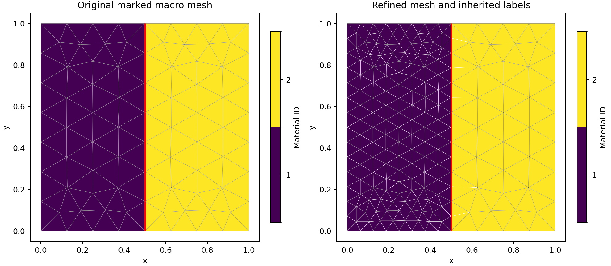

# Materials and marked meshes

A geometry, its physical labels and its PDE coefficients are separate objects.
Material IDs identify regions; boundary IDs identify faces. Neither kind of tag
automatically applies a boundary condition or assigns a permeability.

## 1. Generate two marked material regions

The following Gmsh geometry divides the unit square at $x=0.5$. Both surfaces
share the same straight interface curve, so the triangular mesh is conforming
across the material jump.

```python
import gmsh
from pymhm.io.planar import from_gmsh

gmsh.initialize()
try:
    gmsh.model.add("two-materials")
    coordinates = [(0, 0), (0.5, 0), (1, 0), (1, 1), (0.5, 1), (0, 1)]
    points = [gmsh.model.geo.addPoint(x, y, 0, 0.15) for x, y in coordinates]
    edges = [
        gmsh.model.geo.addLine(points[a], points[b])
        for a, b in [(0, 1), (1, 2), (2, 3), (3, 4), (4, 5), (5, 0), (1, 4)]
    ]
    left_loop = gmsh.model.geo.addCurveLoop([edges[i] for i in [0, 6, 4, 5]])
    right_loop = gmsh.model.geo.addCurveLoop([edges[1], edges[2], edges[3], -edges[6]])
    left = gmsh.model.geo.addPlaneSurface([left_loop])
    right = gmsh.model.geo.addPlaneSurface([right_loop])
    gmsh.model.geo.synchronize()
    for tag, surface, name in [(1, left, "matrix"), (2, right, "channel")]:
        gmsh.model.addPhysicalGroup(2, [surface], tag)
        gmsh.model.setPhysicalName(2, tag, name)
    for tag, edge, name in [(10, edges[5], "inlet"), (20, edges[2], "outlet"),
                            (30, edges[6], "material interface")]:
        gmsh.model.addPhysicalGroup(1, [edge], tag)
        gmsh.model.setPhysicalName(1, tag, name)
    gmsh.model.mesh.generate(2)
    data = from_gmsh()
finally:
    gmsh.finalize()
```

Use the `meshing` profile. Gmsh has process-global state: serialize calls in a
process, and preserve any existing caller-owned session/model when embedding
this construction in another application. The built-in generators follow that
ownership contract; see [mesh generation and exchange](../meshing.md).

## 2. Inspect the labels before assigning physics

```python
import numpy as np

assert set(np.unique(data.cell_tags)) == {1, 2}
inlet = data.boundary_tags[10]
outlet = data.boundary_tags[20]
interface = data.face_tags[30]
assert not set(interface).intersection(data.mesh.boundary_faces)

permeability_by_id = {1: 1.0, 2: 100.0}
cell_permeability = np.array([permeability_by_id[int(tag)] for tag in data.cell_tags])
```

The internal interface is present in `face_tags`, while `boundary_tags` contains
only exterior faces. IDs 1 and 2 are material labels, not offsets into an array.
The canonical face normal and its macrocell incidence signs come from the
mesh, independently of the imported curve ordering.

In a local UFL provider, a macrocell that lies entirely inside one material
uses a constant coefficient:

```python
from dolfinx import fem

binding = local.native_space(degree=1)
K = fem.Constant(binding.mesh, np.float64(cell_permeability[local.cell]))
a = K * ufl.inner(ufl.grad(p), ufl.grad(v)) * dx
```

`p`, `v` and `dx` are defined on that binding as in the
[common Darcy guide](heterogeneous-darcy.md). If the material interface crosses
a macrocell, retain its fine material mesh/tags and integrate the coefficient
jump on those fine cells. Replacing it with a macrocell average changes the
physical problem. The [SPE10 tutorial](../tutorials/introduction/darcy_spe10_layer.md)
uses a cellwise Cartesian tensor field and aligns integration with its material
grid; `CartesianCellField` evaluates one-sided values without averaging jumps.

## 3. Apply boundary groups explicitly

Select the desired essential or natural conditions using the **external**
face groups. For a bound normal-flux interface, `GlobalContext.boundary_data`
integrates prescribed pressure and projects prescribed flux density. A marked
internal material interface remains coupled to both neighboring cells; it is
not an exterior boundary merely because it has a physical ID.

For a pure Neumann problem, verify the source/outward-flux compatibility and
declare the physical mean pressure. For pressure Dirichlet data, preserve the
sign of the global pressure pairing written in the selected formulation.
The [MPI guide](mpi.md#boundary-and-gauge-ownership) adds ownership rules for
these same physical moments on multiple ranks.

## 4. Write a lossless exchange file

```python
from pymhm.io.planar import read_mesh, write_mesh

write_mesh("materials.vtu", data, cell_data={"permeability": cell_permeability})
restored = read_mesh("materials.vtu")
assert restored.physical_names == data.physical_names
assert restored.face_tags == data.face_tags
np.testing.assert_array_equal(restored.cell_tags, data.cell_tags)
np.testing.assert_array_equal(restored.cell_data["permeability"], cell_permeability)
```

VTU retains physical IDs/names, internal/external groups and point/cell fields.
Gmsh 2.2 also retains geometry/groups and compatible point fields; tagged line
blocks plus triangle cell fields require VTU under the documented meshio reader
contract. Unsupported metadata exports raise an error instead of losing labels.

## 5. Preserve labels during nested refinement

```python
from pymhm.meshes.refinement import refine_triangles

refinement = refine_triangles(data.mesh, marked=data.cell_tags == 1)
new_material_ids = data.cell_tags[refinement.parent_cells]
new_interface_faces = np.flatnonzero(
    np.isin(refinement.parent_faces, data.face_tags[30])
)
```

Cell ancestry transfers material IDs exactly. Face ancestry transfers a
physical curve group to its child edges; new interior fine edges have no old
face parent. The refined topology computes its own normals and incidence signs.
A nonnested remesher instead requires reapplying the physical material and
boundary description; it does not provide this parent map.



The [marked-material notebook](https://github.com/ipes-lncc/pymhm/blob/main/notebooks/foundations/geometry/marked_materials.ipynb)
executes this Gmsh construction, real VTU round trip, field/tag equality checks
and exact ancestry transfer before generating the figure.

## Three-dimensional tags

`VolumeMeshData` stores an integer material ID per volume cell and an integer
tag per geometric face, including interior interfaces. It accepts tetrahedra,
affine prisms, trilinear hexahedra and supported star-shaped polyhedra. Use
[volume generation/exchange](../meshing.md#three-dimensional-generation-and-exchange)
for connectivity conventions and VTU round trips. Volume physical-name strings
and overlapping face IDs are outside that adapter's contract.

The [mesh-exchange notebook](https://github.com/ipes-lncc/pymhm/blob/main/notebooks/foundations/geometry/60_mesh_exchange.ipynb)
executes real exchange files for all four volume families.

## References

- [Gmsh reference manual](https://gmsh.info/doc/texinfo/): CAD entities, physical
  groups, conforming geometry and mesh generation.
- [meshio documentation](https://github.com/nschloe/meshio): exchange formats,
  cell blocks and attached physical fields.
