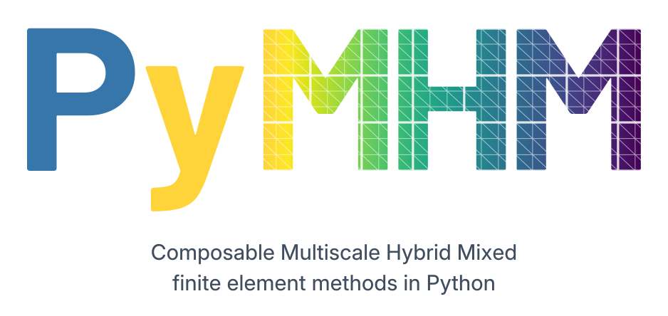
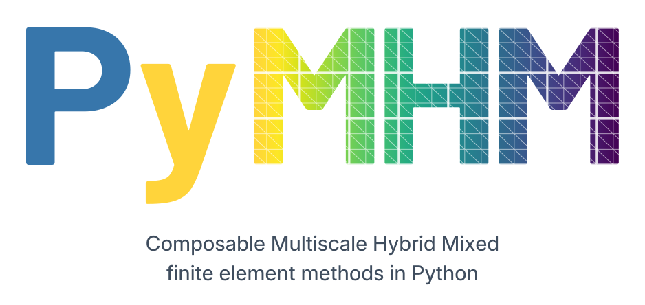

# Composable multiscale methods

<div class="pymhm-hero">
  <div class="pymhm-signature-mobile">
    
    <p>Composable Multiscale Hybrid Mixed<br>finite element methods in Python</p>
  </div>
  
  
</div>

`pymhm` is a research Python package for Multiscale Hybrid Mixed finite element
methods. User-defined local and global equations declare their independent
variational blocks, trace pairings and retained modes. `assemble` and `solve`
reuse the shared elimination and reconstruction operations. A local operator
can itself be another multiscale problem. Local discretization, skeleton
approximation and linear solvers are separate choices.

<div class="pymhm-start-grid">
  <a href="installation/">
    <strong>Install PyMHM</strong>
    <span>Set up the portable core and choose optional native backends.</span>
  </a>
  <a class="pymhm-tutorial-card" href="tutorials/overview/">
    <strong>Start the tutorials</strong>
    <span>New to PyMHM? Learn the API step by step with introductory cases, rendered code and field plots.</span>
  </a>
  <a href="cases/">
    <strong>Inspect the evidence</strong>
    <span>Read numerical results, discretization choices and scientific limits.</span>
  </a>
</div>

The reference implementation uses NumPy, SciPy and Basix. The optional
[FEniCS interface](fenics.md) assembles user-defined scalar, vector, mixed and
H(div) local forms with UFL/DOLFINx. [Meshing](meshing.md) connects Gmsh, Netgen
and meshio.

The [Windows guide](windows.md) covers the portable core, SciPy/PyPardiso,
spawn workers and installed-wheel verification, with the native FEM scope
stated separately.

Start with the [API overview tutorial](tutorials/overview.md) and the
[rendered introductory course](tutorials.md) for scalar and vector
formulations and interchangeable local providers. Use the
[visual case gallery](cases/index.md) to compare numerical fields
with exact references, inspect profiles and errors, and read what each case is
expected to demonstrate.

The overview derives a small Galerkin problem from its weak form. Its two
macrointervals contribute to one shared interface coordinate:

```python
from pymhm import Equation, LocalEquations, MultiscaleProblem, assemble


def local_equations(cell: int) -> LocalEquations:
    """Declare the local volume equation and its interface contribution."""
    return LocalEquations(
        a=[[8.0]], L=[0.25], b=[[-4.0]],
        c=[[-4.0]], d=[[4.0]], g=[0.125], dofs=[0],
    )


problem = MultiscaleProblem(
    global_equation=Equation(0, 0), local_provider=local_equations,
    items=(0, 1), trace_size=1, coarse_sizes=(0, 0),
)
system = assemble(problem)
solution = system.solve()
print(solution.trace)  # [0.125]
```

The [vector UFL notebook](https://github.com/ipes-lncc/pymhm/blob/main/notebooks/foundations/operators/vector_ufl.ipynb)
declares a coercive two-component reaction-diffusion operator; it is separate
from the mixed Brinkman formulations. The
[three-level hierarchy](https://github.com/ipes-lncc/pymhm/blob/main/notebooks/foundations/operators/variational_hierarchy.ipynb)
checks recursive coefficients against an independently written full system.

## Executable formulations

The following predefined physical formulations have numerical records for
their stated discretizations. They are separate from the ability to
declare a new variational problem; their case evidence does not qualify
arbitrary user-supplied forms.

| Problem | Local approximation | Skeleton / normalization |
| --- | --- | --- |
| Darcy | Primal Pk, triangular RT0–RT2/BDM2 and enriched rectangular RT | Scalar normal flux; physical local means; pure Neumann gauge |
| Three-dimensional mixed Darcy | Tetrahedral 18/P1 and 32/P2 families, prismatic 27/W11 and mapped hexahedral RT | Oriented Piola normal traces; physical cell moments and production balances |
| Cartesian Darcy | Conforming local Qk on rectangular grids | Continuous or discontinuous face traces; geometric material-pixel integration |
| Stokes–Brinkman | Pk/P(k−1) Taylor–Hood or Pk/Pk USFEM | Vector pseudotraction; tensor resistance; global pressure mean for full velocity data |
| Oseen with variable advection | Taylor–Hood or consistent equal-order stabilization | Robin pseudotraction, prescribed convection derivatives and global pressure mean |
| Nearly incompressible elasticity | GaLS Pk/Pk or Taylor–Hood | Three rigid modes; negative Cauchy traction; physical compressibility constraint |
| Weakly symmetric elasticity | Row-wise BDM/RT stress with independent interior enrichment | Restricted interior tractions; force, moment and weak-symmetry equations |
| Primal tensor elasticity | Two- and three-dimensional Pk with physical rigid modes | Negative Cauchy traction and displacement moments; no general locking-free claim |
| Three-dimensional weakly symmetric elasticity | Row-wise BDMk stress, discontinuous displacement and rotation | AFW spaces with k≥2, six rigid modes and the incompressible limit |
| Elastodynamics | Two- and three-dimensional Pk with Newmark time integration | Slabwise traction, local subcycling and heterogeneous inertia |
| Conservative scalar RAD | Pk Galerkin or SUPG with variable coefficients | Robin multiplier with half the advective flux |
| Heat equation | Pk and backward Euler | Flux skeleton, prescribed scalar boundary values |
| Equilibrated Darcy flux | Constrained minimum-energy RT0 reconstruction | Fine-cell balances and preserved macro fluxes |
| MHM–MsHHO | Multiscale energy reconstruction and cell/face moment spaces | Condensed face system and source-dependent field equivalence |
| Adaptive methods | RT moment recovery, potential estimators and equation-specific residual indicators | Independent macro, face and local controls with stated marking rules |

Built-in geometries include triangles, rectangular cells, simple planar polygons,
tetrahedra, affine prisms, star-shaped polyhedra with planar faces and trilinearly
mapped hexahedra.
Nonconvex polyhedra require a certified positive-volume kernel and a conforming
tetrahedral decomposition, as described in the [polyhedral case](https://github.com/ipes-lncc/pymhm/blob/main/docs/cases/star-polyhedra.md).
The [scope matrix](https://github.com/ipes-lncc/pymhm/blob/main/ROADMAP.md#scientific-scope-and-acceptance-criteria) identifies the formulations available on each
geometry; they are not interchangeable backends for every equation.
Face partitions and polynomial degrees are independent of local refinement.
Planar edge bases can be discontinuous
Legendre polynomials or continuous nodal polynomials within each macroface.
Normal-trace restrictions and local refinement must satisfy each formulation's
compatibility conditions.

[Scientific scope](https://github.com/ipes-lncc/pymhm/blob/main/ROADMAP.md#scientific-scope-and-acceptance-criteria) maps the literature to the implemented paths and
remaining mathematical requirements. The [literature catalog](literature.md)
covers the 20-document reference collection, including the 2025–2026 analyses and
reconstruction results; a catalog entry is not a claim of complete reproduction.

## Evidence and reproducibility

Use [verification](verification.md) for measured errors, conservation tests,
convergence studies and backend integration results. Coverage measures executable
branches; it does not prove stability, validate an unavailable backend or
reproduce a paper. [Performance](https://github.com/ipes-lncc/pymhm/blob/main/docs/performance.md) records timings, including cases
where parallel execution is slower.

Executed comparisons identify their reference implementations explicitly:
[MSL_MHM with MSL_CG and MSL_Core](https://github.com/ipes-lncc/pymhm/blob/main/docs/cases/reference-comparison.md) for primal
Darcy, and [NeoPZ](https://github.com/ipes-lncc/pymhm/blob/main/docs/cases/neopz.md) for conforming and restricted-trace RT0/P0
Darcy. Their case pages record the source revisions, discrete spaces, boundary
conditions and complete-field comparisons. Labmec/MHM's positive-order
controller has a separate source-level description from the executed RT0 NeoPZ driver.

This is version 1.0.1, an official release of PyMHM. The
[installation guide](installation.md) explains package installation through pip,
optional backends and the locked environments used for reproducible studies.

The [MSL GaLS comparison](https://github.com/ipes-lncc/pymhm/blob/main/docs/cases/elasticity-reference.md) checks displacement,
pressure, gradients and full stress for P1/P1, P2/P2 and P3/P3 elasticity.
The [near-incompressibility study](https://github.com/ipes-lncc/pymhm/blob/main/docs/cases/elasticity.md) includes finite material
ratios through $10^8$, the exact incompressible limit and six refinement points.
[BDM2 Darcy](https://github.com/ipes-lncc/pymhm/blob/main/docs/cases/darcy-bdm.md) and [mixed elasticity](https://github.com/ipes-lncc/pymhm/blob/main/docs/cases/mixed-elasticity.md)
include independent DOLFINx/Basix assembly checks and analytical convergence cases.

<section class="institutional-support" markdown="1">

## Institutional Support

PyMHM is developed by the
[Innovative Parallel numErical Solvers (IPES)](https://ipes.lncc.br/)
research group and receives institutional support from the
[Laboratório Nacional de Computação Científica (LNCC)](https://www.gov.br/lncc/pt-br),
a research unit of the
[Ministério da Ciência, Tecnologia e Inovação (MCTI)](https://www.gov.br/mcti/pt-br),
Brazil.

<div class="institutional-logos">
  <a href="https://ipes.lncc.br/">
    
  </a>
  <a href="https://www.gov.br/lncc/pt-br">
    
  </a>
  <a href="https://www.gov.br/mcti/pt-br">
    
  </a>
</div>

</section>
