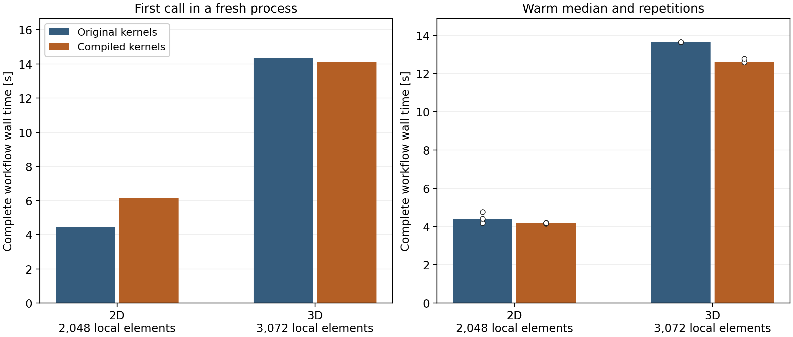
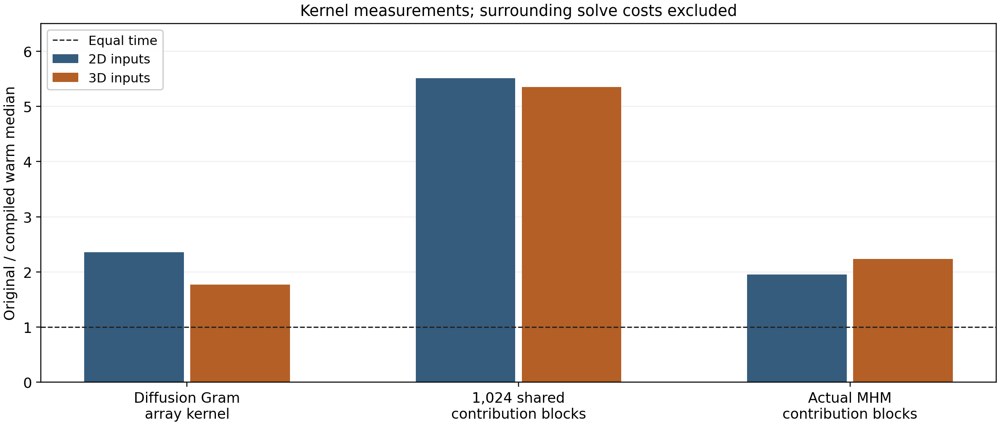

# Performance and parallel execution

The implementation separates local finite element assembly, local condensation,
global sparse assembly and solution, and field reconstruction. A direct local
solver reuses its constrained factorization for the source and skeleton lifts.
The prepared GPU AMG solver reuses one hierarchy across its right-hand sides
and original-equation corrections. A different material matrix requires a new
setup. A `HybridSystem` retains the executed lifts for reconstruction.

Performance campaigns time their declared numerical workflow; bounded assembly
controls state any untimed preparation. Numerical agreement and performance
are verified separately: a faster execution must still satisfy the original
equations and reproduce the physical fields at the stated accuracy.

## Compiled array kernels

Selected scalar quadrature contractions, ordered contribution reduction and planar
point-coordinate operations use cached Numba kernels. Local/global equations,
providers and NumPy array contracts retain the same Python interface. Basix
supplies finite-element tabulation; native DOLFINx assembly and external LU/AMG
solvers keep their own compiled implementations. The
[standalone Darcy notebook](https://github.com/ipes-lncc/pymhm/blob/main/notebooks/darcy/numba_kernel_performance.ipynb)
shows explicit local/global equations, assembly, solution, physical fields and
separate first/warm calls in two and three dimensions.

The ordinary scalar integration path uses binary64 with compensated tensor
contractions and quadrature sums. It does not enable `fastmath`. Exceptional
exponent ranges retain a guarded native-precision integration path; an
intermediate overflow must not destroy a finite final operator entry. Explicit
extended-precision solver/refinement inputs retain their separate contracts.
The compiled leaves release the GIL but create no inner parallel pool. Shared
macroface loads are accumulated by the ordered coordinator, preserving their
addition order and conservation convention.

Numba specializes on first use and can cache its compiled code. These costs
belong in first-call measurements; a warmed calculation alone does not describe
startup. See the [Numba compilation options](https://numba.readthedocs.io/en/stable/user/jit.html)
and [cache behavior](https://numba.readthedocs.io/en/stable/developer/caching.html).

### First focused 2D and 3D campaign

The smooth manufactured problem has

$$
\begin{aligned}
K(x)&=\exp\left(0.25\prod_{i=1}^d\sin(2\pi x_i/0.137)\right),\\
p_\star(x)&=\prod_{i=1}^d\sin(\pi x_i),\\
f&=d\pi^2Kp_\star-\nabla K\cdot\nabla p_\star.
\end{aligned}
$$

Continuous local P2 pressure and constant P0 macroface normal-flux traces are
identical in both implementations. The material period is not aligned with
macro translations; every local material matrix and factor is rebuilt. The
reference is the package's original array implementation at
[revision `55359af7`](https://github.com/ipes-lncc/pymhm/tree/55359af7220ad9db9d9255e6eae30a7beb243789),
with the same locked dependencies and acquisition helper. It is an
implementation-equivalence baseline, distinct from a classical-method comparison.

Each complete timer includes geometry, description, native thread-limit setup,
local assembly and factorization, ordered global reduction, global solution and
reconstruction, analytical pressure/physical-flux norms, original-equation and
macro-conservation controls, and named pressure samples. An isolated serial
process uses one BLAS thread on the Xeon Silver 4216 workstation. Three fresh
workflows follow the first call; only compiled code is reused. Imports and
interpreter launch/exit are measured separately. Empty per-process Numba caches
make compilation visible; no GPU transfers occur in this CPU campaign.

| Case | Macroelements | Total local elements | Original warm median | Compiled warm median | Measured ratio |
| --- | ---: | ---: | ---: | ---: | ---: |
| 2D | 32 | 2,048 | 4.408 s | 4.180 s | 1.054× |
| 3D | 48 | 3,072 | 13.644 s | 12.604 s | 1.083× |

2D first workflow: 4.460 s original and 6.145 s compiled; 3D first workflow: 14.341 s original and 14.117 s compiled.
First-call times include compilation and ordinary native initialization but
exclude the separately recorded import/launch costs. The 2D repeated-time
ranges overlap; the small median difference does not establish a general
simulation speedup. The 3D result is also specific to this workload and machine.

| Case | Pressure L2 error | Physical Darcy-flux L2 error | Original local L2 backward error | Macro skeleton balance |
| --- | ---: | ---: | ---: | ---: |
| 2D | 0.036286 | 0.511646 | 2.77e-16 | 7.49e-15 |
| 3D | 0.117950 | 0.939673 | 3.39e-16 | 5.55e-16 |

These P0 macroface controls are deliberately coarse. Their physical errors are
reported as measured; they are not new high-accuracy or asymptotic convergence
claims. Recorded pressure/trace differences between implementations remain at
roundoff scale, with identical executed basis matrices and mesh coordinates.
Original local equations and macro balance keep their unchanged `1e-10` limits.
Macro conservation uses the skeleton normal flux, while the raw primal gradient
flux is not claimed to conserve each fine cell. The notebook's field illustration
uses explicitly enriched traces, separately from this fixed-space timing control.

### Kernel gains and complete-workflow limits

The microbenchmarks exclude coefficient callbacks, tabulation, local solvers,
physical norms and process startup. The diffusion inputs contain 384 synthetic
cells, 36/64 quadrature points and six/ten basis functions in 2D/3D. The larger
reduction consumes 1,024 SPD 25×25 blocks sharing 128 trace coordinates; actual
MHM response blocks are timed separately.

| Warm kernel ratio | 2D inputs | 3D inputs |
| --- | ---: | ---: |
| Scalar diffusion Gram arrays | 2.36× | 1.77× |
| 1,024 shared 25×25 blocks | 5.51× | 5.35× |
| Actual MHM contribution blocks | 1.95× | 2.23× |

The shared-reduction matrix, RHS and absolute-load scale match exactly. Diffusion
Gram differences are at binary64 roundoff scale. Planar point sampling has its
own same-input geometric regression tests and timings; it is not a 3D locator
optimization. These component gains do not predict an MPI/GPU speedup or a
comparable gain for every PDE. Native tabulation, callback construction and
other surrounding work remain significant in the complete simulations.

The [complete report and raw repetitions](https://github.com/ipes-lncc/pymhm/tree/main/benchmarks/results/numba-20261009)
include source/basis identities, package versions, CPU affinity, physical
controls and separately measured launch costs. The
[importable acquisition helper](https://github.com/ipes-lncc/pymhm/blob/main/examples/numba_performance.py)
owns timers and archives while delegating numerical operations to the package.

## Cost of automatic native UFL trace assembly

The contextual API supplies numbering and orientation without user-managed
maps. Its introductory native UFL pairings also change the boundary assembly
route compared with explicit Basix trace matrices. A warmed serial control
uses the same 4×4 macro mesh, Q2 fields, 4×4 fine cells per macroelement,
piecewise P1 traces and oscillatory material in both routes. Three alternating
repetitions measure:

| Timed operation | Explicit Basix trace blocks | Contextual native UFL pairings |
| --- | ---: | ---: |
| Description, local meshes, assembly, solution and one field sample | 0.979 s | 6.043 s |
| Native form lookup/binding, included above | 0.561 s | 5.186 s |
| Local condensation, included above | 0.037 s | 0.036 s |
| Global solution and recovery, included above | 0.0027 s | 0.0028 s |

The observed timed-operation ranges are 0.975–0.994 s and 6.017–6.121 s. The native
UFL route is 6.17× slower in this small workload, with 432 native form calls
instead of 48. Independent trial/test pairings remain explicit. Repeated
native form construction dominates; condensation and global solution retain
their shared owners. Reusable native workspaces are available for explicitly
prepared providers, while automatic reuse for these general contextual forms
remains an optimization target.

Common macro geometry, data and callback definitions are prepared outside
these timers. Both routes have an untimed warmup, one native thread and no
concurrent project workload. Included timers overlap and are not additive.
The [route-cost receipt](https://github.com/ipes-lncc/pymhm/blob/main/benchmarks/results/api-binding-20261006/route-cost.json)
records every repetition, source snapshots, numerical equality checks,
hardware and scope. This comparison changes the boundary assembly route as
well as the API; it does not isolate Python abstraction overhead or predict
large-problem scaling. The historical campaigns below retain their measured
source revisions.

## Oscillatory Darcy with declared local and global forms

The [thread notebook](https://github.com/ipes-lncc/pymhm/blob/main/notebooks/introduction/darcy_parallel_scalability.ipynb)
defines its permeability, manufactured source, local UFL equations, skeletal
couplings and conforming Q1 comparisons in executable cells. The
[process companion](https://github.com/ipes-lncc/pymhm/blob/main/notebooks/introduction/darcy_process_scalability.ipynb)
defines the same physical case and exports its displayed worker definitions
for `spawn`. Their introductory workflow uses `MeshHierarchy`, `bind_interface`
and `bind_problem`, with user-written `LocalEquations` and `Equation` forms.
The scaling tables below retain their original measured source revisions and
execution provenance. The notebooks verify archived records and execute a fresh
field control by default; `PYMHM_RUN_CAMPAIGN=1` requests new timing acquisitions.

Matched fine-element counts specify the amount of fine geometry; the global
spaces differ. Separate pressure and physical-flux errors accompany timings.
Native UFL checks precede timing. Timed volume assembly uses the verified Basix
operators in both methods. Configurations are warmed before three randomized
fresh solves, including setup, pool startup, transfers,
ordered assembly, synchronization, the global solve and reconstruction.
Operators, factors and AMG hierarchies are rebuilt for every solve.

On the two-socket Xeon Silver 4216 workstation, the thread campaign measured:

| Fine quadrilaterals in each method | Classical LU | Classical AMG | Best MHM thread time | Workers |
| ---: | ---: | ---: | ---: | ---: |
| 40,000 | 1.339 s | Not measured | 2.358 s | 1 |
| 250,000 | 8.484 s | Not measured | 9.468 s | 8 |
| 1,000,000 | 48.290 s | 20.813 s | 32.951 s | 8 |

For one million elements, eight threads provide 2.125× speedup over one MHM
thread and 1.466× over classical LU. Classical AMG is faster. Pressure and flux
errors relative to the analytical solution agree within factors 1.003 and
1.001, respectively, between MHM and the conforming reference.
The smaller workloads have no speedup against classical LU.

For one million fine quadrilaterals, the process companion measured:

| Execution | Workers | Median complete time |
| --- | ---: | ---: |
| MHM serial | 1 | 69.531 s |
| MHM processes | 1 | 81.504 s |
| MHM processes | 4 | 24.772 s |
| MHM processes | 8 | 17.140 s |
| MHM processes | 16 | 13.287 s |
| Classical LU | 1 | 48.181 s |
| Classical AMG | 1 | 20.247 s |

Sixteen processes provide 5.233× speedup over serial MHM, 3.626× over classical
LU and 1.524× over classical AMG. Its three complete durations range from
13.243 to 13.428 s. Every configuration includes a fresh process pool where
applicable; child imports, serialization and pool shutdown remain timed.
Warm native initialization removes the common first-use cost from these
medians, and the records also report that initialization separately.
At 500×500 elements, eight processes take 6.153 s, compared with 8.118 s for
classical LU and 4.540 s for classical AMG. Sixteen processes take 7.385 s;
more workers do not improve that workload.

Weak scaling retains 40,000 local fine elements per worker on an expanding
domain. Median complete time rises from 2.326 s with one thread to 292.479 s
with 64 threads, giving 0.795% weak efficiency. These small local problems do
not scale efficiently with threads. The process study measures its own startup
and transfer costs on the physical domains `[0, L] × [0, 1]`, with unchanged
material period, source and boundary conditions:

| Processes / domain length | Total fine elements | MHM processes | Classical LU | Classical AMG |
| ---: | ---: | ---: | ---: | ---: |
| 1 | 40,000 | 3.691 s | 1.043 s | 0.745 s |
| 4 | 160,000 | 5.778 s | 4.616 s | 2.954 s |
| 8 | 320,000 | 9.704 s | 10.318 s | 6.277 s |
| 16 | 640,000 | 14.631 s | 20.074 s | 12.025 s |

Weak efficiency relative to one process is 25.229% at sixteen processes.
Classical AMG remains faster on every weak workload. No inter-node efficiency
follows from either one-host study.

The host has 32 physical and 64 logical cores. Native BLAS/OpenMP budgets are
one thread, including the classical baselines. Project benchmarks run in
separate timing windows; unrelated host applications remain active and there
is no exclusive operating-system allocation or CPU affinity policy. Native
initialization is recorded with the existing compiler cache, rather than as
a cold-cache measurement. The
[thread records and figures](https://github.com/ipes-lncc/pymhm/tree/main/benchmarks/results/execution/introduction-threads-20261004)
and [process records and figures](https://github.com/ipes-lncc/pymhm/tree/main/benchmarks/results/execution/introduction-processes-20261004)
contain every repetition, software versions, source and lockfile hashes,
field checks and archived-basis replay conventions. This is an analytical
application, rather than a matched reproduction of a literature experiment.

## One- and two-GPU local condensation

The 500×500 pilot uses the same physical problem, 100 macroelements and
250,000 fine quadrilaterals with one or two NVIDIA RTX A5000 GPUs. Every MHM
route compiles local equations on eight CPU threads, then condenses them with
one CPU worker, eight CPU workers, one GPU or two GPUs. The CPU route with
serial condensation therefore includes parallel compilation; it is not a
complete serial MHM baseline.

All six routes run in the same locked `hpc` environment. Its SciPy version
differs from the `introduction` environment used for the thread/process
notebooks, so the pilot reruns classical LU and AMG in `hpc`. Each route has
one warmup and three randomized fresh executions. Complete GPU timers include
CPU setup and compilation, transfers, cuDSS analysis/factorization, synchronization,
global assembly/solution and field reconstruction. Factors and responses are
rebuilt for every execution.

| Execution | Median complete time |
| --- | ---: |
| MHM, serial CPU condensation | 12.731 s |
| MHM, eight CPU condensation workers | 9.932 s |
| MHM, one GPU | 9.824 s |
| MHM, two GPUs | 12.020 s |
| Classical LU | 8.330 s |
| Classical AMG | 4.521 s |

The one-GPU and threaded CPU observed ranges overlap; their 1.1% median
difference does not establish a performance advantage. Two GPUs are slower.
Neither GPU route beats classical LU or AMG in this workload. Pressure and
physical-flux errors agree with the classical baseline within factors 1.023
and 1.001. Original equations, physical moments and archived-basis replay are
checked independently of timings.

The [pilot records and figures](https://github.com/ipes-lncc/pymhm/tree/main/benchmarks/results/execution/introduction-multigpu-20261004)
include every sample, phase cost, initialization, actual basis digests and
hardware/software provenance. CPU compilation and host analysis remain
significant parts of this execution model. These measurements establish a
node-local capability and its measured costs, without a multiGPU speedup or
inter-node scalability claim.

## Three-dimensional Darcy: workspaces, LU and AMG

The [3D tutorial](https://github.com/ipes-lncc/pymhm/blob/main/notebooks/introduction/darcy_3d_parallel_scalability.ipynb)
shows the anisotropic material, exact fields, local/global UFL equations,
oriented Q1 traces, independent references and native workspace provider.
Compatible workers reuse mesh/space/kernel resources and buffers. Every
macrocell assembles fresh material data and constructs independent LU factors
or an AMG hierarchy; numerical responses are not cached. Material-independent
trace/moment blocks are reused only after checking that property in the
application forms.

The unit cube uses 64 macrohexahedra, with 262,144 or 884,736 total fine Q1
cells at counts 64 or 96 per unit direction. Four modes per unsplit macroface
and one retained constant per cell give 1,024 coupled coordinates. Full
pressure Dirichlet data impose no global mean-zero gauge. Pressure and broken
physical flux are compared with exact fields; equal fine-element budgets do
not imply equal global spaces or equal field accuracy.

Complete times include parent launch, imports/native initialization, setup,
material assembly, fresh local solves, transfers, synchronization, global
solution and reconstruction. Norm integration, archives and plots occur
outside that timer. Warmups populate the existing compiler cache; cold JIT
is not part of these measurements. Large parallel configurations have 32
physical cores and one native thread per process/rank.

| Permeability spatial period, ε | Fine cells per unit axis | Method | Processes / ranks | Complete launch time (s) |
| ---: | ---: | --- | ---: | ---: |
| 0.1 | 64 | Classical PETSc CG/GAMG | 32 | 3.9623 |
| 0.1 | 64 | Classical PETSc PREONLY/LU/MUMPS | 32 | 16.8697 |
| 0.1 | 64 | MHM MUMPS LU | 32 | 5.1665 |
| 0.1 | 64 | MHM PyAMG | 32 | 8.2986 |
| 0.1 | 64 | MHM SuperLU | 32 | 6.0051 |
| 0.137 | 64 | Classical PETSc CG/GAMG | 32 | 3.7496 |
| 0.137 | 64 | Classical PETSc PREONLY/LU/MUMPS | 32 | 16.6027 |
| 0.137 | 64 | MHM MUMPS LU | 32 | 5.0159 |
| 0.137 | 64 | MHM PyAMG | 32 | 7.9710 |
| 0.1 | 96 | Classical PETSc CG/GAMG | 32 | 9.2592 |
| 0.1 | 96 | Classical PETSc PREONLY/LU/MUMPS | 32 | 96.3061 |
| 0.1 | 96 | MHM MUMPS LU | 32 | 10.4146 |
| 0.1 | 96 | MHM PyAMG | 32 | 22.5916 |
| 0.1 | 96 | MHM SuperLU | 32 | 56.0215 |

At matched 32-physical-core and fine-element budgets, local MUMPS MHM is
3.27× faster than classical distributed MUMPS at 64 cells per unit
axis and 9.25× faster at 96. The period-0.137 LU comparison gives
3.31×. These are measured workflow ratios for different approximation
spaces, with the physical errors shown alongside them. They are not
equal-accuracy speedups.

Classical distributed CG/GAMG remains faster than both MHM local MUMPS and
MHM local PyAMG at the measured unit-cube resolutions. The favorable LU
comparison therefore does not establish an advantage over the best classical
solver measured here. Each timing point is an actual completed sample;
no confidence interval or variance estimate is inferred.

The six-point period-0.1 strong studies use 1, 2, 4, 8, 16 and 32 spawned
processes. Focused weak studies keep four or eight macrocells per process,
expanding the x-domain while preserving H=0.25, h=1/64 and the material
wavelength. Their actual smallest measured process count supplies the weak
efficiency baseline. Startup and the growing global skeleton limit these
node-local measurements; no asymptotic or multi-node efficiency is inferred.

The [case page](cases/darcy-3d-scalability.md) displays complete-time, speedup,
efficiency, phase-cost and focused weak plots, together with physical errors.
The [record and figures](https://github.com/ipes-lncc/pymhm/tree/main/benchmarks/results/execution/introduction-3d-workspace-lu-20261005)
contain the actual measured samples and independent numerical controls.
Periods 0.1 and 0.137 remain separate. Fixed Q1 macro traces leave an interface
error floor when only local meshes are refined. Classical CG/GAMG remains
faster in these measured cases. The separate
[CPU PARDISO and GPU edition](cases/darcy-3d-accelerators.md) extends the study
with larger grids, one/two-GPU measurements and focused CPU/GPU weak scaling.
Each edition retains its own measured configurations and numerical controls.
Its [numerical records and figures](https://github.com/ipes-lncc/pymhm/tree/main/benchmarks/results/execution/introduction-3d-accelerators-20261005)
include each acquisition's own pressure and physical-flux errors.

## Choosing and measuring an execution mode

Use `assemble(problem, execution=ExecutionConfig(...))` with declared local and
global forms. Serial execution builds, condenses and accumulates one cell at a
time. Process execution constructs and reduces complete local equations inside
spawned workers; ordered coordinator reduction handles shared faces. A bounded
rolling window can overlap local work with global accumulation. The
[execution guide](execution.md#serial-cells-and-bounded-parallel-batches)
specifies ordering, thread limits, failure handling and cleanup.

Keep the full discretization fixed for strong scaling. For weak scaling, report
both local work per worker and growth of the global skeleton. Retained lifts,
serialized responses and the host global matrix all contribute to memory use.
Separate initialization, local assembly/condensation, transfers, global work
and reconstruction, while retaining a complete timer containing every phase.
Report every repetition and any regression.

Ordinary `MultiscaleProblem` assembly has a host global solve. For distributed
local ownership and global sparse algebra, use
[`solve_distributed`](execution.md#distributed-mpi-assembly), with the caller
assigning cells and globally consistent trace indices to MPI ranks. For
node-local accelerator work,
[`condense_multi_gpu`](execution.md#local-work-across-multiple-gpus)
distributes local systems among explicitly selected devices. Transfers,
synchronization and host work remain part of a complete GPU comparison.
Native correctness controls and one-host measurements do not establish
multi-node efficiency.

[Recorded MPI, resident GPU and offline/online measurements](https://github.com/ipes-lncc/pymhm/tree/main/benchmarks/results/execution)
state their own hardware, spaces and timing scopes. Earlier CPU measurements
remain available in the
[benchmark records](https://github.com/ipes-lncc/pymhm/tree/main/benchmarks/results).
Their measured workloads and acquisition hashes are distinct from the
oscillatory application above.

[Additional 3D CPU and accelerator component measurements](https://github.com/ipes-lncc/pymhm/tree/main/benchmarks/results/execution/introduction-3d-20261004)
report their own CPU allocations, solver settings and timing scopes.
