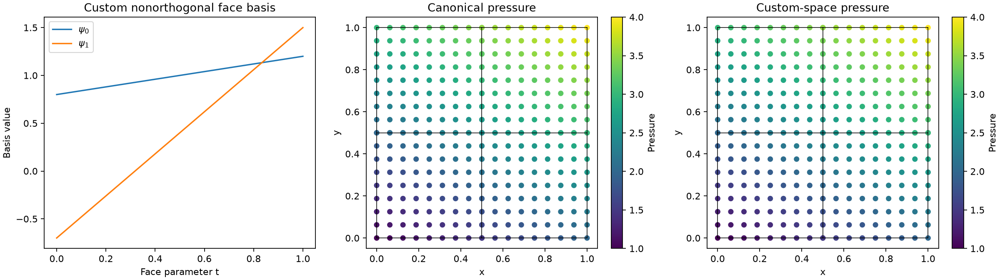

# Custom interface spaces and explicit coordinate control

PyMHM can derive numbering and geometric orientation from built-in meshes and
spaces. You can also provide those choices yourself, including a custom basis,
independent trial/test maps and external coefficient conventions. Both paths
use the same local condensation, global assembly and solvers.

The executable [custom-interface notebook](https://github.com/ipes-lncc/pymhm/blob/main/notebooks/foundations/operators/custom_interface.ipynb)
solves the same analytical Darcy problem twice: canonical Legendre face
coordinates, then a nonorthogonal basis with reversed global numbering. It
checks transformed operators, boundary loads, interface coefficients and
physical pressure fields. The local/global interpretation follows
[Harder and Valentin (2016)](https://doi.org/10.1007/978-3-319-41640-3_13).
This is an analytical representation check, not a convergence study.

```bash
pixi run --locked -e introduction notebooks-run foundations/operators/custom_interface.ipynb --timeout 1800
```

## 1. Choose your level of control

| Interface | What you declare | What PyMHM supplies |
| --- | --- | --- |
| `bind_interface(skeleton)` | Space, normal/value convention and mathematical forms | Built-in incidence, numbering and geometric transport |
| Custom `InterfaceSpace` | Complete size and `binding(cell)` | Validation, block transport and the same assembly pipeline |
| `LocalEquations` and `MultiscaleProblem` | Forms, maps, coordinate layout and constraints | Compilation, checked condensation, reduction, solve and reconstruction |

There is no required base class or registry for a custom space. The structural
contract is a `size` property and a `binding(cell)` method returning
`TraceBinding`. Additional native integration or field-evaluation capabilities
are explicitly supplied by an adapter.

## 2. Declare the meaning of each map

A binding defines independent trial and test restrictions:

$$
\begin{aligned}
\lambda_K&=T_K\lambda[\mathrm{dofs}_K],\\
\mu_K&=U_K\mu[\mathrm{test\_dofs}_K].
\end{aligned}
$$

Rows of $T_K$ and $U_K$ describe local basis coordinates. Columns select the
listed global coordinates. Dense maps can encode basis changes, normal signs,
permutations, tangential rotations and projections. The mathematical support
and physical meaning of those maps belong to the adapter.

```python
from pymhm import TraceBinding

binding = TraceBinding(
    dofs=trial_indices,
    trial_map=trial_transform,
    test_dofs=test_indices,
    test_map=test_transform,
    basis_id="my declared trace basis and physical convention",
    require_injective=True,
)
```

When the local forms use these local coordinates, the binding transports
blocks and loads as

$$
\begin{aligned}
B_K^{\mathrm{global}}&=B_KT_K,&
C_K^{\mathrm{global}}&=U_K^TC_K,\\
D_K^{\mathrm{global}}&=U_K^TD_KT_K,&
g_K^{\mathrm{global}}&=U_K^Tg_K.
\end{aligned}
$$

It does not infer a relation between $B_K$ and $C_K$. Declaring signs in a
physical pairing remains necessary even when geometric orientation is automatic.
`require_injective=True` requests the rank condition for formulations needing
an injective restriction; general projections remain available when explicitly
chosen. Finite dimensions and coordinate ranges are always checked.

## 3. Bind the custom space to user-written forms

```python
problem = bind_problem(
    hierarchy,
    custom_interface,
    local_equations,
    global_equation=global_equation,
    retained=retained_modes,
)
system = assemble(problem)
solution = solve(system)
```

The local provider receives the same `LocalContext` as a built-in space. It can
inspect `local.binding` for fully manual assembly, or pass its locally expressed
forms to `local.equations`. Existing numerical blocks that already contain
global geometric transport use `coordinates="global"` explicitly; applying
the map again would change their formulation.

A custom native adapter can implement
`trace_pairings(context, expression, axis=...)`. Independent local boundary
spaces can be selected with `local.trace_pairings(..., interface=other_interface)`;
a custom `interface_pairing(context, order=...)` capability can define their
unsigned mass pairing against the primary global interface. An unsupported capability
raises an explicit error instead of guessing how unrelated meshes or bases
should couple. Plain assembled blocks need no native FEM dependency.

## 4. Compare physical fields in the declared basis

In the notebook, each face basis changes from $\varphi=(1,2t-1)$ to
$\psi=\varphi S$, with an invertible dense $S$. Its global map $P$ additionally
encodes the user's numbering. Compare $P\widehat\lambda$ with canonical trace
coefficients, and compare the physical reconstructed pressure. Raw vectors
in different bases are different representations of the same field.



A coefficient vector's basis and coordinate maps are part of its persisted
contract. `TraceBinding.basis_digest` identifies those declared data; named
fields carry their executed evaluation contract. Changing a basis requires
transporting the coefficients consistently. A matching dimension does not
justify replay with a newly computed basis.

## Execution and scope

Custom providers use the existing serial, thread and process execution models.
Spawned workers receive portable, picklable descriptions and create native
resources locally. User-managed native caches provide explicit cleanup. A
custom interface does not bypass physical residual checks or establish the
stability of arbitrary forms.

Primal, mixed, Petrov–Galerkin and moment formulations can all use this
contract. Mathematical compatibility, physical gauges, quadrature and retained
modes remain explicit. For nested problems, provide restrictions manually when
the automatic planar restriction capability does not apply; current child
boundary and recursive MPI restrictions still hold.
