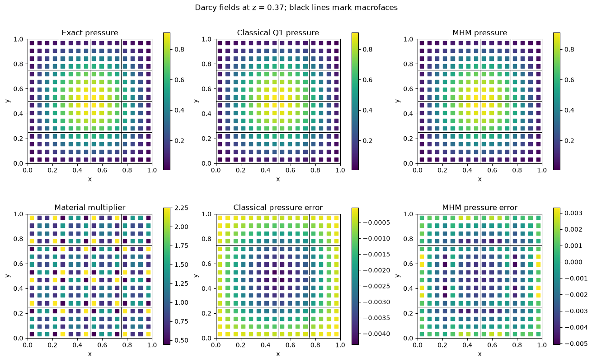
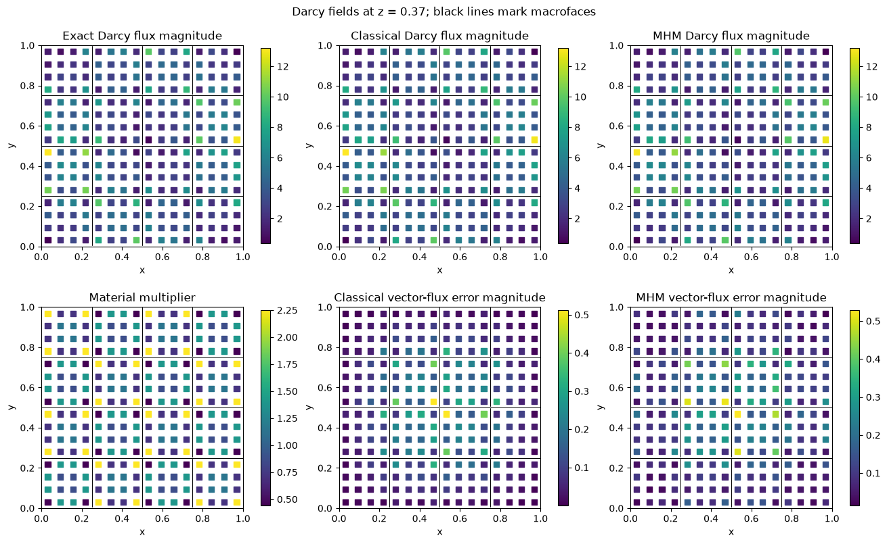
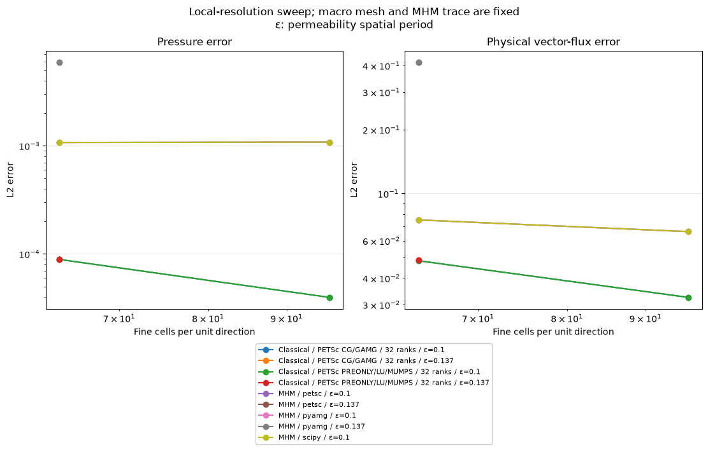
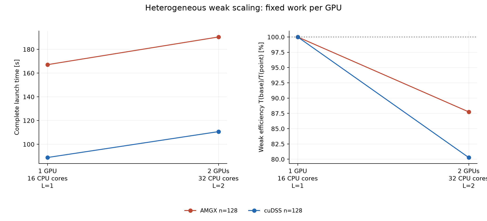
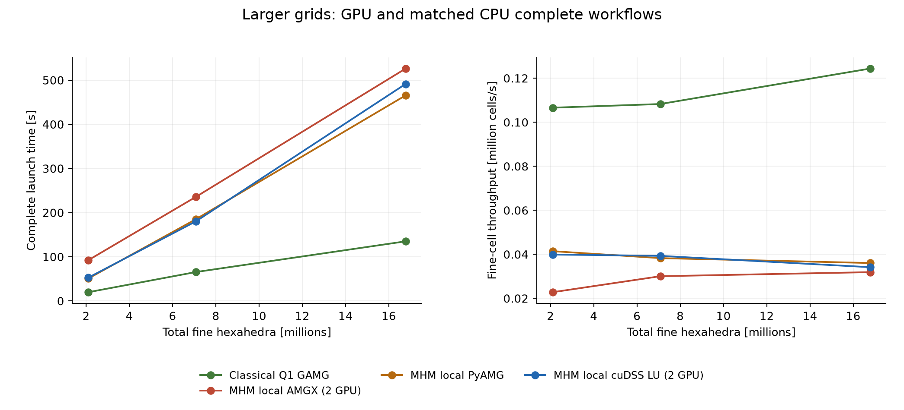
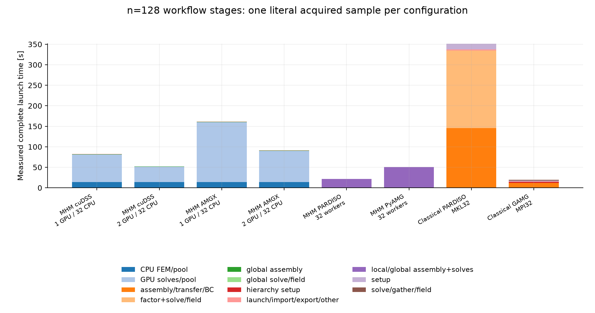

# Darcy in 3D: native workspaces and CPU/GPU scaling

Follow the numbered steps: state the variational problem, choose the local and trace spaces, declare the local and global equations, solve, and inspect the physical fields.

This notebook uses the public local/global equation API for anisotropic Darcy in the unit cube. Its default CPU control uses 4 × 4 × 4 macrocells, four Q1 subdivisions per coordinate inside each macrocell and unsplit tensor-Q1 normal traces. CPU/GPU campaigns and all available historical panels remain accessible separately.


$$
\begin{aligned}
K(\boldsymbol x)&=m(\boldsymbol x)D,
& m(\boldsymbol x)&=\exp\left(\prod_{j=1}^{3}\sin(20\pi x_j)\right),\\
p_{\mathrm{exact}}(\boldsymbol x)&=\prod_{j=1}^{3}\sin(\pi x_j),
& f&=-\nabla\cdot(K\nabla p_{\mathrm{exact}}).
\end{aligned}
$$


The tensor $D$ is symmetric positive definite; zero exterior pressure fixes the physical solution without a mean gauge. Local native workspaces reuse geometry, spaces, compiled forms and geometry-only trace/mean blocks. Every cell's material operator and source, and every solver factorization, remain fresh.


$$
\begin{aligned}
a_K(p,v)&=\int_K K\nabla p\cdot\nabla v, &L_K(v)&=\int_Kfv,\\
b_K(\lambda,v)&=\int_{\partial K}\lambda v,
&c_K(p,\mu)&=-\int_{\partial K}p\mu.
\end{aligned}
$$


The custom interface supplies the canonical-to-outward-normal transport. The global multiplier system also retains one local pressure constant. Reported Darcy flux is the broken physical field $-K\nabla p_h$; no fine-cell H(div) property is assumed.

The PyMHM distribution contains only the library. The first cell explicitly
downloads a checksum-verified companion archive and prepares the declared data
using its local Python helpers. You can inspect these support files in `ROOT`.
Complete studies and historical replay retain their existing opt-in flags.

```python
from pathlib import Path
import os
import sys
from pymhm.io.workspace import workspace_from_archive

# Download verified support files; this operation does not execute them.
COMPANION_URL = "https://ipes-lncc.github.io/pymhm/downloads/0e4b57acb8713616252c75aefac2656634a1e923bd32711ae0ba1c84b2fba55d/darcy_3d_parallel_scalability-companion.zip"
COMPANION_SHA256 = "0e4b57acb8713616252c75aefac2656634a1e923bd32711ae0ba1c84b2fba55d"
WORKSPACE = Path(
    os.environ.get("PYMHM_WORKSPACE", Path.cwd() / ".pymhm-companions" / COMPANION_SHA256)
)
ROOT = workspace_from_archive(COMPANION_URL, sha256=COMPANION_SHA256, directory=WORKSPACE)
os.environ["PYMHM_WORKSPACE"] = str(ROOT)
if str(ROOT) not in sys.path:
    sys.path.insert(0, str(ROOT))

# Explicitly prepare declared data with the downloaded Python helpers.
from scripts.notebook_reproduction import notebook_workspace

ROOT = notebook_workspace("introduction/darcy_3d_parallel_scalability.ipynb", directory=ROOT)
root = ROOT
print("Workspace:", ROOT)


import inspect
import numpy as np
from IPython.display import Code, display
from pymhm import MeshHierarchy, bind_interface, bind_problem
from pymhm.core.equations import Equation
from pymhm.core.multiscale import assemble
from pymhm.execution.cpu import ExecutionConfig
from examples.introduction import scaling_3d as study

DATA = study.DarcyData(period=0.1)
FINE_N, MACRO_COUNT = 16, 4
TRACE_DEGREE, ASSEMBLY_QUADRATURE_DEGREE = 1, 8
print({"anisotropy": DATA.anisotropy, "source_control": study.verify_source(DATA)})
```

```text
{'anisotropy': ((np.float64(2.0), np.float64(0.3), np.float64(0.2)), (np.float64(0.3), np.float64(1.5), np.float64(0.1)), (np.float64(0.2), np.float64(0.1), np.float64(1.0))), 'source_control': {'maximum_source_absolute_difference': 7.532553922828811e-07, 'anisotropy_minimum_eigenvalue': 0.9576748571757884, 'anisotropy_maximum_eigenvalue': 2.1827601656659152}}
```

These are the actual executed physical-data and local-equation declarations. Native form compilation, workspace ownership and the importable spawn workers live in [scaling_3d.py](https://github.com/ipes-lncc/pymhm/blob/main/examples/introduction/scaling_3d.py). `create_cell_workspace` contains the full UFL volume and face forms; `LocalProvider` owns resource lifetime and orientation.


```python
display(Code(inspect.getsource(study.symbolic_data), language="python"))
display(Code(inspect.getsource(study.assemble_cell_equations), language="python"))
```

```python
def symbolic_data(domain: Any, omega: Any, anisotropy: Any) -> tuple[Any, Any, Any, Any]:
    """Declare the physical exact fields and source using updateable UFL constants.

    ``omega=2*pi/period`` is spatially constant and ``anisotropy`` is a symmetric
    positive definite tensor. SpatialCoordinate reads the current physical mesh;
    no material interpolation or numerical differentiation is introduced.
    """
    import ufl

    x = ufl.SpatialCoordinate(domain)
    pressure = ufl.sin(np.pi * x[0]) * ufl.sin(np.pi * x[1]) * ufl.sin(np.pi * x[2])
    multiplier = ufl.exp(ufl.sin(omega * x[0]) * ufl.sin(omega * x[1]) * ufl.sin(omega * x[2]))
    tensor = multiplier * anisotropy
    flux = -ufl.dot(tensor, ufl.grad(pressure))
    return pressure, tensor, flux, ufl.div(flux)
```

```python
def assemble_cell_equations(
    record: CellWorkspace,
    local: LocalContext,
    lower: np.ndarray,
    upper: np.ndarray,
    *,
    refinement: int,
    trace_degree: int,
    data: DarcyData,
    builds: int,
    started: float,
    key: tuple[Any, ...],
) -> LocalEquations:
    """Remount A/f for current material/position and declare explicit trace orientation.

    The returned matrices and metadata own their data independently of reusable
    native buffers. This application reuses B and physical moments because their
    forms contain only the fixed cell geometry and trace basis, never K or f.
    """
    from pymhm.backends.workspace import update_workspace

    geometry = record.reference_geometry + lower
    update_workspace(
        record.native,
        geometry=geometry,
        constants={
            record.omega: np.float64(2 * np.pi / data.period),
            record.anisotropy: np.asarray(data.anisotropy, dtype=float),
        },
    )
    A = record.native.assemble("operator")
    f = record.native.assemble("load")
    record.assembly_count += 1
    B = record.unsigned_coupling
    coordinates = record.relative_nodes + lower
    moments = record.physical_moments.copy()
    return local.equations(
        a=A,
        L=f,
        b=B,
        c=-B.T,
        kernel=np.ones((len(coordinates), 1)),
        moments=moments,
        metadata={
            "coordinates": coordinates,
            "bounds": np.vstack((lower, upper)),
            "refinement": refinement,
            "fine_cells": refinement**3,
            "physical_moment": moments[:, 0],
            "local_assembly_seconds": time.perf_counter() - started,
            "workspace_builds_in_thread": builds,
            "workspace_instance_assembly_count": record.assembly_count,
            "workspace_process": os.getpid(),
            "workspace_thread": threading.get_ident(),
            "workspace_key": repr(key),
            "material_period": data.period,
        },
    )
```

Bind the hierarchy and the custom normal-trace interface, then assemble and solve through the generic API. A spawned worker imports the provider directly; no cell compilation or temporary Python module is needed.


```python
macro = study.macro_mesh(MACRO_COUNT)
provider = study.LocalProvider(
    macro, FINE_N // MACRO_COUNT, data=DATA,
    trace_degree=TRACE_DEGREE, quadrature_degree=ASSEMBLY_QUADRATURE_DEGREE,
)
problem = bind_problem(
    MeshHierarchy(macro, provider.local_mesh),
    study.TensorFaceInterface(macro, TRACE_DEGREE), provider,
    global_equation=Equation(0, 0), retained=1,
)
system = assemble(problem, execution=ExecutionConfig(
    "process", 2, native_threads=1, batch_size=2, pipeline=True,
))
solution = system.solve()
print(study.mhm_physical_errors(system, solution, data=DATA, order=7))
print({"trace_dofs": problem.trace_size, "relative_residual": solution.residual})
```

```text
{'pressure_L2': 0.0016580525295919067, 'flux_L2': 0.19812974250262486, 'pressure_L2_per_sqrt_volume': 0.0016580525295919067, 'flux_L2_per_sqrt_volume': 0.19812974250262486, 'error_gauss_order': 7}
{'trace_dofs': 960, 'relative_residual': 1.8005931379668396e-16}
```

The default study repeats the original small serial/process and LU/AMG controls, independently assembles conforming Q1 references, checks physical errors and saves the executed basis for replay. Spatial slices compare pressure and vector flux with the exact solution and show the actual macro mesh. Historical timing and accelerator panels retain their own source revisions and hardware.


```python
RUN_SMALL_REPRODUCTION = True
RUN_LARGE_CAMPAIGN = False
RUN_GPU_COMPONENT = False
RUN_FULL_GPU_WORKFLOW = False
reproduction = study.run_study(
    RUN_SMALL_REPRODUCTION=RUN_SMALL_REPRODUCTION,
    RUN_LARGE_CAMPAIGN=RUN_LARGE_CAMPAIGN,
    RUN_GPU_COMPONENT=RUN_GPU_COMPONENT,
    RUN_FULL_GPU_WORKFLOW=RUN_FULL_GPU_WORKFLOW,
    data=DATA, trace_degree=TRACE_DEGREE,
    quadrature_degree=ASSEMBLY_QUADRATURE_DEGREE, small_fine_n=FINE_N,
)
```

```text
{'fine_n': 16, 'backend': 'process', 'workers': 1, 'solver': 'scipy', 'total_seconds': 5.017104081809521, 'physical_errors': {'pressure_L2': 0.0016580525295919067, 'flux_L2': 0.19812974250262486, 'pressure_L2_per_sqrt_volume': 0.0016580525295919067, 'flux_L2_per_sqrt_volume': 0.19812974250262486, 'error_gauss_order': 7}}
```

```text
{'fine_n': 16, 'backend': 'serial', 'workers': 1, 'solver': 'scipy', 'total_seconds': 2.062043856829405, 'physical_errors': {'pressure_L2': 0.001658052529591906, 'flux_L2': 0.19812974250262486, 'pressure_L2_per_sqrt_volume': 0.001658052529591906, 'flux_L2_per_sqrt_volume': 0.19812974250262486, 'error_gauss_order': 7}}
```

```text
{'fine_n': 16, 'backend': 'process', 'workers': 2, 'solver': 'pyamg', 'total_seconds': 7.463762082159519, 'physical_errors': {'pressure_L2': 0.0016580525295918492, 'flux_L2': 0.19812974250262505, 'pressure_L2_per_sqrt_volume': 0.0016580525295918492, 'flux_L2_per_sqrt_volume': 0.19812974250262505, 'error_gauss_order': 7}}
```

```text
{'fine_n': 16, 'backend': 'process', 'workers': 1, 'solver': 'pyamg', 'total_seconds': 11.983143145218492, 'physical_errors': {'pressure_L2': 0.0016580525295918492, 'flux_L2': 0.19812974250262505, 'pressure_L2_per_sqrt_volume': 0.0016580525295918492, 'flux_L2_per_sqrt_volume': 0.19812974250262505, 'error_gauss_order': 7}}
```

```text
{'fine_n': 16, 'backend': 'classical', 'workers': 1, 'solver': 'scipy', 'total_seconds': 0.7697141617536545, 'physical_errors': {'pressure_L2': 0.0014456896117105641, 'flux_L2': 0.19568823135874996, 'pressure_L2_per_sqrt_volume': 0.0014456896117105641, 'flux_L2_per_sqrt_volume': 0.19568823135874996, 'pressure_relative_L2': 0.0040890277117259285, 'flux_relative_L2': 0.05657212369630176, 'exact_pressure_L2': 0.3535533905932754, 'exact_flux_L2': 3.4590928989915666, 'pressure_integral': 0.2571761369096059, 'exact_pressure_integral': 0.25801227546559596, 'error_quadrature_degree': 10}}
```

```text
{'fine_n': 16, 'backend': 'process', 'workers': 2, 'solver': 'scipy', 'total_seconds': 3.4314395394176245, 'physical_errors': {'pressure_L2': 0.0016580525295919067, 'flux_L2': 0.19812974250262486, 'pressure_L2_per_sqrt_volume': 0.0016580525295919067, 'flux_L2_per_sqrt_volume': 0.19812974250262486, 'error_gauss_order': 7}}
```

```text
{'fine_n': 16, 'backend': 'serial', 'workers': 1, 'solver': 'pyamg', 'total_seconds': 7.9338173642754555, 'physical_errors': {'pressure_L2': 0.0016580525295918492, 'flux_L2': 0.19812974250262505, 'pressure_L2_per_sqrt_volume': 0.0016580525295918492, 'flux_L2_per_sqrt_volume': 0.19812974250262505, 'error_gauss_order': 7}}
```

```text
{'fine_n': 16, 'backend': 'classical', 'workers': 1, 'solver': 'pyamg', 'total_seconds': 0.5156556889414787, 'physical_errors': {'pressure_L2': 0.001445689611718351, 'flux_L2': 0.1956882313588107, 'pressure_L2_per_sqrt_volume': 0.001445689611718351, 'flux_L2_per_sqrt_volume': 0.1956882313588107, 'pressure_relative_L2': 0.0040890277117479525, 'flux_relative_L2': 0.05657212369631932, 'exact_pressure_L2': 0.3535533905932754, 'exact_flux_L2': 3.4590928989915666, 'pressure_integral': 0.25717613690960167, 'exact_pressure_integral': 0.25801227546559596, 'error_quadrature_degree': 10}}
```


[](../../assets/tutorials/darcy_3d_parallel_scalability/figure_7_8.png)


[](../../assets/tutorials/darcy_3d_parallel_scalability/figure_7_9.png)


??? note "Numerical output and provenance"

    ```text
    {
      "scope": "Node-local analytical 3D Darcy application; explicitly selected complete acquisitions with reused native workspace resources and independent material solves.",
      "date_local": "2026-10-05",
      "timezone": "America/Sao_Paulo",
      "published_utc": "2026-10-05T05:18:46.124950+00:00",
      "hardware": {
        "cpu_model": "Intel Xeon Silver 4216 @ 2.10GHz",
        "cpu_sockets": 2,
        "physical_cpu_cores": 32,
        "logical_cpu_threads": 64,
        "gpus": [
          "NVIDIA RTX A5000 24 GB",
          "NVIDIA RTX A5000 24 GB"
        ]
      },
      "resource_policy": "MHM windows expose all 32 physical cores (affinity 0..31), with one native thread per spawned worker. Classical strong scaling assigns one physical core to each MPI rank (affinity 0..P-1 for P ranks); matched 32-rank comparisons use all 32 cores. Competing project native benchmarks run in separate timing windows.",
      "timing_policy": "Parent launch/import/native initialization, fresh independent workflow, local solves/transfers, synchronization, global solve and reconstruction included. Compiler cache warmed separately. Norm integration and archive/plot writing excluded. Actual native pipeline totals and startup retained separately.",
      "timing_keys": {
        "mhm": "total_including_parent_startup_seconds",
        "classical": "total_including_launch_import_native_initialization"
      },
      "sample_policy": "One explicitly selected accepted acquisition per configuration, no variance or confidence interval estimate. Replaced or excluded raw acquisitions are not counted as additional statistical samples.",
      "discretization": {
        "macro_width": 0.25,
        "volume_space": "conforming Q1 within each hexahedral macrocell",
        "trace_space": "four tensor-Q1 modes on each unsplit quadrilateral macroface",
        "kernel": "declared constant; physical-volume moments for local responses",
        "global_gauge": "none with full zero pressure Dirichlet data",
        "physical_flux": "broken -K grad(p_h); no H(div) or fine-cell conservation claim",
        "unit_cube_macro_cells": 64,
        "unit_cube_global_coordinates": 1024,
        "assembly_quadrature_degree": 8
      },
      "materials": {
        "period0.1": "m=1 on macrofaces of width0.25",
        "period0.137": "nonaligned material; independently assembled distinct operators"
      },
      "workspace_reuse": "Per-worker/thread mesh, spaces, compiled native UFL forms, buffers; application-only geometry B/C reuse. Every macrocell assembles its own A/f and constructs its own factors/hierarchy/source/trace responses. No material or response caching.",
      "physical_acceptance_rtol": 1e-10,
      "local_amg_policy": {
        "pinned_correction_rtol": 1e-10,
        "projected_original_response_target": 1e-12,
        "maximum_refinement_passes": 4
      },
      "kernel_residual_convention": "The retained-action RHS is roundoff-scale for the declared constant kernel; its relative quotient is retained separately from physical source/trace and reconstructed-equation criteria.",
      "weak_policy": "Expand integer x-domain at fixed H=.25, h=1/64, coefficient wavelength and trace degree. Separate four- and eight-macrocell-per-worker families, using their smallest actually measured process count as baseline.",
      "literature": [
        {
          "citation": "Gomes et al. (2017)",
          "url": "https://arxiv.org/abs/1703.10435",
          "scope": "Independent local responses and coupled assembly; published tetrahedral P2 cluster timing experiment differs."
        },
        {
          "citation": "Penna et al.",
          "url": "https://doi.org/10.1002/cpe.5170",
          "scope": "Cost-aware scheduling; no transferred timing gains claimed."
        }
      ],
      "reference_projects": [
        {
          "project": "DOLFINx",
          "version": "0.9.0",
          "revision": "v0.9.0",
          "module": "dolfinx.fem and dolfinx.fem.petsc",
          "source_url": "https://github.com/FEniCS/dolfinx/tree/v0.9.0",
          "scope": "Executed independent conforming Q1 UFL reference; analytical application, not external MHM reference code."
        },
        {
          "project": "PETSc",
          "version": "3.24.4",
          "revision": "v3.24.4",
          "module": "KSP CG/GAMG and PREONLY/LU/MUMPS",
          "source_url": "https://gitlab.com/petsc/petsc/-/tree/v3.24.4",
          "scope": "Executed distributed classical algebra and COMM_SELF local direct factors."
        },
        {
          "project": "Basix",
          "version": "0.9.0",
          "revision": "v0.9.0",
          "module": "basix and basix.ufl",
          "source_url": "https://github.com/FEniCS/basix/tree/v0.9.0",
          "scope": "Native elements and reference Q1 trace/field tabulation."
        }
      ],
      "environment_versions_at_publication": {
        "numpy": "2.5.3",
        "scipy": "1.18.1",
        "pyamg": "5.3.0",
        "mpi4py": "4.1.2",
        "dolfinx": "0.9.0",
        "petsc": "3.24.4",
        "fenics-ffcx": "0.9.0",
        "fenics-ufl": "2024.2.0",
        "fenics-basix": "0.9.0"
      },
      "limitations": [
        "Equal element and CPU budgets do not imply equal global approximation spaces or equal accuracy.",
        "Fixed macro/trace local-refinement sweep is not full MHM convergence.",
        "Cube Q1 application; no simplex theorem or literature figure reproduction claim.",
        "Focused node-local strong/weak observations; no multi-node efficiency claim.",
        "No accepted complete128-per-axis or large GPU timing."
      ],
      "publication_source_sha256": {
        "notebooks/introduction/darcy_3d_parallel_scalability.ipynb": "81c9c85906df8daf5481419718a3e0bb66c1677843c1dfe9fd33ecb534c343e1",
        "pixi.lock": "c54e433e408e8345516023d96526b305d09452a55d53c018ea6ea529535df9fd"
      },
      "catalog_sha256": "902027f060bc5d5e368beae3c57d86aec1bbdd404c25b255ae1d562c8a83879c",
      "acquisitions": [
        {
          "filename": "mhm-workspace-n64-L1-process-p1-petsc-r0.json",
          "sha256": "fd43250c65e010bf6e87b44d387fba8e01b748786065e8d8b303e6c19c53ed5d"
        },
        {
          "filename": "mhm-workspace-n64-L1-process-p1-pyamg-r0.json",
          "sha256": "913d5738b10ca06c18e4e3561ed3ac20baa8df0f389c9e273b13c4d74979d529"
        },
        {
          "filename": "mhm-workspace-n64-L1-process-p16-petsc-r0.json",
          "sha256": "74f1b1b791700c01c32e5707fefa2fa76764eb95f75d5169c67938fdf3b2a86f"
        },
        {
          "filename": "mhm-workspace-n64-L1-process-p16-petsc-r1-period0.137.json",
          "sha256": "c330f17eb7fac45f823f30118852cec60bb3753e69a91c085a6ba2241bf87713"
        },
        {
          "filename": "mhm-workspace-n64-L1-process-p16-pyamg-r0.json",
          "sha256": "2f9f4d1a1535c537d3442598297c1e0fda56c640b854060fba8fec484a154d1b"
        },
        {
          "filename": "mhm-workspace-n64-L1-process-p2-petsc-r0.json",
          "sha256": "7604b6fd8f9e4f695efc39590d37a9fc9844e0b56176cee4d67831401f6ed923"
        },
        {
          "filename": "mhm-workspace-n64-L1-process-p2-pyamg-r0.json",
          "sha256": "0fdb7805650bc993035efa0e39fdf203ec8f462bab31d68acc79ed0c98d64a1f"
        },
        {
          "filename": "mhm-workspace-n64-L1-process-p32-petsc-r1-period0.137.json",
          "sha256": "aee34e847f6586a10455a823e5bc2eb8f95785af2f7bbb781f338e5040d75993"
        },
        {
          "filename": "mhm-workspace-n64-L1-process-p32-petsc-r1.json",
          "sha256": "8e6d8ee33dd0444e11dc225d49dc9721021d0bafeb0aa108ab33536e28a0b8af"
        },
        {
          "filename": "mhm-workspace-n64-L1-process-p32-pyamg-r0-period0.137.json",
          "sha256": "5c0d5aab17b9cf81d20bfb2118cb875782320f53daa920a5e0cc4df54a86f21e"
        },
        {
          "filename": "mhm-workspace-n64-L1-process-p32-pyamg-r0.json",
          "sha256": "0c91c2a539345b710441a23eb0ff0e495079ef0f5a42b47f7181cd5d96fd782f"
        },
        {
          "filename": "mhm-workspace-n64-L1-process-p32-scipy-r0.json",
          "sha256": "1c69b6fd1db269241d38e650eaed85d16a889a7b783a2c7bdfcb7e4e24cf57b5"
        },
        {
          "filename": "mhm-workspace-n64-L1-process-p4-petsc-r0.json",
          "sha256": "fbf043c1e9da7125eb2b639db06645e40e7ed99fab21b72a937567548d5c7249"
        },
        {
          "filename": "mhm-workspace-n64-L1-process-p4-pyamg-r0.json",
          "sha256": "7562b3d559afd330f2a95868305f21d3ef851e31ecfe21f7aeed3f504e0c8296"
        },
        {
          "filename": "mhm-workspace-n64-L1-process-p8-petsc-r0.json",
          "sha256": "4f00ae142ac3cc5a31cf381fd1f23064614f85aa4057d0ba8e4c0978b2b5f1b9"
        },
        {
          "filename": "mhm-workspace-n64-L1-process-p8-pyamg-r0.json",
          "sha256": "dacac9bc111d6c57c560f553dd32d52af285cb056d7434aaa40f53aebf8cd355"
        },
        {
          "filename": "mhm-workspace-n64-L2-process-p16-petsc-r0.json",
          "sha256": "03604ed35397ee73580d9e7f9a88e61696b11ab4516f392ac6f842e743c9eb30"
        },
        {
          "filename": "mhm-workspace-n64-L2-process-p16-pyamg-r1.json",
          "sha256": "08b822f7b89ace2862f88d7c737110cb0691bf1211671c87f9403b8c5684d635"
        },
        {
          "filename": "mhm-workspace-n64-L2-process-p32-petsc-r1-period0.137.json",
          "sha256": "401e1ac2323bc030492c3ce02be59fe08c7c78ec2d170c7b56aa868e557555b9"
        },
        {
          "filename": "mhm-workspace-n64-L2-process-p32-pyamg-r0.json",
          "sha256": "221a8d86734ceb63b295fad4b0000e1cfab4ab76e3ad9966429c92991196d20d"
        },
        {
          "filename": "mhm-workspace-n64-L4-process-p32-petsc-r1.json",
          "sha256": "a52fcad29f6c2c901066a34633dc90101e03f22ba58a9202289dda8284242977"
        },
        {
          "filename": "mhm-workspace-n64-L4-process-p32-pyamg-r0.json",
          "sha256": "7205159434cca5941fd468757555249f69bc472cc99e8d12cb02c1b16396eef2"
        },
        {
          "filename": "mhm-workspace-n96-L1-process-p32-petsc-r1.json",
          "sha256": "9655f857d75f823dc512ac21c1624bf97ed0f94a88b63974891432fcde17ebe6"
        },
        {
          "filename": "mhm-workspace-n96-L1-process-p32-pyamg-r0.json",
          "sha256": "fd39e9f8ff454205cb4cc65c0e603905aa6bbf1483444befb22aa88df84b30b7"
        },
        {
          "filename": "mhm-workspace-n96-L1-process-p32-scipy-r0.json",
          "sha256": "331dead6c924be69f9d704fc79ffaa937b5323a3bd88e40b09f2b0455bc7c85b"
        },
        {
          "filename": "classical-lu-mpi-n64-r1.json",
          "sha256": "2edee4f3b4d5918d81553c4a3798f238a8c4eb277785b4164ca5cdb45af74637"
        },
        {
          "filename": "classical-lu-mpi-n96-r1.json",
          "sha256": "ef24dad8726cf943b07292d19f6b9801372f0d1b4aaf90039b30ffb31a0dc8bc"
        },
        {
          "filename": "classical-gamg-mpi-n64-r0.json",
          "sha256": "44ed363ddd945bb98ead35122f7df6b8a6210ed6cd81af7241e2f1f94e555fc4"
        },
        {
          "filename": "classical-gamg-mpi-n96-r0.json",
          "sha256": "3551666ce8b0ee69e6abe76d7cd4d479e9712c996d2239a0c54d27dc72a8497e"
        },
        {
          "filename": "classical-lu-mpi-n64-r0-period0.137.json",
          "sha256": "c82c034279d3fcc9f8c990894a842860249065363f0d39ff7566c65dcfb63bb0"
        },
        {
          "filename": "classical-gamg-mpi-n64-r0-period0.137.json",
          "sha256": "6bd5c0b829d475d9b146cced692c2634d9ff025a2372f315291cf7860608e125"
        },
        {
          "filename": "classical-gamg-mpi-p1-n64-r0.json",
          "sha256": "0e7018ad8c2f58373c514973f869b30d6bff4c6dccfa4e7ee7a0adef73f81145"
        },
        {
          "filename": "classical-gamg-mpi-p2-n64-r0.json",
          "sha256": "edc1cde7cab1599e47c6e2d01b463d26b62c29ddb8f7b43a098771ef5e4c719e"
        },
        {
          "filename": "classical-gamg-mpi-p4-n64-r0.json",
          "sha256": "bbd760f93dfb3a227cb9deef3c0e3e51cec28b09d919e8e8f067804a4cd10792"
        },
        {
          "filename": "classical-gamg-mpi-p8-n64-r0.json",
          "sha256": "5cd02a8bf3b0c76e7d01cadec5f1004a3d6fa97e0256787475033c310a2f6296"
        },
        {
          "filename": "classical-gamg-mpi-p16-n64-r0.json",
          "sha256": "3b8b7615807310e94c90f583eaf06f5d6fe0eae12e1e5a8cacc7807ced29137c"
        }
      ],
      "native_threads": 1,
      "mhm_physical_cpu_affinity": [
        0,
        1,
        2,
        3,
        4,
        5,
        6,
        7,
        8,
        9,
        10,
        11,
        12,
        13,
        14,
        15,
        16,
        17,
        18,
        19,
        20,
        21,
        22,
        23,
        24,
        25,
        26,
        27,
        28,
        29,
        30,
        31
      ],
      "selected_samples_per_configuration": 1,
      "basis_archives": "Every MHM receipt binds its actual executed E, original A/B/f and coefficient vectors via SHA-256; replay/norm controls follow outside solve timers.",
      "timing_scope": "Inclusive launch/import/native initialization, local setup/assembly/independent factors or hierarchies, response transfer, ordered global assembly, global solve and reconstruction; independent error integration and archival are outside timers.",
      "scientific_controls": {
        "accepted_states": 25,
        "independently_integrated_representative_states": 5,
        "representative_gauss_orders": [
          5,
          6,
          7
        ],
        "other_states": "Actual original-row/basis/BLAS1and2/sign-rotation controls; no additional physical integral assigned when null."
      }
    }
    {'strong': 19, 'weak': 10, 'classical': 11, 'gpu': 0}
    [{'study': 'strong', 'fine_n': 64, 'trace_degree': 1, 'local_solver': 'petsc', 'material_period': 0.1, 'workers': 1, 'domain_length': 1, 'fine_cells': 262144, 'macro_cells': 64, 'local_fine_cells_per_worker': 262144.0, 'macro_cells_per_worker': 64.0, 'baseline_workers': 1, 'samples': 1, 'median_seconds': 41.48806095123291, 'minimum_seconds': 41.48806095123291, 'maximum_seconds': 41.48806095123291, 'speedup_or_weak_efficiency': 1.0, 'strong_efficiency': 1.0, 'timing_scope': 'inclusive launch when recorded; complete solver pipeline otherwise'}, {'study': 'strong', 'fine_n': 64, 'trace_degree': 1, 'local_solver': 'petsc', 'material_period': 0.1, 'workers': 2, 'domain_length': 1, 'fine_cells': 262144, 'macro_cells': 64, 'local_fine_cells_per_worker': 131072.0, 'macro_cells_per_worker': 32.0, 'baseline_workers': 1, 'samples': 1, 'median_seconds': 23.873619079589844, 'minimum_seconds': 23.873619079589844, 'maximum_seconds': 23.873619079589844, 'speedup_or_weak_efficiency': 1.7378203452488732, 'strong_efficiency': 0.8689101726244366, 'timing_scope': 'inclusive launch when recorded; complete solver pipeline otherwise'}, {'study': 'strong', 'fine_n': 64, 'trace_degree': 1, 'local_solver': 'petsc', 'material_period': 0.1, 'workers': 4, 'domain_length': 1, 'fine_cells': 262144, 'macro_cells': 64, 'local_fine_cells_per_worker': 65536.0, 'macro_cells_per_worker': 16.0, 'baseline_workers': 1, 'samples': 1, 'median_seconds': 14.339047908782959, 'minimum_seconds': 14.339047908782959, 'maximum_seconds': 14.339047908782959, 'speedup_or_weak_efficiency': 2.893362321902881, 'strong_efficiency': 0.7233405804757203, 'timing_scope': 'inclusive launch when recorded; complete solver pipeline otherwise'}, {'study': 'strong', 'fine_n': 64, 'trace_degree': 1, 'local_solver': 'petsc', 'material_period': 0.1, 'workers': 8, 'domain_length': 1, 'fine_cells': 262144, 'macro_cells': 64, 'local_fine_cells_per_worker': 32768.0, 'macro_cells_per_worker': 8.0, 'baseline_workers': 1, 'samples': 1, 'median_seconds': 8.746756076812744, 'minimum_seconds': 8.746756076812744, 'maximum_seconds': 8.746756076812744, 'speedup_or_weak_efficiency': 4.743251164990857, 'strong_efficiency': 0.5929063956238572, 'timing_scope': 'inclusive launch when recorded; complete solver pipeline otherwise'}, {'study': 'strong', 'fine_n': 64, 'trace_degree': 1, 'local_solver': 'petsc', 'material_period': 0.1, 'workers': 16, 'domain_length': 1, 'fine_cells': 262144, 'macro_cells': 64, 'local_fine_cells_per_worker': 16384.0, 'macro_cells_per_worker': 4.0, 'baseline_workers': 1, 'samples': 1, 'median_seconds': 6.18654727935791, 'minimum_seconds': 6.18654727935791, 'maximum_seconds': 6.18654727935791, 'speedup_or_weak_efficiency': 6.70617374729558, 'strong_efficiency': 0.41913585920597374, 'timing_scope': 'inclusive launch when recorded; complete solver pipeline otherwise'}, {'study': 'strong', 'fine_n': 64, 'trace_degree': 1, 'local_solver': 'petsc', 'material_period': 0.1, 'workers': 32, 'domain_length': 1, 'fine_cells': 262144, 'macro_cells': 64, 'local_fine_cells_per_worker': 8192.0, 'macro_cells_per_worker': 2.0, 'baseline_workers': 1, 'samples': 1, 'median_seconds': 5.166484355926514, 'minimum_seconds': 5.166484355926514, 'maximum_seconds': 5.166484355926514, 'speedup_or_weak_efficiency': 8.030230635198118, 'strong_efficiency': 0.2509447073499412, 'timing_scope': 'inclusive launch when recorded; complete solver pipeline otherwise'}, {'study': 'strong', 'fine_n': 64, 'trace_degree': 1, 'local_solver': 'petsc', 'material_period': 0.137, 'workers': 16, 'domain_length': 1, 'fine_cells': 262144, 'macro_cells': 64, 'local_fine_cells_per_worker': 16384.0, 'macro_cells_per_worker': 4.0, 'baseline_workers': 1, 'samples': 1, 'median_seconds': 6.369869947433472, 'minimum_seconds': 6.369869947433472, 'maximum_seconds': 6.369869947433472, 'speedup_or_weak_efficiency': None, 'strong_efficiency': None, 'timing_scope': 'inclusive launch when recorded; complete solver pipeline otherwise'}, {'study': 'strong', 'fine_n': 64, 'trace_degree': 1, 'local_solver': 'petsc', 'material_period': 0.137, 'workers': 32, 'domain_length': 1, 'fine_cells': 262144, 'macro_cells': 64, 'local_fine_cells_per_worker': 8192.0, 'macro_cells_per_worker': 2.0, 'baseline_workers': 1, 'samples': 1, 'median_seconds': 5.015876531600952, 'minimum_seconds': 5.015876531600952, 'maximum_seconds': 5.015876531600952, 'speedup_or_weak_efficiency': None, 'strong_efficiency': None, 'timing_scope': 'inclusive launch when recorded; complete solver pipeline otherwise'}, {'study': 'strong', 'fine_n': 64, 'trace_degree': 1, 'local_solver': 'pyamg', 'material_period': 0.1, 'workers': 1, 'domain_length': 1, 'fine_cells': 262144, 'macro_cells': 64, 'local_fine_cells_per_worker': 262144.0, 'macro_cells_per_worker': 64.0, 'baseline_workers': 1, 'samples': 1, 'median_seconds': 109.5554051399231, 'minimum_seconds': 109.5554051399231, 'maximum_seconds': 109.5554051399231, 'speedup_or_weak_efficiency': 1.0, 'strong_efficiency': 1.0, 'timing_scope': 'inclusive launch when recorded; complete solver pipeline otherwise'}, {'study': 'strong', 'fine_n': 64, 'trace_degree': 1, 'local_solver': 'pyamg', 'material_period': 0.1, 'workers': 2, 'domain_length': 1, 'fine_cells': 262144, 'macro_cells': 64, 'local_fine_cells_per_worker': 131072.0, 'macro_cells_per_worker': 32.0, 'baseline_workers': 1, 'samples': 1, 'median_seconds': 58.02238178253174, 'minimum_seconds': 58.02238178253174, 'maximum_seconds': 58.02238178253174, 'speedup_or_weak_efficiency': 1.888157669061871, 'strong_efficiency': 0.9440788345309356, 'timing_scope': 'inclusive launch when recorded; complete solver pipeline otherwise'}, {'study': 'strong', 'fine_n': 64, 'trace_degree': 1, 'local_solver': 'pyamg', 'material_period': 0.1, 'workers': 4, 'domain_length': 1, 'fine_cells': 262144, 'macro_cells': 64, 'local_fine_cells_per_worker': 65536.0, 'macro_cells_per_worker': 16.0, 'baseline_workers': 1, 'samples': 1, 'median_seconds': 31.354162454605103, 'minimum_seconds': 31.354162454605103, 'maximum_seconds': 31.354162454605103, 'speedup_or_weak_efficiency': 3.494126347611377, 'strong_efficiency': 0.8735315869028443, 'timing_scope': 'inclusive launch when recorded; complete solver pipeline otherwise'}, {'study': 'strong', 'fine_n': 64, 'trace_degree': 1, 'local_solver': 'pyamg', 'material_period': 0.1, 'workers': 8, 'domain_length': 1, 'fine_cells': 262144, 'macro_cells': 64, 'local_fine_cells_per_worker': 32768.0, 'macro_cells_per_worker': 8.0, 'baseline_workers': 1, 'samples': 1, 'median_seconds': 18.76947808265686, 'minimum_seconds': 18.76947808265686, 'maximum_seconds': 18.76947808265686, 'speedup_or_weak_efficiency': 5.836891396631487, 'strong_efficiency': 0.7296114245789359, 'timing_scope': 'inclusive launch when recorded; complete solver pipeline otherwise'}, {'study': 'strong', 'fine_n': 64, 'trace_degree': 1, 'local_solver': 'pyamg', 'material_period': 0.1, 'workers': 16, 'domain_length': 1, 'fine_cells': 262144, 'macro_cells': 64, 'local_fine_cells_per_worker': 16384.0, 'macro_cells_per_worker': 4.0, 'baseline_workers': 1, 'samples': 1, 'median_seconds': 11.775877714157104, 'minimum_seconds': 11.775877714157104, 'maximum_seconds': 11.775877714157104, 'speedup_or_weak_efficiency': 9.303374899028906, 'strong_efficiency': 0.5814609311893066, 'timing_scope': 'inclusive launch when recorded; complete solver pipeline otherwise'}, {'study': 'strong', 'fine_n': 64, 'trace_degree': 1, 'local_solver': 'pyamg', 'material_period': 0.1, 'workers': 32, 'domain_length': 1, 'fine_cells': 262144, 'macro_cells': 64, 'local_fine_cells_per_worker': 8192.0, 'macro_cells_per_worker': 2.0, 'baseline_workers': 1, 'samples': 1, 'median_seconds': 8.298593521118164, 'minimum_seconds': 8.298593521118164, 'maximum_seconds': 8.298593521118164, 'speedup_or_weak_efficiency': 13.201683497465899, 'strong_efficiency': 0.41255260929580934, 'timing_scope': 'inclusive launch when recorded; complete solver pipeline otherwise'}, {'study': 'strong', 'fine_n': 64, 'trace_degree': 1, 'local_solver': 'pyamg', 'material_period': 0.137, 'workers': 32, 'domain_length': 1, 'fine_cells': 262144, 'macro_cells': 64, 'local_fine_cells_per_worker': 8192.0, 'macro_cells_per_worker': 2.0, 'baseline_workers': 1, 'samples': 1, 'median_seconds': 7.9709765911102295, 'minimum_seconds': 7.9709765911102295, 'maximum_seconds': 7.9709765911102295, 'speedup_or_weak_efficiency': None, 'strong_efficiency': None, 'timing_scope': 'inclusive launch when recorded; complete solver pipeline otherwise'}, {'study': 'strong', 'fine_n': 64, 'trace_degree': 1, 'local_solver': 'scipy', 'material_period': 0.1, 'workers': 32, 'domain_length': 1, 'fine_cells': 262144, 'macro_cells': 64, 'local_fine_cells_per_worker': 8192.0, 'macro_cells_per_worker': 2.0, 'baseline_workers': 1, 'samples': 1, 'median_seconds': 6.005056381225586, 'minimum_seconds': 6.005056381225586, 'maximum_seconds': 6.005056381225586, 'speedup_or_weak_efficiency': None, 'strong_efficiency': None, 'timing_scope': 'inclusive launch when recorded; complete solver pipeline otherwise'}, {'study': 'strong', 'fine_n': 96, 'trace_degree': 1, 'local_solver': 'petsc', 'material_period': 0.1, 'workers': 32, 'domain_length': 1, 'fine_cells': 884736, 'macro_cells': 64, 'local_fine_cells_per_worker': 27648.0, 'macro_cells_per_worker': 2.0, 'baseline_workers': 1, 'samples': 1, 'median_seconds': 10.414645671844482, 'minimum_seconds': 10.414645671844482, 'maximum_seconds': 10.414645671844482, 'speedup_or_weak_efficiency': None, 'strong_efficiency': None, 'timing_scope': 'inclusive launch when recorded; complete solver pipeline otherwise'}, {'study': 'strong', 'fine_n': 96, 'trace_degree': 1, 'local_solver': 'pyamg', 'material_period': 0.1, 'workers': 32, 'domain_length': 1, 'fine_cells': 884736, 'macro_cells': 64, 'local_fine_cells_per_worker': 27648.0, 'macro_cells_per_worker': 2.0, 'baseline_workers': 1, 'samples': 1, 'median_seconds': 22.591615438461304, 'minimum_seconds': 22.591615438461304, 'maximum_seconds': 22.591615438461304, 'speedup_or_weak_efficiency': None, 'strong_efficiency': None, 'timing_scope': 'inclusive launch when recorded; complete solver pipeline otherwise'}, {'study': 'strong', 'fine_n': 96, 'trace_degree': 1, 'local_solver': 'scipy', 'material_period': 0.1, 'workers': 32, 'domain_length': 1, 'fine_cells': 884736, 'macro_cells': 64, 'local_fine_cells_per_worker': 27648.0, 'macro_cells_per_worker': 2.0, 'baseline_workers': 1, 'samples': 1, 'median_seconds': 56.021482706069946, 'minimum_seconds': 56.021482706069946, 'maximum_seconds': 56.021482706069946, 'speedup_or_weak_efficiency': None, 'strong_efficiency': None, 'timing_scope': 'inclusive launch when recorded; complete solver pipeline otherwise'}, {'study': 'weak', 'fine_n': 64, 'trace_degree': 1, 'local_solver': 'petsc', 'material_period': 0.1, 'workers': 8, 'domain_length': 1, 'fine_cells': 262144, 'macro_cells': 64, 'local_fine_cells_per_worker': 32768.0, 'macro_cells_per_worker': 8.0, 'baseline_workers': 8, 'samples': 1, 'median_seconds': 8.746756076812744, 'minimum_seconds': 8.746756076812744, 'maximum_seconds': 8.746756076812744, 'speedup_or_weak_efficiency': 1.0, 'strong_efficiency': None, 'timing_scope': 'inclusive launch when recorded; complete solver pipeline otherwise'}, {'study': 'weak', 'fine_n': 64, 'trace_degree': 1, 'local_solver': 'petsc', 'material_period': 0.1, 'workers': 16, 'domain_length': 2, 'fine_cells': 524288, 'macro_cells': 128, 'local_fine_cells_per_worker': 32768.0, 'macro_cells_per_worker': 8.0, 'baseline_workers': 8, 'samples': 1, 'median_seconds': 14.445743083953857, 'minimum_seconds': 14.445743083953857, 'maximum_seconds': 14.445743083953857, 'speedup_or_weak_efficiency': 0.6054902143821543, 'strong_efficiency': None, 'timing_scope': 'inclusive launch when recorded; complete solver pipeline otherwise'}, {'study': 'weak', 'fine_n': 64, 'trace_degree': 1, 'local_solver': 'petsc', 'material_period': 0.1, 'workers': 32, 'domain_length': 4, 'fine_cells': 1048576, 'macro_cells': 256, 'local_fine_cells_per_worker': 32768.0, 'macro_cells_per_worker': 8.0, 'baseline_workers': 8, 'samples': 1, 'median_seconds': 18.77641201019287, 'minimum_seconds': 18.77641201019287, 'maximum_seconds': 18.77641201019287, 'speedup_or_weak_efficiency': 0.4658374598972649, 'strong_efficiency': None, 'timing_scope': 'inclusive launch when recorded; complete solver pipeline otherwise'}, {'study': 'weak', 'fine_n': 64, 'trace_degree': 1, 'local_solver': 'petsc', 'material_period': 0.137, 'workers': 16, 'domain_length': 1, 'fine_cells': 262144, 'macro_cells': 64, 'local_fine_cells_per_worker': 16384.0, 'macro_cells_per_worker': 4.0, 'baseline_workers': 16, 'samples': 1, 'median_seconds': 6.369869947433472, 'minimum_seconds': 6.369869947433472, 'maximum_seconds': 6.369869947433472, 'speedup_or_weak_efficiency': 1.0, 'strong_efficiency': None, 'timing_scope': 'inclusive launch when recorded; complete solver pipeline otherwise'}, {'study': 'weak', 'fine_n': 64, 'trace_degree': 1, 'local_solver': 'petsc', 'material_period': 0.137, 'workers': 32, 'domain_length': 2, 'fine_cells': 524288, 'macro_cells': 128, 'local_fine_cells_per_worker': 16384.0, 'macro_cells_per_worker': 4.0, 'baseline_workers': 16, 'samples': 1, 'median_seconds': 13.556374788284302, 'minimum_seconds': 13.556374788284302, 'maximum_seconds': 13.556374788284302, 'speedup_or_weak_efficiency': 0.46988004145019985, 'strong_efficiency': None, 'timing_scope': 'inclusive launch when recorded; complete solver pipeline otherwise'}, {'study': 'weak', 'fine_n': 64, 'trace_degree': 1, 'local_solver': 'pyamg', 'material_period': 0.1, 'workers': 16, 'domain_length': 1, 'fine_cells': 262144, 'macro_cells': 64, 'local_fine_cells_per_worker': 16384.0, 'macro_cells_per_worker': 4.0, 'baseline_workers': 16, 'samples': 1, 'median_seconds': 11.775877714157104, 'minimum_seconds': 11.775877714157104, 'maximum_seconds': 11.775877714157104, 'speedup_or_weak_efficiency': 1.0, 'strong_efficiency': None, 'timing_scope': 'inclusive launch when recorded; complete solver pipeline otherwise'}, {'study': 'weak', 'fine_n': 64, 'trace_degree': 1, 'local_solver': 'pyamg', 'material_period': 0.1, 'workers': 32, 'domain_length': 2, 'fine_cells': 524288, 'macro_cells': 128, 'local_fine_cells_per_worker': 16384.0, 'macro_cells_per_worker': 4.0, 'baseline_workers': 16, 'samples': 1, 'median_seconds': 20.00160312652588, 'minimum_seconds': 20.00160312652588, 'maximum_seconds': 20.00160312652588, 'speedup_or_weak_efficiency': 0.5887466939357516, 'strong_efficiency': None, 'timing_scope': 'inclusive launch when recorded; complete solver pipeline otherwise'}, {'study': 'weak', 'fine_n': 64, 'trace_degree': 1, 'local_solver': 'pyamg', 'material_period': 0.1, 'workers': 8, 'domain_length': 1, 'fine_cells': 262144, 'macro_cells': 64, 'local_fine_cells_per_worker': 32768.0, 'macro_cells_per_worker': 8.0, 'baseline_workers': 8, 'samples': 1, 'median_seconds': 18.76947808265686, 'minimum_seconds': 18.76947808265686, 'maximum_seconds': 18.76947808265686, 'speedup_or_weak_efficiency': 1.0, 'strong_efficiency': None, 'timing_scope': 'inclusive launch when recorded; complete solver pipeline otherwise'}, {'study': 'weak', 'fine_n': 64, 'trace_degree': 1, 'local_solver': 'pyamg', 'material_period': 0.1, 'workers': 16, 'domain_length': 2, 'fine_cells': 524288, 'macro_cells': 128, 'local_fine_cells_per_worker': 32768.0, 'macro_cells_per_worker': 8.0, 'baseline_workers': 8, 'samples': 1, 'median_seconds': 24.360405921936035, 'minimum_seconds': 24.360405921936035, 'maximum_seconds': 24.360405921936035, 'speedup_or_weak_efficiency': 0.7704911873309689, 'strong_efficiency': None, 'timing_scope': 'inclusive launch when recorded; complete solver pipeline otherwise'}, {'study': 'weak', 'fine_n': 64, 'trace_degree': 1, 'local_solver': 'pyamg', 'material_period': 0.1, 'workers': 32, 'domain_length': 4, 'fine_cells': 1048576, 'macro_cells': 256, 'local_fine_cells_per_worker': 32768.0, 'macro_cells_per_worker': 8.0, 'baseline_workers': 8, 'samples': 1, 'median_seconds': 29.770087480545044, 'minimum_seconds': 29.770087480545044, 'maximum_seconds': 29.770087480545044, 'speedup_or_weak_efficiency': 0.6304811195104093, 'strong_efficiency': None, 'timing_scope': 'inclusive launch when recorded; complete solver pipeline otherwise'}]
    ```


[](../../assets/tutorials/darcy_3d_parallel_scalability/figure_7_11.png)


[](../../assets/tutorials/darcy_3d_parallel_scalability/figure_7_12.png)


??? note "Numerical output and provenance"

    ```text
    Published JSON SHA256: 53c5dd72e2ce6d08c2ad068fb72be8a21a9382caf48e11fd520559039bdbc9f9
    {
      "edition": "introduction-3d-accelerators-20261005",
      "published_utc": "2026-10-05T09:45:20.689980+00:00",
      "catalog_sha256": "6ef40dd8ba3e94e9529d242a612cf8303fa4a8a24a299ba2e4e97b0a60516bce",
      "publisher_sha256": "3beb3d10dbdf642621fd5b75791d41c52b99e79a83cec4caf51ef2fea533cfe7",
      "acquisition_count": 46,
      "state_count": 46,
      "role_counts": {
        "mhm": 38,
        "classical": 8
      },
      "sample_origin_counts": {
        "current accelerator edition": 40,
        "previous workspace/LU edition": 6
      },
      "repetition_policy": "Arithmetic configuration means and observed extrema; all selected raw samples retained. No confidence interval estimated.",
      "physical_acceptance_rtol": 1e-10,
      "norm_policy": "Own state integration only; absent norms remain null. Spatial pressure/physical vector-flux norms are separate from original-row Euclidean residual checks.",
      "norm_quadrature_relative_change_target": 1e-06,
      "own_integrated_state_count": 41,
      "quadrature_verified_adequate_state_count": 41,
      "gauge_policy": "Full exterior pressure Dirichlet; no global zero mean. Declared local constant kernel fixed by positive physical-volume moment, with executed E archived and replayed.",
      "basis_policy": "Each MHM state's own archive/E digest and BLAS1/2/equivalent sign-rotation control are bound independently.",
      "source_and_resource_policy": "Each raw retains its actually executed source/lockfile/native versions/profile, device and host affinity, worker count, suggested/observed native threads, and full timer scope.",
      "previous_edition_mutated": false,
      "catalog_metadata": {
        "new_acquisition_count": 40,
        "new_mhm_count": 32,
        "new_classical_count": 8,
        "historical_cpu_weak_count": 6,
        "gpu_hardware_mapping": "0, GPU-5d61d471-75f3-7949-7cee-83418841a7e5, 00000000:17:00.0, NVIDIA RTX A5000, 24564 MiB, 535.261.03\n1, GPU-c997560f-c259-8bec-b0c7-79b8e1e9943e, 00000000:73:00.0, NVIDIA RTX A5000, 24564 MiB, 535.261.03\n",
        "source_freeze_sha256": {
          "pixi.lock": "1f1a82a6551538b4317594359cc4b9cfaaabd10629ec15cb6300d489e76a5359",
          "src/pymhm/__init__.py": "9511174182c950025f2dff66cfe38a14e3c718105c7a1ff518f18e3799fbeff9",
          "src/pymhm/_legacy/__init__.py": "bf24a9994164f073330a9d11a9d9b7d7597cd0649f0a57bd29405286c3aa9433",
          "src/pymhm/_legacy/models/__init__.py": "c1a5072b6a481645b2af72809ea24007a578d89d2e3ce668e1e1b2a35a8020d2",
          "src/pymhm/_legacy/models/darcy/__init__.py": "7abdc40967cf97a282646a94b7b23aaef9148c83abee2450c4bb91bf8feb499a",
          "src/pymhm/_legacy/models/darcy/_mixed.py": "f967e1244718fecb004d390d0262bc513faa8f483bab19b3849fd8acc2f98b94",
          "src/pymhm/_legacy/models/darcy/analytic.py": "99cfd9409f88236758213a89d19e469274506f16ba809bea95070d15793615d2",
          "src/pymhm/_legacy/models/darcy/cartesian.py": "980d15ecb24658ead6fc46083bf5dc005cb420d525d471593db6d24f3b89a86b",
          "src/pymhm/_legacy/models/darcy/conforming.py": "a69df555e775867a551c9388e2c41a3d1b022ff01555a7273b81adb058fade6c",
          "src/pymhm/_legacy/models/darcy/hdiv_3d.py": "f2e17b41eab278fdc37100db26fca89c5543408b3eda9b0a69c3c8455a430fa0",
          "src/pymhm/_legacy/models/darcy/mapped.py": "d8fa3441bafac2c7488c3d42a396416a54c8fe0c5b3681bc49b0e803ae82d91e",
          "src/pymhm/_legacy/models/darcy/mixed_bdm.py": "d1df702dff00c7b773a9c0093e3bf75165689c9e928452c4ab581fe2628701f7",
          "src/pymhm/_legacy/models/darcy/mixed_rt.py": "bd3d90d84bebe1fbfc73c7ae04a7a6a4e38c4c5d80b6a54b1147b983ce9e9359",
          "src/pymhm/_legacy/models/darcy/primal.py": "321ab11c2fb6b73e05daddbdcb002c115c3a0eecd79f641e2ccfe9937613b60d",
          "src/pymhm/_legacy/models/darcy/primal_3d.py": "a181ff0d344cd100160f4a2b226210e35b2952a125f9d80276131cc8002b21c8",
          "src/pymhm/_legacy/models/darcy/separable.py": "1b9b5025b66d627472ed8c5dbee707f1d2062457600e402d3b46e69d32eebe6e",
          "src/pymhm/_legacy/models/darcy/tensor.py": "240fc2f69f328eef46d5f26a08b99d740682534c814ea4e3ac976831f92e51f6",
          "src/pymhm/_legacy/models/darcy/velocity.py": "7ac774c7bae80864467445ce93f2067192aa44cdc9ef5e5336e20d68c884908b",
          "src/pymhm/_legacy/models/elasticity/__init__.py": "61c7bd63d16e04f34cc6bbfa5610cf22188d1f5edac98f40fe19ee39731fac49",
          "src/pymhm/_legacy/models/elasticity/boundary.py": "0a303a473f56a470f845267107dda65c94a5493a3f5800f73885d4e2eef36327",
          "src/pymhm/_legacy/models/elasticity/mixed_pressure.py": "945b9681ddc67630a36c185acd460088b237419fd2b5d00de1213cbc4d33f757",
          "src/pymhm/_legacy/models/elasticity/mixed_pressure_3d.py": "daf17f94a2496ba8e1f8f2413e868ad3b72641208115910f7552b166b3c800d1",
          "src/pymhm/_legacy/models/elasticity/pressure_forms_3d.py": "85e0bb090a0bd0ec16a06e0ff51d72da7352911b7c2c39774307b33f2220ea6c",
          "src/pymhm/_legacy/models/elasticity/primal.py": "ac4f80deb4c7f174dac7a74e25ea185fd1efae42d9bd9c93e2c486eb80787a8b",
          "src/pymhm/_legacy/models/elasticity/primal_3d.py": "88ccfdf0aaae3d070fdfd12f4ec736e749979e988ae0568f190436dbbdde1995",
          "src/pymhm/_legacy/models/elasticity/stress.py": "56da9d6bbafbd9bd985b22314801822d5a3c5ebbeef10d4cbdb20f2eb92cae78",
          "src/pymhm/_legacy/models/elasticity/stress_3d.py": "e97d5ddbb1e7d721cf6a0c6397cd365b04b2ec3511f0856d067fed01d7a23e96",
          "src/pymhm/_legacy/models/elasticity/stress_forms_3d.py": "863f66efe9e58b1b22daea220140da5bb142580fe58a62a7a2764b93cf24c451",
          "src/pymhm/_legacy/models/elasticity/stress_tensor.py": "55ad8276516ba9a30b85c8195ba3871241ae16a8a3e9166cca983c3748bc335f",
          "src/pymhm/_legacy/models/flow/__init__.py": "07222bb6b6e2db9bd46cf1890e0a50512873b16f69f8c5a629cd05f823d7d5d3",
          "src/pymhm/_legacy/models/flow/forms_3d.py": "a17c4e9bfb3743be81ee7a277383170372ade8ff075d3b11536a29625e60f45d",
          "src/pymhm/_legacy/models/flow/solver.py": "ed5a5bd67075b199c2f04abf7d21266382ffdcd4d7bdaf52765373cb2579f9b7",
          "src/pymhm/_legacy/models/flow/solver_3d.py": "ccbbe8ac94e92b4232ea2dcfeb0107e6e6a2da0db59bac1e159e56bba2c0db90",
          "src/pymhm/_legacy/models/geometry.py": "beebe32307bb7e74c57a5904cc4bb8a7f0ed9132e7e322852ca9e24494fe6943",
          "src/pymhm/_legacy/models/transport/__init__.py": "3b8adbbafafc1ec52892f42abb307138db3f2c66d1581fd9d6459cc08b4677cb",
          "src/pymhm/_legacy/models/transport/dispersion.py": "09cd8815d888606396ca14c08ba23798056dacad1c50c4c4029ef6373f76207c",
          "src/pymhm/_legacy/models/transport/polyhedral.py": "b73453d9bf73d35c56957acead07d1861b40841e2021c9fe8c0e4ad7fafb1bbd",
          "src/pymhm/_legacy/models/transport/rad.py": "2ee63cc7ff7daa73277386a94beae95521c6f16b0e71945000a81b4fa4987d99",
          "src/pymhm/_legacy/models/transport/rad_3d.py": "1bb3cb63740ef39beb5ddffde54758e4c0d5bf7de7356ee99068442c1123919f",
          "src/pymhm/_legacy/models/transport/solver.py": "fd5b0428844f7b815d65903bc60cbae099bc542d803181988c1e7753de0700eb",
          "src/pymhm/_legacy/models/transport/stabilization.py": "2c1a769a641785be000f1b37470ba488615e528cdf0c32557a906447b7391af1",
          "src/pymhm/_legacy/models/transport/transient.py": "e9d28f4c60f6316cb2207e7ac76ed8cd94474c9a094f8c2def744252a7ca501f",
          "src/pymhm/_legacy/models/vector.py": "ff608397ac069fa0b5b01887506fe6965882368afd72a8cd4aa96c8e7b237d3d",
          "src/pymhm/_legacy/models/waves/__init__.py": "8ad6ef92f3a42d8514f2be706321087a43b9c9f1f87735afdb51f22cee95176c",
          "src/pymhm/_legacy/models/waves/elastodynamics.py": "1bdf740dca917d76c216a62168c013b3474931394d4b7316b0eabf873c7c227b",
          "src/pymhm/_legacy/models/waves/helmholtz.py": "d0ffbb3ba2793565b95e777bb51a4969565fd2783105d1b59cf6e84d5aab2f2c",
          "src/pymhm/_legacy/models/waves/maxwell.py": "cbbe5600aea2f60c597c59b7122ef336893cc8b56bbd09a76be239c6d016a4c9",
          "src/pymhm/_registry.py": "4e35eb6a35876c4b607213125f02ffea0cefb218a85a55396d36f0f152a587b6",
          "src/pymhm/adaptivity/__init__.py": "a55b803057812589cb4216dc57d9e09442dc3c600ae922286d23566538c35826",
          "src/pymhm/adaptivity/darcy.py": "d2d87700f5ca5dd09e7975821ebb3ffd251c1f658c842c71a709d8de7ce51700",
          "src/pymhm/adaptivity/darcy_3d.py": "b349cf05d50e92de5a4b9adffd793c43921b7c5dfcb76fc9f389dda5ff785ef9",
          "src/pymhm/adaptivity/darcy_balanced.py": "82d12d5a85fb112a7aeb4360536720addb6fb32581b4e9e1798b33c317f5d15a",
          "src/pymhm/adaptivity/darcy_budget.py": "b089bdd114787903013dac9c0897ce4480f9c914a3caf0e87504a3d5b3f27359",
          "src/pymhm/adaptivity/flow.py": "ac550971b14b6254643390182d6a434a4a79e43b17dfde416298a3d33fa7681c",
          "src/pymhm/adaptivity/flow_local_mesh.py": "2398595ba9d6bd098fc3a87876a9ccacc5cbb733145d9e51a2796f0e34f2d575",
          "src/pymhm/adaptivity/flow_macro.py": "b92570a9d5f27e21180d5e697914087c8651e680f7567efcc0bb5a6068a5f52c",
          "src/pymhm/adaptivity/metric.py": "92ba168bbb21283efe1df2fa0722a08b3a0069d9e9f29e84afaa2f2c3180dfbb",
          "src/pymhm/adaptivity/transport.py": "896ec2e14c657d47eca35700cda5459a40d4e43c2b9422a22353ca79f83295d5",
          "src/pymhm/backends/__init__.py": "3f6b01f4afdec93bafe074f721967e533ad0094c3ca4786b34a8ec4adf83479f",
          "src/pymhm/backends/fenics.py": "d21d2392003bf62951eb17c8b043b70990e9caef49ac59870c064fa8bb105b72",
          "src/pymhm/backends/forms.py": "2851bb33336b878db2033bae5ba09f270ba5f27b819222f80bdbbe99307c9765",
          "src/pymhm/backends/workspace.py": "7f2db8bbfce9805b069cbbf8f6aa68347d30332a692bf12bd867d1dfe4f249fd",
          "src/pymhm/core/__init__.py": "a7352aafe89f3369da1ed8ddd907fef2b31af14ab330b1ca79d0d42d99be5ce3",
          "src/pymhm/core/assembly.py": "0a430f71d61115bb41e62ed65b80d83ffd681d19bd13f3b2d80f9d69780086a9",
          "src/pymhm/core/condensation.py": "42793141152dbfe46d77791b39f99f6234199519f705e6eac4f3aee22752b55c",
          "src/pymhm/core/contracts.py": "1fc676d07886c26e2ab47160878510ac40660b2a4cc52200a65e8406f35485df",
          "src/pymhm/core/contributions.py": "92e2e30ceb850a2394939db95fb74a42b3e94cec63362a7d271edcd3deee2b0c",
          "src/pymhm/core/equations.py": "d656b66e725ab3adbc7262ddc15adb5fedda6287bdfac3d4df7583bc7cdec139",
          "src/pymhm/core/moments.py": "3aee7beb890032a07abe7f61748ae75b83c247d455e9e300e47b790b7e66b63b",
          "src/pymhm/core/multiscale.py": "02a58356cb4a193022a7347a13e922eacd4e52a57aebfa591b302d14d5785891",
          "src/pymhm/core/nested.py": "1b7000dfd6c28ada32c9ea7e35e5f810afbe36385a38b12d196640cb51daad38",
          "src/pymhm/core/offline.py": "c7a1891791cc95d542208eac405a92143bf90f87601ba53b5937a76291c905a7",
          "src/pymhm/core/reconstruction.py": "f2a424b393621bca5da9ab11aa12333e9cd27d2d52c8951ab55805211ccd964c",
          "src/pymhm/core/refinement.py": "39c1fb5f20d665d0a958e9c5b429623facd1075ba97277a535a7466645b06cba",
          "src/pymhm/core/subspaces.py": "1923d63a8e7777f45b68026d513801f34cb8c964b847199ac57b2f577f8ec377",
          "src/pymhm/core/system.py": "7061c03a5d1ba854e15407b8192537988b5ab5c4f51991d47cf9871963c4611f",
          "src/pymhm/core/validation.py": "b94869a80c139e663fc5829d23d4e5e4b8428fa2bd10f9487213c0198a32ac85",
          "src/pymhm/core/variational.py": "cfa1dceaa08e78054abf5808c539823333b8fb588f46141560418a9d0b25dcfb",
          "src/pymhm/estimators/__init__.py": "ab07681103259cdd64225483845d4097f16283602a5f3a2b6906a6ded29a8897",
          "src/pymhm/estimators/darcy.py": "b56f517e26003bc6cd274a57deccb25fbfd1e13db931f9de4a7ec71a306ed846",
          "src/pymhm/estimators/darcy_3d.py": "b203af63ec91e4137924f9f3d2d40bdf0a45e6615f78e03028de6fef15b6dbae",
          "src/pymhm/estimators/darcy_energy.py": "262dbf90da04e4f8529f859a3e1225580339d02ee01d2ee3c8d2df72adddebef",
          "src/pymhm/estimators/darcy_jump.py": "39f115197cba1a478f2800eab6635bf809eafa4f83aa2675b643c6b088175846",
          "src/pymhm/estimators/darcy_local.py": "4a2aa40cd465da8fb8d37bd22ee8cb0d6df5992c4da84a099650695b699b1aef",
          "src/pymhm/estimators/elasticity.py": "03150cdc34b29987b43b8ffff33d3ab92237981ef7f55dde47bc507800c2ba20",
          "src/pymhm/estimators/flow.py": "a72f959ce2f09aa13aba8bdbb324274b4a54ffe87c7bcad2393db9e7ba35c8b0",
          "src/pymhm/execution/__init__.py": "33b840432cf572475116c735c06283aebb74b643b5fe117764e932e02cd7a27b",
          "src/pymhm/execution/cpu.py": "c6575ef455bfb969c96dc3ccb5d57cfd4ccf591b1fde85c8c097116b40409dbe",
          "src/pymhm/execution/cuda.py": "bc0c1aede2793b38492c602d37fcc5a19c8daf11a669c433614d1f3111376c9f",
          "src/pymhm/execution/mpi.py": "264cd409634ff907cc5e72501fae5880ae090dabcd2c756985d45f6ffe1875fc",
          "src/pymhm/fem/__init__.py": "553f835d10c0cdbebb6d21fe526d3864d11548dc7de5e866274d5ed85c8d0ef6",
          "src/pymhm/fem/assembly.py": "d80bdc907805829e0342e653579a460e3d5ae682f8b7b07ca47d3323c576e8b1",
          "src/pymhm/fem/conditions.py": "225397281360ab8abc501f771685996e8bc6a1aef780d6d882e74aaee0a11bfd",
          "src/pymhm/fem/hdiv/__init__.py": "f2a06579bb49b3e7fd76f1c18929b57fdc733a2aea8437c8d33ceaab32d96a9d",
          "src/pymhm/fem/hdiv/bdm.py": "2f450b5ca00f45e8b57da78fee9aa9b3ee1e41e1c3723291a3bf7a3e80ea86d4",
          "src/pymhm/fem/hdiv/bdm_family.py": "82f0c20c8138040bb7c37f952c9a26d7b49c45a9741ac69d3cae12c4a60f439d",
          "src/pymhm/fem/hdiv/family_3d.py": "19b757310260da92dfa92ed9b478b2b92d8efd52611e8a21febd806e5e89f3d4",
          "src/pymhm/fem/hdiv/mapped.py": "8b349d37b17714ca7370ecb80ccd0428d9c3b748799cd0cbb9582061ec8367b1",
          "src/pymhm/fem/hdiv/moments_3d.py": "6a3a9e5b563c3ff1b7d1e91f9edd996f84e1859acc013feb4adaa497d38b0618",
          "src/pymhm/fem/hdiv/reference.py": "dade4ae5b7d9a621f83b80799ea136ab12bc1c9387b018cc430816b03bd5cbd6",
          "src/pymhm/fem/hdiv/rt.py": "6ee00db6460099ed80cc9db37b19ed7bc1918ee25c5ace782550803ff364de9c",
          "src/pymhm/fem/hdiv/rt_3d.py": "3ace231446b44a4b5268ff2da5e6a42d59eb5afeb468cfcc13b6547492b24c2e",
          "src/pymhm/fem/hdiv/tensor_rt.py": "f781960f1acad9a5c02d7959cbbf4b284e972055c5e6f20091538988d64610b9",
          "src/pymhm/fem/inequalities.py": "0468412f88581b58dfe23fd795be1b5aca9711daefa2d47bd44e35ccfe822b14",
          "src/pymhm/fem/loads.py": "3afe54c9964becdfcd1d26b671da17edb1cdb690dc5cc349f6605a4b8de39145",
          "src/pymhm/fem/quadrature/__init__.py": "5089cf1342d74df7e14a57c5255c18dd16d5b8186a7d834f10adce32945daeef",
          "src/pymhm/fem/quadrature/material.py": "83fc4e987c5e80ca89a951a02ec0b148549d3746caed9bdd3b5700e23066aa63",
          "src/pymhm/fem/quadrature/planar.py": "5dc49186f38757946968fb3adc7267c99745e9585132c4af363c0fcb50e83e52",
          "src/pymhm/fem/reference.py": "a97ae62812cab8fad42f398751d1768a1ba7fff43e80a3f3f3890f37d2379d07",
          "src/pymhm/fem/scalar/__init__.py": "1927b356d10b5a4e912a772686b6f0e4a2c80f1124efa778e0381957bdd8d2d4",
          "src/pymhm/fem/scalar/helmholtz.py": "2b6539360a7ce21cfca72b3d8c662fd1196cc95d91d3e1af0ccb7f0856601c39",
          "src/pymhm/fem/scalar/operators.py": "a6b583dd2df0c36d19338fea472c228df08893dc364ff784139add7cbd594974",
          "src/pymhm/fem/scalar/quadrilateral.py": "ffe9238f131db86ec4380b24cf7332ef45b9f7408bc803e624e62cf76add5ab5",
          "src/pymhm/fem/scalar/tetrahedron.py": "a46daf9fb607777a08413e85136784ae309a9e7323c81b44f39379ae98e54938",
          "src/pymhm/fem/scalar/tetrahedron_topology.py": "e200b27bc82d3f19ba6699f1d1ac7d5e891ffbc64f39b7691ed1290f791f8925",
          "src/pymhm/fem/scalar/triangle.py": "826125103fb6a8cccbf0f3726187f8a6d4573a06d35884412f6db1c655537d15",
          "src/pymhm/fem/traces/__init__.py": "a2ad1d24f05c6b231cda3c4908e2f821bfe55902694125dff291de371cb24079",
          "src/pymhm/fem/traces/helmholtz.py": "9935ad1bb07e0ff27edf4a201d6e3d49d99e53b85067672431c5a397ce626842",
          "src/pymhm/fem/traces/integration.py": "573e999de752b362db0783a41b5660bfa350d96d09473de38385c46c76f359a9",
          "src/pymhm/fem/traces/interval.py": "13237ee8e3229408857bc2557b86840cd2a29ba68dee6bb8c9c62963d86a1d2e",
          "src/pymhm/fem/traces/pressure_3d.py": "6c0a69ebe023ea83770f7d075785a6ff9036977ba91be08557e11f04fd8ee754",
          "src/pymhm/fem/traces/scalar.py": "6bce765df21edaa2a247827f144bce7d045ada0cfca727ad3a3ac0f688a6e125",
          "src/pymhm/fem/traces/triangle_3d.py": "a51ddecc76bea7b7336c0984d275eabcac5d0d490a60e4e51174673bcff551d7",
          "src/pymhm/fem/vector/__init__.py": "0bc33d2121b1b3f74d2df61013ed0442db98db3dc340bb976f9f59d839b39aab",
          "src/pymhm/fem/vector/curl.py": "6776af36b4861c2db0382ae2e250e266e6c9bc3784f29a3da5954e0863da9222",
          "src/pymhm/fem/vector/operators.py": "5e4cef7d50ac27ec597b9451b6b1adfc65497ec25bae022309fe1e7e9825582b",
          "src/pymhm/io/__init__.py": "28588a87c2f758b4a764faad6c996cd20f0d3c46a7379d4ee0f3ab18a30aa00f",
          "src/pymhm/io/datasets/__init__.py": "08f3d7cfd58ae202b050ba9b7cd6b2bd74730883c6e60d598b8e9c335c97766e",
          "src/pymhm/io/datasets/spe10.py": "1c8abab459c6ab140ca74fad4b45c8e63a36c81c0abb4ba39f2b2faaa2eb3033",
          "src/pymhm/io/native.py": "8458e7e88d4182903e4ccc0b512f1be416398144b3ca8190587c7486b1c8709d",
          "src/pymhm/io/planar.py": "92ced20e0a5767cec00017ff665b2890cc043e8d9a60436f7dfaffadb2934f14",
          "src/pymhm/io/provenance.py": "f99b5e0cbe81d96da470207ee3475087627a8acf8ed66fd7c6aa3a1b1e99293a",
          "src/pymhm/io/reservoir.py": "6a57ee49ea7fb45b75f0ce57078223dab35ef626b3e8ea7f04127507ddaa4a47",
          "src/pymhm/io/tetrahedral.py": "25982688a57b82e63dc44d719a0e8e4dae797df60c6efc738786eb9925293096",
          "src/pymhm/io/volume.py": "2cf3121e0668bf9f48b93b42cfe3ce88b3dd8421a67694a4fd7ed44b070714e2",
          "src/pymhm/linalg/__init__.py": "4273338b1295cc5a7fd03d5a9fd889b322b3cb08f204dc4b7941900d16334dc2",
          "src/pymhm/linalg/block.py": "b47dd2415dfade4dd51cea7806332e8bb248e46dd1288ed08d6be9f5d2d195ae",
          "src/pymhm/linalg/dynamics.py": "6fdb9afdcf66249433083fe78187c7f380f9a22c8026a16fde7f942aed1ebf5e",
          "src/pymhm/linalg/linear.py": "ccfb29b487297a70a4a86af9d45eccd06aaad7511594556015f8c59d1d51a4ca",
          "src/pymhm/linalg/moments.py": "f5ee448d244637b29a14d75ec7dfec93e9cea22deac762aed692939716286448",
          "src/pymhm/linalg/separable.py": "23f5c4b6f921f29b64c3b9b1b44fbeda36a7b0185c6e762b09f9abac7d634ffa",
          "src/pymhm/materials/__init__.py": "dd0c0596ab30895936e6e8113e82c4baf9dbe49d26123da30114ecca281d157a",
          "src/pymhm/materials/cartesian.py": "6894f7aa304daed79f6fbb84399a55bfbe4392e2a35b1ae7815b4dee74734367",
          "src/pymhm/materials/elasticity.py": "be02ca75ed6390480b325a89b60e136f6e8edd077de3b58a5da007be10ec9e01",
          "src/pymhm/materials/evaluation.py": "6641f604c07edbf2749df717e1c1a4e490875764c4b895c07be3fbc252b38eb0",
          "src/pymhm/materials/planar.py": "aa33d16854029043701465bee8d6349274ddb086a54035d41342895502317ff7",
          "src/pymhm/materials/sources.py": "8048b0b45c9481191a178e0e53cae4e74681d507cbd740ace388cbb7a506ffb5",
          "src/pymhm/meshes/__init__.py": "0383f676bfb331d3be229769a3d950b8f65951c4255b3bd39117878d32d0c200",
          "src/pymhm/meshes/cartesian.py": "be298f966602153dd0210380488d8998bc9d311b02b46fdf0f732e5cfa93abed",
          "src/pymhm/meshes/crisscross.py": "6dc596c24e0bf6974a56faf3087bdb9f8b98075a47269948feadf184add4ebbd",
          "src/pymhm/meshes/fitting.py": "2a4558436e1bfaa81f157923e8b5d04ed9ca66110091b58ef4e5496209608be9",
          "src/pymhm/meshes/geometry.py": "ffcb886df8a045776a95e98d142192c9e4a8103e0552808b65e5c773afeb8269",
          "src/pymhm/meshes/hexahedron.py": "61d1497e5b53ba2a8f4d93013edefcefe96e5a89858929df0751ef74c78390b7",
          "src/pymhm/meshes/longest_edge.py": "7a524a936c58546292c31d9cd50407eff4f4f9017f99108a5d43fa0f22170c24",
          "src/pymhm/meshes/mixed.py": "2c1781ca11b88f736533818a537df968635f4c773f2429436c61a1ce323b28e6",
          "src/pymhm/meshes/polygonal.py": "e96c8ea8047f94901968aca7bccb958195d2acfe51327a617f79e02ae6d5ac7c",
          "src/pymhm/meshes/polyhedral.py": "f2484e2483e8069aedbbd1b8ee4f48540569551b0dcf6ba2b6218cf737123381",
          "src/pymhm/meshes/refinement.py": "96dde332bf5753482e6b4758334f652e73b37342077b327b422138be51a6f031",
          "src/pymhm/meshes/refinement_3d.py": "c0b6ef6a6b6441ee724ff42fafa7dbd8a788df61aff9ad49ec3971ec840cddbf",
          "src/pymhm/meshes/roundoff.py": "06445b7a7fd424a9fb235347263948a0a6719b8247015bc6a9fb8ad8f49855be",
          "src/pymhm/meshes/tetrahedron.py": "d965d24a5f57cfeeb7499629a1437d6aa274970b417579e14c104c00f956cd02",
          "src/pymhm/meshes/triangle.py": "0ce1f0a116f7a9d5f699cdeeabf4eb753b63e4d0db8f2aa8af303bdf9a7d4198",
          "src/pymhm/meshes/validation.py": "7c0b204c70b442cc66867e01e9cb1de083916d354418b732ec39c795a00dbd22",
          "src/pymhm/methods/__init__.py": "a9f8b98ef01523909c6e9e068846b892a54b4ac5368412f4963a1f0e466c08a2",
          "src/pymhm/methods/boundary.py": "e6594a26930c5bcab8c3474c38f67b6589e080c3ee352c8dec20680c7770eed9",
          "src/pymhm/methods/hho.py": "6424f97de2df20b8e0fe7b5063e244fbfcf9d23b8166081f62e8097bdd1cd454",
          "src/pymhm/methods/hho_3d.py": "179cbc06e3b4a665ca11426bcc85656e1859b1f8bdaac3933370f4f618e4a88a",
          "src/pymhm/methods/petrov_galerkin.py": "01e9f445c6162e3e31490c79ee41a19dbf1e8b50b93070d1a974ac933f673572",
          "src/pymhm/methods/robin.py": "6a5476160288468dd7372a0f084d445307bed4a9cbee52403950bbfc7c4c97f8",
          "src/pymhm/methods/robin_3d.py": "6331208bf6e8e6c865853d721a2b3802e25894b94a78d531160f2ea34cbdfd3c",
          "src/pymhm/methods/three_field.py": "ab613a10e95b790f89ae650c60a43983ea78b26742e6ab3ea3cb2a3153270e0f",
          "src/pymhm/methods/three_field_3d.py": "77d57fb0543697ae23c477263e27d1d33dc04994feb55fc095d0dd3ed8a811be",
          "src/pymhm/postprocessing/__init__.py": "776d01706398de6631c28e14dd55e649ffa5f7ad0e7167772018e0057b7ceb36",
          "src/pymhm/postprocessing/visualization.py": "63307bb49d93ca80a10eb42631c180c3193d4b29ff48bf4db12ba2ddb1bb18cc",
          "src/pymhm/recovery/__init__.py": "1818d238073a6b1e066d3ae5f0e832d3aed68c4f6a830bc716125187ebcc6080",
          "src/pymhm/recovery/equilibrated.py": "b3e7721a6027e27391027475c281cf2b37ae30b42ed3ffb4fdcc14e80b9c28a1",
          "src/pymhm/recovery/moments.py": "8fd09cbd51afe6fe7bef7c1a07e6118baec7f545082e7b579018b2eebe503656",
          "src/pymhm/recovery/moments_3d.py": "06fd6712b4cc5bb968a8692698947a34fe5011ad3bea0ab7b48845e9165094c7"
        },
        "cpu_resources": "32 physical host cores exposed for matched cases; MHM uses spawn workers/native1, classical PARDISO COMM_SELF FEM/native pool32, and classical GAMG MPI32/native1.",
        "gpu_resources": "Strong:32 host cores fixed with1/2 GPUs; weak:16 host cores+GPU1 on L1 to32 host cores+GPU2 on L2. Each device retains64 local tasks.",
        "norm_policy": "Every new selected acquisition has its own literal archived-state norms; previous-edition absent norms stay null.",
        "norm_quadrature_target": 1e-06
      },
      "unmeasured_configurations": [],
      "excluded_receipt_count": 0,
      "inputs": [
        {
          "filename": "raw/5435fb7186bc60de-pardiso-mhm-n64-L1-p32-r0.json",
          "sha256": "5435fb7186bc60de29f6a457d8423e730ed11d65b4c3346814181fecc36bd592",
          "control": {
            "filename": "controls/bd138519032746c9-pardiso-mhm-n64-L1-p32-r0-accelerated-state-controls.json",
            "sha256": "bd138519032746c95ca19b58bff8b4237e3fe68775f1f542f15e8099cd209217"
          }
        },
        {
          "filename": "raw/aceb98ff680c4546-pardiso-mhm-n96-L1-p32-r0.json",
          "sha256": "aceb98ff680c454678d482e51af8041463f190b3b8df6d18fe25410f932d7500",
          "control": {
            "filename": "controls/7bd1e4752e24d1b0-pardiso-mhm-n96-L1-p32-r0-accelerated-state-controls.json",
            "sha256": "7bd1e4752e24d1b07941d8b5c5d23032f3cb533c374d127a09c442f9f654b91c"
          }
        },
        {
          "filename": "raw/071ef32ed31a0b25-pardiso-mhm-n64-L1-p32-r1.json",
          "sha256": "071ef32ed31a0b258a2118231c710306ea808bf25da4a86414a573cfd8b1c719",
          "control": {
            "filename": "controls/07a7ae766e1592a5-pardiso-mhm-n64-L1-p32-r1-accelerated-state-controls.json",
            "sha256": "07a7ae766e1592a5a6a4214dbfed9493aa42d0a76896927b43ea33f8d42cd2f5"
          }
        },
        {
          "filename": "raw/4c5e014690740782-pardiso-mhm-n96-L1-p32-r1.json",
          "sha256": "4c5e014690740782f1935a4f62d34ff1f4e5578e125a35fb32156e1bcf253ee9",
          "control": {
            "filename": "controls/db462ac3bbbf026c-pardiso-mhm-n96-L1-p32-r1-accelerated-state-controls.json",
            "sha256": "db462ac3bbbf026c9b5faeb91d1b03f8ea4fcbc3a70f309fb83cb6560058e6d0"
          }
        },
        {
          "filename": "raw/ccf4f1f17d49dfde-pardiso-mhm-n64-L1-p8-r0.json",
          "sha256": "ccf4f1f17d49dfde289783d47559c5679daa5629a54fb4b574a2261b352d2073",
          "control": {
            "filename": "controls/bc2bc58d58a0341f-pardiso-mhm-n64-L1-p8-r0-accelerated-state-controls.json",
            "sha256": "bc2bc58d58a0341fee01324d827059e4fa3091267949613094d8ba42b910106b"
          }
        },
        {
          "filename": "raw/49ea85f636613d11-pardiso-mhm-n64-L2-p16-r0.json",
          "sha256": "49ea85f636613d111b6f3b270537789f3ff821c08872f73c22d034339c892884",
          "control": {
            "filename": "controls/f6fe9b24b09331ba-pardiso-mhm-n64-L2-p16-r0-accelerated-state-controls.json",
            "sha256": "f6fe9b24b09331ba83cb2ae7af5743d2e8fd6b1cbfe7b4cc805452afa998053e"
          }
        },
        {
          "filename": "raw/344ccd8a7ce4f3b5-pardiso-mhm-n64-L4-p32-r0.json",
          "sha256": "344ccd8a7ce4f3b5e8d83c0569f94beeadddfc5bb1b5568907a11c6a5352929f",
          "control": {
            "filename": "controls/a0593fc868e7577b-pardiso-mhm-n64-L4-p32-r0-accelerated-state-controls.json",
            "sha256": "a0593fc868e7577bdb993a3af8a9b7278955db9fb763764581f079b4fb05d541"
          }
        },
        {
          "filename": "raw/800e8f1ec61ed53b-pardiso-mhm-n64-L1-p1-strong-r0.json",
          "sha256": "800e8f1ec61ed53b969361f3a8123631e4fba6efbafe9eeba0c6966ebd36ad00",
          "control": {
            "filename": "controls/4276d727d230887d-pardiso-mhm-n64-L1-p1-strong-r0-accelerated-state-controls.json",
            "sha256": "4276d727d230887d95221f9458667aafaaa7015e6a77789e8ef2175e31ef7e52"
          }
        },
        {
          "filename": "raw/03dfebaa3871b531-pardiso-mhm-n64-L1-p2-strong-r0.json",
          "sha256": "03dfebaa3871b5317438cbf3c96e52876edb2b735dace5eaa2f78047401c74a2",
          "control": {
            "filename": "controls/a3fc4eb2a38617ad-pardiso-mhm-n64-L1-p2-strong-r0-accelerated-state-controls.json",
            "sha256": "a3fc4eb2a38617adad634b9bb8f9ea80d3dd0a7ecc01cc0f4baef15fd7f39254"
          }
        },
        {
          "filename": "raw/f9a00580960f9223-pardiso-mhm-n64-L1-p4-strong-r0.json",
          "sha256": "f9a00580960f9223d6b13ec6eceec4369167323224523589045cd66558f166df",
          "control": {
            "filename": "controls/e6ae013f929b48fd-pardiso-mhm-n64-L1-p4-strong-r0-accelerated-state-controls.json",
            "sha256": "e6ae013f929b48fdbd8651a7ae27b6354abe00c54a298fa6a61f1b459c54a60c"
          }
        },
        {
          "filename": "raw/9fc4103346cc84b9-pardiso-mhm-n64-L1-p16-strong-r0.json",
          "sha256": "9fc4103346cc84b9fd816cb0c041a65beae237a7e493ee5eecd66ff6cc121843",
          "control": {
            "filename": "controls/0427625df7d383e5-pardiso-mhm-n64-L1-p16-strong-r0-accelerated-state-controls.json",
            "sha256": "0427625df7d383e504a4b7087c2d35178a6136f6f3f6b7c014b93622ce7a33cf"
          }
        },
        {
          "filename": "raw/97665cbf0d194a4c-pardiso-mhm-n64-L3-p24-weak-r0.json",
          "sha256": "97665cbf0d194a4c218818abb47770e4ea7a16d01259405e0443160830b4e492",
          "control": {
            "filename": "controls/29cc60102beb43cb-pardiso-mhm-n64-L3-p24-weak-r0-accelerated-state-controls.json",
            "sha256": "29cc60102beb43cb7cb0f4caa04d223a27e24dd8331378c3f8767383176e2b4a"
          }
        },
        {
          "filename": "raw/18fb28ca4618c42b-gpu-cudss-n128-L1-cpu32-gpu1-r0-accurate-moments.json",
          "sha256": "18fb28ca4618c42b1facf69a7c3e1179a713deb0128f654de28822954ba75337",
          "control": {
            "filename": "controls/94de73bc61bbd785-gpu-cudss-n128-L1-cpu32-gpu1-r0-accurate-moments-accelerated-state-controls.json",
            "sha256": "94de73bc61bbd7852f987792f6866a2d5176c4180b6dbbb282fd0159826e9103"
          }
        },
        {
          "filename": "raw/0d6114a85100fda6-gpu-cudss-n128-L1-cpu32-gpu2-r0-accurate-moments.json",
          "sha256": "0d6114a85100fda69068038809a1a33e682b0b18fb6740cbfa6b19d64f3ffed6",
          "control": {
            "filename": "controls/7a78c67f8745b6b6-gpu-cudss-n128-L1-cpu32-gpu2-r0-accurate-moments-accelerated-state-controls.json",
            "sha256": "7a78c67f8745b6b63d370513d5e432672065f1a918c838895a978d5f6ddbca3d"
          }
        },
        {
          "filename": "raw/4e657887c92af6b4-gpu-amgx-n128-L1-cpu32-gpu1-r0-accurate-moments.json",
          "sha256": "4e657887c92af6b46cbeb8f3d11b91def48d1d94e4a85324b24819e05a78cbcc",
          "control": {
            "filename": "controls/19b0f912e96b170c-gpu-amgx-n128-L1-cpu32-gpu1-r0-accurate-moments-accelerated-state-controls.json",
            "sha256": "19b0f912e96b170cc9ac0b5222d44e3efdedea49dda8b6abc9ca855d32344be1"
          }
        },
        {
          "filename": "raw/10b3c1937a80e223-gpu-amgx-n128-L1-cpu32-gpu2-r0-accurate-moments.json",
          "sha256": "10b3c1937a80e223054e3ef46501640846ee60d540ef76ce7ddbfc73ccaacf95",
          "control": {
            "filename": "controls/cdac0fcce33cd929-gpu-amgx-n128-L1-cpu32-gpu2-r0-accurate-moments-accelerated-state-controls.json",
            "sha256": "cdac0fcce33cd9297a103b01297049617b97219905d085b7bab0659d9faa72b8"
          }
        },
        {
          "filename": "raw/0b71a9aa37727cdd-gpu-cudss-n128-L1-cpu32-gpu1-r1-accurate-moments.json",
          "sha256": "0b71a9aa37727cdd2fe552766df8473f24baf41a08b78d3f2dfb2ee3daa842d4",
          "control": {
            "filename": "controls/4c6c87111558286f-gpu-cudss-n128-L1-cpu32-gpu1-r1-accurate-moments-accelerated-state-controls.json",
            "sha256": "4c6c87111558286fef440e868567172ce8a2934cfb19877e34cdd1e5175ef9fd"
          }
        },
        {
          "filename": "raw/836dc443b3186058-gpu-cudss-n128-L1-cpu32-gpu2-r1-accurate-moments.json",
          "sha256": "836dc443b318605889b53310ebf25a84a00c6e006f412a712d44b4aea27e5d48",
          "control": {
            "filename": "controls/d0980644a8c3a90c-gpu-cudss-n128-L1-cpu32-gpu2-r1-accurate-moments-accelerated-state-controls.json",
            "sha256": "d0980644a8c3a90c5bee1e954eb55259dfbafa53c17352330abc44c3499268e2"
          }
        },
        {
          "filename": "raw/2380f1648d91b363-gpu-amgx-n128-L1-cpu32-gpu1-r1-accurate-moments.json",
          "sha256": "2380f1648d91b3636eae475de85f7f96e10880c4eb483ad07760ba1bb5aab377",
          "control": {
            "filename": "controls/590b1c00a0045041-gpu-amgx-n128-L1-cpu32-gpu1-r1-accurate-moments-accelerated-state-controls.json",
            "sha256": "590b1c00a004504101297eb7554f1a6c2c7ee95414aa06a7240ec25e8842ca63"
          }
        },
        {
          "filename": "raw/54ddc112452cc5cc-gpu-amgx-n128-L1-cpu32-gpu2-r1-accurate-moments.json",
          "sha256": "54ddc112452cc5cc44eb12c27b9a77a32e6f401b34209eb9ff6137a8e5caf329",
          "control": {
            "filename": "controls/bcde39198620ea55-gpu-amgx-n128-L1-cpu32-gpu2-r1-accurate-moments-accelerated-state-controls.json",
            "sha256": "bcde39198620ea5556a91245f42157010fede027ecfde3e928d03354b581030b"
          }
        },
        {
          "filename": "raw/22ac4229de67d4a9-gpu-cudss-n128-L1-cpu16-gpu1-weak-r0-accurate-moments.json",
          "sha256": "22ac4229de67d4a9a915d28cafc6e9271616c9a3c5fb0cbdbc059a7ba7955d8b",
          "control": {
            "filename": "controls/f72e63fe1710e354-gpu-cudss-n128-L1-cpu16-gpu1-weak-r0-accurate-moments-accelerated-state-controls.json",
            "sha256": "f72e63fe1710e35440cb95914481fb1e72867e8e41c9a037207d61224673d044"
          }
        },
        {
          "filename": "raw/523174c7d4327861-gpu-cudss-n128-L2-cpu32-gpu2-weak-r0-accurate-moments.json",
          "sha256": "523174c7d43278614e8bccb7cbe67c21bf00917e9b5d6b3b90e12d7a920e43ed",
          "control": {
            "filename": "controls/91319663654086c5-gpu-cudss-n128-L2-cpu32-gpu2-weak-r0-accurate-moments-accelerated-state-controls.json",
            "sha256": "91319663654086c5151d0029759f842611f6ca04481f65311a2ce4071108ce93"
          }
        },
        {
          "filename": "raw/3881f173061d2df0-gpu-amgx-n128-L1-cpu16-gpu1-weak-r0-accurate-moments.json",
          "sha256": "3881f173061d2df09754bf088917eb8ddc3aca6eee2d889454d8bf95d217f7c9",
          "control": {
            "filename": "controls/04756a688667440b-gpu-amgx-n128-L1-cpu16-gpu1-weak-r0-accurate-moments-accelerated-state-controls.json",
            "sha256": "04756a688667440b75ffd1a81594ff82d37e3b723dc4078be7b337c4c6f8757d"
          }
        },
        {
          "filename": "raw/c851de347757e919-gpu-amgx-n128-L2-cpu32-gpu2-weak-r0-accurate-moments.json",
          "sha256": "c851de347757e9195049fabc2911de457ef874bbdb5b4e52ae0961fa975b4d2a",
          "control": {
            "filename": "controls/5f5b6f450e3b2fce-gpu-amgx-n128-L2-cpu32-gpu2-weak-r0-accurate-moments-accelerated-state-controls.json",
            "sha256": "5f5b6f450e3b2fcec25684db78e793d5a8f77db7a3abddbf051d59ebcb142166"
          }
        },
        {
          "filename": "raw/c9b4a9b02d85a4b8-pardiso-mhm-n128-L1-p32-r0.json",
          "sha256": "c9b4a9b02d85a4b87d90a1c026c9afbe4fff675f6b66d6a5a4e267c4dba9e546",
          "control": {
            "filename": "controls/ac55cadd26b644d0-pardiso-mhm-n128-L1-p32-r0-accelerated-state-controls.json",
            "sha256": "ac55cadd26b644d07a56676b1b092f00d4113db4e2211fac23da623fb7904475"
          }
        },
        {
          "filename": "raw/e96a7f6df59beec4-matched-mhm-n128-p32-r0.json",
          "sha256": "e96a7f6df59beec46c82cbea71e9eb54662306bc14ab8736583b2aa64275852f",
          "control": {
            "filename": "controls/7f3becebb1e7179a-matched-mhm-n128-p32-r0-accelerated-state-controls.json",
            "sha256": "7f3becebb1e7179a7d80b210c8077fa5009367dbfbfbe415e56b848cc0951fd7"
          }
        },
        {
          "filename": "raw/2fdaacb2ecac720c-matched-mhm-n192-p32-r0.json",
          "sha256": "2fdaacb2ecac720c62dfeabd373ed433722d1869dd814e445bcd5161b5cf1f46",
          "control": {
            "filename": "controls/91a2ea8a47020f13-matched-mhm-n192-p32-r0-accelerated-state-controls.json",
            "sha256": "91a2ea8a47020f13f0accb0c8c4d4f68f062e8e1b631e61059832e4d4f84eae2"
          }
        },
        {
          "filename": "raw/07dc7c38a3d48d5d-matched-mhm-n256-p32-r0.json",
          "sha256": "07dc7c38a3d48d5d5af5bc86ab4bf6883ea83924b5ab04e9888f629bb8f29ec5",
          "control": {
            "filename": "controls/9fa2347c585a5608-matched-mhm-n256-p32-r0-accelerated-state-controls.json",
            "sha256": "9fa2347c585a56086dff06f095818e9e6930619ad06e6628ae1b2f5f694959ca"
          }
        },
        {
          "filename": "raw/d2e52126dd8fd9b0-gpu-cudss-n192-L1-cpu32-gpu2-r0-isolated-launch.json",
          "sha256": "d2e52126dd8fd9b023d5267b1f0b7c2e7e23218ab5273a2f40dd630682c645b3",
          "control": {
            "filename": "controls/3354b39af913e322-gpu-cudss-n192-L1-cpu32-gpu2-r0-isolated-launch-accelerated-state-controls.json",
            "sha256": "3354b39af913e322690e8da8bfa544cbb94d8d6fe0ebaa6f472706d66e829eb0"
          }
        },
        {
          "filename": "raw/ae9771a3286faf34-gpu-amgx-n192-L1-cpu32-gpu2-r0-accurate-moments.json",
          "sha256": "ae9771a3286faf34d71c0812529d5f2380d5460ef2bfbde29ada2652d90af100",
          "control": {
            "filename": "controls/158d43bb51af895d-gpu-amgx-n192-L1-cpu32-gpu2-r0-accurate-moments-accelerated-state-controls.json",
            "sha256": "158d43bb51af895dab871cbd4d58cf4f3a860b316ac461dd2e2cda5b92f86cfc"
          }
        },
        {
          "filename": "raw/8e216076487ba4e1-gpu-cudss-n256-L1-cpu32-gpu2-r0-isolated-launch.json",
          "sha256": "8e216076487ba4e148c3a071de4a201c59704b49f6b59df81c7be9f2ecc67e47",
          "control": {
            "filename": "controls/f4d8af63e1d24dc6-gpu-cudss-n256-L1-cpu32-gpu2-r0-isolated-launch-accelerated-state-controls.json",
            "sha256": "f4d8af63e1d24dc6ab6fc222dba7d22c07e8d93eea4fe44290894893721226b1"
          }
        },
        {
          "filename": "raw/d1d1646c60fbd5a5-gpu-amgx-n256-L1-cpu32-gpu2-r0-isolated-launch.json",
          "sha256": "d1d1646c60fbd5a58c59cb5530847a06440fe78d806088bde8a4041c1c73f144",
          "control": {
            "filename": "controls/6eb2dc619ed2e7f5-gpu-amgx-n256-L1-cpu32-gpu2-r0-isolated-launch-accelerated-state-controls.json",
            "sha256": "6eb2dc619ed2e7f5278be6e79178eeb8990c27e39e6786334bc656bcd02cdbae"
          }
        },
        {
          "filename": "raw/1ce6be34c66c7f9b-pardiso-classical-n64-L1-p32-r0.json",
          "sha256": "1ce6be34c66c7f9b0e28fcbe90c4d691cb229ff725843c7ac7fc5604f9446ad7",
          "control": {
            "filename": "controls/fb8250358be77344-pardiso-classical-n64-L1-p32-r0-archive-controls.json",
            "sha256": "fb8250358be77344cd8c3b0e7f07128ff52e60ab3e68f9752880252ce9c5f91e"
          }
        },
        {
          "filename": "raw/6def29ceb697792c-pardiso-classical-n64-L1-p32-r1.json",
          "sha256": "6def29ceb697792c846a7d02a531f45777b28f2deb725e2ea06248e0cc4acfba",
          "control": {
            "filename": "controls/95255f831f977471-pardiso-classical-n64-L1-p32-r1-archive-controls.json",
            "sha256": "95255f831f97747169f682f5e5d3031404dd29aba081f12c9c60e01707ced99c"
          }
        },
        {
          "filename": "raw/5abd640e97b587bc-pardiso-classical-n96-L1-p32-r0.json",
          "sha256": "5abd640e97b587bc37165cb53873252a5c34452568d6909435a5155bce33fc9a",
          "control": {
            "filename": "controls/f222198087265261-pardiso-classical-n96-L1-p32-r0-archive-controls.json",
            "sha256": "f222198087265261e19a4a8def086c0b3aae39d20a6f10693ed398bdde0c586c"
          }
        },
        {
          "filename": "raw/0d6456000ebcb047-pardiso-classical-n96-L1-p32-r1.json",
          "sha256": "0d6456000ebcb0470722458c475f47977ad531bb70338ac5a716fa8d641122cc",
          "control": {
            "filename": "controls/a6a6e0cf93e48511-pardiso-classical-n96-L1-p32-r1-archive-controls.json",
            "sha256": "a6a6e0cf93e48511a1acb22056eb8777c9805e3872acc805809f31a72e4c1ac7"
          }
        },
        {
          "filename": "raw/76d6d394ad49bbbf-pardiso-classical-n128-L1-p32-r0.json",
          "sha256": "76d6d394ad49bbbfbf1fc4b9092ee9caaf91ccc641e7c078800941b5bfee4d50",
          "control": {
            "filename": "controls/b6e8eec86e8d07f8-pardiso-classical-n128-L1-p32-r0-archive-controls.json",
            "sha256": "b6e8eec86e8d07f8ea71159ff0490055490a3bb06eb53ec0dfcc2dd9c4f2f901"
          }
        },
        {
          "filename": "raw/3e44ce886fae64ac-matched-classical-n128-p32-r0.json",
          "sha256": "3e44ce886fae64ac3059bed170efc9c76a23b61aee4d2995acaa3e6dacff25f7",
          "control": {
            "filename": "controls/13834ebff6e9babd-matched-classical-n128-p32-r0-archive-controls.json",
            "sha256": "13834ebff6e9babd5da2f0dba8c9738bf41b8d692da7f914f55901e78f1bfbe3"
          }
        },
        {
          "filename": "raw/18731d3e3b532651-matched-classical-n192-p32-r0.json",
          "sha256": "18731d3e3b532651a0c52a4316d5ceff411049baa848361a128edf9e15b5ad55",
          "control": {
            "filename": "controls/361e9e741ddc0e66-matched-classical-n192-p32-r0-archive-controls.json",
            "sha256": "361e9e741ddc0e664955c339e5088814504e0b208db594c907e6ababa57db72c"
          }
        },
        {
          "filename": "raw/7a585c500e527958-matched-classical-n256-p32-r0.json",
          "sha256": "7a585c500e527958ac6d7f12057a15f9b66d8e305c951579508d82d3e00ab086",
          "control": {
            "filename": "controls/24df9d2298d455c3-matched-classical-n256-p32-r0-archive-controls.json",
            "sha256": "24df9d2298d455c3db3d57ba0a7e014ccc9b9b1e2e10ddabc3e676ee84576088"
          }
        },
        {
          "filename": "raw/4f00ae142ac3cc5a-mhm-workspace-n64-L1-process-p8-petsc-r0.json",
          "sha256": "4f00ae142ac3cc5a31cf381fd1f23064614f85aa4057d0ba8e4c0978b2b5f1b9",
          "control": {
            "filename": "controls/47408b7314368d07-mhm-workspace-n64-L1-process-p8-petsc-r0-replay-norm-controls.json",
            "sha256": "47408b7314368d07a1535bdfdf979ca0b7cf5af8c07a5289fe3d658e4db73b1e"
          }
        },
        {
          "filename": "raw/03604ed35397ee73-mhm-workspace-n64-L2-process-p16-petsc-r0.json",
          "sha256": "03604ed35397ee73580d9e7f9a88e61696b11ab4516f392ac6f842e743c9eb30",
          "control": {
            "filename": "controls/3fd89135eef6d380-mhm-workspace-n64-L2-process-p16-petsc-r0-replay-norm-controls.json",
            "sha256": "3fd89135eef6d380cf69e6053a11c7dfc1e4adfcbf704a484c6c9213c2ea4035"
          }
        },
        {
          "filename": "raw/a52fcad29f6c2c90-mhm-workspace-n64-L4-process-p32-petsc-r1.json",
          "sha256": "a52fcad29f6c2c901066a34633dc90101e03f22ba58a9202289dda8284242977",
          "control": {
            "filename": "controls/385b52f0d1e6399a-mhm-workspace-n64-L4-process-p32-petsc-r1-replay-norm-controls.json",
            "sha256": "385b52f0d1e6399a3c5cafb1f277c0a05e5518a76f0c119ff141bb3acd8732e0"
          }
        },
        {
          "filename": "raw/dacac9bc111d6c57-mhm-workspace-n64-L1-process-p8-pyamg-r0.json",
          "sha256": "dacac9bc111d6c57c560f553dd32d52af285cb056d7434aaa40f53aebf8cd355",
          "control": {
            "filename": "controls/5f8bdda162e4a931-mhm-workspace-n64-L1-process-p8-pyamg-r0-replay-norm-controls.json",
            "sha256": "5f8bdda162e4a9316a40e76a9438b31e87fa94e00d23a80b279dbd69cd8085f6"
          }
        },
        {
          "filename": "raw/08b822f7b89ace28-mhm-workspace-n64-L2-process-p16-pyamg-r1.json",
          "sha256": "08b822f7b89ace2862f88d7c737110cb0691bf1211671c87f9403b8c5684d635",
          "control": {
            "filename": "controls/4178eaab686a0cb5-mhm-workspace-n64-L2-process-p16-pyamg-r1-replay-norm-controls.json",
            "sha256": "4178eaab686a0cb50deedbef910379737d4d01f6820289c7e9f0b8b62d6e116c"
          }
        },
        {
          "filename": "raw/7205159434cca594-mhm-workspace-n64-L4-process-p32-pyamg-r0.json",
          "sha256": "7205159434cca5941fd468757555249f69bc472cc99e8d12cb02c1b16396eef2",
          "control": {
            "filename": "controls/ab727354f34d3cbd-mhm-workspace-n64-L4-process-p32-pyamg-r0-replay-norm-controls.json",
            "sha256": "ab727354f34d3cbd78495fa9b468e419c4e5b1e17dcc1b6a412d5bc69c76a2db"
          }
        }
      ],
      "provenance_inputs": [
        {
          "filename": "provenance/b82b4f4cbda58414-accepted-launch-evidence.json",
          "sha256": "b82b4f4cbda58414b6b6bef60501ef26fa156d50b12e8b245af1788a32c90be6"
        },
        {
          "filename": "provenance/11bd38aacfb5f66a-post-acquisition-release.json",
          "sha256": "11bd38aacfb5f66a30ae46a251ebd70d439444859e1dcf26c866c79dfe8dbc6f"
        },
        {
          "filename": "provenance/3eecbf5c22df5f05-qualification-receipt.json",
          "sha256": "3eecbf5c22df5f053dd1984abba23a9c03b3b3a28a6e525e5829e9e6c7403c59"
        },
        {
          "filename": "provenance/77831e21faeffa0a-classical-own-archive-controls.json",
          "sha256": "77831e21faeffa0a27534190f4a996b89e7016e9b8fdfc9533179bcb679c0cbc"
        },
        {
          "filename": "provenance/db7f515c2680fadb-source-bound-controls-closed.json",
          "sha256": "db7f515c2680fadb25cd81d047c8f167f099f45fea43cd44a7bc117d6a7d8d8d"
        },
        {
          "filename": "provenance/0d92021636161561-all-new-mhm-controls-complete.json",
          "sha256": "0d920216361615617370adebf538875e6e9911fd34417a32470671cfd91882c8"
        }
      ]
    }
    Recorded configurations:
    [
      {
        "method": "Classical Q1 GAMG",
        "backend": "GAMG",
        "role": "classical",
        "fine_n": 128,
        "length": 1,
        "material_period": 0.1,
        "gpu_count": 0,
        "host_cpu_count": 32,
        "workers": 32,
        "native_threads": 1,
        "macro_cells": 0,
        "fine_cells": 2097152,
        "factor_profile": "PETSc CG/GAMG",
        "trace_degree": 1,
        "assembly_quadrature_degree": 8,
        "sample_count": 1,
        "sample_ids": [
          "3e44ce886fae64ac-0"
        ],
        "mean_seconds": 19.676343202590942,
        "minimum_seconds": 19.676343202590942,
        "maximum_seconds": 19.676343202590942,
        "sample_standard_deviation_seconds": null,
        "gpu_stage_mean_seconds": null,
        "studies": [
          "matched"
        ]
      },
      {
        "method": "Classical Q1 GAMG",
        "backend": "GAMG",
        "role": "classical",
        "fine_n": 192,
        "length": 1,
        "material_period": 0.1,
        "gpu_count": 0,
        "host_cpu_count": 32,
        "workers": 32,
        "native_threads": 1,
        "macro_cells": 0,
        "fine_cells": 7077888,
        "factor_profile": "PETSc CG/GAMG",
        "trace_degree": 1,
        "assembly_quadrature_degree": 8,
        "sample_count": 1,
        "sample_ids": [
          "18731d3e3b532651-0"
        ],
        "mean_seconds": 65.38346195220947,
        "minimum_seconds": 65.38346195220947,
        "maximum_seconds": 65.38346195220947,
        "sample_standard_deviation_seconds": null,
        "gpu_stage_mean_seconds": null,
        "studies": [
          "matched"
        ]
      },
      {
        "method": "Classical Q1 GAMG",
        "backend": "GAMG",
        "role": "classical",
        "fine_n": 256,
        "length": 1,
        "material_period": 0.1,
        "gpu_count": 0,
        "host_cpu_count": 32,
        "workers": 32,
        "native_threads": 1,
        "macro_cells": 0,
        "fine_cells": 16777216,
        "factor_profile": "PETSc CG/GAMG",
        "trace_degree": 1,
        "assembly_quadrature_degree": 8,
        "sample_count": 1,
        "sample_ids": [
          "7a585c500e527958-0"
        ],
        "mean_seconds": 134.9170663356781,
        "minimum_seconds": 134.9170663356781,
        "maximum_seconds": 134.9170663356781,
        "sample_standard_deviation_seconds": null,
        "gpu_stage_mean_seconds": null,
        "studies": [
          "matched"
        ]
      },
      {
        "method": "Classical Q1 PARDISO LU",
        "backend": "PARDISO",
        "role": "classical",
        "fine_n": 64,
        "length": 1,
        "material_period": 0.1,
        "gpu_count": 0,
        "host_cpu_count": 32,
        "workers": 1,
        "native_threads": 32,
        "macro_cells": 0,
        "fine_cells": 262144,
        "factor_profile": "pypardiso",
        "trace_degree": 1,
        "assembly_quadrature_degree": 8,
        "sample_count": 2,
        "sample_ids": [
          "1ce6be34c66c7f9b-0",
          "6def29ceb697792c-0"
        ],
        "mean_seconds": 27.04821515083313,
        "minimum_seconds": 26.94303250312805,
        "maximum_seconds": 27.153397798538208,
        "sample_standard_deviation_seconds": 0.1487507269108328,
        "gpu_stage_mean_seconds": null,
        "studies": [
          "matched"
        ]
      },
      {
        "method": "Classical Q1 PARDISO LU",
        "backend": "PARDISO",
        "role": "classical",
        "fine_n": 96,
        "length": 1,
        "material_period": 0.1,
        "gpu_count": 0,
        "host_cpu_count": 32,
        "workers": 1,
        "native_threads": 32,
        "macro_cells": 0,
        "fine_cells": 884736,
        "factor_profile": "pypardiso",
        "trace_degree": 1,
        "assembly_quadrature_degree": 8,
        "sample_count": 2,
        "sample_ids": [
          "5abd640e97b587bc-0",
          "0d6456000ebcb047-0"
        ],
        "mean_seconds": 109.15288031101227,
        "minimum_seconds": 108.8960931301117,
        "maximum_seconds": 109.40966749191284,
        "sample_standard_deviation_seconds": 0.36315191387314477,
        "gpu_stage_mean_seconds": null,
        "studies": [
          "matched"
        ]
      },
      {
        "method": "Classical Q1 PARDISO LU",
        "backend": "PARDISO",
        "role": "classical",
        "fine_n": 128,
        "length": 1,
        "material_period": 0.1,
        "gpu_count": 0,
        "host_cpu_count": 32,
        "workers": 1,
        "native_threads": 32,
        "macro_cells": 0,
        "fine_cells": 2097152,
        "factor_profile": "pypardiso",
        "trace_degree": 1,
        "assembly_quadrature_degree": 8,
        "sample_count": 1,
        "sample_ids": [
          "76d6d394ad49bbbf-0"
        ],
        "mean_seconds": 351.072158575058,
        "minimum_seconds": 351.072158575058,
        "maximum_seconds": 351.072158575058,
        "sample_standard_deviation_seconds": null,
        "gpu_stage_mean_seconds": null,
        "studies": [
          "matched"
        ]
      },
      {
        "method": "MHM local AMGX",
        "backend": "AMGX",
        "role": "mhm",
        "fine_n": 128,
        "length": 1,
        "material_period": 0.1,
        "gpu_count": 1,
        "host_cpu_count": 16,
        "workers": 16,
        "native_threads": 1,
        "macro_cells": 64,
        "fine_cells": 2097152,
        "factor_profile": "amgx",
        "trace_degree": 1,
        "assembly_quadrature_degree": 8,
        "sample_count": 1,
        "sample_ids": [
          "3881f173061d2df0-0"
        ],
        "mean_seconds": 167.08654499053955,
        "minimum_seconds": 167.08654499053955,
        "maximum_seconds": 167.08654499053955,
        "sample_standard_deviation_seconds": null,
        "gpu_stage_mean_seconds": 144.59731256589293,
        "studies": [
          "gpu_weak"
        ]
      },
      {
        "method": "MHM local AMGX",
        "backend": "AMGX",
        "role": "mhm",
        "fine_n": 128,
        "length": 1,
        "material_period": 0.1,
        "gpu_count": 1,
        "host_cpu_count": 32,
        "workers": 32,
        "native_threads": 1,
        "macro_cells": 64,
        "fine_cells": 2097152,
        "factor_profile": "amgx",
        "trace_degree": 1,
        "assembly_quadrature_degree": 8,
        "sample_count": 2,
        "sample_ids": [
          "4e657887c92af6b4-0",
          "2380f1648d91b363-0"
        ],
        "mean_seconds": 161.35343480110168,
        "minimum_seconds": 161.25938987731934,
        "maximum_seconds": 161.44747972488403,
        "sample_standard_deviation_seconds": 0.13299960668534147,
        "gpu_stage_mean_seconds": 145.77964764926583,
        "studies": [
          "gpu_strong",
          "matched"
        ]
      },
      {
        "method": "MHM local AMGX",
        "backend": "AMGX",
        "role": "mhm",
        "fine_n": 128,
        "length": 1,
        "material_period": 0.1,
        "gpu_count": 2,
        "host_cpu_count": 32,
        "workers": 32,
        "native_threads": 1,
        "macro_cells": 64,
        "fine_cells": 2097152,
        "factor_profile": "amgx",
        "trace_degree": 1,
        "assembly_quadrature_degree": 8,
        "sample_count": 2,
        "sample_ids": [
          "10b3c1937a80e223-0",
          "54ddc112452cc5cc-0"
        ],
        "mean_seconds": 92.08294010162354,
        "minimum_seconds": 91.72319674491882,
        "maximum_seconds": 92.44268345832825,
        "sample_standard_deviation_seconds": 0.5087539340254257,
        "gpu_stage_mean_seconds": 76.81649612914771,
        "studies": [
          "gpu_strong",
          "large",
          "matched"
        ]
      },
      {
        "method": "MHM local AMGX",
        "backend": "AMGX",
        "role": "mhm",
        "fine_n": 128,
        "length": 2,
        "material_period": 0.1,
        "gpu_count": 2,
        "host_cpu_count": 32,
        "workers": 32,
        "native_threads": 1,
        "macro_cells": 128,
        "fine_cells": 4194304,
        "factor_profile": "amgx",
        "trace_degree": 1,
        "assembly_quadrature_degree": 8,
        "sample_count": 1,
        "sample_ids": [
          "c851de347757e919-0"
        ],
        "mean_seconds": 190.42187547683716,
        "minimum_seconds": 190.42187547683716,
        "maximum_seconds": 190.42187547683716,
        "sample_standard_deviation_seconds": null,
        "gpu_stage_mean_seconds": 152.34197509661317,
        "studies": [
          "gpu_weak"
        ]
      },
      {
        "method": "MHM local AMGX",
        "backend": "AMGX",
        "role": "mhm",
        "fine_n": 192,
        "length": 1,
        "material_period": 0.1,
        "gpu_count": 2,
        "host_cpu_count": 32,
        "workers": 32,
        "native_threads": 1,
        "macro_cells": 64,
        "fine_cells": 7077888,
        "factor_profile": "amgx",
        "trace_degree": 1,
        "assembly_quadrature_degree": 8,
        "sample_count": 1,
        "sample_ids": [
          "ae9771a3286faf34-0"
        ],
        "mean_seconds": 235.6146261692047,
        "minimum_seconds": 235.6146261692047,
        "maximum_seconds": 235.6146261692047,
        "sample_standard_deviation_seconds": null,
        "gpu_stage_mean_seconds": 190.23291072435677,
        "studies": [
          "gpu_strong",
          "large",
          "matched"
        ]
      },
      {
        "method": "MHM local AMGX",
        "backend": "AMGX",
        "role": "mhm",
        "fine_n": 256,
        "length": 1,
        "material_period": 0.1,
        "gpu_count": 2,
        "host_cpu_count": 32,
        "workers": 32,
        "native_threads": 1,
        "macro_cells": 64,
        "fine_cells": 16777216,
        "factor_profile": "amgx",
        "trace_degree": 1,
        "assembly_quadrature_degree": 8,
        "sample_count": 1,
        "sample_ids": [
          "d1d1646c60fbd5a5-0"
        ],
        "mean_seconds": 526.1188020706177,
        "minimum_seconds": 526.1188020706177,
        "maximum_seconds": 526.1188020706177,
        "sample_standard_deviation_seconds": null,
        "gpu_stage_mean_seconds": 422.13211098127067,
        "studies": [
          "gpu_strong",
          "large",
          "matched"
        ]
      },
      {
        "method": "MHM local MUMPS LU",
        "backend": "MUMPS",
        "role": "mhm",
        "fine_n": 64,
        "length": 1,
        "material_period": 0.1,
        "gpu_count": 0,
        "host_cpu_count": 32,
        "workers": 8,
        "native_threads": 1,
        "macro_cells": 64,
        "fine_cells": 262144,
        "factor_profile": "petsc",
        "trace_degree": 1,
        "assembly_quadrature_degree": 8,
        "sample_count": 1,
        "sample_ids": [
          "4f00ae142ac3cc5a-0"
        ],
        "mean_seconds": 8.746756076812744,
        "minimum_seconds": 8.746756076812744,
        "maximum_seconds": 8.746756076812744,
        "sample_standard_deviation_seconds": null,
        "gpu_stage_mean_seconds": null,
        "studies": [
          "cpu_weak"
        ]
      },
      {
        "method": "MHM local MUMPS LU",
        "backend": "MUMPS",
        "role": "mhm",
        "fine_n": 64,
        "length": 2,
        "material_period": 0.1,
        "gpu_count": 0,
        "host_cpu_count": 32,
        "workers": 16,
        "native_threads": 1,
        "macro_cells": 128,
        "fine_cells": 524288,
        "factor_profile": "petsc",
        "trace_degree": 1,
        "assembly_quadrature_degree": 8,
        "sample_count": 1,
        "sample_ids": [
          "03604ed35397ee73-0"
        ],
        "mean_seconds": 14.445743083953857,
        "minimum_seconds": 14.445743083953857,
        "maximum_seconds": 14.445743083953857,
        "sample_standard_deviation_seconds": null,
        "gpu_stage_mean_seconds": null,
        "studies": [
          "cpu_weak"
        ]
      },
      {
        "method": "MHM local MUMPS LU",
        "backend": "MUMPS",
        "role": "mhm",
        "fine_n": 64,
        "length": 4,
        "material_period": 0.1,
        "gpu_count": 0,
        "host_cpu_count": 32,
        "workers": 32,
        "native_threads": 1,
        "macro_cells": 256,
        "fine_cells": 1048576,
        "factor_profile": "petsc",
        "trace_degree": 1,
        "assembly_quadrature_degree": 8,
        "sample_count": 1,
        "sample_ids": [
          "a52fcad29f6c2c90-0"
        ],
        "mean_seconds": 18.77641201019287,
        "minimum_seconds": 18.77641201019287,
        "maximum_seconds": 18.77641201019287,
        "sample_standard_deviation_seconds": null,
        "gpu_stage_mean_seconds": null,
        "studies": [
          "cpu_weak"
        ]
      },
      {
        "method": "MHM local PARDISO LU",
        "backend": "PARDISO",
        "role": "mhm",
        "fine_n": 64,
        "length": 1,
        "material_period": 0.1,
        "gpu_count": 0,
        "host_cpu_count": 32,
        "workers": 1,
        "native_threads": 1,
        "macro_cells": 64,
        "fine_cells": 262144,
        "factor_profile": "pypardiso",
        "trace_degree": 1,
        "assembly_quadrature_degree": 8,
        "sample_count": 1,
        "sample_ids": [
          "800e8f1ec61ed53b-0"
        ],
        "mean_seconds": 43.02989864349365,
        "minimum_seconds": 43.02989864349365,
        "maximum_seconds": 43.02989864349365,
        "sample_standard_deviation_seconds": null,
        "gpu_stage_mean_seconds": null,
        "studies": [
          "cpu_strong",
          "matched"
        ]
      },
      {
        "method": "MHM local PARDISO LU",
        "backend": "PARDISO",
        "role": "mhm",
        "fine_n": 64,
        "length": 1,
        "material_period": 0.1,
        "gpu_count": 0,
        "host_cpu_count": 32,
        "workers": 2,
        "native_threads": 1,
        "macro_cells": 64,
        "fine_cells": 262144,
        "factor_profile": "pypardiso",
        "trace_degree": 1,
        "assembly_quadrature_degree": 8,
        "sample_count": 1,
        "sample_ids": [
          "03dfebaa3871b531-0"
        ],
        "mean_seconds": 26.654593467712402,
        "minimum_seconds": 26.654593467712402,
        "maximum_seconds": 26.654593467712402,
        "sample_standard_deviation_seconds": null,
        "gpu_stage_mean_seconds": null,
        "studies": [
          "cpu_strong",
          "matched"
        ]
      },
      {
        "method": "MHM local PARDISO LU",
        "backend": "PARDISO",
        "role": "mhm",
        "fine_n": 64,
        "length": 1,
        "material_period": 0.1,
        "gpu_count": 0,
        "host_cpu_count": 32,
        "workers": 4,
        "native_threads": 1,
        "macro_cells": 64,
        "fine_cells": 262144,
        "factor_profile": "pypardiso",
        "trace_degree": 1,
        "assembly_quadrature_degree": 8,
        "sample_count": 1,
        "sample_ids": [
          "f9a00580960f9223-0"
        ],
        "mean_seconds": 14.814493894577026,
        "minimum_seconds": 14.814493894577026,
        "maximum_seconds": 14.814493894577026,
        "sample_standard_deviation_seconds": null,
        "gpu_stage_mean_seconds": null,
        "studies": [
          "cpu_strong",
          "matched"
        ]
      },
      {
        "method": "MHM local PARDISO LU",
        "backend": "PARDISO",
        "role": "mhm",
        "fine_n": 64,
        "length": 1,
        "material_period": 0.1,
        "gpu_count": 0,
        "host_cpu_count": 32,
        "workers": 8,
        "native_threads": 1,
        "macro_cells": 64,
        "fine_cells": 262144,
        "factor_profile": "pypardiso",
        "trace_degree": 1,
        "assembly_quadrature_degree": 8,
        "sample_count": 1,
        "sample_ids": [
          "ccf4f1f17d49dfde-0"
        ],
        "mean_seconds": 8.81013798713684,
        "minimum_seconds": 8.81013798713684,
        "maximum_seconds": 8.81013798713684,
        "sample_standard_deviation_seconds": null,
        "gpu_stage_mean_seconds": null,
        "studies": [
          "cpu_strong",
          "cpu_weak",
          "matched"
        ]
      },
      {
        "method": "MHM local PARDISO LU",
        "backend": "PARDISO",
        "role": "mhm",
        "fine_n": 64,
        "length": 1,
        "material_period": 0.1,
        "gpu_count": 0,
        "host_cpu_count": 32,
        "workers": 16,
        "native_threads": 1,
        "macro_cells": 64,
        "fine_cells": 262144,
        "factor_profile": "pypardiso",
        "trace_degree": 1,
        "assembly_quadrature_degree": 8,
        "sample_count": 1,
        "sample_ids": [
          "9fc4103346cc84b9-0"
        ],
        "mean_seconds": 6.169634819030762,
        "minimum_seconds": 6.169634819030762,
        "maximum_seconds": 6.169634819030762,
        "sample_standard_deviation_seconds": null,
        "gpu_stage_mean_seconds": null,
        "studies": [
          "cpu_strong",
          "matched"
        ]
      },
      {
        "method": "MHM local PARDISO LU",
        "backend": "PARDISO",
        "role": "mhm",
        "fine_n": 64,
        "length": 1,
        "material_period": 0.1,
        "gpu_count": 0,
        "host_cpu_count": 32,
        "workers": 32,
        "native_threads": 1,
        "macro_cells": 64,
        "fine_cells": 262144,
        "factor_profile": "pypardiso",
        "trace_degree": 1,
        "assembly_quadrature_degree": 8,
        "sample_count": 2,
        "sample_ids": [
          "5435fb7186bc60de-0",
          "071ef32ed31a0b25-0"
        ],
        "mean_seconds": 5.023790717124939,
        "minimum_seconds": 4.957021713256836,
        "maximum_seconds": 5.090559720993042,
        "sample_standard_deviation_seconds": 0.09442563081641295,
        "gpu_stage_mean_seconds": null,
        "studies": [
          "cpu_strong",
          "matched"
        ]
      },
      {
        "method": "MHM local PARDISO LU",
        "backend": "PARDISO",
        "role": "mhm",
        "fine_n": 64,
        "length": 2,
        "material_period": 0.1,
        "gpu_count": 0,
        "host_cpu_count": 32,
        "workers": 16,
        "native_threads": 1,
        "macro_cells": 128,
        "fine_cells": 524288,
        "factor_profile": "pypardiso",
        "trace_degree": 1,
        "assembly_quadrature_degree": 8,
        "sample_count": 1,
        "sample_ids": [
          "49ea85f636613d11-0"
        ],
        "mean_seconds": 15.95065712928772,
        "minimum_seconds": 15.95065712928772,
        "maximum_seconds": 15.95065712928772,
        "sample_standard_deviation_seconds": null,
        "gpu_stage_mean_seconds": null,
        "studies": [
          "cpu_weak"
        ]
      },
      {
        "method": "MHM local PARDISO LU",
        "backend": "PARDISO",
        "role": "mhm",
        "fine_n": 64,
        "length": 3,
        "material_period": 0.1,
        "gpu_count": 0,
        "host_cpu_count": 32,
        "workers": 24,
        "native_threads": 1,
        "macro_cells": 192,
        "fine_cells": 786432,
        "factor_profile": "pypardiso",
        "trace_degree": 1,
        "assembly_quadrature_degree": 8,
        "sample_count": 1,
        "sample_ids": [
          "97665cbf0d194a4c-0"
        ],
        "mean_seconds": 20.351663827896118,
        "minimum_seconds": 20.351663827896118,
        "maximum_seconds": 20.351663827896118,
        "sample_standard_deviation_seconds": null,
        "gpu_stage_mean_seconds": null,
        "studies": [
          "cpu_weak"
        ]
      },
      {
        "method": "MHM local PARDISO LU",
        "backend": "PARDISO",
        "role": "mhm",
        "fine_n": 64,
        "length": 4,
        "material_period": 0.1,
        "gpu_count": 0,
        "host_cpu_count": 32,
        "workers": 32,
        "native_threads": 1,
        "macro_cells": 256,
        "fine_cells": 1048576,
        "factor_profile": "pypardiso",
        "trace_degree": 1,
        "assembly_quadrature_degree": 8,
        "sample_count": 1,
        "sample_ids": [
          "344ccd8a7ce4f3b5-0"
        ],
        "mean_seconds": 23.495569705963135,
        "minimum_seconds": 23.495569705963135,
        "maximum_seconds": 23.495569705963135,
        "sample_standard_deviation_seconds": null,
        "gpu_stage_mean_seconds": null,
        "studies": [
          "cpu_weak"
        ]
      },
      {
        "method": "MHM local PARDISO LU",
        "backend": "PARDISO",
        "role": "mhm",
        "fine_n": 96,
        "length": 1,
        "material_period": 0.1,
        "gpu_count": 0,
        "host_cpu_count": 32,
        "workers": 32,
        "native_threads": 1,
        "macro_cells": 64,
        "fine_cells": 884736,
        "factor_profile": "pypardiso",
        "trace_degree": 1,
        "assembly_quadrature_degree": 8,
        "sample_count": 2,
        "sample_ids": [
          "aceb98ff680c4546-0",
          "4c5e014690740782-0"
        ],
        "mean_seconds": 9.994633197784424,
        "minimum_seconds": 9.962583780288696,
        "maximum_seconds": 10.026682615280151,
        "sample_standard_deviation_seconds": 0.045324720888615444,
        "gpu_stage_mean_seconds": null,
        "studies": [
          "matched"
        ]
      },
      {
        "method": "MHM local PARDISO LU",
        "backend": "PARDISO",
        "role": "mhm",
        "fine_n": 128,
        "length": 1,
        "material_period": 0.1,
        "gpu_count": 0,
        "host_cpu_count": 32,
        "workers": 32,
        "native_threads": 1,
        "macro_cells": 64,
        "fine_cells": 2097152,
        "factor_profile": "pypardiso",
        "trace_degree": 1,
        "assembly_quadrature_degree": 8,
        "sample_count": 1,
        "sample_ids": [
          "c9b4a9b02d85a4b8-0"
        ],
        "mean_seconds": 21.56730556488037,
        "minimum_seconds": 21.56730556488037,
        "maximum_seconds": 21.56730556488037,
        "sample_standard_deviation_seconds": null,
        "gpu_stage_mean_seconds": null,
        "studies": [
          "cpu_strong",
          "matched"
        ]
      },
      {
        "method": "MHM local PyAMG",
        "backend": "PyAMG",
        "role": "mhm",
        "fine_n": 64,
        "length": 1,
        "material_period": 0.1,
        "gpu_count": 0,
        "host_cpu_count": 32,
        "workers": 8,
        "native_threads": 1,
        "macro_cells": 64,
        "fine_cells": 262144,
        "factor_profile": "pyamg",
        "trace_degree": 1,
        "assembly_quadrature_degree": 8,
        "sample_count": 1,
        "sample_ids": [
          "dacac9bc111d6c57-0"
        ],
        "mean_seconds": 18.76947808265686,
        "minimum_seconds": 18.76947808265686,
        "maximum_seconds": 18.76947808265686,
        "sample_standard_deviation_seconds": null,
        "gpu_stage_mean_seconds": null,
        "studies": [
          "cpu_weak"
        ]
      },
      {
        "method": "MHM local PyAMG",
        "backend": "PyAMG",
        "role": "mhm",
        "fine_n": 64,
        "length": 2,
        "material_period": 0.1,
        "gpu_count": 0,
        "host_cpu_count": 32,
        "workers": 16,
        "native_threads": 1,
        "macro_cells": 128,
        "fine_cells": 524288,
        "factor_profile": "pyamg",
        "trace_degree": 1,
        "assembly_quadrature_degree": 8,
        "sample_count": 1,
        "sample_ids": [
          "08b822f7b89ace28-0"
        ],
        "mean_seconds": 24.360405921936035,
        "minimum_seconds": 24.360405921936035,
        "maximum_seconds": 24.360405921936035,
        "sample_standard_deviation_seconds": null,
        "gpu_stage_mean_seconds": null,
        "studies": [
          "cpu_weak"
        ]
      },
      {
        "method": "MHM local PyAMG",
        "backend": "PyAMG",
        "role": "mhm",
        "fine_n": 64,
        "length": 4,
        "material_period": 0.1,
        "gpu_count": 0,
        "host_cpu_count": 32,
        "workers": 32,
        "native_threads": 1,
        "macro_cells": 256,
        "fine_cells": 1048576,
        "factor_profile": "pyamg",
        "trace_degree": 1,
        "assembly_quadrature_degree": 8,
        "sample_count": 1,
        "sample_ids": [
          "7205159434cca594-0"
        ],
        "mean_seconds": 29.770087480545044,
        "minimum_seconds": 29.770087480545044,
        "maximum_seconds": 29.770087480545044,
        "sample_standard_deviation_seconds": null,
        "gpu_stage_mean_seconds": null,
        "studies": [
          "cpu_weak"
        ]
      },
      {
        "method": "MHM local PyAMG",
        "backend": "PyAMG",
        "role": "mhm",
        "fine_n": 128,
        "length": 1,
        "material_period": 0.1,
        "gpu_count": 0,
        "host_cpu_count": 32,
        "workers": 32,
        "native_threads": 1,
        "macro_cells": 64,
        "fine_cells": 2097152,
        "factor_profile": "pyamg",
        "trace_degree": 1,
        "assembly_quadrature_degree": 8,
        "sample_count": 1,
        "sample_ids": [
          "e96a7f6df59beec4-0"
        ],
        "mean_seconds": 50.63076376914978,
        "minimum_seconds": 50.63076376914978,
        "maximum_seconds": 50.63076376914978,
        "sample_standard_deviation_seconds": null,
        "gpu_stage_mean_seconds": null,
        "studies": [
          "matched"
        ]
      },
      {
        "method": "MHM local PyAMG",
        "backend": "PyAMG",
        "role": "mhm",
        "fine_n": 192,
        "length": 1,
        "material_period": 0.1,
        "gpu_count": 0,
        "host_cpu_count": 32,
        "workers": 32,
        "native_threads": 1,
        "macro_cells": 64,
        "fine_cells": 7077888,
        "factor_profile": "pyamg",
        "trace_degree": 1,
        "assembly_quadrature_degree": 8,
        "sample_count": 1,
        "sample_ids": [
          "2fdaacb2ecac720c-0"
        ],
        "mean_seconds": 184.99793028831482,
        "minimum_seconds": 184.99793028831482,
        "maximum_seconds": 184.99793028831482,
        "sample_standard_deviation_seconds": null,
        "gpu_stage_mean_seconds": null,
        "studies": [
          "matched"
        ]
      },
      {
        "method": "MHM local PyAMG",
        "backend": "PyAMG",
        "role": "mhm",
        "fine_n": 256,
        "length": 1,
        "material_period": 0.1,
        "gpu_count": 0,
        "host_cpu_count": 32,
        "workers": 32,
        "native_threads": 1,
        "macro_cells": 64,
        "fine_cells": 16777216,
        "factor_profile": "pyamg",
        "trace_degree": 1,
        "assembly_quadrature_degree": 8,
        "sample_count": 1,
        "sample_ids": [
          "07dc7c38a3d48d5d-0"
        ],
        "mean_seconds": 465.44711470603943,
        "minimum_seconds": 465.44711470603943,
        "maximum_seconds": 465.44711470603943,
        "sample_standard_deviation_seconds": null,
        "gpu_stage_mean_seconds": null,
        "studies": [
          "matched"
        ]
      },
      {
        "method": "MHM local cuDSS LU",
        "backend": "cuDSS",
        "role": "mhm",
        "fine_n": 128,
        "length": 1,
        "material_period": 0.1,
        "gpu_count": 1,
        "host_cpu_count": 16,
        "workers": 16,
        "native_threads": 1,
        "macro_cells": 64,
        "fine_cells": 2097152,
        "factor_profile": "cudss",
        "trace_degree": 1,
        "assembly_quadrature_degree": 8,
        "sample_count": 1,
        "sample_ids": [
          "22ac4229de67d4a9-0"
        ],
        "mean_seconds": 88.8314220905304,
        "minimum_seconds": 88.8314220905304,
        "maximum_seconds": 88.8314220905304,
        "sample_standard_deviation_seconds": null,
        "gpu_stage_mean_seconds": 66.30378179810941,
        "studies": [
          "gpu_weak"
        ]
      },
      {
        "method": "MHM local cuDSS LU",
        "backend": "cuDSS",
        "role": "mhm",
        "fine_n": 128,
        "length": 1,
        "material_period": 0.1,
        "gpu_count": 1,
        "host_cpu_count": 32,
        "workers": 32,
        "native_threads": 1,
        "macro_cells": 64,
        "fine_cells": 2097152,
        "factor_profile": "cudss",
        "trace_degree": 1,
        "assembly_quadrature_degree": 8,
        "sample_count": 2,
        "sample_ids": [
          "18fb28ca4618c42b-0",
          "0b71a9aa37727cdd-0"
        ],
        "mean_seconds": 83.25624811649323,
        "minimum_seconds": 82.32854342460632,
        "maximum_seconds": 84.18395280838013,
        "sample_standard_deviation_seconds": 1.31197255714361,
        "gpu_stage_mean_seconds": 67.49666485376656,
        "studies": [
          "gpu_strong",
          "matched"
        ]
      },
      {
        "method": "MHM local cuDSS LU",
        "backend": "cuDSS",
        "role": "mhm",
        "fine_n": 128,
        "length": 1,
        "material_period": 0.1,
        "gpu_count": 2,
        "host_cpu_count": 32,
        "workers": 32,
        "native_threads": 1,
        "macro_cells": 64,
        "fine_cells": 2097152,
        "factor_profile": "cudss",
        "trace_degree": 1,
        "assembly_quadrature_degree": 8,
        "sample_count": 2,
        "sample_ids": [
          "0d6114a85100fda6-0",
          "836dc443b3186058-0"
        ],
        "mean_seconds": 52.57155156135559,
        "minimum_seconds": 52.41593670845032,
        "maximum_seconds": 52.727166414260864,
        "sample_standard_deviation_seconds": 0.22007263548533193,
        "gpu_stage_mean_seconds": 37.071990293450654,
        "studies": [
          "gpu_strong",
          "large",
          "matched"
        ]
      },
      {
        "method": "MHM local cuDSS LU",
        "backend": "cuDSS",
        "role": "mhm",
        "fine_n": 128,
        "length": 2,
        "material_period": 0.1,
        "gpu_count": 2,
        "host_cpu_count": 32,
        "workers": 32,
        "native_threads": 1,
        "macro_cells": 128,
        "fine_cells": 4194304,
        "factor_profile": "cudss",
        "trace_degree": 1,
        "assembly_quadrature_degree": 8,
        "sample_count": 1,
        "sample_ids": [
          "523174c7d4327861-0"
        ],
        "mean_seconds": 110.65391111373901,
        "minimum_seconds": 110.65391111373901,
        "maximum_seconds": 110.65391111373901,
        "sample_standard_deviation_seconds": null,
        "gpu_stage_mean_seconds": 72.39427988231182,
        "studies": [
          "gpu_weak"
        ]
      },
      {
        "method": "MHM local cuDSS LU",
        "backend": "cuDSS",
        "role": "mhm",
        "fine_n": 192,
        "length": 1,
        "material_period": 0.1,
        "gpu_count": 2,
        "host_cpu_count": 32,
        "workers": 32,
        "native_threads": 1,
        "macro_cells": 64,
        "fine_cells": 7077888,
        "factor_profile": "cudss",
        "trace_degree": 1,
        "assembly_quadrature_degree": 8,
        "sample_count": 1,
        "sample_ids": [
          "d2e52126dd8fd9b0-0"
        ],
        "mean_seconds": 180.16516065597534,
        "minimum_seconds": 180.16516065597534,
        "maximum_seconds": 180.16516065597534,
        "sample_standard_deviation_seconds": null,
        "gpu_stage_mean_seconds": 134.8613882139325,
        "studies": [
          "gpu_strong",
          "large",
          "matched"
        ]
      },
      {
        "method": "MHM local cuDSS LU",
        "backend": "cuDSS",
        "role": "mhm",
        "fine_n": 256,
        "length": 1,
        "material_period": 0.1,
        "gpu_count": 2,
        "host_cpu_count": 32,
        "workers": 32,
        "native_threads": 1,
        "macro_cells": 64,
        "fine_cells": 16777216,
        "factor_profile": "cudss",
        "trace_degree": 1,
        "assembly_quadrature_degree": 8,
        "sample_count": 1,
        "sample_ids": [
          "8e216076487ba4e1-0"
        ],
        "mean_seconds": 491.3254945278168,
        "minimum_seconds": 491.3254945278168,
        "maximum_seconds": 491.3254945278168,
        "sample_standard_deviation_seconds": null,
        "gpu_stage_mean_seconds": 388.18269662186503,
        "studies": [
          "gpu_strong",
          "large",
          "matched"
        ]
      }
    ]
    Study membership:
    {
      "cpu_strong": [
        "5435fb7186bc60de-0",
        "071ef32ed31a0b25-0",
        "ccf4f1f17d49dfde-0",
        "800e8f1ec61ed53b-0",
        "03dfebaa3871b531-0",
        "f9a00580960f9223-0",
        "9fc4103346cc84b9-0",
        "c9b4a9b02d85a4b8-0"
      ],
      "cpu_weak": [
        "ccf4f1f17d49dfde-0",
        "49ea85f636613d11-0",
        "344ccd8a7ce4f3b5-0",
        "97665cbf0d194a4c-0",
        "4f00ae142ac3cc5a-0",
        "03604ed35397ee73-0",
        "a52fcad29f6c2c90-0",
        "dacac9bc111d6c57-0",
        "08b822f7b89ace28-0",
        "7205159434cca594-0"
      ],
      "gpu_strong": [
        "18fb28ca4618c42b-0",
        "0d6114a85100fda6-0",
        "4e657887c92af6b4-0",
        "10b3c1937a80e223-0",
        "0b71a9aa37727cdd-0",
        "836dc443b3186058-0",
        "2380f1648d91b363-0",
        "54ddc112452cc5cc-0",
        "d2e52126dd8fd9b0-0",
        "ae9771a3286faf34-0",
        "8e216076487ba4e1-0",
        "d1d1646c60fbd5a5-0"
      ],
      "gpu_weak": [
        "22ac4229de67d4a9-0",
        "523174c7d4327861-0",
        "3881f173061d2df0-0",
        "c851de347757e919-0"
      ],
      "large": [
        "0d6114a85100fda6-0",
        "10b3c1937a80e223-0",
        "836dc443b3186058-0",
        "54ddc112452cc5cc-0",
        "d2e52126dd8fd9b0-0",
        "ae9771a3286faf34-0",
        "8e216076487ba4e1-0",
        "d1d1646c60fbd5a5-0"
      ],
      "matched": [
        "5435fb7186bc60de-0",
        "aceb98ff680c4546-0",
        "071ef32ed31a0b25-0",
        "4c5e014690740782-0",
        "ccf4f1f17d49dfde-0",
        "800e8f1ec61ed53b-0",
        "03dfebaa3871b531-0",
        "f9a00580960f9223-0",
        "9fc4103346cc84b9-0",
        "18fb28ca4618c42b-0",
        "0d6114a85100fda6-0",
        "4e657887c92af6b4-0",
        "10b3c1937a80e223-0",
        "0b71a9aa37727cdd-0",
        "836dc443b3186058-0",
        "2380f1648d91b363-0",
        "54ddc112452cc5cc-0",
        "c9b4a9b02d85a4b8-0",
        "e96a7f6df59beec4-0",
        "2fdaacb2ecac720c-0",
        "07dc7c38a3d48d5d-0",
        "d2e52126dd8fd9b0-0",
        "ae9771a3286faf34-0",
        "8e216076487ba4e1-0",
        "d1d1646c60fbd5a5-0",
        "1ce6be34c66c7f9b-0",
        "6def29ceb697792c-0",
        "5abd640e97b587bc-0",
        "0d6456000ebcb047-0",
        "76d6d394ad49bbbf-0",
        "3e44ce886fae64ac-0",
        "18731d3e3b532651-0",
        "7a585c500e527958-0"
      ]
    }
    Acquisitions: 46
    Published figures: 7
    ```


The measured one-spawn-process complete launch is the denominator. Worker axes use log2 spacing. Dotted curves give ideal T₁/P, speedup P and 100% efficiency. Open markers are actual raw samples; bars are observed extrema, not confidence intervals. The affinity exposes the declared host budget while native threads remain one per worker.


[](../../assets/tutorials/darcy_3d_parallel_scalability/figure_7_15.png)


Integer x-domain lengths grow at fixed macro/local/trace resolution and permeability spatial period ε. Efficiency is the smallest acquired family's time divided by each point's time. MUMPS/PyAMG curves use separately identified previous-edition historical receipts; PARDISO uses the new acquisitions. Means use only actual repetitions of each configuration. Library versions and assembly distributions differ between these full workflows; the curves do not isolate a solver-library gain.


[](../../assets/tutorials/darcy_3d_parallel_scalability/figure_7_17.png)


The left panel includes the full measured launch. Means use actual repetitions, whiskers show their observed extrema, and open markers identify raw samples; no confidence interval is estimated. The right is the separately clocked GPU-process stage inside those same acquisitions, including transfers, fresh factors/hierarchies, all RHS, synchronization and pool lifecycle.


[](../../assets/tutorials/darcy_3d_parallel_scalability/figure_7_19.png)


Domain volume, local task count and host CPU budget double together. Each GPU retains 64 macroelements and 16 host cores. Weak efficiency uses T(base)/T(point), without an extra factor of two. Two devices permit a focused two-point observation, not an asymptotic multi-node claim.


[](../../assets/tutorials/darcy_3d_parallel_scalability/figure_7_21.png)


GPU curves use two GPUs plus 32 host CPU cores; CPU curves use 32 host CPU cores without a GPU. The unit cube, permeability spatial period and each method's approximation conventions stay fixed as the fine grid changes. Times include each complete measured workflow. This is a grid-size sweep, not weak scaling or an equal-accuracy comparison; the actual classical conforming reference and MHM spaces differ.


[](../../assets/tutorials/darcy_3d_parallel_scalability/figure_7_23.png)


Timing bars use configuration means; whiskers show observed sample extrema, not confidence intervals. Error markers use only the actual timed state's own integrated field and its own raw time. States without norms appear only in the timing panel. Classical PARDISO uses COMM_SELF native FEM assembly plus MKL32; MHM uses parallel spawn assembly/local solves. Executed environments and SciPy/native libraries are preserved per raw. These are full-workflow comparisons, not isolated backend or accelerator gains. Equal fine elements and CPU budgets do not imply equal approximation spaces or accuracy; GPU configurations add their explicitly stated devices.


[](../../assets/tutorials/darcy_3d_parallel_scalability/figure_7_25.png)


Only sequential parent-stage wall clocks are stacked. Parallel worker sums are excluded. The residual clock interval is explicitly labeled launch/import/export/other rather than assigned to an unmeasured operation. Samples remain individually identified in results.json; phase stacks are not sums of separate median measurements.


[](../../assets/tutorials/darcy_3d_parallel_scalability/figure_7_27.png)


Set `RUN_LARGE_CAMPAIGN=True` for the complete 64/96/128-axis CPU strong/weak campaign (32 workers at the largest configuration). `RUN_GPU_COMPONENT=True` measures original local condensation on two GPUs; `RUN_FULL_GPU_WORKFLOW=True` includes CPU assembly, dedicated GPU solves, ordered global assembly and reconstruction with both cuDSS and AMGX. Optional device runs require the corresponding locked accelerator environment and two usable devices.

The full helpers preserve all resource checks, synchronization, coefficient/basis archives and physical comparisons. The default run never treats archived timings as measurements of the current execution.

## Reproduce this tutorial

[View the source notebook](https://github.com/ipes-lncc/pymhm/blob/main/notebooks/introduction/darcy_3d_parallel_scalability.ipynb) or [download the notebook](https://raw.githubusercontent.com/ipes-lncc/pymhm/main/notebooks/introduction/darcy_3d_parallel_scalability.ipynb), then open it:

```bash
python -m pip install 'pymhm[notebooks,visualization]'
jupyter lab darcy_3d_parallel_scalability.ipynb
```

The first cell explicitly downloads a SHA256-verified companion archive. Acquisition does not execute its code. The local support files are inspectable in the printed `ROOT` directory; the following helper call prepares only the declared inputs. The library distribution contains only `pymhm`. Notebooks, support code and data are separate downloads. Native UFL forms require the compatible DOLFINx/UFL backend described in the [installation guide](../../installation.md). A clone and Pixi are unnecessary.

For batch execution, extract the same companion, change to its workspace, and use its local runner with the actual downloaded notebook path:

```bash
python -m scripts.run_notebooks /path/to/darcy_3d_parallel_scalability.ipynb --timeout 7200
```

The runner uses the active Python interpreter and writes an executed copy and receipt under `build/notebooks/introduction/`. Larger data and field archives have [documented download links](../../data.md) and verified checksums.

The displayed figures and numerical outputs correspond to the retained validated execution of notebook SHA256 `cf7ac325fb6668b6539cfa673a24058cb96824965d156b17b225afd79e2d8ce4` in the [publication manifest](manifest.json). Current instructions use the separately downloaded local `examples` and `scripts` support modules. Running the current source produces a separate receipt for its actual notebook, support bytes and environment. Timings describe the recorded hardware and solver settings; measure your own environment on an idle machine.
