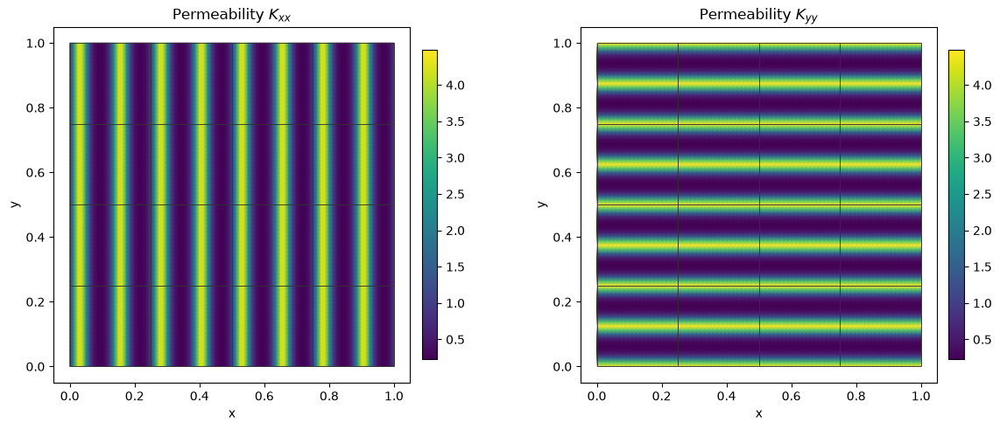
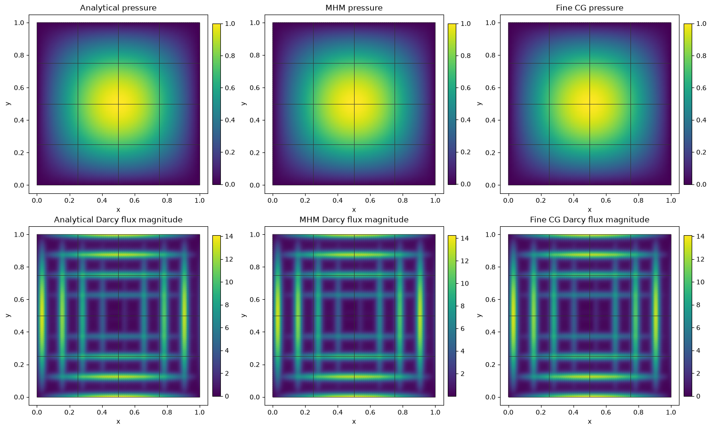

# Multiscale Darcy: the formulation, the API and three approximation scales

Follow the numbered steps: state the variational problem, choose the local and trace spaces, declare the local and global equations, solve, and inspect the physical fields.

This notebook builds primal MHM from `Equation`, `LocalEquations` and `MultiscaleProblem`, step by step. A small macro mesh controls the global problem; independent local fine meshes resolve the material oscillations. The baseline is classical conforming Galerkin assembled on several much finer global meshes.

Start Jupyter from the project root with `pixi run --locked -e introduction jupyter lab`. Run the cells in order. Every coefficient, source, equation, reference, field evaluation and plotting function is defined in this notebook. Imported PyMHM functions provide generic finite-element and algebraic operations.

The manufactured solution distinguishes the finite-reference error from the multiscale error. This is an analytical control devised for this tutorial, rather than a matched paper reproduction.

The local Neumann responses, skeletal flux unknowns and retained cell constants follow [Harder, Paredes and Valentin (2013)](https://doi.org/10.1016/j.jcp.2013.03.019). The oscillatory manufactured data and refinement sequence are defined for this tutorial.


```python
from pathlib import Path
import sys
import hashlib
import json
from dataclasses import dataclass
from functools import partial
from typing import Any, Callable, Sequence, Mapping
import numpy as np
from numpy.typing import NDArray
from scipy import sparse
from matplotlib.collections import LineCollection
import matplotlib.pyplot as plt
import ufl
from scipy.spatial import cKDTree
from pymhm.core.equations import compile_form

ROOT = next(p for p in (Path.cwd(), *Path.cwd().parents)
            if (p / "pyproject.toml").is_file() and (p / "src/pymhm").is_dir())
if str(ROOT) not in sys.path:
    sys.path.insert(0,str(ROOT))

from pymhm import Equation, LocalEquations, MultiscaleProblem, assemble, columns
from pymhm.core.assembly import SolverConfig
from pymhm.execution.cpu import ExecutionConfig
from pymhm.meshes.cartesian import CartesianMacroMesh
from pymhm.fem.traces.interval import FaceSpace, SkeletonSpace
from pymhm.fem.scalar.quadrilateral import (
    qk_space, qk_basis, quadrilateral_quadrature,
    quadrilateral_operators, quadrilateral_trace_coupling)
from pymhm.fem.scalar.operators import boundary_data
from pymhm.linalg.linear import solve_linear
from pymhm.materials.cartesian import CartesianCellField
from pymhm.materials.evaluation import tensor_values, scalar_values
from pymhm.fem.assembly import assemble_element_blocks

Array = NDArray[np.float64]
Evaluator = Callable[[Array], tuple[Array, Array]]
```

## 1. Physical problem and an independently derived source

On $\Omega=(0,1)^2$, Darcy's law and conservation are


$$
\boldsymbol q=-K\nabla p,\qquad\nabla\cdot\boldsymbol q=f,
\qquad p=0\quad\text{on }\partial\Omega.
$$


Choose $\varepsilon=1/8$, $a=1.5$ and


$$
\begin{aligned}
K(x,y)&=\mathrm{diag}\!\left(e^{a\sin(\omega x)},e^{a\cos(\omega y)}\right),
\qquad\omega=2\pi/\varepsilon,\\
p_\star(x,y)&=\sin(\pi x)\sin(\pi y).
\end{aligned}
$$


The uniform spectral contrast is $e^{2a}\simeq20.1$. Eight oscillations fit in each direction, even when only four macroelements fit in that direction. Differentiate **before** discretizing:


$$
f=\pi^2(K_{xx}+K_{yy})p_\star
 -(\partial_xK_{xx})\partial_xp_\star
 -(\partial_yK_{yy})\partial_yp_\star.
$$


The data class below implements these expressions directly. Its source never applies an assembled matrix to the exact coefficients. The coefficient is smooth, but its derivatives depend on $\varepsilon$; our convergence measurements keep $\varepsilon$ fixed.


```python
@dataclass(frozen=True)
class OscillatoryDarcyData:
    """Smooth anisotropic diffusion with declared wavelength and contrast.

    ``Kxx=exp(a*sin(2*pi*x/epsilon))`` and
    ``Kyy=exp(a*cos(2*pi*y/epsilon))``; cross entries vanish. Thus the
    uniform spectral contrast is ``exp(2*a)``, independently of the mesh.
    """

    epsilon: float = 0.125
    amplitude: float = 1.5

    def permeability(self, points: Array) -> Array:
        """Return the physical SPD tensor at XY points, with no averaging."""
        phase = 2 * np.pi * points / self.epsilon
        tensors = np.zeros((len(points), 2, 2))
        tensors[:, 0, 0] = np.exp(self.amplitude * np.sin(phase[:, 0]))
        tensors[:, 1, 1] = np.exp(self.amplitude * np.cos(phase[:, 1]))
        return tensors

    def pressure(self, points: Array) -> Array:
        """Return ``sin(pi*x)*sin(pi*y)`` on the unit square."""
        return np.sin(np.pi * points[:, 0]) * np.sin(np.pi * points[:, 1])

    def gradient(self, points: Array) -> Array:
        """Return the independently differentiated exact pressure gradient."""
        x, y = np.pi * points.T
        return np.pi * np.column_stack((np.cos(x) * np.sin(y), np.sin(x) * np.cos(y)))

    def flux(self, points: Array) -> Array:
        """Return exact physical Darcy flux ``-K grad(p)``."""
        return -np.einsum("qab,qb->qa", self.permeability(points), self.gradient(points))

    def source(self, points: Array) -> Array:
        """Return independently differentiated ``-div(K grad(p))``.

        This expression uses analytic derivatives of both K and p, never the
        assembled operator or a discretely manufactured right-hand side.
        """
        omega = 2 * np.pi / self.epsilon
        k = self.permeability(points)
        derivative_x = self.amplitude * omega * np.cos(omega * points[:, 0]) * k[:, 0, 0]
        derivative_y = -self.amplitude * omega * np.sin(omega * points[:, 1]) * k[:, 1, 1]
        gradient = self.gradient(points)
        return (
            np.pi**2 * (k[:, 0, 0] + k[:, 1, 1]) * self.pressure(points)
            - derivative_x * gradient[:, 0]
            - derivative_y * gradient[:, 1]
        )
```

## 2. Choose the three approximation scales

`macro` defines the global element size. `local_refinement` chooses how each macroelement resolves the material, while the trace degree and segments choose the interface approximation. The convergence study varies these choices separately.


```python
data = OscillatoryDarcyData(epsilon=1/8, amplitude=1.5)
exact = lambda points: (data.pressure(points), data.gradient(points))
macro = CartesianMacroMesh(4, 4)
# H=1/4; h_local=H/r=1/64; degree k=2; trace degree ell=1.
local_degree, local_refinement, trace_segments = 2, 16, 2
skeleton = SkeletonSpace(
    macro, tuple(FaceSpace.uniform(1, trace_segments, continuous=True)
                 for _ in macro.faces))
print({"macro_cells": len(macro.cells), "H": 1/4,
       "local_h": 1/64, "epsilon": data.epsilon,
       "spectral_contrast": float(np.exp(2*data.amplitude))})
```

```text
{'macro_cells': 16, 'H': 0.25, 'local_h': 0.015625, 'epsilon': 0.125, 'spectral_contrast': 20.085536923187668}
```

## 3. Translate the weak formulation into local and global objects

On each macroelement $T$, pressure uses a continuous $Q_k$ fine space. The skeletal multiplier $\lambda$ is the physical normal Darcy flux in the unique orientation $\boldsymbol n_F$ of face $F$. `quadrilateral_trace_coupling` integrates $s_{TF}=\boldsymbol n_T\cdot\boldsymbol n_F$ with the actual macroface orientation.


$$
\begin{aligned}
a_T(p_T,v)+\langle s_{TF}\lambda,v\rangle_{\partial T}&=(f,v)_T,\\
a_T(p_T,v)&=\int_T K\nabla p_T\cdot\nabla v.
\end{aligned}
$$


| Mathematical term | Code declaration |
| --- | --- |
| Local energy and source | `a=inner(K*grad(p),grad(v))*dx`, `L=f*v*dx` in UFL |
| Oriented normal-flux pairing | `quadrilateral_trace_coupling` returns `b` |
| Constant kernel and physical average | `kernel`, `moments` in `LocalEquations` |
| Weak pressure continuity | `c=-b.T` |
| Macroface coordinates | `skeleton.cell_dofs(cell)` |

Interior faces have zero pressure-jump moments; Dirichlet faces have prescribed pressure moments. With the declared sign $C=-B^T$, the additional global right-hand side is


$$
-\sum_T\langle s_{TF}\mu,p_T\rangle_{\partial T}
=-\langle\mu,p_D\rangle_{\Gamma_D}.
$$


`Equation(0, ...)` stores this additional global term. One constant mode per macroelement gives the compatibility equation imposing **macro conservation**. The plotted raw flux $-K\nabla p_h$ is not an $H(\mathrm{div})$ reconstruction and is not guaranteed to conserve on every fine cell.

The provider below declares the executable UFL weak forms and each coupling sign. The nodal map checks that native UFL coordinates and portable trace coordinates represent the same basis. The generic `assemble` operation owns elimination, assembly and reconstruction; no PDE-specific problem constructor is used.


```python
def native_scalar_space(fine: CartesianMacroMesh, degree: int) -> tuple[Any, Any, NDArray[np.int64]]:
    """Create serial equispaced Qk and map portable scalar nodes to native DOFs."""
    import basix
    import basix.ufl
    import ufl
    from dolfinx import fem,mesh as native_mesh
    from mpi4py import MPI
    geometry=basix.ufl.element("Lagrange","quadrilateral",1,shape=(2,))
    # Basix quadrilateral geometry orders SW,SE,NW,NE; our cells are counterclockwise.
    domain=native_mesh.create_mesh(MPI.COMM_SELF,fine.cells[:,[0,1,3,2]],fine.points,
                                  ufl.Mesh(geometry))
    element=basix.ufl.element("Lagrange","quadrilateral",degree,
                             lagrange_variant=basix.LagrangeVariant.equispaced)
    space=fem.functionspace(domain,element)
    _,nodes=qk_space(fine,degree)
    native_nodes=space.tabulate_dof_coordinates()[:,:2]
    distance,mapping=cKDTree(native_nodes).query(nodes)
    tolerance=512*np.finfo(float).eps*max(1.,float(np.max(np.abs(nodes))))
    if np.max(distance)>tolerance or len(np.unique(mapping))!=len(nodes):
        raise ValueError("native and portable Qk coordinates must have a checked bijection")
    return domain,space,mapping


def ufl_coefficient_source(domain: Any, physical_data: OscillatoryDarcyData) -> tuple[Any, Any]:
    """Declare the same smooth K and independently differentiated manufactured f in UFL."""
    x=ufl.SpatialCoordinate(domain)
    a,omega=physical_data.amplitude,2*np.pi/physical_data.epsilon
    kxx=ufl.exp(a*ufl.sin(omega*x[0]))
    kyy=ufl.exp(a*ufl.cos(omega*x[1]))
    tensor=ufl.as_matrix(((kxx,0.),(0.,kyy)))
    exact_pressure=ufl.sin(np.pi*x[0])*ufl.sin(np.pi*x[1])
    pressure_x=np.pi*ufl.cos(np.pi*x[0])*ufl.sin(np.pi*x[1])
    pressure_y=np.pi*ufl.sin(np.pi*x[0])*ufl.cos(np.pi*x[1])
    kxx_x=a*omega*ufl.cos(omega*x[0])*kxx
    kyy_y=-a*omega*ufl.sin(omega*x[1])*kyy
    force=np.pi**2*(kxx+kyy)*exact_pressure-kxx_x*pressure_x-kyy_y*pressure_y
    return tensor,force


@dataclass(frozen=True)
class DarcyLocalProvider:
    """Declare primal Qk UFL energy, physical flux coupling and pressure moments."""
    macro: CartesianMacroMesh
    skeleton: SkeletonSpace
    data: object
    degree: int
    refinement: int
    quadrature_order: int

    def __call__(self, cell: int) -> LocalEquations:
        """Declare K grad(p)·grad(v), f v, oriented normal flux and the constant average."""
        fine=self.macro.submesh(cell,self.refinement)
        domain,space,mapping=native_scalar_space(fine,self.degree)
        p,v=ufl.TrialFunction(space),ufl.TestFunction(space)
        K,f=ufl_coefficient_source(domain,self.data)
        dx=ufl.Measure("dx",domain=domain,
                       metadata={"quadrature_degree":2*self.quadrature_order-1})
        # These executed UFL forms are the local weak formulation, directly.
        a=ufl.inner(K*ufl.grad(p),ufl.grad(v))*dx
        load=f*v*dx
        portable_b=quadrilateral_trace_coupling(
            self.macro,cell,fine,self.skeleton,self.degree)
        b=np.empty_like(portable_b);b[mapping]=portable_b
        area=float(fine.areas.sum())
        return LocalEquations(
            a=a,L=load,b=b,c=-b.T,dofs=self.skeleton.cell_dofs(cell),
            kernel=np.ones((len(mapping),1)),moments=columns((v/area)*dx),
            metadata=(fine,mapping))

```

## 4. Construct, assemble and solve the global problem

`coarse_sizes=(1,...)` retains one pressure-average coordinate per macroelement. The global equation imposes pressure through boundary moments, without fixing local pressure nodes. Dirichlet data remove the global constant-pressure ambiguity, so no additional physical gauge is required.

The local problems compute source responses and responses to trace basis functions. Their coefficients are recovered after solving for the macroface and retained coordinates. They do not create a large conforming global mesh.

### Evaluate pressure in its executed coefficient basis

Before reconstructing fields, define how the x-fastest Qk coefficients represent pressure and physical gradients. The second function selects a macrocell and evaluates its independent local coefficients. This is field evaluation, not another solve; it preserves the distinction between broken pressure and physical Darcy flux.


```python
def evaluate_qk(
    mesh: CartesianMacroMesh, degree: int, coefficients: Array, points: Array
) -> tuple[Array, Array]:
    """Evaluate x-fastest Qk coefficients as pressure and raw gradient.

    Values at an internal fine-grid interface use the cell on its positive
    side. Passing each macrocell separately retains its independent traces.
    """
    coordinates = (points - mesh.points[0]) / mesh.spacing
    counts = np.asarray([mesh.nx, mesh.ny])
    indices = np.clip(np.floor(coordinates).astype(int), 0, counts - 1)
    reference = np.clip(coordinates - indices, 0, 1)
    width = mesh.nx * degree + 1
    offsets = np.asarray([j * width + i for j in range(degree + 1) for i in range(degree + 1)])
    ids = degree * (indices[:, 1] * width + indices[:, 0])[:, None] + offsets
    basis, gradients = qk_basis(degree, reference)
    local = coefficients[ids]
    return np.einsum("qi,qi->q", basis, local), np.einsum(
        "qi,qia->qa", local, gradients / mesh.spacing
    )

def evaluate_broken_qk(
    macro: CartesianMacroMesh,
    locals_: tuple[CartesianMacroMesh, ...],
    degree: int,
    coefficients: tuple[Array, ...],
    points: Array,
) -> tuple[Array, Array]:
    """Evaluate broken macrocell coefficients without blending their interfaces."""
    coordinates = (points - macro.points[0]) / macro.spacing
    indices = np.clip(np.floor(coordinates).astype(int), 0, [macro.nx - 1, int(macro.ny) - 1])
    owners = indices[:, 1] * macro.nx + indices[:, 0]
    pressure, gradient = np.empty(len(points)), np.empty((len(points), 2))
    for cell in np.unique(owners):
        selected = owners == cell
        pressure[selected], gradient[selected] = evaluate_qk(
            locals_[cell], degree, coefficients[cell], points[selected]
        )
    return pressure, gradient
```


```python
provider = DarcyLocalProvider(macro, skeleton, data,
                              local_degree, local_refinement, 7)
boundary, fixed = boundary_data(skeleton, data.pressure, order=7)
problem = MultiscaleProblem(
    global_equation=Equation(0, np.r_[-boundary, np.zeros(len(macro.cells))]),
    local_provider=provider, items=range(len(macro.cells)),
    trace_size=skeleton.size, coarse_sizes=(1,)*len(macro.cells), fixed=fixed)
system = assemble(problem, execution=ExecutionConfig("serial", native_threads=1))
solution = system.solve()
local_meshes = tuple(record[0] for record in system.local_metadata)
mhm_fields = tuple(field[record[1]] for field,record in zip(solution.fields,system.local_metadata,strict=True))
mhm_evaluator = partial(evaluate_broken_qk, macro, local_meshes,
                        local_degree, mhm_fields)
print({"global_unknowns": system.matrix.shape[0],
       "largest_local_unknowns": max(len(v) for v in solution.fields),
       "original_equations_relative_residual": solution.raw_residual})
```

```text
{'global_unknowns': 136, 'largest_local_unknowns': 1089, 'original_equations_relative_residual': 1.6510917839655026e-16}
```

### Optional numerical equivalence after the UFL definition

The main formulation above is the executed UFL weak form. Once its operator and coordinate conventions are explicit, `quadrilateral_operators` provides an alternative assembled representation. The following control verifies equivalence on one local mesh; it does not select the global/local problem or hide its forms. The classical baseline below remains an explicit UFL assembly.


```python
declared=provider(0)
fine,mapping=declared.metadata
ufl_a=compile_form(declared.a)
ufl_load=compile_form(declared.L,(len(mapping),))
ready_a,_,ready_load=quadrilateral_operators(fine,local_degree,
    permeability=data.permeability,source=data.source,order=provider.quadrature_order)
operator_defect=np.max(np.abs((ufl_a[mapping][:,mapping]-ready_a).data),initial=0.)
load_defect=float(np.max(np.abs(ufl_load[mapping]-ready_load),initial=0.))
print({"UFL_vs_ready_operator_max":float(operator_defect),"UFL_vs_ready_source_max":load_defect})
assert operator_defect<1e-10*max(1.,float(np.max(np.abs(ready_a.data))))
assert load_defect<1e-10*max(1.,float(np.max(np.abs(ready_load))))
```

```text
{'UFL_vs_ready_operator_max': 2.842170943040401e-14, 'UFL_vs_ready_source_max': 8.326672684688674e-17}
```

## 5. Classical primal Galerkin on independently refined global meshes

Now assemble **one global continuous matrix**, without an MHM skeleton or local condensation. The operator, permeability, source and boundary values are identical. Strong Dirichlet values eliminate boundary nodes; `dirichlet_solve`, defined below, performs only that generic algebraic elimination.


$$
A^{\rm CG}_{ij}=\int_\Omega K\nabla\phi_j\cdot\nabla\phi_i,
\qquad F^{\rm CG}_i=\int_\Omega f\phi_i.
$$


Evaluate pressure and raw gradients directly from the executed nodal basis. Integrate on a common grid resolving every compared finite-element mesh, with physical Gauss weights. The field measurements are pressure $L^2$, vector Darcy flux $L^2$, and flux energy


$$
\left(\int_\Omega\boldsymbol e_q^T K^{-1}\boldsymbol e_q\right)^{1/2}.
$$


The baseline is assembled independently as a different classical discretization, while sharing PyMHM basis and integration kernels. It is not an independent external-code comparison. Successive references are compared, and the analytical solution separately verifies their errors.


```python
def dirichlet_solve(matrix: Any, load: Array, dofs: NDArray[np.int64], values: Array) -> Array:
    """Lift strong Dirichlet values and solve the remaining classical equations."""
    operator=sparse.csc_matrix(matrix)
    coefficients=np.zeros(len(load))
    coefficients[dofs]=values
    free=np.setdiff1d(np.arange(len(load)),dofs)
    forcing=load[free]-operator[free][:,dofs]@coefficients[dofs]
    coefficients[free]=solve_linear(operator[free][:,free],forcing)
    return coefficients

def grid_quadrature(
    bounds: tuple[float, float, float, float], shape: tuple[int, int], order: int = 5
) -> tuple[Array, Array]:
    """Return Gauss points and physical weights on an explicitly resolved grid.

    The caller chooses a common grid resolving every compared finite-element
    interface and material pixel; the function never infers hidden jumps.
    """
    grid = CartesianMacroMesh(*shape, bounds)
    reference, unit_weights = quadrilateral_quadrature(order)
    origins = grid.points[grid.cells[:, 0]]
    return (origins[:, None] + reference * grid.spacing).reshape(-1, 2), np.tile(
        unit_weights * np.prod(grid.spacing), len(grid.cells)
    )

def physical_errors(
    first: Evaluator,
    second: Evaluator,
    permeability: Any,
    points: Array,
    weights: Array,
    *,
    batch_size: int = 65536,
) -> dict[str, float]:
    """Integrate L2 pressure, L2 physical flux and K-inverse flux-energy differences.

    Fields are evaluated directly in their executed coefficient bases on the
    same quadrature, never through image samples or averaged gradients.
    """
    totals = np.zeros(6)
    for begin in range(0, len(points), batch_size):
        selected = slice(begin, begin + batch_size)
        x, w = points[selected], weights[selected]
        p, grad = first(x)
        pref, gradref = second(x)
        k = tensor_values(permeability, x)
        dq = -np.einsum("qab,qb->qa", k, grad - gradref)
        qref = -np.einsum("qab,qb->qa", k, gradref)
        totals += np.asarray(
            [
                w @ (p - pref) ** 2,
                w @ np.sum(dq**2, axis=1),
                w @ np.einsum("qa,qa->q", dq, np.linalg.solve(k, dq[..., None])[..., 0]),
                w @ pref**2,
                w @ np.sum(qref**2, axis=1),
                w @ np.einsum("qa,qa->q", qref, np.linalg.solve(k, qref[..., None])[..., 0]),
            ]
        )
    values = np.sqrt(totals)
    return dict(
        pressure_L2=float(values[0]),
        flux_L2=float(values[1]),
        flux_energy=float(values[2]),
        pressure_relative=float(values[0] / values[3]),
        flux_relative=float(values[1] / values[4]),
        energy_relative=float(values[2] / values[5]),
    )
```


```python
reference_rows, reference_evaluators = [], []
error_points, error_weights = grid_quadrature(macro.bounds, (128, 128), order=7)
for n in (32, 64, 128):
    fine = CartesianMacroMesh(n, n)
    domain,space,mapping=native_scalar_space(fine,2)
    p,v=ufl.TrialFunction(space),ufl.TestFunction(space)
    K,f=ufl_coefficient_source(domain,data)
    dx=ufl.Measure("dx",domain=domain,metadata={"quadrature_degree":13})
    a_cg=compile_form(ufl.inner(K*ufl.grad(p),ufl.grad(v))*dx)
    load_cg=compile_form(f*v*dx)
    _, nodes = qk_space(fine, 2)
    exterior = np.flatnonzero(np.any(np.isclose(nodes, 0) | np.isclose(nodes, 1), axis=1))
    coefficients = dirichlet_solve(a_cg, load_cg, mapping[exterior], data.pressure(nodes[exterior]))[mapping]
    evaluator = partial(evaluate_qk, fine, 2, coefficients)
    reference_evaluators.append(evaluator)
    errors = physical_errors(evaluator, exact, data.permeability, error_points, error_weights)
    reference_rows.append({"n": n, "unknowns": len(nodes), **errors})
reference_rows
```


```text
[{'n': 32,
  'unknowns': 4225,
  'pressure_L2': 1.6318965471072642e-05,
  'flux_L2': 0.0014999740470356766,
  'flux_energy': 0.0009521702553866294,
  'pressure_relative': 3.2637930942145284e-05,
  'flux_relative': 0.0003056354275708311,
  'energy_relative': 0.00033401766442094175},
 {'n': 64,
  'unknowns': 16641,
  'pressure_L2': 1.2191024764276339e-06,
  'flux_L2': 0.0004247613394424418,
  'flux_energy': 0.0002514193228832236,
  'pressure_relative': 2.4382049528552678e-06,
  'flux_relative': 8.654957320935687e-05,
  'energy_relative': 8.819693174058399e-05},
 {'n': 128,
  'unknowns': 66049,
  'pressure_L2': 9.400677112227076e-08,
  'flux_L2': 0.00010915481614597537,
  'flux_energy': 6.370482539257987e-05,
  'pressure_relative': 1.8801354224454152e-07,
  'flux_relative': 2.224143742361506e-05,
  'energy_relative': 2.2347407797708685e-05}]
```


```python
reference_refinement = [
    physical_errors(first, second, data.permeability, error_points, error_weights)
    for first, second in zip(reference_evaluators[:-1], reference_evaluators[1:])]
print("Successive reference differences:", reference_refinement)
reference = reference_evaluators[-1]
comparison = physical_errors(mhm_evaluator, reference, data.permeability,
                             error_points, error_weights)
exact_errors = physical_errors(mhm_evaluator, exact, data.permeability,
                              error_points, error_weights)
print("MHM versus fine CG:", comparison)
print("MHM versus exact solution:", exact_errors)
# A solução exata mantém a conclusão independente da incerteza da referência.
assert reference_rows[-1]["flux_L2"] < reference_rows[0]["flux_L2"]
assert reference_rows[-1]["pressure_L2"] < reference_rows[0]["pressure_L2"]
```

```text
Successive reference differences: [{'pressure_L2': 1.5234803545787962e-05, 'flux_L2': 0.0014259004433549434, 'flux_energy': 0.0009183771099355073, 'pressure_relative': 3.0469539470096415e-05, 'flux_relative': 0.0002905424940205197, 'energy_relative': 0.0003221631601870045}, {'pressure_L2': 1.1518268950028591e-06, 'flux_L2': 0.00041098995715294415, 'flux_energy': 0.00024321466063586947, 'pressure_relative': 2.303653459930783e-06, 'flux_relative': 8.374351625547069e-05, 'energy_relative': 8.531876779310019e-05}]
```

```text
MHM versus fine CG: {'pressure_L2': 0.00021110534459092416, 'flux_L2': 0.019092751630449985, 'flux_energy': 0.012636675043129987, 'pressure_relative': 0.00042221062868614076, 'flux_relative': 0.003890348483457582, 'energy_relative': 0.004432897017239536}
MHM versus exact solution: {'pressure_L2': 0.00021110587827481527, 'flux_L2': 0.01909305299115349, 'flux_energy': 0.012636835728452565, 'pressure_relative': 0.00042221175654963053, 'flux_relative': 0.0038904095881633176, 'energy_relative': 0.004432953383924943}
```

## 6. Plot the coefficient, pressure and physical flux

The overlay is the actual macro mesh used by MHM, on every analytical, numerical and reference panel. Duplicate interface coordinates belong to separate local triangulations, preserving both one-sided values. Neither the broken pressure nor its raw flux is smoothed across macrofaces.

The permeability tensor has two distinct diagonal components: $K_{xx}$ controls transport in the x direction and $K_{yy}$ in the y direction. Plot both with the same physical color limits to compare their oscillations. The field panels then place the analytical pressure and Darcy flux beside MHM and the refined classical reference.


```python
def rectangle_panel(
    macro: CartesianMacroMesh,
    evaluator: Evaluator,
    *,
    quantity: str = "pressure",
    permeability: Any = 1.0,
    points_per_side: int = 21,
) -> tuple[Array, NDArray[np.int64], Array]:
    """Sample each macro rectangle independently, retaining two interface limits.

    Evaluation points approach boundary nodes from their macrocell interior.
    Plot coordinates stay on the true interfaces. ``quantity`` is pressure,
    permeability_xx, permeability_yy or physical Darcy flux magnitude.
    """
    axis = np.linspace(0, 1, points_per_side)
    x, y = np.meshgrid(axis, axis)
    reference = np.column_stack((x.ravel(), y.ravel()))
    indices = np.arange(points_per_side**2).reshape(points_per_side, points_per_side)
    a, b = indices[:-1, :-1].ravel(), indices[:-1, 1:].ravel()
    c, d = indices[1:, 1:].ravel(), indices[1:, :-1].ravel()
    base = np.vstack((np.column_stack((a, b, c)), np.column_stack((a, c, d))))
    points, triangles, values = [], [], []
    for cell, vertices in enumerate(macro.cells):
        lower = macro.points[vertices[0]]
        physical = lower + reference * macro.spacing
        center = macro.points[vertices].mean(axis=0)
        inside = np.nextafter(physical, center)
        if quantity in {"permeability_xx", "permeability_yy"}:
            component = 0 if quantity == "permeability_xx" else 1
            value = tensor_values(permeability, inside)[:, component, component]
        else:
            pressure, gradient = evaluator(inside)
            if quantity == "pressure":
                value = pressure
            elif quantity == "flux_magnitude":
                flux = -np.einsum("qab,qb->qa", tensor_values(permeability, inside), gradient)
                value = np.linalg.norm(flux, axis=1)
            else:
                raise ValueError("unknown Darcy plot quantity")
        points.append(physical)
        triangles.append(base + cell * len(reference))
        values.append(value)
    return np.vstack(points), np.vstack(triangles), np.concatenate(values)

def plot_field_panels(
    macro_mesh: Any,
    panels: Mapping[str, tuple[np.ndarray, np.ndarray, np.ndarray]],
    *,
    figsize: tuple[float, float] | None = None,
    color_limits: Mapping[str, tuple[float, float]] | None = None,
) -> Any:
    """Plot independent nodal scalar panels and their actual macrofaces.

    Each panel supplies physical points, its explicit triangular connectivity
    and values. Duplicate coordinates are retained, so broken one-sided fields
    are never averaged across a macroface. Each field has its own colorbar.
    ``color_limits`` optionally sets physical minimum/maximum values by label,
    allowing related fields to use matching scales without merging colorbars.
    """
    import matplotlib.pyplot as plt
    from matplotlib.tri import Triangulation

    count = len(panels)
    if not count:
        raise ValueError("provide at least one field panel")
    columns = min(3, count)
    rows = (count + columns - 1) // columns
    size = figsize or (4.1 * columns, 3.6 * rows)
    figure, axes = plt.subplots(rows, columns, figsize=size, squeeze=False, layout="constrained")
    for axis, (label, (points, triangles, values)) in zip(axes.flat, panels.items(), strict=False):
        coordinates = np.asarray(points)
        triangulation = Triangulation(*coordinates.T, triangles)
        limits = {}
        if color_limits is not None and label in color_limits:
            lower, upper = color_limits[label]
            if not np.isfinite([lower, upper]).all() or lower >= upper:
                raise ValueError("color limits must be finite and increasing")
            limits = {"vmin": lower, "vmax": upper}
        artist = axis.tripcolor(triangulation, values, shading="gouraud", rasterized=True, **limits)
        axis.add_collection(LineCollection(macro_mesh.points[macro_mesh.faces], colors="0.2", linewidths=0.65, zorder=3))
        axis.set(title=label, xlabel="x", ylabel="y", aspect="equal")
        figure.colorbar(artist, ax=axis, shrink=0.87, pad=0.025)
    for axis in list(axes.flat)[count:]:
        axis.set_visible(False)
    return figure
```


```python
permeability_panels = {
    "Permeability $K_{xx}$": rectangle_panel(macro, exact, quantity="permeability_xx", permeability=data.permeability),
    "Permeability $K_{yy}$": rectangle_panel(macro, exact, quantity="permeability_yy", permeability=data.permeability),
}
permeability_bounds = (np.exp(-data.amplitude), np.exp(data.amplitude))
plot_field_panels(
    macro, permeability_panels, figsize=(12, 4.8),
    color_limits={label: permeability_bounds for label in permeability_panels},
)
plt.show()

panels = {
    "Analytical pressure": rectangle_panel(macro, exact),
    "MHM pressure": rectangle_panel(macro, mhm_evaluator),
    "Fine CG pressure": rectangle_panel(macro, reference),
    "Analytical Darcy flux magnitude": rectangle_panel(macro, exact, quantity="flux_magnitude", permeability=data.permeability),
    "MHM Darcy flux magnitude": rectangle_panel(macro, mhm_evaluator, quantity="flux_magnitude", permeability=data.permeability),
    "Fine CG Darcy flux magnitude": rectangle_panel(macro, reference, quantity="flux_magnitude", permeability=data.permeability),
}
plot_field_panels(macro, panels, figsize=(15, 9))
plt.show()
```


[](../../assets/tutorials/darcy_multiscale_convergence/figure_20_0.png)


[](../../assets/tutorials/darcy_multiscale_convergence/figure_20_1.png)


## 7. Separate macro size, local size and macroface resolution

There are three independent controls: macro size $H$, local size $h=H/r$, and the trace space (degree $\ell$ and segmentation). Simultaneous refinement can hide which control limits the accuracy. Keep $k=2$ and $\ell=1$ and run:

1. $H=1/2,1/4,1/8$ with fixed $h=1/64$ and two segments per face;
2. $h=1/8,1/16,1/32,1/64$ with fixed $H=1/4$ and two segments per face;
3. one, two and four segments per face with fixed $H=1/4$ and $h=1/64$.

The driver below repeats the same visible local/global declarations. Successive observed rates use $\log(e_i/e_{i+1})/\log(s_i/s_{i+1})$, where $s$ is $H$, $h$, or segment length. A plateau indicates another limiting scale; these measurements are not universal rate claims.


```python
def observed_rates(mesh_sizes: Any, errors: Any) -> np.ndarray:
    """Return log(error[i]/error[i+1])/log(H[i]/H[i+1]) without assumed orders."""
    h, e = np.asarray(mesh_sizes, dtype=float), np.asarray(errors, dtype=float)
    if h.ndim != 1 or e.shape != h.shape or len(h) < 2:
        raise ValueError("provide at least two matching refinement levels")
    if np.any(h <= 0) or np.any(np.diff(h) >= 0) or np.any(e <= 0):
        raise ValueError("mesh sizes must decrease and measured errors must be positive")
    return np.log(e[:-1] / e[1:]) / np.log(h[:-1] / h[1:])

def plot_convergence(mesh_sizes: Any, errors: Mapping[str, Any]) -> Any:
    """Plot actual errors and observed successive rates in separate readable axes."""
    import matplotlib.pyplot as plt
    from matplotlib.ticker import NullLocator

    h = np.asarray(mesh_sizes, dtype=float)
    figure, axes = plt.subplots(1, 2, figsize=(10, 3.5), layout="constrained")
    for label, values in errors.items():
        e = np.asarray(values, dtype=float)
        axes[0].loglog(h, e, "o-", label=label)
        axes[1].semilogx(h[1:], observed_rates(h, e), "o-", label=label)
    axes[0].set(xlabel="H", ylabel="Measured error")
    axes[1].set(xlabel="H", ylabel="Observed rate")
    for axis, locations in zip(axes, (h, h[1:]), strict=True):
        axis.set_xticks(locations, [f"{value:.4g}" for value in locations])
        axis.xaxis.set_minor_locator(NullLocator())
        axis.invert_xaxis()
        axis.grid(True, which="both", alpha=0.25)
        axis.legend(fontsize=8)
    return figure
```


```python
def run_discretization(n: int, refinement: int, segments: int) -> dict:
    """Repeat the declared local/global equations for one explicit resolution."""
    grid = CartesianMacroMesh(n, n)
    trace = SkeletonSpace(grid, tuple(FaceSpace.uniform(1, segments, continuous=True)
                                     for _ in grid.faces))
    local = DarcyLocalProvider(grid, trace, data, 2, refinement, 7)
    boundary, fixed = boundary_data(trace, data.pressure, order=7)
    declared = MultiscaleProblem(
        Equation(0, np.r_[-boundary, np.zeros(len(grid.cells))]), local,
        range(len(grid.cells)), trace.size, (1,)*len(grid.cells), fixed=fixed)
    assembled = assemble(declared, execution=ExecutionConfig("serial", native_threads=1))
    resolved = assembled.solve()
    evaluate = partial(evaluate_broken_qk, grid, tuple(record[0] for record in assembled.local_metadata), 2,
                       tuple(field[record[1]] for field,record in zip(resolved.fields,assembled.local_metadata,strict=True)))
    return {"H": 1/n, "h": 1/(n*refinement), "segments": segments,
            "trace_segment_length": 1/(n*segments),
            "global_unknowns": assembled.matrix.shape[0],
            "residual": resolved.raw_residual,
            **physical_errors(evaluate, exact, data.permeability, error_points, error_weights)}

macro_rows = [run_discretization(n, 64//n, 2) for n in (2, 4, 8)]
local_rows = [run_discretization(4, r, 2) for r in (2, 4, 8, 16)]
trace_rows = [run_discretization(4, 16, s) for s in (1, 2, 4)]
for name, rows, variable in (("H", macro_rows, "H"), ("h", local_rows, "h"),
                             ("macroface segment", trace_rows, "trace_segment_length")):
    scales = [row[variable] for row in rows]
    print(name, rows)
    print("Observed pressure rates:", observed_rates(scales, [r["pressure_L2"] for r in rows]))
    print("Observed flux rates:", observed_rates(scales, [r["flux_L2"] for r in rows]))
    figure=plot_convergence(scales, {"pressure L2": [r["pressure_L2"] for r in rows],
                             "Darcy flux L2": [r["flux_L2"] for r in rows]})
    for axis in figure.axes: axis.set_xlabel(name)
    plt.show()
```

```text
H [{'H': 0.5, 'h': 0.015625, 'segments': 2, 'trace_segment_length': 0.25, 'global_unknowns': 40, 'residual': 2.5686651036001443e-16, 'pressure_L2': 0.0038440419910070315, 'flux_L2': 0.07258266496365394, 'flux_energy': 0.07565780837944536, 'pressure_relative': 0.007688083982014063, 'flux_relative': 0.01478947844746884, 'energy_relative': 0.026540468269351858}, {'H': 0.25, 'h': 0.015625, 'segments': 2, 'trace_segment_length': 0.125, 'global_unknowns': 136, 'residual': 1.6510917839655026e-16, 'pressure_L2': 0.00021110587827481527, 'flux_L2': 0.01909305299115349, 'flux_energy': 0.012636835728452565, 'pressure_relative': 0.00042221175654963053, 'flux_relative': 0.0038904095881633176, 'energy_relative': 0.004432953383924943}, {'H': 0.125, 'h': 0.015625, 'segments': 2, 'trace_segment_length': 0.0625, 'global_unknowns': 496, 'residual': 1.108554207047561e-16, 'pressure_L2': 3.13681029287078e-05, 'flux_L2': 0.004601788846467462, 'flux_energy': 0.003121177398688155, 'pressure_relative': 6.27362058574156e-05, 'flux_relative': 0.0009376626912047576, 'energy_relative': 0.0010948970302899544}]
Observed pressure rates: [4.18658544 2.75059657]
Observed flux rates: [1.92657722 2.05278112]
```


[](../../assets/tutorials/darcy_multiscale_convergence/figure_23_1.png)


```text
h [{'H': 0.25, 'h': 0.125, 'segments': 2, 'trace_segment_length': 0.125, 'global_unknowns': 136, 'residual': 1.3210560310816447e-16, 'pressure_L2': 0.012105242280670532, 'flux_L2': 0.12919546359592846, 'flux_energy': 0.09348496639326709, 'pressure_relative': 0.024210484561341065, 'flux_relative': 0.026324929310869702, 'energy_relative': 0.03279416675379144}, {'H': 0.25, 'h': 0.0625, 'segments': 2, 'trace_segment_length': 0.125, 'global_unknowns': 136, 'residual': 1.339512762009965e-16, 'pressure_L2': 0.00022120794842641565, 'flux_L2': 0.01925385654937206, 'flux_energy': 0.011696612799026921, 'pressure_relative': 0.0004424158968528313, 'flux_relative': 0.0039231749979170205, 'energy_relative': 0.004103126795512717}, {'H': 0.25, 'h': 0.03125, 'segments': 2, 'trace_segment_length': 0.125, 'global_unknowns': 136, 'residual': 1.3434425003451915e-16, 'pressure_L2': 0.0002070069240005869, 'flux_L2': 0.019169351587713844, 'flux_energy': 0.01258764699064359, 'pressure_relative': 0.0004140138480011738, 'flux_relative': 0.003905956226606072, 'energy_relative': 0.004415698163836077}, {'H': 0.25, 'h': 0.015625, 'segments': 2, 'trace_segment_length': 0.125, 'global_unknowns': 136, 'residual': 1.6510917839655026e-16, 'pressure_L2': 0.00021110587827481527, 'flux_L2': 0.01909305299115349, 'flux_energy': 0.012636835728452565, 'pressure_relative': 0.00042221175654963053, 'flux_relative': 0.0038904095881633176, 'energy_relative': 0.004432953383924943}]
Observed pressure rates: [ 5.77408492  0.0957242  -0.02828773]
Observed flux rates: [2.74633606 0.00634591 0.00575373]
```


[](../../assets/tutorials/darcy_multiscale_convergence/figure_23_3.png)


```text
macroface segment [{'H': 0.25, 'h': 0.015625, 'segments': 1, 'trace_segment_length': 0.25, 'global_unknowns': 96, 'residual': 1.1366425726581136e-16, 'pressure_L2': 0.0038370471679656203, 'flux_L2': 0.09746442298583062, 'flux_energy': 0.09155965342167141, 'pressure_relative': 0.0076740943359312405, 'flux_relative': 0.01985939733496613, 'energy_relative': 0.03211877436633379}, {'H': 0.25, 'h': 0.015625, 'segments': 2, 'trace_segment_length': 0.125, 'global_unknowns': 136, 'residual': 1.6510917839655026e-16, 'pressure_L2': 0.00021110587827481527, 'flux_L2': 0.01909305299115349, 'flux_energy': 0.012636835728452565, 'pressure_relative': 0.00042221175654963053, 'flux_relative': 0.0038904095881633176, 'energy_relative': 0.004432953383924943}, {'H': 0.25, 'h': 0.015625, 'segments': 4, 'trace_segment_length': 0.0625, 'global_unknowns': 216, 'residual': 1.6853287149955422e-16, 'pressure_L2': 2.4324400283813582e-05, 'flux_L2': 0.0032500837373538476, 'flux_energy': 0.0022417239887015145, 'pressure_relative': 4.8648800567627164e-05, 'flux_relative': 0.0006622386131748327, 'energy_relative': 0.0007863881556334026}]
Observed pressure rates: [4.18395784 3.11749061]
Observed flux rates: [2.35182789 2.55449901]
```


[](../../assets/tutorials/darcy_multiscale_convergence/figure_23_5.png)


## 8. Interpret accuracy and cost with their physical meaning

The residual of the original equations checks assembly and reconstruction. It does not replace field errors or an inf-sup argument. The declared local kernel is the constant pressure mode, and physical moments fix each local response's mean. Global Dirichlet moments remove the global gauge.

Compare global MHM unknowns with the fine Galerkin unknowns, and compare **flux errors** as well as pressure errors. A convincing pressure image may hide insufficiently resolved gradients. Local setup and solves remain part of the multiscale cost. This notebook reports dimensions and accuracy, without claiming a timing speedup.

The smooth coefficient gives a controlled analytical study. The following SPE10 tutorial instead uses jumps and high contrast, resolves pixel integration, and measures the numerical baseline's own refinement.

## References

- Christopher Harder, Diego Paredes, and Frédéric Valentin (2013). *A family of Multiscale Hybrid-Mixed finite element methods for the Darcy equation with rough coefficients*, Journal of Computational Physics 245, 107–130. [DOI: 10.1016/j.jcp.2013.03.019](https://doi.org/10.1016/j.jcp.2013.03.019).

## Reproduce this tutorial

[View the source notebook](https://github.com/ipes-lncc/pymhm/blob/main/notebooks/introduction/darcy_multiscale_convergence.ipynb) or [download the notebook](https://raw.githubusercontent.com/ipes-lncc/pymhm/main/notebooks/introduction/darcy_multiscale_convergence.ipynb). Run its cells interactively, or execute the notebook from the repository root with the checked-in Pixi lockfile:

```bash
pixi install --locked -e introduction
pixi run --locked -e introduction notebooks-run introduction/darcy_multiscale_convergence.ipynb --timeout 3600
```

The runner writes the executed copy to `build/notebooks/introduction/`. The figures and numerical outputs on this page come from that execution. Timings describe the recorded hardware and solver settings; rerun performance examples on an idle machine to measure your own environment.
