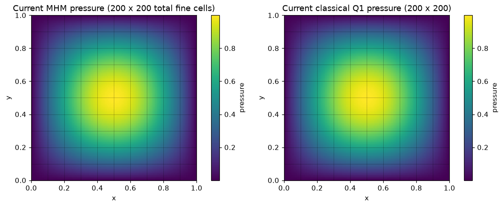
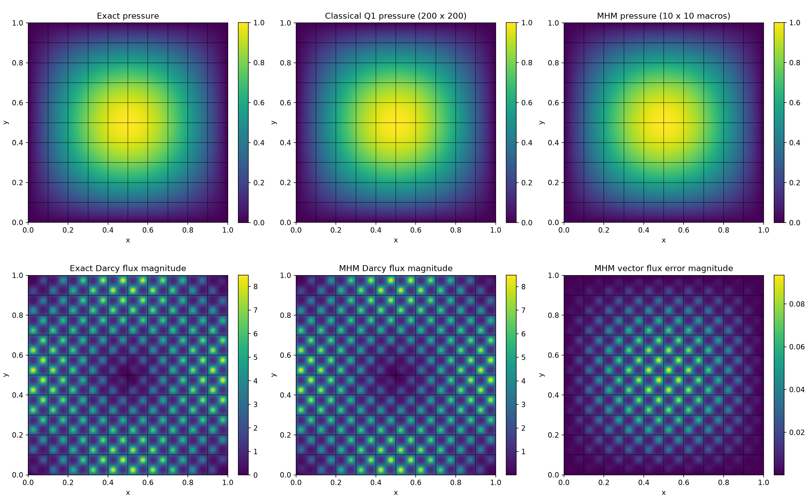
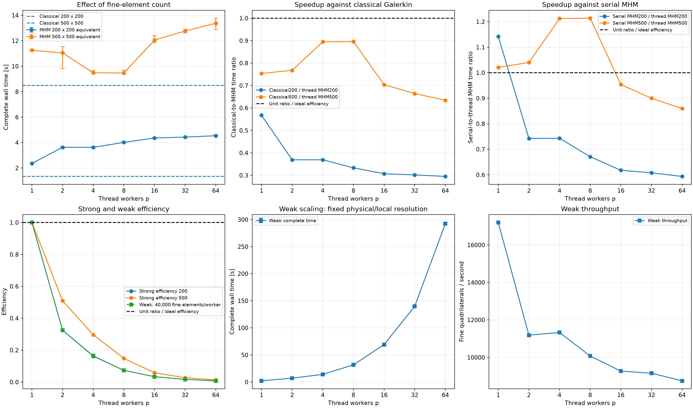
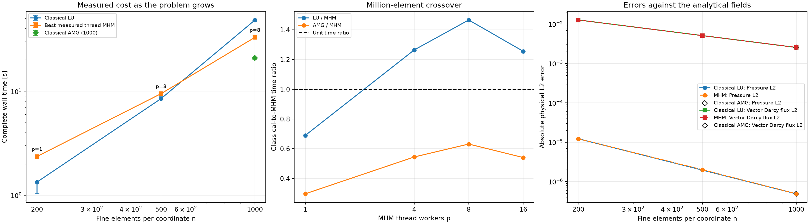

# Parallel MHM for multiscale Darcy: timings, strong scaling and weak scaling

Follow the numbered steps: state the variational problem, choose the local and trace spaces, declare the local and global equations, solve, and inspect the physical fields.

The main workflow is **meshes → spaces → local equations → global balance → assemble → solve → fields and errors**. `MeshHierarchy` associates macro and local meshes; `bind_interface` and `LocalContext` own supported numbering, geometric orientation and native coordinate conversions. The mathematical forms, physical trace meaning, local modes and gauge remain explicit in the cells below. Fully manual/custom spaces use the same numerical owners; see the [custom-interface notebook](https://github.com/ipes-lncc/pymhm/blob/main/notebooks/foundations/operators/custom_interface.ipynb).

This notebook defines the coefficient, manufactured source, finite-element
integrals, local equations, global balance, conforming comparison and all plots
in executable cells. A classical continuous primal $Q_1$ solve uses a
$200\times200$ grid: **40,000 quadrilateral elements**. MHM uses $10\times10$
macroelements, each containing $20\times20$ local elements: the same total
40,000 elements and the same material, operator and boundary data. Its broken
local pressure space and coarse skeletal space differ from the conforming
space; equal element counts do not imply equal field errors.

The measured parallel implementation uses **threads**, with one native
BLAS/OpenMP thread per call. NumPy and sparse factorization provide native
work; Python work and the global solve remain potential limits to speedup.
Every timed MHM run constructs and eliminates its local problems, assembles
the shared faces in order, solves the global system and reconstructs pressure.
Pool startup, task dispatch and synchronization are included. No factorization
or local response is reused between measured runs. Plots and error integration
are excluded from timings for both methods.

Three repetitions, randomized run order and all individual samples make
regressions and absent speedups visible. Strong scaling separately fixes
40,000-element and 250,000-element problems; a 1,000,000-element study also
compares the conforming LU and AMG solvers. Weak scaling keeps 100
macroelements and 40,000 local
elements **per worker**, extending the physical rectangle instead of shrinking
the microscale. A warm-up is reported separately and excluded from samples.

The primal MHM construction follows the local Neumann responses and skeletal
balance of [Harder, Paredes and Valentin (2013)](https://doi.org/10.1016/j.jcp.2013.03.019).
This periodic manufactured example is an introductory performance experiment,
not a reproduction of a paper's timing or convergence figure.


```python
import os
from pathlib import Path

# Set these before importing numerical libraries; enforce limits again below.
for variable in (
    "OMP_NUM_THREADS",
    "OPENBLAS_NUM_THREADS",
    "MKL_NUM_THREADS",
    "BLIS_NUM_THREADS",
    "VECLIB_MAXIMUM_THREADS",
):
    os.environ[variable] = "1"

import hashlib
import json
import math
import platform
import random
import subprocess
import sys
import time
from dataclasses import dataclass, replace
from importlib.metadata import version
from typing import Any, Callable

import matplotlib.pyplot as plt
import numpy as np
from matplotlib.collections import LineCollection
from numpy.polynomial.legendre import leggauss
from scipy import sparse
from threadpoolctl import threadpool_info, threadpool_limits

from pymhm.core.equations import Equation, LocalEquations
from pymhm.core.multiscale import MultiscaleProblem, assemble
from pymhm.execution.cpu import ExecutionConfig
from pymhm.fem.scalar.quadrilateral import qk_basis, qk_space
from pymhm.fem.traces.interval import FaceSpace, SkeletonSpace
from pymhm.io.provenance import current_source_manifest
from pymhm.linalg.linear import solve_linear
from pymhm.meshes.cartesian import CartesianMacroMesh

ROOT = Path.cwd()
while not (ROOT / "pixi.toml").exists():
    ROOT = ROOT.parent
OUTPUT = ROOT / "build" / "introduction" / "darcy_parallel_scalability"
OUTPUT.mkdir(parents=True, exist_ok=True)
plt.rcParams.update({"figure.dpi": 110, "font.size": 10})
from pymhm import MeshHierarchy, LocalContext, bind_interface, bind_problem
from pymhm.backends.spaces import bind_space

# Opt in only when dedicated resources are available for the full campaign.
RUN_CAMPAIGN = os.environ.get("PYMHM_RUN_CAMPAIGN", "0") == "1"

```

## 1. Define the physical problem and derive its source

The physical Darcy flux is $\boldsymbol q=-K\nabla p$. On
$\Omega_L=(0,L)\times(0,1)$ with integer $L$, solve


$$
\begin{aligned}
-\nabla\cdot(K\nabla p)&=f &&\text{in }\Omega_L,\\
p&=0 &&\text{on }\partial\Omega_L,\\
K(x,y)&=\exp\!\left(\sin(2\pi x/\varepsilon)
                       \sin(2\pi y/\varepsilon)\right),
\qquad \varepsilon=0.1.
\end{aligned}
$$


Choose $p_{\rm ex}=\sin(\pi x)\sin(\pi y)$. Differentiating independently gives


$$
f=2\pi^2 K p_{\rm ex}-\nabla K\cdot\nabla p_{\rm ex}.
$$


The scalar permeability satisfies $e^{-1}\le K\le e$, and every macroelement
contains one material period in each coordinate. The weak-scaling problems
extend the same periodic medium and use this same source formula. They keep
$H=0.1$, $h=0.005$ and the physical microscale fixed.


```python
EPSILON = 0.1


def permeability(points: np.ndarray) -> np.ndarray:
    """Return scalar isotropic permeability at points with final axis (x,y)."""
    x, y = points[..., 0], points[..., 1]
    frequency = 2 * np.pi / EPSILON
    return np.exp(np.sin(frequency * x) * np.sin(frequency * y))


def exact_pressure(points: np.ndarray) -> np.ndarray:
    """Return the manufactured pressure with homogeneous boundary data."""
    return np.sin(np.pi * points[..., 0]) * np.sin(np.pi * points[..., 1])


def exact_gradient(points: np.ndarray) -> np.ndarray:
    """Return the two physical derivatives of manufactured pressure."""
    x, y = points[..., 0], points[..., 1]
    return np.pi * np.stack(
        (np.cos(np.pi * x) * np.sin(np.pi * y), np.sin(np.pi * x) * np.cos(np.pi * y)), axis=-1
    )


def source(points: np.ndarray) -> np.ndarray:
    """Evaluate f=-div(K grad(p_exact)) from independent analytic derivatives."""
    x, y = points[..., 0], points[..., 1]
    frequency = 2 * np.pi / EPSILON
    material = permeability(points)
    grad_material = (
        frequency
        * material[..., None]
        * np.stack(
            (
                np.cos(frequency * x) * np.sin(frequency * y),
                np.sin(frequency * x) * np.cos(frequency * y),
            ),
            axis=-1,
        )
    )
    return 2 * np.pi**2 * material * exact_pressure(points) - np.sum(
        grad_material * exact_gradient(points), axis=-1
    )


# Verify the source against finite differences, away from boundaries.
probe = np.array([[0.237, 0.419], [0.613, 0.728], [0.832, 0.147]])
step = 2e-6
divergence = np.zeros(len(probe))
for axis in range(2):
    shift = np.eye(2)[axis] * step
    plus = permeability(probe + shift) * exact_gradient(probe + shift)[:, axis]
    minus = permeability(probe - shift) * exact_gradient(probe - shift)[:, axis]
    divergence += (plus - minus) / (2 * step)
np.testing.assert_allclose(source(probe), -divergence, rtol=2e-8, atol=2e-8)
```

## 2. Write and execute the weak forms with UFL

The mathematical definition of a primal local operator is


$$
a_T(p,v)=\int_T K\nabla p\cdot\nabla v,
\qquad L_T(v)=\int_T f v.
$$


UFL writes these pairings as `K*inner(grad(p), grad(v))*dx` and `f*v*dx`.
The local Neumann kernel is the constant function. Its complement is fixed
by `v*dx`, the physical volume-mean pairing. This does not impose zero mean
on the final pressure: the retained constant is solved globally.

Use `LocalEquations` to declare both the local and global pairings explicitly.
Here `b=columns(...)` provides the flux-driven local Neumann terms and
`c=rows(...)` provides the same oriented pressure moments for the global
balance. Replace the weak forms to define another scalar or mixed problem.
The package compiles the forms, condenses the declared local complement and
assembles the global couplings without selecting a named PDE.

The first cell is geometry bookkeeping: a serial native $Q_1$ space and
boundary tags, plus the map from DOLFINx's node order to Cartesian order.
It contains no PDE, material or solver. The next cell is the actual executable
mathematical definition, including the independent source and signed trace
pairings. Native meshes and forms remain local to this demonstration; the
compiler returns owned numerical arrays, releasing its native assembly data.


```python
import ufl
from pymhm.core.equations import compile_local_equations

# LocalContext.native_space binds the geometry, Basix element and native DOF order.
# LocalContext.trace_pairings binds each face basis to its integration support.

```

### Local Neumann equations and the global skeletal balance

The multiplier $\lambda_F$ represents the physical normal flux
$\boldsymbol q\cdot\boldsymbol n_F$ in the unique global face orientation.
The outward flux on a macroelement is $s_{TF}\lambda_F$, where
$s_{TF}=\boldsymbol n_T\cdot\boldsymbol n_F\in\{-1,1\}$. Use continuous
piecewise $P_1$ on four segments **of each macroface**, independently of other
macrofaces. There are five trace coordinates per face.


$$
\begin{aligned}
a_T(p_T,v_T)+b_T(\lambda,v_T)&=(f,v_T)_T,\\
a_T(p,v)&=\int_T K\nabla p\cdot\nabla v,\\
b_T(\lambda,v)&=\sum_{F\subset\partial T}
                   s_{TF}\int_F\lambda_F v,\\
\sum_T b_T(\mu,p_T)&=0.
\end{aligned}
$$


The last line imposes weak pressure continuity on interior faces and the
homogeneous Dirichlet pressure moments on exterior faces. Local Neumann
operators have the constant kernel. We declare it explicitly and fix each
local complement by its volume mean; one retained constant per macroelement
is solved globally. Dirichlet data remove the global pressure gauge, so no
additional mean-zero constraint is imposed on physical pressure.


The executed UFL cell below uses `columns` and `rows` for those oriented
interface integrals. `MultiscaleProblem` will combine these local equations
with the explicitly declared global equation. Only the coordinator accumulates
shared global face entries, in macroelement order.


```python
from pymhm.core.equations import columns

def define_ufl_local_equations(local: LocalContext) -> LocalEquations:
    """Write local volume and interface forms without numbering or orientation code."""
    binding = local.native_space(degree=1)
    domain, V = binding.mesh, binding.space
    p, v = ufl.TrialFunction(V), ufl.TestFunction(V)
    x, y = ufl.SpatialCoordinate(domain)
    frequency = 2 * np.pi / EPSILON
    K = ufl.exp(ufl.sin(frequency * x) * ufl.sin(frequency * y))
    p_exact = ufl.sin(np.pi * x) * ufl.sin(np.pi * y)
    grad_K = (
        frequency
        * K
        * ufl.as_vector(
            (
                ufl.cos(frequency * x) * ufl.sin(frequency * y),
                ufl.sin(frequency * x) * ufl.cos(frequency * y),
            )
        )
    )
    grad_exact = np.pi * ufl.as_vector(
        (ufl.cos(np.pi * x) * ufl.sin(np.pi * y), ufl.sin(np.pi * x) * ufl.cos(np.pi * y))
    )
    f = 2 * np.pi**2 * K * p_exact - ufl.dot(grad_K, grad_exact)
    dx = ufl.Measure("dx", domain=domain, metadata={"quadrature_degree": 6})
    a = K * ufl.inner(ufl.grad(p), ufl.grad(v)) * dx
    L = f * v * dx

    # Write both mathematical pairings explicitly. The interface adapter supplies
    # their basis, geometric support and outward-normal transport.
    b = local.trace_pairings(lambda phi, ds: phi * v * ds)
    c = local.trace_pairings(lambda phi, ds: phi * p * ds, axis="rows")
    return local.equations(
        a=a, L=L, b=b, c=c,
        kernel=np.ones((len(binding.mapping), 1)), moments=columns(v * dx),
        metadata={"native_to_cartesian": np.argsort(binding.mapping)},
    )


demo_macro = CartesianMacroMesh(2, 2)
demo_skeleton = SkeletonSpace(
    demo_macro, tuple(FaceSpace.uniform(1, 4, continuous=True) for _ in demo_macro.faces)
)
demo_problem = bind_problem(
    MeshHierarchy(demo_macro, tuple(demo_macro.submesh(cell, 20) for cell in range(len(demo_macro.cells)))),
    bind_interface(demo_skeleton, convention="normal"), define_ufl_local_equations,
    retained=1,
)
native_demonstrations = {}
# Include the interior sign reversals as well as exterior boundary orientations.
for cell in range(len(demo_macro.cells)):
    local = demo_problem.local_context(cell)
    try:
        equations = define_ufl_local_equations(local)
        compiled = compile_local_equations(equations)
        native_demonstrations[cell] = (compiled.problem, equations.metadata["native_to_cartesian"])
    finally:
        local.close()
print(
    "Executed UFL stiffness, source, mean moments and signed interface forms on four macroelements."
)
```

```text
Executed UFL stiffness, source, mean moments and signed interface forms on four macroelements.
```

## 3. Introduce conveniences after the mathematical definition

`quadrilateral_operators` assembles the scalar diffusion, mass and source
forms, and `quadrilateral_trace_coupling` integrates the oriented interface
pairings. They are prepared conveniences for this case. First verify their
matrices against the **executed UFL forms**, accounting for the different
native node ordering. Test all four macroelements, including reversed signs.

The short provider then supplies these verified numerical forms to the same
`LocalEquations` contract. The timed pipeline uses this portable Basix/SciPy
assembly for both methods; it sends no native MPI or FEM objects to threads.
A user-defined UFL provider can instead supply `a`, `L`, `columns(...)` and
`rows(...)` directly, as above. Neither approach requires a `define_darcy`
wrapper or an internal problem-specific solver.

Explicit basis-level Gauss contractions and a hand-assembled interface pairing
are included in the appendix as optional independent assembly controls. They
are not necessary to write the weak problem or to use the multiscale API.

All local Cartesian grids are translations with the same four-segment face
space. Prepare one geometry-only face-integral template **inside each timed
run's setup**, then transport its lengths, parameter directions and outward
normal signs. Verify that transport against separately integrated faces on
four macroelements before using it. This avoids repeating identical basis
tabulation; it reuses neither physical stiffness, source, factorization nor
local response. Every macroelement still assembles and solves its own
material-dependent local problem in the selected worker.


```python
from pymhm.fem.scalar.quadrilateral import (
    quadrilateral_operators,
    quadrilateral_trace_coupling,
    quadrilateral_quadrature as gauss_square,
)

ufl_block_equivalence = {}

# Reconcile native node order before comparing the same executed weak forms.
for cell, (native_problem, native_order) in native_demonstrations.items():
    fine = demo_macro.submesh(cell, 20)
    inverse_order = np.argsort(native_order)
    A, mass, load = quadrilateral_operators(
        fine, 1, permeability=permeability, source=source, order=4
    )
    B = quadrilateral_trace_coupling(demo_macro, cell, fine, demo_skeleton, 1)
    np.testing.assert_allclose(
        native_problem.matrix[inverse_order][:, inverse_order].toarray(),
        A.toarray(),
        rtol=5e-12,
        atol=5e-13,
    )
    np.testing.assert_allclose(native_problem.load[inverse_order], load, rtol=5e-12, atol=5e-13)
    np.testing.assert_allclose(native_problem.coupling[inverse_order], B, rtol=5e-12, atol=5e-13)
    np.testing.assert_allclose(
        native_problem.constraints[inverse_order],
        mass @ np.ones((len(load), 1)),
        rtol=5e-12,
        atol=5e-13,
    )
    difference = native_problem.matrix[inverse_order][:, inverse_order] - A
    ufl_block_equivalence[cell] = {
        "stiffness_max_absolute": float(np.max(np.abs(difference.data), initial=0)),
        "source_max_absolute": float(np.max(np.abs(native_problem.load[inverse_order] - load))),
        "trace_max_absolute": float(np.max(np.abs(native_problem.coupling[inverse_order] - B))),
        "mean_max_absolute": float(
            np.max(
                np.abs(native_problem.constraints[inverse_order] - mass @ np.ones((len(load), 1)))
            )
        ),
    }
```


```python
def face_length_snapshot(macro: CartesianMacroMesh) -> np.ndarray:
    """Compute immutable physical face lengths once for a declared mesh."""
    lengths = macro.lengths
    lengths.setflags(write=False)
    return lengths
```


```python
def translated_interface(
    template: np.ndarray,
    template_ends: np.ndarray,
    macro: CartesianMacroMesh,
    cell: int,
    face_lengths: np.ndarray,
    face_space: FaceSpace,
) -> np.ndarray:
    """Transport uniform continuous P1 face pairings by length, orientation and sign.

    Within each size, local Cartesian grids share their declared nodal order.
    The supplied FaceSpace determines each side's column count. Reversing a
    uniform nodal-P1 parameter reverses those columns. Face lengths are an
    immutable per-run snapshot; material, source and local factors are never
    reused. Each worker receives an owned coupling matrix.
    """
    if not face_space.continuous or any(p != 1 for p in face_space.degrees):
        raise ValueError("This translation helper requires continuous piecewise P1 traces")
    if not np.allclose(
        face_space.breaks, np.linspace(0, 1, len(face_space.breaks)), rtol=0, atol=1e-14
    ):
        raise ValueError("This translation helper requires uniform face segments")
    width = face_space.size
    assert template.shape[1] == 4 * width
    coupling = np.empty_like(template)
    for side, face in enumerate(macro.cell_faces[cell]):
        tangent = macro.points[macro.faces[face, 1]] - macro.points[macro.faces[face, 0]]
        reference_tangent = template_ends[side, 1] - template_ends[side, 0]
        columns = slice(width * side, width * (side + 1))
        block = template[:, columns]
        if tangent @ reference_tangent < 0:
            block = block[:, ::-1]
        coupling[:, columns] = (
            macro.signs[cell, side] * face_lengths[face] / np.linalg.norm(reference_tangent)
        ) * block
    return coupling
```


```python
def refined_interface_template(
    spacing: np.ndarray,
    refinement: int,
    face_space: FaceSpace,
) -> tuple[np.ndarray, np.ndarray]:
    """Prepare the actual local-grid pairing with the supplied trace partition."""
    macro = CartesianMacroMesh(1, 1, (0, float(spacing[0]), 0, float(spacing[1])))
    skeleton = SkeletonSpace(macro, tuple(face_space for _ in macro.faces))
    template = quadrilateral_trace_coupling(macro, 0, macro.submesh(0, refinement), skeleton, 1)
    ends = macro.points[macro.faces[macro.cell_faces[0]]]
    template.setflags(write=False)
    ends.setflags(write=False)
    return template, ends
```


```python
def interface_template(spacing: np.ndarray, face_space: FaceSpace) -> tuple[np.ndarray, np.ndarray]:
    """Prepare the introductory local20 pairing for its declared trace space."""
    return refined_interface_template(spacing, 20, face_space)
```


```python
# Verify every normal sign and boundary orientation against direct face integration.
demo_trace_space = FaceSpace.uniform(1, 4, continuous=True)
demo_lengths = face_length_snapshot(demo_macro)
demo_template, demo_ends = interface_template(demo_macro.spacing, demo_trace_space)
for cell in range(len(demo_macro.cells)):
    fine = demo_macro.submesh(cell, 20)
    direct = quadrilateral_trace_coupling(demo_macro, cell, fine, demo_skeleton, 1)
    transported = translated_interface(
        demo_template, demo_ends, demo_macro, cell, demo_lengths, demo_trace_space
    )
    np.testing.assert_allclose(transported, direct, rtol=5e-12, atol=5e-13)
```


```python
@dataclass(frozen=True)
class LocalProvider:
    """Supply the verified weak forms through prepared portable assembly conveniences."""

    macro: CartesianMacroMesh
    skeleton: SkeletonSpace
    coupling_template: np.ndarray
    template_endpoints: np.ndarray
    face_lengths: np.ndarray
    face_space: FaceSpace
    refinement: int = 20
    quadrature_order: int = 4

    def local_mesh(self, cell: int) -> CartesianMacroMesh:
        """Describe each fine mesh so it is created within its owning worker."""
        return self.macro.submesh(cell, self.refinement)

    def __call__(self, local: LocalContext) -> LocalEquations:
        """Declare A p+B lambda=f and C=B.T with the physical volume mean."""
        cell, fine = local.cell, local.mesh
        A, mass, f = quadrilateral_operators(
            fine, 1, permeability=permeability, source=source, order=self.quadrature_order
        )
        B = translated_interface(
            self.coupling_template,
            self.template_endpoints,
            self.macro,
            cell,
            self.face_lengths,
            self.face_space,
        )
        constant = np.ones((len(f), 1))
        return local.equations(
            a=A,
            L=f,
            b=B,
            c=B.T,
            coordinates="global",
            kernel=constant,
            moments=mass @ constant,
            metadata={"mesh": fine},
        )
```


```python
def make_problem(length: int = 1) -> tuple[CartesianMacroMesh, MultiscaleProblem]:
    """Declare local/global equations with fixed H,h and material on a rectangle."""
    macro = CartesianMacroMesh(10 * length, 10, (0, float(length), 0, 1))
    face_space = FaceSpace.uniform(1, 4, continuous=True)
    skeleton = SkeletonSpace(macro, tuple(face_space for _ in macro.faces))
    face_lengths = face_length_snapshot(macro)
    template, ends = interface_template(macro.spacing, face_space)
    provider = LocalProvider(macro, skeleton, template, ends, face_lengths, face_space)
    problem = bind_problem(
                  MeshHierarchy(macro, provider.local_mesh),
                  bind_interface(skeleton, convention="normal"), provider,
                  global_equation=Equation(0, 0), retained=1,
              )
    return macro, problem


macro, declared_problem = make_problem()
assert len(macro.cells) * 20**2 == 200**2 == 40_000
print(
    {
        "classical_elements": 200**2,
        "macro_elements": len(macro.cells),
        "local_elements_per_macro": 20**2,
        "total_local_elements": len(macro.cells) * 20**2,
        "classical_nodal_dofs": 201**2,
        "sum_local_nodal_dofs": len(macro.cells) * 21**2,
        "trace_dofs": declared_problem.trace_size,
        "retained_dofs": len(macro.cells),
    }
)
```

```text
{'classical_elements': 40000, 'macro_elements': 100, 'local_elements_per_macro': 400, 'total_local_elements': 40000, 'classical_nodal_dofs': 40401, 'sum_local_nodal_dofs': 44100, 'trace_dofs': 1100, 'retained_dofs': 100}
```

## 4. Assemble the conforming comparison and expose the timing stages

The classical method independently scatters every fine-element integral into
one conforming matrix through the prepared scalar operator, then sets all exterior pressure nodes to zero. Its
field coefficients use the same $Q_1$ basis. MHM instead delegates the declared
local blocks to the general `assemble` operation; scheduling is the only
change between serial and parallel runs.

`solve_linear` and `system.solve` own numerical factorization, residual checks
and reconstruction. Their existing tolerances are retained. The timer starts
before mesh construction and stops after pressure reconstruction. For threads,
data transfer means in-process task submission and result handoff, included
in the local/global assembly stage; there is no process serialization.

These measurements opt into `ExecutionConfig(..., pipeline=True)`. A bounded
rolling window yields local results in cell order as soon as the next result
is ready, while other workers continue. `batch_size=workers` bounds the
consumed inputs whose results have not yet been yielded. Each local worker
also computes its independent Schur contribution; the coordinator alone adds
the ordered contributions to shared global entries. The API default,
`pipeline=False`, retains atomic batches. The thread pool's native-thread
limit stays active during ordered consumption and is restored after all
workers join; every measured method already uses one native thread.

The convenience operator also builds a mass matrix. That cost is included in
both timings, although the classical solve only needs stiffness and load;
these measurements describe the displayed general assembly path rather than
an optimized stiffness-only reference.


```python
def run_classical(
    n: int = 200, order: int = 4, solver: str = "scipy"
) -> tuple[dict[str, float], Any]:
    """Time mesh setup, prepared conforming assembly, boundary elimination and solve."""
    with threadpool_limits(limits=1):
        start = time.perf_counter()
        mesh = CartesianMacroMesh(n, n)
        _, nodes = qk_space(mesh, 1)
        boundary = np.any(
            np.isclose(nodes, 0, atol=1e-14, rtol=0) | np.isclose(nodes, 1, atol=1e-14, rtol=0),
            axis=1,
        )
        free = np.flatnonzero(~boundary)
        setup_end = time.perf_counter()
        matrix, _, load = quadrilateral_operators(
            mesh, 1, permeability=permeability, source=source, order=order
        )
        assembly_end = time.perf_counter()
        coefficients = np.zeros(len(nodes))
        reduced = matrix[free][:, free]
        candidate = np.ones((len(free), 1)) if solver == "pyamg" else None
        coefficients[free] = solve_linear(
            reduced,
            load[free],
            solver=solver,
            rtol=1e-10,
            atol=0,
            maxiter=500 if solver == "pyamg" else None,
            near_nullspace=candidate,
            refinement_precision="double",
            refinement_steps=2,
            equilibration="none",
        )
        solve_end = time.perf_counter()
        # Additional reported diagnostics follow the stopped timer; the shared
        # solver already checks the true original residual inside its timing.
        defect = reduced @ coefficients[free] - load[free]
        reported_residual = float(np.linalg.norm(defect) / np.linalg.norm(load[free]))
    return {
        "setup": setup_end - start,
        "assembly": assembly_end - setup_end,
        "solve_reconstruct": solve_end - assembly_end,
        "total": solve_end - start,
        "pressure_equation_relative_L2": reported_residual,
    }, (mesh, coefficients)
```


```python
def run_mhm(
    workers: int,
    length: int = 1,
    backend: str = "thread",
    quadrature_order: int = 4,
) -> tuple[dict[str, float], Any]:
    """Time the full declared MHM workflow with bounded ordered local execution."""
    with threadpool_limits(limits=1):
        start = time.perf_counter()
        macro, problem = make_problem(length)
        if quadrature_order != 4:
            problem = bind_problem(
                problem.context.hierarchy, problem.context.interface,
                replace(problem.local_provider.provider, quadrature_order=quadrature_order),
                global_equation=Equation(0, 0), retained=1,
            )
        execution = ExecutionConfig(
            backend=backend, workers=workers, native_threads=1, batch_size=workers,
            pipeline=True,
        )
        setup_end = time.perf_counter()
        system = assemble(problem, execution=execution)
        assembly_end = time.perf_counter()
        solution = system.solve()
        solve_end = time.perf_counter()
    return {
        "setup": setup_end - start,
        "assembly": assembly_end - setup_end,
        "solve_reconstruct": solve_end - assembly_end,
        "total": solve_end - start,
    }, (macro, system, solution)
```


```python
def evaluate_q1(
    mesh: CartesianMacroMesh,
    coefficients: np.ndarray,
    points: np.ndarray,
) -> tuple[np.ndarray, np.ndarray]:
    """Evaluate the represented pressure and physical broken gradient without smoothing."""
    origin = np.array(mesh.bounds)[[0, 2]]
    cell_coordinate = (points - origin) / mesh.spacing
    cells = np.floor(cell_coordinate).astype(int)
    cells[:, 0] = np.clip(cells[:, 0], 0, mesh.nx - 1)
    cells[:, 1] = np.clip(cells[:, 1], 0, mesh.ny - 1)
    reference = np.clip(cell_coordinate - cells, 0, 1)
    basis, derivative = qk_basis(1, reference)
    first = cells[:, 1] * (mesh.nx + 1) + cells[:, 0]
    local_dofs = first[:, None] + np.array([0, 1, mesh.nx + 1, mesh.nx + 2])
    values = coefficients[local_dofs]
    return np.einsum("qi,qi->q", basis, values), np.einsum(
        "qid,qi->qd", derivative / mesh.spacing, values
    )


def classical_evaluator(result: Any) -> Callable:
    """Return field evaluation in the classical executed nodal basis."""
    mesh, coefficients = result
    return lambda points: evaluate_q1(mesh, coefficients, points)


def mhm_evaluator(result: Any) -> Callable:
    """Return piecewise local evaluation with independent macroelement traces."""
    macro, system, solution = result

    def evaluate(points: np.ndarray) -> tuple[np.ndarray, np.ndarray]:
        """Select a one-sided macrocell and evaluate its own Q1 coefficients."""
        origin = np.array(macro.bounds)[[0, 2]]
        cell_coordinate = np.floor((points - origin) / macro.spacing).astype(int)
        cell_coordinate[:, 0] = np.clip(cell_coordinate[:, 0], 0, macro.nx - 1)
        cell_coordinate[:, 1] = np.clip(cell_coordinate[:, 1], 0, macro.ny - 1)
        ids = cell_coordinate[:, 1] * macro.nx + cell_coordinate[:, 0]
        pressure, gradient = np.empty(len(points)), np.empty((len(points), 2))
        for cell in np.unique(ids):
            mask = ids == cell
            fine = system.local_metadata[cell]["mesh"]
            pressure[mask], gradient[mask] = evaluate_q1(fine, solution.fields[cell], points[mask])
        return pressure, gradient

    return evaluate
```


```python
def field_difference(
    first: Callable,
    second: Callable,
    integration_n: int = 400,
    order: int = 5,
) -> dict[str, float]:
    """Integrate pressure and vector physical-flux differences on a common fine partition."""
    mesh = CartesianMacroMesh(integration_n, integration_n)
    reference, weights = gauss_square(order)
    measure = float(np.prod(mesh.spacing))
    pressure_square, flux_square = 0.0, 0.0
    for begin in range(0, len(mesh.cells), 256):
        origins = mesh.points[mesh.cells[begin : begin + 256, 0]]
        points = (origins[:, None, :] + reference[None, :, :] * mesh.spacing).reshape(-1, 2)
        pa, ga = first(points)
        pb, gb = second(points)
        dp = (pa - pb).reshape(len(origins), -1)
        dq = (permeability(points)[:, None] * (ga - gb)).reshape(len(origins), -1, 2)
        pressure_square += measure * float(np.einsum("q,tq,tq->", weights, dp, dp))
        flux_square += measure * float(np.einsum("q,tqd,tqd->", weights, dq, dq))
    return {"pressure_L2": math.sqrt(pressure_square), "flux_L2": math.sqrt(flux_square)}


def exact_evaluator(points: np.ndarray) -> tuple[np.ndarray, np.ndarray]:
    """Return the analytic pressure and its physical gradient for comparison."""
    return exact_pressure(points), exact_gradient(points)
```

## Current API control and recorded performance campaign

The default execution assembles and solves the **current implementation** on a
200 × 200 fine-cell budget, using the bound mesh/interface API above. It checks
physical pressure and Darcy flux against the analytical solution and the matched
classical Q1 approximation. The small control uses two workers; its wall time is
not a performance measurement.

The scaling plots and large-workload tables below come from the complete campaign
recorded on **2026-10-04**, at revision
`1427bc29c1a62e3c25fe3d4b541fb285feb19ab7`. Their original coefficients,
executed bases, source hashes, sample distributions and acquisition protocol remain
in the versioned receipts. Reading those receipts does not measure the performance
of the current revision. Every receipt and figure is checked against `SHA256SUMS`.

Set `PYMHM_RUN_CAMPAIGN=1` before executing the notebook to acquire the full
campaign with the current source on dedicated resources. The following sections
retain its complete step-by-step acquisition procedure, including reference
refinement, physical residual checks, cold and warm setup, repeated timing,
strong and weak scaling and basis-aware archive replay. The acquisition cells
are conditional on `RUN_CAMPAIGN` because these studies are substantially more
expensive than the introductory numerical control.


```python
if not RUN_CAMPAIGN:
    from IPython.display import Image, display

    archive_folder = ROOT / "benchmarks/results/execution/introduction-threads-20261004"
    _, current_mhm = run_mhm(2, backend="thread")
    _, current_classical = run_classical(200)
    current_errors = {
        "MHM": field_difference(mhm_evaluator(current_mhm), exact_evaluator, integration_n=200),
        "classical": field_difference(classical_evaluator(current_classical), exact_evaluator, integration_n=200),
        "MHM_to_classical": field_difference(mhm_evaluator(current_mhm), classical_evaluator(current_classical), integration_n=200),
    }
    archive_record = json.loads((archive_folder / "measurements_200_500_all_threads.json").read_text())
    archive_large = json.loads((archive_folder / "measurements_1000_crossover.json").read_text())
    print("Historical campaign provenance:", archive_large["utc_recorded"], archive_large["git_revision"])
    print("Archived million-element solver comparison:", json.dumps(archive_large["summary"], indent=2))
    print("Current 200 x 200 physical-field control:", json.dumps(current_errors, indent=2))
    print("Current reduced-equation relative residual:", current_mhm[2].residual)
    assert current_mhm[2].residual < 1e-9

    # Show the current fields separately from the historical timing campaign.
    axis_nodes = (np.arange(140) + 0.5) / 140
    xx, yy = np.meshgrid(axis_nodes, axis_nodes)
    sample_points = np.column_stack((xx.ravel(), yy.ravel()))
    field_fig, field_axes = plt.subplots(1, 2, figsize=(10, 4), constrained_layout=True)
    for ax, evaluator, title in zip(
        field_axes,
        (mhm_evaluator(current_mhm), classical_evaluator(current_classical)),
        ("Current MHM pressure (200 x 200 total fine cells)", "Current classical Q1 pressure (200 x 200)"),
        strict=True,
    ):
        values, _ = evaluator(sample_points)
        artist = ax.pcolormesh(xx, yy, values.reshape(xx.shape), shading="nearest")
        for location in np.linspace(0, 1, 11):
            ax.axvline(location, color="black", alpha=0.3, linewidth=0.5)
            ax.axhline(location, color="black", alpha=0.3, linewidth=0.5)
        ax.set(title=title, xlabel="x", ylabel="y", aspect="equal")
        field_fig.colorbar(artist, ax=ax, label="pressure")
    plt.show()

    # Published timings retain their original revision. Verify every available
    # artifact and identify the original payloads absent from a source checkout.
    historical_missing = []
    for checksum in (archive_folder / "SHA256SUMS").read_text().splitlines():
        expected, relative = checksum.split(maxsplit=1)
        original = archive_folder / relative
        if original.is_file():
            if hashlib.sha256(original.read_bytes()).hexdigest() != expected:
                raise ValueError(f"Archive integrity mismatch: {relative}")
        else:
            historical_missing.append(relative)
    print("Historical artifacts absent from this checkout:", historical_missing)
    print("The current numerical control above is independent of these historical timings.")
    print("Available historical campaign figures (original revision retained above):")
    for figure_name in ('pressure_and_flux.png', 'reference_convergence.png', 'scalability_200_500_all_threads.png', 'crossover_cost_and_accuracy.png', 'pressure_and_flux_1000.png'):
        original_figure = archive_folder / "figures" / figure_name
        if original_figure.is_file():
            display(Image(filename=str(original_figure)))
        else:
            print(f"Historical figure unavailable: {figure_name}; run PYMHM_RUN_CAMPAIGN=1 for new measurements.")
```

??? note "Numerical output and provenance"

    ```text
    Historical campaign provenance: 2026-10-04T20:55:32Z 1427bc29c1a62e3c25fe3d4b541fb285feb19ab7
    Archived million-element solver comparison: {
      "classical_LU": {
        "median": 48.290400952100754,
        "minimum": 48.12856928445399,
        "maximum": 48.40943252854049,
        "setup": 1.318651707842946,
        "assembly": 13.781054088845849,
        "solve_reconstruct": 33.308752765879035
      },
      "classical_AMG": {
        "median": 20.8128523491323,
        "minimum": 20.28200477361679,
        "maximum": 20.849384371191263,
        "setup": 1.3477615863084793,
        "assembly": 13.769490350037813,
        "solve_reconstruct": 5.633019220083952
      },
      "thread_MHM": {
        "1": {
          "median": 70.01656742207706,
          "minimum": 69.6620128788054,
          "maximum": 71.37420281767845,
          "setup": 0.6530422940850258,
          "assembly": 69.25675530731678,
          "solve_reconstruct": 0.12755713798105717,
          "strong_speedup": 1.0,
          "strong_efficiency": 1.0,
          "ratio_vs_classical_LU": 0.689699634387878,
          "ratio_vs_classical_AMG": 0.29725610831029914,
          "ratio_vs_fastest_classical": 0.29725610831029914
        },
        "4": {
          "median": 38.20264050364494,
          "minimum": 35.87250446528196,
          "maximum": 38.65109939314425,
          "setup": 0.8551607523113489,
          "assembly": 37.205242693424225,
          "solve_reconstruct": 0.13392465934157372,
          "strong_speedup": 1.8327677484857814,
          "strong_efficiency": 0.45819193712144535,
          "ratio_vs_classical_LU": 1.2640592460485376,
          "ratio_vs_classical_AMG": 0.5448014083515125,
          "ratio_vs_fastest_classical": 0.5448014083515125
        },
        "8": {
          "median": 32.95143252797425,
          "minimum": 32.377874759957194,
          "maximum": 34.575192507356405,
          "setup": 0.8701289687305689,
          "assembly": 31.937516044825315,
          "solve_reconstruct": 0.1476131696254015,
          "strong_speedup": 2.124841381710377,
          "strong_efficiency": 0.26560517271379713,
          "ratio_vs_classical_LU": 1.4655023240978804,
          "ratio_vs_classical_AMG": 0.6316220799039054,
          "ratio_vs_fastest_classical": 0.6316220799039054
        },
        "16": {
          "median": 38.475135535001755,
          "minimum": 38.219250006601214,
          "maximum": 40.25698798522353,
          "setup": 0.6391503289341927,
          "assembly": 37.470310747623444,
          "solve_reconstruct": 0.13368543051183224,
          "strong_speedup": 1.819787414611738,
          "strong_efficiency": 0.11373671341323363,
          "ratio_vs_classical_LU": 1.2551067145213775,
          "ratio_vs_classical_AMG": 0.5409429248195461,
          "ratio_vs_fastest_classical": 0.5409429248195461
        }
      }
    }
    Current 200 x 200 physical-field control: {
      "MHM": {
        "pressure_L2": 1.2203901833006513e-05,
        "flux_L2": 0.012719053261234495
      },
      "classical": {
        "pressure_L2": 1.2192433581085124e-05,
        "flux_L2": 0.012718368057784214
      },
      "MHM_to_classical": {
        "pressure_L2": 3.7150649141577565e-07,
        "flux_L2": 0.00013204874657346365
      }
    }
    Current reduced-equation relative residual: 1.4123990698251368e-16
    ```


[](../../assets/tutorials/darcy_parallel_scalability/figure_23_1.png)


```text
Historical artifacts absent from this checkout: []
The current numerical control above is independent of these historical timings.
Available historical campaign figures (original revision retained above):
```


[](../../assets/tutorials/darcy_parallel_scalability/figure_23_3.png)


[](../../assets/tutorials/darcy_parallel_scalability/figure_23_4.png)


[](../../assets/tutorials/darcy_parallel_scalability/figure_23_5.png)


[](../../assets/tutorials/darcy_parallel_scalability/figure_23_6.png)


[](../../assets/tutorials/darcy_parallel_scalability/figure_23_7.png)


## Full campaign procedure (opt in with `RUN_CAMPAIGN`)

The mathematical definitions and acquisition functions above are reused below.
The recorded figures are shown in the preceding section; enabling the flag
executes the complete procedure with the current package and emits new records.

## 5. Check reference refinement and physical equations before timing

The requested $200\times200$ classical comparison is a numerical approximation,
not the exact solution. Compute $100\times100$, $200\times200$ and
$400\times400$ conforming fields with the same operator and boundary data;
report pressure and physical-flux differences and the independently known
analytical error. Integrate all differences on the $400\times400$ partition,
which resolves every compared finite-element interface. Check quadrature
sensitivity by increasing the Gauss order.

For MHM, the local residual is tested after restoring the globally retained
constant. The global trace residual measures the pressure moments; the
retained row separately measures **macroelement** conservation. Raw
$-K\nabla p_h$ is not an equilibrated H(div) flux, and fine-cell conservation is
not asserted. Field errors establish the achieved approximation independently
of algebraic residuals. Timed runs below retain these same spaces and matrices.


```python
if RUN_CAMPAIGN:
    reference_fields = {}
    reference_errors = {}
    reference_setup_times = {}
    for n in (100, 200, 400):
        timing, field = run_classical(n)
        reference_fields[n] = field
        reference_setup_times[n] = timing
        reference_errors[n] = field_difference(classical_evaluator(field), exact_evaluator)
    reference_differences = {
        "100_to_200": field_difference(
            classical_evaluator(reference_fields[100]), classical_evaluator(reference_fields[200])
        ),
        "200_to_400": field_difference(
            classical_evaluator(reference_fields[200]), classical_evaluator(reference_fields[400])
        ),
    }
    for quantity in ("pressure_L2", "flux_L2"):
        assert (
            reference_differences["200_to_400"][quantity]
            < reference_differences["100_to_200"][quantity]
        )
        assert (
            reference_errors[400][quantity]
            < reference_errors[200][quantity]
            < reference_errors[100][quantity]
        )
    print("Classical analytical errors:", json.dumps(reference_errors, indent=2))
    print("Classical refinement differences:", json.dumps(reference_differences, indent=2))
```


```python
if RUN_CAMPAIGN:
    validation_timing, validation_field = run_mhm(1, backend="serial")
    validation_macro, validation_system, validation_solution = validation_field
    validation_errors = field_difference(mhm_evaluator(validation_field), exact_evaluator)
    mhm_to_200 = field_difference(
        mhm_evaluator(validation_field), classical_evaluator(reference_fields[200])
    )
    mhm_to_400 = field_difference(
        mhm_evaluator(validation_field), classical_evaluator(reference_fields[400])
    )
    quadrature_errors = field_difference(mhm_evaluator(validation_field), exact_evaluator, order=6)
    for quantity in validation_errors:
        np.testing.assert_allclose(validation_errors[quantity], quadrature_errors[quantity], rtol=2e-7)

    trace_coefficients = validation_solution.trace
    local_residual_square = 0.0
    local_load_square = 0.0
    macro_defects = []
    for response, pressure in zip(validation_system.responses, validation_solution.fields, strict=True):
        local = response.problem
        defect = (
            local.matrix @ pressure + local.coupling @ trace_coefficients[local.trace_dofs] - local.load
        )
        local_residual_square += float(defect @ defect)
        local_load_square += float(local.load @ local.load)
        macro_defects.append(float(np.ones(len(defect)) @ defect))
    global_defect = (
        validation_system.matrix @ np.r_[trace_coefficients, np.concatenate(validation_solution.coarse)]
        - validation_system.rhs
    )
    equation_diagnostics = {
        "local_pressure_equation_relative_L2": math.sqrt(local_residual_square / local_load_square),
        "trace_pressure_moment_residual_L2": float(
            np.linalg.norm(global_defect[: validation_system.trace_size])
        ),
        "macro_conservation_max_absolute": float(np.max(np.abs(macro_defects))),
        "global_relative_residual": float(validation_solution.residual),
    }
    assert equation_diagnostics["local_pressure_equation_relative_L2"] < 1e-9
    assert equation_diagnostics["macro_conservation_max_absolute"] < 1e-10
    print("MHM analytical errors:", json.dumps(validation_errors, indent=2))
    print("MHM vs classical200:", json.dumps(mhm_to_200, indent=2))
    print("MHM vs classical400:", json.dumps(mhm_to_400, indent=2))
    print("Equation diagnostics:", json.dumps(equation_diagnostics, indent=2))
```


```python
if RUN_CAMPAIGN:
    # Higher assembly quadrature must agree before performance is interpreted.
    _, high_order_reference = run_classical(200, order=6)
    assembly_sensitivity = field_difference(
        classical_evaluator(reference_fields[200]), classical_evaluator(high_order_reference)
    )
    _, high_order_mhm = run_mhm(1, backend="serial", quadrature_order=6)
    mhm_assembly_sensitivity = field_difference(
        mhm_evaluator(validation_field), mhm_evaluator(high_order_mhm)
    )
    for quantity in validation_errors:
        assert assembly_sensitivity[quantity] < 1e-4 * reference_errors[200][quantity]
        assert mhm_assembly_sensitivity[quantity] < 1e-4 * validation_errors[quantity]
    print("Assembly-quadrature differences:", assembly_sensitivity, mhm_assembly_sensitivity)
    del high_order_mhm
```

## 6. Inspect pressure and physical flux on the actual macro mesh

Each displayed fine rectangle has its own vertices: reconstructed interfaces
and broken gradients are not averaged across neighboring elements. Each panel
has an independent colorbar, and the black overlay is the **actual** MHM macro
mesh, including on the analytical and classical panels. The flux error below
is the magnitude of the **vector difference**, not a difference of magnitudes.


```python
if RUN_CAMPAIGN:
    def display_panel(
        evaluator: Callable,
        quantity: str,
        comparison: Callable | None = None,
    ) -> tuple[np.ndarray, np.ndarray, np.ndarray]:
        """Create independent one-sided display vertices for every fine rectangle."""
        display = CartesianMacroMesh(200, 200)
        local = np.array([[0, 0], [1, 0], [0, 1], [1, 1]], dtype=float)
        # Inset by roundoff to select the owning side on each fine/macro interface.
        local = np.clip(local, 2e-10, 1 - 2e-10)
        origins = display.points[display.cells[:, 0]]
        points = (origins[:, None, :] + local[None, :, :] * display.spacing).reshape(-1, 2)
        pressure, gradient = evaluator(points)
        if comparison is not None:
            reference_pressure, reference_gradient = comparison(points)
            pressure -= reference_pressure
            gradient -= reference_gradient
        values = (
            pressure
            if quantity == "pressure"
            else np.linalg.norm(permeability(points)[:, None] * gradient, axis=1)
        )
        indices = np.arange(len(display.cells))[:, None] * 4
        triangles = np.concatenate(
            (indices + np.array([0, 1, 3]), indices + np.array([0, 3, 2])), axis=0
        )
        return points, triangles, values
```


```python
if RUN_CAMPAIGN:
    def draw_fields() -> None:
        """Plot numerical, reference and error fields with separate macro-mesh overlays."""
        panels = [
            ("Exact pressure", exact_evaluator, "pressure", None),
            (
                "Classical Q1 pressure (200 x 200)",
                classical_evaluator(reference_fields[200]),
                "pressure",
                None,
            ),
            ("MHM pressure (10 x 10 macros)", mhm_evaluator(validation_field), "pressure", None),
            ("Exact Darcy flux magnitude", exact_evaluator, "flux", None),
            ("MHM Darcy flux magnitude", mhm_evaluator(validation_field), "flux", None),
            (
                "MHM vector flux error magnitude",
                mhm_evaluator(validation_field),
                "flux",
                exact_evaluator,
            ),
        ]
        figure, axes = plt.subplots(2, 3, figsize=(16, 10), layout="constrained")
        for axis, (label, evaluator, quantity, comparison) in zip(axes.flat, panels, strict=True):
            points, triangles, values = display_panel(evaluator, quantity, comparison)
            artist = axis.tripcolor(
                points[:, 0], points[:, 1], triangles, values, shading="gouraud", rasterized=True
            )
            axis.add_collection(
                LineCollection(
                    validation_macro.points[validation_macro.faces],
                    colors="black",
                    linewidths=0.65,
                    alpha=0.7,
                )
            )
            axis.set(xlim=(0, 1), ylim=(0, 1), xlabel="x", ylabel="y", title=label, aspect="equal")
            figure.colorbar(artist, ax=axis, shrink=0.83, pad=0.025)
        figure.savefig(OUTPUT / "pressure_and_flux.png", dpi=170)
        plt.show()
```


```python
if RUN_CAMPAIGN:
    draw_fields()

    fig, axes = plt.subplots(1, 2, figsize=(12, 4.5), layout="constrained")
    for quantity, label in (("pressure_L2", "Pressure L2 error"), ("flux_L2", "Darcy flux L2 error")):
        errors = np.array([reference_errors[n][quantity] for n in (100, 200, 400)])
        axes[0].loglog([1 / 100, 1 / 200, 1 / 400], errors, "o-", label=label)
        rates = np.log(errors[:-1] / errors[1:]) / np.log(2)
        axes[1].plot([200, 400], rates, "o-", label=label)
    axes[0].set(
        xlabel="Classical element width h", ylabel="Analytical error", title="Reference refinement"
    )
    axes[1].set(
        xlabel="Refined elements per direction",
        ylabel="Measured rate",
        title="Classical measured rates",
    )
    for axis in axes:
        axis.grid(True, which="both", alpha=0.3)
        axis.legend()
    fig.savefig(OUTPUT / "reference_convergence.png", dpi=170)
    plt.show()
```

## 7. Select resources and record reproducible provenance

Use worker counts $1,2,4,8,16,32,64$, capped by the available CPU affinity and any
container CPU quota. Native kernels are limited to one thread, including the
serial classical solve. A thread pool is created and joined **inside every
MHM assembly**. There is no persistent executor, cache of local matrices or
offline/online acceleration in these measurements.

Thread execution accepts this notebook-defined provider. For the package's
process backend, an importable provider/worker callable and the standard
`if __name__ == '__main__'` entry-point guard are required because PyMHM uses
cross-platform `spawn`. A live notebook closure should not be sent to that
backend. This experiment makes no claim about process, MPI, GPU or Windows
performance.

Repeat the performance cells on an otherwise idle machine. Preserve all raw
samples and the resource provenance when comparing runs; worker concurrency
alone is not evidence of useful speedup. The domain extension in weak scaling
also increases the serial global problem, making that cost visible.


```python
if RUN_CAMPAIGN:
    def available_cpus() -> tuple[int, dict[str, Any]]:
        """Bound the worker count by CPU affinity and Linux container quotas when present."""
        affinity = sorted(os.sched_getaffinity(0)) if hasattr(os, "sched_getaffinity") else None
        count = len(affinity) if affinity is not None else (os.cpu_count() or 1)
        quota_limits = []
        quota_controls = []
        groups = {}
        if Path("/proc/self/cgroup").exists():
            for line in Path("/proc/self/cgroup").read_text().splitlines():
                _, controllers, group = line.split(":", 2)
                groups[controllers] = group
        candidates = []
        if Path("/proc/self/mountinfo").exists():
            for line in Path("/proc/self/mountinfo").read_text().splitlines():
                left, right = line.split(" - ", 1)
                mount_fields, fs_fields = left.split(), right.split()
                mount = Path(mount_fields[4])
                if fs_fields[0] == "cgroup2" and "" in groups:
                    candidates.append((mount, groups[""], "cpu.max"))
                elif fs_fields[0] == "cgroup" and "cpu" in fs_fields[2].split(","):
                    for controllers, group in groups.items():
                        if "cpu" in controllers.split(","):
                            candidates.append((mount, group, "cpu.cfs_quota_us"))
        # Inspect the process group and its ancestors: a parent may impose a quota.
        for mount, group, filename in candidates:
            directory = mount / group.lstrip("/")
            while directory.is_relative_to(mount):
                control = directory / filename
                if control.exists():
                    if filename == "cpu.max":
                        value, period = control.read_text().strip().split()
                        limit = None if value == "max" else int(value) / int(period)
                    else:
                        value = int(control.read_text().strip())
                        period = int(control.with_name("cpu.cfs_period_us").read_text())
                        limit = value / period if value > 0 else None
                    quota_controls.append({"control": str(control), "limit": limit})
                    if limit is not None:
                        quota_limits.append(limit)
                if directory == mount:
                    break
                directory = directory.parent
        quota = min(quota_limits) if quota_limits else None
        if quota is not None:
            count = min(count, max(1, math.floor(quota)))
        return count, {
            "logical_cpus": os.cpu_count(),
            "affinity": affinity,
            "cpu_quota": quota,
            "quota_controls": quota_controls,
        }
```


```python
if RUN_CAMPAIGN:
    capacity, cpu_metadata = available_cpus()
    WORKERS = [p for p in (1, 2, 4, 8, 16, 32, 64) if p <= capacity]
    original_affinity = cpu_metadata["affinity"]
    cpu_metadata["load_average_start"] = list(os.getloadavg()) if hasattr(os, "getloadavg") else None
    REPETITIONS = 3
    RANDOM_SEED = 20261004
    try:
        revision = subprocess.check_output(["git", "rev-parse", "HEAD"], cwd=ROOT, text=True).strip()
    except (OSError, subprocess.CalledProcessError):
        revision = None
    provenance = {
        "utc_start": time.strftime("%Y-%m-%dT%H:%M:%SZ", time.gmtime()),
        "platform": platform.platform(),
        "processor": platform.processor(),
        "python": sys.version,
        "versions": {
            name: version(name)
            for name in ("numpy", "scipy", "fenics-basix", "fenics-ufl", "threadpoolctl")
        },
        "git_revision": revision,
        "package_source_sha256": current_source_manifest({}),
        "lockfile_sha256": hashlib.sha256((ROOT / "pixi.lock").read_bytes()).hexdigest(),
        "notebook_sha256": hashlib.sha256(
            (ROOT / "notebooks" / "introduction" / "darcy_parallel_scalability.ipynb").read_bytes()
        ).hexdigest(),
        "cpu": cpu_metadata,
        "workers": WORKERS,
        "native_threads": 1,
        "native_libraries": threadpool_info(),
        "repetitions": REPETITIONS,
        "random_seed": RANDOM_SEED,
        "backend": "thread",
        "coefficient_period": EPSILON,
        "classical_degree": 1,
        "local_degree": 1,
        "trace_degree": 1,
        "trace_continuous_within_face": True,
        "trace_segments": 4,
        "macro_grid_per_unit_length": [10, 10],
        "local_grid": [20, 20],
        "geometry_pairing_reuse": (
            "one prepared translated rectangle template and immutable face-length snapshot per complete MHM run; "
            "physical face lengths, normal signs and parameter reversals applied; "
            "no local stiffness/source/response reuse"
        ),
        "assembly_gauss_order": 4,
        "error_gauss_order": 5,
        "timing_scope": (
            "mesh/provider setup, executor startup, dispatch/handoff, local "
            "assembly and solves, ordered global assembly, synchronization, global "
            "solve, reconstruction"
        ),
        "excluded_from_timing": [
            "imports",
            "plotting",
            "physical error integration",
            "archive writing",
        ],
    }
    print(
        json.dumps(
            {
                "workers": WORKERS,
                "cpu": cpu_metadata,
                "backend": "thread",
                "native_threads": 1,
                "repetitions": REPETITIONS,
            },
            indent=2,
        )
    )
    if len(WORKERS) < 2:
        print("Only one CPU is available; multi-worker scalability cannot be assessed on this run.")
```

Use the median and observed sample range for three repetitions. A time ratio
below one denotes a measured slowdown. Thread-pool acceleration and acceleration
against classical Galerkin are separate quantities, both reported below.


```python
if RUN_CAMPAIGN:
    def sample_summary(samples: list[dict], backend: str, workers: int) -> dict[str, float]:
        """Report median and observed sample range, without assuming a statistical distribution."""
        selected = [row for row in samples if row["backend"] == backend and row["workers"] == workers]
        values = np.array([row["total"] for row in selected])
        return {
            "median": float(np.median(values)),
            "minimum": float(np.min(values)),
            "maximum": float(np.max(values)),
            **{
                stage: float(np.median([row[stage] for row in selected]))
                for stage in ("setup", "assembly", "solve_reconstruct")
            },
        }
```


```python
if RUN_CAMPAIGN:
    archive_arrays = {
        "trace_coefficients": validation_solution.trace,
        "global_matrix_data": validation_system.matrix.data,
        "global_matrix_indices": validation_system.matrix.indices,
        "global_matrix_indptr": validation_system.matrix.indptr,
        "global_rhs": validation_system.rhs,
        "macro_points": validation_macro.points,
        "macro_cells": validation_macro.cells,
    }
    basis_digests = {}
    for cell, (response, field) in enumerate(
        zip(validation_system.responses, validation_solution.fields, strict=True)
    ):
        basis = np.asarray(response.retained_basis)
        archive_arrays[f"local_pressure_{cell}"] = field
        archive_arrays[f"retained_basis_{cell}"] = basis
        archive_arrays[f"local_source_response_{cell}"] = response.source
        archive_arrays[f"local_trace_lifts_{cell}"] = response.lifts
        archive_arrays[f"local_trace_dofs_{cell}"] = response.problem.trace_dofs
        archive_arrays[f"local_retained_coefficients_{cell}"] = validation_solution.coarse[cell]
        archive_arrays[f"declared_mean_moments_{cell}"] = response.problem.constraints
        basis_digests[str(cell)] = hashlib.sha256(np.ascontiguousarray(basis).tobytes()).hexdigest()
    for n, (_, coefficients) in reference_fields.items():
        archive_arrays[f"classical_pressure_{n}"] = coefficients
    np.savez_compressed(OUTPUT / "fields_and_executed_bases.npz", **archive_arrays)
    record = {
        "schema": "pymhm.introduction.darcy-parallel-scalability.v1",
        "provenance": provenance,
        "executed_ufl_equivalence": ufl_block_equivalence,
        "reference_errors": reference_errors,
        "reference_differences": reference_differences,
        "mhm_errors": validation_errors,
        "mhm_vs_classical200": mhm_to_200,
        "mhm_vs_classical400": mhm_to_400,
        "equation_diagnostics": equation_diagnostics,
        "assembly_quadrature_sensitivity": assembly_sensitivity,
        "mhm_assembly_quadrature_sensitivity": mhm_assembly_sensitivity,
        "error_quadrature_check": quadrature_errors,
        "executed_basis_sha256": basis_digests,
        "global_matrix_shape": list(validation_system.matrix.shape),
        "field_archive_sha256": hashlib.sha256(
            (OUTPUT / "fields_and_executed_bases.npz").read_bytes()
        ).hexdigest(),
    }
```


```python
if RUN_CAMPAIGN:
    # Replay every archived response with its executed basis at two BLAS limits.
    with np.load(OUTPUT / "fields_and_executed_bases.npz", allow_pickle=False) as archived:
        for native_count in (1, 2):
            with threadpool_limits(limits=native_count):
                for cell in range(len(validation_macro.cells)):
                    replay = (
                        archived[f"local_source_response_{cell}"]
                        - archived[f"local_trace_lifts_{cell}"]
                        @ archived["trace_coefficients"][archived[f"local_trace_dofs_{cell}"]]
                        + archived[f"retained_basis_{cell}"]
                        @ archived[f"local_retained_coefficients_{cell}"]
                    )
                    np.testing.assert_allclose(
                        replay, archived[f"local_pressure_{cell}"], rtol=2e-14, atol=2e-14
                    )
    record["archived_replay_native_threads"] = [1, 2]
    provenance["cpu"]["load_average_end"] = list(os.getloadavg()) if hasattr(os, "getloadavg") else None
    if original_affinity is not None:
        os.sched_setaffinity(0, original_affinity)
    (OUTPUT / "validation_200.json").write_text(json.dumps(record, indent=2) + "\n")
    print("Verified200 fields and executed bases:", OUTPUT)
```

## 8. Summarize samples and retain verified coefficient bases

Every field archive stores the executed retained basis and moment convention.
Replay uses that basis consistently at one and two native BLAS thread limits.
The following single timing series covers 200 and 500 meshes with the same
available affinity. Complete times include the once-per-run immutable
geometry snapshot, geometry-template preparation, local assembly/solves,
executor startup, ordered global assembly, synchronization and reconstruction.
Factors and physical local responses are recomputed in every measured run.

## 9. Increase the problem to 500 × 500 and use the whole machine

The larger conforming problem contains **250,000 quadrilaterals**. Keep
the $10\times10$ MHM macro mesh and the same four-segment piecewise-$P_1$
trace space; refine each local grid to $50\times50$, giving exactly the same
250,000 fine elements. This increases the amount of native numerical work
per local task without changing the macro or trace discretization to fit a
performance figure. Compare both physical field errors again.

Use $1,2,4,8,16,32,64$ threads, capped by the original machine affinity
and any CPU quota. A single strong-scaling experiment measures **both** mesh sizes under the same full
machine affinity, allowing a direct comparison of the effect of problem size.
CPU counts distinguish logical threads from physical cores; counts above the
physical-core count use simultaneous multithreading when the machine offers it.

The weak-scaling workload remains **40,000 fine quadrilaterals per worker**,
with the fixed $20\times20$ local grids and 100 macroelements per worker.
Thus 64 workers, when available, give 2,560,000 fine quadrilaterals.
These are measured runs, not extrapolations. Using 250,000 elements per
worker would be a different, substantially larger weak-scaling experiment;
it is not included in these results.

UFL is the executed mathematical-definition language; the timed implementation
for both classical and MHM solves uses the verified portable Basix/SciPy
assembly. **DOLFINx/FFCx JIT compilation is outside these solve timings**.
Warm each measured configuration before taking three samples. Per-run mesh
setup, geometry-template preparation, executor startup, dispatch, handoff,
synchronization, assembly, solve and reconstruction remain inside the timers.
Neither factors nor local responses are cached between measured runs.


```python
if RUN_CAMPAIGN:
    EXTENDED_OUTPUT = OUTPUT / "extended_500"
    EXTENDED_OUTPUT.mkdir(parents=True, exist_ok=True)
    initial_200_record = json.loads((OUTPUT / "validation_200.json").read_text())
    if original_affinity is not None:
        os.sched_setaffinity(0, original_affinity)
    full_capacity, full_cpu_metadata = available_cpus()
    full_affinity = full_cpu_metadata["affinity"]
    if full_affinity is not None:
        os.sched_setaffinity(0, full_affinity)
    EXTENDED_WORKERS = [p for p in (1, 2, 4, 8, 16, 32, 64) if p <= full_capacity]
    physical_cores = None
    if full_affinity is not None and Path("/sys/devices/system/cpu").exists():
        keys = set()
        for cpu in full_affinity:
            topology = Path(f"/sys/devices/system/cpu/cpu{cpu}/topology")
            keys.add(
                (
                    int((topology / "physical_package_id").read_text()),
                    int((topology / "core_id").read_text()),
                )
            )
        physical_cores = len(keys)
    full_cpu_metadata["physical_cores_in_affinity"] = physical_cores
    full_cpu_metadata["model"] = platform.processor()
    if Path("/proc/cpuinfo").exists():
        for line in Path("/proc/cpuinfo").read_text().splitlines():
            if line.startswith("model name"):
                full_cpu_metadata["model"] = line.split(":", 1)[1].strip()
                break
    with np.load(OUTPUT / "fields_and_executed_bases.npz", allow_pickle=False) as initial_archive:
        initial_200_expected_fields = tuple(
            initial_archive[f"local_pressure_{cell}"].copy() for cell in range(100)
        )
    full_cpu_metadata["load_average_start"] = (
        list(os.getloadavg()) if hasattr(os, "getloadavg") else None
    )
    print(
        {
            "extended_workers": EXTENDED_WORKERS,
            "logical_cpus": full_capacity,
            "physical_cores": physical_cores,
            "affinity": full_affinity,
            "strong_elements": [40_000, 250_000],
            "largest_weak_elements": 40_000 * max(EXTENDED_WORKERS),
        }
    )
```

### Verify the larger local volume forms before measuring

The $50\times50$ local mesh has the same $Q_1$ volume space and the same
UFL operator. Derive its manufactured source here by **symbolic differentiation**,
independently of the explicit NumPy source formula, and execute the volume
forms. Compare stiffness, load and the physical mean pairing after reconciling
native node order.

The earlier native trace-function interpolation check applies to the aligned
$20\times20$ local grid. Four equal face segments do not align with 50 fine
intervals. The larger solve uses the general prepared trace integration,
which splits fine edges at actual skeletal breakpoints. It does not replace
a kinked face shape by its interpolation in the volume space. The appendix
provides a separate split-quadrature check of that nonaligned pairing.

The initialization timer below records the observed native assembly and JIT
work with the **current compiler-cache state**, separately from solve timings.
It is not a claimed cold-cache measurement; no global compiler cache is
deleted or pre-existing cache hit interpreted as cold startup.


```python
if RUN_CAMPAIGN:
    def native_volume_control(
        fine: CartesianMacroMesh,
    ) -> tuple[Any, np.ndarray, np.ndarray, np.ndarray]:
        """Execute UFL volume forms with a symbolically derived manufactured source."""
        binding = bind_space(fine, ("Lagrange", 1))
        domain, V = binding.mesh, binding.space
        native_order = np.argsort(binding.mapping)
        p, v = ufl.TrialFunction(V), ufl.TestFunction(V)
        x, y = ufl.SpatialCoordinate(domain)
        K = ufl.exp(ufl.sin(2 * np.pi * x / EPSILON) * ufl.sin(2 * np.pi * y / EPSILON))
        p_exact = ufl.sin(np.pi * x) * ufl.sin(np.pi * y)
        f = -ufl.div(K * ufl.grad(p_exact))
        dx = ufl.Measure("dx", domain=domain, metadata={"quadrature_degree": 6})
        a, L, mean = K * ufl.inner(ufl.grad(p), ufl.grad(v)) * dx, f * v * dx, v * dx
        from pymhm.core.equations import compile_form

        return compile_form(a), compile_form(L), compile_form(mean), native_order


    native_start = time.perf_counter()
    large_demo_macro = CartesianMacroMesh(10, 10)
    large_demo_fine = large_demo_macro.submesh(0, 50)
    native_A, native_f, native_mean, native_order = native_volume_control(large_demo_fine)
    native_initialization_observed = time.perf_counter() - native_start
    prepared_A, prepared_mass, prepared_f = quadrilateral_operators(
        large_demo_fine, 1, permeability=permeability, source=source, order=4
    )
    inverse_order = np.argsort(native_order)
    volume_difference = native_A[inverse_order][:, inverse_order] - prepared_A
    np.testing.assert_allclose(volume_difference.data, 0, rtol=0, atol=5e-12)
    np.testing.assert_allclose(native_f[inverse_order], prepared_f, rtol=5e-12, atol=5e-13)
    np.testing.assert_allclose(
        native_mean[inverse_order], prepared_mass @ np.ones(len(prepared_f)), rtol=5e-12, atol=5e-13
    )
    large_ufl_volume_equivalence = {
        "stiffness_max_absolute": float(np.max(np.abs(volume_difference.data), initial=0)),
        "source_max_absolute": float(np.max(np.abs(native_f[inverse_order] - prepared_f))),
        "mean_max_absolute": float(
            np.max(np.abs(native_mean[inverse_order] - prepared_mass @ np.ones(len(prepared_f))))
        ),
        "initialization_observed_current_cache_seconds": native_initialization_observed,
        "cache_state": "existing compiler cache; no cold-cache claim",
        "included_in_solve_timings": False,
    }
    print("500-grid local UFL volume verification:", large_ufl_volume_equivalence)
```

### Reuse the same problem abstractions with a larger local mesh

Only the local refinement changes. The prepared interface kernel is invoked
once per run on a template with the **actual** local mesh, including its
nonaligned face breakpoints. The already verified length, orientation and
normal-sign transport then serves every translated macroelement.
`LocalProvider`, `LocalEquations`, `Equation`, `MultiscaleProblem` and the
global solver stay the same.


```python
if RUN_CAMPAIGN:
    large_trace_space = FaceSpace.uniform(1, 4, continuous=True)
    large_lengths = face_length_snapshot(large_demo_macro)
    large_template, large_template_ends = refined_interface_template(
        large_demo_macro.spacing, 50, large_trace_space
    )
    large_demo_skeleton = SkeletonSpace(
        large_demo_macro, tuple(large_trace_space for _ in large_demo_macro.faces)
    )
    for cell in (0, 1, 10, 11):
        direct = quadrilateral_trace_coupling(
            large_demo_macro, cell, large_demo_macro.submesh(cell, 50), large_demo_skeleton, 1
        )
        transported = translated_interface(
            large_template,
            large_template_ends,
            large_demo_macro,
            cell,
            large_lengths,
            large_trace_space,
        )
        np.testing.assert_allclose(transported, direct, rtol=5e-12, atol=5e-13)
```


```python
if RUN_CAMPAIGN:
    def run_refined_mhm(
        workers: int,
        global_n: int = 500,
        backend: str = "thread",
        length: int = 1,
        trace_segments: int = 4,
    ) -> tuple[dict[str, float], Any]:
        """Time the same declared MHM forms with 10 macros per unit coordinate."""
        refinement = global_n // 10
        assert global_n % 10 == 0
        with threadpool_limits(limits=1):
            start = time.perf_counter()
            macro = CartesianMacroMesh(10 * length, 10, (0, float(length), 0, 1))
            face_space = FaceSpace.uniform(1, trace_segments, continuous=True)
            skeleton = SkeletonSpace(macro, tuple(face_space for _ in macro.faces))
            face_lengths = face_length_snapshot(macro)
            template, ends = refined_interface_template(macro.spacing, refinement, face_space)
            provider = LocalProvider(
                macro, skeleton, template, ends, face_lengths, face_space, refinement=refinement
            )
            problem = bind_problem(
                          MeshHierarchy(macro, provider.local_mesh),
                          bind_interface(skeleton, convention="normal"), provider,
                          global_equation=Equation(0, 0), retained=1,
                      )
            execution = ExecutionConfig(
                backend=backend, workers=workers, native_threads=1, batch_size=workers,
                pipeline=True,
            )
            setup_end = time.perf_counter()
            system = assemble(problem, execution=execution)
            assembly_end = time.perf_counter()
            solution = system.solve()
            solve_end = time.perf_counter()
        assert len(macro.cells) * refinement**2 == global_n**2 * length
        return {
            "setup": setup_end - start,
            "assembly": assembly_end - setup_end,
            "solve_reconstruct": solve_end - assembly_end,
            "total": solve_end - start,
        }, (macro, system, solution)
```


```python
if RUN_CAMPAIGN:
    large_classical_validation_timing, large_classical_field = run_classical(500)
    large_mhm_validation_timing, large_mhm_field = run_refined_mhm(1, backend="serial")
    large_classical_errors = field_difference(
        classical_evaluator(large_classical_field), exact_evaluator, integration_n=500
    )
    large_mhm_errors = field_difference(
        mhm_evaluator(large_mhm_field), exact_evaluator, integration_n=500
    )
    large_discrete_difference = field_difference(
        mhm_evaluator(large_mhm_field), classical_evaluator(large_classical_field), integration_n=500
    )
    for quantity in large_classical_errors:
        assert (
            large_classical_errors[quantity] < initial_200_record["reference_errors"]["400"][quantity]
        )
    large_accuracy = {
        "classical500_analytical_errors": large_classical_errors,
        "mhm500_analytical_errors": large_mhm_errors,
        "mhm500_vs_classical500": large_discrete_difference,
        "mhm500_global_relative_residual": float(large_mhm_field[2].residual),
    }
    print("500-grid physical field checks:", json.dumps(large_accuracy, indent=2))
```

### Inspect the larger problem's fields and reference refinement

The larger pressure and physical raw-flux fields are evaluated in their own
executed $Q_1$ basis. Independent vertices preserve one-sided values on the
actual fine and macro interfaces. Show the analytical pressure, conforming
500 × 500 pressure and MHM pressure together, followed by physical flux and
the vector flux error. Keep the actual 10 × 10 macro mesh in every panel.
The classical reference's analytical errors at 100, 200, 400 and 500 elements
per coordinate accompany the timing comparison.


```python
if RUN_CAMPAIGN:
    def large_display_panel(
        evaluator: Callable, quantity: str, comparison: Callable | None = None
    ) -> tuple:
        """Sample every 500-grid rectangle with independent one-sided vertices."""
        mesh = CartesianMacroMesh(500, 500)
        reference = np.clip(np.array([[0, 0], [1, 0], [0, 1], [1, 1]], dtype=float), 2e-10, 1 - 2e-10)
        points = (
            mesh.points[mesh.cells[:, 0], None, :] + reference[None, :, :] * mesh.spacing
        ).reshape(-1, 2)
        pressure, gradient = evaluator(points)
        if comparison is not None:
            reference_pressure, reference_gradient = comparison(points)
            pressure -= reference_pressure
            gradient -= reference_gradient
        values = (
            pressure
            if quantity == "pressure"
            else np.linalg.norm(permeability(points)[:, None] * gradient, axis=1)
        )
        offset = np.arange(len(mesh.cells))[:, None] * 4
        triangles = np.concatenate((offset + np.array([0, 1, 3]), offset + np.array([0, 3, 2])))
        return points, triangles, values


    large_panels = [
        ("Exact pressure", exact_evaluator, "pressure", None),
        (
            "Classical Q1 pressure (500 x 500)",
            classical_evaluator(large_classical_field),
            "pressure",
            None,
        ),
        (
            "MHM pressure (10 x 10 macros; local 50 x 50)",
            mhm_evaluator(large_mhm_field),
            "pressure",
            None,
        ),
        ("Classical 500 Darcy flux magnitude", classical_evaluator(large_classical_field), "flux", None),
        ("MHM 500 Darcy flux magnitude", mhm_evaluator(large_mhm_field), "flux", None),
        ("MHM 500 vector flux error magnitude", mhm_evaluator(large_mhm_field), "flux", exact_evaluator),
    ]
    large_figure, large_axes = plt.subplots(2, 3, figsize=(17, 10), layout="constrained")
    for axis, (label, evaluator, quantity, comparison) in zip(
        large_axes.flat, large_panels, strict=True
    ):
        points, triangles, values = large_display_panel(evaluator, quantity, comparison)
        artist = axis.tripcolor(
            points[:, 0], points[:, 1], triangles, values, shading="gouraud", rasterized=True
        )
        axis.add_collection(
            LineCollection(
                large_mhm_field[0].points[large_mhm_field[0].faces],
                colors="black",
                linewidths=0.65,
                alpha=0.7,
            )
        )
        axis.set(xlim=(0, 1), ylim=(0, 1), xlabel="x", ylabel="y", title=label, aspect="equal")
        large_figure.colorbar(artist, ax=axis, shrink=0.83, pad=0.025)
    large_figure.savefig(EXTENDED_OUTPUT / "pressure_and_flux_500.png", dpi=170)
    plt.show()
    plt.close(large_figure)
```

## 10. Measure strong scaling for both sizes on the full available affinity

For each size, warm its classical solve and every MHM worker configuration.
Randomize all configurations independently in each repetition. Timed MHM
reconstructions must agree with the corresponding serial physical field.
Record a separate serial-MHM schedule as well as the one-thread pool, because
a speedup over a one-thread pool can coexist with a slowdown against serial
execution. The classical-to-MHM ratio accompanies analytical field errors.


```python
if RUN_CAMPAIGN:
    extended_warmup = {}
    for n in (200, 500):
        extended_warmup[f"classical_{n}"], _ = run_classical(n)
        for p in EXTENDED_WORKERS:
            extended_warmup[f"mhm_{n}_thread_{p}"], field = run_refined_mhm(p, global_n=n)
            expected_fields = large_mhm_field[2].fields if n == 500 else initial_200_expected_fields
            if expected_fields is not None:
                for actual, expected in zip(field[2].fields, expected_fields, strict=True):
                    np.testing.assert_allclose(actual, expected, rtol=2e-11, atol=2e-12)
            del field
```


```python
if RUN_CAMPAIGN:
    full_cpu_metadata["load_average_measurements_start"] = (
        list(os.getloadavg()) if hasattr(os, "getloadavg") else None
    )
    extended_strong_samples = []
    extended_generator = random.Random(RANDOM_SEED + 500)
    for repeat in range(REPETITIONS):
        configurations = [(n, "classical", 1) for n in (200, 500)] + [
            (n, "serial", 1) for n in (200, 500)
        ]
        configurations += [(n, "thread", p) for n in (200, 500) for p in EXTENDED_WORKERS]
        extended_generator.shuffle(configurations)
        for n, backend, p in configurations:
            if backend == "classical":
                timing, field = run_classical(n)
            else:
                timing, field = run_refined_mhm(p, global_n=n, backend=backend)
                expected_fields = large_mhm_field[2].fields if n == 500 else initial_200_expected_fields
                if expected_fields is not None:
                    for actual, expected in zip(field[2].fields, expected_fields, strict=True):
                        np.testing.assert_allclose(actual, expected, rtol=2e-11, atol=2e-12)
            extended_strong_samples.append(
                {
                    "repeat": repeat,
                    "backend": backend,
                    "workers": p,
                    "grid_n": n,
                    "fine_elements": n**2,
                    **timing,
                }
            )
            print(
                f"Extended strong: repeat={repeat + 1}, grid={n}, backend={backend}, "
                f"workers={p}, total={timing['total']:.3f} s",
                flush=True,
            )
            del field
```


```python
if RUN_CAMPAIGN:
    extended_strong_summary = {}
    for n in (200, 500):
        subset = [row for row in extended_strong_samples if row["grid_n"] == n]
        classical = sample_summary(subset, "classical", 1)
        serial = sample_summary(subset, "serial", 1)
        parallel = {p: sample_summary(subset, "thread", p) for p in EXTENDED_WORKERS}
        for p, statistics in parallel.items():
            statistics["strong_speedup"] = parallel[1]["median"] / statistics["median"]
            statistics["strong_efficiency"] = statistics["strong_speedup"] / p
            statistics["speedup_vs_serial_MHM"] = serial["median"] / statistics["median"]
            statistics["speedup_vs_classical"] = classical["median"] / statistics["median"]
        extended_strong_summary[n] = {
            "classical": classical,
            "serial_MHM": serial,
            "thread_MHM": parallel,
        }
    print("Extended strong-scaling summaries:", json.dumps(extended_strong_summary, indent=2))
```

## 11. Test the crossover at 1,000 × 1,000 fine elements

A million fine quadrilaterals give each of the 100 MHM macroelements a
100 × 100 local Q1 mesh. The classical Q1 method uses the same million
elements, material, manufactured source and homogeneous pressure data.
Enlarge the continuous piecewise P1 trace to **eight segments per macroface**:
1,980 trace coordinates and 100 retained pressure constants. The 200/500
measurements keep their original four segments. This is a coupled refinement
of the local and trace spaces, so the resulting MHM error change is not
interpreted as a rate for local refinement alone.

Compare two appropriate classical solvers: sparse LU and CG with a fresh
smoothed-aggregation AMG hierarchy and a V-cycle preconditioner. The latter
acts on the SPD classical pressure operator after strong Dirichlet elimination.
Its hierarchy setup is inside the solve timer; it is rebuilt for every sample.
The complete MHM saddle matrix retains its existing checked direct solver.

Keep the original relative residual tolerance $10^{-10}$, zero absolute
tolerance and double precision. AMG uses a constant candidate, at most 500
CG iterations and the package's independently checked original residual.
The permitted two correction steps reuse that run's hierarchy and retain
the same tolerance. No AMG hierarchy, local factor or harmonic response is
reused between measured solves.


```python
if RUN_CAMPAIGN:
    CROSSOVER_OUTPUT = EXTENDED_OUTPUT / "crossover_1000"
    CROSSOVER_OUTPUT.mkdir(parents=True, exist_ok=True)
    crossover_grid_n = 1000
    crossover_trace_segments = 8
    crossover_workers = [workers for workers in (1, 4, 8, 16) if workers <= full_capacity]
    assert crossover_workers and crossover_workers[0] == 1
    crossover_cpu_metadata = {
        **full_cpu_metadata,
        "affinity_at_crossover": sorted(os.sched_getaffinity(0))
        if hasattr(os, "sched_getaffinity")
        else None,
        "load_average_validation_start": list(os.getloadavg()) if hasattr(os, "getloadavg") else None,
    }
    print(
        {
            "fine_grid": [crossover_grid_n, crossover_grid_n],
            "fine_elements": crossover_grid_n**2,
            "macro_grid": [10, 10],
            "local_grid": [100, 100],
            "trace_segments": crossover_trace_segments,
            "classical_solvers": ["scipy LU", "pyamg-preconditioned CG"],
            "MHM_thread_workers": crossover_workers,
            "AMG_version": version("pyamg"),
        },
        flush=True,
    )
```

### Execute the larger volume forms and check the actual trace partition

The native UFL volume control uses the symbolically differentiated source.
Its observed initialization includes native assembly and any work caused by
the current FFCx cache state, separately from the performance samples.
It is not a cold-cache claim, and the timed portable solves do not invoke FFCx.

Eight face segments do not align with 100 fine intervals: some breakpoints
fall halfway through a fine edge. The general trace owner integrates these
breakpoints explicitly. Verify the transported template against that owner
for every Cartesian normal-sign and parameter-reversal combination. The
aligned local20 native trace-interpolation check is not asserted for local100.


```python
if RUN_CAMPAIGN:
    crossover_native_start = time.perf_counter()
    crossover_demo_macro = CartesianMacroMesh(10, 10)
    crossover_demo_fine = crossover_demo_macro.submesh(0, 100)
    (
        crossover_native_A,
        crossover_native_f,
        crossover_native_mean,
        crossover_native_order,
    ) = native_volume_control(crossover_demo_fine)
    crossover_native_observed = time.perf_counter() - crossover_native_start
    (
        crossover_prepared_A,
        crossover_prepared_mass,
        crossover_prepared_f,
    ) = quadrilateral_operators(
        crossover_demo_fine, 1, permeability=permeability, source=source, order=4
    )
    crossover_inverse_order = np.argsort(crossover_native_order)
    crossover_volume_difference = (
        crossover_native_A[crossover_inverse_order][:, crossover_inverse_order] - crossover_prepared_A
    ).tocsr()
    np.testing.assert_allclose(crossover_volume_difference.data, 0, rtol=0, atol=5e-12)
    np.testing.assert_allclose(
        crossover_native_f[crossover_inverse_order],
        crossover_prepared_f,
        rtol=5e-12,
        atol=5e-13,
    )
    np.testing.assert_allclose(
        crossover_native_mean[crossover_inverse_order],
        crossover_prepared_mass @ np.ones(len(crossover_prepared_f)),
        rtol=5e-12,
        atol=5e-13,
    )
    crossover_native_equivalence = {
        "stiffness_max_absolute": float(np.max(np.abs(crossover_volume_difference.data), initial=0)),
        "source_max_absolute": float(
            np.max(np.abs(crossover_native_f[crossover_inverse_order] - crossover_prepared_f))
        ),
        "mean_max_absolute": float(
            np.max(
                np.abs(
                    crossover_native_mean[crossover_inverse_order]
                    - crossover_prepared_mass @ np.ones(len(crossover_prepared_f))
                )
            )
        ),
        "initialization_observed_current_cache_seconds": crossover_native_observed,
        "cache_state": "existing compiler cache; no cold-cache claim",
        "included_in_solve_samples": False,
    }
    crossover_face_space = FaceSpace.uniform(1, crossover_trace_segments, continuous=True)
    crossover_demo_skeleton = SkeletonSpace(
        crossover_demo_macro,
        tuple(crossover_face_space for _ in crossover_demo_macro.faces),
    )
    crossover_face_lengths = face_length_snapshot(crossover_demo_macro)
    crossover_template, crossover_template_ends = refined_interface_template(
        crossover_demo_macro.spacing, 100, crossover_face_space
    )
    crossover_pairing_checks = {}
    for crossover_cell in (0, 1, 10, 11):
        crossover_direct = quadrilateral_trace_coupling(
            crossover_demo_macro,
            crossover_cell,
            crossover_demo_macro.submesh(crossover_cell, 100),
            crossover_demo_skeleton,
            1,
        )
        crossover_transported = translated_interface(
            crossover_template,
            crossover_template_ends,
            crossover_demo_macro,
            crossover_cell,
            crossover_face_lengths,
            crossover_face_space,
        )
        np.testing.assert_allclose(crossover_transported, crossover_direct, rtol=5e-12, atol=5e-13)
        crossover_pairing_checks[str(crossover_cell)] = float(
            np.max(np.abs(crossover_transported - crossover_direct))
        )
    assert crossover_demo_skeleton.size == 1980
    print(
        "Local100 volume and trace controls:",
        json.dumps(
            {
                "native_volume": crossover_native_equivalence,
                "transport_vs_general_owner_max_absolute": crossover_pairing_checks,
            },
            indent=2,
        ),
        flush=True,
    )
```

### Warm every measured configuration and establish physical accuracy

Each warm-up is a complete fresh solve, with its time retained below.
Its timer includes mesh setup, the immutable per-run face-length snapshot,
template preparation, executor startup, handoff, synchronization, local
assembly and factorization, the global solve and full reconstruction.

The one-worker MHM result supplies the represented field for parallel
agreement. Compare LU and AMG directly in pressure and vector Darcy flux,
as well as independently against the analytical fields. A low algebraic
residual alone would not establish equal physical accuracy.


```python
if RUN_CAMPAIGN:
    crossover_warmup = {}
    crossover_warmup["classical_LU"], crossover_classical_lu_field = run_classical(
        crossover_grid_n, solver="scipy"
    )
    crossover_warmup["classical_AMG"], crossover_classical_amg_field = run_classical(
        crossover_grid_n, solver="pyamg"
    )
    for crossover_p in crossover_workers:
        crossover_warmup[f"thread_MHM_{crossover_p}"], crossover_field = run_refined_mhm(
            crossover_p,
            global_n=crossover_grid_n,
            trace_segments=crossover_trace_segments,
        )
        if crossover_p == 1:
            crossover_mhm_field = crossover_field
        else:
            for crossover_actual, crossover_expected in zip(
                crossover_field[2].fields, crossover_mhm_field[2].fields, strict=True
            ):
                np.testing.assert_allclose(crossover_actual, crossover_expected, rtol=2e-11, atol=2e-12)
            del crossover_field
        print(
            f"Warm-up completed: MHM p={crossover_p}, "
            f"total={crossover_warmup[f'thread_MHM_{crossover_p}']['total']:.3f} s",
            flush=True,
        )
    assert len(crossover_mhm_field[0].cells) == 100
    assert crossover_mhm_field[1].trace_size == 1980
    assert len(crossover_mhm_field[2].coarse) == 100
    assert crossover_mhm_field[2].residual < 1e-10
    np.testing.assert_allclose(
        crossover_classical_amg_field[1],
        crossover_classical_lu_field[1],
        rtol=5e-10,
        atol=5e-11,
    )
```


```python
if RUN_CAMPAIGN:
    crossover_lu_evaluator = classical_evaluator(crossover_classical_lu_field)
    crossover_amg_evaluator = classical_evaluator(crossover_classical_amg_field)
    crossover_mhm_evaluator = mhm_evaluator(crossover_mhm_field)
    crossover_lu_errors = field_difference(
        crossover_lu_evaluator, exact_evaluator, integration_n=crossover_grid_n
    )
    crossover_amg_errors = field_difference(
        crossover_amg_evaluator, exact_evaluator, integration_n=crossover_grid_n
    )
    crossover_mhm_errors = field_difference(
        crossover_mhm_evaluator, exact_evaluator, integration_n=crossover_grid_n
    )
    crossover_amg_lu_difference = field_difference(
        crossover_amg_evaluator,
        crossover_lu_evaluator,
        integration_n=crossover_grid_n,
    )
    crossover_mhm_lu_difference = field_difference(
        crossover_mhm_evaluator,
        crossover_lu_evaluator,
        integration_n=crossover_grid_n,
    )
    crossover_reference_increment = field_difference(
        crossover_lu_evaluator,
        classical_evaluator(large_classical_field),
        integration_n=crossover_grid_n,
    )
    crossover_error_quadrature = {}
    for crossover_label, crossover_evaluator, crossover_order5 in (
        ("classical_LU", crossover_lu_evaluator, crossover_lu_errors),
        ("MHM", crossover_mhm_evaluator, crossover_mhm_errors),
    ):
        crossover_order7 = field_difference(
            crossover_evaluator,
            exact_evaluator,
            integration_n=crossover_grid_n,
            order=7,
        )
        crossover_error_quadrature[crossover_label] = {
            "order5": crossover_order5,
            "order7": crossover_order7,
            "relative_change": {
                quantity: abs(crossover_order7[quantity] - crossover_order5[quantity])
                / max(crossover_order7[quantity], np.finfo(float).tiny)
                for quantity in crossover_order7
            },
        }
        assert max(crossover_error_quadrature[crossover_label]["relative_change"].values()) < 1e-3
    for crossover_quantity in crossover_lu_errors:
        assert (
            crossover_amg_lu_difference[crossover_quantity]
            < 1e-3 * crossover_lu_errors[crossover_quantity]
        )
        assert crossover_lu_errors[crossover_quantity] < large_classical_errors[crossover_quantity]
    crossover_accuracy = {
        "classical1000_LU_analytical_errors": crossover_lu_errors,
        "classical1000_AMG_analytical_errors": crossover_amg_errors,
        "MHM1000_analytical_errors": crossover_mhm_errors,
        "AMG1000_vs_LU1000": crossover_amg_lu_difference,
        "MHM1000_vs_LU1000": crossover_mhm_lu_difference,
        "classical500_to1000_refinement_difference": crossover_reference_increment,
        "classical500_to1000_observed_rates": {
            quantity: math.log(large_classical_errors[quantity] / crossover_lu_errors[quantity])
            / math.log(2)
            for quantity in crossover_lu_errors
        },
        "MHM_to_classical_analytical_error_ratios": {
            quantity: crossover_mhm_errors[quantity] / crossover_lu_errors[quantity]
            for quantity in crossover_lu_errors
        },
        "error_quadrature": crossover_error_quadrature,
        "AMG_LU_difference_below_fraction_of_discretization_error": 1e-3,
        "MHM_global_relative_residual": float(crossover_mhm_field[2].residual),
    }
    print("Million-element physical accuracy:", json.dumps(crossover_accuracy, indent=2), flush=True)
```

### Measure fresh solves in randomized order

Take three repetitions of LU, AMG and every selected MHM thread count.
The initial warm-ups stay in the record. Timed reconstructions are checked
against the already verified fields after their solve timers stop.
Pressure equation residual diagnostics are also outside the reported
timer; the package's original residual checks remain inside each solve.

Use the median and observed range. A ratio above one denotes a shorter
complete MHM time than the named classical baseline. Report LU and AMG
separately: beating LU does not imply beating a suitable iterative solver.


```python
if RUN_CAMPAIGN:
    crossover_samples = []
    crossover_generator = random.Random(RANDOM_SEED + crossover_grid_n)
    crossover_cpu_metadata["load_average_samples_start"] = (
        list(os.getloadavg()) if hasattr(os, "getloadavg") else None
    )
    for crossover_repeat in range(REPETITIONS):
        crossover_configurations = [
            ("classical_LU", 1),
            ("classical_AMG", 1),
            *(("thread", workers) for workers in crossover_workers),
        ]
        crossover_generator.shuffle(crossover_configurations)
        for crossover_backend, crossover_p in crossover_configurations:
            if crossover_backend == "classical_LU":
                crossover_timing, crossover_field = run_classical(crossover_grid_n, solver="scipy")
                np.testing.assert_allclose(
                    crossover_field[1],
                    crossover_classical_lu_field[1],
                    rtol=2e-11,
                    atol=2e-12,
                )
            elif crossover_backend == "classical_AMG":
                crossover_timing, crossover_field = run_classical(crossover_grid_n, solver="pyamg")
                np.testing.assert_allclose(
                    crossover_field[1],
                    crossover_classical_lu_field[1],
                    rtol=5e-10,
                    atol=5e-11,
                )
            else:
                crossover_timing, crossover_field = run_refined_mhm(
                    crossover_p,
                    global_n=crossover_grid_n,
                    trace_segments=crossover_trace_segments,
                )
                for crossover_actual, crossover_expected in zip(
                    crossover_field[2].fields, crossover_mhm_field[2].fields, strict=True
                ):
                    np.testing.assert_allclose(
                        crossover_actual, crossover_expected, rtol=2e-11, atol=2e-12
                    )
            crossover_samples.append(
                {
                    "repeat": crossover_repeat,
                    "backend": crossover_backend,
                    "workers": crossover_p,
                    "grid_n": crossover_grid_n,
                    "fine_elements": crossover_grid_n**2,
                    "trace_segments": crossover_trace_segments
                    if crossover_backend == "thread"
                    else None,
                    **crossover_timing,
                }
            )
            print(
                f"Crossover 1000: repeat={crossover_repeat + 1}, "
                f"backend={crossover_backend}, p={crossover_p}, "
                f"total={crossover_timing['total']:.3f} s",
                flush=True,
            )
            del crossover_field
    crossover_cpu_metadata["load_average_samples_end"] = (
        list(os.getloadavg()) if hasattr(os, "getloadavg") else None
    )
```


```python
if RUN_CAMPAIGN:
    crossover_summary = {
        "classical_LU": sample_summary(crossover_samples, "classical_LU", 1),
        "classical_AMG": sample_summary(crossover_samples, "classical_AMG", 1),
        "thread_MHM": {
            workers: sample_summary(crossover_samples, "thread", workers)
            for workers in crossover_workers
        },
    }
    for crossover_p, crossover_statistics in crossover_summary["thread_MHM"].items():
        crossover_statistics["strong_speedup"] = (
            crossover_summary["thread_MHM"][1]["median"] / crossover_statistics["median"]
        )
        crossover_statistics["strong_efficiency"] = crossover_statistics["strong_speedup"] / crossover_p
        crossover_statistics["ratio_vs_classical_LU"] = (
            crossover_summary["classical_LU"]["median"] / crossover_statistics["median"]
        )
        crossover_statistics["ratio_vs_classical_AMG"] = (
            crossover_summary["classical_AMG"]["median"] / crossover_statistics["median"]
        )
        crossover_statistics["ratio_vs_fastest_classical"] = min(
            crossover_statistics["ratio_vs_classical_LU"],
            crossover_statistics["ratio_vs_classical_AMG"],
        )
    crossover_best_p = max(
        crossover_workers,
        key=lambda workers: crossover_summary["thread_MHM"][workers]["ratio_vs_fastest_classical"],
    )
    crossover_accuracy_comparable = all(
        0.8 <= ratio <= 1.25
        for ratio in crossover_accuracy["MHM_to_classical_analytical_error_ratios"].values()
    )
    print("Million-element timing summaries:", json.dumps(crossover_summary, indent=2), flush=True)
    print(
        {
            "best_measured_MHM_workers": crossover_best_p,
            "ratio_vs_fastest_classical": crossover_summary["thread_MHM"][crossover_best_p][
                "ratio_vs_fastest_classical"
            ],
            "pressure_and_flux_errors_within_factor_1_25": crossover_accuracy_comparable,
            "accuracy_condition": (
                "inspect both measured physical error ratios before claiming comparable accuracy"
            ),
        },
        flush=True,
    )
```

### Compare cost, solver ratios and physical accuracy

The first panel uses the best **median** among the measured MHM worker counts
for each size, with the observed sample range. The 200/500 search includes
their full recorded worker list; the million-element search is explicitly
restricted to $1,4,8,16$. Mark the selected worker count at each point.
This comparison describes these measured configurations rather than an
unrestricted optimum.

The second panel separates classical LU and AMG. The third shows analytical
pressure and vector flux errors, including the AMG result. MHM 1000 uses eight
trace segments while MHM 200/500 use four, so its curve represents the stated
joint refinement. Classical rates and the 500-to-1000 reference increment
are reported above. These timing ratios concern one-thread classical solves;
they do not establish an advantage over a distributed classical solver.

A timing claim at comparable accuracy requires both measured MHM/classical
analytical error ratios to lie between 0.8 and 1.25. Always retain the actual
ratios; this declared comparison threshold is not an error estimate.


```python
if RUN_CAMPAIGN:
    crossover_plot_grids = np.array([200, 500, crossover_grid_n])
    crossover_plot_lu = [extended_strong_summary[n]["classical"] for n in (200, 500)] + [
        crossover_summary["classical_LU"]
    ]
    crossover_plot_mhm = []
    crossover_plot_best_workers = []
    for crossover_n in (200, 500):
        crossover_series = extended_strong_summary[crossover_n]["thread_MHM"]
        crossover_selected_p = min(
            crossover_series, key=lambda workers: crossover_series[workers]["median"]
        )
        crossover_plot_best_workers.append(crossover_selected_p)
        crossover_plot_mhm.append(crossover_series[crossover_selected_p])
    crossover_plot_best_workers.append(crossover_best_p)
    crossover_plot_mhm.append(crossover_summary["thread_MHM"][crossover_best_p])
    crossover_figure, crossover_axes = plt.subplots(1, 3, figsize=(18, 5), layout="constrained")
    for crossover_statistics_list, crossover_label, crossover_marker in (
        (crossover_plot_lu, "Classical LU", "o-"),
        (crossover_plot_mhm, "Best measured thread MHM", "s-"),
    ):
        crossover_medians = np.array([row["median"] for row in crossover_statistics_list])
        crossover_ranges = np.array(
            [
                [row["median"] - row["minimum"] for row in crossover_statistics_list],
                [row["maximum"] - row["median"] for row in crossover_statistics_list],
            ]
        )
        crossover_axes[0].errorbar(
            crossover_plot_grids,
            crossover_medians,
            yerr=crossover_ranges,
            fmt=crossover_marker,
            capsize=4,
            label=crossover_label,
        )
    crossover_axes[0].errorbar(
        [crossover_grid_n],
        [crossover_summary["classical_AMG"]["median"]],
        yerr=np.array(
            [
                [
                    crossover_summary["classical_AMG"]["median"]
                    - crossover_summary["classical_AMG"]["minimum"]
                ],
                [
                    crossover_summary["classical_AMG"]["maximum"]
                    - crossover_summary["classical_AMG"]["median"]
                ],
            ]
        ),
        fmt="D",
        capsize=4,
        label="Classical AMG (1000)",
    )
    for crossover_n, crossover_p, crossover_statistics in zip(
        crossover_plot_grids, crossover_plot_best_workers, crossover_plot_mhm, strict=True
    ):
        crossover_axes[0].annotate(
            f"p={crossover_p}",
            (crossover_n, crossover_statistics["median"]),
            xytext=(0, 9),
            textcoords="offset points",
            ha="center",
            fontsize=8,
        )
    crossover_axes[0].set_xscale("log")
    crossover_axes[0].set_yscale("log")
    crossover_axes[0].set_xticks(crossover_plot_grids, [str(n) for n in crossover_plot_grids])
    crossover_axes[0].set(
        xlabel="Fine elements per coordinate n",
        ylabel="Complete wall time [s]",
        title="Measured cost as the problem grows",
    )

    plt.close(crossover_figure)
```


```python
if RUN_CAMPAIGN:
    from IPython.display import display

    for crossover_key, crossover_label in (
        ("ratio_vs_classical_LU", "LU / MHM"),
        ("ratio_vs_classical_AMG", "AMG / MHM"),
    ):
        crossover_axes[1].plot(
            crossover_workers,
            [crossover_summary["thread_MHM"][workers][crossover_key] for workers in crossover_workers],
            "o-",
            label=crossover_label,
        )
    crossover_axes[1].axhline(1, color="black", linestyle="--", label="Unit time ratio")
    crossover_axes[1].set_xscale("log", base=2)
    crossover_axes[1].set_xticks(crossover_workers, [str(p) for p in crossover_workers])
    crossover_axes[1].set(
        xlabel="MHM thread workers p",
        ylabel="Classical-to-MHM time ratio",
        title="Million-element crossover",
    )
    for crossover_quantity, crossover_label, crossover_marker in (
        ("pressure_L2", "Pressure L2", "o"),
        ("flux_L2", "Vector Darcy flux L2", "s"),
    ):
        crossover_axes[2].loglog(
            crossover_plot_grids,
            [
                reference_errors[200][crossover_quantity],
                large_classical_errors[crossover_quantity],
                crossover_lu_errors[crossover_quantity],
            ],
            crossover_marker + "-",
            label=f"Classical LU: {crossover_label}",
        )
        crossover_axes[2].loglog(
            crossover_plot_grids,
            [
                validation_errors[crossover_quantity],
                large_mhm_errors[crossover_quantity],
                crossover_mhm_errors[crossover_quantity],
            ],
            crossover_marker + "--",
            label=f"MHM: {crossover_label}",
        )
        crossover_axes[2].scatter(
            [crossover_grid_n],
            [crossover_amg_errors[crossover_quantity]],
            marker="D",
            facecolors="none",
            edgecolors="black",
            label=f"Classical AMG: {crossover_label}",
        )
    crossover_axes[2].set_xticks(crossover_plot_grids, [str(n) for n in crossover_plot_grids])
    crossover_axes[2].set(
        xlabel="Fine elements per coordinate n",
        ylabel="Absolute physical L2 error",
        title="Errors against the analytical fields",
    )
    for crossover_axis in crossover_axes:
        crossover_axis.grid(True, alpha=0.25)
        crossover_axis.legend(fontsize=8, loc="best")
    crossover_figure.savefig(CROSSOVER_OUTPUT / "crossover_cost_and_accuracy.png", dpi=170)
    display(crossover_figure)
    plt.close(crossover_figure)
```

### Inspect fields using the actual million-element partition

Duplicate the four vertices of every 1000-grid fine rectangle and evaluate
each vertex from its own incident element. Tiny interior offsets select the
intended one-sided fine and macro values. No macro interface vertices are
merged. The actual 10 × 10 macro mesh is shown on analytical, classical,
MHM and error panels.

The display samples every represented fine element rather than evaluating
1000-grid gradients only on the earlier 500-grid vertices. Volume quadrature
above supplies the physical norms; the spatial figure does not replace it.
Plotting and archive writing remain outside all solve timings.

Pressure and flux panels share their respective color limits. Each error
panel retains its own labelled scale, including the much smaller AMG/LU
difference. Every subplot has an independent colorbar.


```python
if RUN_CAMPAIGN:
    crossover_display_mesh = CartesianMacroMesh(crossover_grid_n, crossover_grid_n)
    crossover_display_reference = np.clip(
        np.array([[0, 0], [1, 0], [0, 1], [1, 1]], dtype=float),
        2e-10,
        1 - 2e-10,
    )
    crossover_display_points = (
        crossover_display_mesh.points[crossover_display_mesh.cells[:, 0], None, :]
        + crossover_display_reference[None, :, :] * crossover_display_mesh.spacing
    ).reshape(-1, 2)
    crossover_display_offsets = np.arange(len(crossover_display_mesh.cells))[:, None] * 4
    crossover_display_triangles = np.concatenate(
        (
            crossover_display_offsets + np.array([0, 1, 3]),
            crossover_display_offsets + np.array([0, 3, 2]),
        )
    )


    def crossover_display_values(
        evaluator: Callable,
        comparison: Callable = exact_evaluator,
    ) -> tuple[np.ndarray, np.ndarray, np.ndarray]:
        """Evaluate pressure, Darcy flux magnitude and vector flux difference one-sided."""
        pressure = np.empty(len(crossover_display_points))
        flux_magnitude = np.empty_like(pressure)
        flux_difference = np.empty_like(pressure)
        for begin in range(0, len(pressure), 65536):
            end = min(begin + 65536, len(pressure))
            points = crossover_display_points[begin:end]
            values, gradient = evaluator(points)
            _, reference_gradient = comparison(points)
            coefficient = permeability(points)[:, None]
            pressure[begin:end] = values
            flux_magnitude[begin:end] = np.linalg.norm(-coefficient * gradient, axis=1)
            flux_difference[begin:end] = np.linalg.norm(
                -coefficient * (gradient - reference_gradient), axis=1
            )
        return pressure, flux_magnitude, flux_difference


```


```python
if RUN_CAMPAIGN:
    crossover_display_exact = crossover_display_values(exact_evaluator)
    crossover_display_lu = crossover_display_values(crossover_lu_evaluator)
    crossover_display_mhm = crossover_display_values(crossover_mhm_evaluator)
    crossover_display_amg_lu = crossover_display_values(
        crossover_amg_evaluator, comparison=crossover_lu_evaluator
    )
    crossover_field_panels = [
        ("Exact pressure", crossover_display_exact[0]),
        ("Classical Q1 pressure (1000 x 1000)", crossover_display_lu[0]),
        ("MHM pressure (local 100 x 100; s=8)", crossover_display_mhm[0]),
        ("Exact Darcy flux magnitude", crossover_display_exact[1]),
        ("Classical Darcy flux magnitude", crossover_display_lu[1]),
        ("MHM Darcy flux magnitude", crossover_display_mhm[1]),
        ("Classical vector flux error magnitude", crossover_display_lu[2]),
        ("MHM vector flux error magnitude", crossover_display_mhm[2]),
        ("AMG versus LU vector flux difference", crossover_display_amg_lu[2]),
    ]
    crossover_field_figure, crossover_field_axes = plt.subplots(
        3, 3, figsize=(17, 14), layout="constrained"
    )
    crossover_pressure_limits = (
        min(float(np.min(values)) for _, values in crossover_field_panels[:3]),
        max(float(np.max(values)) for _, values in crossover_field_panels[:3]),
    )
    crossover_flux_limits = (
        min(float(np.min(values)) for _, values in crossover_field_panels[3:6]),
        max(float(np.max(values)) for _, values in crossover_field_panels[3:6]),
    )
    for crossover_panel_index, (crossover_axis, (crossover_label, crossover_values)) in enumerate(
        zip(crossover_field_axes.flat, crossover_field_panels, strict=True)
    ):
        crossover_limits = (
            crossover_pressure_limits
            if crossover_panel_index < 3
            else crossover_flux_limits
            if crossover_panel_index < 6
            else (float(np.min(crossover_values)), float(np.max(crossover_values)))
        )
        crossover_artist = crossover_axis.tripcolor(
            crossover_display_points[:, 0],
            crossover_display_points[:, 1],
            crossover_display_triangles,
            crossover_values,
            shading="gouraud",
            rasterized=True,
            vmin=crossover_limits[0],
            vmax=crossover_limits[1],
        )
        crossover_axis.add_collection(
            LineCollection(
                crossover_mhm_field[0].points[crossover_mhm_field[0].faces],
                colors="black",
                linewidths=0.6,
                alpha=0.7,
            )
        )
        crossover_axis.set(
            xlim=(0, 1),
            ylim=(0, 1),
            xlabel="x",
            ylabel="y",
            title=crossover_label,
            aspect="equal",
        )
        crossover_field_figure.colorbar(crossover_artist, ax=crossover_axis, shrink=0.82, pad=0.025)
    crossover_field_figure.savefig(CROSSOVER_OUTPUT / "pressure_and_flux_1000.png", dpi=170)
    plt.show()
    plt.close(crossover_field_figure)
```

### Retain complete provenance and replay the executed coefficients

Store the classical fields and the MHM trace, retained coordinates, source
responses, harmonic lifts, declared physical moments and executed retained
bases. A digest identifies each literal basis. Replay the archived local
fields under one and two native BLAS threads, using those saved matrices
without recomputing nullspace orientations.

The measurements retain every warm-up and sample, AMG conventions, resource
availability, native initialization, physical errors and reference refinement.
A measured slowdown against either classical baseline remains in the report.


```python
if RUN_CAMPAIGN:
    crossover_archive_arrays = {
        "trace_coefficients": crossover_mhm_field[2].trace,
        "classical_pressure_LU_1000": crossover_classical_lu_field[1],
        "classical_pressure_AMG_1000": crossover_classical_amg_field[1],
        "macro_points": crossover_mhm_field[0].points,
        "macro_cells": crossover_mhm_field[0].cells,
        "macro_faces": crossover_mhm_field[0].faces,
        "macro_face_signs": crossover_mhm_field[0].signs,
        "global_matrix_data": crossover_mhm_field[1].matrix.data,
        "global_matrix_indices": crossover_mhm_field[1].matrix.indices,
        "global_matrix_indptr": crossover_mhm_field[1].matrix.indptr,
        "global_rhs": crossover_mhm_field[1].rhs,
    }
    crossover_basis_digests = {}
    for crossover_cell, (crossover_response, crossover_pressure) in enumerate(
        zip(crossover_mhm_field[1].responses, crossover_mhm_field[2].fields, strict=True)
    ):
        crossover_basis = np.asarray(crossover_response.retained_basis)
        crossover_archive_arrays[f"local_pressure_{crossover_cell}"] = crossover_pressure
        crossover_archive_arrays[f"retained_basis_{crossover_cell}"] = crossover_basis
        crossover_archive_arrays[f"local_source_response_{crossover_cell}"] = crossover_response.source
        crossover_archive_arrays[f"local_trace_lifts_{crossover_cell}"] = crossover_response.lifts
        crossover_archive_arrays[f"local_trace_dofs_{crossover_cell}"] = (
            crossover_response.problem.trace_dofs
        )
        crossover_archive_arrays[f"local_retained_coefficients_{crossover_cell}"] = crossover_mhm_field[
            2
        ].coarse[crossover_cell]
        crossover_archive_arrays[f"declared_mean_moments_{crossover_cell}"] = (
            crossover_response.problem.constraints
        )
        crossover_archive_arrays[f"local_mesh_points_{crossover_cell}"] = (
            crossover_mhm_field[1].local_metadata[crossover_cell]["mesh"].points
        )
        crossover_archive_arrays[f"local_mesh_cells_{crossover_cell}"] = (
            crossover_mhm_field[1].local_metadata[crossover_cell]["mesh"].cells
        )
        crossover_basis_digests[str(crossover_cell)] = hashlib.sha256(
            np.ascontiguousarray(crossover_basis).tobytes()
        ).hexdigest()
    np.savez_compressed(
        CROSSOVER_OUTPUT / "fields_and_executed_bases_1000.npz",
        **crossover_archive_arrays,
    )
```


```python
if RUN_CAMPAIGN:
    with np.load(
        CROSSOVER_OUTPUT / "fields_and_executed_bases_1000.npz", allow_pickle=False
    ) as crossover_archived:
        for crossover_native_count in (1, 2):
            with threadpool_limits(limits=crossover_native_count):
                for crossover_cell in range(100):
                    crossover_archived_basis = crossover_archived[f"retained_basis_{crossover_cell}"]
                    assert (
                        hashlib.sha256(
                            np.ascontiguousarray(crossover_archived_basis).tobytes()
                        ).hexdigest()
                        == crossover_basis_digests[str(crossover_cell)]
                    )
                    crossover_replayed = (
                        crossover_archived[f"local_source_response_{crossover_cell}"]
                        - crossover_archived[f"local_trace_lifts_{crossover_cell}"]
                        @ crossover_archived["trace_coefficients"][
                            crossover_archived[f"local_trace_dofs_{crossover_cell}"]
                        ]
                        + crossover_archived_basis
                        @ crossover_archived[f"local_retained_coefficients_{crossover_cell}"]
                    )
                    np.testing.assert_allclose(
                        crossover_replayed,
                        crossover_archived[f"local_pressure_{crossover_cell}"],
                        rtol=2e-14,
                        atol=2e-14,
                    )
```


```python
if RUN_CAMPAIGN:
    crossover_record = {
        "schema": "pymhm.introduction.darcy-parallel-crossover-1000.v1",
        "notebook_sha256": hashlib.sha256(
            (ROOT / "notebooks/introduction/darcy_parallel_scalability.ipynb").read_bytes()
        ).hexdigest(),
        "git_revision": provenance["git_revision"],
        "package_source_sha256": provenance["package_source_sha256"],
        "lockfile_sha256": provenance["lockfile_sha256"],
        "versions": {**provenance["versions"], "pyamg": version("pyamg")},
        "native_libraries": threadpool_info(),
        "utc_recorded": time.strftime("%Y-%m-%dT%H:%M:%SZ", time.gmtime()),
        "cpu": crossover_cpu_metadata,
        "workers": crossover_workers,
        "native_threads": 1,
        "classical_cpu_scope": "one native thread, one-process LU or SA-AMG-preconditioned CG",
        "macro_grid": [10, 10],
        "fine_grid": [1000, 1000],
        "fine_elements_both_methods": 1_000_000,
        "classical_degree": 1,
        "local_degree": 1,
        "local_refinement": 100,
        "local_grid": [100, 100],
        "local_nodal_dofs_each": 10_201,
        "local_nodal_dofs_sum": 1_020_100,
        "classical_nodal_dofs": 1_002_001,
        "classical_free_dofs": 998_001,
        "trace_degree": 1,
        "trace_segments": crossover_trace_segments,
        "trace_continuous_within_face": True,
        "trace_dofs": crossover_mhm_field[1].trace_size,
        "retained_dofs": 100,
        "coefficient_period": EPSILON,
        "assembly_gauss_order": 4,
        "error_gauss_orders": [5, 7],
        "geometry_snapshot": (
            "immutable face lengths and actual local100/trace8 template prepared "
            "inside every complete MHM run"
        ),
        "physical_matrix_or_factor_cache_between_runs": False,
        "timing_scope": (
            "mesh/provider setup, immutable geometry snapshot, executor startup, "
            "dispatch/handoff, local assembly and factors, ordered global assembly, "
            "synchronization, global solve and complete reconstruction"
        ),
        "excluded_from_solve_samples": [
            "imports",
            "UFL initialization/JIT",
            "warm-up runs",
            "field agreement diagnostics",
            "error quadrature",
            "plots",
            "archive writing",
        ],
        "AMG_conventions": {
            "operator": "SPD classical pressure matrix after strong homogeneous Dirichlet elimination",
            "hierarchy": "fresh PyAMG smoothed aggregation, Hermitian symmetry, local Jacobi weighting",
            "preconditioner": "V-cycle",
            "Krylov": "CG",
            "near_nullspace": "constant candidate with one column",
            "rtol": 1e-10,
            "atol": 0.0,
            "maxiter": 500,
            "refinement_precision": "double",
            "refinement_steps": 2,
            "equilibration": "none",
            "hierarchy_and_preconditioner_setup_in_solve_timer": True,
            "indefinite_MHM_global_uses_AMG": False,
        },
        "native_volume_verification": crossover_native_equivalence,
        "trace_transport_vs_general_owner": crossover_pairing_checks,
        "native_trace_interpolation_scope": "aligned local20 only; local100 uses breakpoint splitting",
        "physical_accuracy": crossover_accuracy,
        "pressure_and_flux_errors_within_factor_1_25": crossover_accuracy_comparable,
        "warmup": crossover_warmup,
        "repetitions": REPETITIONS,
        "random_seed": RANDOM_SEED + crossover_grid_n,
        "raw_samples": crossover_samples,
        "summary": crossover_summary,
        "comparison_200_500": {
            "summary": extended_strong_summary,
            "trace_segments": 4,
            "search_workers": EXTENDED_WORKERS,
        },
        "executed_basis_sha256": crossover_basis_digests,
        "archived_replay_native_threads": [1, 2],
        "global_matrix_shape": list(crossover_mhm_field[1].matrix.shape),
        "global_matrix_sparse_format": crossover_mhm_field[1].matrix.format,
        "field_plot_partition": [crossover_grid_n, crossover_grid_n],
        "field_plot_one_sided_reference_offset": 2e-10,
        "field_archive_sha256": hashlib.sha256(
            (CROSSOVER_OUTPUT / "fields_and_executed_bases_1000.npz").read_bytes()
        ).hexdigest(),
    }
```


```python
if RUN_CAMPAIGN:
    (CROSSOVER_OUTPUT / "measurements_1000_crossover.json").write_text(
        json.dumps(crossover_record, indent=2) + "\n"
    )
    print("Crossover 1000 artifacts:", CROSSOVER_OUTPUT, flush=True)
    print(
        "A time ratio below one is a measured slowdown. Accuracy, AMG comparison "
        "and sample variation accompany every acceleration claim.",
        flush=True,
    )
```

## 12. Measure weak scaling through every available worker count

Keep 100 macroelements and 40,000 fine quadrilaterals per worker, with the
same material period, physical resolution and local matrices' dimensions.
Extend the physical rectangle to $(0,p)\times(0,1)$ for integer $p$. Warm each domain/worker configuration,
then repeat it three times in randomized order. The full-affinity one-worker
run supplies the efficiency denominator for this extended series. Report
pressure and vector physical-flux errors per square root of domain area.


```python
if RUN_CAMPAIGN:
    def local_field_quality(result: Any) -> dict[str, float]:
        """Integrate represented physical errors on each local fine grid, per domain area."""
        macro, system, solution = result
        reference, weights = gauss_square(5)
        basis, derivative = qk_basis(1, reference)
        pressure_square, flux_square = 0.0, 0.0
        for cell, pressure in enumerate(solution.fields):
            fine = system.local_metadata[cell]["mesh"]
            dofs, _ = qk_space(fine, 1)
            points = fine.points[fine.cells[:, 0], None, :] + reference[None, :, :] * fine.spacing
            values = pressure[dofs]
            represented = np.einsum("qi,ti->tq", basis, values)
            gradient = np.einsum("qid,ti->tqd", derivative / fine.spacing, values)
            dp = represented - exact_pressure(points)
            dq = permeability(points)[..., None] * (gradient - exact_gradient(points))
            measure = float(np.prod(fine.spacing))
            pressure_square += measure * float(np.einsum("q,tq,tq->", weights, dp, dp))
            flux_square += measure * float(np.einsum("q,tqd,tqd->", weights, dq, dq))
        area = float(np.sum(macro.areas))
        return {
            "pressure_L2_per_sqrt_area": math.sqrt(pressure_square / area),
            "flux_L2_per_sqrt_area": math.sqrt(flux_square / area),
            "global_relative_residual": float(solution.residual),
        }


    for p in EXTENDED_WORKERS:
        extended_warmup[f"weak_thread_{p}"], field = run_refined_mhm(p, global_n=200, length=p)
        del field
```


```python
if RUN_CAMPAIGN:
    extended_weak_samples = []
    extended_weak_quality = {}
    for repeat in range(REPETITIONS):
        order = list(EXTENDED_WORKERS)
        extended_generator.shuffle(order)
        for p in order:
            timing, field = run_refined_mhm(p, global_n=200, length=p)
            macro, system, solution = field
            extended_weak_samples.append(
                {
                    "repeat": repeat,
                    "backend": "thread",
                    "workers": p,
                    "length": p,
                    "fine_elements": 40_000 * p,
                    "macro_elements": len(macro.cells),
                    "local_nodal_dofs_sum": len(macro.cells) * 21**2,
                    "trace_dofs": system.trace_size,
                    "retained_dofs": len(macro.cells),
                    **timing,
                }
            )
            if repeat == 0:
                extended_weak_quality[p] = local_field_quality(field)
                assert extended_weak_quality[p]["global_relative_residual"] < 1e-8
                assert (
                    0.5 * initial_200_record["mhm_errors"]["pressure_L2"]
                    < extended_weak_quality[p]["pressure_L2_per_sqrt_area"]
                    < 2 * initial_200_record["mhm_errors"]["pressure_L2"]
                )
            print(
                f"Extended weak: repeat={repeat + 1}, workers={p}, "
                f"elements={40_000 * p}, total={timing['total']:.3f} s",
                flush=True,
            )
            del field, macro, system, solution

    extended_weak_summary = {
        p: sample_summary(extended_weak_samples, "thread", p) for p in EXTENDED_WORKERS
    }
    for p, statistics in extended_weak_summary.items():
        statistics["weak_efficiency"] = extended_weak_summary[1]["median"] / statistics["median"]
        statistics["fine_elements_per_second"] = 40_000 * p / statistics["median"]
    print("Extended weak-scaling summaries:", json.dumps(extended_weak_summary, indent=2))
    print("Extended weak physical-field quality:", json.dumps(extended_weak_quality, indent=2))
```

## 13. Compare larger-workload speedups and retain all measurements

Plot complete wall times, speedup against the classical method, speedup against
the serial MHM scheduler, strong efficiency, weak efficiency and throughput.
All curves use measured complete times; the sample range remains visible.
Increasing thread count is not assumed to improve performance. In particular,
compare the one-thread pool with the serial scheduler before interpreting a
thread-pool speedup as useful acceleration.

Archive the full-affinity 200 and 500 strong series with their scientific
validation records. The 500 field archive again stores the executed
retained bases, harmonic responses and coefficients, with digests and a replay
check under one and two native BLAS threads. Current-cache native UFL
initialization and all warm-up times remain separate from steady solve samples.


```python
if RUN_CAMPAIGN:
    fig, axes = plt.subplots(2, 3, figsize=(17, 10), layout="constrained")
    for n in (200, 500):
        summaries = extended_strong_summary[n]["thread_MHM"]
        medians = np.array([summaries[p]["median"] for p in EXTENDED_WORKERS])
        limits = np.array(
            [
                [summaries[p]["median"] - summaries[p]["minimum"] for p in EXTENDED_WORKERS],
                [summaries[p]["maximum"] - summaries[p]["median"] for p in EXTENDED_WORKERS],
            ]
        )
        axes[0, 0].errorbar(
            EXTENDED_WORKERS,
            medians,
            yerr=limits,
            fmt="o-",
            capsize=4,
            label=f"MHM {n} x {n} equivalent",
        )
        axes[0, 0].axhline(
            extended_strong_summary[n]["classical"]["median"],
            linestyle="--",
            label=f"Classical {n} x {n}",
        )
        axes[0, 1].plot(
            EXTENDED_WORKERS,
            [summaries[p]["speedup_vs_classical"] for p in EXTENDED_WORKERS],
            "o-",
            label=f"Classical{n} / thread MHM{n}",
        )
        axes[0, 2].plot(
            EXTENDED_WORKERS,
            [summaries[p]["speedup_vs_serial_MHM"] for p in EXTENDED_WORKERS],
            "o-",
            label=f"Serial MHM{n} / thread MHM{n}",
        )
        axes[1, 0].plot(
            EXTENDED_WORKERS,
            [summaries[p]["strong_efficiency"] for p in EXTENDED_WORKERS],
            "o-",
            label=f"Strong efficiency {n}",
        )
    weak = extended_weak_summary
    axes[1, 0].plot(
        EXTENDED_WORKERS,
        [weak[p]["weak_efficiency"] for p in EXTENDED_WORKERS],
        "s--",
        label="Weak: 40,000 fine elements/worker",
    )
    axes[1, 1].errorbar(
        EXTENDED_WORKERS,
        [weak[p]["median"] for p in EXTENDED_WORKERS],
        yerr=np.array(
            [
                [weak[p]["median"] - weak[p]["minimum"] for p in EXTENDED_WORKERS],
                [weak[p]["maximum"] - weak[p]["median"] for p in EXTENDED_WORKERS],
            ]
        ),
        fmt="s-",
        capsize=4,
        label="Weak complete time",
    )
    axes[1, 2].plot(
        EXTENDED_WORKERS,
        [weak[p]["fine_elements_per_second"] for p in EXTENDED_WORKERS],
        "s-",
        label="Weak throughput",
    )
    for axis in (axes[0, 1], axes[0, 2], axes[1, 0]):
        axis.axhline(1, color="black", linestyle="--", label="Unit ratio / ideal efficiency")
    for axis in axes.flat:
        axis.set_xscale("log", base=2)
        axis.set_xticks(EXTENDED_WORKERS, [str(p) for p in EXTENDED_WORKERS])
        axis.set_xlabel("Thread workers p")
        axis.grid(True, alpha=0.25)
        axis.legend(fontsize=8, loc="best")
    axes[0, 0].set(ylabel="Complete wall time [s]", title="Effect of fine-element count")
    axes[0, 1].set(ylabel="Classical-to-MHM time ratio", title="Speedup against classical Galerkin")
    axes[0, 2].set(ylabel="Serial-to-thread MHM time ratio", title="Speedup against serial MHM")
    axes[1, 0].set(ylabel="Efficiency", title="Strong and weak efficiency")
    axes[1, 1].set(
        ylabel="Complete wall time [s]", title="Weak scaling: fixed physical/local resolution"
    )
    axes[1, 2].set(ylabel="Fine quadrilaterals / second", title="Weak throughput")
    fig.savefig(EXTENDED_OUTPUT / "scalability_200_500_all_threads.png", dpi=170)
    plt.show()
    plt.close(fig)
```


```python
if RUN_CAMPAIGN:
    large_arrays = {
        "trace_coefficients": large_mhm_field[2].trace,
        "classical_pressure_500": large_classical_field[1],
        "macro_points": large_mhm_field[0].points,
        "macro_cells": large_mhm_field[0].cells,
    }
    large_basis_digests = {}
    for cell, (response, pressure) in enumerate(
        zip(large_mhm_field[1].responses, large_mhm_field[2].fields, strict=True)
    ):
        basis = np.asarray(response.retained_basis)
        large_arrays[f"local_pressure_{cell}"] = pressure
        large_arrays[f"retained_basis_{cell}"] = basis
        large_arrays[f"local_source_response_{cell}"] = response.source
        large_arrays[f"local_trace_lifts_{cell}"] = response.lifts
        large_arrays[f"local_trace_dofs_{cell}"] = response.problem.trace_dofs
        large_arrays[f"local_retained_coefficients_{cell}"] = large_mhm_field[2].coarse[cell]
        large_arrays[f"declared_mean_moments_{cell}"] = response.problem.constraints
        large_basis_digests[str(cell)] = hashlib.sha256(
            np.ascontiguousarray(basis).tobytes()
        ).hexdigest()
    np.savez_compressed(EXTENDED_OUTPUT / "fields_and_executed_bases_500.npz", **large_arrays)
    with np.load(EXTENDED_OUTPUT / "fields_and_executed_bases_500.npz", allow_pickle=False) as archive:
        for native_count in (1, 2):
            with threadpool_limits(limits=native_count):
                for cell in range(100):
                    replay = (
                        archive[f"local_source_response_{cell}"]
                        - archive[f"local_trace_lifts_{cell}"]
                        @ archive["trace_coefficients"][archive[f"local_trace_dofs_{cell}"]]
                        + archive[f"retained_basis_{cell}"]
                        @ archive[f"local_retained_coefficients_{cell}"]
                    )
                    np.testing.assert_allclose(
                        replay, archive[f"local_pressure_{cell}"], rtol=2e-14, atol=2e-14
                    )
    full_cpu_metadata["load_average_end"] = list(os.getloadavg()) if hasattr(os, "getloadavg") else None
    extended_record = {
        "schema": "pymhm.introduction.darcy-parallel-scalability-500.v1",
        "notebook_sha256": hashlib.sha256(
            (ROOT / "notebooks/introduction/darcy_parallel_scalability.ipynb").read_bytes()
        ).hexdigest(),
        "lockfile_sha256": provenance["lockfile_sha256"],
        "versions": provenance["versions"],
        "package_source_sha256": provenance["package_source_sha256"],
        "native_libraries": threadpool_info(),
        "backend": "thread",
        "timed_assembly": "portable Basix/SciPy prepared operators, native_threads=1",
        "geometry_snapshot": "face lengths computed once per run in timed setup; immutable worker input",
        "operator_definition": "executed UFL; native initialization/JIT excluded from solve samples",
        "cpu": full_cpu_metadata,
        "workers": EXTENDED_WORKERS,
        "native_threads": 1,
        "repetitions": REPETITIONS,
        "random_seed": RANDOM_SEED + 500,
        "macro_grid": [10, 10],
        "local_grids": {200: [20, 20], 500: [50, 50]},
        "trace_degree": 1,
        "trace_segments": 4,
        "trace_continuous_within_face": True,
        "weak_fine_elements_per_worker": 40_000,
        "native_volume_verification": large_ufl_volume_equivalence,
        "trace_native_interpolation_verification_scope": (
            "aligned local20; local50 uses prepared breakpoint splitting"
        ),
        "physical_accuracy": large_accuracy,
        "validation_200_record": initial_200_record,
        "warmup": extended_warmup,
        "strong_samples": extended_strong_samples,
        "strong_summary": extended_strong_summary,
        "weak_samples": extended_weak_samples,
        "weak_summary": extended_weak_summary,
        "weak_field_quality": extended_weak_quality,
        "executed_basis_sha256": large_basis_digests,
        "archived_replay_native_threads": [1, 2],
        "field_archive_sha256": hashlib.sha256(
            (EXTENDED_OUTPUT / "fields_and_executed_bases_500.npz").read_bytes()
        ).hexdigest(),
    }
    (EXTENDED_OUTPUT / "measurements_200_500_all_threads.json").write_text(
        json.dumps(extended_record, indent=2) + "\n"
    )
    for n in (200, 500):
        series = extended_strong_summary[n]["thread_MHM"]
        best_p = max(EXTENDED_WORKERS, key=lambda p: series[p]["speedup_vs_classical"])
        print(
            f"Grid {n}: best classical/MHM ratio="
            f"{series[best_p]['speedup_vs_classical']:.3f} at p={best_p}; "
            f"serial-MHM/thread-MHM ratio="
            f"{series[best_p]['speedup_vs_serial_MHM']:.3f}."
        )
    print(
        "Every ratio below one denotes a measured slowdown; initialization and warm-up are archived separately."
    )
    print("Extended artifacts:", EXTENDED_OUTPUT)
```

## Appendix: optional basis-level assembly controls

The weak forms above are the mathematical user interface. For readers
studying how quadrature realizes those forms, these cells implement the
isotropic $Q_1$ contractions and the aligned piecewise-$P_1$ face pairing
explicitly. This tutorial-specific control is not the implementation used in
the performance measurements. Generalized operators, material integration,
condensation and solvers remain owned by the package.

For a rectangle $E$, map reference gradients with its affine Jacobian and
multiply by the physical area:


$$
A^E_{ij}=\int_E K\nabla\phi_j\cdot\nabla\phi_i,
\qquad M^E_{ij}=\int_E\phi_j\phi_i,
\qquad F^E_i=\int_E f\phi_i.
$$


The interface control requires every face breakpoint to coincide with a
fine-edge vertex. Two Gauss points integrate the product of fine-edge and
skeletal linear functions exactly. Reversed global face coordinates and
outward normal signs are retained separately.


```python
if RUN_CAMPAIGN:
    def gauss_square(order: int) -> tuple[np.ndarray, np.ndarray]:
        """Return product Gauss points and unit-square integration weights."""
        abscissas, weights = leggauss(order)
        abscissas, weights = (abscissas + 1) / 2, weights / 2
        xx, yy = np.meshgrid(abscissas, abscissas)
        return np.column_stack((xx.ravel(), yy.ravel())), np.outer(weights, weights).ravel()


    def assemble_primal_integrals(
        mesh: CartesianMacroMesh,
        order: int = 4,
        *,
        with_mass: bool = True,
    ) -> tuple[sparse.csc_matrix, sparse.csc_matrix | None, np.ndarray]:
        """Assemble A, mass and source for this notebook's isotropic Q1 form.

        Nodal and cell numbering run fastest in x. The Q1 cell order is
        bottom-left, bottom-right, top-left, top-right, supplied by qk_space.
        Batches bound temporary quadrature storage on the 400x400 reference.
        with_mass=False skips the unneeded mass matrix for the classical solve.
        """
        reference, weights = gauss_square(order)
        basis, reference_gradient = qk_basis(1, reference)
        gradient = reference_gradient / mesh.spacing
        determinant = float(np.prod(mesh.spacing))
        dofs, nodes = qk_space(mesh, 1)
        block_parts, load_parts = [], []
        for begin in range(0, len(mesh.cells), 256):
            origins = mesh.points[mesh.cells[begin : begin + 256, 0]]
            physical = origins[:, None, :] + reference[None, :, :] * mesh.spacing
            material = permeability(physical)
            blocks = determinant * np.einsum("q,tq,qid,qjd->tij", weights, material, gradient, gradient)
            loads = determinant * np.einsum("q,qi,tq->ti", weights, basis, source(physical))
            block_parts.append(blocks)
            load_parts.append(loads)
        rows = np.repeat(dofs, 4, axis=1).ravel()
        columns = np.tile(dofs, (1, 4)).ravel()
        shape = (len(nodes), len(nodes))
        matrix = sparse.coo_matrix(
            (np.concatenate(block_parts).ravel(), (rows, columns)), shape=shape
        ).tocsc()
        mass = None
        if with_mass:
            mass_block = determinant * np.einsum("q,qi,qj->ij", weights, basis, basis)
            mass = sparse.coo_matrix(
                (np.tile(mass_block.ravel(), len(dofs)), (rows, columns)), shape=shape
            ).tocsc()
        load = np.bincount(
            dofs.ravel(), weights=np.concatenate(load_parts).ravel(), minlength=len(nodes)
        )
        return matrix, mass, load


    small_mesh = CartesianMacroMesh(4, 4)
    manual_A, manual_M, manual_f = assemble_primal_integrals(small_mesh, order=6)
    np.testing.assert_allclose(manual_A @ np.ones(len(manual_f)), 0, atol=2e-14)
    np.testing.assert_allclose(manual_M.sum(), 1, atol=2e-14)
```


```python
if RUN_CAMPAIGN:
    from pymhm.fem.scalar.quadrilateral import quadrilateral_operators

    prepared_A, prepared_M, prepared_f = quadrilateral_operators(
        small_mesh, degree=1, permeability=permeability, source=source, order=6
    )
    np.testing.assert_allclose(manual_A.toarray(), prepared_A.toarray(), rtol=3e-14, atol=3e-14)
    np.testing.assert_allclose(manual_M.toarray(), prepared_M.toarray(), rtol=3e-14, atol=3e-14)
    np.testing.assert_allclose(manual_f, prepared_f, rtol=3e-14, atol=3e-14)
```


```python
if RUN_CAMPAIGN:
    def interface_integrals(
        macro: CartesianMacroMesh,
        cell: int,
        fine: CartesianMacroMesh,
        skeleton: SkeletonSpace,
    ) -> np.ndarray:
        """Integrate oriented Q1/four-segment continuous P1 interface pairings.

        This educational rule requires each trace breakpoint to be a fine-edge
        vertex. It retains the package's declared face coordinate and normal sign.
        """
        _, nodes = qk_space(fine, 1)
        nx, ny = fine.nx, fine.ny
        edge_nodes = (
            np.arange(nx + 1),
            np.arange(ny + 1) * (nx + 1) + nx,
            ny * (nx + 1) + np.arange(nx + 1),
            np.arange(ny + 1) * (nx + 1),
        )
        size = sum(skeleton.faces[f].size for f in macro.cell_faces[cell])
        pairing = np.zeros((len(nodes), size))
        s, w = leggauss(2)
        s, w = (s + 1) / 2, w / 2
        local_basis = np.column_stack((1 - s, s))
        offset = 0
        for side, face in enumerate(macro.cell_faces[cell]):
            ids = edge_nodes[side]
            start, end = macro.points[macro.faces[face]]
            tangent = end - start
            length = macro.lengths[face]
            space = skeleton.faces[face]
            parameter = (nodes[ids] - start) @ tangent / length**2
            parameter = np.clip(parameter, 0, 1)
            for breakpoint in space.breaks:
                assert np.min(np.abs(parameter - breakpoint)) < 1e-12
            gauss_parameter = parameter[:-1, None] * (1 - s) + parameter[1:, None] * s
            trace_basis = space.evaluate(gauss_parameter.ravel()).reshape(
                len(ids) - 1, len(s), space.size
            )
            edge_length = length * np.abs(np.diff(parameter))
            blocks = macro.signs[cell, side] * np.einsum(
                "e,q,qi,eqj->eij", edge_length, w, local_basis, trace_basis
            )
            for endpoint in range(2):
                pairing[ids[endpoint : len(ids) - 1 + endpoint], offset : offset + space.size] += (
                    blocks[:, endpoint, :]
                )
            offset += space.size
        return pairing


    from pymhm.fem.scalar.quadrilateral import quadrilateral_trace_coupling

    check_macro = CartesianMacroMesh(2, 2)
    check_skeleton = SkeletonSpace(
        check_macro, tuple(FaceSpace.uniform(1, 4, continuous=True) for _ in check_macro.faces)
    )
    for check_cell in range(len(check_macro.cells)):
        check_fine = check_macro.submesh(check_cell, 8)
        manual_B = interface_integrals(check_macro, check_cell, check_fine, check_skeleton)
        prepared_B = quadrilateral_trace_coupling(
            check_macro, check_cell, check_fine, check_skeleton, 1
        )
        np.testing.assert_allclose(manual_B, prepared_B, rtol=2e-13, atol=2e-14)
```

### Nonaligned face segments on the 50 × 50 local grid

The four skeletal segments cut some of the 50 fine boundary intervals in
their interiors. Split at the union of both grids, then integrate the two
linear fine-node shapes against the declared face basis on every resulting
interval. This independent two-point Gauss control checks the prepared
kernel's splitting and the translated template on all sign combinations.
It is an optional assembly verification; the timed solves continue to use
the package-owned trace operator.


```python
if RUN_CAMPAIGN:
    def independent_split_trace_pairing(
        macro: CartesianMacroMesh,
        cell: int,
        fine: CartesianMacroMesh,
        skeleton: SkeletonSpace,
    ) -> np.ndarray:
        """Integrate Q1/P1 traces on the exact union of fine and skeletal partitions."""
        _, nodes = qk_space(fine, 1)
        nx, ny = fine.nx, fine.ny
        edges = (
            np.arange(nx + 1),
            np.arange(ny + 1) * (nx + 1) + nx,
            ny * (nx + 1) + np.arange(nx + 1),
            np.arange(ny + 1) * (nx + 1),
        )
        pairing = np.zeros((len(nodes), sum(skeleton.faces[f].size for f in macro.cell_faces[cell])))
        gauss, weights = leggauss(2)
        offset = 0
        for side, face in enumerate(macro.cell_faces[cell]):
            start, end = macro.points[macro.faces[face]]
            space = skeleton.faces[face]
            parameter = np.clip(
                (nodes[edges[side]] - start) @ (end - start) / macro.lengths[face] ** 2, 0, 1
            )
            order = np.argsort(parameter)
            parameter, ids = parameter[order], edges[side][order]
            cuts = np.unique(np.r_[parameter, space.breaks])
            points = (cuts[:-1, None] + (gauss[None, :] + 1) * np.diff(cuts)[:, None] / 2).ravel()
            physical_weights = (
                (np.diff(cuts)[:, None] * weights[None, :] / 2).ravel()
                * macro.lengths[face]
                * macro.signs[cell, side]
            )
            intervals = np.clip(
                np.searchsorted(parameter, points, side="right") - 1, 0, len(parameter) - 2
            )
            reference = (points - parameter[intervals]) / (
                parameter[intervals + 1] - parameter[intervals]
            )
            trace_basis = space.evaluate(points)
            columns = np.arange(offset, offset + space.size)
            for row_ids, shape in ((ids[intervals], 1 - reference), (ids[intervals + 1], reference)):
                np.add.at(
                    pairing,
                    (row_ids[:, None], columns[None, :]),
                    (physical_weights * shape)[:, None] * trace_basis,
                )
            offset += space.size
        return pairing
```


```python
if RUN_CAMPAIGN:
    nonaligned_trace_checks = {}
    for cell in (0, 1, 10, 11):
        fine = large_demo_macro.submesh(cell, 50)
        independent = independent_split_trace_pairing(large_demo_macro, cell, fine, large_demo_skeleton)
        direct = quadrilateral_trace_coupling(large_demo_macro, cell, fine, large_demo_skeleton, 1)
        transported = translated_interface(
            large_template,
            large_template_ends,
            large_demo_macro,
            cell,
            large_lengths,
            large_trace_space,
        )
        np.testing.assert_allclose(independent, direct, rtol=5e-12, atol=5e-13)
        np.testing.assert_allclose(independent, transported, rtol=5e-12, atol=5e-13)
        nonaligned_trace_checks[cell] = float(np.max(np.abs(independent - direct)))
    extended_record["independent_nonaligned_trace_max_absolute"] = nonaligned_trace_checks
    (EXTENDED_OUTPUT / "measurements_200_500_all_threads.json").write_text(
        json.dumps(extended_record, indent=2) + "\n"
    )
    print("Independent nonaligned trace checks:", nonaligned_trace_checks)
```


```python
if RUN_CAMPAIGN:
    crossover_independent_trace_checks = {}
    for cell in (0, 1, 10, 11):
        fine = crossover_demo_macro.submesh(cell, 100)
        independent = independent_split_trace_pairing(
            crossover_demo_macro, cell, fine, crossover_demo_skeleton
        )
        direct = quadrilateral_trace_coupling(
            crossover_demo_macro, cell, fine, crossover_demo_skeleton, 1
        )
        transported = translated_interface(
            crossover_template,
            crossover_template_ends,
            crossover_demo_macro,
            cell,
            crossover_face_lengths,
            crossover_face_space,
        )
        np.testing.assert_allclose(independent, direct, rtol=5e-12, atol=5e-13)
        np.testing.assert_allclose(independent, transported, rtol=5e-12, atol=5e-13)
        crossover_independent_trace_checks[str(cell)] = float(np.max(np.abs(independent - direct)))
    crossover_record["independent_nonaligned_trace_max_absolute"] = crossover_independent_trace_checks
    (CROSSOVER_OUTPUT / "measurements_1000_crossover.json").write_text(
        json.dumps(crossover_record, indent=2) + "\n"
    )
    print("Independent local100/trace8 controls:", crossover_independent_trace_checks)
```

## References

- Christopher Harder, Diego Paredes, and Frédéric Valentin (2013). *A family of Multiscale Hybrid-Mixed finite element methods for the Darcy equation with rough coefficients*, Journal of Computational Physics 245, 107–130. [DOI: 10.1016/j.jcp.2013.03.019](https://doi.org/10.1016/j.jcp.2013.03.019).

## Reproduce this tutorial

[View the source notebook](https://github.com/ipes-lncc/pymhm/blob/main/notebooks/introduction/darcy_parallel_scalability.ipynb) or [download the notebook](https://raw.githubusercontent.com/ipes-lncc/pymhm/main/notebooks/introduction/darcy_parallel_scalability.ipynb). Run its cells interactively, or execute the notebook from the repository root with the checked-in Pixi lockfile:

```bash
pixi install --locked -e introduction
pixi run --locked -e introduction notebooks-run introduction/darcy_parallel_scalability.ipynb --timeout 3600
```

The runner writes the executed copy to `build/notebooks/introduction/`. The figures and numerical outputs on this page come from that execution. Timings describe the recorded hardware and solver settings; rerun performance examples on an idle machine to measure your own environment.
