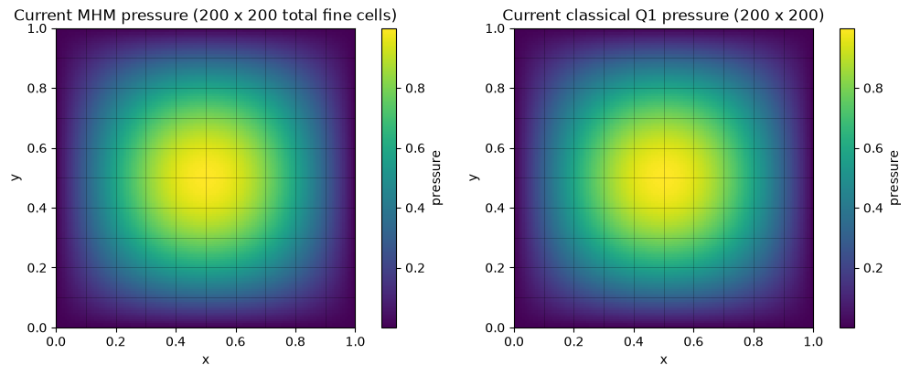
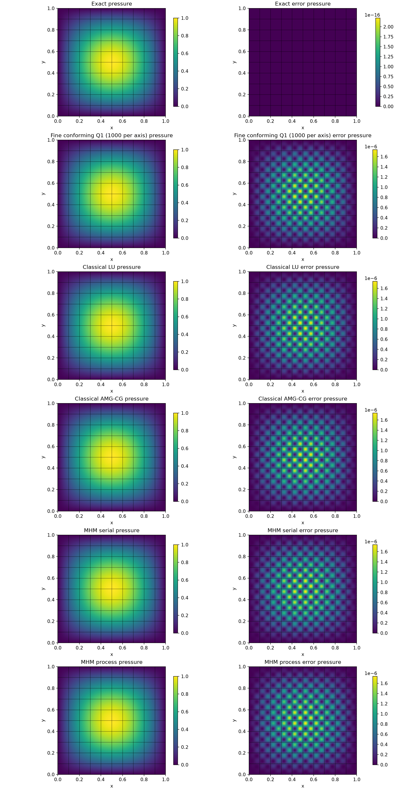
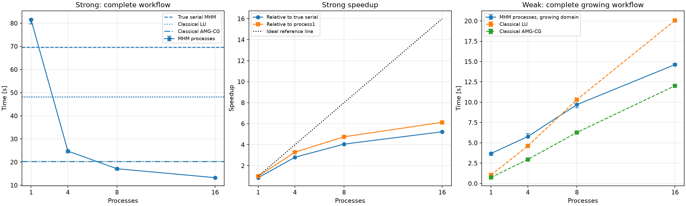

# Darcy: spawn-process scaling

Follow the numbered steps: state the variational problem, choose the local and trace spaces, declare the local and global equations, solve, and inspect the physical fields.

This notebook declares a Darcy discretization through the public equation API, then checks pressure and physical flux against an independently assembled conforming Q1 solution. The default control has 200 × 200 total fine cells. Complete performance campaigns remain explicit and optional.


$$
\begin{aligned}
-K\nabla p&=\boldsymbol q, &\nabla\cdot\boldsymbol q&=f,\\
K(x,y)&=\exp\bigl(\sin(20\pi x)\sin(20\pi y)\bigr), &p_{\mathrm{exact}}&=\sin(\pi x)\sin(\pi y).
\end{aligned}
$$


`DATA.period` controls the current material, independently derived forcing, reference and physical-flux integration. The complete timing campaign uses its fixed period-0.1 data.

The domain is the unit square, with zero exterior pressure. The multiplier is the oriented normal flux. Fine Q1 pressures are conforming inside each macrocell; each macroface carries continuous piecewise P1 functions on four segments. The constant local kernel is represented by physical-volume moments.


$$
\begin{aligned}
A_Kp_K+B_K\lambda&=f_K,\\
\sum_K B_K^{\mathsf T}p_K&=0.
\end{aligned}
$$


The global system retains one pressure constant per macrocell together with the multiplier. The physical flux below is the broken gradient field $-K\nabla p_h$; the figures do not assert fine-cell H(div) conservation.

The PyMHM distribution contains only the library. The first cell explicitly
downloads a checksum-verified companion archive and prepares the declared data
using its local Python helpers. You can inspect these support files in `ROOT`.
Complete studies and historical replay retain their existing opt-in flags.


```python
from pathlib import Path
import os
import sys
from pymhm.io.workspace import workspace_from_archive

# Download verified support files; this operation does not execute them.
COMPANION_URL = "https://ipes-lncc.github.io/pymhm/downloads/af1e75a40be0dd9f18607229302446518e43b317866d6c7afcfc72437393f39b/darcy_process_scalability-companion.zip"
COMPANION_SHA256 = "af1e75a40be0dd9f18607229302446518e43b317866d6c7afcfc72437393f39b"
WORKSPACE = Path(
    os.environ.get("PYMHM_WORKSPACE", Path.cwd() / ".pymhm-companions" / COMPANION_SHA256)
)
ROOT = workspace_from_archive(COMPANION_URL, sha256=COMPANION_SHA256, directory=WORKSPACE)
os.environ["PYMHM_WORKSPACE"] = str(ROOT)
if str(ROOT) not in sys.path:
    sys.path.insert(0, str(ROOT))

# Explicitly prepare declared data with the downloaded Python helpers.
from scripts.notebook_reproduction import notebook_workspace

ROOT = notebook_workspace("introduction/darcy_process_scalability.ipynb", directory=ROOT)
root = ROOT
print("Workspace:", ROOT)


from examples.introduction._scaling_timer import STARTED
import inspect
import numpy as np
from IPython.display import Code, display
from pymhm import MeshHierarchy, bind_interface, bind_problem
from pymhm.core.equations import Equation
from pymhm.core.multiscale import assemble
from pymhm.execution.cpu import ExecutionConfig
from examples.introduction import scaling_forms as forms, scaling_processes as study

DATA = forms.PeriodicDarcyData(period=0.1)
RUN_CAMPAIGN = os.environ.get("PYMHM_RUN_CAMPAIGN", "0") == "1"

```

```text
Workspace: ./build/docs-restructure/final-workspaces/provenance-final-darcy_process_scalability-2d5f1ebbf6e4
```

The displayed source is the actual importable local declaration, shared by both 2D scaling notebooks. Importable providers allow the same declaration to run under threads or cross-platform spawn. To change the formulation, edit this provider or pass your own importable callable to `bind_problem`; no ready Darcy solver is called.

The UFL declaration shows the weak volume and trace forms. The numerical provider uses the same public assembly operations; the native equivalence check includes all normal orientations and mean moments.


```python
display(Code(inspect.getsource(forms.define_ufl_local_equations), language="python"))
display(Code(inspect.getsource(forms.LocalProvider.__call__), language="python"))
forms.verify_source(DATA)
form_checks = study.verify_forms(DATA)
print(form_checks)
```


```python
def define_ufl_local_equations(
    local: LocalContext, data: PeriodicDarcyData = DEFAULT_DATA
) -> LocalEquations:
    """Write local volume and interface forms without numbering or orientation code."""
    binding = local.native_space(degree=1)
    domain, V = binding.mesh, binding.space
    p, v = ufl.TrialFunction(V), ufl.TestFunction(V)
    x, y = ufl.SpatialCoordinate(domain)
    frequency = 2 * np.pi / data.period
    K = ufl.exp(ufl.sin(frequency * x) * ufl.sin(frequency * y))
    p_exact = ufl.sin(np.pi * x) * ufl.sin(np.pi * y)
    grad_K = (
        frequency
        * K
        * ufl.as_vector(
            (
                ufl.cos(frequency * x) * ufl.sin(frequency * y),
                ufl.sin(frequency * x) * ufl.cos(frequency * y),
            )
        )
    )
    grad_exact = np.pi * ufl.as_vector(
        (ufl.cos(np.pi * x) * ufl.sin(np.pi * y), ufl.sin(np.pi * x) * ufl.cos(np.pi * y))
    )
    f = 2 * np.pi**2 * K * p_exact - ufl.dot(grad_K, grad_exact)
    dx = ufl.Measure("dx", domain=domain, metadata={"quadrature_degree": 6})
    a = K * ufl.inner(ufl.grad(p), ufl.grad(v)) * dx
    L = f * v * dx

    # Write both mathematical pairings explicitly. The interface adapter supplies
    # their basis, geometric support and outward-normal transport.
    b = local.trace_pairings(lambda phi, ds: phi * v * ds)
    c = local.trace_pairings(lambda phi, ds: phi * p * ds, axis="rows")
    return local.equations(
        a=a,
        L=L,
        b=b,
        c=c,
        kernel=np.ones((len(binding.mapping), 1)),
        moments=columns(v * dx),
        metadata={"native_to_cartesian": np.argsort(binding.mapping)},
    )
```


```python
    def __call__(self, local: LocalContext) -> LocalEquations:
        """Declare A p+B lambda=f and C=B.T with the physical volume mean."""
        cell, fine = local.cell, local.mesh
        A, mass, f = quadrilateral_operators(
            fine,
            1,
            permeability=self.data.permeability,
            source=self.data.source,
            order=self.quadrature_order,
        )
        B = translated_interface(
            self.coupling_template,
            self.template_endpoints,
            self.macro,
            cell,
            self.face_lengths,
            self.face_space,
        )
        constant = np.ones((len(f), 1))
        return local.equations(
            a=A,
            L=f,
            b=B,
            c=B.T,
            coordinates="global",
            kernel=constant,
            moments=mass @ constant,
            metadata={"mesh": fine},
        )
```


```text
Executed UFL stiffness, source, mean moments and signed interface forms on four macroelements.
```

```text
{0: {'stiffness_max_absolute': 6.217248937900877e-15, 'source_max_absolute': 2.5847379792054426e-16, 'trace_max_absolute': 3.642919299551295e-17, 'mean_max_absolute': 9.75781955236954e-19}, 1: {'stiffness_max_absolute': 1.021405182655144e-14, 'source_max_absolute': 6.418476861114186e-16, 'trace_max_absolute': 2.7755575615628914e-17, 'mean_max_absolute': 2.168404344971009e-18}, 2: {'stiffness_max_absolute': 1.2434497875801753e-14, 'source_max_absolute': 6.279698983036042e-16, 'trace_max_absolute': 3.642919299551295e-17, 'mean_max_absolute': 2.0599841277224584e-18}, 3: {'stiffness_max_absolute': 1.4432899320127035e-14, 'source_max_absolute': 7.28583859910259e-16, 'trace_max_absolute': 2.7755575615628914e-17, 'mean_max_absolute': 3.144186300207963e-18}}
```

Build the hierarchy, bind the normal trace and declare the zero global right-hand side. Only the execution policy changes between the thread and process notebooks.


```python
macro = study.CartesianMacroMesh(10, 10)
face = study.FaceSpace.uniform(1, 4, continuous=True)
skeleton = study.SkeletonSpace(macro, tuple(face for _ in macro.faces))
template, endpoints = forms.refined_interface_template(macro.spacing, 20, face)
provider = forms.LocalProvider(
    macro, skeleton, template, endpoints,
    forms.face_length_snapshot(macro), face, refinement=20, data=DATA,
)
problem = bind_problem(
    MeshHierarchy(macro, provider.local_mesh),
    bind_interface(skeleton, convention="normal"), provider,
    global_equation=Equation(0, 0), retained=1,
)
execution = ExecutionConfig(
    backend="process", workers=2, native_threads=1, batch_size=2, pipeline=True,
)
system = assemble(problem, execution=execution)
solution = system.solve()
current_mhm = macro, system, solution
assert len(macro.cells) * provider.refinement**2 == 200**2
print({"fine_cells": 200**2, "trace_dofs": problem.trace_size,
       "retained_dofs": len(macro.cells), "relative_residual": solution.residual})

```

```text
{'fine_cells': 40000, 'trace_dofs': 1100, 'retained_dofs': 100, 'relative_residual': 1.4123990698251368e-16}
```

The conforming reference assembles its own Q1 volume operator and strongly eliminates zero exterior pressure. Both represented pressures and physical vector fluxes are integrated on the same partition. Macrofaces remain visible on every spatial panel.


```python
_, current_classical = study.run_classical(200, solver="scipy", data=DATA)
current_errors = study.show_control(current_mhm, current_classical, data=DATA)

```

??? note "Numerical output and provenance"

    ```text
    Historical campaign provenance: 2026-10-04 1427bc29c1a62e3c25fe3d4b541fb285feb19ab7
    Archived strong-scaling samples: {
      "serial_1": {
        "median": 69.53116844594479,
        "minimum": 69.47338071465492,
        "maximum": 69.60875017009676,
        "setup": 0.659412607550621,
        "assembly": 68.78981604799628,
        "solve_reconstruct": 0.08570471964776516,
        "cold_total": 71.05097047612071
      },
      "process_1": {
        "median": 81.50446711666882,
        "minimum": 79.70296838879585,
        "maximum": 81.94771174900234,
        "setup": 0.6545804869383574,
        "assembly": 80.74421610310674,
        "solve_reconstruct": 0.10576724633574486,
        "cold_total": 83.02426914684474
      },
      "process_4": {
        "median": 24.77235463447869,
        "minimum": 23.95788929052651,
        "maximum": 24.81420043669641,
        "setup": 0.6465272307395935,
        "assembly": 24.015969736501575,
        "solve_reconstruct": 0.10985766723752022,
        "cold_total": 26.292156664654613
      },
      "process_8": {
        "median": 17.139983143657446,
        "minimum": 16.52059350349009,
        "maximum": 17.187603337690234,
        "setup": 0.6466614436358213,
        "assembly": 16.362650826573372,
        "solve_reconstruct": 0.17673631198704243,
        "cold_total": 18.65978517383337
      },
      "process_16": {
        "median": 13.286783238872886,
        "minimum": 13.243331143632531,
        "maximum": 13.427999714389443,
        "setup": 0.6225218437612057,
        "assembly": 12.505667017772794,
        "solve_reconstruct": 0.17674684710800648,
        "cold_total": 14.80658526904881
      },
      "classical_scipy_1": {
        "median": 48.18146398663521,
        "minimum": 47.865909576416016,
        "maximum": 48.35075887478888,
        "setup": 0.9650074001401663,
        "assembly": 13.726923871785402,
        "solve_reconstruct": 33.48706042021513,
        "cold_total": 49.70126601681113
      },
      "classical_pyamg_1": {
        "median": 20.24718576669693,
        "minimum": 20.131983291357756,
        "maximum": 20.42393846809864,
        "setup": 0.9497230388224125,
        "assembly": 13.682040309533477,
        "solve_reconstruct": 5.6565128192305565,
        "cold_total": 21.766987796872854
      }
    }
    Archived weak-scaling samples: {
      "process_1_L1": {
        "median": 3.691325221210718,
        "minimum": 3.434010224416852,
        "maximum": 3.6958776023238897,
        "setup": 0.07646768167614937,
        "assembly": 3.5918801743537188,
        "solve_reconstruct": 0.0258973129093647,
        "cold_total": 5.2111272513866425
      },
      "classical_scipy_1_L1": {
        "median": 1.043212654069066,
        "minimum": 1.042268868535757,
        "maximum": 1.0923038329929113,
        "setup": 0.04256794974207878,
        "assembly": 0.548406234011054,
        "solve_reconstruct": 0.45938990265130997,
        "cold_total": 2.5630146842449903
      },
      "classical_pyamg_1_L1": {
        "median": 0.7449636813253164,
        "minimum": 0.7050578966736794,
        "maximum": 0.7506204918026924,
        "setup": 0.041968513280153275,
        "assembly": 0.5764635093510151,
        "solve_reconstruct": 0.12549098767340183,
        "cold_total": 2.2647657115012407
      },
      "process_4_L4": {
        "median": 5.7782948538661,
        "minimum": 5.672731289640069,
        "maximum": 6.160258186981082,
        "setup": 0.08070660755038261,
        "assembly": 5.623150132596493,
        "solve_reconstruct": 0.0785621888935566,
        "cold_total": 7.298096884042025
      },
      "classical_scipy_1_L4": {
        "median": 4.615961063653231,
        "minimum": 4.570816563442349,
        "maximum": 4.810904778540134,
        "setup": 0.14355404488742352,
        "assembly": 2.2253566700965166,
        "solve_reconstruct": 2.249515676870942,
        "cold_total": 6.135763093829155
      },
      "classical_pyamg_1_L4": {
        "median": 2.9540700167417526,
        "minimum": 2.9138920847326517,
        "maximum": 3.137380950152874,
        "setup": 0.13513772562146187,
        "assembly": 2.266179893165827,
        "solve_reconstruct": 0.5447558350861073,
        "cold_total": 4.473872046917677
      },
      "process_8_L8": {
        "median": 9.703571043908596,
        "minimum": 9.326755460351706,
        "maximum": 9.85034049488604,
        "setup": 0.08151138015091419,
        "assembly": 9.421834772452712,
        "solve_reconstruct": 0.16865449212491512,
        "cold_total": 11.22337307408452
      },
      "classical_scipy_1_L8": {
        "median": 10.31785566918552,
        "minimum": 10.225858103483915,
        "maximum": 10.52542708069086,
        "setup": 0.2922865469008684,
        "assembly": 4.491326464340091,
        "solve_reconstruct": 5.467080904170871,
        "cold_total": 11.837657699361444
      },
      "classical_pyamg_1_L8": {
        "median": 6.276633257046342,
        "minimum": 6.211051797494292,
        "maximum": 6.346785951405764,
        "setup": 0.2788199055939913,
        "assembly": 4.499747104942799,
        "solve_reconstruct": 1.4792974777519703,
        "cold_total": 7.796435287222266
      },
      "process_16_L16": {
        "median": 14.631420096382499,
        "minimum": 14.617014281451702,
        "maximum": 14.792612310498953,
        "setup": 0.08045429736375809,
        "assembly": 14.19008588604629,
        "solve_reconstruct": 0.3704590518027544,
        "cold_total": 16.151222126558423
      },
      "classical_scipy_1_L16": {
        "median": 20.074449062347412,
        "minimum": 20.049793250858784,
        "maximum": 20.27343798056245,
        "setup": 0.5894117560237646,
        "assembly": 9.067569229751825,
        "solve_reconstruct": 10.421378085389733,
        "cold_total": 21.594251092523336
      },
      "classical_pyamg_1_L16": {
        "median": 12.025081707164645,
        "minimum": 12.01772135682404,
        "maximum": 12.082458697259426,
        "setup": 0.6001557260751724,
        "assembly": 9.041350284591317,
        "solve_reconstruct": 2.376539047807455,
        "cold_total": 13.54488373734057
      }
    }
    Current 200 x 200 physical-field control: {
      "MHM": {
        "pressure_L2_per_sqrt_area": 1.2203901833006532e-05,
        "flux_L2_per_sqrt_area": 0.012719053261234493
      },
      "classical": {
        "pressure_L2_per_sqrt_area": 1.2192433581085124e-05,
        "flux_L2_per_sqrt_area": 0.012718368057784214
      },
      "MHM_to_classical": {
        "pressure_L2_per_sqrt_area": 3.715064914158009e-07,
        "flux_L2_per_sqrt_area": 0.0001320487465734344
      }
    }
    Current reduced-equation relative residual: 1.4123990698251368e-16
    ```


[](../../assets/tutorials/darcy_process_scalability/figure_7_1.png)


```text
Historical artifacts absent from this checkout: []
The current numerical control above is independent of these historical timings.
Available historical campaign figures (original revision retained above):
```


[](../../assets/tutorials/darcy_process_scalability/figure_7_3.png)


[](../../assets/tutorials/darcy_process_scalability/figure_7_4.png)


[](../../assets/tutorials/darcy_process_scalability/figure_7_5.png)


[](../../assets/tutorials/darcy_process_scalability/figure_7_6.png)


[](../../assets/tutorials/darcy_process_scalability/figure_7_7.png)


[](../../assets/tutorials/darcy_process_scalability/figure_7_8.png)


[](../../assets/tutorials/darcy_process_scalability/figure_7_9.png)


The helper owns timing boundaries, CPU/resource checks, independent norm integration, coefficient/basis archives and plotting. Current controls are shown separately from historical measurements. Each historical record retains its original revision and machine; absent original images are reported explicitly.

Set `PYMHM_RUN_CAMPAIGN=1` before execution, or call `study.run_campaign()` explicitly, to acquire the complete 200/500/1000-axis strong, weak and crossover studies. These campaigns are expensive, require the declared CPU capacity and include fresh worker startup, data transfer, synchronization, global solve and reconstruction. Their source is in [the importable scaling helpers](https://github.com/ipes-lncc/pymhm/tree/main/examples/introduction/).


```python
if RUN_CAMPAIGN:
    campaign = study.run_campaign()

```

## Reproduce this tutorial

[View the source notebook](https://github.com/ipes-lncc/pymhm/blob/main/notebooks/introduction/darcy_process_scalability.ipynb) or [download the notebook](https://raw.githubusercontent.com/ipes-lncc/pymhm/main/notebooks/introduction/darcy_process_scalability.ipynb), then open it:

```bash
python -m pip install 'pymhm[notebooks,visualization]'
jupyter lab darcy_process_scalability.ipynb
```

The first cell explicitly downloads a SHA256-verified companion archive. Acquisition does not execute its code. The local support files are inspectable in the printed `ROOT` directory; the following helper call prepares only the declared inputs. The library distribution contains only `pymhm`. Notebooks, support code and data are separate downloads. Native UFL forms require the compatible DOLFINx/UFL backend described in the [installation guide](../../installation.md). A clone and Pixi are unnecessary.

For batch execution, extract the same companion, change to its workspace, and use its local runner with the actual downloaded notebook path:

```bash
python -m scripts.run_notebooks /path/to/darcy_process_scalability.ipynb --timeout 7200
```

The runner uses the active Python interpreter and writes an executed copy and receipt under `build/notebooks/introduction/`. Larger data and field archives have [documented download links](../../data.md) and verified checksums.

The displayed figures and numerical outputs correspond to the retained validated execution of notebook SHA256 `540e077b460da4c13a0ec71d448200a008b8e0d5691e06a8dc610d8e6bb5b4c0` in the [publication manifest](manifest.json). Current instructions use the separately downloaded local `examples` and `scripts` support modules. Running the current source produces a separate receipt for its actual notebook, support bytes and environment. Timings describe the recorded hardware and solver settings; measure your own environment on an idle machine.
