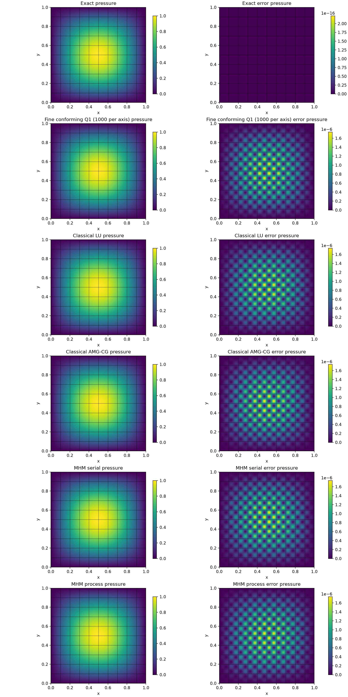
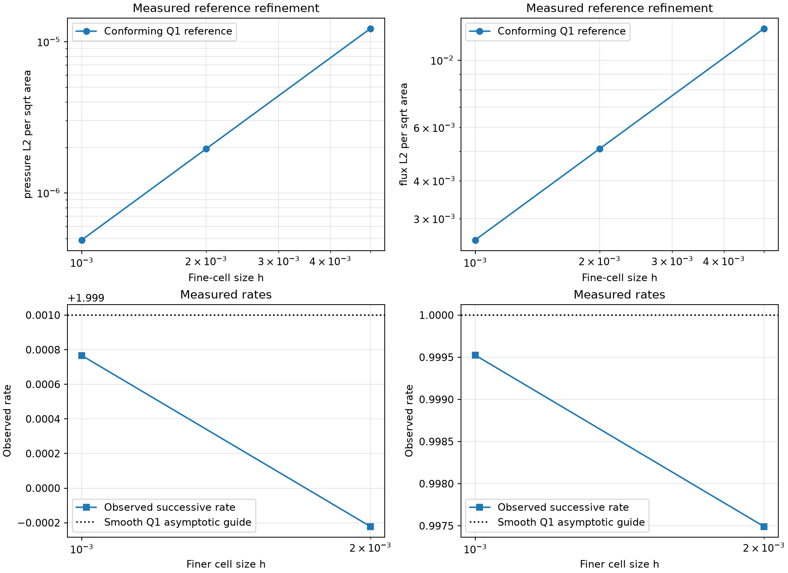
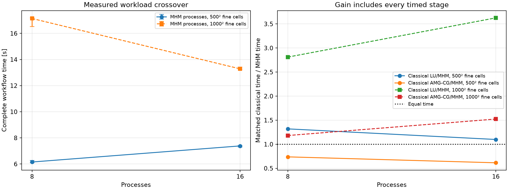
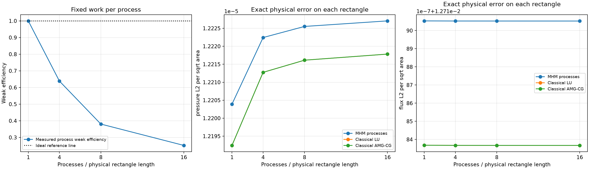

# Process-based MHM for multiscale Darcy

Follow the numbered steps: state the variational problem, choose the local and trace spaces, declare the local and global equations, solve, and inspect the physical fields.

The main workflow is **meshes → spaces → local equations → global balance → assemble → solve → fields and errors**. `MeshHierarchy` associates macro and local meshes; `bind_interface` and `LocalContext` own supported numbering, geometric orientation and native coordinate conversions. The mathematical forms, physical trace meaning, local modes and gauge remain explicit in the cells below. Fully manual/custom spaces use the same numerical owners; see the [custom-interface notebook](https://github.com/ipes-lncc/pymhm/blob/main/notebooks/foundations/operators/custom_interface.ipynb).

This standalone companion to the thread study defines the physical data, weak
forms, local equations, global balance, conforming baselines, validation and
plots in executable cells. Only the scheduling policy changes between true
serial MHM, one-process MHM and multi-process MHM. The full local responses
return to the coordinator for ordered assembly and field reconstruction.

Process startup, worker imports, factory serialization, complete response
transfer, synchronization and shutdown belong to the measured workflow. No
physical matrix, factorization or response is reused between samples. Fresh
conforming Galerkin solves use LU and AMG-preconditioned CG with the same
material, source and homogeneous boundary data. A fine numerical baseline is
validated by its own refinement, separately from the available exact solution.

The strong study uses one million fine cells and 100 macroelements, and the
crossover study uses 250,000 fine cells on the same macro mesh. Weak scaling
uses 40,000 fine cells and 100 macroelements per process. Every configuration
reports one warm-up separately
and then three randomized repetitions. A process run may be slower than serial;
the tables and plots retain that outcome. No speedup is assumed.

The primal MHM construction follows
[Harder, Paredes and Valentin (2013)](https://doi.org/10.1016/j.jcp.2013.03.019).
This periodic manufactured problem is an introductory experiment, rather than
a reproduction of a paper's discretization or performance figure.


```python
import os
from pathlib import Path

# Set these before importing numerical libraries; enforce limits again below.
for variable in (
    "OMP_NUM_THREADS",
    "OPENBLAS_NUM_THREADS",
    "MKL_NUM_THREADS",
    "BLIS_NUM_THREADS",
    "VECLIB_MAXIMUM_THREADS",
):
    os.environ[variable] = "1"

import ast
import atexit
import importlib.util
import tempfile
import hashlib
import json
import math
import platform
import random
import subprocess
import sys
import time
PARENT_IMPORT_START = time.perf_counter()
from dataclasses import dataclass, replace
from importlib.metadata import version
from typing import Any, Callable

import ufl
from dolfinx import fem as native_fem, mesh as native_mesh
from mpi4py import MPI

import matplotlib.pyplot as plt
import numpy as np
from matplotlib.collections import LineCollection
from numpy.polynomial.legendre import leggauss
from scipy import sparse
from threadpoolctl import threadpool_info, threadpool_limits

from pymhm.core.equations import Equation, LocalEquations
from pymhm.core.multiscale import MultiscaleProblem, assemble
from pymhm.execution.cpu import ExecutionConfig
from pymhm.fem.scalar.quadrilateral import qk_basis, qk_space
from pymhm.fem.traces.interval import FaceSpace, SkeletonSpace
from pymhm.io.provenance import current_source_manifest
from pymhm.linalg.linear import solve_linear
from pymhm.meshes.cartesian import CartesianMacroMesh

ROOT = Path.cwd()
while not (ROOT / "pixi.toml").exists():
    ROOT = ROOT.parent
OUTPUT = ROOT / "build" / "introduction" / "darcy_process_scalability"
OUTPUT.mkdir(parents=True, exist_ok=True)
plt.rcParams.update({"figure.dpi": 110, "font.size": 10})
SOURCE_NOTEBOOK = Path(os.environ.get("PYMHM_NOTEBOOK_SOURCE", ROOT / "notebooks/introduction/darcy_process_scalability.ipynb"))

PARENT_IMPORT_SECONDS = time.perf_counter() - PARENT_IMPORT_START

from pymhm import MeshHierarchy, LocalContext, bind_interface, bind_problem
from pymhm.backends.spaces import bind_space

# Opt in only when dedicated resources are available for the full campaign.
RUN_CAMPAIGN = os.environ.get("PYMHM_RUN_CAMPAIGN", "0") == "1"

```

## 1. State the physical problem and differentiate the source

On the rectangle $\Omega_L=(0,L)\times(0,1)$, with integer $L$, use


$$
\begin{aligned}
\boldsymbol q&=-K\nabla p,\\
-\nabla\cdot(K\nabla p)&=f &&\text{in }\Omega_L,\\
p&=0 &&\text{on }\partial\Omega_L,\\
K(x,y)&=\exp\!\left(\sin(2\pi x/\varepsilon)
                         \sin(2\pi y/\varepsilon)\right),
\qquad\varepsilon=0.1.
\end{aligned}
$$


Choose $p_{\mathrm{ex}}=\sin(\pi x)\sin(\pi y)$. The independently differentiated
source is


$$
f=2\pi^2 Kp_{\mathrm{ex}}-\nabla K\cdot\nabla p_{\mathrm{ex}}.
$$


The next cell writes these data directly in NumPy and checks the source with
finite differences. Integer domain lengths preserve homogeneous exterior
pressure. Weak scaling extends the physical periodic medium while keeping its
microscale, macroelement size and local fine-cell size fixed.


```python
EPSILON = 0.1


def permeability(points: np.ndarray) -> np.ndarray:
    """Return scalar isotropic permeability at points with final axis (x,y)."""
    x, y = points[..., 0], points[..., 1]
    frequency = 2 * np.pi / EPSILON
    return np.exp(np.sin(frequency * x) * np.sin(frequency * y))


def exact_pressure(points: np.ndarray) -> np.ndarray:
    """Return the manufactured pressure with homogeneous boundary data."""
    return np.sin(np.pi * points[..., 0]) * np.sin(np.pi * points[..., 1])


def exact_gradient(points: np.ndarray) -> np.ndarray:
    """Return the two physical derivatives of manufactured pressure."""
    x, y = points[..., 0], points[..., 1]
    return np.pi * np.stack(
        (np.cos(np.pi * x) * np.sin(np.pi * y), np.sin(np.pi * x) * np.cos(np.pi * y)), axis=-1
    )


def source(points: np.ndarray) -> np.ndarray:
    """Evaluate f=-div(K grad(p_exact)) from independent analytic derivatives."""
    x, y = points[..., 0], points[..., 1]
    frequency = 2 * np.pi / EPSILON
    material = permeability(points)
    grad_material = (
        frequency
        * material[..., None]
        * np.stack(
            (
                np.cos(frequency * x) * np.sin(frequency * y),
                np.sin(frequency * x) * np.cos(frequency * y),
            ),
            axis=-1,
        )
    )
    return 2 * np.pi**2 * material * exact_pressure(points) - np.sum(
        grad_material * exact_gradient(points), axis=-1
    )


# Verify the source against finite differences, away from boundaries.
probe = np.array([[0.237, 0.419], [0.613, 0.728], [0.832, 0.147]])
step = 2e-6
divergence = np.zeros(len(probe))
for axis in range(2):
    shift = np.eye(2)[axis] * step
    plus = permeability(probe + shift) * exact_gradient(probe + shift)[:, axis]
    minus = permeability(probe - shift) * exact_gradient(probe - shift)[:, axis]
    divergence += (plus - minus) / (2 * step)
np.testing.assert_allclose(source(probe), -divergence, rtol=2e-8, atol=2e-8)

```


```python
# The physical coordinates do not get divided by the rectangle length.
# Check both the independently differentiated source and all exterior data.
rectangle_data_checks = {}
for length in (1, 4, 8, 16):
    rectangle_probe = np.array([[.237, .419], [length - .387, .728], [length / 2 + .132, .147]])
    divergence = np.zeros(len(rectangle_probe))
    for axis in range(2):
        shift = np.eye(2)[axis] * step
        plus = permeability(rectangle_probe + shift) * exact_gradient(rectangle_probe + shift)[:, axis]
        minus = permeability(rectangle_probe - shift) * exact_gradient(rectangle_probe - shift)[:, axis]
        divergence += (plus - minus) / (2 * step)
    np.testing.assert_allclose(source(rectangle_probe), -divergence, rtol=2e-8, atol=2e-8)
    parameter = np.linspace(0, 1, 51)
    exterior = np.vstack((np.column_stack((length * parameter, np.zeros_like(parameter))),
                          np.column_stack((length * parameter, np.ones_like(parameter))),
                          np.column_stack((np.zeros_like(parameter), parameter)),
                          np.column_stack((np.full_like(parameter, length), parameter))))
    np.testing.assert_allclose(exact_pressure(exterior), 0, rtol=0, atol=1e-14)
    rectangle_data_checks[str(length)] = {
        "source_finite_difference_maximum": float(np.max(abs(source(rectangle_probe) + divergence))),
        "exterior_pressure_maximum": float(np.max(abs(exact_pressure(exterior)))),
    }
print({"physical_rectangle_checks": rectangle_data_checks})

```

```text
{'physical_rectangle_checks': {'1': {'source_finite_difference_maximum': 1.1721208466042299e-06, 'exterior_pressure_maximum': 1.2246467991473532e-16}, '4': {'source_finite_difference_maximum': 1.1721208466042299e-06, 'exterior_pressure_maximum': 4.898587196589413e-16}, '8': {'source_finite_difference_maximum': 1.1721208466042299e-06, 'exterior_pressure_maximum': 9.797174393178826e-16}, '16': {'source_finite_difference_maximum': 1.1721208466042299e-06, 'exterior_pressure_maximum': 1.959434878635765e-15}}}
```

## 2. Define and execute the local weak forms

The mathematical operator comes first:


$$
a_T(p,v)=\int_T K\nabla p\cdot\nabla v,
\qquad L_T(v)=\int_T fv.
$$


The local Neumann kernel is the constant function. The volume-mean pairing
fixes its local complement; the retained constant itself is solved globally.
The following geometry adapter supplies native coordinates and boundary tags.
It contains no physical coefficient or PDE. The subsequent UFL cell declares
the actual stiffness, source, physical moment and oriented face integrals.


```python
import ufl
from pymhm.core.equations import compile_local_equations

# LocalContext.native_space binds the geometry, Basix element and native DOF order.
# LocalContext.trace_pairings binds each face basis to its integration support.

```

For a globally oriented face normal $\boldsymbol n_F$, the multiplier represents
the physical normal Darcy flux, and
$s_{TF}=\boldsymbol n_T\cdot\boldsymbol n_F$ fixes its outward sign. The local
equation and global balance are


$$
\begin{aligned}
a_T(p_T,v_T)+b_T(\lambda,v_T)&=(f,v_T)_T,\\
b_T(\lambda,v)&=\sum_{F\subset\partial T}s_{TF}\int_F\lambda_Fv,\\
\sum_T b_T(\mu,p_T)&=0.
\end{aligned}
$$


The global equation imposes pressure continuity in the selected face moments
and homogeneous exterior pressure moments. This Dirichlet boundary condition
removes the global pressure gauge. `LocalEquations` declares the kernel and
volume moments explicitly; `columns` and `rows` declare both face pairings.

The small mathematical demonstration uses continuous piecewise P1 traces on
four segments per macroface, independently of other faces. Performance meshes
and face partitions are selected later from the pilot.


```python
from pymhm.core.equations import columns

def define_ufl_local_equations(local: LocalContext) -> LocalEquations:
    """Write local volume and interface forms without numbering or orientation code."""
    binding = local.native_space(degree=1)
    domain, V = binding.mesh, binding.space
    p, v = ufl.TrialFunction(V), ufl.TestFunction(V)
    x, y = ufl.SpatialCoordinate(domain)
    frequency = 2 * np.pi / EPSILON
    K = ufl.exp(ufl.sin(frequency * x) * ufl.sin(frequency * y))
    p_exact = ufl.sin(np.pi * x) * ufl.sin(np.pi * y)
    grad_K = (
        frequency
        * K
        * ufl.as_vector(
            (
                ufl.cos(frequency * x) * ufl.sin(frequency * y),
                ufl.sin(frequency * x) * ufl.cos(frequency * y),
            )
        )
    )
    grad_exact = np.pi * ufl.as_vector(
        (ufl.cos(np.pi * x) * ufl.sin(np.pi * y), ufl.sin(np.pi * x) * ufl.cos(np.pi * y))
    )
    f = 2 * np.pi**2 * K * p_exact - ufl.dot(grad_K, grad_exact)
    dx = ufl.Measure("dx", domain=domain, metadata={"quadrature_degree": 6})
    a = K * ufl.inner(ufl.grad(p), ufl.grad(v)) * dx
    L = f * v * dx

    # Write both mathematical pairings explicitly. The interface adapter supplies
    # their basis, geometric support and outward-normal transport.
    b = local.trace_pairings(lambda phi, ds: phi * v * ds)
    c = local.trace_pairings(lambda phi, ds: phi * p * ds, axis="rows")
    return local.equations(
        a=a, L=L, b=b, c=c,
        kernel=np.ones((len(binding.mapping), 1)), moments=columns(v * dx),
        metadata={"native_to_cartesian": np.argsort(binding.mapping)},
    )


demo_macro = CartesianMacroMesh(2, 2)
demo_skeleton = SkeletonSpace(
    demo_macro, tuple(FaceSpace.uniform(1, 4, continuous=True) for _ in demo_macro.faces)
)
demo_problem = bind_problem(
    MeshHierarchy(demo_macro, tuple(demo_macro.submesh(cell, 20) for cell in range(len(demo_macro.cells)))),
    bind_interface(demo_skeleton, convention="normal"), define_ufl_local_equations,
    retained=1,
)
native_demonstrations = {}
# Include the interior sign reversals as well as exterior boundary orientations.
for cell in range(len(demo_macro.cells)):
    local = demo_problem.local_context(cell)
    try:
        equations = define_ufl_local_equations(local)
        compiled = compile_local_equations(equations)
        native_demonstrations[cell] = (compiled.problem, equations.metadata["native_to_cartesian"])
    finally:
        local.close()
print(
    "Executed UFL stiffness, source, mean moments and signed interface forms on four macroelements."
)

```

```text
Executed UFL stiffness, source, mean moments and signed interface forms on four macroelements.
```

## 3. Verify the prepared assembly conveniences

The next cell compares the executed UFL blocks with the package's portable
quadrilateral assembly, after matching their native node numbering. It checks
stiffness, source, means and all four face orientations. These conveniences
assemble the declared forms; they do not select a complete Darcy model.

Timed runs use this verified Basix/SciPy path for both methods. Native UFL
meshes, forms and communicators are confined to the mathematical demonstration;
no live native solver object is sent to a process.


```python
from pymhm.fem.scalar.quadrilateral import (
    quadrilateral_operators,
    quadrilateral_trace_coupling,
    quadrilateral_quadrature as gauss_square,
)

ufl_block_equivalence = {}

# Reconcile native node order before comparing the same executed weak forms.
for cell, (native_problem, native_order) in native_demonstrations.items():
    fine = demo_macro.submesh(cell, 20)
    inverse_order = np.argsort(native_order)
    A, mass, load = quadrilateral_operators(
        fine, 1, permeability=permeability, source=source, order=4
    )
    B = quadrilateral_trace_coupling(demo_macro, cell, fine, demo_skeleton, 1)
    np.testing.assert_allclose(
        native_problem.matrix[inverse_order][:, inverse_order].toarray(),
        A.toarray(),
        rtol=5e-12,
        atol=5e-13,
    )
    np.testing.assert_allclose(native_problem.load[inverse_order], load, rtol=5e-12, atol=5e-13)
    np.testing.assert_allclose(native_problem.coupling[inverse_order], B, rtol=5e-12, atol=5e-13)
    np.testing.assert_allclose(
        native_problem.constraints[inverse_order],
        mass @ np.ones((len(load), 1)),
        rtol=5e-12,
        atol=5e-13,
    )
    difference = native_problem.matrix[inverse_order][:, inverse_order] - A
    ufl_block_equivalence[cell] = {
        "stiffness_max_absolute": float(np.max(np.abs(difference.data), initial=0)),
        "source_max_absolute": float(np.max(np.abs(native_problem.load[inverse_order] - load))),
        "trace_max_absolute": float(np.max(np.abs(native_problem.coupling[inverse_order] - B))),
        "mean_max_absolute": float(
            np.max(
                np.abs(native_problem.constraints[inverse_order] - mass @ np.ones((len(load), 1)))
            )
        ),
    }

```

Prepare the uniform face-integral geometry once inside every workflow's setup.
The existing adapter transports lengths, parameter directions and outward
normal signs. It reuses no material matrix, load, factor or response. Each
macroelement still assembles and condenses its own physical problem.


```python
def face_length_snapshot(macro: CartesianMacroMesh) -> np.ndarray:
    """Compute immutable physical face lengths once for a declared mesh."""
    lengths = macro.lengths
    lengths.setflags(write=False)
    return lengths

```


```python
def translated_interface(
    template: np.ndarray,
    template_ends: np.ndarray,
    macro: CartesianMacroMesh,
    cell: int,
    face_lengths: np.ndarray,
    face_space: FaceSpace,
) -> np.ndarray:
    """Transport uniform continuous P1 face pairings by length, orientation and sign.

    Within each size, local Cartesian grids share their declared nodal order.
    The supplied FaceSpace determines each side's column count. Reversing a
    uniform nodal-P1 parameter reverses those columns. Face lengths are an
    immutable per-run snapshot; material, source and local factors are never
    reused. Each worker receives an owned coupling matrix.
    """
    if not face_space.continuous or any(p != 1 for p in face_space.degrees):
        raise ValueError("This translation helper requires continuous piecewise P1 traces")
    if not np.allclose(
        face_space.breaks, np.linspace(0, 1, len(face_space.breaks)), rtol=0, atol=1e-14
    ):
        raise ValueError("This translation helper requires uniform face segments")
    width = face_space.size
    assert template.shape[1] == 4 * width
    coupling = np.empty_like(template)
    for side, face in enumerate(macro.cell_faces[cell]):
        tangent = macro.points[macro.faces[face, 1]] - macro.points[macro.faces[face, 0]]
        reference_tangent = template_ends[side, 1] - template_ends[side, 0]
        columns = slice(width * side, width * (side + 1))
        block = template[:, columns]
        if tangent @ reference_tangent < 0:
            block = block[:, ::-1]
        coupling[:, columns] = (
            macro.signs[cell, side] * face_lengths[face] / np.linalg.norm(reference_tangent)
        ) * block
    return coupling

```


```python
def refined_interface_template(
    spacing: np.ndarray,
    refinement: int,
    face_space: FaceSpace,
) -> tuple[np.ndarray, np.ndarray]:
    """Prepare the actual local-grid pairing with the supplied trace partition."""
    macro = CartesianMacroMesh(1, 1, (0, float(spacing[0]), 0, float(spacing[1])))
    skeleton = SkeletonSpace(macro, tuple(face_space for _ in macro.faces))
    template = quadrilateral_trace_coupling(macro, 0, macro.submesh(0, refinement), skeleton, 1)
    ends = macro.points[macro.faces[macro.cell_faces[0]]]
    template.setflags(write=False)
    ends.setflags(write=False)
    return template, ends

```


```python
def interface_template(spacing: np.ndarray, face_space: FaceSpace) -> tuple[np.ndarray, np.ndarray]:
    """Prepare the introductory local20 pairing for its declared trace space."""
    return refined_interface_template(spacing, 20, face_space)

```


```python
# Verify every normal sign and boundary orientation against direct face integration.
demo_trace_space = FaceSpace.uniform(1, 4, continuous=True)
demo_lengths = face_length_snapshot(demo_macro)
demo_template, demo_ends = interface_template(demo_macro.spacing, demo_trace_space)
for cell in range(len(demo_macro.cells)):
    fine = demo_macro.submesh(cell, 20)
    direct = quadrilateral_trace_coupling(demo_macro, cell, fine, demo_skeleton, 1)
    transported = translated_interface(
        demo_template, demo_ends, demo_macro, cell, demo_lengths, demo_trace_space
    )
    np.testing.assert_allclose(transported, direct, rtol=5e-12, atol=5e-13)

```


```python
@dataclass(frozen=True)
class LocalProvider:
    """Supply the verified weak forms through prepared portable assembly conveniences."""

    macro: CartesianMacroMesh
    skeleton: SkeletonSpace
    coupling_template: np.ndarray
    template_endpoints: np.ndarray
    face_lengths: np.ndarray
    face_space: FaceSpace
    refinement: int = 20
    quadrature_order: int = 4

    def local_mesh(self, cell: int) -> CartesianMacroMesh:
        """Describe each fine mesh so it is created within its owning worker."""
        return self.macro.submesh(cell, self.refinement)

    def __call__(self, local: LocalContext) -> LocalEquations:
        """Declare A p+B lambda=f and C=B.T with the physical volume mean."""
        cell, fine = local.cell, local.mesh
        A, mass, f = quadrilateral_operators(
            fine, 1, permeability=permeability, source=source, order=self.quadrature_order
        )
        B = translated_interface(
            self.coupling_template,
            self.template_endpoints,
            self.macro,
            cell,
            self.face_lengths,
            self.face_space,
        )
        constant = np.ones((len(f), 1))
        return local.equations(
            a=A,
            L=f,
            b=B,
            c=B.T,
            coordinates="global",
            kernel=constant,
            moments=mass @ constant,
            metadata={"mesh": fine},
        )

```

## 4. Give spawned workers an importable copy of the displayed provider

`spawn` starts a fresh interpreter. A notebook's provider belongs to its
interactive kernel, so a child needs an importable module containing that
provider and its dependencies. The cell below emits only the **literal
definitions already executed above**, plus imports of general package owners.
It selects their exact cell source, including the dataclass decorator, writes
one temporary module and records its digest. No physical formulation is hidden
in a separate case library.

Keep the directory alive until every pool has joined. The numerical workers,
spawn context and ordered reduction belong to `ExecutionConfig` and `assemble`.
This study opts into `pipeline=True`: a bounded rolling window yields the next
cell result in order while other workers continue. `batch_size=workers` bounds
consumed inputs whose results have not yet been yielded. Independent Schur
contributions belong to each local worker; shared global entries are reduced
only by the coordinator. The API default retains atomic batches with
`pipeline=False`. Spawned workers preserve the coordinator's native limits.
The factory is transferred once per worker; tasks then transfer cell indices,
and results transfer complete numerical responses. See Python's
[spawn documentation](https://docs.python.org/3.13/library/multiprocessing.html#the-spawn-and-forkserver-start-methods).


```python
PROVIDER_DEPENDENCIES = (
    "permeability", "exact_pressure", "exact_gradient", "source",
    "face_length_snapshot", "translated_interface", "refined_interface_template",
    "LocalProvider",
)


def literal_executed_definitions(names: tuple[str, ...]) -> str:
    """Select exact executed IPython source, preserving decorators and EPSILON."""
    definitions, epsilon = {}, None
    for source_text in get_ipython().history_manager.input_hist_raw:
        try:
            tree = ast.parse(source_text)
        except SyntaxError:
            continue
        source_lines = source_text.splitlines()
        for node in tree.body:
            if isinstance(node, (ast.FunctionDef, ast.ClassDef)) and node.name in names:
                start = min([node.lineno, *(item.lineno for item in node.decorator_list)])
                definitions[node.name] = "\n".join(source_lines[start - 1 : node.end_lineno])
            elif isinstance(node, ast.Assign) and any(
                isinstance(target, ast.Name) and target.id == "EPSILON" for target in node.targets
            ):
                epsilon = ast.get_source_segment(source_text, node)
    if set(names) != set(definitions) or epsilon is None:
        raise ValueError("Execute every displayed physical/provider definition before exporting it")
    return "\n\n\n".join([epsilon, *(definitions[name] for name in names)])


MODULE_IMPORTS = """from __future__ import annotations
from dataclasses import dataclass
from pymhm import LocalContext
import numpy as np
from pymhm.core.equations import LocalEquations
from pymhm.fem.scalar.quadrilateral import quadrilateral_operators, quadrilateral_trace_coupling
from pymhm.fem.traces.interval import FaceSpace, SkeletonSpace
from pymhm.meshes.cartesian import CartesianMacroMesh
"""

export_started = time.perf_counter()
literal_provider_source = literal_executed_definitions(PROVIDER_DEPENDENCIES)
provider_source_sha256 = hashlib.sha256(literal_provider_source.encode()).hexdigest()
spawn_directory = tempfile.TemporaryDirectory(prefix="pymhm_notebook_spawn_")
atexit.register(spawn_directory.cleanup)
module_name = "pymhm_notebook_provider_" + provider_source_sha256[:16]
module_path = Path(spawn_directory.name) / (module_name + ".py")
module_path.write_text(MODULE_IMPORTS + "\n" + literal_provider_source + "\n")
sys.path.insert(0, spawn_directory.name)
specification = importlib.util.spec_from_file_location(module_name, module_path)
provider_module = importlib.util.module_from_spec(specification)
sys.modules[module_name] = provider_module
specification.loader.exec_module(provider_module)
SpawnLocalProvider = provider_module.LocalProvider
EXPORT_IMPORT_SECONDS = time.perf_counter() - export_started
module_sha256 = hashlib.sha256(module_path.read_bytes()).hexdigest()
(OUTPUT / "literal_provider.py").write_text(module_path.read_text())
print({"literal_provider_sha256": provider_source_sha256,
       "module_sha256": module_sha256,
       "one_time_export_import_seconds": EXPORT_IMPORT_SECONDS})

```

```text
{'literal_provider_sha256': '75a5366446fae8fc59e3f78355ca65a00a419c01199e2684a0201eebc39c5741', 'module_sha256': '1ca109553770ff6713acce5e5e6ef1c9e0e8071135e3d027e764fc0a9cd11c2b', 'one_time_export_import_seconds': 0.020114725455641747}
```

## 5. Declare the selected workloads and repetition protocol

Strong scaling fixes a $1000\times1000$ fine grid and continuous P1 traces on
eight segments per macroface. The $500\times500$ crossover comparison uses
four trace segments and processes eight and sixteen. The weak study retains
a $200\times200$ fine grid per unit-width strip, four trace segments, and
process counts one, four, eight and sixteen. The largest weak problem has
640,000 fine cells on $(0,16)\times(0,1)$.

These workloads keep both the startup-dominated regime and the larger local
problems in view. Include one process to expose startup and serialization costs
directly. The conforming refinement
meshes must be nested with the MHM fine grid so field norms integrate every
fine-cell and macroface break without smoothing.

Report one warm-up and three randomized repetitions for every selected
configuration. Scientific controls and reference refinement have separate
records; they supply no matrix, factor or response to the timed solves.


```python
WORKLOAD = {
    "fine_n": 1000, "trace_segments": 8, "process_counts": (1, 4, 8, 16),
    "weak_fine_n": 200, "weak_trace_segments": 4,
    "crossover_fine_n": 500, "crossover_trace_segments": 4,
    "crossover_process_counts": (8, 16), "reference_fine_sizes": (200, 500, 1000),
    "selection_reason": "Resolve the fixed medium; compare startup cost, larger local work and fixed work per process",
}
REPETITIONS = 3
RANDOM_SEED = 20261004

if WORKLOAD["fine_n"] % 10 or WORKLOAD["weak_fine_n"] % 10:
    raise ValueError("Fine-grid sizes must be multiples of the ten macros per unit coordinate")
PROCESS_COUNTS = tuple(WORKLOAD["process_counts"])
if not PROCESS_COUNTS or any(isinstance(p, bool) or not isinstance(p, int) or p < 1 for p in PROCESS_COUNTS):
    raise ValueError("Every process count must be a positive integer")
if PROCESS_COUNTS != tuple(sorted(set(PROCESS_COUNTS))) or PROCESS_COUNTS[0] != 1:
    raise ValueError("Use increasing distinct positive process counts, including process1")
REFERENCE_FINE_SIZES = tuple(WORKLOAD["reference_fine_sizes"])
if len(REFERENCE_FINE_SIZES) < 3 or any(
    b <= a for a, b in zip(REFERENCE_FINE_SIZES, REFERENCE_FINE_SIZES[1:])
):
    raise ValueError("Use at least three increasing conforming refinement meshes")
if any(REFERENCE_FINE_SIZES[-1] % n for n in (*REFERENCE_FINE_SIZES, WORKLOAD["fine_n"])):
    raise ValueError("The common integration partition must resolve every fine-grid breakpoint")
assert WORKLOAD["selection_reason"]

```


```python
def available_cpus() -> tuple[int, dict[str, Any]]:
    """Bound the worker count by CPU affinity and Linux container quotas when present."""
    affinity = sorted(os.sched_getaffinity(0)) if hasattr(os, "sched_getaffinity") else None
    count = len(affinity) if affinity is not None else (os.cpu_count() or 1)
    quota_limits = []
    quota_controls = []
    groups = {}
    if Path("/proc/self/cgroup").exists():
        for line in Path("/proc/self/cgroup").read_text().splitlines():
            _, controllers, group = line.split(":", 2)
            groups[controllers] = group
    candidates = []
    if Path("/proc/self/mountinfo").exists():
        for line in Path("/proc/self/mountinfo").read_text().splitlines():
            left, right = line.split(" - ", 1)
            mount_fields, fs_fields = left.split(), right.split()
            mount = Path(mount_fields[4])
            if fs_fields[0] == "cgroup2" and "" in groups:
                candidates.append((mount, groups[""], "cpu.max"))
            elif fs_fields[0] == "cgroup" and "cpu" in fs_fields[2].split(","):
                for controllers, group in groups.items():
                    if "cpu" in controllers.split(","):
                        candidates.append((mount, group, "cpu.cfs_quota_us"))
    # Inspect the process group and its ancestors: a parent may impose a quota.
    for mount, group, filename in candidates:
        directory = mount / group.lstrip("/")
        while directory.is_relative_to(mount):
            control = directory / filename
            if control.exists():
                if filename == "cpu.max":
                    value, period = control.read_text().strip().split()
                    limit = None if value == "max" else int(value) / int(period)
                else:
                    value = int(control.read_text().strip())
                    period = int(control.with_name("cpu.cfs_period_us").read_text())
                    limit = value / period if value > 0 else None
                quota_controls.append({"control": str(control), "limit": limit})
                if limit is not None:
                    quota_limits.append(limit)
            if directory == mount:
                break
            directory = directory.parent
    quota = min(quota_limits) if quota_limits else None
    if quota is not None:
        count = min(count, max(1, math.floor(quota)))
    return count, {
        "logical_cpus": os.cpu_count(),
        "affinity": affinity,
        "cpu_quota": quota,
        "quota_controls": quota_controls,
    }

```


```python
CPU_CAPACITY, CPU_METADATA = available_cpus()
if PROCESS_COUNTS[-1] > CPU_CAPACITY:
    raise ValueError("A process count exceeds the affinity/quota available to this kernel")
print({"workload": WORKLOAD, "resources": CPU_METADATA,
       "native_libraries": threadpool_info()})

```

```text
{'workload': {'fine_n': 1000, 'trace_segments': 8, 'process_counts': (1, 4, 8, 16), 'weak_fine_n': 200, 'weak_trace_segments': 4, 'crossover_fine_n': 500, 'crossover_trace_segments': 4, 'crossover_process_counts': (8, 16), 'reference_fine_sizes': (200, 500, 1000), 'selection_reason': 'Resolve the fixed medium; compare startup cost, larger local work and fixed work per process'}, 'resources': {'logical_cpus': 64, 'affinity': [0, 1, 2, 3, 4, 5, 6, 7, 8, 9, 10, 11, 12, 13, 14, 15, 16, 17, 18, 19, 20, 21, 22, 23, 24, 25, 26, 27, 28, 29, 30, 31, 32, 33, 34, 35, 36, 37, 38, 39, 40, 41, 42, 43, 44, 45, 46, 47, 48, 49, 50, 51, 52, 53, 54, 55, 56, 57, 58, 59, 60, 61, 62, 63], 'cpu_quota': None, 'quota_controls': [{'control': '/sys/fs/cgroup/cpu,cpuacct/user.slice/cpu.cfs_quota_us', 'limit': None}, {'control': '/sys/fs/cgroup/cpu,cpuacct/cpu.cfs_quota_us', 'limit': None}]}, 'native_libraries': [{'user_api': 'blas', 'internal_api': 'blis', 'num_threads': 1, 'prefix': 'libblis', 'filepath': './.pixi/envs/introduction/lib/libblis.so.4.0.0', 'version': '2.0', 'threading_layer': 'pthreads', 'architecture': 'haswell'}, {'user_api': 'openmp', 'internal_api': 'openmp', 'num_threads': 1, 'prefix': 'libgomp', 'filepath': './.pixi/envs/introduction/lib/libgomp.so.1.0.0', 'version': None}]}
```


```python
def resource_snapshot() -> dict[str, Any]:
    """Capture actual coordinator limits and cumulative CPU/child usage outside timers."""
    record = {"pid": os.getpid(), "native_libraries": threadpool_info(),
              "affinity": sorted(os.sched_getaffinity(0)) if hasattr(os, "sched_getaffinity") else None,
              "load_average": list(os.getloadavg()) if hasattr(os, "getloadavg") else None,
              "native_thread_environment": {name: os.environ.get(name) for name in (
                  "OMP_NUM_THREADS", "OPENBLAS_NUM_THREADS", "MKL_NUM_THREADS",
                  "BLIS_NUM_THREADS", "VECLIB_MAXIMUM_THREADS")}}
    try:
        import resource
    except ImportError:
        return record
    for label, selector in (("self", resource.RUSAGE_SELF), ("children", resource.RUSAGE_CHILDREN)):
        usage = resource.getrusage(selector)
        record[label] = {"user_seconds": usage.ru_utime, "system_seconds": usage.ru_stime,
                         "maximum_resident_set_size": usage.ru_maxrss,
                         "resident_set_unit": "bytes" if sys.platform == "darwin" else "KiB",
                         "voluntary_context_switches": usage.ru_nvcsw,
                         "involuntary_context_switches": usage.ru_nivcsw}
    # Children maximum RSS is the largest individual child, not a simultaneous sum.
    return record

```

## 6. Declare complete MHM workflows and independent conforming solves

The global equation is explicitly `Equation(a=0, L=0)` because every balance
pairing already comes from the local declarations. There is one retained
constant per macroelement. Every run constructs its macro mesh, face geometry,
provider and global problem afresh. `backend="serial"` creates no executor;
`backend="process"` uses the generic cross-platform spawn path.

The classical Q1 method scatters every fine-element integral into a conforming
matrix and strongly eliminates homogeneous exterior pressure. Its reduced
operator is SPD. LU and fresh smoothed-aggregation AMG-preconditioned CG use
the same operator, float64 and true original-equation residual criterion. The
indefinite MHM global system continues to use LU.

The timer starts before mesh construction and stops after the global solve and
all field reconstruction. The assembly interval includes startup, worker
imports, serialization, full responses, ordered reduction and join. The common
one-time module export and parent imports are additionally reported in a cold
total for every method. This cold total means shared notebook setup plus one
complete workflow, with an initialized parent kernel and its native caches;
the per-workflow fresh worker startup is included in assembly. Error
integration, plots and archive writing follow
the stopped timers. The operator's mass-matrix construction remains included
in both methods' displayed assembly paths.


```python
def run_mhm(
    backend: str,
    workers: int,
    fine_n: int,
    trace_segments: int,
    length: int = 1,
) -> tuple[dict[str, Any], Any]:
    """Time fresh declared forms, full worker payloads and complete reconstruction."""
    refinement = fine_n // 10
    if fine_n % 10 or length < 1:
        raise ValueError("Use integer domain lengths and ten macros per unit coordinate")
    resources_before = resource_snapshot()
    with threadpool_limits(limits=1):
        started = time.perf_counter()
        macro = CartesianMacroMesh(10 * length, 10, (0, float(length), 0, 1))
        face_space = FaceSpace.uniform(1, trace_segments, continuous=True)
        skeleton = SkeletonSpace(macro, tuple(face_space for _ in macro.faces))
        lengths = face_length_snapshot(macro)
        template, ends = refined_interface_template(macro.spacing, refinement, face_space)
        provider = SpawnLocalProvider(
            macro, skeleton, template, ends, lengths, face_space, refinement=refinement
        )
        problem = bind_problem(
                      MeshHierarchy(macro, provider.local_mesh),
                      bind_interface(skeleton, convention="normal"), provider,
                      global_equation=Equation(0, 0), retained=1,
                  )
        execution = ExecutionConfig(
            backend=backend, workers=workers, native_threads=1, batch_size=workers,
            pipeline=True,
        )
        prepared = time.perf_counter()
        system = assemble(problem, execution=execution)
        assembled = time.perf_counter()
        solution = system.solve()
        completed = time.perf_counter()
    return {
        "setup": prepared - started,
        "assembly": assembled - prepared,
        "solve_reconstruct": completed - assembled,
        "total": completed - started,
        "cold_total": PARENT_IMPORT_SECONDS + EXPORT_IMPORT_SECONDS + completed - started,
        "resources_before": resources_before, "resources_after": resource_snapshot(),
        "fine_grid": [fine_n * length, fine_n], "fine_cells": fine_n**2 * length,
        "macro_grid": [10 * length, 10], "local_refinement": refinement,
        "trace_segments": trace_segments, "global_algebraic_size": system.matrix.shape[0],
    }, (macro, system, solution)

```


```python
def run_classical(
    fine_n: int,
    solver: str,
    length: int = 1,
) -> tuple[dict[str, Any], Any]:
    """Time independent conforming Q1 assembly, exterior elimination and fresh LU/AMG."""
    resources_before = resource_snapshot()
    with threadpool_limits(limits=1):
        started = time.perf_counter()
        mesh = CartesianMacroMesh(fine_n * length, fine_n, (0, float(length), 0, 1))
        _, nodes = qk_space(mesh, 1)
        boundary = (
            np.isclose(nodes[:, 0], 0, rtol=0, atol=1e-14)
            | np.isclose(nodes[:, 0], length, rtol=0, atol=1e-14)
            | np.isclose(nodes[:, 1], 0, rtol=0, atol=1e-14)
            | np.isclose(nodes[:, 1], 1, rtol=0, atol=1e-14)
        )
        free = np.flatnonzero(~boundary)
        prepared = time.perf_counter()
        matrix, _, load = quadrilateral_operators(
            mesh, 1, permeability=permeability, source=source, order=4
        )
        assembled = time.perf_counter()
        coefficients = np.zeros(len(nodes))
        reduced = matrix[free][:, free]
        coefficients[free] = solve_linear(
            reduced, load[free], solver=solver,
            rtol=1e-10, atol=0, maxiter=500 if solver == "pyamg" else None,
            near_nullspace=np.ones((len(free), 1)) if solver == "pyamg" else None,
            refinement_precision="double", refinement_steps=2, equilibration="none",
        )
        completed = time.perf_counter()
        defect = reduced @ coefficients[free] - load[free]
        relative_residual = float(np.linalg.norm(defect) / np.linalg.norm(load[free]))
    return {
        "setup": prepared - started,
        "assembly": assembled - prepared,
        "solve_reconstruct": completed - assembled,
        "total": completed - started,
        "cold_total": PARENT_IMPORT_SECONDS + EXPORT_IMPORT_SECONDS + completed - started,
        "equation_relative_L2_residual": relative_residual,
        "resources_before": resources_before, "resources_after": resource_snapshot(),
        "fine_grid": [fine_n * length, fine_n], "fine_cells": fine_n**2 * length,
        "global_algebraic_size": len(free),
    }, (mesh, coefficients)

```

Before using the actual selected local refinement and trace partition, compare
the transported template with the general face-integration owner on boundary
and interior macroelements. The owner splits at both fine-edge and trace
breakpoints, including nonaligned partitions. Also confirm that serial workers
and spawned workers execute identical source, kernel, means and response data.
The previous UFL trace comparison uses the aligned mathematical demonstration;
it does not silently replace a nonaligned trace by nodal interpolation.


```python
control_macro = CartesianMacroMesh(10, 10)
control_face_space = FaceSpace.uniform(1, WORKLOAD["trace_segments"], continuous=True)
control_skeleton = SkeletonSpace(control_macro, tuple(control_face_space for _ in control_macro.faces))
control_refinement = WORKLOAD["fine_n"] // 10
control_lengths = face_length_snapshot(control_macro)
control_template, control_ends = refined_interface_template(
    control_macro.spacing, control_refinement, control_face_space
)
trace_control = {}
for cell in (0, 1, 10, 11):
    fine = control_macro.submesh(cell, control_refinement)
    direct = quadrilateral_trace_coupling(control_macro, cell, fine, control_skeleton, 1)
    transported = translated_interface(
        control_template, control_ends, control_macro, cell, control_lengths, control_face_space
    )
    np.testing.assert_allclose(transported, direct, rtol=5e-12, atol=5e-13)
    trace_control[str(cell)] = float(np.max(abs(transported - direct)))

```

## 7. Verify physical fields and the classical reference refinement

Evaluation preserves the local Q1 basis and independent one-sided values at
macrofaces. The reported vector is the physical broken Darcy flux
$-K\nabla p_h$; it is not an H(div) reconstruction. The multiplier has the
globally oriented normal-flux convention, while retained tests enforce macro
balance. Neither fact establishes fine-cell conservation of the raw gradient.

Pressure and vector-flux errors are integrated on a common fine partition,
with Gauss orders five and seven as a sensitivity check. A conforming fine
reference is a numerical approximation: its own successive refinement
differences and errors against the manufactured exact solution are reported.


```python
def evaluate_q1(
    mesh: CartesianMacroMesh,
    coefficients: np.ndarray,
    points: np.ndarray,
    basis_tables: Callable = qk_basis,
) -> tuple[np.ndarray, np.ndarray]:
    """Evaluate the represented pressure and physical broken gradient without smoothing."""
    origin = np.array(mesh.bounds)[[0, 2]]
    cell_coordinate = (points - origin) / mesh.spacing
    cells = np.floor(cell_coordinate).astype(int)
    cells[:, 0] = np.clip(cells[:, 0], 0, mesh.nx - 1)
    cells[:, 1] = np.clip(cells[:, 1], 0, mesh.ny - 1)
    reference = np.clip(cell_coordinate - cells, 0, 1)
    basis, derivative = basis_tables(1, reference)
    first = cells[:, 1] * (mesh.nx + 1) + cells[:, 0]
    local_dofs = first[:, None] + np.array([0, 1, mesh.nx + 1, mesh.nx + 2])
    values = coefficients[local_dofs]
    return np.einsum("qi,qi->q", basis, values), np.einsum(
        "qid,qi->qd", derivative / mesh.spacing, values
    )


def classical_evaluator(result: Any) -> Callable:
    """Return field evaluation in the classical executed nodal basis."""
    mesh, coefficients = result
    return lambda points: evaluate_q1(mesh, coefficients, points)


def mhm_evaluator(result: Any) -> Callable:
    """Return piecewise local evaluation with independent macroelement traces."""
    macro, system, solution = result

    def evaluate(points: np.ndarray) -> tuple[np.ndarray, np.ndarray]:
        """Select a one-sided macrocell and evaluate its own Q1 coefficients."""
        origin = np.array(macro.bounds)[[0, 2]]
        cell_coordinate = np.floor((points - origin) / macro.spacing).astype(int)
        cell_coordinate[:, 0] = np.clip(cell_coordinate[:, 0], 0, macro.nx - 1)
        cell_coordinate[:, 1] = np.clip(cell_coordinate[:, 1], 0, macro.ny - 1)
        ids = cell_coordinate[:, 1] * macro.nx + cell_coordinate[:, 0]
        pressure, gradient = np.empty(len(points)), np.empty((len(points), 2))
        for cell in np.unique(ids):
            mask = ids == cell
            fine = system.local_metadata[cell]["mesh"]
            pressure[mask], gradient[mask] = evaluate_q1(fine, solution.fields[cell], points[mask])
        return pressure, gradient

    return evaluate

```


```python
from pymhm.fem.scalar.quadrilateral import quadrilateral_quadrature


def field_difference(
    first: Callable,
    second: Callable,
    integration_n: int,
    length: int = 1,
    order: int = 5,
) -> dict[str, float]:
    """Integrate physical errors per sqrt(domain area) on a resolving common partition."""
    mesh = CartesianMacroMesh(integration_n * length, integration_n, (0, float(length), 0, 1))
    reference, weights = quadrilateral_quadrature(order)
    measure = float(np.prod(mesh.spacing))
    pressure_square, flux_square = 0.0, 0.0
    for begin in range(0, len(mesh.cells), 256):
        origins = mesh.points[mesh.cells[begin : begin + 256, 0]]
        points = (origins[:, None, :] + reference[None, :, :] * mesh.spacing).reshape(-1, 2)
        pa, ga = first(points)
        pb, gb = second(points)
        dp = (pa - pb).reshape(len(origins), -1)
        dq = (-permeability(points)[:, None] * (ga - gb)).reshape(len(origins), -1, 2)
        pressure_square += measure * float(np.einsum("q,tq,tq->", weights, dp, dp))
        flux_square += measure * float(np.einsum("q,tqd,tqd->", weights, dq, dq))
    return {"pressure_L2_per_sqrt_area": math.sqrt(pressure_square / length),
            "flux_L2_per_sqrt_area": math.sqrt(flux_square / length)}


def exact_evaluator(points: np.ndarray) -> tuple[np.ndarray, np.ndarray]:
    """Return the independently differentiated exact pressure and physical gradient."""
    return exact_pressure(points), exact_gradient(points)


def numerical_digest(values: np.ndarray) -> str:
    """Hash the executed dtype, shape and coefficients without changing precision."""
    array = np.ascontiguousarray(values)
    fingerprint = hashlib.sha256(array.dtype.str.encode() + str(array.shape).encode())
    if array.size:
        fingerprint.update(memoryview(array).cast("B"))
    return fingerprint.hexdigest()


def mhm_state_digests(result: Any) -> dict[str, Any]:
    """Fingerprint all operators, response values, bases, maps and solved global coordinates."""
    macro, system, solution = result
    arrays = {}

    def collect(name: str, value: Any) -> None:
        """Preserve dense values or literal CSR data, indices, indptr and shape."""
        if sparse.issparse(value):
            for part in ("data", "indices", "indptr"):
                arrays[name + "." + part] = getattr(value, part)
            arrays[name + ".shape"] = np.asarray(value.shape)
        else:
            arrays[name] = np.asarray(value)

    collect("global.matrix", system.matrix)
    for name in ("rhs", "load_scale", "kernel_offsets"):
        collect("global." + name, getattr(system, name))
    collect("solution.trace", solution.trace)
    collect("solution.gauge_multipliers", solution.gauge_multipliers)
    for name in ("points", "cells", "faces", "cell_faces", "signs", "bounds"):
        collect("macro." + name, getattr(macro, name))
    for cell, (response, record, coarse) in enumerate(zip(system.responses, system.cells, solution.coarse, strict=True)):
        prefix = f"macro{cell}."
        for name in ("matrix", "coupling", "load", "trace_dofs", "kernel", "coarse_basis",
                     "constraints", "test_coupling", "left_kernel", "test_basis", "test_constraints",
                     "_retained_action", "_test_action", "_correct_kernel"):
            collect(prefix + "problem." + name, getattr(response.problem, name))
        for name in ("source", "lifts", "retained_basis"):
            collect(prefix + name, getattr(response, name))
        collect(prefix + "coarse", coarse)
        collect(prefix + "direct.matrix", record.equations.matrix)
        collect(prefix + "direct.load", record.equations.load)
        for name in ("points", "cells", "faces", "cell_faces", "signs", "bounds"):
            collect(prefix + "fine." + name, getattr(record.equations.metadata["mesh"], name))
    return {name: {"shape": list(values.shape), "dtype": values.dtype.str,
                   "sha256": numerical_digest(values)} for name, values in arrays.items()}

```

## Current API control and recorded performance campaign

The default execution assembles and solves the **current implementation** on a
200 × 200 fine-cell budget, using the bound mesh/interface API above. It checks
physical pressure and Darcy flux against the analytical solution and the matched
classical Q1 approximation. The small control uses two workers; its wall time is
not a performance measurement.

The scaling plots and large-workload tables below come from the complete campaign
recorded on **2026-10-04**, at revision
`1427bc29c1a62e3c25fe3d4b541fb285feb19ab7`. Their original coefficients,
executed bases, source hashes, sample distributions and acquisition protocol remain
in the versioned receipts. Reading those receipts does not measure the performance
of the current revision. Every receipt and figure is checked against `SHA256SUMS`.

Set `PYMHM_RUN_CAMPAIGN=1` before executing the notebook to acquire the full
campaign with the current source on dedicated resources. The following sections
retain its complete step-by-step acquisition procedure, including reference
refinement, physical residual checks, cold and warm setup, repeated timing,
strong and weak scaling and basis-aware archive replay. The acquisition cells
are conditional on `RUN_CAMPAIGN` because these studies are substantially more
expensive than the introductory numerical control.


```python
if not RUN_CAMPAIGN:
    from IPython.display import Image, display

    archive_folder = ROOT / "benchmarks/results/execution/introduction-processes-20261004"
    _, current_mhm = run_mhm("process", workers=2, fine_n=200, trace_segments=4)
    _, current_classical = run_classical(200, solver="scipy")
    current_errors = {
        "MHM": field_difference(mhm_evaluator(current_mhm), exact_evaluator, integration_n=200),
        "classical": field_difference(classical_evaluator(current_classical), exact_evaluator, integration_n=200),
        "MHM_to_classical": field_difference(mhm_evaluator(current_mhm), classical_evaluator(current_classical), integration_n=200),
    }
    archive_record = json.loads((archive_folder / "measurements.json").read_text())
    print("Historical campaign provenance: 2026-10-04", archive_record["git_revision"])
    print("Archived strong-scaling samples:", json.dumps(archive_record["strong_summary"], indent=2))
    print("Archived weak-scaling samples:", json.dumps(archive_record["weak_summary"], indent=2))
    print("Current 200 x 200 physical-field control:", json.dumps(current_errors, indent=2))
    print("Current reduced-equation relative residual:", current_mhm[2].residual)
    assert current_mhm[2].residual < 1e-9

    # Show the current fields separately from the historical timing campaign.
    axis_nodes = (np.arange(140) + 0.5) / 140
    xx, yy = np.meshgrid(axis_nodes, axis_nodes)
    sample_points = np.column_stack((xx.ravel(), yy.ravel()))
    field_fig, field_axes = plt.subplots(1, 2, figsize=(10, 4), constrained_layout=True)
    for ax, evaluator, title in zip(
        field_axes,
        (mhm_evaluator(current_mhm), classical_evaluator(current_classical)),
        ("Current MHM pressure (200 x 200 total fine cells)", "Current classical Q1 pressure (200 x 200)"),
        strict=True,
    ):
        values, _ = evaluator(sample_points)
        artist = ax.pcolormesh(xx, yy, values.reshape(xx.shape), shading="nearest")
        for location in np.linspace(0, 1, 11):
            ax.axvline(location, color="black", alpha=0.3, linewidth=0.5)
            ax.axhline(location, color="black", alpha=0.3, linewidth=0.5)
        ax.set(title=title, xlabel="x", ylabel="y", aspect="equal")
        field_fig.colorbar(artist, ax=ax, label="pressure")
    plt.show()

    # Published timings retain their original revision. Verify every available
    # artifact and identify the original payloads absent from a source checkout.
    historical_missing = []
    for checksum in (archive_folder / "SHA256SUMS").read_text().splitlines():
        expected, relative = checksum.split(maxsplit=1)
        original = archive_folder / relative
        if original.is_file():
            if hashlib.sha256(original.read_bytes()).hexdigest() != expected:
                raise ValueError(f"Archive integrity mismatch: {relative}")
        else:
            historical_missing.append(relative)
    print("Historical artifacts absent from this checkout:", historical_missing)
    print("The current numerical control above is independent of these historical timings.")
    print("Available historical campaign figures (original revision retained above):")
    for figure_name in ('pressure_fields.png', 'flux_fields.png', 'reference_refinement_errors.png', 'strong_and_weak_scaling.png', 'strong_stage_costs.png', 'workload_crossover.png', 'weak_efficiency_and_physical_errors.png'):
        original_figure = archive_folder / "figures" / figure_name
        if original_figure.is_file():
            display(Image(filename=str(original_figure)))
        else:
            print(f"Historical figure unavailable: {figure_name}; run PYMHM_RUN_CAMPAIGN=1 for new measurements.")
```

??? note "Numerical output and provenance"

    ```text
    Historical campaign provenance: 2026-10-04 1427bc29c1a62e3c25fe3d4b541fb285feb19ab7
    Archived strong-scaling samples: {
      "serial_1": {
        "median": 69.53116844594479,
        "minimum": 69.47338071465492,
        "maximum": 69.60875017009676,
        "setup": 0.659412607550621,
        "assembly": 68.78981604799628,
        "solve_reconstruct": 0.08570471964776516,
        "cold_total": 71.05097047612071
      },
      "process_1": {
        "median": 81.50446711666882,
        "minimum": 79.70296838879585,
        "maximum": 81.94771174900234,
        "setup": 0.6545804869383574,
        "assembly": 80.74421610310674,
        "solve_reconstruct": 0.10576724633574486,
        "cold_total": 83.02426914684474
      },
      "process_4": {
        "median": 24.77235463447869,
        "minimum": 23.95788929052651,
        "maximum": 24.81420043669641,
        "setup": 0.6465272307395935,
        "assembly": 24.015969736501575,
        "solve_reconstruct": 0.10985766723752022,
        "cold_total": 26.292156664654613
      },
      "process_8": {
        "median": 17.139983143657446,
        "minimum": 16.52059350349009,
        "maximum": 17.187603337690234,
        "setup": 0.6466614436358213,
        "assembly": 16.362650826573372,
        "solve_reconstruct": 0.17673631198704243,
        "cold_total": 18.65978517383337
      },
      "process_16": {
        "median": 13.286783238872886,
        "minimum": 13.243331143632531,
        "maximum": 13.427999714389443,
        "setup": 0.6225218437612057,
        "assembly": 12.505667017772794,
        "solve_reconstruct": 0.17674684710800648,
        "cold_total": 14.80658526904881
      },
      "classical_scipy_1": {
        "median": 48.18146398663521,
        "minimum": 47.865909576416016,
        "maximum": 48.35075887478888,
        "setup": 0.9650074001401663,
        "assembly": 13.726923871785402,
        "solve_reconstruct": 33.48706042021513,
        "cold_total": 49.70126601681113
      },
      "classical_pyamg_1": {
        "median": 20.24718576669693,
        "minimum": 20.131983291357756,
        "maximum": 20.42393846809864,
        "setup": 0.9497230388224125,
        "assembly": 13.682040309533477,
        "solve_reconstruct": 5.6565128192305565,
        "cold_total": 21.766987796872854
      }
    }
    Archived weak-scaling samples: {
      "process_1_L1": {
        "median": 3.691325221210718,
        "minimum": 3.434010224416852,
        "maximum": 3.6958776023238897,
        "setup": 0.07646768167614937,
        "assembly": 3.5918801743537188,
        "solve_reconstruct": 0.0258973129093647,
        "cold_total": 5.2111272513866425
      },
      "classical_scipy_1_L1": {
        "median": 1.043212654069066,
        "minimum": 1.042268868535757,
        "maximum": 1.0923038329929113,
        "setup": 0.04256794974207878,
        "assembly": 0.548406234011054,
        "solve_reconstruct": 0.45938990265130997,
        "cold_total": 2.5630146842449903
      },
      "classical_pyamg_1_L1": {
        "median": 0.7449636813253164,
        "minimum": 0.7050578966736794,
        "maximum": 0.7506204918026924,
        "setup": 0.041968513280153275,
        "assembly": 0.5764635093510151,
        "solve_reconstruct": 0.12549098767340183,
        "cold_total": 2.2647657115012407
      },
      "process_4_L4": {
        "median": 5.7782948538661,
        "minimum": 5.672731289640069,
        "maximum": 6.160258186981082,
        "setup": 0.08070660755038261,
        "assembly": 5.623150132596493,
        "solve_reconstruct": 0.0785621888935566,
        "cold_total": 7.298096884042025
      },
      "classical_scipy_1_L4": {
        "median": 4.615961063653231,
        "minimum": 4.570816563442349,
        "maximum": 4.810904778540134,
        "setup": 0.14355404488742352,
        "assembly": 2.2253566700965166,
        "solve_reconstruct": 2.249515676870942,
        "cold_total": 6.135763093829155
      },
      "classical_pyamg_1_L4": {
        "median": 2.9540700167417526,
        "minimum": 2.9138920847326517,
        "maximum": 3.137380950152874,
        "setup": 0.13513772562146187,
        "assembly": 2.266179893165827,
        "solve_reconstruct": 0.5447558350861073,
        "cold_total": 4.473872046917677
      },
      "process_8_L8": {
        "median": 9.703571043908596,
        "minimum": 9.326755460351706,
        "maximum": 9.85034049488604,
        "setup": 0.08151138015091419,
        "assembly": 9.421834772452712,
        "solve_reconstruct": 0.16865449212491512,
        "cold_total": 11.22337307408452
      },
      "classical_scipy_1_L8": {
        "median": 10.31785566918552,
        "minimum": 10.225858103483915,
        "maximum": 10.52542708069086,
        "setup": 0.2922865469008684,
        "assembly": 4.491326464340091,
        "solve_reconstruct": 5.467080904170871,
        "cold_total": 11.837657699361444
      },
      "classical_pyamg_1_L8": {
        "median": 6.276633257046342,
        "minimum": 6.211051797494292,
        "maximum": 6.346785951405764,
        "setup": 0.2788199055939913,
        "assembly": 4.499747104942799,
        "solve_reconstruct": 1.4792974777519703,
        "cold_total": 7.796435287222266
      },
      "process_16_L16": {
        "median": 14.631420096382499,
        "minimum": 14.617014281451702,
        "maximum": 14.792612310498953,
        "setup": 0.08045429736375809,
        "assembly": 14.19008588604629,
        "solve_reconstruct": 0.3704590518027544,
        "cold_total": 16.151222126558423
      },
      "classical_scipy_1_L16": {
        "median": 20.074449062347412,
        "minimum": 20.049793250858784,
        "maximum": 20.27343798056245,
        "setup": 0.5894117560237646,
        "assembly": 9.067569229751825,
        "solve_reconstruct": 10.421378085389733,
        "cold_total": 21.594251092523336
      },
      "classical_pyamg_1_L16": {
        "median": 12.025081707164645,
        "minimum": 12.01772135682404,
        "maximum": 12.082458697259426,
        "setup": 0.6001557260751724,
        "assembly": 9.041350284591317,
        "solve_reconstruct": 2.376539047807455,
        "cold_total": 13.54488373734057
      }
    }
    Current 200 x 200 physical-field control: {
      "MHM": {
        "pressure_L2_per_sqrt_area": 1.2203901833006532e-05,
        "flux_L2_per_sqrt_area": 0.012719053261234493
      },
      "classical": {
        "pressure_L2_per_sqrt_area": 1.2192433581085124e-05,
        "flux_L2_per_sqrt_area": 0.012718368057784214
      },
      "MHM_to_classical": {
        "pressure_L2_per_sqrt_area": 3.715064914158009e-07,
        "flux_L2_per_sqrt_area": 0.0001320487465734344
      }
    }
    Current reduced-equation relative residual: 1.4123990698251368e-16
    ```


[](../../assets/tutorials/darcy_process_scalability/figure_34_1.png)


```text
Historical artifacts absent from this checkout: []
The current numerical control above is independent of these historical timings.
Available historical campaign figures (original revision retained above):
```


[](../../assets/tutorials/darcy_process_scalability/figure_34_3.png)


[](../../assets/tutorials/darcy_process_scalability/figure_34_4.png)


[](../../assets/tutorials/darcy_process_scalability/figure_34_5.png)


[](../../assets/tutorials/darcy_process_scalability/figure_34_6.png)


[](../../assets/tutorials/darcy_process_scalability/figure_34_7.png)


[](../../assets/tutorials/darcy_process_scalability/figure_34_8.png)


[](../../assets/tutorials/darcy_process_scalability/figure_34_9.png)


## Full campaign procedure (opt in with `RUN_CAMPAIGN`)

The mathematical definitions and acquisition functions above are reused below.
The recorded figures are shown in the preceding section; enabling the flag
executes the complete procedure with the current package and emits new records.

Every operator, local source and lift, executed basis, orientation map and
global coordinate must agree byte for byte with true serial execution. Field
reconstruction has a separate absolute $10^{-12}$ replay criterion. NumPy
serialization preserves lift values but can change their memory layout; BLAS
may consequently sum the same products in a different order. Report the
actual reconstruction difference, and check every original local equation
with the shared solver's unchanged $10^{-10}$ relative criterion.


```python
if RUN_CAMPAIGN:
    from pymhm.linalg.linear import check_linear_solution


    def validate_mhm_state(result: Any, reference: Any, expected_digests: dict[str, Any]) -> dict[str, float]:
        """Require exact nonfield contracts and measured reconstruction roundoff on original rows."""
        if mhm_state_digests(result) != expected_digests:
            raise ValueError("An operator, response value, executed basis, map or global coordinate changed")
        _, system, solution = result
        maximum, defect_square, forcing_square = 0.0, 0.0, 0.0
        for response, actual, expected in zip(system.responses, solution.fields, reference[2].fields, strict=True):
            np.testing.assert_allclose(actual, expected, rtol=0, atol=1e-12)
            maximum = max(maximum, float(np.max(abs(actual - expected), initial=0)))
            local_trace = solution.trace[response.problem.trace_dofs]
            forcing = response.problem.load - response.problem.coupling @ local_trace
            check_linear_solution(response.problem.matrix, forcing, actual, rtol=1e-10, atol=0)
            defect = response.problem.matrix @ actual - forcing
            defect_square += float(np.dot(defect, defect))
            forcing_square += float(np.dot(forcing, forcing))
        return {"maximum_pressure_coefficient_difference": maximum,
                "original_local_rows_relative_L2": math.sqrt(defect_square / forcing_square),
                "global_compatibility_residual": float(solution.residual)}

```


```python
if RUN_CAMPAIGN:
    physical_norm_cache = {}


    def physical_norms_once(result: Any, kind: str, integration_n: int, length: int = 1) -> dict[str, Any]:
        """Integrate each distinct executed field once, preserving the actual quadrature check."""
        mesh = result[0]
        if kind == "classical":
            fields, evaluator = (result[1],), classical_evaluator(result)
        elif kind == "mhm":
            fields, evaluator = result[2].fields, mhm_evaluator(result)
        else:
            raise ValueError("Use the declared classical or broken MHM field representation")
        key = (kind, mesh.nx, mesh.ny, tuple(float(x) for x in mesh.bounds), integration_n,
               length, EPSILON, tuple(numerical_digest(field) for field in fields))
        if key not in physical_norm_cache:
            first = field_difference(evaluator, exact_evaluator, integration_n, length, order=5)
            second = field_difference(evaluator, exact_evaluator, integration_n, length, order=7)
            for quantity in first:
                np.testing.assert_allclose(first[quantity], second[quantity], rtol=1e-3, atol=1e-12)
            physical_norm_cache[key] = {"gauss5": first, "gauss7": second}
        return physical_norm_cache[key]

```


```python
if RUN_CAMPAIGN:
    reference_fields, reference_accuracy, reference_refinement, reference_timings = {}, {}, {}, {}
    integration_n = REFERENCE_FINE_SIZES[-1]
    for fine_n in REFERENCE_FINE_SIZES:
        reference_timings[str(fine_n)], result = run_classical(fine_n, "scipy")
        reference_fields[fine_n] = result
        reference_accuracy[str(fine_n)] = physical_norms_once(result, "classical", integration_n)["gauss5"]
    for a, b in zip(REFERENCE_FINE_SIZES, REFERENCE_FINE_SIZES[1:]):
        reference_refinement[f"{a}_to_{b}"] = field_difference(
            classical_evaluator(reference_fields[a]), classical_evaluator(reference_fields[b]), integration_n
        )
    for quantity in ("pressure_L2_per_sqrt_area", "flux_L2_per_sqrt_area"):
        errors = [reference_accuracy[str(n)][quantity] for n in REFERENCE_FINE_SIZES]
        if any(b >= a for a, b in zip(errors, errors[1:])):
            raise ValueError("The classical refinement has not established decreasing physical field errors")
    print({"classical_exact_errors": reference_accuracy,
           "classical_successive_refinement_differences": reference_refinement})

```

Plot the classical reference's measured refinement errors and observed rates.
The coefficient and exact solution are smooth in this example; the rates still
depend on resolving their physical scales. These measurements concern the
conforming reference and do not assert an MHM rate from changing process counts.


```python
if RUN_CAMPAIGN:
    reference_rates = {}
    figure, axes = plt.subplots(2, 2, figsize=(11, 8), layout="constrained")
    for column, quantity in enumerate(("pressure_L2_per_sqrt_area", "flux_L2_per_sqrt_area")):
        errors = np.array([reference_accuracy[str(n)][quantity] for n in REFERENCE_FINE_SIZES])
        sizes = np.array(REFERENCE_FINE_SIZES)
        rates = np.log(errors[:-1] / errors[1:]) / np.log(sizes[1:] / sizes[:-1])
        reference_rates[quantity] = rates.tolist()
        axes[0, column].loglog(1 / sizes, errors, "o-", label="Conforming Q1 reference")
        axes[0, column].set(xlabel="Fine-cell size h", ylabel=quantity.replace("_", " "),
                 title="Measured reference refinement")
        axes[1, column].semilogx(1 / sizes[1:], rates, "s-", label="Observed successive rate")
        axes[1, column].axhline(2 if column == 0 else 1, color="black", linestyle=":",
                               label="Smooth Q1 asymptotic guide")
        axes[1, column].set(xlabel="Finer cell size h", ylabel="Observed rate", title="Measured rates")
    for axis in axes.flat:
        axis.grid(True, which="both", alpha=.3)
        axis.legend()
    figure.savefig(OUTPUT / "reference_refinement_errors.png", dpi=170)
    plt.show()
    print({"observed_reference_rates": reference_rates})

```


```python
if RUN_CAMPAIGN:
    validation_timings, validation_field = run_mhm(
        "serial", 1, WORKLOAD["fine_n"], WORKLOAD["trace_segments"]
    )
    validation_macro = validation_field[0]
    serial_digests = mhm_state_digests(validation_field)
    process_validation_timings, process_validation_field = run_mhm(
        "process", PROCESS_COUNTS[-1], WORKLOAD["fine_n"], WORKLOAD["trace_segments"]
    )
    process_state_validation = validate_mhm_state(process_validation_field, validation_field, serial_digests)
    classical_amg_validation_timings, classical_amg_field = run_classical(WORKLOAD["fine_n"], "pyamg")
    classical_lu_validation_timings, classical_lu_field = run_classical(WORKLOAD["fine_n"], "scipy")
    evaluators = {
        "MHM serial": mhm_evaluator(validation_field),
        "MHM process": mhm_evaluator(process_validation_field),
        "Classical LU": classical_evaluator(classical_lu_field),
        "Classical AMG-CG": classical_evaluator(classical_amg_field),
    }
    control_fields = {"MHM serial": (validation_field, "mhm"), "MHM process": (process_validation_field, "mhm"),
                      "Classical LU": (classical_lu_field, "classical"), "Classical AMG-CG": (classical_amg_field, "classical")}
    control_physical_norms = {label: physical_norms_once(result, kind, integration_n)
                              for label, (result, kind) in control_fields.items()}
    physical_errors = {label: norms["gauss5"] for label, norms in control_physical_norms.items()}
    quadrature_errors = {label: norms["gauss7"] for label, norms in control_physical_norms.items()}
    physical_agreement = {
        "serial_to_process": field_difference(evaluators["MHM serial"], evaluators["MHM process"], integration_n),
        "classical_LU_to_AMG": field_difference(evaluators["Classical LU"], evaluators["Classical AMG-CG"], integration_n),
        "MHM_to_refined_conforming": field_difference(
            evaluators["MHM serial"], classical_evaluator(reference_fields[integration_n]), integration_n
        ),
    }
    print({"physical_errors": physical_errors, "physical_agreement": physical_agreement,
           "fresh_MHM_to_classical_LU_exact_error_ratios": {
               quantity: physical_errors["MHM serial"][quantity] / physical_errors["Classical LU"][quantity]
               for quantity in physical_errors["MHM serial"]},
           "process_state_validation": process_state_validation,
           "global_MHM_residual": float(validation_field[2].residual)})

```

## 8. Plot the represented pressure and physical Darcy flux

Every panel overlays the actual macro mesh. Vertices on either side of a
macroface remain independent, so the display does not smooth local traces.
The error panels compare represented physical fields with the analytical data;
the conforming fine reference remains identified by its mesh and method.
For readable figures, sample at 200 rectangles per unit coordinate, preserving
the macroface breaks. Norms use the complete resolving fine partition above.


```python
if RUN_CAMPAIGN:
    def field_panels(evaluators: dict[str, Callable], display_n: int) -> None:
        """Plot pressure, physical flux and errors with distinct colorbars and macrofaces."""
        display = CartesianMacroMesh(display_n, display_n)
        local = np.clip(np.array([[0., 0.], [1., 0.], [0., 1.], [1., 1.]]), 2e-10, 1 - 2e-10)
        origins = display.points[display.cells[:, 0]]
        points = (origins[:, None, :] + local[None, :, :] * display.spacing).reshape(-1, 2)
        offsets = 4 * np.arange(len(display.cells))[:, None]
        triangles = np.concatenate((offsets + [0, 1, 3], offsets + [0, 3, 2]))
        exact_p, exact_grad = exact_evaluator(points)
        for quantity in ("pressure", "flux"):
            figure, axes = plt.subplots(len(evaluators), 2, figsize=(12, 4 * len(evaluators)), layout="constrained")
            for row, (label, evaluator) in enumerate(evaluators.items()):
                p, gradient = evaluator(points)
                coefficient = permeability(points)[:, None]
                values = p if quantity == "pressure" else np.linalg.norm(-coefficient * gradient, axis=1)
                errors = abs(p - exact_p) if quantity == "pressure" else np.linalg.norm(-coefficient * (gradient - exact_grad), axis=1)
                for column, (axis, data, title) in enumerate(zip(axes[row], (values, errors), (label, label + " error"), strict=True)):
                    limits = {"vmin": 0, "vmax": max(float(np.max(data)), np.finfo(float).eps)} if column or quantity == "flux" else {}
                    artist = axis.tripcolor(points[:, 0], points[:, 1], triangles, data, shading="gouraud", rasterized=True, **limits)
                    axis.add_collection(LineCollection(validation_macro.points[validation_macro.faces],
                                                       colors="black", linewidths=.6, alpha=.65))
                    axis.set(xlim=(0, 1), ylim=(0, 1), xlabel="x", ylabel="y", aspect="equal",
                             title=title + (" pressure" if quantity == "pressure" else " Darcy flux magnitude"))
                    figure.colorbar(artist, ax=axis, shrink=.82, pad=.025)
            figure.savefig(OUTPUT / (quantity + "_fields.png"), dpi=170)
            plt.show()


    field_panels({"Exact": exact_evaluator,
                  f"Fine conforming Q1 ({integration_n} per axis)": classical_evaluator(reference_fields[integration_n]),
                  "Classical LU": evaluators["Classical LU"],
                  "Classical AMG-CG": evaluators["Classical AMG-CG"],
                  "MHM serial": evaluators["MHM serial"],
                  "MHM process": evaluators["MHM process"]}, display_n=200)

```

## 9. Measure strong scaling with fresh solves

Strong scaling holds the physical domain, fine elements, macro mesh and trace
space fixed. First report one warm-up of each variant. Then run three complete
fresh solves in randomized order for each repetition. `process1` includes
serialization and a fresh interpreter; true serial does not create a pool.
Validate every MHM sample's complete operator, basis and global-coordinate
digest against the serial state, its reconstruction against the stated replay
criterion, and its original local rows after stopping the timer. Keep all
samples, including slow process runs.

Report both


$$
\begin{aligned}
S_{\mathrm{serial}}(P)&=\frac{T_{\mathrm{serial}}}{T_P},\\
S_{\mathrm{process1}}(P)&=\frac{T_{\mathrm{process1}}}{T_P},
\qquad E(P)=\frac{S_{\mathrm{serial}}(P)}{P}.
\end{aligned}
$$


Those normalizations answer different questions. Classical LU/AMG times remain
single-process baselines; their physical errors have been measured separately.


```python
if RUN_CAMPAIGN:
    strong_variants = [("serial", 1), *( ("process", p) for p in PROCESS_COUNTS ),
                       ("classical_scipy", 1), ("classical_pyamg", 1)]


    def execute_strong_variant(backend: str, workers: int) -> tuple[dict[str, Any], Any]:
        """Select scheduling or the declared independent reference, preserving physical data."""
        if backend.startswith("classical_"):
            return run_classical(WORKLOAD["fine_n"], backend.removeprefix("classical_"))
        return run_mhm(backend, workers, WORKLOAD["fine_n"], WORKLOAD["trace_segments"])


    warmup, strong_samples, strong_accuracy = [], [], {}
    for backend, workers in strong_variants:
        timing, result = execute_strong_variant(backend, workers)
        checks = validate_mhm_state(result, validation_field, serial_digests) if not backend.startswith("classical_") else {}
        warmup.append({"backend": backend, "workers": workers, **timing,
                       "scientific_checks_after_timer": checks})
        strong_accuracy[f"{backend}_{workers}"] = physical_norms_once(
            result, "classical" if backend.startswith("classical_") else "mhm", integration_n
        )
        del result
    rng = random.Random(RANDOM_SEED)
    for repetition in range(REPETITIONS):
        order = strong_variants.copy()
        rng.shuffle(order)
        for backend, workers in order:
            timing, result = execute_strong_variant(backend, workers)
            checks = validate_mhm_state(result, validation_field, serial_digests) if not backend.startswith("classical_") else {}
            row = {"repetition": repetition, "backend": backend, "workers": workers, **timing}
            row["scientific_checks_after_timer"] = checks
            strong_samples.append(row)
            print({key: row[key] for key in ("repetition", "backend", "workers", "total", "cold_total")}, flush=True)
            del result

```

## 10. Measure the smaller-workload crossover

Repeat the same fresh-solve protocol on $500\times500$ fine cells, with the
same $10\times10$ macro mesh and four P1 segments per macroface. Compare
eight and sixteen processes with fresh classical LU and AMG-CG. Record both
pressure and vector-flux errors against the exact solution and the verified
fine reference. This study locates the cost crossover; it does not change a
workload or trace space after observing a slow sample.


```python
if RUN_CAMPAIGN:
    crossover_variants = [("process", p) for p in WORKLOAD["crossover_process_counts"]] + [
        ("classical_scipy", 1), ("classical_pyamg", 1)
    ]
    crossover_warmup, crossover_samples, crossover_accuracy = [], [], {}
    crossover_control_field = None


    def execute_crossover_variant(backend: str, workers: int) -> tuple[dict[str, Any], Any]:
        """Time the fixed smaller problem with matched material, source and exterior data."""
        if backend.startswith("classical_"):
            return run_classical(WORKLOAD["crossover_fine_n"], backend.removeprefix("classical_"))
        return run_mhm(backend, workers, WORKLOAD["crossover_fine_n"], WORKLOAD["crossover_trace_segments"])


    for backend, workers in crossover_variants:
        timing, result = execute_crossover_variant(backend, workers)
        if backend == "process" and crossover_control_field is None:
            crossover_control_field = result
            crossover_digests = mhm_state_digests(result)
        checks = validate_mhm_state(result, crossover_control_field, crossover_digests) if backend == "process" else {}
        evaluator = mhm_evaluator(result) if backend == "process" else classical_evaluator(result)
        crossover_accuracy[f"{backend}_{workers}"] = {
            "exact": physical_norms_once(result, "mhm" if backend == "process" else "classical", integration_n),
            "fine_reference": field_difference(evaluator, classical_evaluator(reference_fields[integration_n]), integration_n),
        }
        crossover_warmup.append({"backend": backend, "workers": workers, **timing,
                                 "scientific_checks_after_timer": checks})
        del result
    for repetition in range(REPETITIONS):
        order = crossover_variants.copy()
        rng.shuffle(order)
        for backend, workers in order:
            timing, result = execute_crossover_variant(backend, workers)
            checks = validate_mhm_state(result, crossover_control_field, crossover_digests) if backend == "process" else {}
            row = {"repetition": repetition, "backend": backend, "workers": workers, **timing,
                   "scientific_checks_after_timer": checks}
            crossover_samples.append(row)
            print({key: row[key] for key in ("repetition", "backend", "workers", "total", "cold_total")}, flush=True)
            del result

```

## 11. Measure weak scaling on the same physical medium

Weak scaling gives each process the same 100 macroelements and the same number
of local fine rectangles. With $P$ processes, extend the rectangle to
$\Omega_P=(0,P)\times(0,1)$. The material period, $H=0.1$, selected local $h$ and
face partition stay fixed. This increases total work and memory; it does not
coarsen the material to fit more workers.

For each domain, one true serial MHM correctness control verifies operators,
bases, coordinates and fields outside the campaign. Fresh conforming LU/AMG
and process MHM then measure the same physical problem. Report pressure and physical flux errors per
square root of area. The process weak efficiency is


$$
E_{\mathrm{weak}}(P)=\frac{T_{\mathrm{process1},\Omega_1}}
                           {T_{P,\Omega_P}}.
$$


The generic coordinator still assembles and solves a larger global problem.
All costs stay in the workflow timer, so flat weak time is a measured outcome,
not a premise.


```python
if RUN_CAMPAIGN:
    weak_warmup, weak_samples, weak_accuracy = [], [], {}
    weak_serial_digests, weak_reference_fields, weak_control_timings = {}, {}, {}
    weak_variants = [(backend, workers, length)
                     for length in PROCESS_COUNTS
                     for backend, workers in (("process", length), ("classical_scipy", 1), ("classical_pyamg", 1))]


    def execute_weak_variant(backend: str, workers: int, length: int) -> tuple[dict[str, Any], Any]:
        """Solve the explicitly extended physical rectangle with unchanged H,h and period."""
        if backend.startswith("classical_"):
            return run_classical(WORKLOAD["weak_fine_n"], backend.removeprefix("classical_"), length)
        return run_mhm(backend, workers, WORKLOAD["weak_fine_n"], WORKLOAD["weak_trace_segments"], length)


    for length in PROCESS_COUNTS:
        timing, result = run_mhm("serial", 1, WORKLOAD["weak_fine_n"], WORKLOAD["weak_trace_segments"], length)
        weak_reference_fields[length], weak_serial_digests[length] = result, mhm_state_digests(result)
        weak_control_timings[str(length)] = timing
        weak_control_timings[str(length)]["scientific_checks_after_timer"] = validate_mhm_state(
            result, result, weak_serial_digests[length]
        )

    for backend, workers, length in weak_variants:
        timing, result = execute_weak_variant(backend, workers, length)
        weak_warmup.append({"backend": backend, "workers": workers, "length": length, **timing})
        weak_accuracy[f"{backend}_{workers}_L{length}"] = physical_norms_once(
            result, "classical" if backend.startswith("classical_") else "mhm", WORKLOAD["weak_fine_n"], length
        )
        if backend == "process":
            weak_warmup[-1]["scientific_checks_after_timer"] = validate_mhm_state(
                result, weak_reference_fields[length], weak_serial_digests[length]
            )
        del result
    for repetition in range(REPETITIONS):
        order = weak_variants.copy()
        rng.shuffle(order)
        for backend, workers, length in order:
            timing, result = execute_weak_variant(backend, workers, length)
            checks = validate_mhm_state(result, weak_reference_fields[length], weak_serial_digests[length]) if not backend.startswith("classical_") else {}
            row = {"repetition": repetition, "backend": backend, "workers": workers,
                   "length": length, **timing, "scientific_checks_after_timer": checks}
            weak_samples.append(row)
            print({key: row[key] for key in ("repetition", "backend", "workers", "length", "total", "cold_total")}, flush=True)
            del result

```

## 12. Plot total times, stage costs and scaling

The markers show medians; ranges retain the minimum and maximum of the three
samples. The serial normalization and the one-process normalization both appear
in the strong-scaling plot. The weak plot includes the matched fresh
classical comparisons on each growing physical domain. Stage plots separate
setup, local/global assembly including IPC, and global solve/reconstruction.


```python
if RUN_CAMPAIGN:
    def summarize(samples: list[dict], backend: str, workers: int, length: int | None = None) -> dict[str, float]:
        """Report observed medians and ranges for one matched numerical configuration."""
        selected = [row for row in samples if row["backend"] == backend and row["workers"] == workers
                    and (length is None or row["length"] == length)]
        values = np.array([row["total"] for row in selected])
        return {"median": float(np.median(values)), "minimum": float(np.min(values)), "maximum": float(np.max(values)),
                **{stage: float(np.median([row[stage] for row in selected]))
                   for stage in ("setup", "assembly", "solve_reconstruct", "cold_total")}}


    strong_summary = {f"{backend}_{workers}": summarize(strong_samples, backend, workers)
                      for backend, workers in strong_variants}
    weak_summary = {f"{backend}_{workers}_L{length}": summarize(weak_samples, backend, workers, length)
                    for backend, workers, length in weak_variants}
    crossover_summary = {f"{backend}_{workers}": summarize(crossover_samples, backend, workers)
                         for backend, workers in crossover_variants}
    process_times = np.array([strong_summary[f"process_{p}"]["median"] for p in PROCESS_COUNTS])
    serial_time = strong_summary["serial_1"]["median"]
    one_process_time = strong_summary["process_1"]["median"]
    figure, axes = plt.subplots(1, 3, figsize=(16, 4.8), layout="constrained")
    ranges = np.array([[strong_summary[f"process_{p}"]["minimum"], strong_summary[f"process_{p}"]["maximum"]]
                       for p in PROCESS_COUNTS])
    axes[0].errorbar(PROCESS_COUNTS, process_times, yerr=np.vstack((process_times - ranges[:, 0], ranges[:, 1] - process_times)),
                    fmt="o-", capsize=4, label="MHM processes")
    for label, key, style in (("True serial MHM", "serial_1", "--"),
                              ("Classical LU", "classical_scipy_1", ":"),
                              ("Classical AMG-CG", "classical_pyamg_1", "-.")):
        line = axes[0].axhline(strong_summary[key]["median"], linestyle=style, label=label)
        axes[0].axhspan(strong_summary[key]["minimum"], strong_summary[key]["maximum"],
                        color=line.get_color(), alpha=.10)
    axes[1].plot(PROCESS_COUNTS, serial_time / process_times, "o-", label="Relative to true serial")
    axes[1].plot(PROCESS_COUNTS, one_process_time / process_times, "s-", label="Relative to process1")
    axes[1].plot(PROCESS_COUNTS, PROCESS_COUNTS, "k:", label="Ideal reference line")
    weak_process_times = np.array([weak_summary[f"process_{p}_L{p}"]["median"] for p in PROCESS_COUNTS])
    weak_minima = np.array([weak_summary[f"process_{p}_L{p}"]["minimum"] for p in PROCESS_COUNTS])
    weak_maxima = np.array([weak_summary[f"process_{p}_L{p}"]["maximum"] for p in PROCESS_COUNTS])
    axes[2].errorbar(PROCESS_COUNTS, weak_process_times,
                     yerr=np.vstack((weak_process_times - weak_minima, weak_maxima - weak_process_times)),
                     fmt="o-", capsize=4, label="MHM processes, growing domain")
    for backend, label in (("classical_scipy", "Classical LU"),
                           ("classical_pyamg", "Classical AMG-CG")):
        medians = np.array([weak_summary[f"{backend}_1_L{p}"]["median"] for p in PROCESS_COUNTS])
        minima = np.array([weak_summary[f"{backend}_1_L{p}"]["minimum"] for p in PROCESS_COUNTS])
        maxima = np.array([weak_summary[f"{backend}_1_L{p}"]["maximum"] for p in PROCESS_COUNTS])
        axes[2].errorbar(PROCESS_COUNTS, medians, yerr=np.vstack((medians - minima, maxima - medians)),
                         fmt="s--", capsize=4, label=label)
    for axis, title, ylabel in zip(axes, ("Strong: complete workflow", "Strong speedup", "Weak: complete growing workflow"),
                                  ("Time [s]", "Speedup", "Time [s]"), strict=True):
        axis.set(xlabel="Processes", ylabel=ylabel, title=title, xticks=PROCESS_COUNTS)
        axis.grid(alpha=.3)
        axis.legend(fontsize=8)
    figure.savefig(OUTPUT / "strong_and_weak_scaling.png", dpi=170)
    plt.show()
    figure, axis = plt.subplots(figsize=(12, 5), layout="constrained")
    labels = list(strong_summary)
    bottom = np.zeros(len(labels))
    for stage in ("setup", "assembly", "solve_reconstruct"):
        values = np.array([strong_summary[label][stage] for label in labels])
        axis.bar(labels, values, bottom=bottom, label=stage.replace("_", " "))
        bottom += values
    axis.set(ylabel="Time [s]", title="Strong scaling: all timed stages")
    axis.tick_params(axis="x", labelrotation=30)
    axis.legend()
    figure.savefig(OUTPUT / "strong_stage_costs.png", dpi=170)
    plt.show()
    print({"strong_efficiency_from_serial": (serial_time / process_times / np.array(PROCESS_COUNTS)).tolist(),
           "weak_efficiency_from_process1": (weak_process_times[0] / weak_process_times).tolist()})

```


```python
if RUN_CAMPAIGN:
    figure, axes = plt.subplots(1, 2, figsize=(12, 4.5), layout="constrained")
    for n, summary, style in ((WORKLOAD["crossover_fine_n"], crossover_summary, "o-"),
                               (WORKLOAD["fine_n"], strong_summary, "s--")):
        counts = WORKLOAD["crossover_process_counts"]
        times = np.array([summary[f"process_{p}"]["median"] for p in counts])
        minima = np.array([summary[f"process_{p}"]["minimum"] for p in counts])
        maxima = np.array([summary[f"process_{p}"]["maximum"] for p in counts])
        axes[0].errorbar(counts, times, yerr=np.vstack((times - minima, maxima - times)),
                         fmt=style, capsize=4, label=f"MHM processes, {n}² fine cells")
        for solver, label in (("scipy", "LU"), ("pyamg", "AMG-CG")):
            axes[1].plot(counts, [summary[f"classical_{solver}_1"]["median"] / value for value in times],
                         style, label=f"Classical {label}/MHM, {n}² fine cells")
    axes[0].set(ylabel="Complete workflow time [s]", title="Measured workload crossover")
    axes[1].axhline(1, color="black", linestyle=":", label="Equal time")
    axes[1].set(ylabel="Matched classical time / MHM time", title="Gain includes every timed stage")
    for axis in axes:
        axis.set(xlabel="Processes", xticks=WORKLOAD["crossover_process_counts"])
        axis.grid(alpha=.3)
        axis.legend(fontsize=8)
    figure.savefig(OUTPUT / "workload_crossover.png", dpi=170)
    plt.show()
    print({"separately_reported_warmups": {
        "strong": [{key: row[key] for key in ("backend", "workers", "total")} for row in warmup],
        "crossover": [{key: row[key] for key in ("backend", "workers", "total")} for row in crossover_warmup],
        "weak": [{key: row[key] for key in ("backend", "workers", "length", "total")} for row in weak_warmup],
    }})

```


```python
if RUN_CAMPAIGN:
    figure, axes = plt.subplots(1, 3, figsize=(16, 4.6), layout="constrained")
    axes[0].plot(PROCESS_COUNTS, weak_process_times[0] / weak_process_times, "o-", label="Measured process weak efficiency")
    axes[0].axhline(1, color="black", linestyle=":", label="Ideal reference line")
    axes[0].set(ylabel="Weak efficiency", title="Fixed work per process")
    for backend, label in (("process", "MHM processes"),
                           ("classical_scipy", "Classical LU"), ("classical_pyamg", "Classical AMG-CG")):
        for axis, quantity in zip(axes[1:], ("pressure_L2_per_sqrt_area", "flux_L2_per_sqrt_area"), strict=True):
            values = [weak_accuracy[f"{backend}_{p if backend == 'process' else 1}_L{p}"]["gauss5"][quantity]
                      for p in PROCESS_COUNTS]
            axis.plot(PROCESS_COUNTS, values, "o-", label=label)
            axis.set(ylabel=quantity.replace("_", " "), title="Exact physical error on each rectangle")
    for axis in axes:
        axis.set(xlabel="Processes / physical rectangle length", xticks=PROCESS_COUNTS)
        axis.grid(alpha=.3)
        axis.legend(fontsize=8)
    figure.savefig(OUTPUT / "weak_efficiency_and_physical_errors.png", dpi=170)
    plt.show()

```

## 13. Archive source, coefficients, bases and resource provenance

The retained numerical basis is part of every persisted coefficient vector.
Archive executed retained matrices, native interval factors, oriented trace
maps, pressure coefficients and their digests. Source hashes identify actual
package owners and the exact emitted provider. Raw samples, warm-ups, selection
rationale, versions, CPU affinity/quota and native-thread settings accompany the
plots. Replay evaluates the saved numerical basis rather than recomputing an
arbitrary nullspace orientation.

Interpret the measured field errors and timing ranges together. Equal fine
element counts do not make the conforming and broken MHM spaces equal, and
algebraic residuals alone do not establish discrete stability or uniqueness.


```python
if RUN_CAMPAIGN:
    from pymhm.fem.reference import orthogonal_polynomial_tabulation, simplex_lagrange_basis

    interval_basis = simplex_lagrange_basis("interval", 1, nodes=np.array([[1., 0.], [0., 1.]]))
    state = {
        "trace": validation_field[2].trace,
        "macro_points": validation_macro.points,
        "macro_cells": validation_macro.cells,
        "macro_faces": validation_macro.faces,
        "macro_cell_faces": validation_macro.cell_faces,
        "macro_signs": validation_macro.signs,
        "macro_grid": np.array([validation_macro.nx, validation_macro.ny]),
        "macro_bounds": np.asarray(validation_macro.bounds),
        "interval_basis_matrix": interval_basis.basis_matrix,
        "interval_native_basis_matrix": interval_basis.element.basis_matrix,
        "interval_nodes": interval_basis.nodes,
        "interval_permutation": interval_basis.permutation,
        "interval_polyset_type": np.asarray(interval_basis.element.polyset_type),
        "interval_backend_version": np.asarray(interval_basis.element.backend_version),
        "trace_parameter_knots": np.linspace(0, 1, WORKLOAD["trace_segments"] + 1),
        "trace_continuous_on_each_face": np.asarray(True),
        "classical_LU_pressure": classical_lu_field[1],
        "classical_AMG_pressure": classical_amg_field[1],
    }
    for cell, (response, field, coarse) in enumerate(zip(validation_field[1].responses, validation_field[2].fields,
                                                      validation_field[2].coarse, strict=True)):
        state[f"pressure_{cell}"] = field
        state[f"coarse_{cell}"] = coarse
        state[f"retained_basis_{cell}"] = response.retained_basis
        state[f"source_{cell}"] = response.source
        state[f"lifts_{cell}"] = response.lifts
        state[f"trace_dofs_{cell}"] = response.problem.trace_dofs
        fine = validation_field[1].local_metadata[cell]["mesh"]
        state[f"fine_grid_{cell}"] = np.array([fine.nx, fine.ny])
        state[f"fine_bounds_{cell}"] = np.asarray(fine.bounds)
    for fine_n, (_, coefficients) in reference_fields.items():
        state[f"reference_pressure_{fine_n}"] = coefficients
    np.savez_compressed(OUTPUT / "fields_and_executed_bases.npz", **state)

```


```python
if RUN_CAMPAIGN:
    def archive_additional_case(result: Any, name: str, trace_segments: int) -> dict[str, Any]:
        """Persist a complete field replay contract for each additional physical mesh."""
        macro, system, solution = result
        arrays = {key: value for key, value in state.items() if key.startswith("interval_")}
        arrays.update({"trace": solution.trace, "macro_grid": np.array([macro.nx, macro.ny]),
                       "macro_bounds": np.asarray(macro.bounds), "macro_points": macro.points,
                       "macro_cells": macro.cells, "macro_faces": macro.faces,
                       "macro_cell_faces": macro.cell_faces, "macro_signs": macro.signs,
                       "trace_parameter_knots": np.linspace(0, 1, trace_segments + 1)})
        for cell, (response, field, coarse) in enumerate(zip(system.responses, solution.fields, solution.coarse, strict=True)):
            for prefix, value in (("pressure", field), ("coarse", coarse),
                                  ("source", response.source), ("lifts", response.lifts),
                                  ("retained_basis", response.retained_basis),
                                  ("trace_dofs", response.problem.trace_dofs)):
                arrays[f"{prefix}_{cell}"] = value
            fine = system.local_metadata[cell]["mesh"]
            arrays[f"fine_grid_{cell}"] = np.array([fine.nx, fine.ny])
            arrays[f"fine_bounds_{cell}"] = np.asarray(fine.bounds)
        destination = OUTPUT / (name + ".npz")
        np.savez_compressed(destination, **arrays)
        return {"archive": destination.name, "sha256": hashlib.sha256(destination.read_bytes()).hexdigest(),
                "executed_basis_digests": {key: numerical_digest(value) for key, value in arrays.items() if "basis" in key}}


    additional_case_archives = {
        f"weak_L{length}": archive_additional_case(result, f"weak_L{length}_fields_and_bases", WORKLOAD["weak_trace_segments"])
        for length, result in weak_reference_fields.items()
    }
    additional_case_archives["crossover"] = archive_additional_case(
        crossover_control_field, "crossover_fields_and_bases", WORKLOAD["crossover_trace_segments"]
    )

```

For physical replay, the archived interval coefficient matrix maps the native
orthonormal polynomial set into the executed nodal factors. Tensor products
then recover pressure and physical derivatives in the saved Q1 basis. This
uses the saved matrix, nodes and orientation; it does not infer a numerical
basis from the field-vector length.


```python
if RUN_CAMPAIGN:
    def saved_q1_tables(degree: int, points: np.ndarray, saved_basis: np.ndarray) -> tuple[np.ndarray, np.ndarray]:
        """Evaluate the archived Q1 coefficient matrix through the shared native polynomial owner."""
        if degree != 1:
            raise ValueError("This archived tutorial uses tensor Q1 factors")
        x_table = orthogonal_polynomial_tabulation("interval", 1, points[:, :1], nderiv=1)
        y_table = orthogonal_polynomial_tabulation("interval", 1, points[:, 1:], nderiv=1)
        x, dx = x_table[0] @ saved_basis.T, x_table[1] @ saved_basis.T
        y, dy = y_table[0] @ saved_basis.T, y_table[1] @ saved_basis.T
        values = np.einsum("qi,qj->qij", y, x).reshape(-1, 4)
        gradients = np.stack((np.einsum("qi,qj->qij", y, dx), np.einsum("qi,qj->qij", dy, x)), axis=-1)
        return values, gradients.reshape(-1, 4, 2)


    def archived_evaluator(saved: dict[str, np.ndarray], fields: list[np.ndarray]) -> Callable:
        """Restore geometry and evaluate fields through their saved native coefficient factors."""
        macro = CartesianMacroMesh(*saved["macro_grid"], tuple(saved["macro_bounds"]))
        fine_meshes = [CartesianMacroMesh(*saved[f"fine_grid_{cell}"], tuple(saved[f"fine_bounds_{cell}"]))
                       for cell in range(len(macro.cells))]

        def basis_tables(degree: int, points: np.ndarray) -> tuple[np.ndarray, np.ndarray]:
            """Use the archived ordered native factor matrix for every field evaluation."""
            return saved_q1_tables(degree, points, saved["interval_basis_matrix"])

        def evaluate(points: np.ndarray) -> tuple[np.ndarray, np.ndarray]:
            """Select independent local fields using the archived macrogeometry."""
            cell_coordinates = np.floor((points - np.array(macro.bounds)[[0, 2]]) / macro.spacing).astype(int)
            cell_coordinates[:, 0] = np.clip(cell_coordinates[:, 0], 0, macro.nx - 1)
            cell_coordinates[:, 1] = np.clip(cell_coordinates[:, 1], 0, macro.ny - 1)
            indices = cell_coordinates[:, 1] * macro.nx + cell_coordinates[:, 0]
            pressure, gradient = np.empty(len(points)), np.empty((len(points), 2))
            for cell in np.unique(indices):
                mask = indices == cell
                pressure[mask], gradient[mask] = evaluate_q1(fine_meshes[cell], fields[cell], points[mask], basis_tables)
            return pressure, gradient

        return evaluate

```


```python
if RUN_CAMPAIGN:
    from pymhm.core.contracts import LocalResponse

    replay_checks = {}
    with np.load(OUTPUT / "fields_and_executed_bases.npz", allow_pickle=False) as saved:
        for native_threads in (1, 2):
            maximum = 0.0
            with threadpool_limits(limits=native_threads):
                for cell, original_response in enumerate(validation_field[1].responses):
                    replay_response = LocalResponse(
                        problem=original_response.problem,
                        source=saved[f"source_{cell}"],
                        lifts=saved[f"lifts_{cell}"],
                        coarse_vectors=saved[f"retained_basis_{cell}"],
                    )
                    trace = saved["trace"][saved[f"trace_dofs_{cell}"]]
                    coarse = saved[f"coarse_{cell}"]
                    replayed = replay_response.reconstruct(trace, coarse)
                    np.testing.assert_allclose(replayed, saved[f"pressure_{cell}"], rtol=5e-13, atol=1e-12)
                    # This one-dimensional retained space has an equivalent sign
                    # rotation. Rotate its coordinates and its saved basis together.
                    rotated = replace(replay_response, coarse_vectors=-replay_response.retained_basis)
                    rotated_field = rotated.reconstruct(trace, -coarse)
                    np.testing.assert_allclose(rotated_field, replayed, rtol=5e-13, atol=1e-12)
                    maximum = max(maximum, float(np.max(abs(replayed - saved[f"pressure_{cell}"]))))
            replay_checks[str(native_threads)] = {"maximum_pressure_coefficient_difference": maximum,
                                                  "equivalent_retained_sign_rotation": True}
    print({"archived_replay": replay_checks})

```


```python
if RUN_CAMPAIGN:
    physical_basis_replay = {}
    with np.load(OUTPUT / "fields_and_executed_bases.npz", allow_pickle=False) as archive:
        saved = {name: archive[name] for name in archive.files}
    np.testing.assert_array_equal(saved["interval_basis_matrix"],
                                  saved["interval_native_basis_matrix"][saved["interval_permutation"]])
    if str(saved["interval_polyset_type"]) != "standard" or str(saved["interval_backend_version"]) != version("fenics-basix"):
        raise ValueError("Replay requires the declared native polynomial convention and backend version")
    reference_points, _ = quadrilateral_quadrature(5)
    saved_tables = saved_q1_tables(1, reference_points, saved["interval_basis_matrix"])
    live_tables = qk_basis(1, reference_points)
    for first, second in zip(saved_tables, live_tables, strict=True):
        np.testing.assert_allclose(first, second, rtol=1e-14, atol=1e-14)
    fields = [saved[f"pressure_{cell}"] for cell in range(len(validation_macro.cells))]
    for native_threads in (1, 2):
        with threadpool_limits(limits=native_threads):
            errors = field_difference(archived_evaluator(saved, fields), evaluators["MHM serial"], integration_n)
        # Four Q1 cardinal contributions bound coefficient perturbations; raw
        # derivatives add 1/h and the known permeability upper bound exp(1).
        amplitude = max(float(np.max(abs(field))) for field in fields)
        roundoff = 32 * np.finfo(float).eps * max(1, amplitude)
        bounds = {"pressure_L2_per_sqrt_area": 4 * roundoff,
                  "flux_L2_per_sqrt_area": 4 * math.sqrt(2) * math.e * integration_n * roundoff}
        if any(errors[name] > bounds[name] for name in errors):
            raise ValueError("Physical replay exceeds the declared native-basis roundoff bound")
        physical_basis_replay[str(native_threads)] = {"physical_differences": errors, "roundoff_bounds": bounds}
    print({"archived_native_basis_physical_replay": physical_basis_replay})
    del saved, fields

```


```python
if RUN_CAMPAIGN:
    additional_replay_checks = {}
    for name, original in [(f"weak_L{length}", result) for length, result in weak_reference_fields.items()] + [
        ("crossover", crossover_control_field)
    ]:
        archive_path = OUTPUT / additional_case_archives[name]["archive"]
        with np.load(archive_path, allow_pickle=False) as archive:
            saved = {key: archive[key] for key in archive.files}
        checks = {}
        for native_threads in (1, 2):
            maximum = 0.0
            with threadpool_limits(limits=native_threads):
                for cell, original_response in enumerate(original[1].responses):
                    response = LocalResponse(problem=original_response.problem,
                                             source=saved[f"source_{cell}"], lifts=saved[f"lifts_{cell}"],
                                             coarse_vectors=saved[f"retained_basis_{cell}"])
                    trace, coarse = saved["trace"][saved[f"trace_dofs_{cell}"]], saved[f"coarse_{cell}"]
                    replayed = response.reconstruct(trace, coarse)
                    rotated = replace(response, coarse_vectors=-response.retained_basis).reconstruct(trace, -coarse)
                    np.testing.assert_allclose(replayed, saved[f"pressure_{cell}"], rtol=0, atol=1e-12)
                    np.testing.assert_allclose(rotated, replayed, rtol=0, atol=1e-12)
                    maximum = max(maximum, float(np.max(abs(replayed - saved[f"pressure_{cell}"]))))
            checks[str(native_threads)] = {"maximum_pressure_coefficient_difference": maximum,
                                          "equivalent_retained_sign_rotation": True}
        fields = [saved[f"pressure_{cell}"] for cell in range(len(original[0].cells))]
        n = WORKLOAD["crossover_fine_n"] if name == "crossover" else WORKLOAD["weak_fine_n"]
        length = 1 if name == "crossover" else int(name.removeprefix("weak_L"))
        physical = field_difference(archived_evaluator(saved, fields), mhm_evaluator(original), n, length)
        amplitude = max(float(np.max(abs(field))) for field in fields)
        roundoff = 32 * np.finfo(float).eps * max(1, amplitude)
        bounds = {"pressure_L2_per_sqrt_area": 4 * roundoff,
                  "flux_L2_per_sqrt_area": 4 * math.sqrt(2) * math.e * n * roundoff}
        if any(physical[key] > bounds[key] for key in physical):
            raise ValueError("Additional physical replay exceeds the native-basis roundoff bound")
        additional_replay_checks[name] = {"coefficient_replay": checks, "physical_replay": physical,
                                         "physical_roundoff_bounds": bounds}
        del saved, fields
    print({"additional_physical_mesh_replay": additional_replay_checks})

```


```python
if RUN_CAMPAIGN:
    manifest = current_source_manifest({"literal_provider": module_sha256,
                                       "source_notebook": hashlib.sha256(SOURCE_NOTEBOOK.read_bytes()).hexdigest(),
                                       "pixi.lock": hashlib.sha256((ROOT / "pixi.lock").read_bytes()).hexdigest()})
    record = {
        "schema": "pymhm.introduction.darcy-process-scalability.v1",
        "workload": WORKLOAD, "source_manifest": manifest,
        "git_revision": subprocess.check_output(["git", "rev-parse", "HEAD"], cwd=ROOT, text=True).strip(),
        "versions": {name: version(name) for name in ("numpy", "scipy", "fenics-basix", "fenics-dolfinx", "pyamg", "threadpoolctl")},
        "python": platform.python_version(), "platform": platform.platform(),
        "cpu": CPU_METADATA, "affinity_after": sorted(os.sched_getaffinity(0)) if hasattr(os, "sched_getaffinity") else None,
        "load_average": list(os.getloadavg()) if hasattr(os, "getloadavg") else None,
        "native_libraries": threadpool_info(), "native_threads": 1,
        "one_time_parent_import_seconds": PARENT_IMPORT_SECONDS,
        "one_time_literal_export_import_seconds": EXPORT_IMPORT_SECONDS,
        "repetitions": REPETITIONS, "random_seed": RANDOM_SEED,
        "strong_warmup": warmup, "strong_samples": strong_samples, "strong_summary": strong_summary,
        "strong_physical_errors_once": strong_accuracy,
        "weak_warmup": weak_warmup, "weak_samples": weak_samples, "weak_summary": weak_summary,
        "crossover_warmup": crossover_warmup, "crossover_samples": crossover_samples,
        "crossover_summary": crossover_summary, "crossover_physical_errors": crossover_accuracy,
        "physical_errors": physical_errors, "physical_agreement": physical_agreement,
        "error_quadrature_orders": [5, 7], "common_error_partition_per_unit_axis": integration_n,
        "reference_exact_errors": reference_accuracy, "reference_refinement": reference_refinement,
        "observed_reference_rates": reference_rates,
        "untimed_scientific_controls": {"reference_refinement": reference_timings,
            "MHM_serial": validation_timings, "MHM_process": process_validation_timings,
            "classical_LU": classical_lu_validation_timings, "classical_AMG": classical_amg_validation_timings,
            "weak_serial_each_domain": weak_control_timings},
        "independent_rectangle_data_checks": rectangle_data_checks,
        "weak_physical_errors_per_sqrt_area": weak_accuracy, "trace_geometry_controls": trace_control,
        "unique_executed_fields_physically_integrated": len(physical_norm_cache),
        "serial_state_digests": serial_digests,
        "basis_array_digests": {name: numerical_digest(array) for name, array in state.items() if "basis" in name},
        "field_archive_sha256": hashlib.sha256((OUTPUT / "fields_and_executed_bases.npz").read_bytes()).hexdigest(),
        "archived_replay": replay_checks,
        "archived_native_basis_physical_replay": physical_basis_replay,
        "additional_field_archives": additional_case_archives,
        "additional_mesh_replay": additional_replay_checks,
        "timing_scope": "fresh setup, startup/imports, complete response transfer, ordered global assembly, join, solve and full reconstruction",
        "classical_AMG": {"rtol": 1e-10, "atol": 0, "maxiter": 500, "near_nullspace": "one constant candidate",
                          "refinement_precision": "double", "refinement_steps": 2, "equilibration": "none"},
    }
    (OUTPUT / "measurements.json").write_text(json.dumps(record, indent=2) + "\n")
    print({"record": str(OUTPUT / "measurements.json"), "archive_sha256": record["field_archive_sha256"]})

    # All generic assemble calls have completed and joined their workers.
    sys.path.remove(spawn_directory.name)
    sys.modules.pop(module_name, None)
    spawn_directory.cleanup()

```

## References

- Christopher Harder, Diego Paredes, and Frédéric Valentin (2013). *A family of Multiscale Hybrid-Mixed finite element methods for the Darcy equation with rough coefficients*, Journal of Computational Physics 245, 107–130. [DOI: 10.1016/j.jcp.2013.03.019](https://doi.org/10.1016/j.jcp.2013.03.019).

## Reproduce this tutorial

[View the source notebook](https://github.com/ipes-lncc/pymhm/blob/main/notebooks/introduction/darcy_process_scalability.ipynb) or [download the notebook](https://raw.githubusercontent.com/ipes-lncc/pymhm/main/notebooks/introduction/darcy_process_scalability.ipynb). Run its cells interactively, or execute the notebook from the repository root with the checked-in Pixi lockfile:

```bash
pixi install --locked -e introduction
pixi run --locked -e introduction notebooks-run introduction/darcy_process_scalability.ipynb --timeout 3600
```

The runner writes the executed copy to `build/notebooks/introduction/`. The figures and numerical outputs on this page come from that execution. Timings describe the recorded hardware and solver settings; rerun performance examples on an idle machine to measure your own environment.
