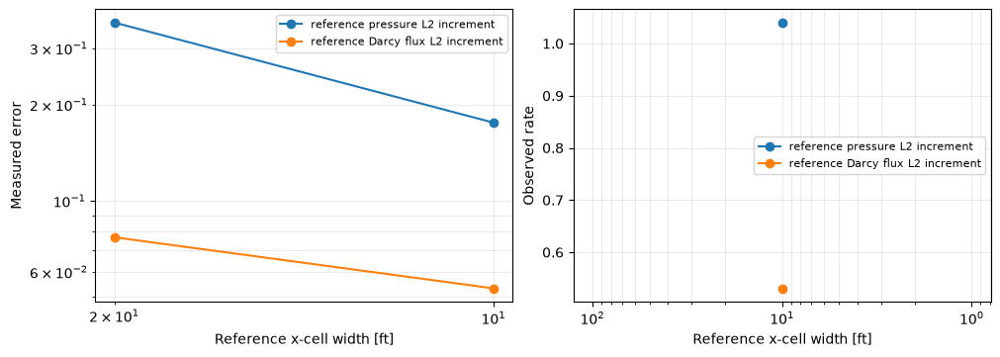
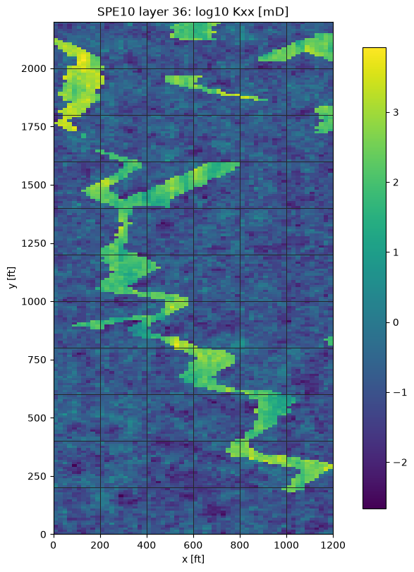
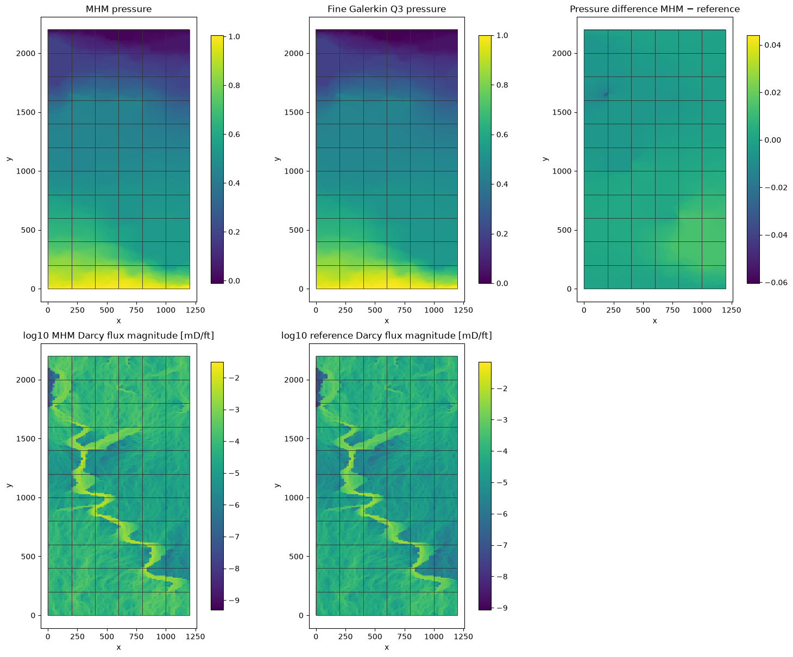
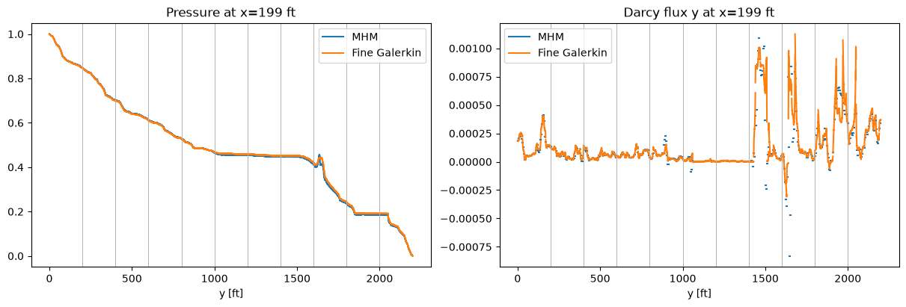

# Darcy on an original SPE10 layer: a small macro mesh and complete material data

Follow the numbered steps: state the variational problem, choose the local and trace spaces, declare the local and global equations, solve, and inspect the physical fields.

The main workflow is **meshes → spaces → local equations → global balance → assemble → solve → fields and errors**. `MeshHierarchy` associates macro and local meshes; `bind_interface` and `LocalContext` own supported numbering, geometric orientation and native coordinate conversions. The mathematical forms, physical trace meaning, local modes and gauge remain explicit in the cells below. Fully manual/custom spaces use the same numerical owners; see the [custom-interface notebook](https://github.com/ipes-lncc/pymhm/blob/main/notebooks/foundations/operators/custom_interface.ipynb).

Build the local/global API explicitly for the complete layer 36 of SPE10 Model 2: all $60\times220$ material pixels are retained, without cropping, smoothing or contrast clipping. MHM uses a $6\times11$ macro grid. The classical reference uses a much finer single conforming grid.

The geometry, layer and Darcy boundary data follow [Paredes, Valentin and Versieux (2024)](https://doi.org/10.1016/j.cam.2023.115415). Their local refinement is not specified; ours is explicit, so this tutorial does not claim a matched discrete reproduction.

Run `pixi run --locked -e introduction jupyter lab` from the repository root. Coefficients, equations, reference assembly, physical evaluation and plotting are all defined below. Fine reference solves may need several minutes and substantial memory.

The primal hybrid construction follows [Harder, Paredes and Valentin (2013)](https://doi.org/10.1016/j.jcp.2013.03.019); the material layer and face-based comparison above follow [Paredes, Valentin and Versieux (2024)](https://doi.org/10.1016/j.cam.2023.115415).


```python
from pathlib import Path
import sys
import hashlib
import json
from dataclasses import dataclass
from functools import partial
from typing import Any, Callable, Sequence, Mapping
import numpy as np
from numpy.typing import NDArray
from scipy import sparse
from matplotlib.collections import LineCollection
import matplotlib.pyplot as plt
import ufl
from pymhm.core.equations import compile_form

ROOT = next(p for p in (Path.cwd(), *Path.cwd().parents)
            if (p / "pyproject.toml").is_file() and (p / "src/pymhm").is_dir())
if str(ROOT) not in sys.path:
    sys.path.insert(0,str(ROOT))

from pymhm import Equation, LocalEquations, MultiscaleProblem, assemble, columns
from pymhm.core.assembly import SolverConfig
from pymhm.execution.cpu import ExecutionConfig
from pymhm.meshes.cartesian import CartesianMacroMesh
from pymhm.fem.traces.interval import FaceSpace, SkeletonSpace
from pymhm.fem.scalar.quadrilateral import (
    qk_space, qk_basis, quadrilateral_quadrature,
    quadrilateral_operators, quadrilateral_trace_coupling)
from pymhm.fem.scalar.operators import boundary_data
from pymhm.linalg.linear import solve_linear
from pymhm.materials.cartesian import CartesianCellField
from pymhm.materials.evaluation import tensor_values, scalar_values
from pymhm.fem.assembly import assemble_element_blocks

Array = NDArray[np.float64]
Evaluator = Callable[[Array], tuple[Array, Array]]
from pymhm import MeshHierarchy, LocalContext, bind_interface, bind_problem
from pymhm.backends.spaces import bind_space

```

## 1. Read the unchanged data and verify provenance

The compact archive preserves the original OPM horizontal entries $K_{xx},K_{yy}$. The acquisition function below verifies SHA256 and returns `CartesianCellField`: it selects a declared side at an interface, without averaging. Provenance identifies the project, revision, source URL and axis convention. Coordinates are feet, permeability is mD, and the prescribed pressure difference is dimensionless.


```python
def load_spe10_layer(root: Path, number: int = 36) -> tuple[CartesianCellField, dict[str, Any]]:
    """Read and verify an unchanged complete horizontal layer from pinned OPM data.

    Coordinates are feet, permeability is mD, axes are x,y. ``number`` is
    one-based; no rescaling, clipping, smoothing or crop is applied.
    """
    folder = root / "examples/results/spe10"
    provenance = json.loads((folder / "dataset.json").read_text())
    layer = next(row for row in provenance["layers"] if row["layer_one_based"] == number)
    path = folder / layer["file"]
    if hashlib.sha256(path.read_bytes()).hexdigest() != layer["sha256"]:
        raise ValueError("SPE10 layer archive does not match its pinned SHA256")
    with np.load(path) as archive:
        horizontal = archive["permeability"][..., :2]
        tensors = np.zeros((*horizontal.shape[:2], 2, 2))
        tensors[..., 0, 0] = horizontal[..., 0]
        tensors[..., 1, 1] = horizontal[..., 1]
        spacing = tuple(archive["spacing"])
    return CartesianCellField(tensors, spacing), {**provenance, "selected_layer": layer}
```


```python
permeability, provenance = load_spe10_layer(ROOT, number=36)
print({"source": provenance["repository"], "revision": provenance["revision"],
       "layer": provenance["selected_layer"], "spacing_ft": permeability.spacing,
       "shape": permeability.values.shape,
       "spectral_contrast": float(permeability.values[...,0,0].max()/permeability.values[...,0,0].min())})
macro = CartesianMacroMesh(6, 11, (0., 1200., 0., 2200.))
pressure_boundary = lambda points: 1 - points[:,1]/2200.
source = 0.
# K in mD, coordinates in ft; pressure difference is dimensionless in this benchmark.
# Darcy flux therefore has the corresponding benchmark units mD/ft.
local_degree, local_refinement, trace_segments = 1, 80, 16
skeleton = SkeletonSpace(macro, tuple(FaceSpace.uniform(1, trace_segments, continuous=True)
                                    for _ in macro.faces))
```

```text
{'source': 'https://github.com/OPM/opm-data', 'revision': 'eaa2261683a97027e057c2bc49612ad1c86390b3', 'layer': {'layer_one_based': 36, 'array_index': 35, 'depth_interval_ft': [70, 72], 'kx_range_md': [0.002163, 8412.63], 'phi_range': [1e-07, 0.4], 'kx_equals_ky': True, 'sha256': 'ffe319ce6c126d338a8ad95e497a0121c87e3d7d3eadafb4021ebbe7d3998512', 'file': 'layer-36.npz'}, 'spacing_ft': (np.float64(20.0), np.float64(10.0)), 'shape': (60, 220, 2, 2), 'spectral_contrast': 3889334.2579750344}
```

## 2. Same material, operator and boundary data


$$
\begin{aligned}
\boldsymbol q&=-K\nabla p,\\
\nabla\cdot\boldsymbol q&=0
\quad\text{in }(0,1200)\times(0,2200),\\
p(x,0)&=1,\qquad p(x,2200)=0,\\
\boldsymbol q\cdot\boldsymbol n&=0
\quad\text{on }x=0\text{ and }x=1200.
\end{aligned}
$$


`pressure_boundary` supplies values only to the horizontal Dirichlet faces. Vertical faces have homogeneous physical no-flow data. Every macroelement measures $200\times200$ ft; material pixels measure $20\times10$ ft. A local refinement divisible by 20 resolves their interfaces.

Our explicitly integrated local grids align with every material pixel boundary. Gauss integration inside these elements therefore integrates each original constant pixel value. Changing the discretization never changes $K$. Our local refinement is 80 in each direction, while the macro grid still has only 66 elements. For this fitted grid, a tensor-valued native DG0 coefficient represents each unchanged pixel exactly. The optional alternative operator shown later also supports exact pixel intersections for nonaligned grids.

## 3. Translate the weak formulation into local and global objects

On each macroelement $T$, pressure uses a continuous $Q_k$ fine space. The skeletal multiplier $\lambda$ is the physical normal Darcy flux in the unique orientation $\boldsymbol n_F$ of face $F$. The normal interface binding derives $s_{TF}=\boldsymbol n_T\cdot\boldsymbol n_F$ from the macroface topology. Write the trace integrals in UFL; `LocalContext` supplies their basis supports and coefficient maps.


$$
\begin{aligned}
a_T(p_T,v)+\langle s_{TF}\lambda,v\rangle_{\partial T}&=(f,v)_T,\\
a_T(p_T,v)&=\int_T K\nabla p_T\cdot\nabla v.
\end{aligned}
$$


| Mathematical term | Code declaration |
| --- | --- |
| Local energy and source | `a=inner(K*grad(p),grad(v))*dx`, `L=f*v*dx` in UFL |
| Oriented normal-flux pairing | `local.trace_pairings(lambda phi, ds: phi*v*ds)` |
| Constant kernel and physical average | `kernel`, `moments` in `LocalEquations` |
| Weak pressure continuity | `local.trace_pairings(lambda phi, ds: -phi*p*ds, axis="rows")` |
| Macroface coordinates | `bind_interface(skeleton, convention="normal")` supplies local/global maps |

Interior faces have zero pressure-jump moments; Dirichlet faces have prescribed pressure moments. With the declared sign $C=-B^T$, the additional global right-hand side is


$$
-\sum_T\langle s_{TF}\mu,p_T\rangle_{\partial T}
=-\langle\mu,p_D\rangle_{\Gamma_D}.
$$


`Equation(0, ...)` stores this additional global term. One constant mode per macroelement gives the compatibility equation imposing **macro conservation**. The plotted raw flux $-K\nabla p_h$ is not an $H(\mathrm{div})$ reconstruction and is not guaranteed to conserve on every fine cell.

The provider below declares the executable UFL weak forms and each coupling sign. `local.native_space` owns the native geometry and coefficient convention, while `local.trace_pairings` binds both interface forms independently. The provider supplies no face DOF indices or nodal permutation. The generic `assemble` operation owns elimination, assembly and reconstruction; no PDE-specific problem constructor is used.


```python
def native_scalar_space(fine: CartesianMacroMesh, degree: int) -> tuple[Any, Any, NDArray[np.int64]]:
    """Bind a user-declared Basix element; PyMHM owns topology and coefficient order."""
    import basix
    import basix.ufl
    element = basix.ufl.element(
        "Lagrange", "quadrilateral", degree,
        lagrange_variant=basix.LagrangeVariant.equispaced, shape=(),
    )
    binding = bind_space(fine, element)
    return binding.mesh, binding.space, binding.mapping


def ufl_coefficient_source(domain: Any, material: CartesianCellField) -> tuple[Any, Any]:
    """Represent unchanged pixel tensors in native DG0 on a pixel-fitted grid."""
    import basix.ufl
    from dolfinx import fem
    tensor_space=fem.functionspace(domain,basix.ufl.element("DG","quadrilateral",0,shape=(2,2)))
    coefficient=fem.Function(tensor_space)
    # DG0 interpolation points are cell interiors, so each fitted cell retains its incident pixel.
    coefficient.interpolate(lambda x: material(x[:2].T).reshape(-1,4).T)
    force=fem.Constant(domain,np.float64(0.))
    return coefficient,force


@dataclass(frozen=True)
class DarcyLocalProvider:
    """Declare primal Qk UFL energy, physical flux coupling and pressure moments."""
    macro: CartesianMacroMesh
    skeleton: SkeletonSpace
    data: object
    degree: int
    refinement: int
    quadrature_order: int

    def __call__(self, local: LocalContext) -> LocalEquations:
        """Declare K grad(p)·grad(v), f v, oriented normal flux and the constant average."""
        cell, fine = local.cell, local.mesh
        ratios=np.asarray(self.data.spacing)/fine.spacing
        assert np.allclose(ratios,np.round(ratios)) and np.all(ratios>=1), \
            "DG0 must represent pixels exactly: local cells must fit material boundaries"
        import basix
        import basix.ufl
        element = basix.ufl.element(
            "Lagrange", "quadrilateral", self.degree,
            lagrange_variant=basix.LagrangeVariant.equispaced,
        )
        binding = local.native_space(element)
        domain, space = binding.mesh, binding.space
        mapping = binding.mapping
        p,v=ufl.TrialFunction(space),ufl.TestFunction(space)
        K,f=ufl_coefficient_source(domain,self.data)
        dx=ufl.Measure("dx",domain=domain,
                       metadata={"quadrature_degree":2*self.quadrature_order-1})
        # These executed UFL forms are the local weak formulation, directly.
        a=ufl.inner(K*ufl.grad(p),ufl.grad(v))*dx
        load=f*v*dx
        local.field("pressure", binding)
        b = local.trace_pairings(lambda phi, ds: phi * v * ds)
        c = local.trace_pairings(lambda phi, ds: -phi * p * ds, axis="rows")
        area=float(fine.areas.sum())
        return local.equations(
            a=a,L=load,b=b,c=c,
            kernel=np.ones((len(mapping),1)),moments=columns((v/area)*dx),
            metadata=(fine,mapping))

```

## 4. Declare global terms and solve MHM

The sidewalls fix the physical normal-flux multiplier to zero. The horizontal pressure boundary contributes the negative right-hand side for $C=-B^T$. One constant mode is retained per macroelement. Prescribed pressure removes the global gauge.

The visible provider and global declaration define the entire formulation. `assemble` and `system.solve()` own the generic condensation, global solution and reconstruction.

### Evaluate pressure in its executed coefficient basis

Before reconstructing fields, define how the x-fastest Qk coefficients represent pressure and physical gradients. The second function selects a macrocell and evaluates its independent local coefficients. This is field evaluation, not another solve; it preserves the distinction between broken pressure and physical Darcy flux.


```python
def evaluate_bound_pressure(
    macro: CartesianMacroMesh, fields: tuple[Any, ...], points: Array
) -> tuple[Array, Array]:
    """Evaluate named pressure and gradient on each owning macrocell, without averaging."""
    coordinates = (points - macro.points[0]) / macro.spacing
    indices = np.clip(np.floor(coordinates).astype(int), 0, [macro.nx - 1, int(macro.ny) - 1])
    owners = indices[:, 1] * macro.nx + indices[:, 0]
    pressure, gradient = np.empty(len(points)), np.empty((len(points), 2))
    for cell in np.unique(owners):
        selected = owners == cell
        pressure[selected], gradient[selected] = fields[cell].values_and_gradient(points[selected])
    return pressure, gradient

# Optional explicit Basix evaluation for classical references and coefficient replay.
def evaluate_qk(
    mesh: CartesianMacroMesh, degree: int, coefficients: Array, points: Array
) -> tuple[Array, Array]:
    """Evaluate x-fastest Qk coefficients as pressure and raw gradient.

    Values at an internal fine-grid interface use the cell on its positive
    side. Passing each macrocell separately retains its independent traces.
    """
    coordinates = (points - mesh.points[0]) / mesh.spacing
    counts = np.asarray([mesh.nx, mesh.ny])
    indices = np.clip(np.floor(coordinates).astype(int), 0, counts - 1)
    reference = np.clip(coordinates - indices, 0, 1)
    width = mesh.nx * degree + 1
    offsets = np.asarray([j * width + i for j in range(degree + 1) for i in range(degree + 1)])
    ids = degree * (indices[:, 1] * width + indices[:, 0])[:, None] + offsets
    basis, gradients = qk_basis(degree, reference)
    local = coefficients[ids]
    return np.einsum("qi,qi->q", basis, local), np.einsum(
        "qi,qia->qa", local, gradients / mesh.spacing
    )

def evaluate_broken_qk(
    macro: CartesianMacroMesh,
    locals_: tuple[CartesianMacroMesh, ...],
    degree: int,
    coefficients: tuple[Array, ...],
    points: Array,
) -> tuple[Array, Array]:
    """Evaluate broken macrocell coefficients without blending their interfaces."""
    coordinates = (points - macro.points[0]) / macro.spacing
    indices = np.clip(np.floor(coordinates).astype(int), 0, [macro.nx - 1, int(macro.ny) - 1])
    owners = indices[:, 1] * macro.nx + indices[:, 0]
    pressure, gradient = np.empty(len(points)), np.empty((len(points), 2))
    for cell in np.unique(owners):
        selected = owners == cell
        pressure[selected], gradient[selected] = evaluate_qk(
            locals_[cell], degree, coefficients[cell], points[selected]
        )
    return pressure, gradient
```


```python
no_flow = {int(face): 0. for face in macro.boundary_faces
           if abs(macro.normals[face,0]) > 0.5}
boundary, fixed = boundary_data(skeleton, pressure_boundary, no_flow, order=5)
provider = DarcyLocalProvider(macro, skeleton, permeability,
                              local_degree, local_refinement, 5)
hierarchy = MeshHierarchy(
    macro, tuple(macro.submesh(cell, local_refinement) for cell in range(len(macro.cells)))
)
interface = bind_interface(skeleton, convention="normal")
problem = bind_problem(
    hierarchy, interface, provider,
    global_equation=lambda global_problem: Equation(0, global_problem.trace_load(-boundary)),
    retained=1, fixed=fixed,
)
system = assemble(problem, execution=ExecutionConfig("serial", native_threads=1))
solution = system.solve()
pressure_fields = solution.field("pressure")
mhm_fields = tuple(field.portable_coefficients for field in pressure_fields)
mhm_evaluator = partial(evaluate_bound_pressure, macro, pressure_fields)
print({"macro_cells": len(macro.cells), "local_refinement": local_refinement,
       "trace_degree": 1, "trace_segments": trace_segments,
       "global_unknowns": system.matrix.shape[0],
       "fixed_trace_coefficients": len(fixed),
       "largest_local_unknowns": max(len(v) for v in solution.fields),
       "original_equations_relative_residual": solution.raw_residual})
# Named fields carry their mesh and executed basis; no index map is needed to evaluate.
pressure_fields = solution.field("pressure")
first_point = macro.points[macro.cells[0]].mean(axis=0, keepdims=True)
print("First macrocell pressure at its center:", pressure_fields[0].evaluate(first_point))

```

```text
{'macro_cells': 66, 'local_refinement': 80, 'trace_degree': 1, 'trace_segments': 16, 'global_unknowns': 2599, 'fixed_trace_coefficients': 374, 'largest_local_unknowns': 6561, 'original_equations_relative_residual': 1.8700433007440573e-15}
First macrocell pressure at its center: [0.90553461]
```

### Optional numerical equivalence after the UFL definition

The main formulation above is the executed UFL weak form. Once its operator and coordinate conventions are explicit, `quadrilateral_operators` provides an alternative assembled representation. The following control verifies equivalence on one local mesh; it does not select the global/local problem or hide its forms. The classical baseline below remains an explicit UFL assembly.


```python
declared=problem.local_provider(0)
fine,mapping=declared.metadata
ufl_a=compile_form(declared.a)
ufl_load=compile_form(declared.L,(len(mapping),))
ready_a,_,ready_load=quadrilateral_operators(fine,local_degree,
    permeability=permeability,source=source,order=provider.quadrature_order)
operator_defect=np.max(np.abs((ufl_a[mapping][:,mapping]-ready_a).data),initial=0.)
load_defect=float(np.max(np.abs(ufl_load[mapping]-ready_load),initial=0.))
print({"UFL_vs_ready_operator_max":float(operator_defect),"UFL_vs_ready_source_max":load_defect})
assert operator_defect<1e-10*max(1.,float(np.max(np.abs(ready_a.data))))
assert load_defect<1e-10*max(1.,float(np.max(np.abs(ready_load))))
```

```text
{'UFL_vs_ready_operator_max': 1.199040866595169e-14, 'UFL_vs_ready_source_max': 0.0}
```

## 5. Conforming Galerkin references and their own uncertainty

There is no analytical solution here. Assemble classical conforming $Q_3$ on three pixel-aligned grids: $60\times220$, $120\times440$ and $240\times880$. Impose $p=1$ and $p=0$ strongly on horizontal boundaries. The sidewalls use the natural zero-flux condition with the same physical Darcy sign.

The fine field is a **numerical reference**, not an exact solution. Measure differences between successive references in pressure, vector flux and flux energy. High contrast and intersecting material interfaces do not inherit smooth-problem rates.

The common integration grid resolves pixels, local element boundaries and reference boundaries. Norms evaluate each executed coefficient basis directly, rather than interpolating archived images. This is an independent classical assembly sharing basis kernels, not execution of an external paper code.


```python
def dirichlet_solve(matrix: Any, load: Array, dofs: NDArray[np.int64], values: Array) -> Array:
    """Lift strong Dirichlet values and solve the remaining classical equations."""
    operator=sparse.csc_matrix(matrix)
    coefficients=np.zeros(len(load))
    coefficients[dofs]=values
    free=np.setdiff1d(np.arange(len(load)),dofs)
    forcing=load[free]-operator[free][:,dofs]@coefficients[dofs]
    coefficients[free]=solve_linear(operator[free][:,free],forcing)
    return coefficients

def grid_quadrature(
    bounds: tuple[float, float, float, float], shape: tuple[int, int], order: int = 5
) -> tuple[Array, Array]:
    """Return Gauss points and physical weights on an explicitly resolved grid.

    The caller chooses a common grid resolving every compared finite-element
    interface and material pixel; the function never infers hidden jumps.
    """
    grid = CartesianMacroMesh(*shape, bounds)
    reference, unit_weights = quadrilateral_quadrature(order)
    origins = grid.points[grid.cells[:, 0]]
    return (origins[:, None] + reference * grid.spacing).reshape(-1, 2), np.tile(
        unit_weights * np.prod(grid.spacing), len(grid.cells)
    )

def physical_errors(
    first: Evaluator,
    second: Evaluator,
    permeability: Any,
    points: Array,
    weights: Array,
    *,
    batch_size: int = 65536,
) -> dict[str, float]:
    """Integrate L2 pressure, L2 physical flux and K-inverse flux-energy differences.

    Fields are evaluated directly in their executed coefficient bases on the
    same quadrature, never through image samples or averaged gradients.
    """
    totals = np.zeros(6)
    for begin in range(0, len(points), batch_size):
        selected = slice(begin, begin + batch_size)
        x, w = points[selected], weights[selected]
        p, grad = first(x)
        pref, gradref = second(x)
        k = tensor_values(permeability, x)
        dq = -np.einsum("qab,qb->qa", k, grad - gradref)
        qref = -np.einsum("qab,qb->qa", k, gradref)
        totals += np.asarray(
            [
                w @ (p - pref) ** 2,
                w @ np.sum(dq**2, axis=1),
                w @ np.einsum("qa,qa->q", dq, np.linalg.solve(k, dq[..., None])[..., 0]),
                w @ pref**2,
                w @ np.sum(qref**2, axis=1),
                w @ np.einsum("qa,qa->q", qref, np.linalg.solve(k, qref[..., None])[..., 0]),
            ]
        )
    values = np.sqrt(totals)
    return dict(
        pressure_L2=float(values[0]),
        flux_L2=float(values[1]),
        flux_energy=float(values[2]),
        pressure_relative=float(values[0] / values[3]),
        flux_relative=float(values[1] / values[4]),
        energy_relative=float(values[2] / values[5]),
    )
```


```python
reference_rows, reference_evaluators, reference_meshes, reference_coefficients = [], [], [], []
for nx, ny in ((60,220), (120,440), (240,880)):
    print(f"Assembling conforming Q3 reference {nx} x {ny}; {(3*nx+1)*(3*ny+1)} coefficients",flush=True)
    fine = CartesianMacroMesh(nx, ny, macro.bounds)
    domain,space,mapping=native_scalar_space(fine,3)
    p,v=ufl.TrialFunction(space),ufl.TestFunction(space)
    K,f=ufl_coefficient_source(domain,permeability)
    dx=ufl.Measure("dx",domain=domain,metadata={"quadrature_degree":7})
    a_cg=compile_form(ufl.inner(K*ufl.grad(p),ufl.grad(v))*dx)
    load_cg=compile_form(f*v*dx)
    _, nodes = qk_space(fine, 3)
    exterior = np.flatnonzero(np.isclose(nodes[:,1],0.) | np.isclose(nodes[:,1],2200.))
    coefficients = dirichlet_solve(a_cg, load_cg, mapping[exterior], pressure_boundary(nodes[exterior]))[mapping]
    reference_evaluators.append(partial(evaluate_qk, fine, 3, coefficients))
    reference_meshes.append(fine);reference_coefficients.append(coefficients)
    reference_rows.append({"shape": (nx,ny), "unknowns": len(nodes)})
reference_rows
```

```text
Assembling conforming Q3 reference 60 x 220; 119641 coefficients
```

```text
Assembling conforming Q3 reference 120 x 440; 476881 coefficients
```

```text
Assembling conforming Q3 reference 240 x 880; 1904161 coefficients
```


```text
[{'shape': (60, 220), 'unknowns': 119641},
 {'shape': (120, 440), 'unknowns': 476881},
 {'shape': (240, 880), 'unknowns': 1904161}]
```


```python
error_points, error_weights = grid_quadrature(macro.bounds, (480,880), order=4)
reference_refinement = [physical_errors(a,b,permeability,error_points,error_weights)
                        for a,b in zip(reference_evaluators[:-1],reference_evaluators[1:])]
reference = reference_evaluators[-1]
comparison = physical_errors(mhm_evaluator, reference, permeability,
                             error_points, error_weights)
print("Reference refinement:", reference_refinement)
print("MHM versus finest conforming reference:", comparison)
# Refinement evidence is a field measurement, not only a linear residual.
assert reference_refinement[-1]["pressure_L2"] < reference_refinement[0]["pressure_L2"]
assert reference_refinement[-1]["flux_L2"] < reference_refinement[0]["flux_L2"]
```

```text
Reference refinement: [{'pressure_L2': 0.36075975492633133, 'flux_L2': 0.07688807776026059, 'flux_energy': 0.023104875710699337, 'pressure_relative': 0.00043936012735082316, 'flux_relative': 0.07769816509694663, 'energy_relative': 0.05943437881778285}, {'pressure_L2': 0.17543128502605765, 'flux_L2': 0.05321939892675533, 'flux_energy': 0.014178452433032068, 'pressure_relative': 0.00021361645648628177, 'flux_relative': 0.05387567022744448, 'energy_relative': 0.03649656316095937}]
MHM versus finest conforming reference: {'pressure_L2': 8.635719145906874, 'flux_L2': 0.15414976910511155, 'flux_energy': 0.06575786952330288, 'pressure_relative': 0.010515409055376635, 'flux_relative': 0.1560506562160459, 'energy_relative': 0.16926644496095555}
```

### Plot the baseline refinement evidence

The plot uses successive **reference differences**, not errors against an exact solution. The observed slope measures how those increments decrease under simultaneous reference refinement; it does not establish the asymptotic error rate of this heterogeneous problem. Pressure and physical flux can settle at different speeds.


```python
def observed_rates(mesh_sizes: Any, errors: Any) -> np.ndarray:
    """Return log(error[i]/error[i+1])/log(H[i]/H[i+1]) without assumed orders."""
    h, e = np.asarray(mesh_sizes, dtype=float), np.asarray(errors, dtype=float)
    if h.ndim != 1 or e.shape != h.shape or len(h) < 2:
        raise ValueError("provide at least two matching refinement levels")
    if np.any(h <= 0) or np.any(np.diff(h) >= 0) or np.any(e <= 0):
        raise ValueError("mesh sizes must decrease and measured errors must be positive")
    return np.log(e[:-1] / e[1:]) / np.log(h[:-1] / h[1:])

def plot_convergence(mesh_sizes: Any, errors: Mapping[str, Any]) -> Any:
    """Plot actual errors and observed successive rates in separate readable axes."""
    import matplotlib.pyplot as plt

    h = np.asarray(mesh_sizes, dtype=float)
    figure, axes = plt.subplots(1, 2, figsize=(10, 3.5), layout="constrained")
    for label, values in errors.items():
        e = np.asarray(values, dtype=float)
        axes[0].loglog(h, e, "o-", label=label)
        axes[1].semilogx(h[1:], observed_rates(h, e), "o-", label=label)
    axes[0].set(xlabel="H", ylabel="Measured error")
    axes[1].set(xlabel="H", ylabel="Observed rate")
    for axis in axes:
        axis.invert_xaxis()
        axis.grid(True, which="both", alpha=0.25)
        axis.legend(fontsize=8)
    return figure
```


```python
figure=plot_convergence([20.,10.],{
    "reference pressure L2 increment":[r["pressure_L2"] for r in reference_refinement],
    "reference Darcy flux L2 increment":[r["flux_L2"] for r in reference_refinement]})
for axis in figure.axes:axis.set_xlabel("Reference x-cell width [ft]")
plt.show()
print("Reference uncertainty/MHM difference ratios:",
      {field:reference_refinement[-1][field]/comparison[field]
       for field in ("pressure_L2","flux_L2","flux_energy")})
```


[](../../assets/tutorials/darcy_spe10_layer/figure_20_0.png)


```text
Reference uncertainty/MHM difference ratios: {'pressure_L2': 0.020314612143125094, 'flux_L2': 0.3452447527862732, 'flux_energy': 0.21561605532258907}
```

## 6. Fields with the actual macro mesh

Relate the permeability channels to the physical flux and compare pressure under identical geometry and boundary data. Each panel retains independent macrocell values. The flux fields are raw $-K\nabla p_h$, not $H(\mathrm{div})$ reconstructions or averaged multipliers.

Permeability pixels are displayed exactly with nearest-neighbor rendering. The flux-magnitude display uses a logarithmic color scale to show channels across the large contrast; the physical field norms above retain the untransformed vector flux.

Each flux panel samples the actual fine elements independently. The tensor is evaluated at the interior of its pixel-fitted element and applied to that element's own gradient at all four corners. Separate vertices preserve both material-interface and finite-element limits, instead of querying a global coefficient at a shared pixel vertex.


```python
def fine_quad_panel(fine: CartesianMacroMesh, degree: int, nodal: Array,
                    material: CartesianCellField, quantity: str) -> tuple[Array,NDArray[np.int64],Array]:
    """Sample each actual fine quadrilateral separately with its incident pixel tensor."""
    corners=np.array([[0.,0.],[1.,0.],[1.,1.],[0.,1.]])
    basis,derivative=qk_basis(degree,corners)
    dofs,_=qk_space(fine,degree)
    coefficients=nodal[dofs]
    if quantity=="pressure":
        values=coefficients@basis.T
    elif quantity=="flux_magnitude":
        gradient=np.einsum("ti,qia->tqa",coefficients,derivative/fine.spacing)
        # Pixel-fitted cells have constant K. Query interiors, never shared material vertices.
        incident_K=material(fine.points[fine.cells].mean(axis=1))
        flux=-np.einsum("tab,tqb->tqa",incident_K,gradient)
        values=np.linalg.norm(flux,axis=2)
    else:
        raise ValueError("quantity must be pressure or physical Darcy flux magnitude")
    points=fine.points[fine.cells].reshape(-1,2)
    offset=4*np.arange(len(fine.cells))
    triangles=np.vstack((offset[:,None]+[0,1,2],offset[:,None]+[0,2,3]))
    return points,triangles,values.reshape(-1)


def broken_quad_panel(system: Any,solution: Any,degree: int,material: CartesianCellField,
                      quantity: str) -> tuple[Array,NDArray[np.int64],Array]:
    """Collect disconnected fine-element panels without merging any interface values."""
    points,triangles,values=[],[],[]
    count=0
    for field in solution.field("pressure"):
        local_points,local_triangles,local_values=fine_quad_panel(
            field.mesh,degree,field.portable_coefficients,material,quantity)
        points.append(local_points);triangles.append(local_triangles+count);values.append(local_values)
        count+=len(local_points)
    return np.vstack(points),np.vstack(triangles),np.concatenate(values)


def plot_field_panels(
    macro_mesh: Any,
    panels: Mapping[str, tuple[np.ndarray, np.ndarray, np.ndarray]],
    *,
    figsize: tuple[float, float] | None = None,
) -> Any:
    """Plot independent nodal scalar panels and their actual macrofaces.

    Each panel supplies physical points, its explicit triangular connectivity
    and values. Duplicate coordinates are retained, so broken one-sided fields
    are never averaged across a macroface. Each field has its own color scale.
    """
    import matplotlib.pyplot as plt
    from matplotlib.tri import Triangulation

    count = len(panels)
    if not count:
        raise ValueError("provide at least one field panel")
    columns = min(3, count)
    rows = (count + columns - 1) // columns
    size = figsize or (4.1 * columns, 3.6 * rows)
    figure, axes = plt.subplots(rows, columns, figsize=size, squeeze=False, layout="constrained")
    for axis, (label, (points, triangles, values)) in zip(axes.flat, panels.items(), strict=False):
        coordinates = np.asarray(points)
        triangulation = Triangulation(*coordinates.T, triangles)
        artist = axis.tripcolor(triangulation, values, shading="gouraud", rasterized=True)
        axis.add_collection(LineCollection(macro_mesh.points[macro_mesh.faces], colors="0.2", linewidths=0.65, zorder=3))
        axis.set(title=label, xlabel="x", ylabel="y", aspect="equal")
        figure.colorbar(artist, ax=axis, shrink=0.87, pad=0.025)
    for axis in list(axes.flat)[count:]:
        axis.set_visible(False)
    return figure
```


```python
fig,axis=plt.subplots(figsize=(6,8),layout="constrained")
artist=axis.imshow(np.log10(permeability.values[...,0,0]).T,origin="lower",
                   extent=macro.bounds,interpolation="nearest",aspect="equal")
axis.add_collection(LineCollection(macro.points[macro.faces],colors="0.15",linewidths=.7))
axis.set(title="SPE10 layer 36: log10 Kxx [mD]",xlabel="x [ft]",ylabel="y [ft]")
fig.colorbar(artist,ax=axis,shrink=.9)
plt.show()
```


[](../../assets/tutorials/darcy_spe10_layer/figure_23_0.png)


```python
mhm_pressure=broken_quad_panel(system,solution,local_degree,permeability,"pressure")
reference_pressure=fine_quad_panel(reference_meshes[-1],3,reference_coefficients[-1],
                                    permeability,"pressure")
pressure_difference=(*mhm_pressure[:2],mhm_pressure[2]-reference(mhm_pressure[0])[0])
mhm_flux=broken_quad_panel(system,solution,local_degree,permeability,"flux_magnitude")
reference_flux=fine_quad_panel(reference_meshes[-1],3,reference_coefficients[-1],
                               permeability,"flux_magnitude")
# Display log10(magnitude expressed in mD/ft); physical norms remain untransformed.
mhm_flux=(*mhm_flux[:2],np.log10(np.maximum(mhm_flux[2],1e-12)))
reference_flux=(*reference_flux[:2],np.log10(np.maximum(reference_flux[2],1e-12)))
panels={"MHM pressure":mhm_pressure,"Fine Galerkin Q3 pressure":reference_pressure,
        "Pressure difference MHM − reference":pressure_difference,
        "log10 MHM Darcy flux magnitude [mD/ft]":mhm_flux,
        "log10 reference Darcy flux magnitude [mD/ft]":reference_flux}
plot_field_panels(macro,panels,figsize=(15,12))
plt.show()
```


[](../../assets/tutorials/darcy_spe10_layer/figure_24_0.png)


## 7. Macro conservation and profiles with both interface limits

The local constant mode gives $\int_{\partial T}s_{TF}\lambda=\int_T f=0$. Integrate the oriented skeletal flux in every macroelement to verify this **macro** balance. This does not prove fine-cell conservation of the raw gradient flux.

Evaluate the $x=199$ ft profile separately on the eleven macro intervals. Preserve both interface limits, and mark macroface crossings with vertical lines.
The profile uses each explicitly selected fine element and its constant incident tensor. It retains both endpoint limits with disconnected line segments, so neither material jumps nor macroface traces are averaged.


```python
def fine_line_profile(fine: CartesianMacroMesh, degree: int, nodal: Array,
                      material: CartesianCellField, x_line: float) -> tuple[Array,Array,Array]:
    """Evaluate disconnected vertical fine-element profiles with each incident K."""
    column=int(np.floor((x_line-fine.points[0,0])/fine.spacing[0]))
    if not 0<=column<fine.nx:
        raise ValueError("the profile must lie inside this mesh in the x direction")
    sample_y=np.linspace(0.,1.,5)
    reference=np.empty((int(fine.ny),len(sample_y),2))
    reference[:,:,0]=(x_line-fine.points[0,0])/fine.spacing[0]-column
    reference[:,:,1]=sample_y
    owners=np.arange(int(fine.ny))*fine.nx+column
    dofs,_=qk_space(fine,degree)
    local=nodal[dofs[owners]]
    basis,derivative=qk_basis(degree,reference.reshape(-1,2))
    basis=basis.reshape(int(fine.ny),len(sample_y),-1)
    derivative=derivative.reshape(int(fine.ny),len(sample_y),-1,2)/fine.spacing
    pressure=np.einsum("tqi,ti->tq",basis,local)
    gradient=np.einsum("tqia,ti->tqa",derivative,local)
    incident_K=material(fine.points[fine.cells[owners]].mean(axis=1))
    flux=-np.einsum("tab,tqb->tqa",incident_K,gradient)
    y=fine.points[0,1]+(np.arange(int(fine.ny))[:,None]+sample_y)*fine.spacing[1]
    # NaN separators preserve both independent limits at every fine interface.
    return tuple(np.pad(values,((0,0),(0,1)),constant_values=np.nan).ravel()
                 for values in (y,pressure,flux[:,:,1]))

macro_balance = []
for cell in range(len(macro.cells)):
    total = 0.
    for side, face in enumerate(macro.cell_faces[cell]):
        t,w = skeleton.faces[face].quadrature(5)
        normal_flux = skeleton.faces[face].evaluate(t) @ solution.trace[skeleton.dofs(int(face))]
        total += macro.signs[cell,side]*macro.lengths[face]*(w@normal_flux)
    macro_balance.append(total)
print("Maximum integrated macro imbalance:", float(np.max(np.abs(macro_balance))))
fig,axes = plt.subplots(1,2,figsize=(12,4),constrained_layout=True)
for row in range(11):
    field = pressure_fields[row*6]
    y,p,qy=fine_line_profile(field.mesh,local_degree,field.portable_coefficients,permeability,199.)
    axes[0].plot(y,p,color="C0",label="MHM" if row==0 else None)
    axes[1].plot(y,qy,color="C0",label="MHM" if row==0 else None)
y,pref,qref=fine_line_profile(reference_meshes[-1],3,
                             reference_coefficients[-1],permeability,199.)
axes[0].plot(y,pref,color="C1",label="Fine Galerkin")
axes[1].plot(y,qref,color="C1",label="Fine Galerkin")
for ax,title in zip(axes,("Pressure at x=199 ft","Darcy flux y at x=199 ft")):
    for y_face in range(200,2200,200): ax.axvline(y_face,color="0.7",lw=.7)
    ax.set_xlabel("y [ft]");ax.set_title(title);ax.legend()
plt.show()

```

```text
Maximum integrated macro imbalance: 1.6522272439090102e-10
```


[](../../assets/tutorials/darcy_spe10_layer/figure_26_1.png)


## 8. What this reference comparison supports

Successive reference differences quantify baseline resolution. Compare them with MHM–reference differences: when baseline uncertainty matters for a field norm, refine the reference further. Pressure often settles before physical flux under this contrast; similar pressure plots do not certify flux accuracy.

For the stated discretizations, the finest reference increment is about 5.4% in physical flux, compared with a 15.6% MHM–reference difference. The flux comparison remains limited by reference resolution: this is a difference against a finite approximation, not the true flux error. Pressure is more settled, with a 0.021% reference increment compared with a 1.05% MHM–reference difference. Further reference refinement is required for more precise flux accuracy.

The method uses 66 macroelements and the declared spaces: local $Q_1$ pressure and a continuous piecewise $P_1$ trace on each macroface. Increase `local_refinement` or `trace_segments` explicitly for further studies, preserving the original material. Do not alter the approximation family solely to fit an image.

Primary data source: [OPM/opm-data, SPE10 Model 2](https://github.com/OPM/opm-data/tree/eaa2261683a97027e057c2bc49612ad1c86390b3/spe10model2). Acquisition prints the exact revision and SHA256. The opening attribution distinguishes the literature problem from a matched reproduction. This notebook executes PyMHM and a separately assembled classical baseline, not an external article implementation.

## References

- Christopher Harder, Diego Paredes, and Frédéric Valentin (2013). *A family of Multiscale Hybrid-Mixed finite element methods for the Darcy equation with rough coefficients*, Journal of Computational Physics 245, 107–130. [DOI: 10.1016/j.jcp.2013.03.019](https://doi.org/10.1016/j.jcp.2013.03.019).

- Diego Paredes, Frédéric Valentin, and Henrique M. Versieux (2024). *Revisiting the robustness of the multiscale hybrid-mixed method: The face-based strategy*, Journal of Computational and Applied Mathematics 436, 115415. [DOI: 10.1016/j.cam.2023.115415](https://doi.org/10.1016/j.cam.2023.115415).

## Reproduce this tutorial

[View the source notebook](https://github.com/ipes-lncc/pymhm/blob/main/notebooks/introduction/darcy_spe10_layer.ipynb) or [download the notebook](https://raw.githubusercontent.com/ipes-lncc/pymhm/main/notebooks/introduction/darcy_spe10_layer.ipynb). Run its cells interactively, or execute the notebook from the repository root with the checked-in Pixi lockfile:

```bash
pixi install --locked -e introduction
pixi run --locked -e introduction notebooks-run introduction/darcy_spe10_layer.ipynb --timeout 3600
```

The runner writes the executed copy to `build/notebooks/introduction/`. The figures and numerical outputs on this page come from that execution. Timings describe the recorded hardware and solver settings; rerun performance examples on an idle machine to measure your own environment.
