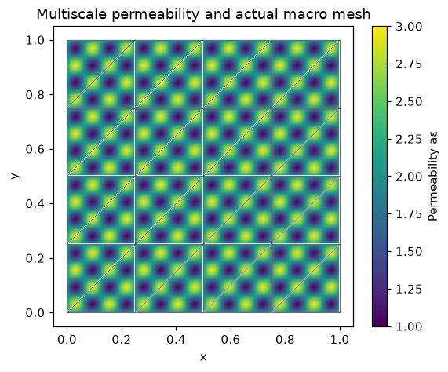
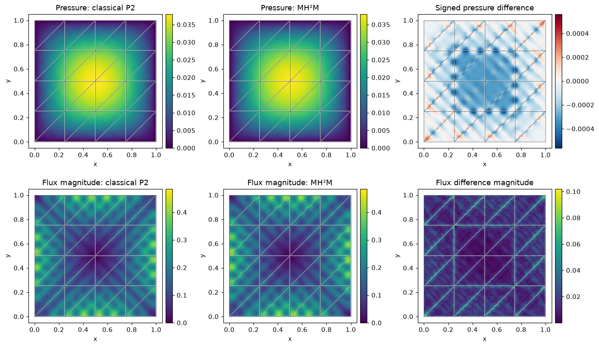
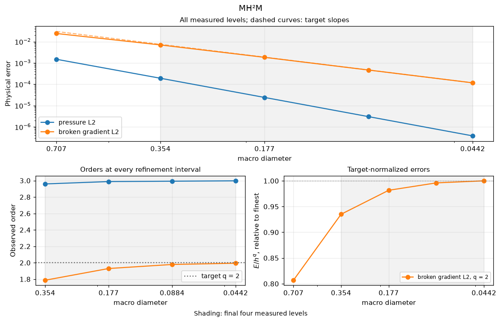

# MH²M with multiscale permeability: pressure, conormal and trace

Follow the numbered steps: state the variational problem, choose the local and trace spaces, declare the local and global equations, solve, and inspect the physical fields.

The main workflow is **meshes → spaces → local equations → global balance → assemble → solve → fields and errors**. `MeshHierarchy` associates macro and local meshes; `bind_interface` and `LocalContext` own supported numbering, geometric orientation and native coordinate conversions. The mathematical forms, physical trace meaning, local modes and gauge remain explicit in the cells below. Fully manual/custom spaces use the same numerical owners; see the [custom-interface notebook](https://github.com/ipes-lncc/pymhm/blob/main/notebooks/foundations/operators/custom_interface.ipynb).

The **Multiscale-Hybrid-Hybrid Method** uses three fields: local pressure, local boundary conormal and a shared global pressure trace. We declare all three equations explicitly and let `LocalEquations` and `MultiscaleProblem` eliminate the local fields.

Our two-dimensional P1/P0/P1 family follows [de Barros, Madureira and Valentin (2026, version 3)](https://arxiv.org/abs/2404.16978v3), equations (7), (28)–(29) and section 6.2. The oscillatory material and meshes below define an original introductory case, not a reproduction of the article's heterogeneous figures.

All problem data, boundary conditions, provider, classical baseline, reconstruction, norms and plots are defined in notebook cells. PyMHM supplies only generic finite-element and algebraic operations. Open the downloaded notebook in a writable directory:

```bash
jupyter lab mh2m_multiscale.ipynb
```

Execution is serial; process workers need importable provider callables.

Field evaluation, norms, plots and executed-array archives use the importable
[supporting scalar helpers](https://github.com/ipes-lncc/pymhm/blob/main/examples/introduction/scalar.py).
The physical data and local/global variational equations remain explicit below.


The PyMHM distribution contains only the library. The first cell explicitly
downloads a checksum-verified companion archive and prepares the declared data
using its local Python helpers. You can inspect these support files in `ROOT`.
Complete studies and historical replay retain their existing opt-in flags.


```python
from pathlib import Path
import os
import sys
from pymhm.io.workspace import workspace_from_archive

# Download verified support files; this operation does not execute them.
COMPANION_URL = "https://ipes-lncc.github.io/pymhm/downloads/f861940e8a825f406a1b107671806ccfd2a6f10c38d32425f4b153a88e0d1ad1/mh2m_multiscale-companion.zip"
COMPANION_SHA256 = "f861940e8a825f406a1b107671806ccfd2a6f10c38d32425f4b153a88e0d1ad1"
WORKSPACE = Path(
    os.environ.get("PYMHM_WORKSPACE", Path.cwd() / ".pymhm-companions" / COMPANION_SHA256)
)
ROOT = workspace_from_archive(COMPANION_URL, sha256=COMPANION_SHA256, directory=WORKSPACE)
os.environ["PYMHM_WORKSPACE"] = str(ROOT)
if str(ROOT) not in sys.path:
    sys.path.insert(0, str(ROOT))

# Explicitly prepare declared data with the downloaded Python helpers.
from scripts.notebook_reproduction import notebook_workspace

ROOT = notebook_workspace("introduction/mh2m_multiscale.ipynb", directory=ROOT)
root = ROOT
print("Workspace:", ROOT)


import numpy as np
import matplotlib.pyplot as plt
from typing import Any
from scipy import sparse
from threadpoolctl import threadpool_limits
from pymhm import Equation, LocalEquations, assemble
from pymhm import MeshHierarchy, LocalContext, bind_interface, bind_problem
from pymhm.core.equations import compile_form
from pymhm.fem.traces.interval import FaceSpace, SkeletonSpace
from examples.introduction.scalar import (
    plot_material,
    plot_reference_differences,
    plot_scalar_comparison,
    executed_array_digest,
    ScalarField,
    archive_cell,
    compare_scalar_fields,
    dirichlet_solve,
    native_scalar_space,
    save_scalar_report,
)
from pymhm.fem.scalar.triangle import nodal_space
from pymhm.meshes.triangle import TriangleMesh
from pymhm.backends.forms import assemble_pairing

plt.rcParams.update({"figure.dpi": 110, "font.size": 10})
from pymhm import solve
from pymhm.fem.traces.pressure_2d import PressureTraceSpace

```

```text
Workspace: ./build/docs-restructure/final-workspaces/provenance-final-mh2m_multiscale-ce2f83522ad1
```

### 1. The physical problem and the conormal sign

Use the same scalar Darcy problem as the MsHHO introduction:


$$
\begin{aligned}
 -\nabla\cdot(a_\varepsilon\nabla p)&=1 &&\text{in }(0,1)^2,\\
 p&=0 &&\text{on its boundary},\\
 a_\varepsilon(x,y)&=2+\sin(2\pi x/\varepsilon)
                           \sin(2\pi y/\varepsilon),
 &\varepsilon&=1/8,\\
 q&=-a_\varepsilon\nabla p,
 &\eta_K&=a_\varepsilon\nabla p\cdot n_K=-q\cdot n_K.
\end{aligned}
$$


The article's **conormal** $\eta_K$ has the opposite sign to physical outward flux. Each macrocell has its private copy on a shared face; pressure trace $\rho$ is global. The coefficient has ellipticity bounds 1 and 3.

Our 32 macrotriangles do not resolve eight oscillations per direction. Each local mesh has 16 subdivisions per macroedge, keeping the material inside assembly and physical flux norms. This is fine local resolution on a simple macro mesh, not replacement of the coefficient by its average.


```python
epsilon = 1 / 8


def permeability(points: np.ndarray) -> np.ndarray:
    """Evaluate aε I through its positive scalar factor, with ε=1/8."""
    phase = 2 * np.pi * points / epsilon
    return 2 + np.sin(phase[:, 0]) * np.sin(phase[:, 1])


macro = TriangleMesh.unit_square(4)
source = 1.0
local_refinement = 16
assembly_order = 8
print(
    {
        "macro_triangles": len(macro.cells),
        "epsilon": epsilon,
        "H_max": float(macro.lengths.max()),
        "h_max": float(macro.lengths.max() / local_refinement),
        "ellipticity_bounds": [1.0, 3.0],
        "source": source,
    }
)

```

```text
{'macro_triangles': 32, 'epsilon': 0.125, 'H_max': 0.3535533905932738, 'h_max': 0.02209708691207961, 'ellipticity_bounds': [1.0, 3.0], 'source': 1.0}
```


```python
fig_material = plot_material(macro, permeability, resolution=64, limits=(1, 3))
plt.show()

```


[](../../assets/tutorials/mh2m_multiscale/figure_4_0.png)


### 2. Choose compatible spaces before assembling operators

Use $k=0$ in the two-dimensional family of section 6.2:


$$
\begin{aligned}
 \Gamma_{H_\Gamma}&=P_1^{\mathrm{C0}}(\text{pressure segments}),\\
 \Lambda_{H_\Lambda}(K)&=P_0^{\mathrm{broken}}(\text{conormal segments}),\\
 V_h(K)&=P_1^{\mathrm{C0}}(\text{local triangles}),\\
 H_\Gamma&\sim H/4,\\
 H_\Lambda&\sim H/8,\\
 h&\sim H/16.
\end{aligned}
$$


Each pressure segment contains **two** conormal segments (M2), and each conormal segment contains **two** local boundary edges (M1). The uniform partitions match between incident macrocells. These mesh conditions accompany the chosen degrees; matrix dimensions alone do not establish compatibility.

`PressureTraceSpace` shares pressure values at macrovertices and numbers interior face nodes. `SkeletonSpace` supplies the broken conormal basis, with a private copy per macrocell. Only `gamma` coordinates are global.


```python
local_degree = 1
gamma_segments, conormal_segments = 4, 8
gamma = PressureTraceSpace.uniform(macro, degree=1, segments=gamma_segments)
conormal = SkeletonSpace(
    macro,
    tuple(FaceSpace.uniform(0, conormal_segments) for _ in macro.faces),
)
assert conormal_segments == 2 * gamma_segments
assert local_refinement == 2 * conormal_segments
pressure_interface = bind_interface(gamma, convention="value")
conormal_interface = bind_interface(conormal, convention="value")
print(
    {
        "global_pressure_trace_coordinates": gamma.size,
        "local_conormal_unknowns_per_macrocell": 3 * conormal_segments,
        "local_P1_nodes_per_macrocell": (local_refinement + 1) * (local_refinement + 2) // 2,
    }
)

```

```text
{'global_pressure_trace_coordinates': 193, 'local_conormal_unknowns_per_macrocell': 24, 'local_P1_nodes_per_macrocell': 153}
```

### 3. Write the three variational equations

For each macrocell $K$,


$$
\begin{aligned}
 (a_\varepsilon\nabla p_K,\nabla v)_K
  -\langle\eta_K,v\rangle_{\partial K}&=(1,v)_K,\\
 -\langle\mu,p_K\rangle_{\partial K}
  +\langle\mu,\rho\rangle_{\partial K}&=0,\\
 \sum_K\langle\eta_K,\xi\rangle_{\partial K}&=0.
\end{aligned}
$$


The second equation matches **trace moments** against P0; it does not impose pointwise equality. The third equation balances conormal against continuous pressure trace tests.

With $A_{ij}=a_K(\phi_j,\phi_i)$, $B_{ij}=\int_{\partial K}\phi_i\mu_j$ and $P_{j\ell}=\int_{\partial K}\mu_j\psi_\ell$,


$$
\begin{aligned}
 \begin{bmatrix}A&-B\\-B^T&0\end{bmatrix}
 \begin{bmatrix}p_K\\\eta_K\end{bmatrix}
 +\begin{bmatrix}0\\P\end{bmatrix}\rho_K
 &=\begin{bmatrix}f_K\\0\end{bmatrix},\\
 \sum_K P^T\eta_K&=0.
\end{aligned}
$$


Write the boundary pairing $B$ as `phi * v * ds` in UFL, selecting the private conormal space as its interface. `local.interface_pairing(conormal_interface)` integrates $P$ on the union of the pressure and conormal partitions and accumulates shared pressure vertices. Both are unsigned local boundary pairings: their mathematical signs are the explicit **$-B$ and $-B^T$** in the saddle. The context owns face ordering and coefficient transport.


### Write the local differential operator in UFL

Define the trial pressure `p` and test pressure `v` on the local Pk space. The UFL expressions below are the executable weak form, mass pairing and source. Changing this expression defines a new local operator; the multiscale contracts do not select a physical model.


$$
a_K(p,v)=\int_K a_\varepsilon\nabla p\cdot\nabla v,
\qquad \ell_K(v)=\int_K v.
$$


`local.native_space` binds the declared fine mesh and equispaced element. The local saddle keeps its native pressure coordinates; `compile_form` assembles the expressions and releases native assembly resources. The same weak form can return portable nodal matrices for the independent classical baseline. The following section declares the two boundary spaces and their pairings.


```python
import basix.ufl
import ufl


def user_volume_forms(
    fine: TriangleMesh,
    degree: int,
    *,
    binding: Any = None,
    portable: bool = True,
) -> tuple[Any, Any, np.ndarray]:
    """Assemble the user weak form in native or declared portable nodal coordinates."""
    if binding is None:
        _, V, order = native_scalar_space(fine, degree)
    else:
        V, order = binding.space, binding.mapping
    p, v = ufl.TrialFunction(V), ufl.TestFunction(V)
    x = ufl.SpatialCoordinate(V.mesh)
    a_epsilon = 2 + ufl.sin(2 * np.pi * x[0] / epsilon) * ufl.sin(2 * np.pi * x[1] / epsilon)
    dx = ufl.Measure("dx", domain=V.mesh, metadata={"quadrature_degree": 2 * assembly_order})
    a = a_epsilon * ufl.inner(ufl.grad(p), ufl.grad(v)) * dx
    mass = p * v * dx
    L = source * v * dx
    A, M, F = compile_form(a), compile_form(mass), compile_form(L)
    if portable:
        return A[order][:, order].tocsc(), M[order][:, order].tocsc(), F[order]
    return A, M, F

```


```python
first_fine = macro.submesh(0, local_refinement)
A_ufl, M_ufl, F_ufl = user_volume_forms(first_fine, local_degree)
print(
    {
        "operator": "user-written UFL",
        "local_nodal_unknowns": A_ufl.shape[0],
        "constant_kernel_relative": float(
            np.linalg.norm(A_ufl @ np.ones(A_ufl.shape[0])) / sparse.linalg.norm(A_ufl)
        ),
    }
)
form_equivalence = {}  # Filled by the optional convenience check at the end.

```

```text
{'operator': 'user-written UFL', 'local_nodal_unknowns': 153, 'constant_kernel_relative': 1.3562500818233753e-16}
```


```python
def local_three_field_equations(local: LocalContext) -> LocalEquations:
    """Declare native pressure/conormal equations and the shared pressure balance."""
    fine = local.mesh
    element = basix.ufl.element(
        "Lagrange",
        "triangle",
        local_degree,
        lagrange_variant=basix.LagrangeVariant.equispaced,
    )
    pressure_space = local.native_space(element)
    stiffness, mass, force = user_volume_forms(
        fine,
        local_degree,
        binding=pressure_space,
        portable=False,
    )
    v = ufl.TestFunction(pressure_space.space)
    boundary_forms = local.trace_pairings(
        lambda phi, ds: phi * v * ds,
        interface=conormal_interface,
    )
    B = assemble_pairing(boundary_forms.forms)
    P = local.interface_pairing(conormal_interface, order=4)

    # These block dimensions express the three-field formulation itself.
    npressure, nconormal = stiffness.shape[0], B.shape[1]
    local_saddle = sparse.bmat([[stiffness, -B], [-B.T, None]], format="csc")
    coupling = np.vstack((np.zeros((npressure, P.shape[1])), P))
    pressure_reconstruction = np.hstack((np.eye(npressure), np.zeros((npressure, nconormal))))
    local.field("pressure", pressure_space, reconstruction=pressure_reconstruction)
    return local.equations(
        a=local_saddle,
        L=np.r_[force, np.zeros(nconormal)],
        b=coupling,
        c=coupling.T,
        metadata={
            "mesh": fine,
            "A": stiffness,
            "F": force,
            "B": B,
            "P": P,
            "pressure_count": npressure,
            "volume_moments": np.asarray(mass.sum(axis=1)).ravel(),
        },
    )

```

### 4. Declare the shared trace equation and recover pressure

The stiffness $A_K$ alone has a constant kernel. For the compatible spaces above, the complete local saddle is invertible: boundary pairings fix the constant and trace moments. We neither invent a kernel for that saddle nor pin an arbitrary pressure node.

The local unknown of `LocalEquations` is $(p_K,\eta_K)$. The coupling `b` is $[0;P]$, and the global balance `c` is its transpose. Generic assembly eliminates both local fields, leaving $\rho$. Dirichlet fixes its exterior nodes, so no global pressure gauge remains.

The article's Neumann maps use a **boundary-mean-zero** decomposition. The full saddle below retains the complete pressure and does not select any nodal or volume-mean complement. It expresses the same three-field equations directly. The field record below associates the pressure coefficients with their executed P1 basis; it contains no formulation or solver.


```python
hierarchy = MeshHierarchy(
    macro, tuple(macro.submesh(cell, local_refinement) for cell in range(len(macro.cells)))
)
problem = bind_problem(
    hierarchy,
    pressure_interface,
    local_three_field_equations,
    global_equation=Equation(0, 0),
    retained=0,
    fixed=lambda global_context: global_context.fix_faces(macro.boundary_faces, 0),
)
with threadpool_limits(1):
    system = assemble(problem)
    solution = solve(system)
pressure_fields = solution.field("pressure")
physical_fields = tuple(
    ScalarField(field.mesh, local_degree, field.portable_coefficients) for field in pressure_fields
)
global_free_unknowns = gamma.size - len(problem.fixed)
conormal_fields = tuple(
    mixed[data["pressure_count"] :]
    for data, mixed in zip(system.local_metadata, solution.fields, strict=True)
)
print({"global_pressure_trace_free": global_free_unknowns, "global_residual": solution.residual})

```

```text
{'global_pressure_trace_free': 129, 'global_residual': 1.1041680519794778e-16}
```

### 5. Check injectivity, trace moments and macro conservation

The constant test $v=1$ gives


$$
-\int_{\partial K}\eta_K=\int_K1=\lvert K\rvert.
$$


Thus physical outward flux $q\cdot n_K=-\eta_K$ conserves on each macrocell. Check this balance, $B^Tp_K=P\rho_K$, the constant stiffness kernel and the original pressure equation. A rank check on $B$ confirms that no conormal mode is invisible on the first cell.

These are execution diagnostics. Uniform stability depends on the compatible spaces and M1/M2 conditions, not merely a small algebraic residual. Raw $-a_\varepsilon\nabla p_h$ need not equal $-\eta_K$ pointwise on a boundary and is not claimed to be an $H(\mathrm{div})$ field on the fine mesh.

The physical reconstruction reads `solution.local_trace(cell)`: the bound space supplies the executed local face coefficients, including any declared basis changes. The value convention used here has no outward-normal sign. The method's reconstruction matrix remains an explicit part of its mathematical definition.


```python
diagnostics = {
    "constant_kernel_relative": 0.0,
    "trace_moment_max": 0.0,
    "macro_conservation_max": 0.0,
    "original_local_relative_residual": 0.0,
}
basis_digests = []
archive = {
    "macro_points": macro.points,
    "macro_cells": macro.cells,
    "pressure_trace": solution.trace,
    "gamma_nodes": gamma.nodes,
}
for cell, (data, field, eta) in enumerate(
    zip(system.local_metadata, physical_fields, conormal_fields, strict=True)
):
    A, F, B, P = data["A"], data["F"], data["B"], data["P"]
    executed_pressure = pressure_fields[cell].coefficients
    rho = solution.local_trace(cell)
    diagnostics["constant_kernel_relative"] = max(
        diagnostics["constant_kernel_relative"],
        float(np.linalg.norm(A @ np.ones(A.shape[0])) / np.linalg.norm(A.data)),
    )
    diagnostics["trace_moment_max"] = max(
        diagnostics["trace_moment_max"],
        float(np.max(abs(B.T @ executed_pressure - P @ rho))),
    )
    diagnostics["macro_conservation_max"] = max(
        diagnostics["macro_conservation_max"],
        float(abs(B.sum(axis=0) @ eta + F.sum())),
    )
    defect = A @ executed_pressure - B @ eta - F
    scale = max(np.linalg.norm(F), np.linalg.norm(A @ executed_pressure), np.linalg.norm(B @ eta))
    diagnostics["original_local_relative_residual"] = max(
        diagnostics["original_local_relative_residual"],
        float(np.linalg.norm(defect) / scale),
    )
    basis_digests.append(executed_array_digest(B, P))
    descriptor = pressure_fields[cell].definition.descriptor
    binding = solution.trace_bindings[cell]
    archive_cell(
        archive,
        cell,
        field,
        executed=pressure_fields[cell],
        trace_binding=binding,
        conormal=eta,
        boundary_pairing=B,
        pressure_trace_pairing=P,
    )
assert np.linalg.matrix_rank(system.local_metadata[0]["B"]) == 3 * conormal_segments
assert max(diagnostics.values()) < 1e-10
print(diagnostics)

```

```text
{'constant_kernel_relative': 2.1836088566646393e-16, 'trace_moment_max': 4.336808689942018e-19, 'macro_conservation_max': 1.0443035325380379e-15, 'original_local_relative_residual': 7.692601965273089e-14}
```

### 6. A classical primal Galerkin baseline, with its own refinement check

On a fine **globally conforming** mesh, the baseline solves the same operator, material, source and boundary conditions:


$$
\begin{aligned}
 p_{\mathrm{CG}}&\in V_{\mathrm{CG}}\subset H_0^1(\Omega),\\
 (a_\varepsilon\nabla p_{\mathrm{CG}},\nabla v)_\Omega
   &=(1,v)_\Omega,\qquad v\in V_{\mathrm{CG}}.
\end{aligned}
$$


Use P2 on 32, 64 and 128 squares per direction, each split into two triangles. Assembly and boundary identification are visible below; `solve_linear` owns the free algebraic solve. This classical global assembly is separate from multiscale condensation. Both use DOLFINx/UFL with the same weak form; their global assembly procedures and boundary spaces are separate.

The finest classical field is a **numerical reference**, not an exact solution. First compare 32→64 and 64→128 in physical norms. The plotted difference rate is a reference-resolution indicator; two consecutive differences do not constitute a rigorous reference-error bound.


```python
references = []
reference_dimensions = []
for resolution in (32, 64, 128):
    fine_global = TriangleMesh.unit_square(resolution)
    A_ref, _, F_ref = user_volume_forms(fine_global, 2)
    _, xy = nodal_space(fine_global, 2)
    boundary = np.flatnonzero(np.any(np.isclose(xy, 0) | np.isclose(xy, 1), axis=1))
    p_ref = dirichlet_solve(A_ref, F_ref, boundary, np.zeros(len(boundary)))
    references.append(ScalarField(fine_global, 2, p_ref))
    reference_dimensions.append(
        {
            "squares_per_direction": resolution,
            "triangles": len(fine_global.cells),
            "free_unknowns": len(p_ref) - len(boundary),
        }
    )
    print(reference_dimensions[-1])
reference = references[-1]

```

```text
{'squares_per_direction': 32, 'triangles': 2048, 'free_unknowns': 3969}
```

```text
{'squares_per_direction': 64, 'triangles': 8192, 'free_unknowns': 16129}
```

```text
{'squares_per_direction': 128, 'triangles': 32768, 'free_unknowns': 65025}
```


```python
reference_refinement = [
    compare_scalar_fields((coarser,), finer, permeability, order=8)
    for coarser, finer in zip(references[:-1], references[1:])
]
for interval, norms in zip(("32 → 64", "64 → 128"), reference_refinement):
    print(interval, norms)

# These rates concern differences between successive reference meshes.
# They are indicators, not exact-solution error rates.
refinement_figure = plot_reference_differences(
    [1 / 64, 1 / 128],
    reference_refinement,
)

plt.show()

# A reference must resolve its own physical fields before serving as a baseline.
assert reference_refinement[-1]["pressure_relative"] < reference_refinement[0]["pressure_relative"]
assert reference_refinement[-1]["flux_relative"] < reference_refinement[0]["flux_relative"]

```

```text
32 → 64 {'pressure_L2': 3.823696684608936e-05, 'flux_L2': 0.0073346478106178165, 'flux_energy': 0.005272480435871399, 'pressure_relative': 0.0018001151790877515, 'flux_relative': 0.03838323140026158, 'energy_relative': 0.03921980440020735}
64 → 128 {'pressure_L2': 3.7669518113256023e-06, 'flux_L2': 0.0021132796164602475, 'flux_energy': 0.0015405697662049793, 'pressure_relative': 0.00017731712073356501, 'flux_relative': 0.011059633117206041, 'energy_relative': 0.011458909837941546}
```


[](../../assets/tutorials/mh2m_multiscale/figure_18_1.png)


### 7. Compare pressure and physical flux on a common fine partition

The reference mesh resolves every local mesh interface in this nested, uniformly refined case. Integrate on its triangles and use its field norms as denominators:


$$
\begin{aligned}
 e_p&=\frac{\lVert p_h-p_{\mathrm{ref}}\rVert_{L^2(\Omega)}}
                {\lVert p_{\mathrm{ref}}\rVert_{L^2(\Omega)}},\\
 e_q&=\frac{\lVert q_h-q_{\mathrm{ref}}\rVert_{L^2(\Omega)}}
                {\lVert q_{\mathrm{ref}}\rVert_{L^2(\Omega)}},\\
 e_E&=\frac{\lVert a_\varepsilon^{-1/2}(q_h-q_{\mathrm{ref}})\rVert_{L^2(\Omega)}}
                {\lVert a_\varepsilon^{-1/2}q_{\mathrm{ref}}\rVert_{L^2(\Omega)}}.
\end{aligned}
$$


The comparison code keeps the coefficient inside flux and energy norms. Quadrature orders 8 and 10 independently check norm integration. At volume quadrature points, evaluate the original coefficients directly; do not compare images or interpolated color maps.

For plotting, sample every fine triangle separately. Duplicate interface points retain separate incident values. Pressure and flux-magnitude panels share scales with their reference panels; each difference has its own colorbar. All panels show the actual macro mesh.


```python
errors_q8 = compare_scalar_fields(physical_fields, reference, permeability, order=8)
errors_q10 = compare_scalar_fields(physical_fields, reference, permeability, order=10)
quadrature_difference = max(
    abs(errors_q8[key] - errors_q10[key]) / max(abs(errors_q10[key]), np.finfo(float).tiny)
    for key in ("pressure_L2", "flux_L2", "flux_energy")
)
print(
    {"physical_relative_errors": errors_q10, "relative_norm_change_q8_q10": quadrature_difference}
)
assert quadrature_difference < 1e-5

figure = plot_scalar_comparison(
    macro,
    physical_fields,
    reference,
    permeability,
    numerical_label="MH²M",
)
plt.show()

```

```text
{'physical_relative_errors': {'pressure_L2': 0.00019495407271239985, 'flux_L2': 0.01944959190409417, 'flux_energy': 0.013412679562910609, 'pressure_relative': 0.009176834899961196, 'flux_relative': 0.10178745352163324, 'energy_relative': 0.0997648332247903}, 'relative_norm_change_q8_q10': 1.9464623390029375e-15}
```


[](../../assets/tutorials/mh2m_multiscale/figure_20_1.png)


### 8. Interpret and archive the experiment

Only the shared pressure trace is solved globally (129 free coordinates). Conormal refinement changes local operators without directly adding global unknowns. Fine coefficient resolution still requires local assembly and factorization work.

Read multiscale differences together with the classical reference-refinement indicator. We do not assign homogeneous-problem macro convergence orders to this oscillatory material study. Such a study must vary $H$, $H_\Gamma$, $H_\Lambda$ and $h$ under the relevant compatibility and regularity hypotheses.

If changing a face partition, preserve M1/M2 or justify a different compatible family. Refining only $\Lambda$ does not necessarily improve a coarse $\Gamma$ approximation. Save complete fields and executed boundary/pressure pairing matrices with their basis digests; never reinterpret archived coefficients using a different trace basis.


## Optional: use a prepared operator for this weak form

For the scalar diffusion form written above, `scalar_operators` provides a
portable Basix assembly convenience. Defining a new physical operator does not
require this function: the main computation already assembles the UFL expression
written by the user. The following check verifies agreement in the same local
finite-element space and basis before substituting this convenience.


```python
from pymhm.fem.scalar.triangle import scalar_operators

A_prepared, M_prepared, F_prepared = scalar_operators(
    first_fine,
    local_degree,
    diffusion=permeability,
    source=source,
    order=assembly_order,
)
form_equivalence = {
    "stiffness_relative": float(
        sparse.linalg.norm(A_ufl - A_prepared) / sparse.linalg.norm(A_prepared)
    ),
    "mass_relative": float(sparse.linalg.norm(M_ufl - M_prepared) / sparse.linalg.norm(M_prepared)),
    "source_relative": float(np.linalg.norm(F_ufl - F_prepared) / np.linalg.norm(F_prepared)),
}
assert max(form_equivalence.values()) < 1e-10
print(form_equivalence)

```

```text
{'stiffness_relative': 2.681979681896503e-16, 'mass_relative': 6.514095339453426e-16, 'source_relative': 4.464810611149017e-16}
```


```python
record = {
    "method": "MH²M",
    "physical_problem": f"-div(aε grad(p))={source:g}, p|boundary=0",
    "source": float(source),
    "epsilon": epsilon,
    "macro_triangles": len(macro.cells),
    "local_refinement": local_refinement,
    "local_degree": local_degree,
    "assembly_order": assembly_order,
    "error_orders": [8, 10],
    "global_free_unknowns": global_free_unknowns,
    "reference_dimensions": reference_dimensions,
    "reference_refinement": reference_refinement,
    "physical_errors": errors_q10,
    "quadrature_relative_difference": quadrature_difference,
    "global_residual": solution.residual,
    "diagnostics": diagnostics,
    "basis_digests": basis_digests,
    "form_equivalence": form_equivalence,
}
print(
    save_scalar_report(
        ROOT,
        "mh2m_multiscale",
        record,
        archive,
        {
            "physical-fields": figure,
            "permeability": fig_material,
            "reference-refinement": refinement_figure,
        },
    )
)

```

```text
./build/docs-restructure/final-workspaces/provenance-final-mh2m_multiscale-ce2f83522ad1/build/introduction/mh2m_multiscale
```

## 9. Verify a compatible smooth three-field family

The heterogeneous teaching problem above is distinct from the smooth rate qualification. On the unit square with identity permeability, use the independently differentiated polynomial data


$$
\begin{aligned}
p(x,y)&=x(x-1)y(y-1),\
f(x,y)&=-2\bigl[x(x-1)+y(y-1)\bigr].
\end{aligned}
$$


Exterior pressure is zero. The three-field declarations remain the equations written above. Choose continuous Gamma P2 on one macroface segment, Lambda P1 on **two segments**, and local P2 pressure with **four subdivisions**. Two Lambda segments per Gamma segment and two fine edges per Lambda segment satisfy M2 and M1 with fixed ratio two. The macro sequence is $n=2,4,8,16,32$.

The compatible estimate of [de Barros, Madureira and Valentin (2026)](https://arxiv.org/abs/2404.16978v3) gives second-order broken gradient for this smooth family. Third-order pressure is observed. The paper's section-8.1 experimental P2/P1/P2 family with one Lambda segment and two local subdivisions is discussed under Remark 16; it is a different discretization, and is not substituted for the M1/M2-compatible family below.

Each current acquisition checks the original local equations, Lambda pressure pairing and free Gamma equations, and integrates the physical fields independently at quadrature orders 10 and 12.

### Recompute every measured order

For successive physical errors $E_{i-1},E_i$ at the actual refinement sizes, compute


$$
r_i=\frac{\log(E_{i-1}/E_i)}{\log(h_{i-1}/h_i)}.
$$


The first code lines read one attributed numerical record. They preserve every level and display the complete error/order table. The plotting helper only measures and plots these errors: it constructs no local or global PDE. Targets below are declared from the stated hypotheses, rather than fitted from the data. The final four measured levels give three consecutive orders and a fitted terminal slope. For each declared target $q$, a nearly constant $E/h^q$ provides a second view of the asymptotic regime.


```python
import json
from IPython.display import Markdown, display
from examples.tutorial_convergence import refinement_series, asymptotic_summary, plot_method_series
refinement_record = ROOT / 'examples/results/tutorial-methods/mh2m-compatible-current.json'
refinement_data = json.loads(refinement_record.read_text(encoding='utf-8'))
refinement_rows = refinement_data['rows']
refinement_error_keys = {'pressure L2': 'pressure_l2', 'broken gradient L2': 'gradient_l2'}
refinement_targets = {'broken gradient L2': 2.0}
refinement_rows = sorted(refinement_rows, key=lambda refinement_row: refinement_row['macro_diameter'], reverse=True)
refinement_sizes = np.asarray([refinement_row['macro_diameter'] for refinement_row in refinement_rows])
refinement_field_errors = {refinement_field: np.asarray([refinement_row[refinement_key] for refinement_row in refinement_rows]) for refinement_field, refinement_key in refinement_error_keys.items()}
refinement_orders = {refinement_field: np.log(refinement_values[:-1] / refinement_values[1:]) / np.log(refinement_sizes[:-1] / refinement_sizes[1:]) for refinement_field, refinement_values in refinement_field_errors.items()}
refinement_header = ['Refinement size'] + [refinement_column for refinement_field in refinement_error_keys for refinement_column in (refinement_field, 'Order')]
refinement_lines = [' | '.join(refinement_header), ' | '.join(['---'] * len(refinement_header))]
for refinement_index, refinement_size in enumerate(refinement_sizes):
    refinement_values = [f'{refinement_size:.6g}']
    for refinement_field in refinement_error_keys:
        refinement_values.extend([f'{refinement_field_errors[refinement_field][refinement_index]:.6e}', '—' if refinement_index == 0 else f'{refinement_orders[refinement_field][refinement_index - 1]:.3f}'])
    refinement_lines.append(' | '.join(refinement_values))
display(Markdown('\n'.join(refinement_lines)))
refinement_series_data = refinement_series(refinement_record, refinement_rows, 'macro_diameter', refinement_error_keys, refinement_targets, method='mh2m', spaces='Gamma P2, one segment; Lambda P1, two segments; local P2/r4; M1=M2=2', rate_provenance='de Barros, Madureira and Valentin (2026): M1/M2-compatible smooth family; gradient order two; pressure order three observed', root=ROOT)
print({'record': refinement_series_data['record'], 'sha256': refinement_series_data['sha256']})
for refinement_field, refinement_summary in asymptotic_summary(refinement_series_data).items():
    print(refinement_field, {'last_three_orders': [round(refinement_order, 3) for refinement_order in refinement_summary['orders']], 'fitted_order': round(refinement_summary['fitted_order'], 3), 'target': refinement_summary['target'], 'normalized_amplitude_ratio': refinement_summary.get('amplitude_ratio')})
plot_method_series(refinement_series_data)
plt.show()

```


Refinement size | pressure L2 | Order | broken gradient L2 | Order
--- | --- | --- | --- | ---
0.707107 | 1.484152e-03 | — | 2.405119e-02 | —
0.353553 | 1.907832e-04 | 2.960 | 6.968576e-03 | 1.787
0.176777 | 2.404196e-05 | 2.988 | 1.828945e-03 | 1.930
0.0883883 | 3.020023e-06 | 2.993 | 4.639316e-04 | 1.979
0.0441942 | 3.782056e-07 | 2.997 | 1.164489e-04 | 1.994


```text
{'record': 'examples/results/tutorial-methods/mh2m-compatible-current.json', 'sha256': '5b8d1d24620542d6fba18a991badfe3b37fa2f28fa497d599e600d3070747556'}
pressure L2 {'last_three_orders': [2.988, 2.993, 2.997], 'fitted_order': 2.993, 'target': None, 'normalized_amplitude_ratio': None}
broken gradient L2 {'last_three_orders': [1.93, 1.979, 1.994], 'fitted_order': 1.969, 'target': 2.0, 'normalized_amplitude_ratio': 1.0694762344273008}
```


[](../../assets/tutorials/mh2m_multiscale/figure_27_2.png)


The upper panel preserves all coarse and fine measurements. Dashed lines show declared target powers anchored at the finest measured error. The shaded interval always contains the final four levels; it does not select points to improve a fitted slope. Read the consecutive orders together with the target-normalized errors and the stated quadrature/local-equation controls. A slope alone does not establish the hypotheses of an error estimate.

## References

- Franklin de Barros, Alexandre L. Madureira, and Frédéric Valentin (2026). *A three-field Multiscale Method*. arXiv preprint, version 3, 5 August 2026; first submitted 25 April 2024. [arXiv: 2404.16978v3](https://arxiv.org/abs/2404.16978v3).

## Reproduce this tutorial

[View the source notebook](https://github.com/ipes-lncc/pymhm/blob/main/notebooks/introduction/mh2m_multiscale.ipynb) or [download the notebook](https://raw.githubusercontent.com/ipes-lncc/pymhm/main/notebooks/introduction/mh2m_multiscale.ipynb), then open it:

```bash
python -m pip install 'pymhm[notebooks,visualization]'
jupyter lab mh2m_multiscale.ipynb
```

The first cell explicitly downloads a SHA256-verified companion archive. Acquisition does not execute its code. The local support files are inspectable in the printed `ROOT` directory; the following helper call prepares only the declared inputs. The library distribution contains only `pymhm`. Notebooks, support code and data are separate downloads. Native UFL forms require the compatible DOLFINx/UFL backend described in the [installation guide](../../installation.md). A clone and Pixi are unnecessary.

For batch execution, extract the same companion, change to its workspace, and use its local runner with the actual downloaded notebook path:

```bash
python -m scripts.run_notebooks /path/to/mh2m_multiscale.ipynb --timeout 7200
```

The runner uses the active Python interpreter and writes an executed copy and receipt under `build/notebooks/introduction/`. Larger data and field archives have [documented download links](../../data.md) and verified checksums.

The displayed figures and numerical outputs correspond to the retained validated execution of notebook SHA256 `471d16e4f4e5bfa14e5933cfa8efce4a41996975b6115477935de8f565bfe953` in the [publication manifest](manifest.json). Current instructions use the separately downloaded local `examples` and `scripts` support modules. Running the current source produces a separate receipt for its actual notebook, support bytes and environment. Timings describe the recorded hardware and solver settings; measure your own environment on an idle machine.
