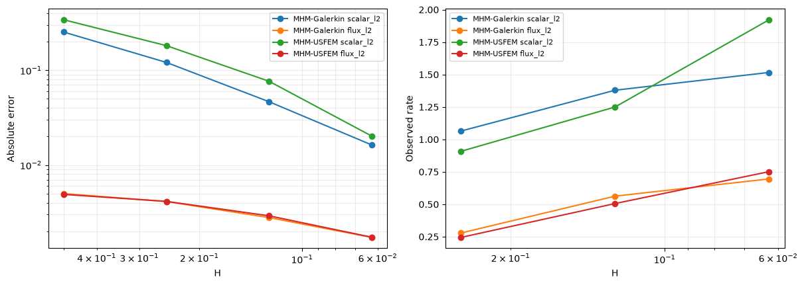
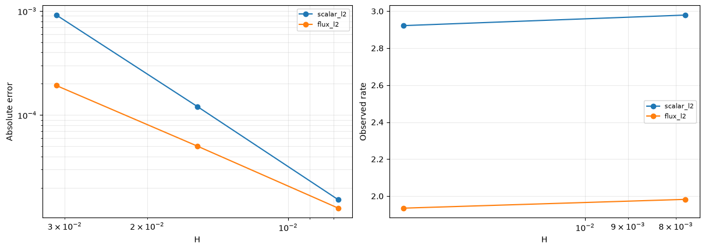
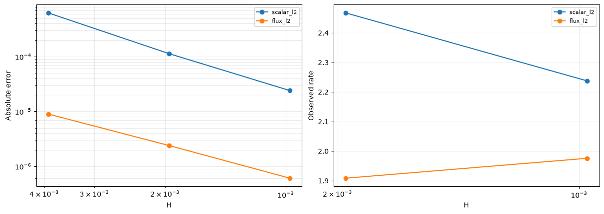
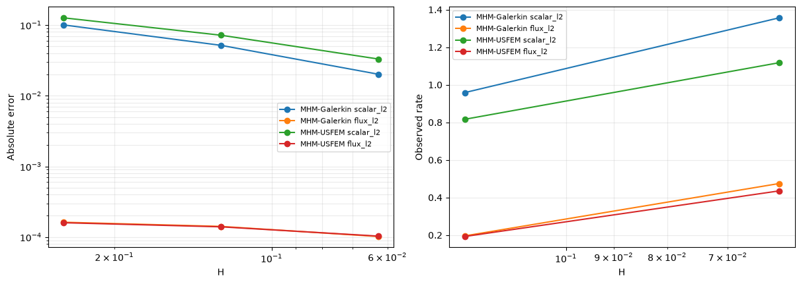
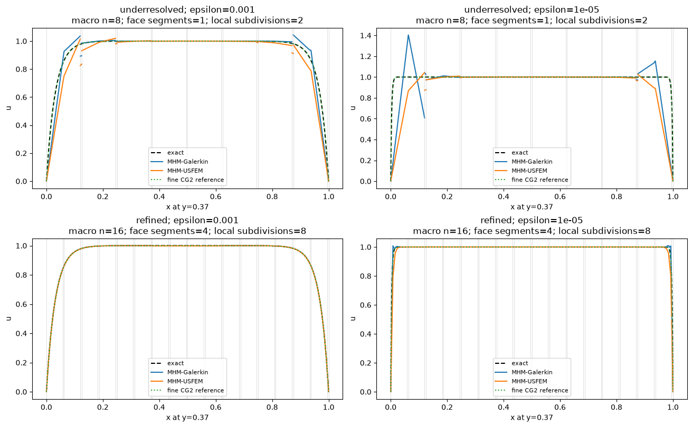

# MHM-USFEM: difficult local reaction–diffusion problems

Follow the numbered steps: state the variational problem, choose the local and trace spaces, declare the local and global equations, solve, and inspect the physical fields.

The main workflow is **meshes → spaces → local equations → global balance → assemble → solve → fields and errors**. `MeshHierarchy` associates macro and local meshes; `bind_interface` and `LocalContext` own supported numbering, geometric orientation and native coordinate conversions. The mathematical forms, physical trace meaning, local modes and gauge remain explicit in the cells below. Fully manual/custom spaces use the same numerical owners; see the [custom-interface notebook](https://github.com/ipes-lncc/pymhm/blob/main/notebooks/foundations/operators/custom_interface.ipynb).

We explicitly construct `Equation`, `LocalEquations` and `MultiscaleProblem`, then connect each code block to the physical formulation. **MHM-USFEM** is the name used here for scalar **MHM-UNUSUAL** of [Santiago, Valentin and Martins (2025), Eqs. (14)–(15), §4.1](https://doi.org/10.55592/cilamce2025.v5i.14270). This is a scalar reaction–diffusion example; the separate Stokes–Brinkman tutorial treats velocity and pressure. Advection is zero here, and the negative residual stabilization is different from SUPG.

Run with the project's locked Pixi `introduction` environment. Exact data, sources, local and global forms, boundary conditions, independent references, norms and plots are all defined below. PyMHM supplies generic UFL compilation, oriented trace integration, condensation and checked linear algebra.

We compare an intentionally underresolved P1/P0 control with a refined P1/P0 family that partitions each macroface and satisfies the paper's red-refinement condition. Both use the same physical equation and the published stabilization parameter. Reduced nodal oscillation can coexist with a larger integrated error; we report both. Our declared SW–NE connectivity, strong exterior Dirichlet enforcement and local meshes do not constitute a reproduction of the paper's historical figures.


```python
from pathlib import Path
import sys

ROOT = next(path for path in (Path.cwd(), *Path.cwd().parents) if (path / "pixi.toml").exists())
sys.path.insert(0, str(ROOT))

import json
import numpy as np
import matplotlib.pyplot as plt
from scipy import sparse
from scipy.linalg import eigvalsh
from pymhm import TriangleMesh, FaceSpace, SkeletonSpace
from pymhm.core.equations import Equation, LocalEquations, compile_form
from pymhm.core.multiscale import MultiscaleProblem, assemble
from pymhm.fem.assembly import assemble_element_blocks
from pymhm.fem.scalar.operators import triangle_quadrature, boundary_data

REPORTS = ROOT / "build/introduction"
REPORTS.mkdir(parents=True, exist_ok=True)
np.set_printoptions(precision=5, suppress=True)
from pymhm.fem.scalar.triangle import nodal_space, tabulate, trace_coupling

from collections.abc import Callable, Sequence
from dataclasses import dataclass
from typing import Any
from pymhm.linalg.linear import solve_linear
from threadpoolctl import threadpool_limits

threadpool_limits(limits=1)
from pymhm import MeshHierarchy, LocalContext, bind_interface, bind_problem
from pymhm.backends.spaces import bind_space

```

## 1. Identify the equation, boundary data and difficult length scale

On the unit square, reaction and source are one and diffusion is a positive constant:


$$
\begin{aligned}
-\epsilon\Delta u+u&=1, & q&=-\epsilon\nabla u,\\
u&=0\quad\text{on }x=0,1, & q\cdot n&=0\quad\text{on }y=0,1.
\end{aligned}
$$


The exact solution has two layers with width of order $\sqrt\epsilon$:


$$
u(x,y)=1-\frac{e^{-x/\sqrt\epsilon}+e^{-(1-x)/\sqrt\epsilon}}{1+e^{-1/\sqrt\epsilon}}.
$$


Differentiating gives $-\epsilon u''+u=1$, independently of the discrete operator. At $\epsilon=10^{-5}$, a coarse uniform local mesh cannot resolve the layer. We measure nodal overshoot above the physical upper bound one, nodal error and integrated errors. The coarse control keeps the same spaces as diffusion decreases; a separate resolution family tests whether the physical fields improve when both the local and trace approximation spaces are refined.


```python
@dataclass(frozen=True)
class ReactionLayer:
    """Equation (22): ``-epsilon*Delta u+u=1`` with vertical zero Dirichlet data.

    Horizontal boundaries carry zero outward physical flux ``-epsilon*grad(u).n``.
    ``epsilon`` is positive and the layer width is its square root. Evaluation
    avoids positive exponential arguments, including in very thin layers.
    """

    epsilon: float

    def __post_init__(self) -> None:
        """Require a finite positive physical diffusion coefficient."""
        if not np.isfinite(self.epsilon) or self.epsilon <= 0:
            raise ValueError("epsilon must be finite and positive")

    def value(self, points: np.ndarray) -> np.ndarray:
        """Evaluate the exact scalar on physical unit-square coordinates."""
        scale = 1 / np.sqrt(self.epsilon)
        x = points[:, 0]
        return 1 - (np.exp(-scale * x) + np.exp(-scale * (1 - x))) / (1 + np.exp(-scale))

    def gradient(self, points: np.ndarray) -> np.ndarray:
        """Evaluate the independently differentiated physical gradient."""
        scale = 1 / np.sqrt(self.epsilon)
        x = points[:, 0]
        derivative = scale * (np.exp(-scale * x) - np.exp(-scale * (1 - x))) / (1 + np.exp(-scale))
        return np.column_stack((derivative, np.zeros(len(points))))
```


```python
EPSILON = 1e-3
LOCAL_DEGREE, LOCAL_SUBDIVISIONS, TRACE_DEGREE = 1, 2, 0
ASSEMBLY_ORDER, ERROR_ORDER = 12, 24
truth = ReactionLayer(EPSILON)

# The independently differentiated equation is -epsilon*u'' + u = 1.
x = np.linspace(0, 1, 101)
points = np.column_stack((x, np.full_like(x, 0.37)))
scale = 1 / np.sqrt(EPSILON)
second = -(scale**2) * (np.exp(-scale * x) + np.exp(-scale * (1 - x))) / (1 + np.exp(-scale))
np.testing.assert_allclose(-EPSILON * second + truth.value(points), 1, atol=2e-15)
np.testing.assert_allclose(truth.gradient(points)[:, 1], 0)

```

## 2. Write the local equations and skeletal balance

Let $B_K$ integrate the globally oriented flux basis against the trace of a local test function. The API expresses


$$
\begin{aligned}
A_Ku_K+B_K\lambda&=F_K,\\
\sum_K C_Ku_K&=0, & C_K&=-B_K^\mathsf T.
\end{aligned}
$$


Summing the $C_Ku_K$ equations imposes continuity of scalar trace moments on internal faces. The normal interface binding supplies the two opposite incident orientations; `b` and `c` are declared independently with UFL boundary forms. On active flux faces, $\lambda=q\cdot n_F$ uses a single global face normal; with zero advection there is no Robin correction to the physical diffusive flux.

The complete strong reaction–diffusion operator is $Lw=w-\epsilon\Delta w$. USFEM changes the local bilinear and linear forms:


$$
\begin{aligned}
a_K(u,v)&=(\epsilon\nabla u,\nabla v)_K+(u,v)_K
 -\sum_{T\subset K}\tau_T(Lu,Lv)_T,\\
\ell_K(v)&=(1,v)_K-\sum_{T\subset K}\tau_T(1,Lv)_T,\\
\tau_T&=\frac{m h_T^2}{\max\{m h_T^2,2\epsilon\}+2\epsilon},\qquad m=\tfrac13.
\end{aligned}
$$


Locals are P1, hence $\Delta v_h=0$ inside each fine triangle and $Lv_h=v_h$. This justifies the published $m=1/3$ for this space. Below we declare the Galerkin form directly in UFL, then add the **negative** residual form and its matching source. `compile_form` actually executes native assembly; the native space binding owns the coefficient convention, while context trace pairings supply the declared UFL interface integrals.

Reaction makes the local operator invertible: constants are not a kernel, and no retained coarse amplitudes are required. On vertical exterior faces, zero scalar data are imposed strongly by removing their nodal coordinates and exterior flux columns. Horizontal exterior faces prescribe zero normal flux. Vertical Dirichlet faces are absent from flux coupling: their zero dummy trace coordinates do not prescribe the physical flux. The global balance is tested on the free internal trace coordinates.

For P1/P0 in two dimensions, Theorem 1 requires one red refinement of a simplicial local mesh that matches the macroface partition. With one P0 segment per macroface, two local subdivisions meet this condition. With four P0 segments per face, we declare a matching uniform four-subdivision mesh and take its red refinement: eight local subdivisions. This condition concerns compatibility of the trace and local spaces; a positive local matrix alone does not establish global stability.


```python
import basix.ufl
import dolfinx
import ufl


def rad_forms(domain: Any, *, epsilon: float, stabilized: bool) -> tuple[Any, Any, Any]:
    """Translate the local reaction–diffusion bilinear form and load into UFL."""
    V = dolfinx.fem.functionspace(domain, basix.ufl.element("Lagrange", "triangle", 1))
    u, v = ufl.TrialFunction(V), ufl.TestFunction(V)
    dx = ufl.Measure("dx", domain=domain, metadata={"quadrature_degree": 8})
    a = (epsilon * ufl.inner(ufl.grad(u), ufl.grad(v)) + u * v) * dx
    L = v * dx
    if stabilized:
        Lu, Lv = u - epsilon * ufl.div(ufl.grad(u)), v - epsilon * ufl.div(ufl.grad(v))
        h = ufl.CellDiameter(domain)
        tau = (h**2 / 3) / (ufl.max_value(h**2 / 3, 2 * epsilon) + 2 * epsilon)
        a -= tau * Lu * Lv * dx
        L -= tau * Lv * dx
    return V, a, L
```

The native mesh and coefficient conversions come from the shared backend binding. The provider below writes the volume and boundary forms, chooses its physical boundary conditions and registers the scalar field. The explicit restriction to free scalar coordinates imposes the declared vertical Dirichlet data; it is part of the formulation.


```python
import basix
import basix.ufl
import dolfinx
import ufl
from mpi4py import MPI


from pymhm.backends.spaces import create_native_mesh, coefficient_map


```

`LocalEquations` now receives the executed forms through the shared native-space binding. `LocalContext` owns the mesh and interface maps. The following provider applies the vertical Dirichlet nodes, keeps the horizontal physical-flux convention, and exposes the two oriented trace blocks directly.


```python
def local_rad(
    local: LocalContext,
    *,
    macro: TriangleMesh,
    skeleton: SkeletonSpace,
    epsilon: float,
    stabilized: bool,
    local_subdivisions: int = LOCAL_SUBDIVISIONS,
) -> LocalEquations:
    """Declare and execute the local scalar UFL form, then apply explicit mixed data."""
    cell, fine = local.cell, local.mesh
    domain = create_native_mesh(fine)
    V, a, L = rad_forms(domain, epsilon=epsilon, stabilized=stabilized)
    # Generic native assembly and coordinate permutation, independent of the PDE.
    binding = local.native_space(V)
    order = binding.mapping
    native_A, native_F = compile_form(a), compile_form(L)
    A, F = native_A[order][:, order], native_F[order]
    _, nodes = nodal_space(fine, 1)
    from pymhm.backends.forms import assemble_pairing
    u, v = ufl.TrialFunction(V), ufl.TestFunction(V)
    pair_b = local.trace_pairings(lambda phi, ds: phi * v * ds)
    pair_c = local.trace_pairings(lambda phi, ds: -phi * u * ds, axis="rows")
    B = assemble_pairing(pair_b.forms, axis="columns")[order]
    C = assemble_pairing(pair_c.forms, axis="rows")[:, order]
    fixed_nodes = np.flatnonzero(
        np.isclose(nodes[:, 0], 0, atol=1e-12) | np.isclose(nodes[:, 0], 1, atol=1e-12)
    )
    free = np.setdiff1d(np.arange(len(nodes)), fixed_nodes)
    local.field("scalar", binding, reconstruction=binding.to_native(np.eye(len(nodes))[:, free]))
    B, C = B[free], C[:, free]
    return local.equations(
        a=A[free][:, free],
        L=F[free],
        b=B,
        c=C,
        metadata={
            "mesh": fine,
            "free": free,
            "nodes": len(nodes),
            "local_subdivisions": local_subdivisions,
        },
    )

```

The primary operator above is the executed UFL form. As a secondary convenience check, `scalar_operators` can assemble its unstabilized part. We compare its restricted matrix and load against our declared Galerkin equation on one representative macrocell; it is not used to define the tutorial's MHM operators.


```python
from pymhm.fem.scalar.triangle import scalar_operators

probe_macro = TriangleMesh.unit_square(2)
probe_skeleton = SkeletonSpace(probe_macro, tuple(FaceSpace.uniform(0) for _ in probe_macro.faces))
probe_problem = bind_problem(
    MeshHierarchy(probe_macro, tuple(probe_macro.submesh(cell, LOCAL_SUBDIVISIONS) for cell in range(len(probe_macro.cells)))),
    bind_interface(probe_skeleton, convention="normal"), lambda local: local_rad(
        local, macro=probe_macro, skeleton=probe_skeleton, epsilon=EPSILON, stabilized=False
    ),
)
probe_equation = probe_problem.local_provider(0)
ready_A, _, ready_F = scalar_operators(
    probe_equation.metadata["mesh"],
    1,
    diffusion=EPSILON,
    reaction=1.0,
    source=1.0,
    order=ASSEMBLY_ORDER,
)
free = probe_equation.metadata["free"]
np.testing.assert_allclose(probe_equation.a.toarray(), ready_A[free][:, free].toarray(), atol=1e-14)
np.testing.assert_allclose(probe_equation.L, ready_F[free], atol=1e-14)
```

## 3. Declare and solve the global problem

`Equation(0,0)` adds zero to the sum of the local balances. Homogeneous boundary data already enter the local restrictions and fixed exterior trace coefficients. `assemble` eliminates each independent local operator; the global solve then reconstructs the local coefficients. No call selects a PDE from a model name.

We measure the broken scalar error and physical flux $-\epsilon\nabla u_h$ against the analytical fields. The following quadrature utility also records nodal extrema, since a small integral error alone can miss oscillations in a thin layer.


```python
def scalar_error_norms(
    meshes: Sequence[TriangleMesh],
    coefficients: Sequence[Any],
    degree: int,
    exact: Callable[[np.ndarray], np.ndarray],
    exact_gradient: Callable[[np.ndarray], np.ndarray],
    diffusion: float,
    *,
    order: int = 20,
) -> dict[str, float]:
    """Integrate broken scalar and raw physical-flux errors over all fine cells.

    ``order`` counts Gaussian points per Duffy coordinate. Flux is
    ``-diffusion*grad(u_h)``; no H(div) reconstruction or interface smoothing
    enters these norms. Nodal extrema and errors are reported separately.
    """
    bary, weights = triangle_quadrature(order)
    totals = np.zeros(3)
    maximum, minimum, nodal = -np.inf, np.inf, 0.0
    for mesh, values in zip(meshes, coefficients, strict=True):
        dofs, nodes, basis, gradient, _ = tabulate(mesh, degree, bary)
        points = np.einsum("qi,tia->tqa", bary, mesh.points[mesh.cells], optimize=True)
        truth = exact(points.reshape(-1, 2)).reshape(points.shape[:2])
        grad_truth = exact_gradient(points.reshape(-1, 2)).reshape(points.shape)
        if hasattr(values, "values_and_gradient"):
            # Explicit cell owners retain independent one-sided fine-cell gradients.
            owners = np.repeat(np.arange(len(mesh.cells)), len(bary))
            numerical, derivative = values.values_and_gradient(points.reshape(-1, 2), cells=owners)
            delta = numerical.reshape(points.shape[:2]) - truth
            grad_delta = derivative.reshape(points.shape) - grad_truth
            values = values.portable_coefficients
        else:
            # The independent classical reference supplies its declared nodal vector.
            delta = values[dofs] @ basis.T - truth
            grad_delta = np.einsum("ti,tqia->tqa", values[dofs], gradient, optimize=True) - grad_truth
        integrands = (delta**2, np.sum(grad_delta**2, axis=-1), truth**2)
        totals += [float(mesh.areas @ (value @ weights)) for value in integrands]
        maximum = max(maximum, float(values.max()))
        minimum = min(minimum, float(values.min()))
        nodal = max(nodal, float(np.max(np.abs(values - exact(nodes)))))
    scalar, derivative, norm = np.sqrt(totals)
    return {
        "scalar_l2": float(scalar),
        "flux_l2": float(diffusion * derivative),
        "gradient_l2": float(derivative),
        "scalar_relative_l2": float(scalar / norm),
        "nodal_error": nodal,
        "nodal_minimum": minimum,
        "nodal_maximum": maximum,
    }
```

### Record the numerical coordinates for reproducibility

The next utility saves the actual local coordinate basis, coefficients, orientation maps and reconstructed fields as each solve finishes. It contains no physical operator. Replaying the saved basis is checked with one and two BLAS threads; this positive-reaction example has no local nullspace modes. You can read the global construction immediately below without studying the archive format first.


```python
import hashlib


def preserve_state(name: str, skeleton: SkeletonSpace, system: Any, solution: Any) -> dict:
    """Archive executed coefficients, orientation, local lifts and actual retained bases."""
    payload = {
        "macro_points": skeleton.mesh.points,
        "macro_cells": skeleton.mesh.cells,
        "macro_faces": skeleton.mesh.faces,
        "macro_signs": skeleton.mesh.signs,
        "trace": solution.trace,
        "skeleton_components": np.array(skeleton.components),
    }
    basis_digest = hashlib.sha256()
    for face, space in enumerate(skeleton.faces):
        payload[f"face_breaks_{face}"] = np.asarray(space.breaks)
        payload[f"face_degrees_{face}"] = np.asarray(space.degrees)
    for cell, (response, data, field, coarse) in enumerate(
        zip(system.responses, system.local_metadata, solution.fields, solution.coarse, strict=True)
    ):
        payload[f"local_points_{cell}"] = data["mesh"].points
        payload[f"local_cells_{cell}"] = data["mesh"].cells
        payload[f"field_{cell}"] = field
        payload[f"coarse_{cell}"] = coarse
        payload[f"source_{cell}"] = response.source
        payload[f"lifts_{cell}"] = response.lifts
        payload[f"basis_{cell}"] = response.retained_basis
        payload[f"trace_dofs_{cell}"] = response.problem.trace_dofs
        if "free" in data:
            payload[f"free_nodes_{cell}"] = data["free"]
        if "velocity_nodes" in data:
            payload[f"velocity_nodes_{cell}"] = np.array(data["velocity_nodes"])
            payload[f"velocity_degree_{cell}"] = np.array(2)
            payload[f"pressure_degree_{cell}"] = np.array(data["pressure_degree"])
        else:
            payload[f"scalar_degree_{cell}"] = np.array(1)
        basis_digest.update(str(response.retained_basis.shape).encode())
        basis_digest.update(response.retained_basis.tobytes())
    path = REPORTS / f"{name}-state.npz"
    np.savez_compressed(path, **payload)
    # Replay this executed basis literally at two BLAS thread counts.
    with np.load(path) as saved:
        for count in (1, 2):
            with threadpool_limits(count):
                for cell in range(len(system.responses)):
                    reconstructed = (
                        saved[f"source_{cell}"]
                        - saved[f"lifts_{cell}"] @ saved["trace"][saved[f"trace_dofs_{cell}"]]
                        + saved[f"basis_{cell}"] @ saved[f"coarse_{cell}"]
                    )
                    np.testing.assert_allclose(
                        reconstructed, saved[f"field_{cell}"], rtol=1e-11, atol=1e-12
                    )
    return {
        "path": str(path.relative_to(ROOT)),
        "sha256": hashlib.sha256(path.read_bytes()).hexdigest(),
        "executed_basis_sha256": basis_digest.hexdigest(),
        "replay_blas_threads": [1, 2],
    }
```


```python
cases = {}
rows, state_archives = [], []
for n in (2, 4, 8, 16):
    macro = TriangleMesh.unit_square(n)
    skeleton = SkeletonSpace(macro, tuple(FaceSpace.uniform(TRACE_DEGREE) for _ in macro.faces))
    for method, stabilized in (("MHM-Galerkin", False), ("MHM-USFEM", True)):
        provider = lambda local, m=macro, s=skeleton, flag=stabilized: local_rad(
            local, macro=m, skeleton=s, epsilon=EPSILON, stabilized=flag
        )
        problem = bind_problem(
                      MeshHierarchy(macro, tuple(macro.submesh(cell, LOCAL_SUBDIVISIONS) for cell in range(len(macro.cells)))),
                      bind_interface(skeleton, convention="normal"), provider,
                      global_equation=Equation(0, 0), retained=0, fixed={
                int(dof): 0.0 for face in macro.boundary_faces for dof in skeleton.dofs(int(face))
            },
                  )
        system = assemble(problem)
        solution = system.solve()
        scalar_fields = solution.field("scalar")
        meshes = tuple(field.mesh for field in scalar_fields)
        fields = tuple(field.portable_coefficients for field in scalar_fields)
        metrics = scalar_error_norms(
            meshes, scalar_fields, 1, truth.value, truth.gradient, EPSILON, order=ERROR_ORDER
        )
        rows.append(
            dict(
                method=method,
                n=n,
                H=1 / n,
                macro_cells=len(macro.cells),
                fine_cells=sum(len(m.cells) for m in meshes),
                trace_dofs=skeleton.size,
                residual=float(solution.residual),
                **metrics,
            )
        )
        state_archives.append(
            preserve_state(
                f"rad-n{n}-{method.lower().replace(' ', '-')}", skeleton, system, solution
            )
        )
        cases[n, method] = (macro, skeleton, meshes, tuple(fields))
rows
```


??? note "Numerical output and provenance"

    ```text
    [{'method': 'MHM-Galerkin',
      'n': 2,
      'H': 0.5,
      'macro_cells': 8,
      'fine_cells': 32,
      'trace_dofs': 16,
      'residual': 2.043158148055947e-18,
      'scalar_l2': 0.25331511823245645,
      'flux_l2': 0.0049922958737293735,
      'gradient_l2': 4.992295873729374,
      'scalar_relative_l2': 0.26625957192826877,
      'nodal_error': 0.37771283714762327,
      'nodal_minimum': 0.0,
      'nodal_maximum': 1.3773441986275734},
     {'method': 'MHM-USFEM',
      'n': 2,
      'H': 0.5,
      'macro_cells': 8,
      'fine_cells': 32,
      'trace_dofs': 16,
      'residual': 1.0314124678157315e-17,
      'scalar_l2': 0.34175259280093,
      'flux_l2': 0.004894176612566581,
      'gradient_l2': 4.89417661256658,
      'scalar_relative_l2': 0.35921621930614284,
      'nodal_error': 0.19714623568561518,
      'nodal_minimum': 0.0,
      'nodal_maximum': 1.1126151697555124},
     {'method': 'MHM-Galerkin',
      'n': 4,
      'H': 0.25,
      'macro_cells': 32,
      'fine_cells': 128,
      'trace_dofs': 56,
      'residual': 2.3581389225557654e-18,
      'scalar_l2': 0.12112741146990827,
      'flux_l2': 0.004115878117983086,
      'gradient_l2': 4.115878117983086,
      'scalar_relative_l2': 0.12731704665633647,
      'nodal_error': 0.25980313859039594,
      'nodal_minimum': 0.0,
      'nodal_maximum': 1.240603178434425},
     {'method': 'MHM-USFEM',
      'n': 4,
      'H': 0.25,
      'macro_cells': 32,
      'fine_cells': 128,
      'trace_dofs': 56,
      'residual': 7.655488364338492e-18,
      'scalar_l2': 0.18208673599128516,
      'flux_l2': 0.004130825618653842,
      'gradient_l2': 4.130825618653842,
      'scalar_relative_l2': 0.19139140497080442,
      'nodal_error': 0.19374192827725978,
      'nodal_minimum': 0.0,
      'nodal_maximum': 1.1294675135664094},
     {'method': 'MHM-Galerkin',
      'n': 8,
      'H': 0.125,
      'macro_cells': 128,
      'fine_cells': 512,
      'trace_dofs': 208,
      'residual': 4.5916800562639076e-18,
      'scalar_l2': 0.04656879012655305,
      'flux_l2': 0.002786462852626926,
      'gradient_l2': 2.786462852626926,
      'scalar_relative_l2': 0.048948464706062345,
      'nodal_error': 0.14438737561256298,
      'nodal_minimum': 0.0,
      'nodal_maximum': 1.125187415456592},
     {'method': 'MHM-USFEM',
      'n': 8,
      'H': 0.125,
      'macro_cells': 128,
      'fine_cells': 512,
      'trace_dofs': 208,
      'residual': 1.1365012103379582e-17,
      'scalar_l2': 0.07656209768491802,
      'flux_l2': 0.002909494311749462,
      'gradient_l2': 2.909494311749462,
      'scalar_relative_l2': 0.08047443633747027,
      'nodal_error': 0.15551401548096855,
      'nodal_minimum': 0.0,
      'nodal_maximum': 1.1010938058504158},
     {'method': 'MHM-Galerkin',
      'n': 16,
      'H': 0.0625,
      'macro_cells': 512,
      'fine_cells': 2048,
      'trace_dofs': 800,
      'residual': 1.1955824945521019e-17,
      'scalar_l2': 0.016280778118692305,
      'flux_l2': 0.0017204001144176615,
      'gradient_l2': 1.7204001144176615,
      'scalar_relative_l2': 0.01711272916827719,
      'nodal_error': 0.15620122915430557,
      'nodal_minimum': 0.0,
      'nodal_maximum': 1.0320779526335582},
     {'method': 'MHM-USFEM',
      'n': 16,
      'H': 0.0625,
      'macro_cells': 512,
      'fine_cells': 2048,
      'trace_dofs': 800,
      'residual': 1.4707313764539898e-17,
      'scalar_l2': 0.020197431303050736,
      'flux_l2': 0.0017279805508186468,
      'gradient_l2': 1.7279805508186468,
      'scalar_relative_l2': 0.02122952412128032,
      'nodal_error': 0.1212762367189939,
      'nodal_minimum': 0.0,
      'nodal_maximum': 1.0296587301268465}]
    ```


## 4. Independently assemble and refine a classical conforming reference

The CG2 reference uses the same diffusion, unit reaction/source and mixed boundary data, with a globally conforming field and no skeleton or stabilization. Its real UFL form is independently assembled by DOLFINx below. We impose zero scalar values strongly on the vertical boundary and leave the horizontal zero-flux condition natural.

The exact solution lets us verify true reference errors on several fine meshes. For the severe $\epsilon=10^{-5}$ challenge, additional meshes have 256, 512 and 1024 divisions in the layer-normal direction and 16 in the invariant direction. This declared anisotropy resolves the physical scale without changing the operator or boundary data. A numerical reference remains a numerical field, even when an exact field is also available.


```python
import basix.ufl
import dolfinx
import ufl
from mpi4py import MPI

reference_rows, references = [], {}
settings = [(EPSILON, n, n) for n in (32, 64, 128)] + [(1e-5, n, 16) for n in (256, 512, 1024)]
for epsilon, nx, ny in settings:
    reference_mesh = TriangleMesh.unit_square(nx, ny)
    domain = create_native_mesh(reference_mesh)
    V = dolfinx.fem.functionspace(domain, basix.ufl.element("Lagrange", "triangle", 2))
    u, v = ufl.TrialFunction(V), ufl.TestFunction(V)
    dx = ufl.Measure("dx", domain=domain, metadata={"quadrature_degree": 20})
    a = (epsilon * ufl.inner(ufl.grad(u), ufl.grad(v)) + u * v) * dx
    L = v * dx
    A, F = compile_form(a), compile_form(L)
    coordinates = V.tabulate_dof_coordinates()[:, :2]
    fixed = np.flatnonzero(
        np.isclose(coordinates[:, 0], 0, atol=1e-12) | np.isclose(coordinates[:, 0], 1, atol=1e-12)
    )
    free = np.setdiff1d(np.arange(len(F)), fixed)
    coefficients = np.zeros(len(F))
    coefficients[free] = solve_linear(A[free][:, free], F[free])
    numerical = dolfinx.fem.Function(V)
    numerical.x.array[:] = coefficients
    x = ufl.SpatialCoordinate(domain)
    exact = 1 - (ufl.exp(-x[0] / np.sqrt(epsilon)) + ufl.exp(-(1 - x[0]) / np.sqrt(epsilon))) / (
        1 + np.exp(-1 / np.sqrt(epsilon))
    )
    difference = numerical - exact
    scalar_l2 = float(np.sqrt(dolfinx.fem.assemble_scalar(dolfinx.fem.form(difference**2 * dx))))
    gradient_l2 = float(
        np.sqrt(
            dolfinx.fem.assemble_scalar(
                dolfinx.fem.form(ufl.inner(ufl.grad(difference), ufl.grad(difference)) * dx)
            )
        )
    )
    _, nodes = nodal_space(reference_mesh, 2)
    nodal = bind_space(reference_mesh, V).to_portable(coefficients)
    reference_rows.append(
        dict(
            epsilon=epsilon,
            nx=nx,
            ny=ny,
            triangles=len(reference_mesh.cells),
            scalar_l2=scalar_l2,
            flux_l2=epsilon * gradient_l2,
            gradient_l2=gradient_l2,
            nodal_error=float(np.max(abs(nodal - ReactionLayer(epsilon).value(nodes)))),
        )
    )
    reference_state = REPORTS / f"rad-reference-eps{epsilon:g}-{nx}x{ny}-state.npz"
    np.savez_compressed(
        reference_state,
        points=reference_mesh.points,
        cells=reference_mesh.cells,
        scalar_coefficients=nodal,
        scalar_degree=np.array(2),
        epsilon=np.array(epsilon),
    )
    state_archives.append(
        {
            "path": str(reference_state.relative_to(ROOT)),
            "sha256": hashlib.sha256(reference_state.read_bytes()).hexdigest(),
            "basis_convention": "Basix canonical equispaced P2 nodal coefficients",
        }
    )
    references[epsilon, nx] = (reference_mesh, nodal)
    print("CG2 reference", epsilon, (nx, ny), scalar_l2, epsilon * gradient_l2)
```

```text
CG2 reference 0.001 (32, 32) 0.0009161727594715088 0.0001923129555579351
```

```text
CG2 reference 0.001 (64, 64) 0.00012088991109419018 5.030106568132461e-05
```

```text
CG2 reference 0.001 (128, 128) 1.5333382111264132e-05 1.2730634497972802e-05
```

```text
CG2 reference 1e-05 (256, 16) 0.0006259597016897307 8.965065539454321e-06
```

```text
CG2 reference 1e-05 (512, 16) 0.00011317367584808531 2.388011757956421e-06
```

```text
CG2 reference 1e-05 (1024, 16) 2.400002563838651e-05 6.071295005724848e-07
```

## 5. Inspect fields and observed convergence rates

Every spatial panel highlights the **actual MHM macro mesh**, including analytical and reference panels. Flux means the raw physical field $-\epsilon\nabla u_h$; the skeletal solve does not make it an H(div) reconstruction.

The sequence keeps P1 locals, P0 faces and two local subdivisions per macro edge, varying only the macro mesh. Reported rates are measured from this layer problem; smooth-problem orders are not assumed. Reference errors are measured separately against the exact solution.

For two successive resolutions, the measured slope is $r=\log(e_1/e_2)/\log(H_1/H_2)$. These small plotting utilities compute that quantity directly and keep error and rate axes separate.


```python
def rates(H: np.ndarray, errors: np.ndarray) -> np.ndarray:
    """Compute successive measured slopes without imposing a theoretical order."""
    return np.log(errors[:-1] / errors[1:]) / np.log(H[:-1] / H[1:])


def plot_errors(H: np.ndarray, errors: dict, name: str) -> None:
    """Show measured norms and successive rates in separate axes."""
    fig, axes = plt.subplots(1, 2, figsize=(12, 4.2), layout="constrained")
    for label, error in errors.items():
        axes[0].loglog(H, error, "o-", label=label)
        axes[1].semilogx(H[1:], rates(H, error), "o-", label=label)
    axes[0].set(xlabel="H", ylabel="Absolute error")
    axes[1].set(xlabel="H", ylabel="Observed rate")
    for ax in axes:
        ax.invert_xaxis()
        ax.grid(True, which="both", alpha=0.25)
        ax.legend(fontsize=8)
    fig.savefig(REPORTS / f"{name}.png", dpi=160)
    plt.show()
```

The display utility evaluates each local polynomial independently, including its one-sided boundary values. Every panel overlays the actual macro mesh and has its own color scale. It changes only the display sampling.


```python
from matplotlib.collections import LineCollection
from matplotlib.tri import Triangulation


def display_samples(
    meshes: Sequence[TriangleMesh], fields: Sequence[np.ndarray], degree: int, subdivisions: int = 2
) -> dict:
    """Evaluate Basix polynomials without merging any incident macro traces."""
    template = TriangleMesh(
        np.array([[0.0, 0.0], [1.0, 0.0], [0.0, 1.0]]), np.array([[0, 1, 2]])
    ).submesh(0, subdivisions)
    bary = np.column_stack((1 - template.points.sum(axis=1), template.points))
    points, cells, values, derivatives = [], [], [], []
    offset = 0
    for mesh, field in zip(meshes, fields, strict=True):
        dofs, _, phi, gradients, _ = tabulate(mesh, degree, bary)
        coordinates = np.einsum("qi,tia->tqa", bary, mesh.points[mesh.cells])
        value = np.einsum("qi,ti...->tq...", phi, field[dofs])
        gradient = np.einsum("tqia,ti...->tq...a", gradients, field[dofs])
        points.append(coordinates.reshape(-1, 2))
        cells.append(
            (
                template.cells[None]
                + offset
                + np.arange(len(mesh.cells))[:, None, None] * len(bary)
            ).reshape(-1, 3)
        )
        values.append(value.reshape((-1, *value.shape[2:])))
        derivatives.append(gradient.reshape((-1, *gradient.shape[2:])))
        offset += len(mesh.cells) * len(bary)
    return dict(
        points=np.concatenate(points),
        cells=np.concatenate(cells),
        values=np.concatenate(values),
        gradient=np.concatenate(derivatives),
    )


def plot_fields(macro: TriangleMesh, panels: dict, name: str) -> None:
    """Show separate one-sided display arrays and each actual macroface."""
    columns = min(3, len(panels))
    rows = (len(panels) + columns - 1) // columns
    fig, axes = plt.subplots(
        rows, columns, figsize=(4.3 * columns, 3.7 * rows), squeeze=False, layout="constrained"
    )
    for ax, (label, data) in zip(axes.flat, panels.items(), strict=False):
        points, cells, values = data
        artist = ax.tripcolor(
            Triangulation(*points.T, cells), values, shading="gouraud", rasterized=True
        )
        ax.add_collection(
            LineCollection(macro.points[macro.faces], colors=".25", linewidths=0.35, alpha=0.7)
        )
        ax.set(title=label, xlabel="x", ylabel="y", aspect="equal")
        fig.colorbar(artist, ax=ax, shrink=0.85, pad=0.025)
    for ax in list(axes.flat)[len(panels) :]:
        ax.set_visible(False)
    fig.savefig(REPORTS / f"{name}.png", dpi=160)
    plt.show()
```


```python
macro, skeleton, meshes, fields = cases[16, "MHM-USFEM"]
data_us = display_samples(meshes, fields, 1, subdivisions=3)
data_gal = display_samples(
    cases[16, "MHM-Galerkin"][2], cases[16, "MHM-Galerkin"][3], 1, subdivisions=3
)
ref_mesh, ref_values = references[EPSILON, 128]
data_ref = display_samples((ref_mesh,), (ref_values,), 2, subdivisions=1)
plot_fields(
    macro,
    {
        "u exact": (data_ref["points"], data_ref["cells"], truth.value(data_ref["points"])),
        "u MHM-Galerkin": (data_gal["points"], data_gal["cells"], data_gal["values"]),
        "u MHM-USFEM": (data_us["points"], data_us["cells"], data_us["values"]),
        "u CG2 reference": (data_ref["points"], data_ref["cells"], data_ref["values"]),
        "error MHM-USFEM": (
            data_us["points"],
            data_us["cells"],
            data_us["values"] - truth.value(data_us["points"]),
        ),
        "flux magnitude MHM-USFEM": (
            data_us["points"],
            data_us["cells"],
            EPSILON * np.linalg.norm(data_us["gradient"], axis=1),
        ),
    },
    "rad-fields",
)
H = np.array([1 / n for n in (2, 4, 8, 16)])
errors = {
    f"{method} {norm}": np.array([r[norm] for r in rows if r["method"] == method])
    for method in ("MHM-Galerkin", "MHM-USFEM")
    for norm in ("scalar_l2", "flux_l2")
}
plot_errors(H, errors, "rad-convergence")
for name, values in errors.items():
    print(name, "rates:", rates(H, values))
for epsilon in (EPSILON, 1e-5):
    selected = [r for r in reference_rows if r["epsilon"] == epsilon]
    plot_errors(
        np.array([1 / r["nx"] for r in selected]),
        {name: np.array([r[name] for r in selected]) for name in ("scalar_l2", "flux_l2")},
        f"rad-reference-eps{epsilon:g}",
    )

```


[](../../assets/tutorials/mhm_usfem_rad/figure_26_0.png)


[](../../assets/tutorials/mhm_usfem_rad/figure_26_1.png)


```text
MHM-Galerkin scalar_l2 rates: [1.06441 1.37909 1.51619]
MHM-Galerkin flux_l2 rates: [0.2785  0.56277 0.69569]
MHM-USFEM scalar_l2 rates: [0.90833 1.24992 1.92246]
MHM-USFEM flux_l2 rates: [0.24464 0.50566 0.75168]
```


[](../../assets/tutorials/mhm_usfem_rad/figure_26_3.png)


[](../../assets/tutorials/mhm_usfem_rad/figure_26_4.png)


## 6. Preserve a deliberately underresolved control

Fix the macro mesh at $n=8$, with one P0 segment per macroface and two local subdivisions. Both methods use the same scalar PDE and approximation spaces. Decreasing $\epsilon$ makes the physical layer thinner without increasing resolution. This control demonstrates the approximation limits of these spaces.

For constant diffusion and P1 locals, the elementwise Laplacian vanishes. On the uniform fine mesh, write $\eta=1-\tau$. The stabilized matrix and source reduce exactly to


$$
A_{\mathrm{US}}=\epsilon K+\eta M,
\qquad F_{\mathrm{US}}=\eta F.
$$


Here $K$ and $M$ are the ordinary P1 stiffness and mass matrices. In the reaction-dominated branch, dividing by $\eta$ exposes the discrete diffusion scale


$$
\epsilon_{\mathrm{effective}}
=\frac{\epsilon}{1-\tau}
=\epsilon+\frac{h_T^2}{6}.
$$


This identity explains why the underresolved stabilized profile can have a broader transition. It does not change the physical diffusion or justify changing the method parameter. For this control, $h_T=\sqrt{2}/16\approx0.0884$, whereas the physical layer width at $\epsilon=10^{-5}$ is $\sqrt{\epsilon}\approx0.00316$.

The tables keep overshoot, nodal error, scalar L2 and physical-flux L2 visible. USFEM need not improve every measure or preserve nodal bounds. The profiles retain independent one-sided values at every macroface intersection.


```python
sweep, challenging = [], {}
n = 8
macro = TriangleMesh.unit_square(n)
skeleton = SkeletonSpace(macro, tuple(FaceSpace.uniform(0) for _ in macro.faces))
for epsilon in (1e-2, 1e-3, 1e-5):
    exact = ReactionLayer(epsilon)
    for method, stabilized in (("MHM-Galerkin", False), ("MHM-USFEM", True)):
        provider = lambda local, e=epsilon, flag=stabilized: local_rad(
            local, macro=macro, skeleton=skeleton, epsilon=e, stabilized=flag
        )
        problem = bind_problem(
                      MeshHierarchy(macro, tuple(macro.submesh(cell, LOCAL_SUBDIVISIONS) for cell in range(len(macro.cells)))),
                      bind_interface(skeleton, convention="normal"), provider,
                      global_equation=Equation(0, 0), retained=0, fixed={int(d): 0.0 for f in macro.boundary_faces for d in skeleton.dofs(int(f))},
                  )
        system = assemble(problem)
        solution = system.solve()
        scalar_fields = solution.field("scalar")
        meshes = tuple(field.mesh for field in scalar_fields)
        fields = tuple(field.portable_coefficients for field in scalar_fields)
        metrics = scalar_error_norms(
            meshes, fields, 1, exact.value, exact.gradient, epsilon, order=40
        )
        sweep.append(
            dict(
                epsilon=epsilon,
                method=method,
                overshoot=max(0.0, metrics["nodal_maximum"] - 1),
                **metrics,
            )
        )
        state_archives.append(
            preserve_state(f"rad-eps{epsilon:g}-{method.lower()}", skeleton, system, solution)
        )
        challenging[epsilon, method] = (tuple(meshes), tuple(fields))
sweep
```


??? note "Numerical output and provenance"

    ```text
    [{'epsilon': 0.01,
      'method': 'MHM-Galerkin',
      'overshoot': 0.0,
      'scalar_l2': 0.015727506798012398,
      'flux_l2': 0.006979403304451645,
      'gradient_l2': 0.6979403304451645,
      'scalar_relative_l2': 0.018796381471541435,
      'nodal_error': 0.10172873787639769,
      'nodal_minimum': 0.0,
      'nodal_maximum': 0.9937189825987042},
     {'epsilon': 0.01,
      'method': 'MHM-USFEM',
      'overshoot': 0.0,
      'scalar_l2': 0.01684209049020335,
      'flux_l2': 0.006964009814822497,
      'gradient_l2': 0.6964009814822497,
      'scalar_relative_l2': 0.02012845148934158,
      'nodal_error': 0.08559220444620463,
      'nodal_minimum': 0.0,
      'nodal_maximum': 0.9909556114252319},
     {'epsilon': 0.001,
      'method': 'MHM-Galerkin',
      'overshoot': 0.12518741545659196,
      'scalar_l2': 0.046568790126552975,
      'flux_l2': 0.0027864628526269347,
      'gradient_l2': 2.7864628526269346,
      'scalar_relative_l2': 0.04894846470606227,
      'nodal_error': 0.14438737561256298,
      'nodal_minimum': 0.0,
      'nodal_maximum': 1.125187415456592},
     {'epsilon': 0.001,
      'method': 'MHM-USFEM',
      'overshoot': 0.10109380585041583,
      'scalar_l2': 0.07656209768491792,
      'flux_l2': 0.0029094943117494707,
      'gradient_l2': 2.9094943117494707,
      'scalar_relative_l2': 0.08047443633747016,
      'nodal_error': 0.15551401548096855,
      'nodal_minimum': 0.0,
      'nodal_maximum': 1.1010938058504158},
     {'epsilon': 1e-05,
      'method': 'MHM-Galerkin',
      'overshoot': 0.4291224985130555,
      'scalar_l2': 0.16028915457590862,
      'flux_l2': 0.00017088075366392442,
      'gradient_l2': 17.08807536639244,
      'scalar_relative_l2': 0.1610549256798726,
      'nodal_error': 0.46175828742208314,
      'nodal_minimum': 0.0,
      'nodal_maximum': 1.4291224985130555},
     {'epsilon': 1e-05,
      'method': 'MHM-USFEM',
      'overshoot': 0.13255967904081012,
      'scalar_l2': 0.1993607741408251,
      'flux_l2': 0.0001690370709830444,
      'gradient_l2': 16.903707098304437,
      'scalar_relative_l2': 0.2003132073887566,
      'nodal_error': 0.17865926802559684,
      'nodal_minimum': 0.0,
      'nodal_maximum': 1.1325596790408101}]
    ```


```python
severe = 1e-5
ug = display_samples(*challenging[severe, "MHM-Galerkin"], 1, subdivisions=3)
uu = display_samples(*challenging[severe, "MHM-USFEM"], 1, subdivisions=3)
rmesh, rvalues = references[severe, 1024]
ur = display_samples((rmesh,), (rvalues,), 2, subdivisions=1)
plot_fields(
    macro,
    {
        "severe layer: u exact": (
            ur["points"],
            ur["cells"],
            ReactionLayer(severe).value(ur["points"]),
        ),
        "severe layer: MHM-Galerkin": (ug["points"], ug["cells"], ug["values"]),
        "severe layer: MHM-USFEM": (uu["points"], uu["cells"], uu["values"]),
        "severe layer: CG2 reference": (ur["points"], ur["cells"], ur["values"]),
        "severe layer: Galerkin scalar error": (
            ug["points"],
            ug["cells"],
            ug["values"] - ReactionLayer(severe).value(ug["points"]),
        ),
        "severe layer: USFEM scalar error": (
            uu["points"],
            uu["cells"],
            uu["values"] - ReactionLayer(severe).value(uu["points"]),
        ),
    },
    "rad-severe-fields",
)
for row in sweep:
    if row["epsilon"] == severe:
        print(
            row["method"],
            "overshoot =",
            row["overshoot"],
            "maximum nodal error =",
            row["nodal_error"],
            "scalar L2 =",
            row["scalar_l2"],
        )

```


[](../../assets/tutorials/mhm_usfem_rad/figure_29_0.png)


```text
MHM-Galerkin overshoot = 0.4291224985130555 maximum nodal error = 0.46175828742208314 scalar L2 = 0.16028915457590862
MHM-USFEM overshoot = 0.13255967904081012 maximum nodal error = 0.17865926802559684 scalar L2 = 0.1993607741408251
```

## 7. Refine the local and trace spaces together

Keep P1 local polynomials and P0 on **each face segment**, but use four equal segments per macroface and eight local subdivisions. The eight-subdivision mesh is one red refinement of the matching four-subdivision mesh. We vary macro divisions through $n=4,8,16$ for $\epsilon=10^{-5}$ and also compute $\epsilon=10^{-3}$ at $n=16$ for the profile comparison.

The finest case has 512 macrotriangles and four P0 segments per face, as reported for the paper's analytical comparison. The paper states $\bar H=H/4$ and $h=\bar H$, but does not specify the historical matching triangulation and connectivity sufficiently to recover the local meshes. Our uniform red-refined realization is declared here. Moreover, the paper's continuous hybrid formulation imposes Dirichlet trace moments weakly; this tutorial imposes the exterior data strongly on local nodes. These are material differences when interpreting the discrete results. We compare the same analytical PDE and an admissible discretization; we do not claim a matched reproduction of Fig. 2.

The global equation is still the sum of local scalar-trace balances. Only the geometry and the number of face segments change below; the UFL forms, stabilization sign, source and boundary convention remain those already defined.


```python
resolved_cases: dict[tuple[float, int, str], tuple[Any, ...]] = {}
resolved_rows: list[dict[str, Any]] = []
FACE_SUBDIVISIONS, RESOLVED_LOCAL_SUBDIVISIONS = 4, 8
for epsilon, resolutions in ((1e-5, (4, 8, 16)), (1e-3, (16,))):
    exact = ReactionLayer(epsilon)
    for resolution in resolutions:
        refined_macro = TriangleMesh.unit_square(resolution)
        refined_skeleton = SkeletonSpace(
            refined_macro,
            tuple(FaceSpace.uniform(0, FACE_SUBDIVISIONS) for _ in refined_macro.faces),
        )
        for method, stabilized in (("MHM-Galerkin", False), ("MHM-USFEM", True)):
            provider = lambda local, m=refined_macro, s=refined_skeleton, e=epsilon, flag=stabilized: local_rad(
                local,
                macro=m,
                skeleton=s,
                epsilon=e,
                stabilized=flag,
                local_subdivisions=RESOLVED_LOCAL_SUBDIVISIONS,
            )
            problem = bind_problem(
                          MeshHierarchy(refined_macro, tuple(refined_macro.submesh(cell, RESOLVED_LOCAL_SUBDIVISIONS) for cell in range(len(refined_macro.cells)))),
                          bind_interface(refined_skeleton, convention="normal"), provider,
                          global_equation=Equation(0, 0), retained=0, fixed={
                    int(dof): 0.0
                    for face in refined_macro.boundary_faces
                    for dof in refined_skeleton.dofs(int(face))
                },
                      )
            system = assemble(problem)
            solution = system.solve()
            scalar_fields = solution.field("scalar")
            meshes = tuple(field.mesh for field in scalar_fields)
            fields = tuple(field.portable_coefficients for field in scalar_fields)
            metrics = scalar_error_norms(
                meshes, fields, 1, exact.value, exact.gradient, epsilon, order=ERROR_ORDER
            )
            resolved_rows.append(
                dict(
                    epsilon=epsilon,
                    method=method,
                    n=resolution,
                    H=1 / resolution,
                    face_subdivisions=FACE_SUBDIVISIONS,
                    local_subdivisions=RESOLVED_LOCAL_SUBDIVISIONS,
                    macro_cells=len(refined_macro.cells),
                    fine_cells=sum(len(mesh.cells) for mesh in meshes),
                    trace_dofs=refined_skeleton.size,
                    residual=float(solution.residual),
                    overshoot=max(0.0, metrics["nodal_maximum"] - 1),
                    **metrics,
                )
            )
            state_archives.append(
                preserve_state(
                    f"rad-resolved-eps{epsilon:g}-n{resolution}-{method.lower()}",
                    refined_skeleton,
                    system,
                    solution,
                )
            )
            resolved_cases[epsilon, resolution, method] = (
                refined_macro, refined_skeleton, tuple(meshes), tuple(fields)
            )
            print("Refined P1/P0", epsilon, resolution, method, metrics)
resolved_rows

```

```text
Refined P1/P0 1e-05 4 MHM-Galerkin {'scalar_l2': 0.10038241445937039, 'flux_l2': 0.00016200323188130994, 'gradient_l2': 16.200323188130994, 'scalar_relative_l2': 0.10086198497393516, 'nodal_error': 0.3972480272375427, 'nodal_minimum': 0.0, 'nodal_maximum': 1.3971969472457781}
```

```text
Refined P1/P0 1e-05 4 MHM-USFEM {'scalar_l2': 0.12651669686326633, 'flux_l2': 0.0001594287090734297, 'gradient_l2': 15.942870907342968, 'scalar_relative_l2': 0.12712112222743516, 'nodal_error': 0.1747988228416666, 'nodal_minimum': 0.0, 'nodal_maximum': 1.0203970217061842}
```

```text
Refined P1/P0 1e-05 8 MHM-Galerkin {'scalar_l2': 0.05166215678890528, 'flux_l2': 0.0001414541127895522, 'gradient_l2': 14.145411278955219, 'scalar_relative_l2': 0.051908969412891415, 'nodal_error': 0.3042539477792454, 'nodal_minimum': 0.0, 'nodal_maximum': 1.2971069210013073}
```

```text
Refined P1/P0 1e-05 8 MHM-USFEM {'scalar_l2': 0.0718478396324243, 'flux_l2': 0.00013951315234044713, 'gradient_l2': 13.951315234044712, 'scalar_relative_l2': 0.07219108805505349, 'nodal_error': 0.18175214271977902, 'nodal_minimum': 0.0, 'nodal_maximum': 1.0156894150245483}
```

```text
Refined P1/P0 1e-05 16 MHM-Galerkin {'scalar_l2': 0.020178636803276615, 'flux_l2': 0.00010181469397222876, 'gradient_l2': 10.181469397222875, 'scalar_relative_l2': 0.020275038939916595, 'nodal_error': 0.16048431096663485, 'nodal_minimum': 0.0, 'nodal_maximum': 1.0759442211988917}
```

```text
Refined P1/P0 1e-05 16 MHM-USFEM {'scalar_l2': 0.033115431616295654, 'flux_l2': 0.00010318176578351813, 'gradient_l2': 10.318176578351812, 'scalar_relative_l2': 0.03327363845626651, 'nodal_error': 0.1530380547529956, 'nodal_minimum': 0.0, 'nodal_maximum': 1.0068824167868782}
```

```text
Refined P1/P0 0.001 16 MHM-Galerkin {'scalar_l2': 0.0008317865677838922, 'flux_l2': 0.0004019769798175291, 'gradient_l2': 0.4019769798175291, 'scalar_relative_l2': 0.0008742910293675748, 'nodal_error': 0.006999393894721817, 'nodal_minimum': 0.0, 'nodal_maximum': 0.9999997474222397}
```

```text
Refined P1/P0 0.001 16 MHM-USFEM {'scalar_l2': 0.0012263474872157788, 'flux_l2': 0.00040196928701191604, 'gradient_l2': 0.40196928701191603, 'scalar_relative_l2': 0.001289014091459563, 'nodal_error': 0.0055887100964260306, 'nodal_minimum': 0.0, 'nodal_maximum': 0.999999725960371}
```


??? note "Numerical output and provenance"

    ```text
    [{'epsilon': 1e-05,
      'method': 'MHM-Galerkin',
      'n': 4,
      'H': 0.25,
      'face_subdivisions': 4,
      'local_subdivisions': 8,
      'macro_cells': 32,
      'fine_cells': 2048,
      'trace_dofs': 224,
      'residual': 3.582091155950077e-18,
      'overshoot': 0.39719694724577814,
      'scalar_l2': 0.10038241445937039,
      'flux_l2': 0.00016200323188130994,
      'gradient_l2': 16.200323188130994,
      'scalar_relative_l2': 0.10086198497393516,
      'nodal_error': 0.3972480272375427,
      'nodal_minimum': 0.0,
      'nodal_maximum': 1.3971969472457781},
     {'epsilon': 1e-05,
      'method': 'MHM-USFEM',
      'n': 4,
      'H': 0.25,
      'face_subdivisions': 4,
      'local_subdivisions': 8,
      'macro_cells': 32,
      'fine_cells': 2048,
      'trace_dofs': 224,
      'residual': 5.996360824405177e-18,
      'overshoot': 0.020397021706184182,
      'scalar_l2': 0.12651669686326633,
      'flux_l2': 0.0001594287090734297,
      'gradient_l2': 15.942870907342968,
      'scalar_relative_l2': 0.12712112222743516,
      'nodal_error': 0.1747988228416666,
      'nodal_minimum': 0.0,
      'nodal_maximum': 1.0203970217061842},
     {'epsilon': 1e-05,
      'method': 'MHM-Galerkin',
      'n': 8,
      'H': 0.125,
      'face_subdivisions': 4,
      'local_subdivisions': 8,
      'macro_cells': 128,
      'fine_cells': 8192,
      'trace_dofs': 832,
      'residual': 1.647047208981743e-18,
      'overshoot': 0.2971069210013073,
      'scalar_l2': 0.05166215678890528,
      'flux_l2': 0.0001414541127895522,
      'gradient_l2': 14.145411278955219,
      'scalar_relative_l2': 0.051908969412891415,
      'nodal_error': 0.3042539477792454,
      'nodal_minimum': 0.0,
      'nodal_maximum': 1.2971069210013073},
     {'epsilon': 1e-05,
      'method': 'MHM-USFEM',
      'n': 8,
      'H': 0.125,
      'face_subdivisions': 4,
      'local_subdivisions': 8,
      'macro_cells': 128,
      'fine_cells': 8192,
      'trace_dofs': 832,
      'residual': 3.602925898094949e-18,
      'overshoot': 0.015689415024548348,
      'scalar_l2': 0.0718478396324243,
      'flux_l2': 0.00013951315234044713,
      'gradient_l2': 13.951315234044712,
      'scalar_relative_l2': 0.07219108805505349,
      'nodal_error': 0.18175214271977902,
      'nodal_minimum': 0.0,
      'nodal_maximum': 1.0156894150245483},
     {'epsilon': 1e-05,
      'method': 'MHM-Galerkin',
      'n': 16,
      'H': 0.0625,
      'face_subdivisions': 4,
      'local_subdivisions': 8,
      'macro_cells': 512,
      'fine_cells': 32768,
      'trace_dofs': 3200,
      'residual': 1.4601526170143782e-18,
      'overshoot': 0.07594422119889166,
      'scalar_l2': 0.020178636803276615,
      'flux_l2': 0.00010181469397222876,
      'gradient_l2': 10.181469397222875,
      'scalar_relative_l2': 0.020275038939916595,
      'nodal_error': 0.16048431096663485,
      'nodal_minimum': 0.0,
      'nodal_maximum': 1.0759442211988917},
     {'epsilon': 1e-05,
      'method': 'MHM-USFEM',
      'n': 16,
      'H': 0.0625,
      'face_subdivisions': 4,
      'local_subdivisions': 8,
      'macro_cells': 512,
      'fine_cells': 32768,
      'trace_dofs': 3200,
      'residual': 3.344955980707496e-18,
      'overshoot': 0.006882416786878176,
      'scalar_l2': 0.033115431616295654,
      'flux_l2': 0.00010318176578351813,
      'gradient_l2': 10.318176578351812,
      'scalar_relative_l2': 0.03327363845626651,
      'nodal_error': 0.1530380547529956,
      'nodal_minimum': 0.0,
      'nodal_maximum': 1.0068824167868782},
     {'epsilon': 0.001,
      'method': 'MHM-Galerkin',
      'n': 16,
      'H': 0.0625,
      'face_subdivisions': 4,
      'local_subdivisions': 8,
      'macro_cells': 512,
      'fine_cells': 32768,
      'trace_dofs': 3200,
      'residual': 2.3064649475921167e-17,
      'overshoot': 0.0,
      'scalar_l2': 0.0008317865677838922,
      'flux_l2': 0.0004019769798175291,
      'gradient_l2': 0.4019769798175291,
      'scalar_relative_l2': 0.0008742910293675748,
      'nodal_error': 0.006999393894721817,
      'nodal_minimum': 0.0,
      'nodal_maximum': 0.9999997474222397},
     {'epsilon': 0.001,
      'method': 'MHM-USFEM',
      'n': 16,
      'H': 0.0625,
      'face_subdivisions': 4,
      'local_subdivisions': 8,
      'macro_cells': 512,
      'fine_cells': 32768,
      'trace_dofs': 3200,
      'residual': 2.4620553040580394e-17,
      'overshoot': 0.0,
      'scalar_l2': 0.0012263474872157788,
      'flux_l2': 0.00040196928701191604,
      'gradient_l2': 0.40196928701191603,
      'scalar_relative_l2': 0.001289014091459563,
      'nodal_error': 0.0055887100964260306,
      'nodal_minimum': 0.0,
      'nodal_maximum': 0.999999725960371}]
    ```


### Inspect the refined physical fields and measured rates

The following severe-layer panels use the finest declared P1/P0 family. They show both methods, their scalar errors and the independently refined CG2 baseline. Every panel overlays the actual 512-triangle macro mesh. The convergence figure reports observed scalar and physical-flux errors and slopes; no smooth-problem rate is transferred to this singularly perturbed case.


```python
refined_macro = resolved_cases[1e-5, 16, "MHM-USFEM"][0]
resolved_gal = display_samples(*resolved_cases[1e-5, 16, "MHM-Galerkin"][2:], 1, subdivisions=2)
resolved_us = display_samples(*resolved_cases[1e-5, 16, "MHM-USFEM"][2:], 1, subdivisions=2)
plot_fields(
    refined_macro,
    {
        "refined layer: u exact": (
            ur["points"], ur["cells"],
            ReactionLayer(1e-5).value(ur["points"]),
        ),
        "refined layer: MHM-Galerkin": (
            resolved_gal["points"], resolved_gal["cells"], resolved_gal["values"],
        ),
        "refined layer: MHM-USFEM": (
            resolved_us["points"], resolved_us["cells"], resolved_us["values"],
        ),
        "refined layer: CG2 reference": (ur["points"], ur["cells"], ur["values"]),
        "refined layer: Galerkin scalar error": (
            resolved_gal["points"], resolved_gal["cells"],
            resolved_gal["values"] - ReactionLayer(1e-5).value(resolved_gal["points"]),
        ),
        "refined layer: USFEM scalar error": (
            resolved_us["points"], resolved_us["cells"],
            resolved_us["values"] - ReactionLayer(1e-5).value(resolved_us["points"]),
        ),
    },
    "rad-resolved-fields",
)
gal_flux = -1e-5 * resolved_gal["gradient"]
us_flux = -1e-5 * resolved_us["gradient"]
plot_fields(
    refined_macro,
    {
        "Exact flux magnitude": (
            ur["points"], ur["cells"],
            1e-5 * np.linalg.norm(ReactionLayer(1e-5).gradient(ur["points"]), axis=1),
        ),
        "CG2 flux magnitude": (
            ur["points"], ur["cells"], 1e-5 * np.linalg.norm(ur["gradient"], axis=1),
        ),
        "MHM-Galerkin flux magnitude": (
            resolved_gal["points"], resolved_gal["cells"], np.linalg.norm(gal_flux, axis=1),
        ),
        "MHM-USFEM flux magnitude": (
            resolved_us["points"], resolved_us["cells"], np.linalg.norm(us_flux, axis=1),
        ),
        "Galerkin flux error magnitude": (
            resolved_gal["points"], resolved_gal["cells"],
            np.linalg.norm(
                gal_flux + 1e-5 * ReactionLayer(1e-5).gradient(resolved_gal["points"]), axis=1
            ),
        ),
        "USFEM flux error magnitude": (
            resolved_us["points"], resolved_us["cells"],
            np.linalg.norm(
                us_flux + 1e-5 * ReactionLayer(1e-5).gradient(resolved_us["points"]), axis=1
            ),
        ),
    },
    "rad-resolved-flux-fields",
)
refined_H = np.array([1 / resolution for resolution in (4, 8, 16)])
refined_errors = {
    f"{method} {norm}": np.array([
        row[norm] for row in resolved_rows
        if row["epsilon"] == 1e-5 and row["method"] == method
    ])
    for method in ("MHM-Galerkin", "MHM-USFEM")
    for norm in ("scalar_l2", "flux_l2")
}
plot_errors(refined_H, refined_errors, "rad-resolved-convergence")
for label, error in refined_errors.items():
    print(label, "rates:", rates(refined_H, error))

```


[](../../assets/tutorials/mhm_usfem_rad/figure_33_0.png)


[](../../assets/tutorials/mhm_usfem_rad/figure_33_1.png)


[](../../assets/tutorials/mhm_usfem_rad/figure_33_2.png)


```text
MHM-Galerkin scalar_l2 rates: [0.95833 1.35628]
MHM-Galerkin flux_l2 rates: [0.19569 0.47439]
MHM-USFEM scalar_l2 rates: [0.81631 1.11744]
MHM-USFEM flux_l2 rates: [0.19251 0.43521]
```

### Verify physical integration at both resolution extremes

The severe coarse control uses Duffy rules with 40 and 48 Gaussian points per coordinate. Both finest refined methods use 24 and 32. These comparisons verify the reported scalar and raw physical-flux norms; an algebraic residual is recorded separately. Each solved state also archives its executed local basis and passes replay with one and two BLAS threads.


```python
quadrature_controls: list[dict[str, Any]] = []
for family, orders in (("underresolved", (40, 48)), ("refined", (24, 32))):
    for method in ("MHM-Galerkin", "MHM-USFEM"):
        if family == "underresolved":
            meshes, fields = challenging[1e-5, method]
            measured = next(
                row for row in sweep if row["epsilon"] == 1e-5 and row["method"] == method
            )
        else:
            meshes, fields = resolved_cases[1e-5, 16, method][2:]
            measured = next(
                row for row in resolved_rows
                if row["epsilon"] == 1e-5 and row["n"] == 16 and row["method"] == method
            )
        higher = scalar_error_norms(
            meshes, fields, 1, ReactionLayer(1e-5).value,
            ReactionLayer(1e-5).gradient, 1e-5, order=orders[1],
        )
        norms = ("scalar_l2", "flux_l2")
        np.testing.assert_allclose(
            [higher[norm] for norm in norms],
            [measured[norm] for norm in norms],
            rtol=1e-8,
        )
        quadrature_controls.append(
            dict(
                family=family, method=method, epsilon=1e-5,
                orders=list(orders),
                norms={norm: [measured[norm], higher[norm]] for norm in norms},
            )
        )
quadrature_controls

```


```text
[{'family': 'underresolved',
  'method': 'MHM-Galerkin',
  'epsilon': 1e-05,
  'orders': [40, 48],
  'norms': {'scalar_l2': [0.16028915457590862, 0.16028915457590864],
   'flux_l2': [0.00017088075366392442, 0.00017088075366392474]}},
 {'family': 'underresolved',
  'method': 'MHM-USFEM',
  'epsilon': 1e-05,
  'orders': [40, 48],
  'norms': {'scalar_l2': [0.1993607741408251, 0.19936077414082506],
   'flux_l2': [0.0001690370709830444, 0.00016903707098304475]}},
 {'family': 'refined',
  'method': 'MHM-Galerkin',
  'epsilon': 1e-05,
  'orders': [24, 32],
  'norms': {'scalar_l2': [0.020178636803276615, 0.020178636803276587],
   'flux_l2': [0.00010181469397222876, 0.00010181469397222887]}},
 {'family': 'refined',
  'method': 'MHM-USFEM',
  'epsilon': 1e-05,
  'orders': [24, 32],
  'norms': {'scalar_l2': [0.033115431616295654, 0.033115431616295626],
   'flux_l2': [0.00010318176578351813, 0.00010318176578351829]}}]
```


## 8. Compare coarse and refined one-sided profiles

The top row preserves the $n=8$, unsplit-face, two-local-subdivision control. The bottom row uses $n=16$, four P0 segments per face and eight local subdivisions. Each panel includes the exact field and its corresponding fine CG2 reference. These meshes remain much smaller in the global multiscale solve than the reference mesh.

Horizontal profiles retain a separate segment for each incident macrocell. Vertical markers identify actual macroface crossings; neighboring endpoint values are evaluated independently instead of being averaged. Profiles need not agree pointwise across a macroface because the global equations enforce the declared trace moments.


```python
from pymhm.fem.scalar.triangle import reference_basis


def evaluate_incident(
    mesh: TriangleMesh, field: np.ndarray, degree: int, points: np.ndarray
) -> np.ndarray:
    """Evaluate from this specified macrocell, including its own boundary limits."""
    vertices = mesh.points[mesh.cells]
    inverse = np.linalg.inv((vertices[:, 1:] - vertices[:, :1]).swapaxes(1, 2))
    local = np.einsum("tij,tqj->tqi", inverse, points[None] - vertices[:, None, 0])
    bary = np.concatenate((1 - local.sum(axis=2, keepdims=True), local), axis=2)
    incident = np.argmax(bary.min(axis=2), axis=0)
    chosen = bary[incident, np.arange(len(points))]
    assert chosen.min() > -1e-10
    dofs, _ = nodal_space(mesh, degree)
    phi = reference_basis(degree, chosen)[0]
    return np.einsum("qi,qi...->q...", phi, field[dofs[incident]])


def profile_segments(
    macro: TriangleMesh,
    meshes: Sequence[TriangleMesh],
    fields: Sequence[np.ndarray],
    degree: int,
    height: float = 0.37,
) -> list:
    """Return separate horizontal segments; each endpoint retains its incident value."""
    segments = []
    for cell, vertices in enumerate(macro.points[macro.cells]):
        intersections = []
        for i, j in ((0, 1), (1, 2), (2, 0)):
            if (vertices[i, 1] - height) * (vertices[j, 1] - height) < 0:
                fraction = (height - vertices[i, 1]) / (vertices[j, 1] - vertices[i, 1])
                intersections.append(vertices[i, 0] + fraction * (vertices[j, 0] - vertices[i, 0]))
        if len(intersections) == 2:
            x = np.linspace(min(intersections), max(intersections), 101)
            points = np.column_stack((x, np.full_like(x, height)))
            segments.append((x, evaluate_incident(meshes[cell], fields[cell], degree, points)))
    return segments
```


```python
import importlib.metadata


def execution_provenance(notebook: str) -> dict:
    """Record source/lock digests and installed numerical-library versions."""
    return {
        "notebook": notebook,
        "notebook_sha256": hashlib.sha256((ROOT / notebook).read_bytes()).hexdigest(),
        "pixi_lock_sha256": hashlib.sha256((ROOT / "pixi.lock").read_bytes()).hexdigest(),
        "versions": {
            name: importlib.metadata.version(name)
            for name in ("numpy", "scipy", "fenics-basix", "fenics-dolfinx", "pymhm")
        },
        "basis_convention": "Basix equispaced Pk in PyMHM nodal_space order; no local nullspace modes",
        "reference_project": "DOLFINx",
        "reference_source_url": "https://docs.fenicsproject.org/dolfinx/v0.9.0/python/",
        "literature_comparison": (
            "same analytical PDE; declared SW-NE topology and strong exterior Dirichlet data; "
            "the refined family has 512 macros at n=16 and four P0 segments per face, "
            "but the historical matching local triangulation/connectivity is unresolved; "
            "no matched-figure reproduction"
        ),
    }

```


```python
fig, axes = plt.subplots(2, 2, figsize=(13, 8), layout="constrained")
for column, epsilon in enumerate((1e-3, 1e-5)):
    for row, family in enumerate(("underresolved", "refined")):
        ax = axes[row, column]
        x = np.linspace(0, 1, 2001)
        ax.plot(
            x, ReactionLayer(epsilon).value(np.column_stack((x, x * 0 + 0.37))),
            "k--", label="exact",
        )
        if family == "underresolved":
            profile_macro = macro
            parameters = "macro n=8; face segments=1; local subdivisions=2"
        else:
            profile_macro = resolved_cases[epsilon, 16, "MHM-USFEM"][0]
            parameters = "macro n=16; face segments=4; local subdivisions=8"
        crossings: set[float] = set()
        for method in ("MHM-Galerkin", "MHM-USFEM"):
            meshes, fields = (
                challenging[epsilon, method] if family == "underresolved"
                else resolved_cases[epsilon, 16, method][2:]
            )
            for index, (position, values) in enumerate(
                profile_segments(profile_macro, meshes, fields, 1)
            ):
                ax.plot(
                    position, values,
                    color={"MHM-Galerkin": "tab:blue", "MHM-USFEM": "tab:orange"}[method],
                    label=method if index == 0 else None,
                )
                crossings.update((float(position[0]), float(position[-1])))
        for cross in sorted(crossings):
            ax.axvline(cross, color=".7", alpha=0.6, linewidth=0.5)
        rmesh, rvalues = references[epsilon, 128 if epsilon == EPSILON else 1024]
        locations = Triangulation(*rmesh.points.T, rmesh.cells).get_trifinder()(
            x, np.full_like(x, 0.37)
        )
        vertices = rmesh.points[rmesh.cells[locations]]
        inverse = np.linalg.inv((vertices[:, 1:] - vertices[:, :1]).swapaxes(1, 2))
        local = np.einsum(
            "qij,qj->qi", inverse, np.column_stack((x, x * 0 + 0.37)) - vertices[:, 0]
        )
        bary = np.column_stack((1 - local.sum(axis=1), local))
        dofs, _ = nodal_space(rmesh, 2)
        reference_profile = np.einsum(
            "qi,qi->q", reference_basis(2, bary)[0], rvalues[dofs[locations]]
        )
        ax.plot(x, reference_profile, linestyle=":", color="tab:green", label="fine CG2 reference")
        ax.set(
            xlabel="x at y=0.37", ylabel="u",
            title=f"{family}; epsilon={epsilon:g}\n{parameters}",
        )
        ax.legend(fontsize=8)
fig.savefig(REPORTS / "rad-layer-profiles.png", dpi=160)
plt.show()
_ = (REPORTS / "mhm-usfem-rad.json").write_text(
    json.dumps(
        {
            "problem": "CILAMCE 2025 section 4.1 analytical reaction layer",
            "source_url": "https://doi.org/10.55592/cilamce2025.v5i.14270",
            "epsilon": EPSILON,
            "local_degree": 1,
            "trace_degree": 0,
            "local_subdivisions": 2,
            "reference_backend": f"DOLFINx {dolfinx.__version__}; independent CG2 UFL",
            "boundary": "strong u=0 vertical, zero physical flux horizontal",
            "convergence": rows,
            "reference_refinement": reference_rows,
            "provenance": execution_provenance("notebooks/introduction/mhm_usfem_rad.ipynb"),
            "state_archives": state_archives,
            "reaction_sweep": sweep,
            "underresolved_configuration": {
                "macro_divisions": 8, "face_subdivisions": 1, "local_subdivisions": 2,
                "role": "fixed-space resolution control; stabilization has no nodal-bound guarantee",
            },
            "refined_convergence": resolved_rows,
            "refined_configuration": {
                "face_subdivisions": 4, "local_subdivisions": 8,
                "compatibility": "P1/P0; one red refinement of a face-matching four-subdivision mesh",
                "boundary_variant": "strong exterior nodal Dirichlet data; continuous paper hybridization is weak",
                "literature_status": "same PDE and declared admissible realization, not matched historical Fig2",
                "unresolved_paper_input": "matching local triangulation and macro connectivity for Fig2",
            },
            "quadrature_controls": quadrature_controls,
        },
        indent=2,
    ) + "\n"
)

```


[](../../assets/tutorials/mhm_usfem_rad/figure_39_0.png)


## Interpret the different error measures

The coarse control is deliberately unable to resolve the thinnest layer. At $\epsilon=10^{-5}$, its original P1/P0 measurements show smaller USFEM overshoot and nodal error but a larger scalar L2 error. At $\epsilon=10^{-3}$, even the maximum nodal error can increase. The refined family reports the effect of increasing the local and trace resolution while retaining the same operator and parameter. Read its measured norms and rates alongside the independent reference refinement.

A small linear-system residual verifies the solved algebraic equations. It does not establish accurate physical fields, an inf-sup theorem for arbitrary spaces or a discrete maximum principle. Stabilization does not supply missing trace modes or replace resolution of the physical layer.

This tutorial treats the reaction–diffusion member of RAD, with zero advection. Applying its symmetric negative residual form to nonzero advection requires a different operator and analysis. Its scalar profiles do not validate Stokes–Brinkman velocity and pressure.

The exact data, stabilization and compatibility condition follow [Santiago, Valentin and Martins (2025)](https://doi.org/10.55592/cilamce2025.v5i.14270). The improved scalar UNUSUAL formulation follows [Franca and Valentin (2000)](https://doi.org/10.1016/S0045-7825(00)00190-0). The independent classical reference is executed with [DOLFINx](https://docs.fenicsproject.org/dolfinx/) and UFL.


## References

- Juan Felipe Pacazuca Santiago, Frédéric Valentin, and Larissa Martins (2025). *A Multiscale Hybrid-Mixed Method with Local Stabilization*. Proceedings of the Ibero-Latin American Congress on Computational Methods in Engineering, CILAMCE 2025, volume 5, article 14270; published online 18 March 2026. [DOI: 10.55592/cilamce2025.v5i.14270](https://doi.org/10.55592/cilamce2025.v5i.14270).

- L. P. Franca and Frédéric Valentin (2000). *On an improved unusual stabilized finite element method for the advective–reactive–diffusive equation*. Computer Methods in Applied Mechanics and Engineering 190(13–14), 1785–1800. [DOI: 10.1016/S0045-7825(00)00190-0](https://doi.org/10.1016/S0045-7825(00)00190-0).

## Reproduce this tutorial

[View the source notebook](https://github.com/ipes-lncc/pymhm/blob/main/notebooks/introduction/mhm_usfem_rad.ipynb) or [download the notebook](https://raw.githubusercontent.com/ipes-lncc/pymhm/main/notebooks/introduction/mhm_usfem_rad.ipynb). Run its cells interactively, or execute the notebook from the repository root with the checked-in Pixi lockfile:

```bash
pixi install --locked -e introduction
pixi run --locked -e introduction notebooks-run introduction/mhm_usfem_rad.ipynb --timeout 3600
```

The runner writes the executed copy to `build/notebooks/introduction/`. The figures and numerical outputs on this page come from that execution. Timings describe the recorded hardware and solver settings; rerun performance examples on an idle machine to measure your own environment.
