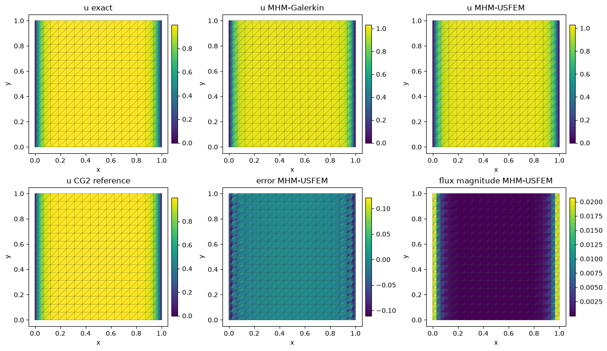
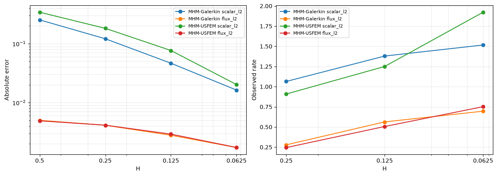
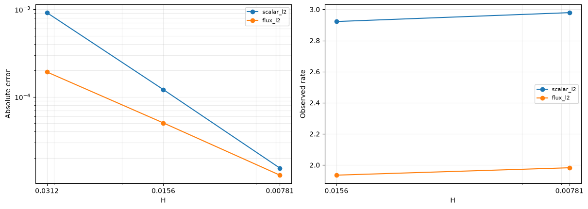
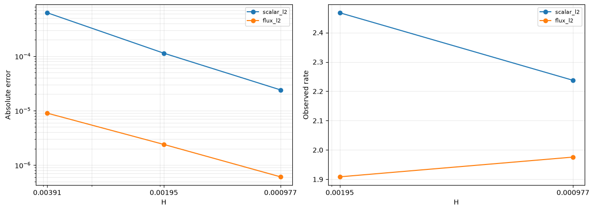
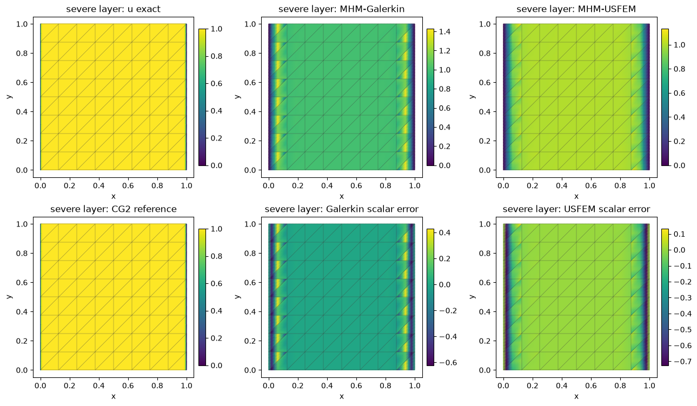
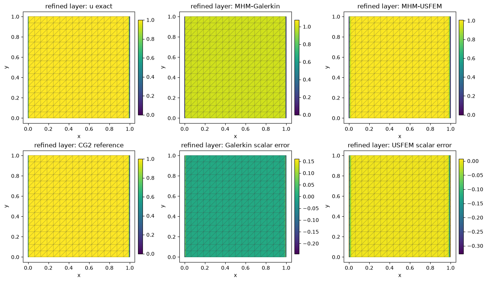
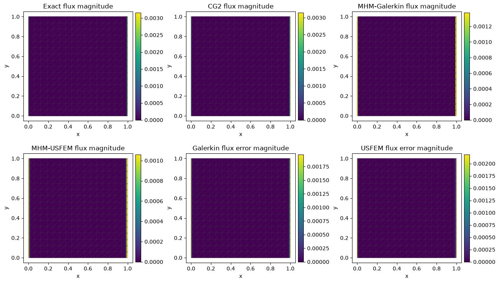
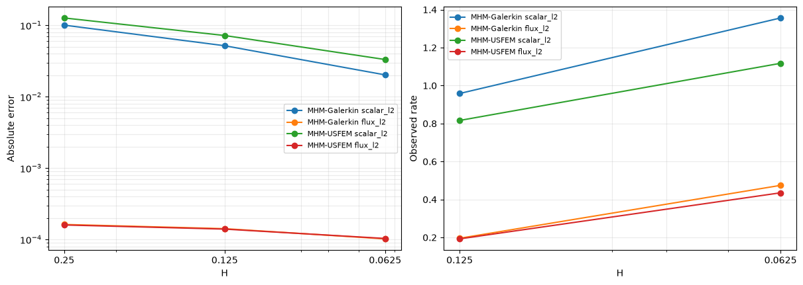

# MHM-USFEM: difficult local reaction–diffusion problems

Follow the numbered steps: state the variational problem, choose the local and trace spaces, declare the local and global equations, solve, and inspect the physical fields.

The main workflow is **meshes → spaces → local equations → global balance → assemble → solve → fields and errors**. `MeshHierarchy` associates macro and local meshes; `bind_interface` and `LocalContext` own supported numbering, geometric orientation and native coordinate conversions. The mathematical forms, physical trace meaning, local modes and gauge remain explicit in the cells below. Fully manual/custom spaces use the same numerical owners; see the [custom-interface notebook](https://github.com/ipes-lncc/pymhm/blob/main/notebooks/foundations/operators/custom_interface.ipynb).

We explicitly construct `Equation`, `LocalEquations` and `MultiscaleProblem`, then connect each code block to the physical formulation. **MHM-USFEM** is the name used here for scalar **MHM-UNUSUAL** of [Santiago, Valentin and Martins (2025), Eqs. (14)–(15), §4.1](https://doi.org/10.55592/cilamce2025.v5i.14270). This is a scalar reaction–diffusion example; the separate Stokes–Brinkman tutorial treats velocity and pressure. Advection is zero here, and the negative residual stabilization is different from SUPG.

Open the downloaded notebook with `jupyter lab` after installing `pymhm[notebooks,visualization]` and the compatible native DOLFINx/UFL backend. Exact data, sources, local and global forms, boundary conditions, independent references, norms and plots are all defined below. PyMHM supplies generic UFL compilation, oriented trace integration, condensation and checked linear algebra.

We compare an intentionally underresolved P1/P0 control with a refined P1/P0 family that partitions each macroface and satisfies the paper's red-refinement condition. Both use the same physical equation and the published stabilization parameter. Reduced nodal oscillation can coexist with a larger integrated error; we report both. Our declared SW–NE connectivity, strong exterior Dirichlet enforcement and local meshes do not constitute a reproduction of the paper's historical figures.


The PyMHM distribution contains only the library. The first cell explicitly
downloads a checksum-verified companion archive and prepares the declared data
using its local Python helpers. You can inspect these support files in `ROOT`.
Complete studies and historical replay retain their existing opt-in flags.

```python
from pathlib import Path
import os
import sys
from pymhm.io.workspace import workspace_from_archive

# Download verified support files; this operation does not execute them.
COMPANION_URL = "https://ipes-lncc.github.io/pymhm/downloads/fd8b6dd65c12aa3cf9532774452085ac69ee53f00d3e17fab3579d900106d733/mhm_usfem_rad-companion.zip"
COMPANION_SHA256 = "fd8b6dd65c12aa3cf9532774452085ac69ee53f00d3e17fab3579d900106d733"
WORKSPACE = Path(
    os.environ.get("PYMHM_WORKSPACE", Path.cwd() / ".pymhm-companions" / COMPANION_SHA256)
)
ROOT = workspace_from_archive(COMPANION_URL, sha256=COMPANION_SHA256, directory=WORKSPACE)
os.environ["PYMHM_WORKSPACE"] = str(ROOT)
if str(ROOT) not in sys.path:
    sys.path.insert(0, str(ROOT))

# Explicitly prepare declared data with the downloaded Python helpers.
from scripts.notebook_reproduction import notebook_workspace

ROOT = notebook_workspace("introduction/mhm_usfem_rad.ipynb", directory=ROOT)
root = ROOT
print("Workspace:", ROOT)


import json
import numpy as np
from pymhm import TriangleMesh, FaceSpace, SkeletonSpace
from pymhm.core.equations import Equation, LocalEquations, compile_form
from pymhm.core.multiscale import assemble

REPORTS = ROOT / "build/introduction"
REPORTS.mkdir(parents=True, exist_ok=True)
np.set_printoptions(precision=5, suppress=True)
from pymhm.fem.scalar.triangle import nodal_space

from dataclasses import dataclass
from typing import Any
from threadpoolctl import threadpool_limits

threadpool_limits(limits=1)
from pymhm import MeshHierarchy, LocalContext, bind_interface, bind_problem

from functools import partial
from examples.introduction.transport import (
    scalar_error_norms,
    scalar_reference,
    record_rad_case,
    plot_rad_primary,
    plot_rad_severe,
    plot_rad_refined,
    plot_rad_profiles,
)
from examples.introduction.vector import execution_provenance

measure_case = partial(record_rad_case, reports=REPORTS, root=ROOT)
```

## 1. Identify the equation, boundary data and difficult length scale

On the unit square, reaction and source are one and diffusion is a positive constant:


$$
\begin{aligned}
-\epsilon\Delta u+u&=1, & q&=-\epsilon\nabla u,\\
u&=0\quad\text{on }x=0,1, & q\cdot n&=0\quad\text{on }y=0,1.
\end{aligned}
$$


The exact solution has two layers with width of order $\sqrt\epsilon$:


$$
u(x,y)=1-\frac{e^{-x/\sqrt\epsilon}+e^{-(1-x)/\sqrt\epsilon}}{1+e^{-1/\sqrt\epsilon}}.
$$


Differentiating gives $-\epsilon u''+u=1$, independently of the discrete operator. At $\epsilon=10^{-5}$, a coarse uniform local mesh cannot resolve the layer. We measure nodal overshoot above the physical upper bound one, nodal error and integrated errors. The coarse control keeps the same spaces as diffusion decreases; a separate resolution family tests whether the physical fields improve when both the local and trace approximation spaces are refined.


```python
@dataclass(frozen=True)
class ReactionLayer:
    """Equation (22): ``-epsilon*Delta u+u=1`` with vertical zero Dirichlet data.

    Horizontal boundaries carry zero outward physical flux ``-epsilon*grad(u).n``.
    ``epsilon`` is positive and the layer width is its square root. Evaluation
    avoids positive exponential arguments, including in very thin layers.
    """

    epsilon: float

    def __post_init__(self) -> None:
        """Require a finite positive physical diffusion coefficient."""
        if not np.isfinite(self.epsilon) or self.epsilon <= 0:
            raise ValueError("epsilon must be finite and positive")

    def value(self, points: np.ndarray) -> np.ndarray:
        """Evaluate the exact scalar on physical unit-square coordinates."""
        scale = 1 / np.sqrt(self.epsilon)
        x = points[:, 0]
        return 1 - (np.exp(-scale * x) + np.exp(-scale * (1 - x))) / (1 + np.exp(-scale))

    def gradient(self, points: np.ndarray) -> np.ndarray:
        """Evaluate the independently differentiated physical gradient."""
        scale = 1 / np.sqrt(self.epsilon)
        x = points[:, 0]
        derivative = scale * (np.exp(-scale * x) - np.exp(-scale * (1 - x))) / (1 + np.exp(-scale))
        return np.column_stack((derivative, np.zeros(len(points))))
```

```python
EPSILON = 1e-3
# This scientific family fixes scalar P1 and multiplier P0.
LOCAL_SUBDIVISIONS = 2
LOCAL_QUADRATURE_DEGREE, OPERATOR_CHECK_ORDER, ERROR_ORDER = 8, 12, 24
truth = ReactionLayer(EPSILON)

# The independently differentiated equation is -epsilon*u'' + u = 1.
x = np.linspace(0, 1, 101)
points = np.column_stack((x, np.full_like(x, 0.37)))
scale = 1 / np.sqrt(EPSILON)
second = -(scale**2) * (np.exp(-scale * x) + np.exp(-scale * (1 - x))) / (1 + np.exp(-scale))
np.testing.assert_allclose(-EPSILON * second + truth.value(points), 1, atol=2e-15)
np.testing.assert_allclose(truth.gradient(points)[:, 1], 0)
```

## 2. Write the local equations and skeletal balance

Let $B_K$ integrate the globally oriented flux basis against the trace of a local test function. The API expresses


$$
\begin{aligned}
A_Ku_K+B_K\lambda&=F_K,\\
\sum_K C_Ku_K&=0, & C_K&=-B_K^\mathsf T.
\end{aligned}
$$


Summing the $C_Ku_K$ equations imposes continuity of scalar trace moments on internal faces. The normal interface binding supplies the two opposite incident orientations; `b` and `c` are declared independently with UFL boundary forms. On active flux faces, $\lambda=q\cdot n_F$ uses a single global face normal; with zero advection there is no Robin correction to the physical diffusive flux.

The complete strong reaction–diffusion operator is $Lw=w-\epsilon\Delta w$. USFEM changes the local bilinear and linear forms:


$$
\begin{aligned}
a_K(u,v)&=(\epsilon\nabla u,\nabla v)_K+(u,v)_K
 -\sum_{T\subset K}\tau_T(Lu,Lv)_T,\\
\ell_K(v)&=(1,v)_K-\sum_{T\subset K}\tau_T(1,Lv)_T,\\
\tau_T&=\frac{m h_T^2}{\max\{m h_T^2,2\epsilon\}+2\epsilon},\qquad m=\tfrac13.
\end{aligned}
$$


Locals are P1, hence $\Delta v_h=0$ inside each fine triangle and $Lv_h=v_h$. This justifies the published $m=1/3$ for this space. Below we declare the Galerkin form directly in UFL, then add the **negative** residual form and its matching source. `compile_form` actually executes native assembly; the native space binding owns the coefficient convention, while context trace pairings supply the declared UFL interface integrals.

Reaction makes the local operator invertible: constants are not a kernel, and no retained coarse amplitudes are required. On vertical exterior faces, zero scalar data are imposed strongly by removing their nodal coordinates and exterior flux columns. Horizontal exterior faces prescribe zero normal flux. Vertical Dirichlet faces are absent from flux coupling: their zero dummy trace coordinates do not prescribe the physical flux. The global balance is tested on the free internal trace coordinates.

For P1/P0 in two dimensions, Theorem 1 requires one red refinement of a simplicial local mesh that matches the macroface partition. With one P0 segment per macroface, two local subdivisions meet this condition. With four P0 segments per face, we declare a matching uniform four-subdivision mesh and take its red refinement: eight local subdivisions. This condition concerns compatibility of the trace and local spaces; a positive local matrix alone does not establish global stability.


```python
import basix.ufl
import dolfinx
import ufl


def rad_forms(domain: Any, *, epsilon: float, stabilized: bool) -> tuple[Any, Any, Any]:
    """Translate the local reaction–diffusion bilinear form and load into UFL."""
    V = dolfinx.fem.functionspace(domain, basix.ufl.element("Lagrange", "triangle", 1))
    u, v = ufl.TrialFunction(V), ufl.TestFunction(V)
    dx = ufl.Measure("dx", domain=domain, metadata={"quadrature_degree": LOCAL_QUADRATURE_DEGREE})
    a = (epsilon * ufl.inner(ufl.grad(u), ufl.grad(v)) + u * v) * dx
    L = v * dx
    if stabilized:
        Lu, Lv = u - epsilon * ufl.div(ufl.grad(u)), v - epsilon * ufl.div(ufl.grad(v))
        h = ufl.CellDiameter(domain)
        tau = (h**2 / 3) / (ufl.max_value(h**2 / 3, 2 * epsilon) + 2 * epsilon)
        a -= tau * Lu * Lv * dx
        L -= tau * Lv * dx
    return V, a, L
```

The native mesh and coefficient conversions come from the shared backend binding. The provider below writes the volume and boundary forms, chooses its physical boundary conditions and registers the scalar field. The explicit restriction to free scalar coordinates imposes the declared vertical Dirichlet data; it is part of the formulation.


```python
import basix


from pymhm.backends.spaces import create_native_mesh
```

`LocalEquations` now receives the executed forms through the shared native-space binding. `LocalContext` owns the mesh and interface maps. The following provider applies the vertical Dirichlet nodes, keeps the horizontal physical-flux convention, and exposes the two oriented trace blocks directly.


```python
def local_rad(
    local: LocalContext,
    *,
    macro: TriangleMesh,
    skeleton: SkeletonSpace,
    epsilon: float,
    stabilized: bool,
    local_subdivisions: int = LOCAL_SUBDIVISIONS,
) -> LocalEquations:
    """Declare and execute the local scalar UFL form, then apply explicit mixed data."""
    fine = local.mesh
    domain = create_native_mesh(fine)
    V, a, L = rad_forms(domain, epsilon=epsilon, stabilized=stabilized)
    # Generic native assembly and coordinate permutation, independent of the PDE.
    binding = local.native_space(V)
    order = binding.mapping
    native_A, native_F = compile_form(a), compile_form(L)
    A, F = native_A[order][:, order], native_F[order]
    _, nodes = nodal_space(fine, 1)
    from pymhm.backends.forms import assemble_pairing

    u, v = ufl.TrialFunction(V), ufl.TestFunction(V)
    pair_b = local.trace_pairings(lambda phi, ds: phi * v * ds)
    pair_c = local.trace_pairings(lambda phi, ds: -phi * u * ds, axis="rows")
    B = assemble_pairing(pair_b.forms, axis="columns")[order]
    C = assemble_pairing(pair_c.forms, axis="rows")[:, order]
    fixed_nodes = np.flatnonzero(
        np.isclose(nodes[:, 0], 0, atol=1e-12) | np.isclose(nodes[:, 0], 1, atol=1e-12)
    )
    free = np.setdiff1d(np.arange(len(nodes)), fixed_nodes)
    local.field("scalar", binding, reconstruction=binding.to_native(np.eye(len(nodes))[:, free]))
    B, C = B[free], C[:, free]
    return local.equations(
        a=A[free][:, free],
        L=F[free],
        b=B,
        c=C,
        metadata={
            "mesh": fine,
            "free": free,
            "nodes": len(nodes),
            "local_subdivisions": local_subdivisions,
        },
    )
```

The primary operator above is the executed UFL form. As a secondary convenience check, `scalar_operators` can assemble its unstabilized part. We compare its restricted matrix and load against our declared Galerkin equation on one representative macrocell; it is not used to define the tutorial's MHM operators.


```python
from pymhm.fem.scalar.triangle import scalar_operators

probe_macro = TriangleMesh.unit_square(2)
probe_skeleton = SkeletonSpace(probe_macro, tuple(FaceSpace.uniform(0) for _ in probe_macro.faces))
probe_problem = bind_problem(
    MeshHierarchy(
        probe_macro,
        tuple(
            probe_macro.submesh(cell, LOCAL_SUBDIVISIONS) for cell in range(len(probe_macro.cells))
        ),
    ),
    bind_interface(probe_skeleton, convention="normal"),
    lambda local: local_rad(
        local, macro=probe_macro, skeleton=probe_skeleton, epsilon=EPSILON, stabilized=False
    ),
)
probe_equation = probe_problem.local_provider(0)
ready_A, _, ready_F = scalar_operators(
    probe_equation.metadata["mesh"],
    1,
    diffusion=EPSILON,
    reaction=1.0,
    source=1.0,
    order=OPERATOR_CHECK_ORDER,
)
free = probe_equation.metadata["free"]
np.testing.assert_allclose(probe_equation.a.toarray(), ready_A[free][:, free].toarray(), atol=1e-14)
np.testing.assert_allclose(probe_equation.L, ready_F[free], atol=1e-14)
```

## 3. Declare and solve the global problem

`Equation(0,0)` adds zero to the sum of the local balances. Homogeneous boundary data already enter the local restrictions and fixed exterior trace coefficients. `assemble` eliminates each independent local operator; the global solve then reconstructs the local coefficients. No call selects a PDE from a model name.

We measure the broken scalar error and physical flux $-\epsilon\nabla u_h$ against the analytical fields. The following quadrature utility also records nodal extrema, since a small integral error alone can miss oscillations in a thin layer.
Norm integration, archive replay and field/profile displays are importable from `examples/introduction/transport.py` and `examples/introduction/vector.py`. The local forms and the complete global solve remain above; the conforming P2 forms below are separately declared.


```python
# Physical scalar/gradient/flux norms are integrated by scalar_error_norms (imported above).
```

### Record the numerical coordinates for reproducibility

The next utility saves the actual local coordinate basis, coefficients, orientation maps and reconstructed fields as each solve finishes. It contains no physical operator. Replaying the saved basis is checked with one and two BLAS threads; this positive-reaction example has no local nullspace modes. You can read the global construction immediately below without studying the archive format first.


```python
def solve_rad_case(
    n, epsilon, stabilized, *, face_subdivisions=1, local_subdivisions=LOCAL_SUBDIVISIONS
):
    """Declare the mesh, multiplier space and scalar global equation for one configuration."""
    macro = TriangleMesh.unit_square(n)
    skeleton = SkeletonSpace(
        macro, tuple(FaceSpace.uniform(0, face_subdivisions) for _ in macro.faces)
    )
    provider = lambda local: local_rad(
        local,
        macro=macro,
        skeleton=skeleton,
        epsilon=epsilon,
        stabilized=stabilized,
        local_subdivisions=local_subdivisions,
    )
    hierarchy = MeshHierarchy(
        macro, tuple(macro.submesh(c, local_subdivisions) for c in range(len(macro.cells)))
    )
    # Vertical scalar data are strong in local_rad; horizontal physical flux is zero.
    fixed = {int(d): 0.0 for f in macro.boundary_faces for d in skeleton.dofs(int(f))}
    problem = bind_problem(
        hierarchy,
        bind_interface(skeleton, convention="normal"),
        provider,
        global_equation=Equation(0, 0),
        retained=0,
        fixed=fixed,
    )
    system = assemble(problem)
    return macro, skeleton, system, system.solve()


METHODS = (("MHM-Galerkin", False), ("MHM-USFEM", True))
cases, rows, state_archives = {}, [], []
for n in (2, 4, 8, 16):
    for method, stabilized in METHODS:
        case, row, archive = measure_case(
            *solve_rad_case(n, EPSILON, stabilized),
            truth,
            order=ERROR_ORDER,
            name=f"rad-n{n}-{method.lower().replace(' ', '-')}",
            named=True,
            method=method,
            n=n,
            H=1 / n,
        )
        cases[n, method] = case
        rows.append(row)
        state_archives.append(archive)
rows
```

??? note "Numerical output and provenance"

    ```text
    [{'macro_cells': 8,
      'fine_cells': 32,
      'trace_dofs': 16,
      'residual': 2.043158148055947e-18,
      'scalar_l2': 0.25331511823245645,
      'flux_l2': 0.0049922958737293735,
      'gradient_l2': 4.992295873729374,
      'scalar_relative_l2': 0.26625957192826877,
      'nodal_error': 0.37771283714762327,
      'nodal_minimum': 0.0,
      'nodal_maximum': 1.3773441986275734,
      'method': 'MHM-Galerkin',
      'n': 2,
      'H': 0.5},
     {'macro_cells': 8,
      'fine_cells': 32,
      'trace_dofs': 16,
      'residual': 1.0314124678157315e-17,
      'scalar_l2': 0.34175259280093,
      'flux_l2': 0.004894176612566581,
      'gradient_l2': 4.89417661256658,
      'scalar_relative_l2': 0.35921621930614284,
      'nodal_error': 0.19714623568561518,
      'nodal_minimum': 0.0,
      'nodal_maximum': 1.1126151697555124,
      'method': 'MHM-USFEM',
      'n': 2,
      'H': 0.5},
     {'macro_cells': 32,
      'fine_cells': 128,
      'trace_dofs': 56,
      'residual': 2.3581389225557654e-18,
      'scalar_l2': 0.12112741146990827,
      'flux_l2': 0.004115878117983086,
      'gradient_l2': 4.115878117983086,
      'scalar_relative_l2': 0.12731704665633647,
      'nodal_error': 0.25980313859039594,
      'nodal_minimum': 0.0,
      'nodal_maximum': 1.240603178434425,
      'method': 'MHM-Galerkin',
      'n': 4,
      'H': 0.25},
     {'macro_cells': 32,
      'fine_cells': 128,
      'trace_dofs': 56,
      'residual': 7.655488364338492e-18,
      'scalar_l2': 0.18208673599128516,
      'flux_l2': 0.004130825618653842,
      'gradient_l2': 4.130825618653842,
      'scalar_relative_l2': 0.19139140497080442,
      'nodal_error': 0.19374192827725978,
      'nodal_minimum': 0.0,
      'nodal_maximum': 1.1294675135664094,
      'method': 'MHM-USFEM',
      'n': 4,
      'H': 0.25},
     {'macro_cells': 128,
      'fine_cells': 512,
      'trace_dofs': 208,
      'residual': 4.5916800562639076e-18,
      'scalar_l2': 0.04656879012655305,
      'flux_l2': 0.002786462852626926,
      'gradient_l2': 2.786462852626926,
      'scalar_relative_l2': 0.048948464706062345,
      'nodal_error': 0.14438737561256298,
      'nodal_minimum': 0.0,
      'nodal_maximum': 1.125187415456592,
      'method': 'MHM-Galerkin',
      'n': 8,
      'H': 0.125},
     {'macro_cells': 128,
      'fine_cells': 512,
      'trace_dofs': 208,
      'residual': 1.1365012103379582e-17,
      'scalar_l2': 0.07656209768491802,
      'flux_l2': 0.002909494311749462,
      'gradient_l2': 2.909494311749462,
      'scalar_relative_l2': 0.08047443633747027,
      'nodal_error': 0.15551401548096855,
      'nodal_minimum': 0.0,
      'nodal_maximum': 1.1010938058504158,
      'method': 'MHM-USFEM',
      'n': 8,
      'H': 0.125},
     {'macro_cells': 512,
      'fine_cells': 2048,
      'trace_dofs': 800,
      'residual': 1.1955824945521019e-17,
      'scalar_l2': 0.016280778118692305,
      'flux_l2': 0.0017204001144176615,
      'gradient_l2': 1.7204001144176615,
      'scalar_relative_l2': 0.01711272916827719,
      'nodal_error': 0.15620122915430557,
      'nodal_minimum': 0.0,
      'nodal_maximum': 1.0320779526335582,
      'method': 'MHM-Galerkin',
      'n': 16,
      'H': 0.0625},
     {'macro_cells': 512,
      'fine_cells': 2048,
      'trace_dofs': 800,
      'residual': 1.4707313764539898e-17,
      'scalar_l2': 0.020197431303050736,
      'flux_l2': 0.0017279805508186468,
      'gradient_l2': 1.7279805508186468,
      'scalar_relative_l2': 0.02122952412128032,
      'nodal_error': 0.1212762367189939,
      'nodal_minimum': 0.0,
      'nodal_maximum': 1.0296587301268465,
      'method': 'MHM-USFEM',
      'n': 16,
      'H': 0.0625}]
    ```


## 4. Independently assemble and refine a classical conforming reference

The CG2 reference uses the same diffusion, unit reaction/source and mixed boundary data, with a globally conforming field and no skeleton or stabilization. Its real UFL form is independently assembled by DOLFINx below. We impose zero scalar values strongly on the vertical boundary and leave the horizontal zero-flux condition natural.

The exact solution lets us verify true reference errors on several fine meshes. For the severe $\epsilon=10^{-5}$ challenge, additional meshes have 256, 512 and 1024 divisions in the layer-normal direction and 16 in the invariant direction. This declared anisotropy resolves the physical scale without changing the operator or boundary data. A numerical reference remains a numerical field, even when an exact field is also available.


```python
def classical_rad_forms(space, epsilon):
    """Declare the separate conforming P2 operator, source and exact field."""
    u, v = ufl.TrialFunction(space), ufl.TestFunction(space)
    domain = space.ufl_domain()
    dx = ufl.Measure("dx", domain=domain, metadata={"quadrature_degree": 20})
    a = (epsilon * ufl.inner(ufl.grad(u), ufl.grad(v)) + u * v) * dx
    x = ufl.SpatialCoordinate(domain)
    exact = 1 - (ufl.exp(-x[0] / np.sqrt(epsilon)) + ufl.exp(-(1 - x[0]) / np.sqrt(epsilon))) / (
        1 + np.exp(-1 / np.sqrt(epsilon))
    )
    return a, v * dx, exact, dx


reference_rows, references = [], {}
REFERENCE_GRIDS = [(EPSILON, n, n) for n in (32, 64, 128)] + [
    (1e-5, n, 16) for n in (256, 512, 1024)
]
for epsilon, nx, ny in REFERENCE_GRIDS:
    case, row, archive = scalar_reference(
        epsilon, nx, ny, classical_rad_forms, ReactionLayer(epsilon), reports=REPORTS, root=ROOT
    )
    references[epsilon, nx] = case
    reference_rows.append(row)
    state_archives.append(archive)
```

```text
CG2 reference 0.001 (32, 32) 0.0009161727594715088 0.0001923129555579351
```

```text
CG2 reference 0.001 (64, 64) 0.00012088991109419018 5.030106568132461e-05
```

```text
CG2 reference 0.001 (128, 128) 1.5333382111264132e-05 1.2730634497972802e-05
```

```text
CG2 reference 1e-05 (256, 16) 0.0006259597016897307 8.965065539454321e-06
```

```text
CG2 reference 1e-05 (512, 16) 0.00011317367584808531 2.388011757956421e-06
```

```text
CG2 reference 1e-05 (1024, 16) 2.400002563838651e-05 6.071295005724848e-07
```

## 5. Inspect fields and observed convergence rates

Every spatial panel highlights the **actual MHM macro mesh**, including analytical and reference panels. Flux means the raw physical field $-\epsilon\nabla u_h$; the skeletal solve does not make it an H(div) reconstruction.

The sequence keeps P1 locals, P0 faces and two local subdivisions per macro edge, varying only the macro mesh. Reported rates are measured from this layer problem; smooth-problem orders are not assumed. Reference errors are measured separately against the exact solution.

For two successive resolutions, the measured slope is $r=\log(e_1/e_2)/\log(H_1/H_2)$. These small plotting utilities compute that quantity directly and keep error and rate axes separate.

The display utility evaluates each local polynomial independently, including its one-sided boundary values. Every panel overlays the actual macro mesh and has its own color scale. It changes only the display sampling.


```python
plot_rad_primary(cases, rows, reference_rows, references, truth, reports=REPORTS)
```

[](../../assets/tutorials/mhm_usfem_rad/figure_23_0.png)


[](../../assets/tutorials/mhm_usfem_rad/figure_23_1.png)


```text
MHM-Galerkin scalar_l2 rates: [1.06441 1.37909 1.51619]
MHM-Galerkin flux_l2 rates: [0.2785  0.56277 0.69569]
MHM-USFEM scalar_l2 rates: [0.90833 1.24992 1.92246]
MHM-USFEM flux_l2 rates: [0.24464 0.50566 0.75168]
```


[](../../assets/tutorials/mhm_usfem_rad/figure_23_3.png)


[](../../assets/tutorials/mhm_usfem_rad/figure_23_4.png)


## 6. Preserve a deliberately underresolved control

Fix the macro mesh at $n=8$, with one P0 segment per macroface and two local subdivisions. Both methods use the same scalar PDE and approximation spaces. Decreasing $\epsilon$ makes the physical layer thinner without increasing resolution. This control demonstrates the approximation limits of these spaces.

For constant diffusion and P1 locals, the elementwise Laplacian vanishes. On the uniform fine mesh, write $\eta=1-\tau$. The stabilized matrix and source reduce exactly to


$$
A_{\mathrm{US}}=\epsilon K+\eta M,
\qquad F_{\mathrm{US}}=\eta F.
$$


Here $K$ and $M$ are the ordinary P1 stiffness and mass matrices. In the reaction-dominated branch, dividing by $\eta$ exposes the discrete diffusion scale


$$
\epsilon_{\mathrm{effective}}
=\frac{\epsilon}{1-\tau}
=\epsilon+\frac{h_T^2}{6}.
$$


This identity explains why the underresolved stabilized profile can have a broader transition. It does not change the physical diffusion or justify changing the method parameter. For this control, $h_T=\sqrt{2}/16\approx0.0884$, whereas the physical layer width at $\epsilon=10^{-5}$ is $\sqrt{\epsilon}\approx0.00316$.

The tables keep overshoot, nodal error, scalar L2 and physical-flux L2 visible. USFEM need not improve every measure or preserve nodal bounds. The profiles retain independent one-sided values at every macroface intersection.


```python
sweep, challenging = [], {}
macro = TriangleMesh.unit_square(8)
for epsilon in dict.fromkeys((1e-2, EPSILON, 1e-5)):
    for method, stabilized in METHODS:
        case, row, archive = measure_case(
            *solve_rad_case(8, epsilon, stabilized),
            ReactionLayer(epsilon),
            order=40,
            name=f"rad-eps{epsilon:g}-{method.lower()}",
            epsilon=epsilon,
            method=method,
        )
        row["overshoot"] = max(0.0, row["nodal_maximum"] - 1)
        challenging[epsilon, method] = case[2:]
        sweep.append(row)
        state_archives.append(archive)
sweep
```

??? note "Numerical output and provenance"

    ```text
    [{'macro_cells': 128,
      'fine_cells': 512,
      'trace_dofs': 208,
      'residual': 2.821967046147381e-17,
      'scalar_l2': 0.015727506798012398,
      'flux_l2': 0.006979403304451645,
      'gradient_l2': 0.6979403304451645,
      'scalar_relative_l2': 0.018796381471541435,
      'nodal_error': 0.10172873787639769,
      'nodal_minimum': 0.0,
      'nodal_maximum': 0.9937189825987042,
      'epsilon': 0.01,
      'method': 'MHM-Galerkin',
      'overshoot': 0.0},
     {'macro_cells': 128,
      'fine_cells': 512,
      'trace_dofs': 208,
      'residual': 3.779329480464003e-17,
      'scalar_l2': 0.01684209049020335,
      'flux_l2': 0.006964009814822497,
      'gradient_l2': 0.6964009814822497,
      'scalar_relative_l2': 0.02012845148934158,
      'nodal_error': 0.08559220444620463,
      'nodal_minimum': 0.0,
      'nodal_maximum': 0.9909556114252319,
      'epsilon': 0.01,
      'method': 'MHM-USFEM',
      'overshoot': 0.0},
     {'macro_cells': 128,
      'fine_cells': 512,
      'trace_dofs': 208,
      'residual': 4.5916800562639076e-18,
      'scalar_l2': 0.046568790126552975,
      'flux_l2': 0.0027864628526269347,
      'gradient_l2': 2.7864628526269346,
      'scalar_relative_l2': 0.04894846470606227,
      'nodal_error': 0.14438737561256298,
      'nodal_minimum': 0.0,
      'nodal_maximum': 1.125187415456592,
      'epsilon': 0.001,
      'method': 'MHM-Galerkin',
      'overshoot': 0.12518741545659196},
     {'macro_cells': 128,
      'fine_cells': 512,
      'trace_dofs': 208,
      'residual': 1.1365012103379582e-17,
      'scalar_l2': 0.07656209768491792,
      'flux_l2': 0.0029094943117494707,
      'gradient_l2': 2.9094943117494707,
      'scalar_relative_l2': 0.08047443633747016,
      'nodal_error': 0.15551401548096855,
      'nodal_minimum': 0.0,
      'nodal_maximum': 1.1010938058504158,
      'epsilon': 0.001,
      'method': 'MHM-USFEM',
      'overshoot': 0.10109380585041583},
     {'macro_cells': 128,
      'fine_cells': 512,
      'trace_dofs': 208,
      'residual': 1.999855738605866e-18,
      'scalar_l2': 0.16028915457590862,
      'flux_l2': 0.00017088075366392442,
      'gradient_l2': 17.08807536639244,
      'scalar_relative_l2': 0.1610549256798726,
      'nodal_error': 0.46175828742208314,
      'nodal_minimum': 0.0,
      'nodal_maximum': 1.4291224985130555,
      'epsilon': 1e-05,
      'method': 'MHM-Galerkin',
      'overshoot': 0.4291224985130555},
     {'macro_cells': 128,
      'fine_cells': 512,
      'trace_dofs': 208,
      'residual': 6.204105984531998e-18,
      'scalar_l2': 0.1993607741408251,
      'flux_l2': 0.0001690370709830444,
      'gradient_l2': 16.903707098304437,
      'scalar_relative_l2': 0.2003132073887566,
      'nodal_error': 0.17865926802559684,
      'nodal_minimum': 0.0,
      'nodal_maximum': 1.1325596790408101,
      'epsilon': 1e-05,
      'method': 'MHM-USFEM',
      'overshoot': 0.13255967904081012}]
    ```


```python
plot_rad_severe(macro, challenging, references, sweep, ReactionLayer, reports=REPORTS)
```

[](../../assets/tutorials/mhm_usfem_rad/figure_26_0.png)


```text
MHM-Galerkin overshoot = 0.4291224985130555 maximum nodal error = 0.46175828742208314 scalar L2 = 0.16028915457590862
MHM-USFEM overshoot = 0.13255967904081012 maximum nodal error = 0.17865926802559684 scalar L2 = 0.1993607741408251
```

## 7. Refine the local and trace spaces together

Keep P1 local polynomials and P0 on **each face segment**, but use four equal segments per macroface and eight local subdivisions. The eight-subdivision mesh is one red refinement of the matching four-subdivision mesh. We vary macro divisions through $n=4,8,16$ for $\epsilon=10^{-5}$ and also compute $\epsilon=10^{-3}$ at $n=16$ for the profile comparison.

The finest case has 512 macrotriangles and four P0 segments per face, as reported for the paper's analytical comparison. The paper states $\bar H=H/4$ and $h=\bar H$, but does not specify the historical matching triangulation and connectivity sufficiently to recover the local meshes. Our uniform red-refined realization is declared here. Moreover, the paper's continuous hybrid formulation imposes Dirichlet trace moments weakly; this tutorial imposes the exterior data strongly on local nodes. These are material differences when interpreting the discrete results. We compare the same analytical PDE and an admissible discretization; we do not claim a matched reproduction of Fig. 2.

The global equation is still the sum of local scalar-trace balances. Only the geometry and the number of face segments change below; the UFL forms, stabilization sign, source and boundary convention remain those already defined.


```python
resolved_cases, resolved_rows = {}, []
FACE_SUBDIVISIONS, RESOLVED_LOCAL_SUBDIVISIONS = 4, 8
RESOLVED_LEVELS = {1e-5: (4, 8, 16)}
RESOLVED_LEVELS.setdefault(EPSILON, (16,))
for epsilon, resolutions in RESOLVED_LEVELS.items():
    for n in resolutions:
        for method, stabilized in METHODS:
            case, row, archive = measure_case(
                *solve_rad_case(
                    n,
                    epsilon,
                    stabilized,
                    face_subdivisions=FACE_SUBDIVISIONS,
                    local_subdivisions=RESOLVED_LOCAL_SUBDIVISIONS,
                ),
                ReactionLayer(epsilon),
                order=ERROR_ORDER,
                name=f"rad-resolved-eps{epsilon:g}-n{n}-{method.lower()}",
                epsilon=epsilon,
                method=method,
                n=n,
                H=1 / n,
                face_subdivisions=FACE_SUBDIVISIONS,
                local_subdivisions=RESOLVED_LOCAL_SUBDIVISIONS,
            )
            row["overshoot"] = max(0.0, row["nodal_maximum"] - 1)
            resolved_cases[epsilon, n, method] = case
            resolved_rows.append(row)
            state_archives.append(archive)
            print("Refined P1/P0", epsilon, n, method, row)
resolved_rows
```

```text
Refined P1/P0 1e-05 4 MHM-Galerkin {'macro_cells': 32, 'fine_cells': 2048, 'trace_dofs': 224, 'residual': 3.582091155950077e-18, 'scalar_l2': 0.10038241445937039, 'flux_l2': 0.00016200323188130994, 'gradient_l2': 16.200323188130994, 'scalar_relative_l2': 0.10086198497393516, 'nodal_error': 0.3972480272375427, 'nodal_minimum': 0.0, 'nodal_maximum': 1.3971969472457781, 'epsilon': 1e-05, 'method': 'MHM-Galerkin', 'n': 4, 'H': 0.25, 'face_subdivisions': 4, 'local_subdivisions': 8, 'overshoot': 0.39719694724577814}
```

```text
Refined P1/P0 1e-05 4 MHM-USFEM {'macro_cells': 32, 'fine_cells': 2048, 'trace_dofs': 224, 'residual': 5.996360824405177e-18, 'scalar_l2': 0.12651669686326633, 'flux_l2': 0.0001594287090734297, 'gradient_l2': 15.942870907342968, 'scalar_relative_l2': 0.12712112222743516, 'nodal_error': 0.1747988228416666, 'nodal_minimum': 0.0, 'nodal_maximum': 1.0203970217061842, 'epsilon': 1e-05, 'method': 'MHM-USFEM', 'n': 4, 'H': 0.25, 'face_subdivisions': 4, 'local_subdivisions': 8, 'overshoot': 0.020397021706184182}
```

```text
Refined P1/P0 1e-05 8 MHM-Galerkin {'macro_cells': 128, 'fine_cells': 8192, 'trace_dofs': 832, 'residual': 1.647047208981743e-18, 'scalar_l2': 0.05166215678890528, 'flux_l2': 0.0001414541127895522, 'gradient_l2': 14.145411278955219, 'scalar_relative_l2': 0.051908969412891415, 'nodal_error': 0.3042539477792454, 'nodal_minimum': 0.0, 'nodal_maximum': 1.2971069210013073, 'epsilon': 1e-05, 'method': 'MHM-Galerkin', 'n': 8, 'H': 0.125, 'face_subdivisions': 4, 'local_subdivisions': 8, 'overshoot': 0.2971069210013073}
```

```text
Refined P1/P0 1e-05 8 MHM-USFEM {'macro_cells': 128, 'fine_cells': 8192, 'trace_dofs': 832, 'residual': 3.602925898094949e-18, 'scalar_l2': 0.0718478396324243, 'flux_l2': 0.00013951315234044713, 'gradient_l2': 13.951315234044712, 'scalar_relative_l2': 0.07219108805505349, 'nodal_error': 0.18175214271977902, 'nodal_minimum': 0.0, 'nodal_maximum': 1.0156894150245483, 'epsilon': 1e-05, 'method': 'MHM-USFEM', 'n': 8, 'H': 0.125, 'face_subdivisions': 4, 'local_subdivisions': 8, 'overshoot': 0.015689415024548348}
```

```text
Refined P1/P0 1e-05 16 MHM-Galerkin {'macro_cells': 512, 'fine_cells': 32768, 'trace_dofs': 3200, 'residual': 1.4601526170143782e-18, 'scalar_l2': 0.020178636803276615, 'flux_l2': 0.00010181469397222876, 'gradient_l2': 10.181469397222875, 'scalar_relative_l2': 0.020275038939916595, 'nodal_error': 0.16048431096663485, 'nodal_minimum': 0.0, 'nodal_maximum': 1.0759442211988917, 'epsilon': 1e-05, 'method': 'MHM-Galerkin', 'n': 16, 'H': 0.0625, 'face_subdivisions': 4, 'local_subdivisions': 8, 'overshoot': 0.07594422119889166}
```

```text
Refined P1/P0 1e-05 16 MHM-USFEM {'macro_cells': 512, 'fine_cells': 32768, 'trace_dofs': 3200, 'residual': 3.344955980707496e-18, 'scalar_l2': 0.033115431616295654, 'flux_l2': 0.00010318176578351813, 'gradient_l2': 10.318176578351812, 'scalar_relative_l2': 0.03327363845626651, 'nodal_error': 0.1530380547529956, 'nodal_minimum': 0.0, 'nodal_maximum': 1.0068824167868782, 'epsilon': 1e-05, 'method': 'MHM-USFEM', 'n': 16, 'H': 0.0625, 'face_subdivisions': 4, 'local_subdivisions': 8, 'overshoot': 0.006882416786878176}
```

```text
Refined P1/P0 0.001 16 MHM-Galerkin {'macro_cells': 512, 'fine_cells': 32768, 'trace_dofs': 3200, 'residual': 2.3064649475921167e-17, 'scalar_l2': 0.0008317865677838922, 'flux_l2': 0.0004019769798175291, 'gradient_l2': 0.4019769798175291, 'scalar_relative_l2': 0.0008742910293675748, 'nodal_error': 0.006999393894721817, 'nodal_minimum': 0.0, 'nodal_maximum': 0.9999997474222397, 'epsilon': 0.001, 'method': 'MHM-Galerkin', 'n': 16, 'H': 0.0625, 'face_subdivisions': 4, 'local_subdivisions': 8, 'overshoot': 0.0}
```

```text
Refined P1/P0 0.001 16 MHM-USFEM {'macro_cells': 512, 'fine_cells': 32768, 'trace_dofs': 3200, 'residual': 2.4620553040580394e-17, 'scalar_l2': 0.0012263474872157788, 'flux_l2': 0.00040196928701191604, 'gradient_l2': 0.40196928701191603, 'scalar_relative_l2': 0.001289014091459563, 'nodal_error': 0.0055887100964260306, 'nodal_minimum': 0.0, 'nodal_maximum': 0.999999725960371, 'epsilon': 0.001, 'method': 'MHM-USFEM', 'n': 16, 'H': 0.0625, 'face_subdivisions': 4, 'local_subdivisions': 8, 'overshoot': 0.0}
```


??? note "Numerical output and provenance"

    ```text
    [{'macro_cells': 32,
      'fine_cells': 2048,
      'trace_dofs': 224,
      'residual': 3.582091155950077e-18,
      'scalar_l2': 0.10038241445937039,
      'flux_l2': 0.00016200323188130994,
      'gradient_l2': 16.200323188130994,
      'scalar_relative_l2': 0.10086198497393516,
      'nodal_error': 0.3972480272375427,
      'nodal_minimum': 0.0,
      'nodal_maximum': 1.3971969472457781,
      'epsilon': 1e-05,
      'method': 'MHM-Galerkin',
      'n': 4,
      'H': 0.25,
      'face_subdivisions': 4,
      'local_subdivisions': 8,
      'overshoot': 0.39719694724577814},
     {'macro_cells': 32,
      'fine_cells': 2048,
      'trace_dofs': 224,
      'residual': 5.996360824405177e-18,
      'scalar_l2': 0.12651669686326633,
      'flux_l2': 0.0001594287090734297,
      'gradient_l2': 15.942870907342968,
      'scalar_relative_l2': 0.12712112222743516,
      'nodal_error': 0.1747988228416666,
      'nodal_minimum': 0.0,
      'nodal_maximum': 1.0203970217061842,
      'epsilon': 1e-05,
      'method': 'MHM-USFEM',
      'n': 4,
      'H': 0.25,
      'face_subdivisions': 4,
      'local_subdivisions': 8,
      'overshoot': 0.020397021706184182},
     {'macro_cells': 128,
      'fine_cells': 8192,
      'trace_dofs': 832,
      'residual': 1.647047208981743e-18,
      'scalar_l2': 0.05166215678890528,
      'flux_l2': 0.0001414541127895522,
      'gradient_l2': 14.145411278955219,
      'scalar_relative_l2': 0.051908969412891415,
      'nodal_error': 0.3042539477792454,
      'nodal_minimum': 0.0,
      'nodal_maximum': 1.2971069210013073,
      'epsilon': 1e-05,
      'method': 'MHM-Galerkin',
      'n': 8,
      'H': 0.125,
      'face_subdivisions': 4,
      'local_subdivisions': 8,
      'overshoot': 0.2971069210013073},
     {'macro_cells': 128,
      'fine_cells': 8192,
      'trace_dofs': 832,
      'residual': 3.602925898094949e-18,
      'scalar_l2': 0.0718478396324243,
      'flux_l2': 0.00013951315234044713,
      'gradient_l2': 13.951315234044712,
      'scalar_relative_l2': 0.07219108805505349,
      'nodal_error': 0.18175214271977902,
      'nodal_minimum': 0.0,
      'nodal_maximum': 1.0156894150245483,
      'epsilon': 1e-05,
      'method': 'MHM-USFEM',
      'n': 8,
      'H': 0.125,
      'face_subdivisions': 4,
      'local_subdivisions': 8,
      'overshoot': 0.015689415024548348},
     {'macro_cells': 512,
      'fine_cells': 32768,
      'trace_dofs': 3200,
      'residual': 1.4601526170143782e-18,
      'scalar_l2': 0.020178636803276615,
      'flux_l2': 0.00010181469397222876,
      'gradient_l2': 10.181469397222875,
      'scalar_relative_l2': 0.020275038939916595,
      'nodal_error': 0.16048431096663485,
      'nodal_minimum': 0.0,
      'nodal_maximum': 1.0759442211988917,
      'epsilon': 1e-05,
      'method': 'MHM-Galerkin',
      'n': 16,
      'H': 0.0625,
      'face_subdivisions': 4,
      'local_subdivisions': 8,
      'overshoot': 0.07594422119889166},
     {'macro_cells': 512,
      'fine_cells': 32768,
      'trace_dofs': 3200,
      'residual': 3.344955980707496e-18,
      'scalar_l2': 0.033115431616295654,
      'flux_l2': 0.00010318176578351813,
      'gradient_l2': 10.318176578351812,
      'scalar_relative_l2': 0.03327363845626651,
      'nodal_error': 0.1530380547529956,
      'nodal_minimum': 0.0,
      'nodal_maximum': 1.0068824167868782,
      'epsilon': 1e-05,
      'method': 'MHM-USFEM',
      'n': 16,
      'H': 0.0625,
      'face_subdivisions': 4,
      'local_subdivisions': 8,
      'overshoot': 0.006882416786878176},
     {'macro_cells': 512,
      'fine_cells': 32768,
      'trace_dofs': 3200,
      'residual': 2.3064649475921167e-17,
      'scalar_l2': 0.0008317865677838922,
      'flux_l2': 0.0004019769798175291,
      'gradient_l2': 0.4019769798175291,
      'scalar_relative_l2': 0.0008742910293675748,
      'nodal_error': 0.006999393894721817,
      'nodal_minimum': 0.0,
      'nodal_maximum': 0.9999997474222397,
      'epsilon': 0.001,
      'method': 'MHM-Galerkin',
      'n': 16,
      'H': 0.0625,
      'face_subdivisions': 4,
      'local_subdivisions': 8,
      'overshoot': 0.0},
     {'macro_cells': 512,
      'fine_cells': 32768,
      'trace_dofs': 3200,
      'residual': 2.4620553040580394e-17,
      'scalar_l2': 0.0012263474872157788,
      'flux_l2': 0.00040196928701191604,
      'gradient_l2': 0.40196928701191603,
      'scalar_relative_l2': 0.001289014091459563,
      'nodal_error': 0.0055887100964260306,
      'nodal_minimum': 0.0,
      'nodal_maximum': 0.999999725960371,
      'epsilon': 0.001,
      'method': 'MHM-USFEM',
      'n': 16,
      'H': 0.0625,
      'face_subdivisions': 4,
      'local_subdivisions': 8,
      'overshoot': 0.0}]
    ```


### Inspect the refined physical fields and measured rates

The following severe-layer panels use the finest declared P1/P0 family. They show both methods, their scalar errors and the independently refined CG2 baseline. Every panel overlays the actual 512-triangle macro mesh. The convergence figure reports observed scalar and physical-flux errors and slopes; no smooth-problem rate is transferred to this singularly perturbed case.


```python
plot_rad_refined(resolved_cases, resolved_rows, references, ReactionLayer, reports=REPORTS)
```

[](../../assets/tutorials/mhm_usfem_rad/figure_30_0.png)


[](../../assets/tutorials/mhm_usfem_rad/figure_30_1.png)


[](../../assets/tutorials/mhm_usfem_rad/figure_30_2.png)


```text
MHM-Galerkin scalar_l2 rates: [0.95833 1.35628]
MHM-Galerkin flux_l2 rates: [0.19569 0.47439]
MHM-USFEM scalar_l2 rates: [0.81631 1.11744]
MHM-USFEM flux_l2 rates: [0.19251 0.43521]
```

### Verify physical integration at both resolution extremes

The severe coarse control uses Duffy rules with 40 and 48 Gaussian points per coordinate. Both finest refined methods use 24 and 32. These comparisons verify the reported scalar and raw physical-flux norms; an algebraic residual is recorded separately. Each solved state also archives its executed local basis and passes replay with one and two BLAS threads.


```python
quadrature_controls: list[dict[str, Any]] = []
for family, orders in (("underresolved", (40, 48)), ("refined", (24, 32))):
    for method in ("MHM-Galerkin", "MHM-USFEM"):
        if family == "underresolved":
            meshes, fields = challenging[1e-5, method]
            measured = next(
                row for row in sweep if row["epsilon"] == 1e-5 and row["method"] == method
            )
        else:
            meshes, fields = resolved_cases[1e-5, 16, method][2:]
            measured = next(
                row
                for row in resolved_rows
                if row["epsilon"] == 1e-5 and row["n"] == 16 and row["method"] == method
            )
        higher = scalar_error_norms(
            meshes,
            fields,
            1,
            ReactionLayer(1e-5).value,
            ReactionLayer(1e-5).gradient,
            1e-5,
            order=orders[1],
        )
        norms = ("scalar_l2", "flux_l2")
        np.testing.assert_allclose(
            [higher[norm] for norm in norms],
            [measured[norm] for norm in norms],
            rtol=1e-8,
        )
        quadrature_controls.append(
            dict(
                family=family,
                method=method,
                epsilon=1e-5,
                orders=list(orders),
                norms={norm: [measured[norm], higher[norm]] for norm in norms},
            )
        )
quadrature_controls
```

```text
[{'family': 'underresolved',
  'method': 'MHM-Galerkin',
  'epsilon': 1e-05,
  'orders': [40, 48],
  'norms': {'scalar_l2': [0.16028915457590862, 0.16028915457590864],
   'flux_l2': [0.00017088075366392442, 0.00017088075366392474]}},
 {'family': 'underresolved',
  'method': 'MHM-USFEM',
  'epsilon': 1e-05,
  'orders': [40, 48],
  'norms': {'scalar_l2': [0.1993607741408251, 0.19936077414082506],
   'flux_l2': [0.0001690370709830444, 0.00016903707098304475]}},
 {'family': 'refined',
  'method': 'MHM-Galerkin',
  'epsilon': 1e-05,
  'orders': [24, 32],
  'norms': {'scalar_l2': [0.020178636803276615, 0.020178636803276587],
   'flux_l2': [0.00010181469397222876, 0.00010181469397222887]}},
 {'family': 'refined',
  'method': 'MHM-USFEM',
  'epsilon': 1e-05,
  'orders': [24, 32],
  'norms': {'scalar_l2': [0.033115431616295654, 0.033115431616295626],
   'flux_l2': [0.00010318176578351813, 0.00010318176578351829]}}]
```


## 8. Compare coarse and refined one-sided profiles

The top row preserves the $n=8$, unsplit-face, two-local-subdivision control. The bottom row uses $n=16$, four P0 segments per face and eight local subdivisions. Each panel includes the exact field and its corresponding fine CG2 reference. These meshes remain much smaller in the global multiscale solve than the reference mesh.

Horizontal profiles retain a separate segment for each incident macrocell. Vertical markers identify actual macroface crossings; neighboring endpoint values are evaluated independently instead of being averaged. Profiles need not agree pointwise across a macroface because the global equations enforce the declared trace moments.


```python
provenance = execution_provenance(
    "notebooks/introduction/mhm_usfem_rad.ipynb",
    root=ROOT,
    literature_comparison="same analytical PDE; declared SW-NE topology and strong exterior Dirichlet data; historical matching local triangulation/connectivity is unresolved; no matched-figure reproduction",
)
```

```python
plot_rad_profiles(
    macro,
    challenging,
    resolved_cases,
    references,
    ReactionLayer,
    epsilon_primary=EPSILON,
    underresolved_subdivisions=LOCAL_SUBDIVISIONS,
    face_subdivisions=FACE_SUBDIVISIONS,
    refined_subdivisions=RESOLVED_LOCAL_SUBDIVISIONS,
    reports=REPORTS,
)
_ = (REPORTS / "mhm-usfem-rad.json").write_text(
    json.dumps(
        {
            "problem": "CILAMCE 2025 section 4.1 analytical reaction layer",
            "source_url": "https://doi.org/10.55592/cilamce2025.v5i.14270",
            "epsilon": EPSILON,
            "local_degree": 1,
            "trace_degree": 0,
            "local_subdivisions": LOCAL_SUBDIVISIONS,
            "local_ufl_quadrature_degree": LOCAL_QUADRATURE_DEGREE,
            "operator_check_duffy_order": OPERATOR_CHECK_ORDER,
            "reference_backend": f"DOLFINx {dolfinx.__version__}; independent CG2 UFL",
            "boundary": "strong u=0 vertical, zero physical flux horizontal",
            "convergence": rows,
            "reference_refinement": reference_rows,
            "provenance": provenance,
            "state_archives": state_archives,
            "reaction_sweep": sweep,
            "underresolved_configuration": {
                "macro_divisions": 8,
                "face_subdivisions": 1,
                "local_subdivisions": LOCAL_SUBDIVISIONS,
                "role": "fixed-space resolution control; stabilization has no nodal-bound guarantee",
            },
            "refined_convergence": resolved_rows,
            "refined_configuration": {
                "face_subdivisions": 4,
                "local_subdivisions": 8,
                "compatibility": f"P1/P0; face subdivisions={FACE_SUBDIVISIONS}, local subdivisions={RESOLVED_LOCAL_SUBDIVISIONS}",
                "boundary_variant": "strong exterior nodal Dirichlet data; continuous paper hybridization is weak",
                "literature_status": "same PDE and declared admissible realization, not matched historical Fig2",
                "unresolved_paper_input": "matching local triangulation and macro connectivity for Fig2",
            },
            "quadrature_controls": quadrature_controls,
        },
        indent=2,
    )
    + "\n"
)
```

[](../../assets/tutorials/mhm_usfem_rad/figure_35_0.png)


## Interpret the different error measures

The coarse control is deliberately unable to resolve the thinnest layer. At $\epsilon=10^{-5}$, its original P1/P0 measurements show smaller USFEM overshoot and nodal error but a larger scalar L2 error. At $\epsilon=10^{-3}$, even the maximum nodal error can increase. The refined family reports the effect of increasing the local and trace resolution while retaining the same operator and parameter. Read its measured norms and rates alongside the independent reference refinement.

A small linear-system residual verifies the solved algebraic equations. It does not establish accurate physical fields, an inf-sup theorem for arbitrary spaces or a discrete maximum principle. Stabilization does not supply missing trace modes or replace resolution of the physical layer.

This tutorial treats the reaction–diffusion member of RAD, with zero advection. Applying its symmetric negative residual form to nonzero advection requires a different operator and analysis. Its scalar profiles do not validate Stokes–Brinkman velocity and pressure.

The exact data, stabilization and compatibility condition follow [Santiago, Valentin and Martins (2025)](https://doi.org/10.55592/cilamce2025.v5i.14270). The improved scalar UNUSUAL formulation follows [Franca and Valentin (2000)](https://doi.org/10.1016/S0045-7825(00)00190-0). The independent classical reference is executed with [DOLFINx](https://docs.fenicsproject.org/dolfinx/) and UFL.


## References

- Juan Felipe Pacazuca Santiago, Frédéric Valentin, and Larissa Martins (2025). *A Multiscale Hybrid-Mixed Method with Local Stabilization*. Proceedings of the Ibero-Latin American Congress on Computational Methods in Engineering, CILAMCE 2025, volume 5, article 14270; published online 18 March 2026. [DOI: 10.55592/cilamce2025.v5i.14270](https://doi.org/10.55592/cilamce2025.v5i.14270).

- L. P. Franca and Frédéric Valentin (2000). *On an improved unusual stabilized finite element method for the advective–reactive–diffusive equation*. Computer Methods in Applied Mechanics and Engineering 190(13–14), 1785–1800. [DOI: 10.1016/S0045-7825(00)00190-0](https://doi.org/10.1016/S0045-7825(00)00190-0).

## Reproduce this tutorial

[View the source notebook](https://github.com/ipes-lncc/pymhm/blob/main/notebooks/introduction/mhm_usfem_rad.ipynb) or [download the notebook](https://raw.githubusercontent.com/ipes-lncc/pymhm/main/notebooks/introduction/mhm_usfem_rad.ipynb), then open it:

```bash
python -m pip install 'pymhm[notebooks,visualization]'
jupyter lab mhm_usfem_rad.ipynb
```

The first cell explicitly downloads a SHA256-verified companion archive. Acquisition does not execute its code. The local support files are inspectable in the printed `ROOT` directory; the following helper call prepares only the declared inputs. The library distribution contains only `pymhm`. Notebooks, support code and data are separate downloads. Native UFL forms require the compatible DOLFINx/UFL backend described in the [installation guide](../../installation.md). A clone and Pixi are unnecessary.

For batch execution, extract the same companion, change to its workspace, and use its local runner with the actual downloaded notebook path:

```bash
python -m scripts.run_notebooks /path/to/mhm_usfem_rad.ipynb --timeout 7200
```

The runner uses the active Python interpreter and writes an executed copy and receipt under `build/notebooks/introduction/`. Larger data and field archives have [documented download links](../../data.md) and verified checksums.

The displayed figures and numerical outputs correspond to the retained validated execution of notebook SHA256 `aaf4e40d37cc7a88ded60988e2cce876cb11240af193399aedaf13d387be8171` in the [publication manifest](manifest.json). Current instructions use the separately downloaded local `examples` and `scripts` support modules. Running the current source produces a separate receipt for its actual notebook, support bytes and environment. Timings describe the recorded hardware and solver settings; measure your own environment on an idle machine.
