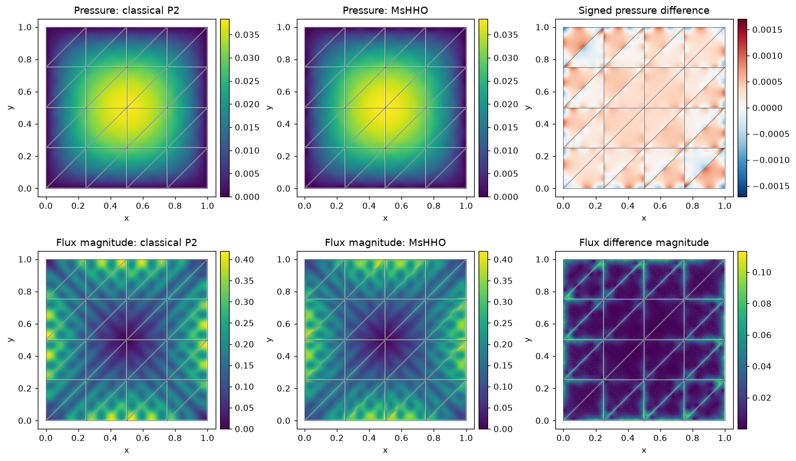

# MsHHO with multiscale permeability: from the problem to the API

Follow the numbered steps: state the variational problem, choose the local and trace spaces, declare the local and global equations, solve, and inspect the physical fields.

The main workflow is **meshes → spaces → local equations → global balance → assemble → solve → fields and errors**. `MeshHierarchy` associates macro and local meshes; `bind_interface` and `LocalContext` own supported numbering, geometric orientation and native coordinate conversions. The mathematical forms, physical trace meaning, local modes and gauge remain explicit in the cells below. Fully manual/custom spaces use the same numerical owners; see the [custom-interface notebook](https://github.com/ipes-lncc/pymhm/blob/main/notebooks/foundations/operators/custom_interface.ipynb).

We build a simple **Multiscale Hybrid High-Order** Darcy problem and explain every local and global block. All case definitions, equations, boundary conditions, reference solves, norms and plots are visible in this notebook. The weak operator is written in UFL. PyMHM provides generic compilation, trace pairings, constrained reconstruction and linear algebra.

The method family follows [Chaumont-Frelet, Ern, Lemaire and Valentin (2022)](https://doi.org/10.1051/m2an/2021082), sections 4–5. Their local spaces are defined by exactly solved PDEs. We use a finite local Galerkin realization on declared fine meshes. This original introductory problem is not a reproduction of an article figure or table.

Run with the installed package in a writable directory and the compatible native DOLFINx/UFL backend:

```bash
jupyter lab mshho_multiscale.ipynb
```

Prerequisites: a weak Poisson formulation, basic NumPy and Jupyter. Cell-defined providers are used in serial execution; process workers require importable callables.

Field evaluation, norms, plots and executed-array archives use the importable
[supporting scalar helpers](https://github.com/ipes-lncc/pymhm/blob/main/examples/introduction/scalar.py).
The physical data and local/global variational equations remain explicit below.


The PyMHM distribution contains only the library. The first cell explicitly
downloads a checksum-verified companion archive and prepares the declared data
using its local Python helpers. You can inspect these support files in `ROOT`.
Complete studies and historical replay retain their existing opt-in flags.

```python
from pathlib import Path
import os
import sys
from pymhm.io.workspace import workspace_from_archive

# Download verified support files; this operation does not execute them.
COMPANION_URL = "https://ipes-lncc.github.io/pymhm/downloads/937342f2a5cd48b07eac2fc37c42cca53979543a2577915021dec02c9fbd0849/mshho_multiscale-companion.zip"
COMPANION_SHA256 = "937342f2a5cd48b07eac2fc37c42cca53979543a2577915021dec02c9fbd0849"
WORKSPACE = Path(
    os.environ.get("PYMHM_WORKSPACE", Path.cwd() / ".pymhm-companions" / COMPANION_SHA256)
)
ROOT = workspace_from_archive(COMPANION_URL, sha256=COMPANION_SHA256, directory=WORKSPACE)
os.environ["PYMHM_WORKSPACE"] = str(ROOT)
if str(ROOT) not in sys.path:
    sys.path.insert(0, str(ROOT))

# Explicitly prepare declared data with the downloaded Python helpers.
from scripts.notebook_reproduction import notebook_workspace

ROOT = notebook_workspace("introduction/mshho_multiscale.ipynb", directory=ROOT)
root = ROOT
print("Workspace:", ROOT)


import numpy as np
import matplotlib.pyplot as plt
from typing import Any
from scipy import sparse
from threadpoolctl import threadpool_limits
from pymhm import Equation, LocalEquations, assemble
from pymhm import MeshHierarchy, LocalContext, bind_interface, bind_problem
from pymhm.core.equations import compile_form
from pymhm.fem.traces.interval import FaceSpace, SkeletonSpace
from examples.introduction.scalar import (
    plot_material,
    plot_reference_differences,
    plot_scalar_comparison,
    executed_array_digest,
    ScalarField,
    archive_cell,
    compare_scalar_fields,
    dirichlet_solve,
    native_scalar_space,
    save_scalar_report,
)
from pymhm.fem.scalar.triangle import nodal_space
from pymhm.meshes.triangle import TriangleMesh
from pymhm.backends.forms import assemble_pairing

plt.rcParams.update({"figure.dpi": 110, "font.size": 10})
from pymhm.core.moments import energy_reconstruction
```

### 1. The physical problem and its two scales

On $\Omega=(0,1)^2$, solve


$$
\begin{aligned}
 -\nabla\cdot(a_\varepsilon\nabla p)&=1 &&\text{in }\Omega,\\
 p&=0 &&\text{on }\partial\Omega,\\
 a_\varepsilon(x,y)&=2+
 \sin(2\pi x/\varepsilon)\sin(2\pi y/\varepsilon),
 &\varepsilon&=1/8,\\
 q&=-a_\varepsilon\nabla p.
\end{aligned}
$$


The bounds $1\le a_\varepsilon\le3$ give uniform ellipticity. Eight material oscillations fit in each direction. Our **macro mesh** has four squares per direction, split into 32 triangles. Each macrocell contains material variation that its geometry cannot resolve. Its independent local problem uses 16 subdivisions per macroedge. This reduces the global system while retaining fine local work.

`TriangleMesh` defines geometry. Below, we write and execute the form $\int_K a_\varepsilon\nabla u\cdot\nabla v$ and load $\int_K v$ in UFL before introducing optional assembly conveniences.


```python
epsilon = 1 / 8


def permeability(points: np.ndarray) -> np.ndarray:
    """Evaluate aε I through its positive scalar factor, with ε=1/8."""
    phase = 2 * np.pi * points / epsilon
    return 2 + np.sin(phase[:, 0]) * np.sin(phase[:, 1])


macro = TriangleMesh.unit_square(4)
source = 1.0
local_refinement = 16
assembly_order = 8
print(
    {
        "macro_triangles": len(macro.cells),
        "epsilon": epsilon,
        "H_max": float(macro.lengths.max()),
        "h_max": float(macro.lengths.max() / local_refinement),
        "ellipticity_bounds": [1.0, 3.0],
        "source": source,
    }
)
```

```text
{'macro_triangles': 32, 'epsilon': 0.125, 'H_max': 0.3535533905932738, 'h_max': 0.02209708691207961, 'ellipticity_bounds': [1.0, 3.0], 'source': 1.0}
```


```python
fig_material = plot_material(macro, permeability, resolution=64, limits=(1, 3))
plt.show()
```

[](../../assets/tutorials/mshho_multiscale/figure_4_0.png)


### 2. The unknowns are pressure moments

Choose $m=k_F=1$: three P1 volume moments per macrotriangle and two P1 moments per macroface. We store **integrals** rather than polynomial projection coefficients. The two coordinate systems are related by invertible polynomial mass matrices:


$$
\begin{aligned}
 z_{K,i}&=\int_K p_h r_{K,i},
 &r_K&=(1,\widehat x,\widehat y),\\
 z_{F,j}&=\int_F p_h\psi_{F,j},
 &\psi_F&=(1,2t-1).
\end{aligned}
$$


Here $\widehat x,\widehat y$ are Cartesian coordinates scaled to the macrocell bounding box. They span P1 on each triangle. Both incident macrocells share $z_F$; their complete fine nodal fields remain independent. Exterior face moments are zero by Dirichlet data.

`SkeletonSpace` numbers these face coordinates. Its name does not determine their physical meaning: **these are pressure moments**, not flux coefficients. Our local finite space is continuous P2; the moment constraints must be independent in that space.


```python
local_degree = 2
skeleton = SkeletonSpace(macro, tuple(FaceSpace.uniform(1) for _ in macro.faces))
fixed = {int(dof): 0.0 for face in macro.boundary_faces for dof in skeleton.dofs(int(face))}
global_free_unknowns = skeleton.size - len(fixed)
print(
    {
        "face_moments_total": skeleton.size,
        "face_moments_free": global_free_unknowns,
        "cell_moments_per_macrocell": 3,
        "local_polynomial_degree": local_degree,
    }
)
```

```text
{'face_moments_total': 112, 'face_moments_free': 80, 'cell_moments_per_macrocell': 3, 'local_polynomial_degree': 2}
```

### 3. Construct the local basis by constrained energy minimization

Let $A_K$ be the fine stiffness and $C_K$ the matrix of volume and face functionals. The reconstruction $R_K$ gives the minimum-energy field with prescribed moments:


$$
\begin{aligned}
 \begin{bmatrix}A_K&C_K\\C_K^T&0\end{bmatrix}
 \begin{bmatrix}R_K\\M_K\end{bmatrix}
 &=\begin{bmatrix}0\\I\end{bmatrix},\\
 C_K^TR_K&=I,
 &E_K&=R_K^TA_KR_K.
\end{aligned}
$$


The Neumann stiffness has the constant kernel. Independent moments fix it; the stiffness must also be coercive on the moment-zero space. A small residual alone does not prove these properties.

The P1 cell tests are represented exactly at P2 nodes, so `mass @ cell_tests` integrates their volume moments. The face functionals are written directly as `phi * v * ds` with UFL. The value interface binding owns their geometry and numbering: **pressure** moments have no normal-incidence sign. The volume coefficients use the native space binding's executed nodal convention.

`energy_reconstruction` solves the generic $A/C$ saddle above. It receives no physical-model or method selector. The constant source belongs to P1: in integral-moment coordinates the projected-source functional is simply $z_{K,0}$, hence load $(1,0,0)$ on cell coordinates and zero on face coordinates.


### Write the local differential operator in UFL

Define the trial pressure `p` and test pressure `v` on the local Pk space. The UFL expressions below are the executable weak form, mass pairing and source. Changing this expression defines a new local operator; the multiscale contracts do not select a physical model.


$$
a_K(p,v)=\int_K a_\varepsilon\nabla p\cdot\nabla v,
\qquad \ell_K(v)=\int_K v.
$$


The small geometry adapter keeps the same fine triangles and equispaced nodal basis. It maps native coefficients by their physical coordinates; it contains no PDE. `compile_form` assembles the expressions and releases native assembly resources. The interface pairing is introduced separately, with its declared normal convention.


```python
import basix.ufl
import ufl
from pymhm.backends.forms import assemble_pairing


def user_volume_forms(
    fine: TriangleMesh, degree: int, *, binding: Any = None
) -> tuple[Any, Any, np.ndarray]:
    """Execute the user-written weak operator, mass and source in the stated basis."""
    if binding is None:
        _, V, order = native_scalar_space(fine, degree)
    else:
        V, order = binding.space, binding.mapping
    p, v = ufl.TrialFunction(V), ufl.TestFunction(V)
    x = ufl.SpatialCoordinate(V.mesh)
    a_epsilon = 2 + ufl.sin(2 * np.pi * x[0] / epsilon) * ufl.sin(2 * np.pi * x[1] / epsilon)
    dx = ufl.Measure("dx", domain=V.mesh, metadata={"quadrature_degree": 2 * assembly_order})
    a = a_epsilon * ufl.inner(ufl.grad(p), ufl.grad(v)) * dx
    mass = p * v * dx
    L = source * v * dx
    A, M, F = compile_form(a), compile_form(mass), compile_form(L)
    return A[order][:, order].tocsc(), M[order][:, order].tocsc(), F[order]
```

```python
first_fine = macro.submesh(0, local_refinement)
A_ufl, M_ufl, F_ufl = user_volume_forms(first_fine, local_degree)
print(
    {
        "operator": "user-written UFL",
        "local_nodal_unknowns": A_ufl.shape[0],
        "constant_kernel_relative": float(
            np.linalg.norm(A_ufl @ np.ones(A_ufl.shape[0])) / sparse.linalg.norm(A_ufl)
        ),
    }
)
form_equivalence = {}  # Filled by the optional convenience check at the end.
```

```text
{'operator': 'user-written UFL', 'local_nodal_unknowns': 561, 'constant_kernel_relative': 3.6207041887734765e-16}
```


```python
def local_moment_equations(local: LocalContext) -> LocalEquations:
    """Declare MsHHO P1 cell/face moments on a local conforming P2 space."""
    cell, fine = local.cell, local.mesh
    binding = local.native_space(
        basix.ufl.element(
            "Lagrange",
            "triangle",
            local_degree,
            lagrange_variant=basix.LagrangeVariant.equispaced,
        )
    )
    stiffness, mass, force = user_volume_forms(fine, local_degree, binding=binding)
    _, nodes = nodal_space(fine, local_degree)
    vertices = macro.points[macro.cells[cell]]
    scaled_xy = 2 * (nodes - vertices.min(axis=0)) / np.ptp(vertices, axis=0) - 1
    cell_tests = np.column_stack((np.ones(len(nodes)), scaled_xy))
    volume_moments = mass @ cell_tests
    v = ufl.TestFunction(binding.space)
    face_functionals = local.trace_pairings(lambda phi, ds: phi * v * ds)
    face_moments = assemble_pairing(face_functionals.forms, axis="columns")[binding.mapping]
    moments = np.column_stack((volume_moments, face_moments))
    reconstruction, energy = energy_reconstruction(stiffness, moments)

    # The declared source is constant. Since the first cell moment is
    # integral_K p, its load coordinate is source; all other coordinates vanish.
    moment_load = np.r_[source, np.zeros(moments.shape[1] - 1)]
    ncell = volume_moments.shape[1]
    return local.equations(
        a=energy[:ncell, :ncell],
        L=moment_load[:ncell],
        b=energy[:ncell, ncell:],
        c=energy[ncell:, :ncell],
        coordinates="global",
        d=energy[ncell:, ncell:],
        g=moment_load[ncell:],
        metadata={
            "mesh": fine,
            "R": reconstruction,
            "C": moments,
            "A": stiffness,
            "F": force,
            "energy": energy,
        },
    )
```

### 4. The global problem contains face moments

Partition $E_K$ into cell ($c$) and face ($F$) blocks. The projected-source formulation becomes


$$
\begin{aligned}
 E_{cc}z_K+E_{cF}z_{\partial K}&=(1,0,0)^T,\\
 \sum_K\big(E_{Fc}z_K+E_{FF}z_{\partial K}\big)&=0.
\end{aligned}
$$


These are exactly `LocalEquations`: `a,L,b` define the first equation; `c,d,g` contribute the second. `assemble` eliminates the three cell moments and adds shared face contributions.

`Equation(0, zeros)` supplies no additional global term. `retained=0` retains no extra modes: the fine stiffness kernel has already been fixed in the constrained reconstruction, and cell moments are ordinary eliminated local unknowns. Prescribed exterior pressure moments remove the global pressure gauge.

After solving, `solution.fields` contains **cell moments**. Multiplying the complete local moment vector by the executed $R_K$ recovers physical nodal pressure. The small field record below only associates coefficients with their declared mesh and Pk basis; it is not a solver.


```python
hierarchy = MeshHierarchy(
    macro, tuple(macro.submesh(cell, local_refinement) for cell in range(len(macro.cells)))
)
problem = bind_problem(
    hierarchy,
    bind_interface(skeleton, convention="value"),
    local_moment_equations,
    global_equation=Equation(0, 0),
    retained=0,
    fixed=fixed,
)
with threadpool_limits(1):
    system = assemble(problem)
    solution = system.solve()

# solution.fields contains cell moments, not physical nodal pressures.
physical_fields = tuple(
    ScalarField(
        data["mesh"], local_degree, data["R"] @ np.r_[cell_moments, solution.local_trace(cell)]
    )
    for cell, (data, cell_moments) in enumerate(
        zip(system.local_metadata, solution.fields, strict=True)
    )
)
print(
    {
        "global_free_unknowns": global_free_unknowns,
        "global_residual": solution.residual,
        "local_nodal_unknowns_per_macrocell": len(physical_fields[0].values),
    }
)
```

```text
{'global_free_unknowns': 80, 'global_residual': 7.994602283557082e-17, 'local_nodal_unknowns_per_macrocell': 561}
```

### 5. Check the kernel and the executed moment basis

Check $A_K1=0$, $C_K^TR_K=I$, and the moments of the recovered pressure. Full pressure may jump across a macroface; its P1 face moments agree.

The finite local Galerkin realization does not automatically inherit the ideal article space's $H(\mathrm{div})$ flux property. We report the raw physical flux $-a_\varepsilon\nabla p_h$ inside each fine element and do not assert fine-cell conservation.

Archive each executed $R_K$ with its SHA256 digest and the complete moment vector. Field replay uses that same matrix; persisted moment coefficients must not be applied to a numerically changed basis.

The physical reconstruction reads `solution.local_trace(cell)`: the bound space supplies the executed local face coefficients, including any declared basis changes. The value convention used here has no outward-normal sign. The method's reconstruction matrix remains an explicit part of its mathematical definition.


```python
diagnostics = {
    "constant_kernel_relative": 0.0,
    "moment_identity_max": 0.0,
    "recovered_moment_max": 0.0,
}
basis_digests = []
archive = {"macro_points": macro.points, "macro_cells": macro.cells, "face_moments": solution.trace}
for cell, (data, field, cell_moments) in enumerate(
    zip(system.local_metadata, physical_fields, solution.fields, strict=True)
):
    A, C, R = data["A"], data["C"], data["R"]
    target = np.r_[cell_moments, solution.local_trace(cell)]
    diagnostics["constant_kernel_relative"] = max(
        diagnostics["constant_kernel_relative"],
        float(np.linalg.norm(A @ np.ones(A.shape[0])) / np.linalg.norm(A.data)),
    )
    diagnostics["moment_identity_max"] = max(
        diagnostics["moment_identity_max"],
        float(np.max(abs(C.T @ R - np.eye(C.shape[1])))),
    )
    diagnostics["recovered_moment_max"] = max(
        diagnostics["recovered_moment_max"],
        float(np.max(abs(C.T @ field.values - target))),
    )
    basis_digests.append(executed_array_digest(R))
    archive_cell(archive, cell, field, reconstruction=R, moments=C, moment_coordinates=target)
assert max(diagnostics.values()) < 1e-10
print(diagnostics)
```

```text
{'constant_kernel_relative': 3.644021074115437e-16, 'moment_identity_max': 2.4424906541753444e-15, 'recovered_moment_max': 2.8189256484623115e-18}
```

### 6. A classical primal Galerkin baseline, with its own refinement check

On a fine **globally conforming** mesh, the baseline solves the same operator, material, source and boundary conditions:


$$
\begin{aligned}
 p_{\mathrm{CG}}&\in V_{\mathrm{CG}}\subset H_0^1(\Omega),\\
 (a_\varepsilon\nabla p_{\mathrm{CG}},\nabla v)_\Omega
   &=(1,v)_\Omega,\qquad v\in V_{\mathrm{CG}}.
\end{aligned}
$$


Use P2 on 32, 64 and 128 squares per direction, each split into two triangles. Assembly and boundary identification are visible below; `solve_linear` owns the free algebraic solve. This classical global assembly is separate from multiscale condensation. Both use DOLFINx/UFL with the same weak form; their global assembly procedures and boundary spaces are separate.

The finest classical field is a **numerical reference**, not an exact solution. First compare 32→64 and 64→128 in physical norms. The plotted difference rate is a reference-resolution indicator; two consecutive differences do not constitute a rigorous reference-error bound.


```python
references = []
reference_dimensions = []
for resolution in (32, 64, 128):
    fine_global = TriangleMesh.unit_square(resolution)
    A_ref, _, F_ref = user_volume_forms(fine_global, 2)
    _, xy = nodal_space(fine_global, 2)
    boundary = np.flatnonzero(np.any(np.isclose(xy, 0) | np.isclose(xy, 1), axis=1))
    p_ref = dirichlet_solve(A_ref, F_ref, boundary, np.zeros(len(boundary)))
    references.append(ScalarField(fine_global, 2, p_ref))
    reference_dimensions.append(
        {
            "squares_per_direction": resolution,
            "triangles": len(fine_global.cells),
            "free_unknowns": len(p_ref) - len(boundary),
        }
    )
    print(reference_dimensions[-1])
reference = references[-1]
```

```text
{'squares_per_direction': 32, 'triangles': 2048, 'free_unknowns': 3969}
```

```text
{'squares_per_direction': 64, 'triangles': 8192, 'free_unknowns': 16129}
```

```text
{'squares_per_direction': 128, 'triangles': 32768, 'free_unknowns': 65025}
```


```python
reference_refinement = [
    compare_scalar_fields((coarser,), finer, permeability, order=8)
    for coarser, finer in zip(references[:-1], references[1:])
]
for interval, norms in zip(("32 → 64", "64 → 128"), reference_refinement):
    print(interval, norms)

# These rates concern differences between successive reference meshes.
# They are indicators, not exact-solution error rates.
refinement_figure = plot_reference_differences(
    [1 / 64, 1 / 128],
    reference_refinement,
)

plt.show()

# A reference must resolve its own physical fields before serving as a baseline.
assert reference_refinement[-1]["pressure_relative"] < reference_refinement[0]["pressure_relative"]
assert reference_refinement[-1]["flux_relative"] < reference_refinement[0]["flux_relative"]
```

```text
32 → 64 {'pressure_L2': 3.823696684608936e-05, 'flux_L2': 0.0073346478106178165, 'flux_energy': 0.005272480435871399, 'pressure_relative': 0.0018001151790877515, 'flux_relative': 0.03838323140026158, 'energy_relative': 0.03921980440020735}
64 → 128 {'pressure_L2': 3.7669518113256023e-06, 'flux_L2': 0.0021132796164602475, 'flux_energy': 0.0015405697662049793, 'pressure_relative': 0.00017731712073356501, 'flux_relative': 0.011059633117206041, 'energy_relative': 0.011458909837941546}
```


[](../../assets/tutorials/mshho_multiscale/figure_18_1.png)


### 7. Compare pressure and physical flux on a common fine partition

The reference mesh resolves every local mesh interface in this nested, uniformly refined case. Integrate on its triangles and use its field norms as denominators:


$$
\begin{aligned}
 e_p&=\frac{\lVert p_h-p_{\mathrm{ref}}\rVert_{L^2(\Omega)}}
                {\lVert p_{\mathrm{ref}}\rVert_{L^2(\Omega)}},\\
 e_q&=\frac{\lVert q_h-q_{\mathrm{ref}}\rVert_{L^2(\Omega)}}
                {\lVert q_{\mathrm{ref}}\rVert_{L^2(\Omega)}},\\
 e_E&=\frac{\lVert a_\varepsilon^{-1/2}(q_h-q_{\mathrm{ref}})\rVert_{L^2(\Omega)}}
                {\lVert a_\varepsilon^{-1/2}q_{\mathrm{ref}}\rVert_{L^2(\Omega)}}.
\end{aligned}
$$


The comparison code keeps the coefficient inside flux and energy norms. Quadrature orders 8 and 10 independently check norm integration. At volume quadrature points, evaluate the original coefficients directly; do not compare images or interpolated color maps.

For plotting, sample every fine triangle separately. Duplicate interface points retain separate incident values. Pressure and flux-magnitude panels share scales with their reference panels; each difference has its own colorbar. All panels show the actual macro mesh.


```python
errors_q8 = compare_scalar_fields(physical_fields, reference, permeability, order=8)
errors_q10 = compare_scalar_fields(physical_fields, reference, permeability, order=10)
quadrature_difference = max(
    abs(errors_q8[key] - errors_q10[key]) / max(abs(errors_q10[key]), np.finfo(float).tiny)
    for key in ("pressure_L2", "flux_L2", "flux_energy")
)
print(
    {"physical_relative_errors": errors_q10, "relative_norm_change_q8_q10": quadrature_difference}
)
assert quadrature_difference < 1e-5

figure = plot_scalar_comparison(
    macro,
    physical_fields,
    reference,
    permeability,
    numerical_label="MsHHO",
)
plt.show()
```

```text
{'physical_relative_errors': {'pressure_L2': 0.000349696801857094, 'flux_L2': 0.022527859850014417, 'flux_energy': 0.01575881879143392, 'pressure_relative': 0.016460850348179897, 'flux_relative': 0.1178972545404677, 'energy_relative': 0.11721564816135271}, 'relative_norm_change_q8_q10': 1.860243788438027e-15}
```


[](../../assets/tutorials/mshho_multiscale/figure_20_1.png)


### 8. Interpret and archive the experiment

Compare the 80 free global face coordinates with the refined Galerkin dimension. Inspect the flux oscillations **inside** the coarse triangles. Measured errors include macro approximation and finite local resolution; fewer global unknowns alone do not establish lower total computational cost.

To change the problem, alter the coefficient, source and boundary moments first, then rerun the moment and reference-refinement checks. To resolve local material more accurately, increase `local_refinement`. To enrich the macro approximation, change cell and face moment tests consistently. The ideal equivalence and convergence results of the article require their own local-space hypotheses; this finite Galerkin example does not claim them automatically.

Save the numerical record, physical coefficients, moment vectors and executed reconstruction matrices. Source notebooks remain output-free; their executed versions are written under `build/notebooks/introduction/`.


## Optional: use a prepared operator for this weak form

For the scalar diffusion form written above, `scalar_operators` provides a
portable Basix assembly convenience. Defining a new physical operator does not
require this function: the main computation already assembles the UFL expression
written by the user. The following check verifies agreement in the same local
finite-element space and basis before substituting this convenience.


```python
from pymhm.fem.scalar.triangle import scalar_operators

A_prepared, M_prepared, F_prepared = scalar_operators(
    first_fine,
    local_degree,
    diffusion=permeability,
    source=source,
    order=assembly_order,
)
form_equivalence = {
    "stiffness_relative": float(
        sparse.linalg.norm(A_ufl - A_prepared) / sparse.linalg.norm(A_prepared)
    ),
    "mass_relative": float(sparse.linalg.norm(M_ufl - M_prepared) / sparse.linalg.norm(M_prepared)),
    "source_relative": float(np.linalg.norm(F_ufl - F_prepared) / np.linalg.norm(F_prepared)),
}
assert max(form_equivalence.values()) < 1e-10
print(form_equivalence)
```

```text
{'stiffness_relative': 1.6755633221035159e-15, 'mass_relative': 1.410965141920348e-15, 'source_relative': 1.0931848206312767e-15}
```


```python
record = {
    "method": "MsHHO",
    "physical_problem": f"-div(aε grad(p))={source:g}, p|boundary=0",
    "source": float(source),
    "epsilon": epsilon,
    "macro_triangles": len(macro.cells),
    "local_refinement": local_refinement,
    "local_degree": local_degree,
    "assembly_order": assembly_order,
    "error_orders": [8, 10],
    "global_free_unknowns": global_free_unknowns,
    "reference_dimensions": reference_dimensions,
    "reference_refinement": reference_refinement,
    "physical_errors": errors_q10,
    "quadrature_relative_difference": quadrature_difference,
    "global_residual": solution.residual,
    "diagnostics": diagnostics,
    "basis_digests": basis_digests,
    "form_equivalence": form_equivalence,
}
print(
    save_scalar_report(
        ROOT,
        "mshho_multiscale",
        record,
        archive,
        {
            "physical-fields": figure,
            "permeability": fig_material,
            "reference-refinement": refinement_figure,
        },
    )
)
```

```text
./build/introduction/mshho_multiscale
```

## References

- Théophile Chaumont-Frelet, Alexandre Ern, Simon Lemaire, and Frédéric Valentin (2022). *Bridging the Multiscale Hybrid-Mixed and Multiscale Hybrid High-Order Methods*, ESAIM: M2AN 56, 261–285. [DOI: 10.1051/m2an/2021082](https://doi.org/10.1051/m2an/2021082).

## Reproduce this tutorial

[View the source notebook](https://github.com/ipes-lncc/pymhm/blob/main/notebooks/introduction/mshho_multiscale.ipynb) or [download the notebook](https://raw.githubusercontent.com/ipes-lncc/pymhm/main/notebooks/introduction/mshho_multiscale.ipynb), then open it:

```bash
python -m pip install 'pymhm[notebooks,visualization]'
jupyter lab mshho_multiscale.ipynb
```

The first cell explicitly downloads a SHA256-verified companion archive. Acquisition does not execute its code. The local support files are inspectable in the printed `ROOT` directory; the following helper call prepares only the declared inputs. The library distribution contains only `pymhm`. Notebooks, support code and data are separate downloads. Native UFL forms require the compatible DOLFINx/UFL backend described in the [installation guide](../../installation.md). A clone and Pixi are unnecessary.

For batch execution, extract the same companion, change to its workspace, and use its local runner with the actual downloaded notebook path:

```bash
python -m scripts.run_notebooks /path/to/mshho_multiscale.ipynb --timeout 7200
```

The runner uses the active Python interpreter and writes an executed copy and receipt under `build/notebooks/introduction/`. Larger data and field archives have [documented download links](../../data.md) and verified checksums.

The displayed figures and numerical outputs correspond to the retained validated execution of notebook SHA256 `59d1fd79d93fb18b8aabcba3cf817ad34ba080eb07ec99370a05c422c7f449ab` in the [publication manifest](manifest.json). Current instructions use the separately downloaded local `examples` and `scripts` support modules. Running the current source produces a separate receipt for its actual notebook, support bytes and environment. Timings describe the recorded hardware and solver settings; measure your own environment on an idle machine.
