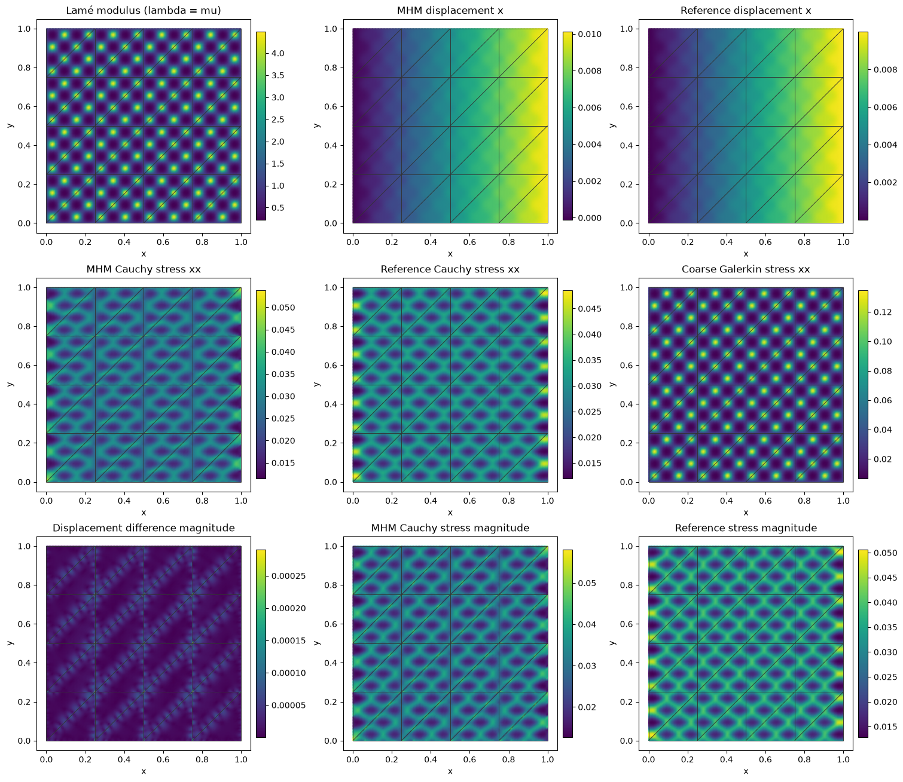

# Multiscale elasticity: resolve material structure through local equations

Follow the numbered steps: state the variational problem, choose the local and trace spaces, declare the local and global equations, solve, and inspect the physical fields.

Build a plane-strain primal MHM model explicitly with UFL energy forms, `LocalEquations`, a global `Equation`, and `MultiscaleProblem`. A heterogeneous solid under horizontal extension creates nonuniform strains that a small classical mesh misses. MHM keeps a small global mesh while resolving the material inside each macroelement.

The baseline is separately assembled classical conforming displacement Galerkin, on three successively refined meshes. There is no analytical solution for this physical case. We measure the baseline's own refinement in displacement and physical Cauchy stress before comparing methods.

Start with `pixi run --locked -e introduction jupyter lab` in the repository root. Every physical coefficient, form, local kernel, coordinate map, reference, evaluation and plot is defined below. Optional DOLFINx/UFL imports belong to this notebook environment; the portable PyMHM core does not import them.

The local rigid-motion complement and global traction coupling follow [Harder, Madureira and Valentin (2016)](https://doi.org/10.1051/m2an/2015046). The oscillatory material and extension loading define an original application here.


```python
from pathlib import Path
import sys
from dataclasses import dataclass
from typing import Any, Sequence, Mapping
import numpy as np
from numpy.typing import NDArray
from scipy import sparse
from scipy.spatial import cKDTree
from matplotlib.collections import LineCollection
import matplotlib.pyplot as plt
import ufl

ROOT = next(p for p in (Path.cwd(), *Path.cwd().parents)
            if (p / "pyproject.toml").is_file() and (p / "src/pymhm").is_dir())
if str(ROOT) not in sys.path:
    sys.path.insert(0,str(ROOT))

from pymhm import Equation, LocalEquations, MultiscaleProblem, assemble, columns
from pymhm.core.equations import compile_form
from pymhm.execution.cpu import ExecutionConfig
from pymhm.meshes.triangle import TriangleMesh
from pymhm.meshes.cartesian import CartesianMacroMesh
from pymhm.fem.scalar.triangle import nodal_space, reference_basis, trace_coupling
from pymhm.fem.scalar.operators import p1_geometry, boundary_data, triangle_quadrature
from pymhm.fem.scalar.quadrilateral import quadrilateral_quadrature
from pymhm.fem.traces.interval import FaceSpace, SkeletonSpace
from pymhm.linalg.linear import solve_linear

Array = NDArray[np.float64]
```

## 1. Declare the material and physical loading

On the unit square, impose a one-percent horizontal extension on the whole exterior, with no body force:


$$
-\nabla\cdot\sigma=0,\qquad
\sigma=2\mu\varepsilon(\boldsymbol u)+\lambda\operatorname{div}(\boldsymbol u)I,
\qquad\boldsymbol u_D=(0.01x,0).
$$


Here $\varepsilon(\boldsymbol u)=(\nabla\boldsymbol u+\nabla\boldsymbol u^T)/2$. Use a smooth material with short wavelength and Lamé-modulus contrast $e^3\simeq20.1$:


$$
\lambda(x,y)=\mu(x,y)=\exp\!\left(1.5\sin(16\pi x)\sin(16\pi y)\right).
$$


The material wavelength is $1/8$. Taking $\lambda=\mu$ gives Poisson ratio $1/4$ in plane strain, so this case isolates multiscale heterogeneity rather than near-incompressibility. The stiffness is uniformly positive on symmetric strains. Both methods solve the same tensor, domain and boundary values.


```python
def micro_modulus(points: Array) -> Array:
    """Return smooth plane-strain Lamé values in [exp(-1.5),exp(1.5)], wavelength 1/8.

    Both lambda and mu equal this value, hence Poisson ratio is 1/4 and
    heterogeneity is separated from near-incompressibility and locking.
    """
    return np.exp(1.5 * np.sin(16 * np.pi * points[:, 0]) * np.sin(16 * np.pi * points[:, 1]))

def extension_boundary(points: Array) -> Array:
    """Prescribe a one-percent horizontal extension, with zero vertical displacement."""
    return np.column_stack((0.01 * points[:, 0], np.zeros(len(points))))
```


```python
macro = TriangleMesh.unit_square(4)
local_degree, local_refinement, trace_segments = 3, 16, 4
skeleton = SkeletonSpace(
    macro, tuple(FaceSpace.uniform(1,trace_segments) for _ in macro.faces), components=2)
print({"macro_triangles": len(macro.cells), "material_wavelength": 1/8,
       "material_contrast": float(np.exp(3.)), "local_degree": local_degree,
       "local_refinement": local_refinement, "trace_degree": 1,
       "trace_segments": trace_segments})
```

```text
{'macro_triangles': 32, 'material_wavelength': 0.125, 'material_contrast': 20.085536923187668, 'local_degree': 3, 'local_refinement': 16, 'trace_degree': 1, 'trace_segments': 4}
```

## 2. Keep native and portable coefficient coordinates explicit

DOLFINx assembles UFL in its own nodal order. PyMHM trace kernels use the portable equispaced `nodal_space` order. The coordinate map below checks a bijection before translating vector pairings and reconstructed coefficients. Two displacement components are interleaved at each scalar node.

The mesh is the actual independent local refinement of a macro triangle. No global refined mesh is passed to MHM. Native forms use `MPI.COMM_SELF`; the generic form compiler copies their assembled arrays and releases native assembly resources.


```python
def native_vector_space(mesh: TriangleMesh, degree: int) -> tuple[Any, Any, NDArray[np.int64]]:
    """Create serial native equispaced Pk vectors and map the portable nodal basis.

    ``mapping[portable_vector_dof]`` is its native vector coefficient index.
    Components are interleaved at each scalar node in both conventions. A
    bijection and physical coordinate equality are checked before use.
    """
    import basix
    import basix.ufl
    import ufl
    from dolfinx import fem, mesh as native_mesh
    from mpi4py import MPI

    coordinate_element = basix.ufl.element("Lagrange", "triangle", 1, shape=(2,))
    domain = native_mesh.create_mesh(
        MPI.COMM_SELF, mesh.cells, mesh.points, ufl.Mesh(coordinate_element)
    )
    element = basix.ufl.element(
        "Lagrange", "triangle", degree,
        lagrange_variant=basix.LagrangeVariant.equispaced, shape=(2,)
    )
    space = fem.functionspace(domain, element)
    _, points = nodal_space(mesh, degree)
    native_points = space.tabulate_dof_coordinates()[:, :2]
    distances, scalar_map = cKDTree(native_points).query(points)
    tolerance = 512 * np.finfo(float).eps * max(1., np.max(np.abs(points)))
    if np.any(distances > tolerance) or len(np.unique(scalar_map)) != len(points):
        raise ValueError("native and portable equispaced coordinate bases are not bijective")
    if space.dofmap.index_map_bs != 2 or len(native_points) != len(points):
        raise ValueError("the native space must have interleaved two-component nodal blocks")
    mapping = (2 * scalar_map[:, None] + np.arange(2)).reshape(-1)
    return domain, space, mapping

def rigid_modes(points: Array, center: Array) -> Array:
    """Return two translations and centered counterclockwise rotation, shape (n,2,3)."""
    modes = np.zeros((len(points), 2, 3))
    modes[:, :, :2] = np.eye(2)
    modes[:, 0, 2] = -(points[:, 1] - center[1])
    modes[:, 1, 2] = points[:, 0] - center[0]
    return modes
```

## 3. Derive each local equation and identify its kernel

Integration by parts yields


$$
\int_T \left[2\mu\varepsilon(\boldsymbol u):\varepsilon(\boldsymbol v)
+\lambda\operatorname{div}\boldsymbol u\operatorname{div}\boldsymbol v\right]
-\langle\sigma\boldsymbol n_T,\boldsymbol v\rangle_{\partial T}=0.
$$


Declare the skeletal multiplier $\boldsymbol\lambda=-\sigma\boldsymbol n_F$: it is **negative physical Cauchy traction** in the unique macroface orientation. Thus the local equation is $A_T\boldsymbol u+B_T\boldsymbol\lambda=0$, with the signed trace map $B_T$.

The local energy has three exact rigid modes: translations $(1,0)$ and $(0,1)$, and centered rotation $(-(y-y_T),x-x_T)$. Their physical $L^2$ moments select a unique response in the complement, while three retained coordinates represent the rigid component. We declare these modes, rather than infer them from a numerically rotated nullspace.

The trace contains the restrictions of rigid motions: degree one. The local degree is three. [Harder, Madureira and Valentin (2016), Lemma 6.6](https://doi.org/10.1051/m2an/2015046) give the sufficient rule $k\ge\ell+2$ for odd-degree traces on a single triangular local element. Our refined and segmented spaces differ from that single-element setting, so the rule alone is not their stability theorem. Segments align with the fine boundary and each covers four fine edges. We additionally check the rank of the actual trace pairing; an algebraic residual alone would not establish compatibility.

| Weak-form term | Visible code |
| --- | --- |
| $2\mu\varepsilon(u):\varepsilon(v)+\lambda\operatorname{div}u\operatorname{div}v$ | UFL expression `a` |
| $\langle s_{TF}\lambda,v\rangle$ | signed `trace_coupling`, then native coordinate map |
| Rigid kernel | `kernel` |
| Physical rigid moments | `columns` of UFL linear forms |
| Global displacement continuity | `c=-b.T` |


```python
@dataclass(frozen=True)
class ElasticityLocalProvider:
    """Declare primal plane-strain local energy and its global trace-test rows."""
    macro: TriangleMesh
    skeleton: SkeletonSpace
    degree: int
    refinement: int
    quadrature_degree: int = 16

    def __call__(self, cell: int) -> LocalEquations:
        """Declare plane-strain UFL energy, negative Cauchy traction and rigid moments."""
        fine = self.macro.submesh(cell,self.refinement)
        domain, space, mapping = native_vector_space(fine,self.degree)
        u,v = ufl.TrialFunction(space),ufl.TestFunction(space)
        x = ufl.SpatialCoordinate(domain)
        mu = ufl.exp(1.5*ufl.sin(16*np.pi*x[0])*ufl.sin(16*np.pi*x[1]))
        lam = mu
        dx = ufl.Measure("dx",domain=domain,
                         metadata={"quadrature_degree":self.quadrature_degree})
        # This is exactly the physical energy written above.
        a = (2*mu*ufl.inner(ufl.sym(ufl.grad(u)),ufl.sym(ufl.grad(v)))
             +lam*ufl.div(u)*ufl.div(v))*dx
        _,nodes = nodal_space(fine,self.degree)
        center = self.macro.points[self.macro.cells[cell]].mean(axis=0)
        portable_kernel = rigid_modes(nodes,center).reshape(-1,3)
        kernel = np.empty_like(portable_kernel);kernel[mapping]=portable_kernel
        rigid = (ufl.as_vector((1.,0.)),ufl.as_vector((0.,1.)),
                 ufl.as_vector((-(x[1]-center[1]),x[0]-center[0])))
        moments = columns(*(ufl.inner(v,mode)*dx for mode in rigid))
        portable_b = np.kron(trace_coupling(
            self.macro,cell,fine,self.skeleton,self.degree),np.eye(2))
        b = np.empty_like(portable_b);b[mapping]=portable_b
        return LocalEquations(
            a=a,L=np.zeros(len(mapping)),b=b,c=-b.T,
            dofs=self.skeleton.cell_dofs(cell),kernel=kernel,moments=moments,
            metadata=(fine,mapping))
```

## 4. Declare the global displacement equation and solve

The global weak equation imposes displacement-jump moments on interior macrofaces and prescribed displacement moments on the exterior. With $C=-B^T$, its additional load is $-\langle\boldsymbol\mu,\boldsymbol u_D\rangle_{\partial\Omega}$. Full displacement data remove the three global rigid ambiguities, so no additional physical gauge is required.

Only the macroface and three retained rigid coordinates per macroelement enter the global matrix. The local fields are recovered in their executed native basis, then mapped to the portable nodal representation for physical evaluation.


```python
boundary,fixed = boundary_data(skeleton,extension_boundary,order=8)
provider = ElasticityLocalProvider(macro,skeleton,local_degree,local_refinement)
problem = MultiscaleProblem(
    Equation(0,np.r_[-boundary,np.zeros(3*len(macro.cells))]),provider,
    range(len(macro.cells)),skeleton.size,(3,)*len(macro.cells),fixed=fixed)
system = assemble(problem,execution=ExecutionConfig("serial",native_threads=1))
solution = system.solve()
local_meshes = tuple(record[0] for record in system.local_metadata)
local_values = tuple(field[record[1]].reshape(-1,2)
                     for field,record in zip(solution.fields,system.local_metadata,strict=True))
print({"global_unknowns":system.matrix.shape[0],
       "largest_local_unknowns":max(len(field) for field in solution.fields),
       "original_equations_relative_residual":solution.raw_residual})
first_local=system.responses[0].problem
singular_values=np.linalg.svd(first_local.coupling,compute_uv=False)
print({"local_trace_pairing_smallest_singular_value":float(singular_values[-1]),
       "local_trace_pairing_condition":float(singular_values[0]/singular_values[-1])})
assert singular_values[-1]>1e-12*singular_values[0]
```

```text
{'global_unknowns': 992, 'largest_local_unknowns': 2450, 'original_equations_relative_residual': 3.0752561574997656e-16}
{'local_trace_pairing_smallest_singular_value': 0.010000445141455936, 'local_trace_pairing_condition': 2.585612165689401}
```

## 5. Physical evaluation and norms in the executed bases

The evaluators below locate points in the original triangular connectivity and use the package's Basix basis tables. Separate local fields retain one-sided macroface values. The physical stress is recomputed from the **same** material and symmetric strain, without smoothing.

Measure displacement in $L^2$, Cauchy stress in Frobenius $L^2$, and the strain-energy difference:


$$
\left(\int_\Omega
2\mu\varepsilon(\boldsymbol e_u):\varepsilon(\boldsymbol e_u)
+\lambda(\operatorname{div}\boldsymbol e_u)^2\right)^{1/2}.
$$


Raw primal stress is symmetric but is not claimed to belong to $H(\mathrm{div})$ or to equilibrate every fine cell. Skeletal rigid equations impose macro force and moment compatibility.


```python
@dataclass
class TriangleVectorEvaluator:
    """Evaluate a conforming Pk vector in its executed portable nodal basis.

    A four-candidate cell locator is used for the uniform right-triangle
    meshes of these examples. An interface selects one cell without averaging.
    Displacement gradients have axes (point, component, derivative).
    """

    mesh: TriangleMesh
    degree: int
    coefficients: Array

    def __post_init__(self) -> None:
        """Cache topology and affine barycentric maps without native FEM resources."""
        self.dofs, _ = nodal_space(self.mesh, self.degree)
        self.geometry, _ = p1_geometry(self.mesh)
        vertices = self.mesh.points[self.mesh.cells]
        self.origins = vertices[:,0]
        edges = (vertices[:,1:]-vertices[:,:1]).swapaxes(1,2)
        self.inverse = np.linalg.inv(edges)
        self.locator = cKDTree(vertices.mean(axis=1))

    def barycentric_coordinates(self, points: Array, candidates: NDArray[np.int64]) -> Array:
        """Map translated XY points to barycentric coordinates of candidate triangles."""
        relative = points[:,None,:]-self.origins[candidates]
        local = np.einsum("qkba,qka->qkb", self.inverse[candidates], relative)
        return np.concatenate(((1-local.sum(axis=2))[...,None],local),axis=2)

    def __call__(self, points: Array) -> tuple[Array, Array]:
        """Return displacement and raw gradient at XY points in this mesh."""
        _, candidates = self.locator.query(points, k=min(4, len(self.mesh.cells)))
        candidates = np.asarray(candidates).reshape(len(points), -1)
        bary = self.barycentric_coordinates(points,candidates)
        valid = np.min(bary, axis=2) >= -1e-10
        if not np.all(np.any(valid, axis=1)):
            raise ValueError("evaluation point is outside the declared uniform triangle mesh")
        selected = np.argmax(valid, axis=1)
        owners = candidates[np.arange(len(points)), selected]
        bary = bary[np.arange(len(points)), selected]
        basis, derivative, _ = reference_basis(self.degree, bary)
        gradient = np.einsum("qia,qab->qib", derivative, self.geometry[owners])
        local = self.coefficients[self.dofs[owners]]
        return np.einsum("qi,qia->qa", basis, local), np.einsum("qia,qib->qab", local, gradient)

@dataclass
class BrokenVectorEvaluator:
    """Evaluate independent macrocell vectors, retaining one-sided interface values."""

    macro: TriangleMesh
    local_evaluators: tuple[TriangleVectorEvaluator, ...]

    def __post_init__(self) -> None:
        """Build a locator on the actual macro triangles."""
        self.selector = TriangleVectorEvaluator(self.macro, 1, np.zeros((len(self.macro.points), 2)))

    def __call__(self, points: Array) -> tuple[Array, Array]:
        """Return the displacement and gradient of each point's owning macro triangle."""
        candidates = self.selector.locator.query(points, k=min(4, len(self.macro.cells)))[1]
        candidates = np.asarray(candidates).reshape(len(points), -1)
        bary = self.selector.barycentric_coordinates(points,candidates)
        valid = np.min(bary, axis=2) >= -1e-10
        if not np.all(np.any(valid, axis=1)):
            raise ValueError("evaluation point lies outside the macro mesh")
        owners = candidates[np.arange(len(points)), np.argmax(valid, axis=1)]
        value, gradient = np.empty((len(points), 2)), np.empty((len(points), 2, 2))
        for owner in np.unique(owners):
            selected = owners == owner
            value[selected], gradient[selected] = self.local_evaluators[owner](points[selected])
        return value, gradient

def cauchy_stress(points: Array, gradient: Array) -> Array:
    """Return symmetric plane-strain stress with lambda=mu=micro_modulus."""
    modulus = micro_modulus(points)
    return modulus[:, None, None] * (
        gradient + gradient.swapaxes(1, 2)
        + np.trace(gradient, axis1=1, axis2=2)[:, None, None] * np.eye(2)
    )

def elasticity_errors(
    first: Any, second: Any, points: Array, weights: Array, *, batch_size: int = 32768
) -> dict[str, float]:
    """Integrate physical displacement L2, stress Frobenius L2 and strain-energy differences."""
    sums = np.zeros(6)
    for start in range(0, len(points), batch_size):
        selection = slice(start, start + batch_size)
        x, w = points[selection], weights[selection]
        u, grad = first(x)
        target, gradref = second(x)
        delta = grad - gradref
        strain_delta = (delta + delta.swapaxes(1, 2)) / 2
        strain_ref = (gradref + gradref.swapaxes(1, 2)) / 2
        stress_delta, stress_ref = cauchy_stress(x, delta), cauchy_stress(x, gradref)
        sums += np.asarray([
            w @ np.sum((u-target)**2, axis=1),
            w @ np.sum(stress_delta**2, axis=(1,2)),
            w @ np.sum(stress_delta*strain_delta, axis=(1,2)),
            w @ np.sum(target**2, axis=1),
            w @ np.sum(stress_ref**2, axis=(1,2)),
            w @ np.sum(stress_ref*strain_ref, axis=(1,2)),
        ])
    norms = np.sqrt(sums)
    return dict(displacement_L2=float(norms[0]), stress_L2=float(norms[1]),
                energy=float(norms[2]), displacement_relative=float(norms[0]/norms[3]),
                stress_relative=float(norms[1]/norms[4]), energy_relative=float(norms[2]/norms[5]))

def elasticity_panel(
    macro: TriangleMesh, evaluator: Any, quantity: str, refinement: int = 16
) -> tuple[Array, NDArray[np.int64], Array]:
    """Sample each macro triangle separately for displacement, stress or material panels."""
    points, triangles, values = [], [], []
    count = 0
    for cell in range(len(macro.cells)):
        local = macro.submesh(cell, refinement)
        physical = local.points
        center = macro.points[macro.cells[cell]].mean(axis=0)
        inside = physical + 1e-8*(center-physical)
        if quantity == "modulus":
            value = micro_modulus(inside)
        else:
            side_evaluator = evaluator.local_evaluators[cell] if isinstance(evaluator, BrokenVectorEvaluator) else evaluator
            displacement, gradient = side_evaluator(inside)
            if quantity == "displacement_x":
                value = displacement[:,0]
            elif quantity == "displacement_magnitude":
                value = np.linalg.norm(displacement, axis=1)
            elif quantity == "stress_xx":
                value = cauchy_stress(inside, gradient)[:,0,0]
            elif quantity == "stress_magnitude":
                value = np.linalg.norm(cauchy_stress(inside, gradient), axis=(1,2))
            else:
                raise ValueError("unknown elasticity field quantity")
        points.append(physical)
        triangles.append(local.cells+count)
        values.append(value)
        count += len(physical)
    return np.vstack(points), np.vstack(triangles), np.concatenate(values)
```


```python
def triangle_grid_quadrature(n: int, order: int) -> tuple[Array, Array]:
    """Integrate on actual common fine triangles, resolving gradient jumps."""
    common=TriangleMesh.unit_square(n)
    bary,weights=triangle_quadrature(order)
    points=np.einsum("qi,tia->tqa",bary,common.points[common.cells])
    return points.reshape(-1,2),(common.areas[:,None]*weights).reshape(-1)

def dirichlet_solve(matrix: Any, load: Array, dofs: NDArray[np.int64], values: Array) -> Array:
    """Lift strong Dirichlet values and solve the remaining classical equations."""
    operator=sparse.csc_matrix(matrix)
    coefficients=np.zeros(len(load))
    coefficients[dofs]=values
    free=np.setdiff1d(np.arange(len(load)),dofs)
    forcing=load[free]-operator[free][:,dofs]@coefficients[dofs]
    coefficients[free]=solve_linear(operator[free][:,free],forcing)
    return coefficients

def plot_field_panels(
    macro_mesh: Any,
    panels: Mapping[str, tuple[np.ndarray, np.ndarray, np.ndarray]],
    *,
    figsize: tuple[float, float] | None = None,
) -> Any:
    """Plot independent nodal scalar panels and their actual macrofaces.

    Each panel supplies physical points, its explicit triangular connectivity
    and values. Duplicate coordinates are retained, so broken one-sided fields
    are never averaged across a macroface. Each field has its own color scale.
    """
    import matplotlib.pyplot as plt
    from matplotlib.tri import Triangulation

    count = len(panels)
    if not count:
        raise ValueError("provide at least one field panel")
    columns = min(3, count)
    rows = (count + columns - 1) // columns
    size = figsize or (4.1 * columns, 3.6 * rows)
    figure, axes = plt.subplots(rows, columns, figsize=size, squeeze=False, layout="constrained")
    for axis, (label, (points, triangles, values)) in zip(axes.flat, panels.items(), strict=False):
        coordinates = np.asarray(points)
        triangulation = Triangulation(*coordinates.T, triangles)
        artist = axis.tripcolor(triangulation, values, shading="gouraud", rasterized=True)
        axis.add_collection(LineCollection(macro_mesh.points[macro_mesh.faces], colors="0.2", linewidths=0.65, zorder=3))
        axis.set(title=label, xlabel="x", ylabel="y", aspect="equal")
        figure.colorbar(artist, ax=axis, shrink=0.87, pad=0.025)
    for axis in list(axes.flat)[count:]:
        axis.set_visible(False)
    return figure
```


```python
mhm_evaluator = BrokenVectorEvaluator(macro,tuple(
    TriangleVectorEvaluator(mesh,local_degree,values)
    for mesh,values in zip(local_meshes,local_values,strict=True)))
# Resolve every reference/local interface on a common 256×256 square grid.
error_points,error_weights = triangle_grid_quadrature(256,order=5)
```

## 6. Independent classical assembly, including a coarse comparison

Assemble the UFL energy globally on one continuous $P_2$ displacement mesh. Strong Dirichlet elimination uses the prescribed extension. There is no MHM skeleton or local condensation. A coarse solve on the macro mesh illustrates the cost of unresolved material; it is not used as the reference.

Three fine meshes, $64\times64$, $128\times128$, and $256\times256$ squares split into triangles, verify the baseline's own refinement in physical fields. The reference shares DOLFINx/Basix with local integration but has an independent global conforming assembly; no independent external code is executed.


```python
reference_evaluators,reference_rows = [],[]
for n in (4,64,128,256):
    fine = TriangleMesh.unit_square(n)
    domain,space,mapping = native_vector_space(fine,2)
    u,v = ufl.TrialFunction(space),ufl.TestFunction(space)
    x = ufl.SpatialCoordinate(domain)
    mu = ufl.exp(1.5*ufl.sin(16*np.pi*x[0])*ufl.sin(16*np.pi*x[1]))
    # Coarse cells need more quadrature to resolve the same material oscillations.
    dx = ufl.Measure("dx",domain=domain,
                     metadata={"quadrature_degree":64 if n==4 else 16})
    a_cg = compile_form((2*mu*ufl.inner(ufl.sym(ufl.grad(u)),ufl.sym(ufl.grad(v)))
                        +mu*ufl.div(u)*ufl.div(v))*dx)
    load_cg = np.zeros(len(mapping))
    _,nodes = nodal_space(fine,2)
    exterior_nodes = np.flatnonzero(np.any(np.isclose(nodes,0)|np.isclose(nodes,1),axis=1))
    exterior_portable = (2*exterior_nodes[:,None]+np.arange(2)).reshape(-1)
    exterior_native = mapping[exterior_portable]
    coefficients = dirichlet_solve(a_cg,load_cg,exterior_native,
                                   extension_boundary(nodes[exterior_nodes]).reshape(-1))
    evaluator = TriangleVectorEvaluator(fine,2,coefficients[mapping].reshape(-1,2))
    if n==4:
        coarse_evaluator=evaluator
    else:
        reference_evaluators.append(evaluator)
        reference_rows.append({"square_grid":n,"triangles":len(fine.cells),
                               "displacement_unknowns":len(mapping)})
reference_rows
```


```text
[{'square_grid': 64, 'triangles': 8192, 'displacement_unknowns': 33282},
 {'square_grid': 128, 'triangles': 32768, 'displacement_unknowns': 132098},
 {'square_grid': 256, 'triangles': 131072, 'displacement_unknowns': 526338}]
```


```python
reference_refinement=[elasticity_errors(a,b,error_points,error_weights)
                      for a,b in zip(reference_evaluators[:-1],reference_evaluators[1:])]
reference = reference_evaluators[-1]
mhm_errors = elasticity_errors(mhm_evaluator,reference,error_points,error_weights)
coarse_errors = elasticity_errors(coarse_evaluator,reference,error_points,error_weights)
print("Successive reference differences:",reference_refinement)
print("MHM versus fine reference:",mhm_errors)
print("Coarse Galerkin versus fine reference:",coarse_errors)
assert reference_refinement[-1]["displacement_L2"] < reference_refinement[0]["displacement_L2"]
assert reference_refinement[-1]["stress_L2"] < reference_refinement[0]["stress_L2"]
# Check error integration independently by increasing the common-grid Gauss rule.
check_points,check_weights = triangle_grid_quadrature(256,order=7)
quadrature_check = elasticity_errors(mhm_evaluator,reference,check_points,check_weights)
print("Higher-order norm quadrature:",quadrature_check)
```

```text
Successive reference differences: [{'displacement_L2': 1.3539381724721906e-06, 'stress_L2': 0.0013045673465273515, 'energy': 0.0006527778985510608, 'displacement_relative': 0.00023390865144668044, 'stress_relative': 0.04279971823989789, 'energy_relative': 0.039921389253835954}, {'displacement_L2': 1.5905888722220743e-07, 'stress_L2': 0.00035507806879778723, 'energy': 0.0001757575145861932, 'displacement_relative': 2.7479279830560456e-05, 'stress_relative': 0.011651067995652334, 'energy_relative': 0.010749275556865832}]
MHM versus fine reference: {'displacement_L2': 2.792229078427532e-05, 'stress_L2': 0.004200499227306419, 'energy': 0.0021457904346996637, 'displacement_relative': 0.004823901734578804, 'stress_relative': 0.13782969553352817, 'energy_relative': 0.13123588328032462}
Coarse Galerkin versus fine reference: {'displacement_L2': 0.00011155141106296178, 'stress_L2': 0.03027893648710682, 'energy': 0.011243157713672135, 'displacement_relative': 0.01927180865920849, 'stress_relative': 0.9935334757276298, 'energy_relative': 0.687628069150321}
```

```text
Higher-order norm quadrature: {'displacement_L2': 2.7922290784275325e-05, 'stress_L2': 0.004200499227307706, 'energy': 0.0021457904346996264, 'displacement_relative': 0.004823901734578807, 'stress_relative': 0.13782969553357086, 'energy_relative': 0.13123588328032293}
```

### Baseline refinement increments

These measured displacement and stress differences compare successive conforming references. Their slopes describe refinement increments rather than errors against an analytical solution. Plotting both fields makes the reference uncertainty visible.


```python
def observed_rates(mesh_sizes: Any, errors: Any) -> np.ndarray:
    """Return log(error[i]/error[i+1])/log(H[i]/H[i+1]) without assumed orders."""
    h, e = np.asarray(mesh_sizes, dtype=float), np.asarray(errors, dtype=float)
    if h.ndim != 1 or e.shape != h.shape or len(h) < 2:
        raise ValueError("provide at least two matching refinement levels")
    if np.any(h <= 0) or np.any(np.diff(h) >= 0) or np.any(e <= 0):
        raise ValueError("mesh sizes must decrease and measured errors must be positive")
    return np.log(e[:-1] / e[1:]) / np.log(h[:-1] / h[1:])

def plot_convergence(mesh_sizes: Any, errors: Mapping[str, Any]) -> Any:
    """Plot actual errors and observed successive rates in separate readable axes."""
    import matplotlib.pyplot as plt

    h = np.asarray(mesh_sizes, dtype=float)
    figure, axes = plt.subplots(1, 2, figsize=(10, 3.5), layout="constrained")
    for label, values in errors.items():
        e = np.asarray(values, dtype=float)
        axes[0].loglog(h, e, "o-", label=label)
        axes[1].semilogx(h[1:], observed_rates(h, e), "o-", label=label)
    axes[0].set(xlabel="H", ylabel="Measured error")
    axes[1].set(xlabel="H", ylabel="Observed rate")
    for axis in axes:
        axis.invert_xaxis()
        axis.grid(True, which="both", alpha=0.25)
        axis.legend(fontsize=8)
    return figure
```


```python
figure=plot_convergence([1/64,1/128],{
    "reference displacement L2 increment":[r["displacement_L2"] for r in reference_refinement],
    "reference Cauchy stress L2 increment":[r["stress_L2"] for r in reference_refinement]})
for axis in figure.axes:axis.set_xlabel("Reference square width")
plt.show()
print("Reference uncertainty/MHM difference ratios:",
      {field:reference_refinement[-1][field]/mhm_errors[field]
       for field in ("displacement_L2","stress_L2","energy")})
```


[](../../assets/tutorials/multiscale_elasticity/figure_20_0.png)


```text
Reference uncertainty/MHM difference ratios: {'displacement_L2': 0.005696484162101156, 'stress_L2': 0.0845323495096753, 'energy': 0.0819080520371474}
```

## 7. See why a multiscale discretization helps

The stiff regions resist strain; softer regions accommodate more displacement gradients. Compare the coarse classical stress with the fine reference and MHM stress, not just displacement magnitude. Each spatial panel overlays the actual MHM macro mesh. Fields on macroface intersections remain independent.

The material has multiple oscillations inside a macro triangle. Its effect enters MHM through the local energy responses, without placing all reference-mesh coefficients in the global system.


```python
difference = lambda points: (mhm_evaluator(points)[0]-reference(points)[0],
                              mhm_evaluator(points)[1]-reference(points)[1])
panels={
    "Lamé modulus (lambda = mu)":elasticity_panel(macro,reference,"modulus",32),
    "MHM displacement x":elasticity_panel(macro,mhm_evaluator,"displacement_x",32),
    "Reference displacement x":elasticity_panel(macro,reference,"displacement_x",32),
    "MHM Cauchy stress xx":elasticity_panel(macro,mhm_evaluator,"stress_xx",32),
    "Reference Cauchy stress xx":elasticity_panel(macro,reference,"stress_xx",32),
    "Coarse Galerkin stress xx":elasticity_panel(macro,coarse_evaluator,"stress_xx",32),
    "Displacement difference magnitude":elasticity_panel(macro,difference,"displacement_magnitude",32),
    "MHM Cauchy stress magnitude":elasticity_panel(macro,mhm_evaluator,"stress_magnitude",32),
    "Reference stress magnitude":elasticity_panel(macro,reference,"stress_magnitude",32),
}
plot_field_panels(macro,panels,figsize=(15,13))
plt.show()
```


[](../../assets/tutorials/multiscale_elasticity/figure_22_0.png)


## 8. Scope of the verified result

The baseline is finite, so its successive displacement and stress differences remain part of the evidence. Compare that uncertainty with MHM–reference differences. The higher-order norm quadrature checks the integration of fields that are discontinuous in gradient.

This tutorial verifies a heterogeneous, compressible plane-strain application. It does not claim locking-free nearly incompressible behavior, fine-cell stress conservation, or reproduction of a particular published material experiment. Global dimensions alone do not establish a timing gain; local setup and response solves are part of the computational work.

The explicit coefficient map, declared rigid basis, physical traction sign, moment rows, Dirichlet convention and approximation spaces make the numerical result auditable. Changing the material or boundary condition requires revisiting those choices before interpreting a small algebraic residual.

## References

- Christopher Harder, Alexandre L. Madureira, and Frédéric Valentin (2016). *A hybrid-mixed method for elasticity*, ESAIM: M2AN 50, 311–336. [DOI: 10.1051/m2an/2015046](https://doi.org/10.1051/m2an/2015046).

## Reproduce this tutorial

[View the source notebook](https://github.com/ipes-lncc/pymhm/blob/main/notebooks/introduction/multiscale_elasticity.ipynb) or [download the notebook](https://raw.githubusercontent.com/ipes-lncc/pymhm/main/notebooks/introduction/multiscale_elasticity.ipynb). Run its cells interactively, or execute the notebook from the repository root with the checked-in Pixi lockfile:

```bash
pixi install --locked -e introduction
pixi run --locked -e introduction notebooks-run introduction/multiscale_elasticity.ipynb --timeout 3600
```

The runner writes the executed copy to `build/notebooks/introduction/`. The figures and numerical outputs on this page come from that execution. Timings describe the recorded hardware and solver settings; rerun performance examples on an idle machine to measure your own environment.
