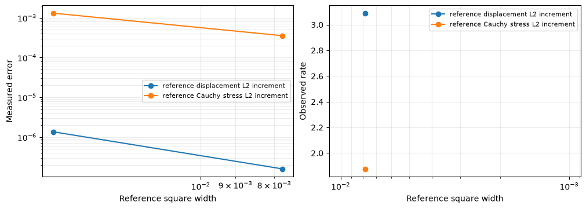

# Multiscale elasticity: resolve material structure through local equations

Follow the numbered steps: state the variational problem, choose the local and trace spaces, declare the local and global equations, solve, and inspect the physical fields.

The main workflow is **meshes → spaces → local equations → global balance → assemble → solve → fields and errors**. `MeshHierarchy` associates macro and local meshes; `bind_interface` and `LocalContext` own supported numbering, geometric orientation and native coordinate conversions. The mathematical forms, physical trace meaning, local modes and gauge remain explicit in the cells below. Fully manual/custom spaces use the same numerical owners; see the [custom-interface notebook](https://github.com/ipes-lncc/pymhm/blob/main/notebooks/foundations/operators/custom_interface.ipynb).

Build a plane-strain primal MHM model explicitly with UFL energy forms, a `LocalContext`, a global `Equation`, and `bind_problem`. A heterogeneous solid under horizontal extension creates nonuniform strains that a small classical mesh misses. MHM keeps a small global mesh while resolving the material inside each macroelement.

The baseline is separately assembled classical conforming displacement Galerkin, on three successively refined meshes. There is no analytical solution for this physical case. We measure the baseline's own refinement in displacement and physical Cauchy stress before comparing methods.

Install `pymhm[notebooks,visualization]` and the compatible native DOLFINx/UFL backend, then open this notebook with `jupyter lab` in a writable directory. Physical coefficients, weak forms, local rigid-motion modes and conforming reference forms are declared below. Importable vector helpers handle field evaluation, norms, figures and archives. Mesh-associated bindings provide the supported coordinate maps. Optional DOLFINx/UFL imports belong to this notebook environment; the portable PyMHM core does not import them.

The local rigid-motion complement and global traction coupling follow [Harder, Madureira and Valentin (2016)](https://doi.org/10.1051/m2an/2015046). The oscillatory material and extension loading define an original application here.

The PyMHM distribution contains only the library. The first cell explicitly
downloads a checksum-verified companion archive and prepares the declared data
using its local Python helpers. You can inspect these support files in `ROOT`.
Complete studies and historical replay retain their existing opt-in flags.


```python
from pathlib import Path
import os
import sys
from pymhm.io.workspace import workspace_from_archive

# Download verified support files; this operation does not execute them.
COMPANION_URL = "https://ipes-lncc.github.io/pymhm/downloads/a91d2dca7f4f9ee03401812a3edfa4fc749ad3f5e2f433c37048364bd24426d5/multiscale_elasticity-companion.zip"
COMPANION_SHA256 = "a91d2dca7f4f9ee03401812a3edfa4fc749ad3f5e2f433c37048364bd24426d5"
WORKSPACE = Path(
    os.environ.get("PYMHM_WORKSPACE", Path.cwd() / ".pymhm-companions" / COMPANION_SHA256)
)
ROOT = workspace_from_archive(COMPANION_URL, sha256=COMPANION_SHA256, directory=WORKSPACE)
os.environ["PYMHM_WORKSPACE"] = str(ROOT)
if str(ROOT) not in sys.path:
    sys.path.insert(0, str(ROOT))

# Explicitly prepare declared data with the downloaded Python helpers.
from scripts.notebook_reproduction import notebook_workspace

ROOT = notebook_workspace("introduction/multiscale_elasticity.ipynb", directory=ROOT)
root = ROOT
print("Workspace:", ROOT)

from functools import partial
import numpy as np
from numpy.typing import NDArray
import matplotlib.pyplot as plt
import ufl


from pymhm import (
    Equation,
    LocalEquations,
    MeshHierarchy,
    LocalContext,
    assemble,
    columns,
    bind_interface,
    bind_problem,
)
from pymhm.execution.cpu import ExecutionConfig
from pymhm.meshes.triangle import TriangleMesh
from pymhm.fem.scalar.triangle import nodal_space
from pymhm.fem.scalar.operators import boundary_data
from pymhm.fem.traces.interval import FaceSpace, SkeletonSpace
from examples.introduction.vector import (
    BrokenVectorEvaluator,
    evaluate_named_displacement,
    elasticity_reference,
    elasticity_errors,
    triangle_grid_quadrature,
    plot_convergence,
    plot_elasticity_fields,
    inspect_elasticity_solution,
)

Array = NDArray[np.float64]

```

```text
Workspace: ./build/docs-restructure/exact-source-workspaces-provenance-final/introduction/multiscale_elasticity
```

## 1. Declare the material and physical loading

On the unit square, impose a one-percent horizontal extension on the whole exterior, with no body force:


$$
-\nabla\cdot\sigma=0,\qquad
\sigma=2\mu\varepsilon(\boldsymbol u)+\lambda\operatorname{div}(\boldsymbol u)I,
\qquad\boldsymbol u_D=(0.01x,0).
$$


Here $\varepsilon(\boldsymbol u)=(\nabla\boldsymbol u+\nabla\boldsymbol u^T)/2$. Use a smooth material with short wavelength and Lamé-modulus contrast $e^3\simeq20.1$:


$$
\lambda(x,y)=\mu(x,y)=\exp\!\left(1.5\sin(16\pi x)\sin(16\pi y)\right).
$$


The material wavelength is $1/8$. Taking $\lambda=\mu$ gives Poisson ratio $1/4$ in plane strain, so this case isolates multiscale heterogeneity rather than near-incompressibility. The stiffness is uniformly positive on symmetric strains. Both methods solve the same tensor, domain and boundary values.


```python
def micro_modulus(points: Array) -> Array:
    """Return smooth plane-strain Lamé values in [exp(-1.5),exp(1.5)], wavelength 1/8.

    Both lambda and mu equal this value, hence Poisson ratio is 1/4 and
    heterogeneity is separated from near-incompressibility and locking.
    """
    return np.exp(1.5 * np.sin(16 * np.pi * points[:, 0]) * np.sin(16 * np.pi * points[:, 1]))


def extension_boundary(points: Array) -> Array:
    """Prescribe a one-percent horizontal extension, with zero vertical displacement."""
    return np.column_stack((0.01 * points[:, 0], np.zeros(len(points))))

```


```python
macro = TriangleMesh.unit_square(4)
local_degree, local_refinement, trace_segments = 3, 16, 4
skeleton = SkeletonSpace(
    macro, tuple(FaceSpace.uniform(1, trace_segments) for _ in macro.faces), components=2
)
print(
    {
        "macro_triangles": len(macro.cells),
        "material_wavelength": 1 / 8,
        "material_contrast": float(np.exp(3.0)),
        "local_degree": local_degree,
        "local_refinement": local_refinement,
        "trace_degree": 1,
        "trace_segments": trace_segments,
    }
)

```

```text
{'macro_triangles': 32, 'material_wavelength': 0.125, 'material_contrast': 20.085536923187668, 'local_degree': 3, 'local_refinement': 16, 'trace_degree': 1, 'trace_segments': 4}
```

## 2. Declare the finite element and bind it to the local mesh

Choose a vector Basix/UFL element for displacement. `local.native_space` binds it to the current local mesh and provides its native function space. PyMHM owns the topology and coefficient conversions, so the local UFL forms do not contain numbering or orientation arrays. The later physical-norm and archive sections state the executed nodal basis explicitly.

The mesh is the actual independent local refinement of a macro triangle. No global refined mesh is passed to MHM. Native forms use `MPI.COMM_SELF`; the generic form compiler copies their assembled arrays and releases native assembly resources.


```python
def rigid_modes(points: Array, center: Array) -> Array:
    """Return two translations and centered counterclockwise rotation, shape (n,2,3)."""
    modes = np.zeros((len(points), 2, 3))
    modes[:, :, :2] = np.eye(2)
    modes[:, 0, 2] = -(points[:, 1] - center[1])
    modes[:, 1, 2] = points[:, 0] - center[0]
    return modes

```

## 3. Derive each local equation and identify its kernel

Integration by parts yields


$$
\int_T \left[2\mu\varepsilon(\boldsymbol u):\varepsilon(\boldsymbol v)
+\lambda\operatorname{div}\boldsymbol u\operatorname{div}\boldsymbol v\right]
-\langle\sigma\boldsymbol n_T,\boldsymbol v\rangle_{\partial T}=0.
$$


Declare the skeletal multiplier $\boldsymbol\lambda=-\sigma\boldsymbol n_F$: it is **negative physical Cauchy traction** in the unique macroface orientation. Thus the local equation is $A_T\boldsymbol u+B_T\boldsymbol\lambda=0$, with the signed trace map $B_T$.

The local energy has three exact rigid modes: translations $(1,0)$ and $(0,1)$, and centered rotation $(-(y-y_T),x-x_T)$. Their physical $L^2$ moments select a unique response in the complement, while three retained coordinates represent the rigid component. We declare these modes, rather than infer them from a numerically rotated nullspace.

The trace contains the restrictions of rigid motions: degree one. The local degree is three. [Harder, Madureira and Valentin (2016), Lemma 6.6](https://doi.org/10.1051/m2an/2015046) give the sufficient rule $k\ge\ell+2$ for odd-degree traces on a single triangular local element. Our refined and segmented spaces differ from that single-element setting, so the rule alone is not their stability theorem. Segments align with the fine boundary and each covers four fine edges. We additionally check the rank of the actual trace pairing; an algebraic residual alone would not establish compatibility.

| Weak-form term | Visible code |
| --- | --- |
| $2\mu\varepsilon(u):\varepsilon(v)+\lambda\operatorname{div}u\operatorname{div}v$ | UFL expression `a` |
| $\langle s_{TF}\lambda,v\rangle$ | `local.trace_pairings(lambda phi, ds: inner(phi,v)*ds)` |
| Rigid kernel | `kernel` |
| Physical rigid moments | `columns` of UFL linear forms |
| Global displacement continuity | independent UFL pairing `-inner(phi,u)*ds`, with `axis="rows"` |


```python
def local_elasticity(local: LocalContext) -> LocalEquations:
    """Declare plane-strain UFL energy, negative Cauchy traction and rigid moments."""
    cell, fine = local.cell, local.mesh
    import basix
    import basix.ufl

    element = basix.ufl.element(
        "Lagrange",
        "triangle",
        local_degree,
        lagrange_variant=basix.LagrangeVariant.equispaced,
        shape=(2,),
    )
    binding = local.native_space(element)
    domain, space, mapping = binding.mesh, binding.space, binding.mapping
    u, v = ufl.TrialFunction(space), ufl.TestFunction(space)
    x = ufl.SpatialCoordinate(domain)
    mu = ufl.exp(1.5 * ufl.sin(16 * np.pi * x[0]) * ufl.sin(16 * np.pi * x[1]))
    lam = mu
    dx = ufl.Measure("dx", domain=domain, metadata={"quadrature_degree": 16})
    # This is exactly the physical energy written above.
    a = (
        2 * mu * ufl.inner(ufl.sym(ufl.grad(u)), ufl.sym(ufl.grad(v)))
        + lam * ufl.div(u) * ufl.div(v)
    ) * dx
    _, nodes = nodal_space(fine, local_degree)
    center = macro.points[macro.cells[cell]].mean(axis=0)
    portable_kernel = rigid_modes(nodes, center).reshape(-1, 3)
    kernel = binding.to_native(portable_kernel)
    rigid = (
        ufl.as_vector((1.0, 0.0)),
        ufl.as_vector((0.0, 1.0)),
        ufl.as_vector((-(x[1] - center[1]), x[0] - center[0])),
    )
    moments = columns(*(ufl.inner(v, mode) * dx for mode in rigid))
    local.field("displacement", binding)
    b = local.trace_pairings(lambda phi, ds: ufl.inner(phi, v) * ds)
    c = local.trace_pairings(lambda phi, ds: -ufl.inner(phi, u) * ds, axis="rows")
    return local.equations(
        a=a,
        L=np.zeros(len(mapping)),
        b=b,
        c=c,
        kernel=kernel,
        moments=moments,
        metadata=(fine, mapping),
    )

```

## 4. Declare the global displacement equation and solve

The global weak equation imposes displacement-jump moments on interior macrofaces and prescribed displacement moments on the exterior. With $C=-B^T$, its additional load is $-\langle\boldsymbol\mu,\boldsymbol u_D\rangle_{\partial\Omega}$. Full displacement data remove the three global rigid ambiguities, so no additional physical gauge is required.

Only the macroface and three retained rigid coordinates per macroelement enter the global matrix. The local fields are recovered in their executed native basis, then mapped to the portable nodal representation for physical evaluation.


```python
boundary, fixed = boundary_data(skeleton, extension_boundary, order=8)
hierarchy = MeshHierarchy(
    macro, tuple(macro.submesh(cell, local_refinement) for cell in range(len(macro.cells)))
)
problem = bind_problem(
    hierarchy,
    bind_interface(skeleton, convention="normal"),
    local_elasticity,
    global_equation=lambda global_problem: Equation(0, global_problem.trace_load(-boundary)),
    retained=3,
    fixed=fixed,
)
system = assemble(problem, execution=ExecutionConfig("serial", native_threads=1))
solution = system.solve()
displacement_fields = solution.field("displacement")
inspect_elasticity_solution(system, solution, macro)

```

```text
{'global_unknowns': 992, 'largest_local_unknowns': 2450, 'original_equations_relative_residual': 3.9615770861266295e-16}
{'local_trace_pairing_smallest_singular_value': 0.010000445141455936, 'local_trace_pairing_condition': 2.585612165689401}
First macrocell displacement at its center: [[1.75336324e-03 2.24948452e-05]]
```

## 5. Physical evaluation and norms in the executed bases

The evaluators below locate points in the original triangular connectivity and use the package's Basix basis tables. Separate local fields retain one-sided macroface values. The physical stress is recomputed from the **same** material and symmetric strain, without smoothing.

Measure displacement in $L^2$, Cauchy stress in Frobenius $L^2$, and the strain-energy difference:


$$
\left(\int_\Omega
2\mu\varepsilon(\boldsymbol e_u):\varepsilon(\boldsymbol e_u)
+\lambda(\operatorname{div}\boldsymbol e_u)^2\right)^{1/2}.
$$


Raw primal stress is symmetric but is not claimed to belong to $H(\mathrm{div})$ or to equilibrate every fine cell. Skeletal rigid equations impose macro force and moment compatibility.


```python
# Norms and one-sided field sampling use the importable helpers above.
# Their implementation is in examples/introduction/vector.py.

```


```python
mhm_evaluator = BrokenVectorEvaluator(
    macro, tuple(partial(evaluate_named_displacement, field) for field in displacement_fields)
)
# Resolve every reference/local interface on a common 256×256 square grid.
error_points, error_weights = triangle_grid_quadrature(256, order=5)

```

## 6. Independent classical assembly, including a coarse comparison

Assemble the UFL energy globally on one continuous $P_2$ displacement mesh. Strong Dirichlet elimination uses the prescribed extension. There is no MHM skeleton or local condensation. A coarse solve on the macro mesh illustrates the cost of unresolved material; it is not used as the reference.

Three fine meshes, $64\times64$, $128\times128$, and $256\times256$ squares split into triangles, verify the baseline's own refinement in physical fields. The reference shares DOLFINx/Basix with local integration but has an independent global conforming assembly; no independent external code is executed.


```python
def classical_energy(space, resolution):
    """Assemble the same physical operator on a conforming P2 reference mesh."""
    u, v = ufl.TrialFunction(space), ufl.TestFunction(space)
    x = ufl.SpatialCoordinate(space.ufl_domain())
    mu = ufl.exp(1.5 * ufl.sin(16 * np.pi * x[0]) * ufl.sin(16 * np.pi * x[1]))
    dx = ufl.Measure(
        "dx",
        domain=space.ufl_domain(),
        metadata={"quadrature_degree": 64 if resolution == 4 else 16},
    )
    return (
        2 * mu * ufl.inner(ufl.sym(ufl.grad(u)), ufl.sym(ufl.grad(v)))
        + mu * ufl.div(u) * ufl.div(v)
    ) * dx


references = {
    n: elasticity_reference(n, classical_energy, extension_boundary) for n in (4, 64, 128, 256)
}
coarse_evaluator = references[4][0]
reference_evaluators = [references[n][0] for n in (64, 128, 256)]
reference_rows = [references[n][1] for n in (64, 128, 256)]
reference_rows

```


```text
[{'square_grid': 64, 'triangles': 8192, 'displacement_unknowns': 33282},
 {'square_grid': 128, 'triangles': 32768, 'displacement_unknowns': 132098},
 {'square_grid': 256, 'triangles': 131072, 'displacement_unknowns': 526338}]
```


```python
measure_error = partial(elasticity_errors, modulus=micro_modulus)
reference_refinement = [
    measure_error(a, b, error_points, error_weights)
    for a, b in zip(reference_evaluators[:-1], reference_evaluators[1:])
]
reference = reference_evaluators[-1]
mhm_errors = measure_error(mhm_evaluator, reference, error_points, error_weights)
coarse_errors = measure_error(coarse_evaluator, reference, error_points, error_weights)
print("Successive reference differences:", reference_refinement)
print("MHM versus fine reference:", mhm_errors)
print("Coarse Galerkin versus fine reference:", coarse_errors)
assert reference_refinement[-1]["displacement_L2"] < reference_refinement[0]["displacement_L2"]
assert reference_refinement[-1]["stress_L2"] < reference_refinement[0]["stress_L2"]
# Check error integration independently by increasing the common-grid Gauss rule.
check_points, check_weights = triangle_grid_quadrature(256, order=7)
quadrature_check = measure_error(mhm_evaluator, reference, check_points, check_weights)
print("Higher-order norm quadrature:", quadrature_check)

```

```text
Successive reference differences: [{'displacement_L2': 1.353938172472192e-06, 'stress_L2': 0.001304567346527344, 'energy': 0.0006527778985510588, 'displacement_relative': 0.00023390865144668065, 'stress_relative': 0.04279971823989764, 'energy_relative': 0.03992138925383583}, {'displacement_L2': 1.5905888722220653e-07, 'stress_L2': 0.00035507806879778663, 'energy': 0.0001757575145861931, 'displacement_relative': 2.74792798305603e-05, 'stress_relative': 0.011651067995652315, 'energy_relative': 0.010749275556865825}]
MHM versus fine reference: {'displacement_L2': 2.7922290784276454e-05, 'stress_L2': 0.004200499227306708, 'energy': 0.002145790434699797, 'displacement_relative': 0.004823901734579, 'stress_relative': 0.13782969553353766, 'energy_relative': 0.13123588328033275}
Coarse Galerkin versus fine reference: {'displacement_L2': 0.00011155141106296178, 'stress_L2': 0.03027893648710682, 'energy': 0.011243157713672135, 'displacement_relative': 0.01927180865920849, 'stress_relative': 0.9935334757276298, 'energy_relative': 0.687628069150321}
```

```text
Higher-order norm quadrature: {'displacement_L2': 2.7922290784276464e-05, 'stress_L2': 0.004200499227307993, 'energy': 0.0021457904346997582, 'displacement_relative': 0.004823901734579004, 'stress_relative': 0.13782969553358027, 'energy_relative': 0.13123588328033098}
```

### Baseline refinement increments

These measured displacement and stress differences compare successive conforming references. Their slopes describe refinement increments rather than errors against an analytical solution. Plotting both fields makes the reference uncertainty visible.


```python
figure = plot_convergence(
    [1 / 64, 1 / 128],
    {
        "reference displacement L2 increment": [r["displacement_L2"] for r in reference_refinement],
        "reference Cauchy stress L2 increment": [r["stress_L2"] for r in reference_refinement],
    },
)
for axis in figure.axes:
    axis.set_xlabel("Reference square width")
plt.show()
print(
    "Reference uncertainty/MHM difference ratios:",
    {
        field: reference_refinement[-1][field] / mhm_errors[field]
        for field in ("displacement_L2", "stress_L2", "energy")
    },
)

```


[](../../assets/tutorials/multiscale_elasticity/figure_18_0.png)


```text
Reference uncertainty/MHM difference ratios: {'displacement_L2': 0.0056964841621008925, 'stress_L2': 0.08453234950966934, 'energy': 0.08190805203714227}
```

## 7. See why a multiscale discretization helps

The stiff regions resist strain; softer regions accommodate more displacement gradients. Compare the coarse classical stress with the fine reference and MHM stress, not just displacement magnitude. Each spatial panel overlays the actual MHM macro mesh. Fields on macroface intersections remain independent.

The material has multiple oscillations inside a macro triangle. Its effect enters MHM through the local energy responses, without placing all reference-mesh coefficients in the global system.


```python
plot_elasticity_fields(macro, mhm_evaluator, reference, coarse_evaluator, micro_modulus)
plt.show()

```


[](../../assets/tutorials/multiscale_elasticity/figure_20_0.png)


## 8. Scope of the verified result

The baseline is finite, so its successive displacement and stress differences remain part of the evidence. Compare that uncertainty with MHM–reference differences. The higher-order norm quadrature checks the integration of fields that are discontinuous in gradient.

This tutorial verifies a heterogeneous, compressible plane-strain application. It does not claim locking-free nearly incompressible behavior, fine-cell stress conservation, or reproduction of a particular published material experiment. Global dimensions alone do not establish a timing gain; local setup and response solves are part of the computational work.

The bound coefficient convention, declared rigid basis, physical traction sign, moment rows, Dirichlet convention and approximation spaces make the numerical result auditable. Changing the material or boundary condition requires revisiting those choices before interpreting a small algebraic residual.

## References

- Christopher Harder, Alexandre L. Madureira, and Frédéric Valentin (2016). *A hybrid-mixed method for elasticity*, ESAIM: M2AN 50, 311–336. [DOI: 10.1051/m2an/2015046](https://doi.org/10.1051/m2an/2015046).

## Reproduce this tutorial

[View the source notebook](https://github.com/ipes-lncc/pymhm/blob/main/notebooks/introduction/multiscale_elasticity.ipynb) or [download the notebook](https://raw.githubusercontent.com/ipes-lncc/pymhm/main/notebooks/introduction/multiscale_elasticity.ipynb), then open it:

```bash
python -m pip install 'pymhm[notebooks,visualization]'
jupyter lab multiscale_elasticity.ipynb
```

The first cell explicitly downloads a SHA256-verified companion archive. Acquisition does not execute its code. The local support files are inspectable in the printed `ROOT` directory; the following helper call prepares only the declared inputs. The library distribution contains only `pymhm`. Notebooks, support code and data are separate downloads. Native UFL forms require the compatible DOLFINx/UFL backend described in the [installation guide](../../installation.md). A clone and Pixi are unnecessary.

For batch execution, extract the same companion, change to its workspace, and use its local runner with the actual downloaded notebook path:

```bash
python -m scripts.run_notebooks /path/to/multiscale_elasticity.ipynb --timeout 7200
```

The runner uses the active Python interpreter and writes an executed copy and receipt under `build/notebooks/introduction/`. Larger data and field archives have [documented download links](../../data.md) and verified checksums.

The displayed figures and numerical outputs correspond to the retained validated execution of notebook SHA256 `6b691c8dffa11956aa6075fb60d8fdd880e446ba603faa88b66376b91ca80d6c` in the [publication manifest](manifest.json). Current instructions use the separately downloaded local `examples` and `scripts` support modules. Running the current source produces a separate receipt for its actual notebook, support bytes and environment. Timings describe the recorded hardware and solver settings; measure your own environment on an idle machine.
