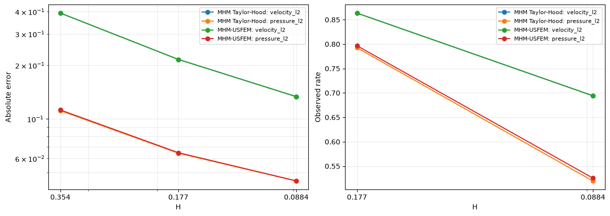
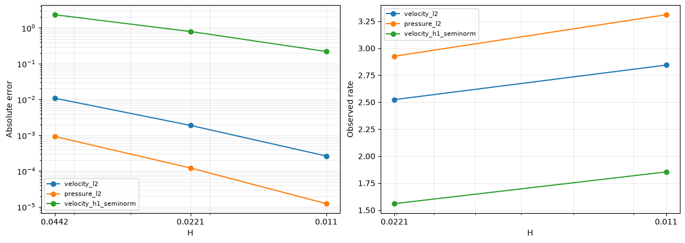
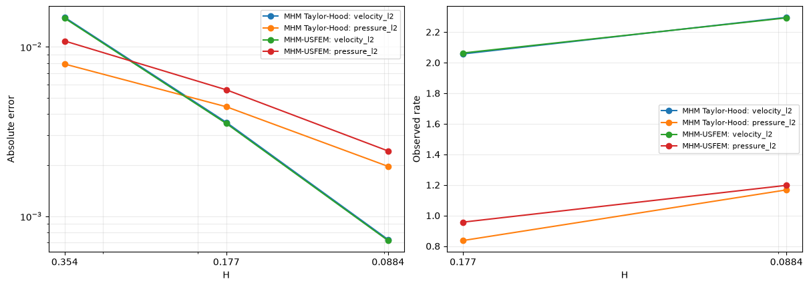
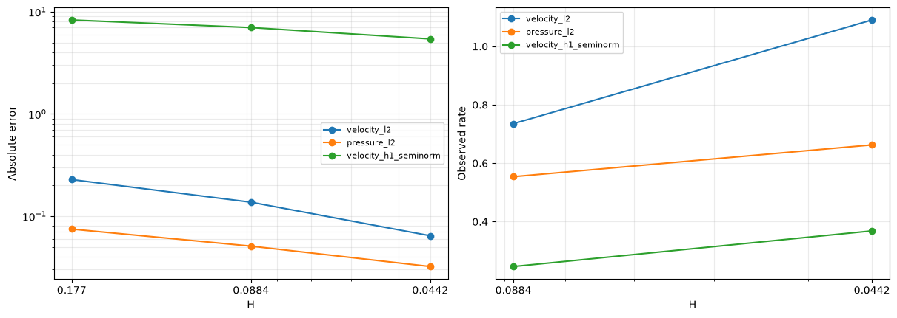
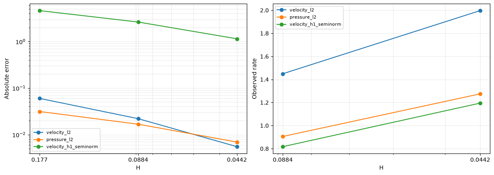
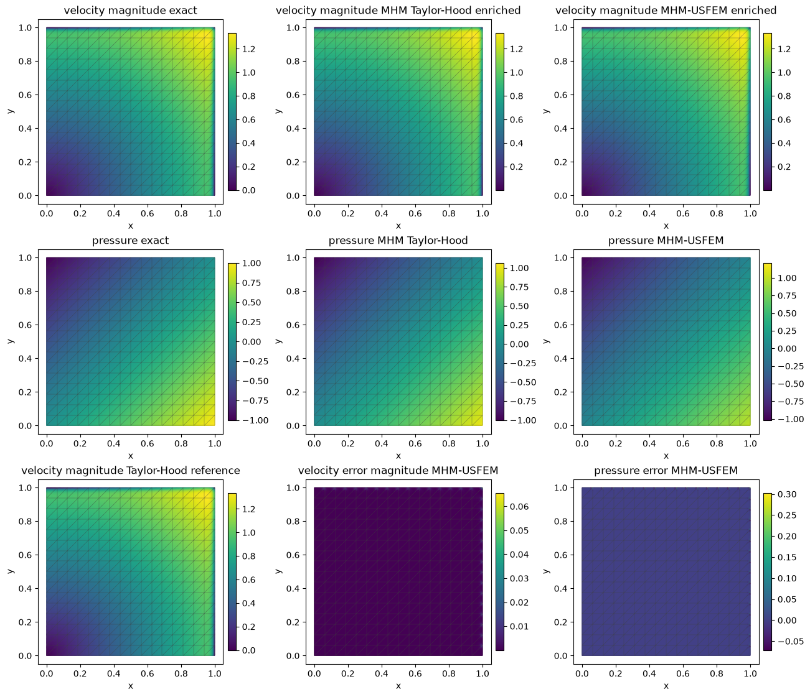
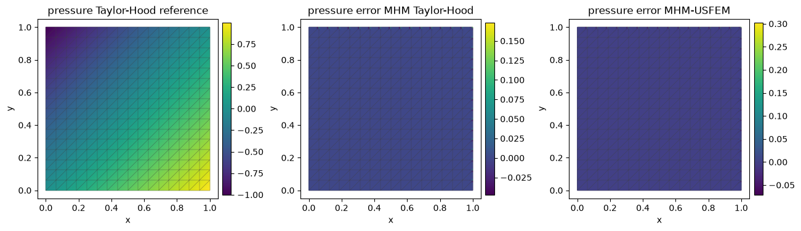

# Stokes–Brinkman boundary layers: MHM and MHM-USFEM

Follow the numbered steps: state the variational problem, choose the local and trace spaces, declare the local and global equations, solve, and inspect the physical fields.

The main workflow is **meshes → spaces → local equations → global balance → assemble → solve → fields and errors**. `MeshHierarchy` associates macro and local meshes; `bind_interface` and `LocalContext` own supported numbering, geometric orientation and native coordinate conversions. The mathematical forms, physical trace meaning, local modes and gauge remain explicit in the cells below. Fully manual/custom spaces use the same numerical owners; see the [custom-interface notebook](https://github.com/ipes-lncc/pymhm/blob/main/notebooks/foundations/operators/custom_interface.ipynb).

We build the local mixed equations and the global skeletal equation explicitly. The classical baseline is an independently assembled, globally conforming **Taylor–Hood P2/P1** solution on three fine meshes. We compare MHM with Taylor–Hood locals against MHM-USFEM with stabilized P2/P2 locals. Both MHM configurations use the **same local velocity mesh, velocity degree and macroface space**. We also assess the published single-element USFEM degree family independently of that Taylor–Hood comparison.

The analytical problem is the boundary-layer example in [Araya, Harder, Poza and Valentin (2017), §3.1.2](https://doi.org/10.1016/j.cma.2017.05.027); its [2016 author preprint](https://www.ci2ma.udec.cl/pdf/pre-publicaciones2/2016/pp16-15.pdf) gives the equations and exact fields. This notebook uses a declared SW–NE triangulation. We distinguish the paper's single-element local degree family from the locally refined Taylor–Hood/USFEM comparison and from a resolved subface control. Geometry, coefficient, source and boundary data are the same throughout.

Run the notebook with the locked Pixi `introduction` environment. Every physical field, source, variational form, boundary condition, pressure gauge and measurement is defined in the cells below. PyMHM assembles the executed UFL forms, integrates oriented traces, condenses local equations and solves the global system.


```python
from pathlib import Path
import sys
import os

ROOT = next(
    path for path in (Path.cwd(), *Path.cwd().parents) if (path / "pixi.toml").exists()
)
sys.path.insert(0, str(ROOT))
import json
import numpy as np
import matplotlib.pyplot as plt
from scipy import sparse
from pymhm import TriangleMesh, FaceSpace, SkeletonSpace
from pymhm.core.equations import Equation, LocalEquations, compile_form
from pymhm.core.multiscale import MultiscaleProblem, assemble
from pymhm.fem.assembly import assemble_element_blocks
from pymhm.fem.scalar.operators import triangle_quadrature, boundary_data
from pymhm.fem.scalar.triangle import nodal_space, tabulate, trace_coupling

REPORTS = ROOT / "build/introduction"
REPORTS.mkdir(parents=True, exist_ok=True)
np.set_printoptions(precision=6, suppress=True)

from collections.abc import Callable, Sequence
from dataclasses import dataclass
from typing import Any
from pymhm.linalg.linear import solve_linear
from threadpoolctl import threadpool_limits

threadpool_limits(limits=1)

from pymhm import MeshHierarchy, LocalContext, bind_interface, bind_problem
from pymhm.backends.spaces import bind_space

```

## 1. State the operator and derive the source independently

On the unit square, prescribe velocity on the whole boundary and fix the volume mean of pressure:


$$
\begin{aligned}
-\nu\Delta\boldsymbol u+\gamma\boldsymbol u+\nabla p&=\boldsymbol f,\\
\nabla\cdot\boldsymbol u&=0,\\
\boldsymbol u\big\vert_{\partial\Omega}&=\boldsymbol u_*\big\vert_{\partial\Omega},
&\int_\Omega p&=0.
\end{aligned}
$$


The published example sets $\nu=10^{-2}$ and $\gamma=1$. Define


$$
\begin{aligned}
g(s)&=\frac{e^{(s-1)/\nu}-e^{-1/\nu}}{1-e^{-1/\nu}},\\
\boldsymbol u_*(x,y)&=(y-g(y),\ x-g(x)),
&p_*(x,y)&=x-y.
\end{aligned}
$$


The two velocity components depend on the opposite coordinate, so divergence is exactly zero. Since $g''(s)=e^{(s-1)/\nu}/[\nu^2(1-e^{-1/\nu})]$, the independent source is


$$
\boldsymbol f(x,y)=\nu\big(g''(y),g''(x)\big)
+\gamma\boldsymbol u_*(x,y)+(1,-1).
$$


The PDE coefficient is **$\nu$**, whereas the exponential layer width is **$\nu$** too; this is a manufactured example, not a homogeneous-forcing layer of width $\sqrt{\nu/\gamma}$. In particular, replacing $-\nu\Delta$ by $-\nu^2\Delta$ would define another PDE. The stable exponential expression avoids overflow.


```python
@dataclass(frozen=True)
class BrinkmanLayer:
    """The unit-square exact fields of Araya et al. (2017), section 3.1.2.

    The operator is ``-nu*Delta u+gamma*u+grad(p)`` and not ``-nu**2*Delta u``.
    The exact exponential layer has width ``nu``. Velocity is prescribed on
    the whole exterior; pressure ``x-y`` has zero volume mean. This example
    uses vector-Laplacian pseudostress, not symmetric Cauchy stress.
    """

    viscosity: float = 1e-2
    drag: float = 1.0

    def __post_init__(self) -> None:
        """Require positive viscosity and positive constant resistance for this tutorial."""
        if not np.isfinite(self.viscosity) or self.viscosity <= 0:
            raise ValueError("viscosity must be finite and positive")
        if not np.isfinite(self.drag) or self.drag <= 0:
            raise ValueError(
                "this tutorial requires finite positive drag; zero drag needs a local kernel"
            )

    def layer(self, coordinate: np.ndarray) -> np.ndarray:
        """Evaluate ``(exp((s-1)/nu)-exp(-1/nu))/(1-exp(-1/nu))`` stably."""
        return (np.exp((coordinate - 1) / self.viscosity) - np.exp(-1 / self.viscosity)) / (
            -np.expm1(-1 / self.viscosity)
        )

    def layer_derivative(self, coordinate: np.ndarray, order: int) -> np.ndarray:
        """Differentiate the exponential once or twice in physical coordinates."""
        if order not in (1, 2):
            raise ValueError("layer derivative order must be one or two")
        return np.exp((coordinate - 1) / self.viscosity) / (
            self.viscosity**order * -np.expm1(-1 / self.viscosity)
        )

    def velocity(self, points: np.ndarray) -> np.ndarray:
        """Return exact velocity ``(y-g(y), x-g(x))``."""
        reversed_points = points[:, ::-1]
        return reversed_points - self.layer(reversed_points)

    def pressure(self, points: np.ndarray) -> np.ndarray:
        """Return the mean-zero exact pressure ``x-y``."""
        return points[:, 0] - points[:, 1]

    def gradient(self, points: np.ndarray) -> np.ndarray:
        """Return velocity Jacobians with axes ``(point, component, derivative)``."""
        result = np.zeros((len(points), 2, 2))
        result[:, 0, 1] = 1 - self.layer_derivative(points[:, 1], 1)
        result[:, 1, 0] = 1 - self.layer_derivative(points[:, 0], 1)
        return result

    def source(self, points: np.ndarray) -> np.ndarray:
        """Apply the declared operator analytically, including ``grad(p)=(1,-1)``."""
        return (
            self.viscosity * self.layer_derivative(points[:, ::-1], 2)
            + self.drag * self.velocity(points)
            + np.array([1.0, -1.0])
        )

```


```python
NU, GAMMA = 1e-2, 1.0
truth = BrinkmanLayer(NU, GAMMA)
ASSEMBLY_ORDER, ERROR_ORDER = 12, 20
LOCAL_SUBDIVISIONS, VELOCITY_DEGREE, TRACE_DEGREE = 4, 2, 0
INVERSE_M = 1 / 100
points = np.array([[0.21, 0.34], [0.72, 0.81], [0.97, 0.98]])
np.testing.assert_allclose(np.trace(truth.gradient(points), axis1=1, axis2=2), 0.0)
np.testing.assert_allclose(
    truth.source(points)
    - GAMMA * truth.velocity(points)
    - NU * truth.layer_derivative(points[:, ::-1], 2),
    np.tile([1.0, -1.0], (len(points), 1)),
    atol=1e-12,
)
# Assumption (M), 2D: this Taylor--Hood submesh has interior vertices.
probe_local_mesh = TriangleMesh.unit_square(1).submesh(0, LOCAL_SUBDIVISIONS)
boundary_vertices = np.unique(probe_local_mesh.faces[probe_local_mesh.boundary_faces])
local_interior_vertices = len(probe_local_mesh.points) - len(boundary_vertices)
assert local_interior_vertices > 0
print("Taylor-Hood local interior vertices:", local_interior_vertices)

```

```text
Taylor-Hood local interior vertices: 3
```

The NumPy expressions above provide physical data and independent error evaluation. The same explicit analytical data are written below as UFL expressions so that both local equations and the independent classical assembly integrate the actual exponential source.


```python
import basix.ufl
import dolfinx
import ufl


def brinkman_ufl_data(domain: Any) -> tuple[Any, Any, Any]:
    """Write the exact velocity, pressure and independently derived source as UFL data."""
    x = ufl.SpatialCoordinate(domain)
    denominator = -np.expm1(-1 / NU)

    def g(s: Any) -> Any:
        """Evaluate the analytical exponential layer in UFL coordinates."""
        return (ufl.exp((s - 1) / NU) - np.exp(-1 / NU)) / denominator

    uexact = ufl.as_vector((x[1] - g(x[1]), x[0] - g(x[0])))
    pexact = x[0] - x[1]
    f = (
        ufl.as_vector(
            (
                ufl.exp((x[1] - 1) / NU) / (NU * denominator),
                ufl.exp((x[0] - 1) / NU) / (NU * denominator),
            )
        )
        + GAMMA * uexact
        + ufl.as_vector((1.0, -1.0))
    )
    return uexact, pexact, f

```

## 2. Translate the mathematical mixed form directly into UFL

Use the **vector Laplacian** form and its pseudostress, not the symmetric-strain Stokes operator:


$$
\begin{aligned}
a_K((\boldsymbol u,p),(\boldsymbol v,q))
&=(\nu\nabla\boldsymbol u,\nabla\boldsymbol v)_K
 +(\gamma\boldsymbol u,\boldsymbol v)_K\\
&\quad-(p,\nabla\cdot\boldsymbol v)_K-(q,\nabla\cdot\boldsymbol u)_K.
\end{aligned}
$$


The pressure test is negated to obtain a symmetric saddle matrix. For USFEM, the strong residual contains **$+\nabla p$**:


$$
\begin{aligned}
R(\boldsymbol u,p)&=-\nu\Delta\boldsymbol u+\gamma\boldsymbol u+\nabla p,\\
a_K^{\rm US}&=a_K-\sum_{T\subset K}\tau_T(R(\boldsymbol u,p),R(\boldsymbol v,q))_T,\\
\ell_K^{\rm US}&=(\boldsymbol f,\boldsymbol v)_K
 -\sum_{T\subset K}\tau_T(\boldsymbol f,R(\boldsymbol v,q))_T,\\
\tau_T&=\frac{h_T^2}{\max\{\gamma h_T^2,4\nu/m\}+4\nu/m}.
\end{aligned}
$$


These are the symmetric-test version of Eqs. (41)–(42) of the article. With constant scalar drag, the 2017 minimum-eigenvalue and 2025 maximum-eigenvalue conventions coincide. Here $h_T$ is the actual fine-triangle diameter.

The comparison pair is P2/P2 with an unsplit P0 trace. It satisfies the sufficient condition $k-\ell\geq d$ of [Araya et al. (2025), Theorem 4.1](https://doi.org/10.1137/24M1649368). Four local subdivisions provide interior vertices for the Taylor–Hood comparison, as required by Assumption (M) in Section 4.2. The single-element degree family is stated separately below. We declare the conservative inverse parameter $m=1/100$, then verify


$$
m h_T^2\lVert\Delta v_h\rVert_T^2\leq\lVert\nabla v_h\rVert_T^2
$$


on the actual P2 right triangles. This is an operator bound, not a value inferred from convergence. The Taylor–Hood P2/P1 submesh has three interior vertices on each macrotriangle and satisfies the stated local-mesh hypothesis; neither configuration introduces artificial pressure regularization.


```python
from pymhm.fem.inequalities import laplacian_inverse_bound

# The bound is an operation on polynomial derivatives, independent of the PDE.
# Basix supplies the actual degree-dependent values; PyMHM owns the eigenproblem.
inverse_parameters, inverse_controls = {}, []
probe = TriangleMesh.unit_square(1)
bary, weights = triangle_quadrature(8)
for degree in (2, 3, 4):
    _, _, _, gradient, hessian = tabulate(probe, degree, bary)
    h = probe.lengths[probe.cell_faces].max(axis=1)
    selected = laplacian_inverse_bound(gradient, hessian, weights, h)
    np.testing.assert_allclose(selected, selected[0], rtol=1e-12, atol=1e-15)
    inverse_parameters[degree] = float(selected[0])
    stiffness = np.einsum("q,tqia,tqja->tij", weights, gradient, gradient)
    laplacian = np.trace(hessian, axis1=-2, axis2=-1)
    residual_gram = np.einsum("q,tqi,tqj->tij", weights, laplacian, laplacian)
    margins = np.linalg.eigvalsh(
        selected[:, None, None] * h[:, None, None] ** 2 * residual_gram - stiffness
    )[:, -1]
    assert margins.max() < 1e-10 * max(1.0, np.abs(stiffness).max())
    inverse_controls.append(
        dict(
            degree=degree, m=float(selected[0]), maximum_signed_margin=float(margins.max())
        )
    )
# The comparison's declared conservative P2 parameter also obeys the bound.
_, _, _, gradient, hessian = tabulate(probe, VELOCITY_DEGREE, bary)
stiffness = np.einsum("q,tqia,tqja->tij", weights, gradient, gradient)
laplacian = np.trace(hessian, axis1=-2, axis2=-1)
residual_gram = np.einsum("q,tqi,tqj->tij", weights, laplacian, laplacian)
bound_margins = np.linalg.eigvalsh(
    INVERSE_M * h[:, None, None] ** 2 * residual_gram - stiffness
)[:, -1]
assert bound_margins.max() < 1e-10
inverse_controls

```


```text
[{'degree': 2,
  'm': 0.01041666666666667,
  'maximum_signed_margin': -2.5817457052426708e-16},
 {'degree': 3,
  'm': 0.003353888994497344,
  'maximum_signed_margin': 1.1237351776666785e-15},
 {'degree': 4,
  'm': 0.0012193412641237176,
  'maximum_signed_margin': 2.5062771001053377e-15}]
```


```python
def brinkman_forms(
    domain: Any,
    *,
    stabilized: bool,
    velocity_degree: int = VELOCITY_DEGREE,
    inverse_m: float = INVERSE_M,
    quadrature_degree: int = 28,
) -> tuple[Any, Any, Any, Any]:
    """Declare the executed vector-Laplacian mixed form and its USFEM residual."""
    pressure_degree = velocity_degree if stabilized else velocity_degree - 1
    element = basix.ufl.mixed_element(
        [
            basix.ufl.element(
                "Lagrange",
                "triangle",
                velocity_degree,
                shape=(2,),
                lagrange_variant=basix.LagrangeVariant.equispaced,
            ),
            basix.ufl.element(
                "Lagrange",
                "triangle",
                pressure_degree,
                lagrange_variant=basix.LagrangeVariant.equispaced,
            ),
        ]
    )
    W = dolfinx.fem.functionspace(domain, element)
    u, p = ufl.TrialFunctions(W)
    v, q = ufl.TestFunctions(W)
    dx = ufl.Measure("dx", domain=domain, metadata={"quadrature_degree": quadrature_degree})
    _, _, f = brinkman_ufl_data(domain)
    a = (
        NU * ufl.inner(ufl.grad(u), ufl.grad(v))
        + GAMMA * ufl.inner(u, v)
        - p * ufl.div(v)
        - q * ufl.div(u)
    ) * dx
    L = ufl.inner(f, v) * dx
    if stabilized:
        R = -NU * ufl.div(ufl.grad(u)) + GAMMA * u + ufl.grad(p)
        Rtest = -NU * ufl.div(ufl.grad(v)) + GAMMA * v + ufl.grad(q)
        h = ufl.CellDiameter(domain)
        tau = h**2 / (ufl.max_value(GAMMA * h**2, 4 * NU / inverse_m) + 4 * NU / inverse_m)
        a -= tau * ufl.inner(R, Rtest) * dx
        L -= tau * ufl.inner(f, Rtest) * dx
    return W, a, L, q * dx

```

The native mesh and coefficient conversions come from the shared backend binding. The provider below writes the volume and boundary forms, chooses its physical boundary conditions and registers the scalar field. The explicit restriction to free scalar coordinates imposes the declared vertical Dirichlet data; it is part of the formulation.


```python
import basix
import basix.ufl
import dolfinx
import ufl
from mpi4py import MPI


from pymhm.backends.spaces import create_native_mesh, coefficient_map

def mixed_nodal_blocks(
    W: Any,
    a: Any,
    L: Any,
    mean_form: Any,
    fine: TriangleMesh,
    pressure_degree: int,
    velocity_degree: int = VELOCITY_DEGREE,
) -> tuple[Any, np.ndarray, np.ndarray, int]:
    """Compile supplied vector/scalar forms in declared canonical nodal coordinates."""
    binding = bind_space(fine, W)
    order = np.r_[
        coefficient_map(binding, component=0),
        coefficient_map(binding, component=1),
    ]
    native_A, native_F = compile_form(a), compile_form(L)
    A, F = native_A[order][:, order], native_F[order]
    pressure_weights = compile_form(mean_form)[order]
    return A, F, pressure_weights, len(nodal_space(fine, velocity_degree)[1])

```

## 3. State trace orientation, boundary data and the physical gauge

With the global normal $n_F$, the multiplier is the **negative physical pseudotraction in that normal direction**:


$$
\lambda_F=(-\nu\nabla\boldsymbol u+pI)n_F.
$$


`trace_coupling` multiplies that globally oriented basis by each incident macrocell's outward-normal sign and integrates it against velocity. Thus local equations are $A_Kw_K+B_K\lambda=F_K$, where $w_K=(\boldsymbol u_K,p_K)$. Choosing $C_K=-B_K^\mathsf T$ makes the global equation


$$
-\sum_K B_K^\mathsf T w_K=-\langle\boldsymbol u_*,\mu\rangle_{\partial\Omega}.
$$


The right-hand side is a velocity moment, not prescribed traction. All exterior velocity data are imposed weakly by this equation. `Equation(0,-boundary)` makes its sign explicit. Positive drag removes the velocity-translation kernel, so there are **no retained kernel amplitudes** here.

Whole-boundary velocity data leave a global pressure constant undetermined. `mean_constraint` lifts the explicit local pressure weights into a global row. We constrain the **physical reconstructed pressure integral**; pinning a skeletal coefficient would generally choose a different gauge.

The provider below binds the mixed velocity–pressure space to the local mesh, writes both UFL interface pairings independently, and registers named velocity and pressure fields. A shared native coefficient adapter supplies the executed mixed representation used by the following norms and archives. The pressure mean form remains explicit for the global physical gauge.


```python
def local_brinkman(
    local: LocalContext,
    *,
    macro: TriangleMesh,
    skeleton: SkeletonSpace,
    stabilized: bool,
    subdivisions: int = LOCAL_SUBDIVISIONS,
    velocity_degree: int = VELOCITY_DEGREE,
    inverse_m: float = INVERSE_M,
    quadrature_degree: int = 28,
) -> LocalEquations:
    """Connect the declared mixed UFL equations to their oriented skeletal coordinates."""
    cell, fine = local.cell, local.mesh
    pressure_degree = velocity_degree if stabilized else velocity_degree - 1
    W, a, L, mean_form = brinkman_forms(
        create_native_mesh(fine),
        stabilized=stabilized,
        velocity_degree=velocity_degree,
        inverse_m=inverse_m,
        quadrature_degree=quadrature_degree,
    )
    A, F, pweights, nv = mixed_nodal_blocks(
        W, a, L, mean_form, fine, pressure_degree, velocity_degree
    )
    from pymhm.backends.forms import assemble_pairing
    binding = local.native_space(W)
    u, p = ufl.TrialFunctions(W)
    v, q = ufl.TestFunctions(W)
    pair_b = local.trace_pairings(lambda phi, ds: ufl.inner(phi, v) * ds)
    pair_c = local.trace_pairings(lambda phi, ds: -ufl.inner(phi, u) * ds, axis="rows")
    order = np.r_[coefficient_map(binding, component=0), coefficient_map(binding, component=1)]
    B = assemble_pairing(pair_b.forms, axis="columns")[order]
    C = assemble_pairing(pair_c.forms, axis="rows")[:, order]
    # Preserve the declared (canonical velocity, canonical pressure) record layout.
    identity = np.eye(len(F))
    native_layout = (binding.to_native(identity[:2 * nv], component=0)
                     + binding.to_native(identity[2 * nv:], component=1))
    local.field("velocity", binding, component=0, reconstruction=native_layout)
    local.field("pressure", binding, component=1, reconstruction=native_layout)
    return local.equations(
        a=A,
        L=F,
        b=B,
        c=C,
        metadata={
            "mesh": fine,
            "velocity_nodes": nv,
            "velocity_degree": velocity_degree,
            "inverse_m": inverse_m if stabilized else None,
            "pressure_degree": pressure_degree,
            "pressure_weights": pweights,
        },
    )

```

Before the refinement loop, define the measurements: velocity and pressure $L^2$ errors, velocity-gradient error, broken pseudostress error, the fine-cell divergence norm and the separate macro mass defect. These quadrature operations evaluate fields; they do not define a local PDE.

The measurements use the general Basix kernel with the declared nodal order and affine geometry. The adapter below requests values and the first derivatives required by the norms; it does not select or assemble an operator.


```python
from pymhm.fem.reference import physical_simplex_tabulation
from pymhm.fem.scalar.operators import p1_geometry
from pymhm.fem.scalar.triangle import multiindices


def nodal_evaluation(
    mesh: TriangleMesh, degree: int, bary: np.ndarray, *, gradient: bool = True
) -> tuple[np.ndarray, np.ndarray, np.ndarray]:
    """Evaluate declared nodal coordinates through the package's native Basix kernel."""
    dofs, _ = nodal_space(mesh, degree)
    geometry, _ = p1_geometry(mesh)
    values, first, _ = physical_simplex_tabulation(
        "triangle",
        degree,
        bary,
        nodes=multiindices(degree) / degree,
        reference_gradients=geometry[:, 1:],
        nderiv=1 if gradient else 0,
    )
    return dofs, values, first

```


```python
def flow_error_norms(
    meshes: Sequence[TriangleMesh],
    velocity: Sequence[np.ndarray],
    pressure: Sequence[np.ndarray],
    velocity_degree: int,
    pressure_degree: int,
    exact: BrinkmanLayer,
    *,
    order: int = 20,
    named_velocity: Sequence[Any] | None = None,
    named_pressure: Sequence[Any] | None = None,
) -> dict[str, float]:
    """Integrate velocity, pressure, gradient and macro mass measurements.

    Pressure must already use the zero-volume-mean gauge. Macro mass is the
    largest absolute macro integral of div(u_h); ``divergence_l2`` measures
    the different fine-cell incompressibility defect. Raw gradients and
    pseudostress are broken fields, without a conservative reconstruction.
    """
    bary, weights = triangle_quadrature(order)
    totals = np.zeros(5)
    mass, mean = 0.0, 0.0
    for cell, (mesh, u, p) in enumerate(zip(meshes, velocity, pressure, strict=True)):
        udofs, ubasis, gradients = nodal_evaluation(mesh, velocity_degree, bary)
        pdofs, pbasis, _ = nodal_evaluation(mesh, pressure_degree, bary, gradient=False)
        points = np.einsum("qi,tia->tqa", bary, mesh.points[mesh.cells], optimize=True)
        flat = points.reshape(-1, 2)
        if named_velocity is not None and named_pressure is not None:
            owners = np.repeat(np.arange(len(mesh.cells)), len(bary))
            numerical_u, numerical_gradient = named_velocity[cell].values_and_gradient(flat, cells=owners)
            delta_u = numerical_u.reshape(points.shape) - exact.velocity(flat).reshape(points.shape)
            numerical_p = named_pressure[cell].evaluate(flat, cells=owners).reshape(points.shape[:2])
            derivative = numerical_gradient.reshape((*points.shape[:2], 2, 2))
        else:
            # Explicit coefficient evaluation for independent references and basis replay.
            delta_u = np.einsum(
                "qi,tia->tqa", ubasis, u[udofs], optimize=True
            ) - exact.velocity(flat).reshape(points.shape)
            numerical_p = p[pdofs] @ pbasis.T
            derivative = np.einsum("tqia,tic->tqca", gradients, u[udofs], optimize=True)
        delta_p = numerical_p - exact.pressure(flat).reshape(points.shape[:2])
        delta_gradient = derivative - exact.gradient(flat).reshape(derivative.shape)
        divergence = np.trace(derivative, axis1=-2, axis2=-1)
        delta_stress = exact.viscosity * delta_gradient - delta_p[..., None, None] * np.eye(
            2
        )
        integrands = (
            np.sum(delta_u**2, axis=-1),
            delta_p**2,
            np.sum(delta_gradient**2, axis=(-2, -1)),
            divergence**2,
            np.sum(delta_stress**2, axis=(-2, -1)),
        )
        totals += [float(mesh.areas @ (value @ weights)) for value in integrands]
        mass = max(mass, abs(float(mesh.areas @ (divergence @ weights))))
        mean += float(mesh.areas @ (numerical_p @ weights))
    errors = np.sqrt(totals)
    return dict(
        velocity_l2=float(errors[0]),
        pressure_l2=float(errors[1]),
        velocity_h1_seminorm=float(errors[2]),
        divergence_l2=float(errors[3]),
        pseudostress_l2=float(errors[4]),
        macro_mass_defect=mass,
        pressure_integral=mean,
    )

```

### Record the numerical coordinates for reproducibility

The next utility saves the actual local coordinate basis, coefficients, orientation maps and reconstructed fields as each solve finishes. It contains no physical operator. Replaying the saved basis is checked with one and two BLAS threads; this positive-reaction or positive-drag example has no local nullspace modes. You can read the global construction immediately below without studying the archive format first.


```python
import hashlib


def preserve_state(name: str, skeleton: SkeletonSpace, system: Any, solution: Any) -> dict:
    """Archive executed coefficients, orientation, local lifts and actual retained bases."""
    payload = {
        "macro_points": skeleton.mesh.points,
        "macro_cells": skeleton.mesh.cells,
        "macro_faces": skeleton.mesh.faces,
        "macro_signs": skeleton.mesh.signs,
        "trace": solution.trace,
        "skeleton_components": np.array(skeleton.components),
    }
    basis_digest = hashlib.sha256()
    for face, space in enumerate(skeleton.faces):
        payload[f"face_breaks_{face}"] = np.asarray(space.breaks)
        payload[f"face_degrees_{face}"] = np.asarray(space.degrees)
    for cell, (response, data, field, coarse) in enumerate(
        zip(
            system.responses,
            system.local_metadata,
            solution.fields,
            solution.coarse,
            strict=True,
        )
    ):
        payload[f"local_points_{cell}"] = data["mesh"].points
        payload[f"local_cells_{cell}"] = data["mesh"].cells
        payload[f"field_{cell}"] = field
        payload[f"coarse_{cell}"] = coarse
        payload[f"source_{cell}"] = response.source
        payload[f"lifts_{cell}"] = response.lifts
        payload[f"basis_{cell}"] = response.retained_basis
        payload[f"trace_dofs_{cell}"] = response.problem.trace_dofs
        if "free" in data:
            payload[f"free_nodes_{cell}"] = data["free"]
        if "velocity_nodes" in data:
            payload[f"velocity_nodes_{cell}"] = np.array(data["velocity_nodes"])
            payload[f"velocity_degree_{cell}"] = np.array(data["velocity_degree"])
            payload[f"pressure_degree_{cell}"] = np.array(data["pressure_degree"])
        else:
            payload[f"scalar_degree_{cell}"] = np.array(1)
        basis_digest.update(str(response.retained_basis.shape).encode())
        basis_digest.update(response.retained_basis.tobytes())
    path = REPORTS / f"{name}-state.npz"
    np.savez_compressed(path, **payload)
    # Replay this executed basis literally at two BLAS thread counts.
    with np.load(path) as saved:
        for count in (1, 2):
            with threadpool_limits(count):
                for cell in range(len(system.responses)):
                    reconstructed = (
                        saved[f"source_{cell}"]
                        - saved[f"lifts_{cell}"]
                        @ saved["trace"][saved[f"trace_dofs_{cell}"]]
                        + saved[f"basis_{cell}"] @ saved[f"coarse_{cell}"]
                    )
                    np.testing.assert_allclose(
                        reconstructed, saved[f"field_{cell}"], rtol=1e-11, atol=1e-12
                    )
    return {
        "path": str(path.relative_to(ROOT)),
        "sha256": hashlib.sha256(path.read_bytes()).hexdigest(),
        "executed_basis_sha256": basis_digest.hexdigest(),
        "replay_blas_threads": [1, 2],
    }

```


```python
cases, rows, state_archives = {}, [], []
for n in (4, 8, 16):
    macro = TriangleMesh.unit_square(n)
    skeleton = SkeletonSpace(
        macro, tuple(FaceSpace.uniform(0) for _ in macro.faces), components=2
    )
    boundary, fixed = boundary_data(skeleton, truth.velocity, {}, order=32)
    assert not fixed
    for method, stabilized in (("MHM Taylor-Hood", False), ("MHM-USFEM", True)):
        provider = lambda local, m=macro, s=skeleton, flag=stabilized: local_brinkman(
            local, macro=m, skeleton=s, stabilized=flag
        )
        problem = bind_problem(
                      MeshHierarchy(macro, tuple(macro.submesh(cell, LOCAL_SUBDIVISIONS) for cell in range(len(macro.cells)))),
                      bind_interface(skeleton, convention="normal"), provider,
                      global_equation=Equation(0, -boundary), retained=0,
                  )
        system = assemble(problem)
        gauge = system.mean_constraint(
            [data["pressure_weights"] for data in system.local_metadata], 0.0
        )
        solution = system.solve(constraints=[gauge])
        velocity_fields = solution.field("velocity")
        pressure_fields = solution.field("pressure")
        meshes = tuple(field.mesh for field in velocity_fields)
        velocity = tuple(field.portable_coefficients.reshape(-1, 2) for field in velocity_fields)
        pressure = tuple(field.portable_coefficients for field in pressure_fields)
        pdegree = 2 if stabilized else 1
        metrics = flow_error_norms(
            meshes, velocity, pressure, 2, pdegree, truth, order=ERROR_ORDER,
            named_velocity=velocity_fields, named_pressure=pressure_fields
        )
        assert abs(metrics["pressure_integral"]) < 1e-9
        assert metrics["macro_mass_defect"] < 1e-9
        row = dict(
            method=method,
            n=n,
            H=float(macro.lengths[macro.cell_faces].max()),
            macro_cells=len(macro.cells),
            fine_cells=sum(len(mesh.cells) for mesh in meshes),
            trace_dofs=skeleton.size,
            residual=float(solution.residual),
            **metrics,
        )
        if n == 4:
            gauge_row = gauge[0]
            gauged = sparse.bmat(
                [
                    [system.matrix, sparse.csc_matrix(gauge_row[:, None])],
                    [sparse.csc_matrix(gauge_row[None]), None],
                ]
            ).toarray()
            singular_values = np.linalg.svd(gauged, compute_uv=False)
            row["smallest_gauged_singular_value"] = float(singular_values[-1])
            row["gauged_dimension"] = len(gauged)
            assert singular_values[-1] > 1e-10 * singular_values[0]
        rows.append(row)
        state_archives.append(
            preserve_state(
                f"brinkman-n{n}-{method.lower().replace(' ', '-')}",
                skeleton,
                system,
                solution,
            )
        )
        cases[n, method] = (macro, meshes, velocity, pressure, pdegree)
        print(
            method,
            n,
            {
                key: metrics[key]
                for key in ("velocity_l2", "pressure_l2", "macro_mass_defect")
            },
        )

```

```text
MHM Taylor-Hood 4 {'velocity_l2': 0.3929962937977377, 'pressure_l2': 0.11142492150892233, 'macro_mass_defect': 1.0345457129856683e-15}
```

```text
MHM-USFEM 4 {'velocity_l2': 0.3929259176980058, 'pressure_l2': 0.11241240860432737, 'macro_mass_defect': 2.3566489471688046e-15}
```

```text
MHM Taylor-Hood 8 {'velocity_l2': 0.21599126611390915, 'pressure_l2': 0.06433041001089805, 'macro_mass_defect': 1.3109630568608477e-15}
```

```text
MHM-USFEM 8 {'velocity_l2': 0.21596941590579988, 'pressure_l2': 0.06471481794611718, 'macro_mass_defect': 1.242278849233891e-15}
```

```text
MHM Taylor-Hood 16 {'velocity_l2': 0.13349651144453092, 'pressure_l2': 0.044876506706566135, 'macro_mass_defect': 1.3172243244069515e-15}
```

```text
MHM-USFEM 16 {'velocity_l2': 0.13349067858857142, 'pressure_l2': 0.0449591402455254, 'macro_mass_defect': 1.6500422041080057e-15}
```

### Assess the published single-element degree family

[Araya et al. (2017), Section 3.1 and Figures 6–8](https://doi.org/10.1016/j.cma.2017.05.027) uses one local triangle per macrotriangle and the equal-order family


$$
\begin{aligned}
\ell&=0,1,2, & k&=\ell+2,\\
\Lambda_H\vert_F&=[P_\ell(F)]^2,
& (\boldsymbol u_h,p_h)\vert_K&\in[P_k(K)]^2\times P_k(K).
\end{aligned}
$$


We select these spaces explicitly, keeping the same analytical problem and global pressure gauge. The `velocity_degree` argument changes the UFL element, its executed field representation and interface integration together. There are no fine local submeshes in this experiment. The mesh parameter is the actual macrotriangle diameter $H=\sqrt2/n$.

The paper reports eventual rates $\ell+2$ for velocity $L^2$ and $\ell+1$ for pressure $L^2$ and broken velocity-gradient error, with loss of rates while the layer is unresolved. These are literature observations for this example; the measured slopes below determine which regime our resolutions reach. The inverse coefficient is computed from each executed polynomial space, without using the exact solution or fitted error. The historical numerical inverse constants and connectivity are not supplied by the article, so this is a comparison of its PDE and degree family rather than a literal reproduction of its plotted values.

The default introductory profile uses $n=8,16,32$ for each of the three degrees.
It measures the same PDE and published approximation family on three resolutions;
these levels can remain preasymptotic, so they do not establish the eventual
literature rates. The main Taylor–Hood/USFEM study at $n=4,8,16$, all three refined
classical references, and the enriched face/local-space control are unchanged.

Set `PYMHM_FULL_STUDY=1` before execution to acquire the original full
qualification sequence: $n=8,16,32,64,128$ for $\ell=0$ and
$n=8,16,32,64$ for $\ell=1,2$. The selected profile and actual levels are recorded
in the numerical provenance; either profile computes its own fields and slopes.


```python
published_cases, published_rows = {}, []
# The full qualification sequence remains available on dedicated resources.
FULL_STUDY = os.environ.get("PYMHM_FULL_STUDY", "0") == "1"
PUBLISHED_FULL_LEVELS = {0: (8, 16, 32, 64, 128), 1: (8, 16, 32, 64), 2: (8, 16, 32, 64)}
PUBLISHED_LEVELS = PUBLISHED_FULL_LEVELS if FULL_STUDY else {ell: (8, 16, 32) for ell in (0, 1, 2)}
STUDY_PROFILE = "full qualification" if FULL_STUDY else "introductory three-level profile"
print("Single-element family profile:", STUDY_PROFILE, PUBLISHED_LEVELS)
for ell in (0, 1, 2):
    degree = ell + 2
    for n in PUBLISHED_LEVELS[ell]:
        macro = TriangleMesh.unit_square(n)
        skeleton = SkeletonSpace(
            macro, tuple(FaceSpace.uniform(ell) for _ in macro.faces), components=2
        )
        boundary, fixed = boundary_data(skeleton, truth.velocity, {}, order=32)
        assert not fixed
        provider = lambda local, m=macro, s=skeleton, k=degree: local_brinkman(
            local,
            macro=m,
            skeleton=s,
            stabilized=True,
            subdivisions=1,
            velocity_degree=k,
            inverse_m=inverse_parameters[k],
        )
        problem = bind_problem(
                      MeshHierarchy(macro, tuple(macro.submesh(cell, 1) for cell in range(len(macro.cells)))),
                      bind_interface(skeleton, convention="normal"), provider,
                      global_equation=Equation(0, -boundary), retained=0,
                  )
        system = assemble(problem)
        gauge = system.mean_constraint(
            [data["pressure_weights"] for data in system.local_metadata], 0.0
        )
        solution = system.solve(constraints=[gauge])
        velocity_fields = solution.field("velocity")
        pressure_fields = solution.field("pressure")
        meshes = tuple(field.mesh for field in velocity_fields)
        velocity = tuple(field.portable_coefficients.reshape(-1, 2) for field in velocity_fields)
        pressure = tuple(field.portable_coefficients for field in pressure_fields)
        metrics = flow_error_norms(
            meshes, velocity, pressure, degree, degree, truth, order=ERROR_ORDER
        )
        assert abs(metrics["pressure_integral"]) < 1e-9
        assert metrics["macro_mass_defect"] < 1e-9
        published_rows.append(
            dict(
                method="MHM-USFEM single element",
                ell=ell,
                local_degree=degree,
                n=n,
                H=float(macro.lengths[macro.cell_faces].max()),
                macro_cells=len(macro.cells),
                fine_cells=len(macro.cells),
                trace_dofs=skeleton.size,
                local_subdivisions=1,
                inverse_m=inverse_parameters[degree],
                residual=float(solution.residual),
                **metrics,
            )
        )
        published_cases[ell, n] = (macro, meshes, velocity, pressure, degree)
        state_archives.append(
            preserve_state(f"brinkman-single-ell{ell}-n{n}", skeleton, system, solution)
        )
        print(
            "single-element USFEM",
            ell,
            degree,
            n,
            {
                name: metrics[name]
                for name in ("velocity_l2", "pressure_l2", "velocity_h1_seminorm")
            },
        )

```

```text
Single-element family profile: introductory three-level profile {0: (8, 16, 32), 1: (8, 16, 32), 2: (8, 16, 32)}
```

```text
single-element USFEM 0 2 8 {'velocity_l2': 0.22784628836433193, 'pressure_l2': 0.07469651596792912, 'velocity_h1_seminorm': 8.296979333667744}
```

```text
single-element USFEM 0 2 16 {'velocity_l2': 0.13684729724035957, 'pressure_l2': 0.05087995811645847, 'velocity_h1_seminorm': 6.994233652188203}
```

```text
single-element USFEM 0 2 32 {'velocity_l2': 0.06427039477956957, 'pressure_l2': 0.03214003264757917, 'velocity_h1_seminorm': 5.418213098615565}
```

```text
single-element USFEM 1 3 8 {'velocity_l2': 0.0600439083609486, 'pressure_l2': 0.03135005926922251, 'velocity_h1_seminorm': 4.615242249111755}
```

```text
single-element USFEM 1 3 16 {'velocity_l2': 0.021989892750822727, 'pressure_l2': 0.016737578281073574, 'velocity_h1_seminorm': 2.619558930811687}
```

```text
single-element USFEM 1 3 32 {'velocity_l2': 0.0055097437352279195, 'pressure_l2': 0.0069172685098203976, 'velocity_h1_seminorm': 1.1444781448074353}
```

```text
single-element USFEM 2 4 8 {'velocity_l2': 0.02413511833943785, 'pressure_l2': 0.01455038568775532, 'velocity_h1_seminorm': 2.497680308189383}
```

```text
single-element USFEM 2 4 16 {'velocity_l2': 0.005237527262253736, 'pressure_l2': 0.005781670625628373, 'velocity_h1_seminorm': 0.8887876488192209}
```

```text
single-element USFEM 2 4 32 {'velocity_l2': 0.0006940151358108268, 'pressure_l2': 0.0014560134273614688, 'velocity_h1_seminorm': 0.21153178616086232}
```


```python
assembly_quadrature_controls = []
probe_macro = TriangleMesh.unit_square(PUBLISHED_LEVELS[0][0])
for ell in (0, 1, 2):
    degree = ell + 2
    probe_skeleton = SkeletonSpace(
        probe_macro, tuple(FaceSpace.uniform(ell) for _ in probe_macro.faces), components=2
    )
    # Probe a macrotriangle touching the layer x=1, with the same executed source.
    candidates = np.flatnonzero(
        np.any(np.isclose(probe_macro.points[probe_macro.cells, 0], 1.0), axis=1)
    )
    cell_index = int(candidates[0])
    probe_problem = bind_problem(
        MeshHierarchy(probe_macro, tuple(probe_macro.submesh(cell, 1) for cell in range(len(probe_macro.cells)))),
        bind_interface(probe_skeleton, convention="normal"), lambda local: None,
    )
    standard = local_brinkman(
        probe_problem.local_context(cell_index),
        macro=probe_macro,
        skeleton=probe_skeleton,
        stabilized=True,
        subdivisions=1,
        velocity_degree=degree,
        inverse_m=inverse_parameters[degree],
        quadrature_degree=28,
    )
    higher = local_brinkman(
        probe_problem.local_context(cell_index),
        macro=probe_macro,
        skeleton=probe_skeleton,
        stabilized=True,
        subdivisions=1,
        velocity_degree=degree,
        inverse_m=inverse_parameters[degree],
        quadrature_degree=40,
    )
    np.testing.assert_allclose(
        standard.a.toarray(), higher.a.toarray(), rtol=1e-11, atol=1e-13
    )
    np.testing.assert_allclose(standard.L, higher.L, rtol=1e-10, atol=1e-13)
    assembly_quadrature_controls.append(
        dict(
            ell=ell,
            local_degree=degree,
            cell=cell_index,
            quadrature_degrees=[28, 40],
            matrix_maximum_difference=float(
                np.max(np.abs((standard.a - higher.a).toarray()))
            ),
            load_maximum_difference=float(np.max(np.abs(standard.L - higher.L))),
        )
    )
assembly_quadrature_controls

```


```text
[{'ell': 0,
  'local_degree': 2,
  'cell': 14,
  'quadrature_degrees': [28, 40],
  'matrix_maximum_difference': 1.9081958235744878e-16,
  'load_maximum_difference': 1.1102230246251565e-16},
 {'ell': 1,
  'local_degree': 3,
  'cell': 14,
  'quadrature_degrees': [28, 40],
  'matrix_maximum_difference': 3.7470027081099033e-16,
  'load_maximum_difference': 5.551115123125783e-17},
 {'ell': 2,
  'local_degree': 4,
  'cell': 14,
  'quadrature_degrees': [28, 40],
  'matrix_maximum_difference': 4.0245584642661925e-16,
  'load_maximum_difference': 1.1015494072452725e-16}]
```


### Resolve the layer while retaining a simple macro mesh

The unsplit P0 sequence and the degree family assess their measured layer regime separately. A small algebraic residual and macro mass defect do not imply a resolved velocity gradient. To separate this limitation from the local mixed solver, we add a **distinct resolution control**: eight local subdivisions per macro edge and eight independent P0 subfaces per original macroface, on macro grids $n=4,8,16$. The actual mesh scales are $\mathcal H=\sqrt{2}/n$ for macrotriangles and $\bar H=h=\mathcal H/8$ for their aligned subface and local partitions.

Both mixed methods retain P2 velocity and the same refined local mesh; pressure is P1 for Taylor–Hood and P2 for USFEM. Trace integration resolves the declared subfaces and includes the same orientation convention. This enriched skeletal discretization is reported separately from the unsplit polynomial experiment. We assess its physical errors, pressure gauge and macro balance through the same assembly; we do not transfer the paper's unsplit-face convergence theorem to this control.

At $n=16$, the global geometry has only 512 macrotriangles, versus 32768 triangles in the classical reference. Fine resolution is confined to independent local problems and subface coefficients. Increasing only local resolution while leaving the trace fixed would retain the original face approximation error.

The initial enriched level remains relatively coarse compared with the layer width. Three levels provide two observed slopes without assuming that the first pair is asymptotic.


```python
control_rows, enriched_cases = [], {}
TRACE_SUBFACES, CONTROL_LOCAL_SUBDIVISIONS = 8, 8
for n in (4, 8, 16):
    macro = TriangleMesh.unit_square(n)
    skeleton = SkeletonSpace(
        macro,
        tuple(FaceSpace.uniform(0, TRACE_SUBFACES) for _ in macro.faces),
        components=2,
    )
    boundary, _ = boundary_data(skeleton, truth.velocity, {}, order=32)
    for method, stabilized in (("MHM Taylor-Hood", False), ("MHM-USFEM", True)):
        provider = lambda local, m=macro, s=skeleton, flag=stabilized: local_brinkman(
            local,
            macro=m,
            skeleton=s,
            stabilized=flag,
            subdivisions=CONTROL_LOCAL_SUBDIVISIONS,
        )
        problem = bind_problem(
                      MeshHierarchy(macro, tuple(macro.submesh(cell, CONTROL_LOCAL_SUBDIVISIONS) for cell in range(len(macro.cells)))),
                      bind_interface(skeleton, convention="normal"), provider,
                      global_equation=Equation(0, -boundary), retained=0,
                  )
        system = assemble(problem)
        gauge = system.mean_constraint(
            [data["pressure_weights"] for data in system.local_metadata], 0.0
        )
        solution = system.solve(constraints=[gauge])
        velocity_fields = solution.field("velocity")
        pressure_fields = solution.field("pressure")
        meshes = tuple(field.mesh for field in velocity_fields)
        u = tuple(field.portable_coefficients.reshape(-1, 2) for field in velocity_fields)
        p = tuple(field.portable_coefficients for field in pressure_fields)
        pd = 2 if stabilized else 1
        metrics = flow_error_norms(meshes, u, p, 2, pd, truth, order=ERROR_ORDER)
        assert (
            abs(metrics["pressure_integral"]) < 1e-9 and metrics["macro_mass_defect"] < 1e-9
        )
        control_rows.append(
            dict(
                method=method,
                n=n,
                H=float(macro.lengths[macro.cell_faces].max()),
                macro_cells=len(macro.cells),
                fine_cells=sum(len(m.cells) for m in meshes),
                trace_dofs=skeleton.size,
                trace_subfaces=TRACE_SUBFACES,
                local_subdivisions=CONTROL_LOCAL_SUBDIVISIONS,
                residual=float(solution.residual),
                **metrics,
            )
        )
        enriched_cases[n, method] = (macro, meshes, u, p, pd)
        state_archives.append(
            preserve_state(
                f"brinkman-enriched-n{n}-{method.lower().replace(' ', '-')}",
                skeleton,
                system,
                solution,
            )
        )
        print(
            "enriched",
            method,
            n,
            {
                key: metrics[key]
                for key in ("velocity_l2", "pressure_l2", "velocity_h1_seminorm")
            },
        )

```

```text
enriched MHM Taylor-Hood 4 {'velocity_l2': 0.014890301506250278, 'pressure_l2': 0.007897821673562662, 'velocity_h1_seminorm': 2.5719509044515014}
```

```text
enriched MHM-USFEM 4 {'velocity_l2': 0.01471621337101159, 'pressure_l2': 0.010804803489100819, 'velocity_h1_seminorm': 2.5585030756287943}
```

```text
enriched MHM Taylor-Hood 8 {'velocity_l2': 0.0035786076339810093, 'pressure_l2': 0.0044223361037836195, 'velocity_h1_seminorm': 1.044425232660424}
```

```text
enriched MHM-USFEM 8 {'velocity_l2': 0.003521612401268686, 'pressure_l2': 0.005566186665395186, 'velocity_h1_seminorm': 1.0307332924301857}
```

```text
enriched MHM Taylor-Hood 16 {'velocity_l2': 0.0007287227636964459, 'pressure_l2': 0.0019685893704412152, 'velocity_h1_seminorm': 0.3863699116916705}
```

```text
enriched MHM-USFEM 16 {'velocity_l2': 0.0007188233882701563, 'pressure_l2': 0.0024270780275819134, 'velocity_h1_seminorm': 0.3784068165706137}
```

## 4. Independently assemble a classical Taylor–Hood baseline

The fine reference is one conforming P2/P1 mesh, with no skeleton, local condensation or residual stabilization. DOLFINx/UFL assembles the same operator with the independently derived source. Velocity is prescribed **strongly** on all boundary nodes; pressure has the same zero-volume-mean gauge. Strong and weak boundary enforcement give different discrete spaces, so identical coefficients are not expected.

The native pressure test $q$ supplies the volume-moment row. The reference solve eliminates the fixed velocity coordinates and adds one exact mean constraint. It uses the package's checked linear solver without changing its tolerances. We measure true errors in three fine meshes because an exact solution is available; a fine numerical solution remains a numerical baseline.


```python
import basix.ufl
import dolfinx
import ufl
from mpi4py import MPI

references, reference_rows = {}, []
for n in (32, 64, 128):
    reference_mesh = TriangleMesh.unit_square(n)
    domain = create_native_mesh(reference_mesh)
    element = basix.ufl.mixed_element(
        [
            basix.ufl.element("Lagrange", "triangle", 2, shape=(2,)),
            basix.ufl.element("Lagrange", "triangle", 1),
        ]
    )
    W = dolfinx.fem.functionspace(domain, element)
    V, vmap = W.sub(0).collapse()
    Q, pmap = W.sub(1).collapse()
    vmap, pmap = np.asarray(vmap), np.asarray(pmap)
    u, p = ufl.TrialFunctions(W)
    v, q = ufl.TestFunctions(W)
    uexact, pexact, f = brinkman_ufl_data(domain)
    dx = ufl.Measure("dx", domain=domain, metadata={"quadrature_degree": 20})

    a = (
        NU * ufl.inner(ufl.grad(u), ufl.grad(v))
        + GAMMA * ufl.inner(u, v)
        - p * ufl.div(v)
        - q * ufl.div(u)
    ) * dx
    L = ufl.inner(f, v) * dx
    A, F, pressure_moment = compile_form(a), compile_form(L), compile_form(q * dx)
    coordinates = V.tabulate_dof_coordinates()[:, :2]
    boundary_nodes = np.flatnonzero(
        np.any(
            np.isclose(coordinates, 0, atol=1e-12) | np.isclose(coordinates, 1, atol=1e-12),
            axis=1,
        )
    )
    fixed = vmap[(2 * boundary_nodes[:, None] + np.arange(2)).ravel()]
    prescribed = truth.velocity(coordinates[boundary_nodes]).ravel()
    free = np.setdiff1d(np.arange(len(F)), fixed)
    values = np.zeros(len(F))
    values[fixed] = prescribed
    reduced = A[free][:, free]
    forcing = F[free] - A[free][:, fixed] @ prescribed
    moment = pressure_moment[free]
    augmented = sparse.bmat(
        [
            [reduced, sparse.csc_matrix(moment[:, None])],
            [sparse.csc_matrix(moment[None]), None],
        ],
        format="csc",
    )
    solved = solve_linear(augmented, np.r_[forcing, -pressure_moment[fixed] @ prescribed])
    values[free] = solved[:-1]
    numerical = dolfinx.fem.Function(W)
    numerical.x.array[:] = values
    uh, ph = ufl.split(numerical)
    du, dp = uh - uexact, ph - pexact
    metrics = {
        "velocity_l2": float(
            np.sqrt(dolfinx.fem.assemble_scalar(dolfinx.fem.form(ufl.inner(du, du) * dx)))
        ),
        "pressure_l2": float(
            np.sqrt(dolfinx.fem.assemble_scalar(dolfinx.fem.form(dp**2 * dx)))
        ),
        "velocity_h1_seminorm": float(
            np.sqrt(
                dolfinx.fem.assemble_scalar(
                    dolfinx.fem.form(ufl.inner(ufl.grad(du), ufl.grad(du)) * dx)
                )
            )
        ),
        "pressure_integral": float(pressure_moment @ values),
    }
    assert abs(metrics["pressure_integral"]) < 1e-9
    # The space binding owns native/canonical mixed-field coordinate maps.
    reference_binding = bind_space(reference_mesh, W)
    uvalues = reference_binding.to_portable(values, component=0).reshape(-1, 2)
    pvalues = reference_binding.to_portable(values, component=1)
    reference_state = REPORTS / f"brinkman-reference-n{n}-state.npz"
    np.savez_compressed(
        reference_state,
        points=reference_mesh.points,
        cells=reference_mesh.cells,
        velocity_coefficients=uvalues,
        pressure_coefficients=pvalues,
        velocity_degree=np.array(2),
        pressure_degree=np.array(1),
        viscosity=np.array(NU),
        drag=np.array(GAMMA),
    )
    state_archives.append(
        {
            "path": str(reference_state.relative_to(ROOT)),
            "sha256": hashlib.sha256(reference_state.read_bytes()).hexdigest(),
            "basis_convention": "Basix canonical equispaced P2 velocity/P1 pressure nodal coefficients",
        }
    )
    references[n] = (reference_mesh, uvalues, pvalues)
    reference_rows.append(
        dict(n=n, triangles=len(reference_mesh.cells), total_dofs=len(F), **metrics)
    )
    print("Conforming Taylor-Hood", n, metrics)

```

```text
Conforming Taylor-Hood 32 {'velocity_l2': 0.010869696788162705, 'pressure_l2': 0.0009276145766863469, 'velocity_h1_seminorm': 2.3347183820122606, 'pressure_integral': 7.182839392716467e-18}
```

```text
Conforming Taylor-Hood 64 {'velocity_l2': 0.001889858282391986, 'pressure_l2': 0.00012204647106742278, 'velocity_h1_seminorm': 0.7917985117231237, 'pressure_integral': -4.4086370838691824e-17}
```

```text
Conforming Taylor-Hood 128 {'velocity_l2': 0.00026331857965651665, 'pressure_l2': 1.2303023340059912e-05, 'velocity_h1_seminorm': 0.21904523130804715, 'pressure_integral': -1.1383106371561091e-16}
```

## 5. Measure convergence, without assuming the asymptotic regime

$H=\sqrt2/n$ denotes the actual maximum macrotriangle diameter. The Taylor–Hood/USFEM comparison has four local subdivisions per macro edge; the published degree-family experiment has one local triangle per macrotriangle. Their trace spaces and resulting measured errors are reported independently. The study keeps local degree, trace degree, subdivision factor, operator and boundary data fixed while halving $H$.

A layer may be unresolved at the first levels. Plotting the observed rates makes this visible. The published smooth-space orders cannot be asserted before the exponential layer and the local approximation error are adequately resolved. The smallest singular value checks uniqueness of a particular gauged matrix; it does not establish a uniform inf-sup bound for an arbitrary mesh family.

The macro mass defect is $\max_K\left|\int_K\nabla\cdot\boldsymbol u_h\right|$. It is distinct from the reported fine-cell divergence $L^2$ norm: macro conservation does not make the raw velocity pointwise divergence-free.

For two successive resolutions, the measured slope is $r=\log(e_1/e_2)/\log(H_1/H_2)$. These small plotting utilities compute that quantity directly and keep error and rate axes separate.


```python
def rates(H: np.ndarray, errors: np.ndarray) -> np.ndarray:
    """Compute successive measured slopes without imposing a theoretical order."""
    return np.log(errors[:-1] / errors[1:]) / np.log(H[:-1] / H[1:])


def plot_errors(H: np.ndarray, errors: dict, name: str) -> None:
    """Show measured norms and successive rates in separate axes."""
    fig, axes = plt.subplots(1, 2, figsize=(12, 4.2), layout="constrained")
    for label, error in errors.items():
        axes[0].loglog(H, error, "o-", label=label)
        axes[1].semilogx(H[1:], rates(H, error), "o-", label=label)
    axes[0].set(xlabel="H", ylabel="Absolute error")
    axes[1].set(xlabel="H", ylabel="Observed rate")
    for ax, samples in zip(axes, (H, H[1:]), strict=True):
        ax.set_xticks(samples, labels=[f"{value:.3g}" for value in samples])
        ax.tick_params(axis="x", which="minor", labelbottom=False)
        ax.invert_xaxis()
        ax.grid(True, which="both", alpha=0.25)
        ax.legend(fontsize=8)
    fig.savefig(REPORTS / f"{name}.png", dpi=160)
    plt.show()

```


```python
H = np.array([r["H"] for r in rows if r["method"] == "MHM-USFEM"])
errors = {
    f"{method}: {norm}": np.array([row[norm] for row in rows if row["method"] == method])
    for method in ("MHM Taylor-Hood", "MHM-USFEM")
    for norm in ("velocity_l2", "pressure_l2")
}
plot_errors(H, errors, "brinkman-convergence")
for label, error in errors.items():
    print(label, "rates:", rates(H, error))
reference_H = np.sqrt(2) / np.array([r["n"] for r in reference_rows])
plot_errors(
    reference_H,
    {
        name: np.array([r[name] for r in reference_rows])
        for name in ("velocity_l2", "pressure_l2", "velocity_h1_seminorm")
    },
    "brinkman-reference-convergence",
)
control_H = np.array([r["H"] for r in control_rows if r["method"] == "MHM-USFEM"])
control_errors = {
    f"{method}: {norm}": np.array([r[norm] for r in control_rows if r["method"] == method])
    for method in ("MHM Taylor-Hood", "MHM-USFEM")
    for norm in ("velocity_l2", "pressure_l2")
}
plot_errors(control_H, control_errors, "brinkman-enriched-convergence")
for label, error in control_errors.items():
    print("enriched", label, "rates:", rates(control_H, error))

```


[](../../assets/tutorials/stokes_brinkman_boundary_layer/figure_32_0.png)


```text
MHM Taylor-Hood: velocity_l2 rates: [0.86354273 0.69417093]
MHM Taylor-Hood: pressure_l2 rates: [0.79249916 0.51954051]
MHM-USFEM: velocity_l2 rates: [0.86343031 0.69408802]
MHM-USFEM: pressure_l2 rates: [0.7966333  0.52548164]
```


[](../../assets/tutorials/stokes_brinkman_boundary_layer/figure_32_2.png)


[](../../assets/tutorials/stokes_brinkman_boundary_layer/figure_32_3.png)


```text
enriched MHM Taylor-Hood: velocity_l2 rates: [2.05690269 2.29595641]
enriched MHM Taylor-Hood: pressure_l2 rates: [0.83664612 1.16764647]
enriched MHM-USFEM: velocity_l2 rates: [2.06309846 2.29252688]
enriched MHM-USFEM: pressure_l2 rates: [0.95691164 1.1974688 ]
```


```python
published_rates = []
for ell in (0, 1, 2):
    selected = [row for row in published_rows if row["ell"] == ell]
    H = np.array([row["H"] for row in selected])
    errors = {
        name: np.array([row[name] for row in selected])
        for name in ("velocity_l2", "pressure_l2", "velocity_h1_seminorm")
    }
    plot_errors(H, errors, f"brinkman-single-element-ell{ell}-convergence")
    measured = {name: rates(H, values).tolist() for name, values in errors.items()}
    published_rates.append(
        dict(
            ell=ell,
            local_degree=ell + 2,
            levels=[r["n"] for r in selected],
            measured=measured,
            literature={
                "velocity_l2": ell + 2,
                "pressure_l2": ell + 1,
                "velocity_h1_seminorm": ell + 1,
            },
        )
    )
    print("single-element", ell, "measured rates", measured)

```


[](../../assets/tutorials/stokes_brinkman_boundary_layer/figure_33_0.png)


```text
single-element 0 measured rates {'velocity_l2': [0.7354939276379141, 1.090340702249332], 'pressure_l2': [0.5539434706636922, 0.6627260885285837], 'velocity_h1_seminorm': [0.2464202005683821, 0.36834885616251173]}
```


[](../../assets/tutorials/stokes_brinkman_boundary_layer/figure_33_2.png)


```text
single-element 1 measured rates {'velocity_l2': [1.449177319615901, 1.9967834438956886], 'pressure_l2': [0.9053773675338614, 1.2748164388241332], 'velocity_h1_seminorm': [0.8170824574643614, 1.1946340047560302]}
```


[](../../assets/tutorials/stokes_brinkman_boundary_layer/figure_33_4.png)


```text
single-element 2 measured rates {'velocity_l2': [2.20417614720322, 2.915846816246214], 'pressure_l2': [1.3314990674458533, 1.9894627625297587], 'velocity_h1_seminorm': [1.4906781569715497, 2.0709642997184434]}
```

## 6. Inspect velocity, pressure, error and one-sided profiles

Every spatial panel highlights the actual **macro mesh**, including analytical and classical-reference panels. The fields are sampled from their original polynomials. Pressure remains independently reconstructed in each macrocell; coincident endpoints are not averaged. Velocity magnitude labels refer to velocity, not Darcy flux.

We show the enriched $n=16$ MHM fields and a detailed profile in the layer near $x=1$. The source has nonzero pressure gradient, so pressure accuracy is a separate measurement rather than a zero-pressure special case.

The display utility evaluates each local polynomial independently, including its one-sided boundary values. Every panel overlays the actual macro mesh and has its own color scale. It changes only the display sampling.


```python
from matplotlib.collections import LineCollection
from matplotlib.tri import Triangulation


def display_samples(
    meshes: Sequence[TriangleMesh],
    fields: Sequence[np.ndarray],
    degree: int,
    subdivisions: int = 2,
) -> dict:
    """Evaluate Basix polynomials without merging any incident macro traces."""
    template = TriangleMesh(
        np.array([[0.0, 0.0], [1.0, 0.0], [0.0, 1.0]]), np.array([[0, 1, 2]])
    ).submesh(0, subdivisions)
    bary = np.column_stack((1 - template.points.sum(axis=1), template.points))
    points, cells, values, derivatives = [], [], [], []
    offset = 0
    for mesh, field in zip(meshes, fields, strict=True):
        dofs, phi, gradients = nodal_evaluation(mesh, degree, bary)
        coordinates = np.einsum("qi,tia->tqa", bary, mesh.points[mesh.cells])
        value = np.einsum("qi,ti...->tq...", phi, field[dofs])
        gradient = np.einsum("tqia,ti...->tq...a", gradients, field[dofs])
        points.append(coordinates.reshape(-1, 2))
        cells.append(
            (
                template.cells[None]
                + offset
                + np.arange(len(mesh.cells))[:, None, None] * len(bary)
            ).reshape(-1, 3)
        )
        values.append(value.reshape((-1, *value.shape[2:])))
        derivatives.append(gradient.reshape((-1, *gradient.shape[2:])))
        offset += len(mesh.cells) * len(bary)
    return dict(
        points=np.concatenate(points),
        cells=np.concatenate(cells),
        values=np.concatenate(values),
        gradient=np.concatenate(derivatives),
    )


def plot_fields(macro: TriangleMesh, panels: dict, name: str) -> None:
    """Show separate one-sided display arrays and each actual macroface."""
    columns = min(3, len(panels))
    rows = (len(panels) + columns - 1) // columns
    fig, axes = plt.subplots(
        rows,
        columns,
        figsize=(4.3 * columns, 3.7 * rows),
        squeeze=False,
        layout="constrained",
    )
    for ax, (label, data) in zip(axes.flat, panels.items(), strict=False):
        points, cells, values = data
        artist = ax.tripcolor(
            Triangulation(*points.T, cells), values, shading="gouraud", rasterized=True
        )
        ax.add_collection(
            LineCollection(
                macro.points[macro.faces], colors=".25", linewidths=0.35, alpha=0.7
            )
        )
        ax.set(title=label, xlabel="x", ylabel="y", aspect="equal")
        fig.colorbar(artist, ax=ax, shrink=0.85, pad=0.025)
    for ax in list(axes.flat)[len(panels) :]:
        ax.set_visible(False)
    fig.savefig(REPORTS / f"{name}.png", dpi=160)
    plt.show()

```

The additional single-element figure evaluates the $\ell=2$, P4/P4 degree-family solution on its own macro mesh. Its coefficients and pressure mean come from that experiment, with no subface enrichment. The refined Taylor–Hood solution remains the independently assembled numerical baseline.


```python
macro, meshes, velocity, pressure, degree = published_cases[2, PUBLISHED_LEVELS[2][-1]]
family_velocity = display_samples(meshes, velocity, degree, subdivisions=4)
family_pressure = display_samples(meshes, pressure, degree, subdivisions=4)
rmesh, ru, rp = references[128]
reference_velocity = display_samples((rmesh,), (ru,), 2, subdivisions=1)
reference_pressure = display_samples((rmesh,), (rp,), 1, subdivisions=1)
plot_fields(
    macro,
    {
        "velocity magnitude exact": (
            family_velocity["points"],
            family_velocity["cells"],
            np.linalg.norm(truth.velocity(family_velocity["points"]), axis=1),
        ),
        "velocity magnitude\nsingle-element USFEM P4/P4": (
            family_velocity["points"],
            family_velocity["cells"],
            np.linalg.norm(family_velocity["values"], axis=1),
        ),
        "velocity magnitude\nTaylor-Hood reference": (
            reference_velocity["points"],
            reference_velocity["cells"],
            np.linalg.norm(reference_velocity["values"], axis=1),
        ),
        "pressure exact": (
            family_pressure["points"],
            family_pressure["cells"],
            truth.pressure(family_pressure["points"]),
        ),
        "pressure\nsingle-element USFEM P4/P4": (
            family_pressure["points"],
            family_pressure["cells"],
            family_pressure["values"],
        ),
        "pressure Taylor-Hood reference": (
            reference_pressure["points"],
            reference_pressure["cells"],
            reference_pressure["values"],
        ),
        "velocity error magnitude\nsingle-element USFEM P4/P4": (
            family_velocity["points"],
            family_velocity["cells"],
            np.linalg.norm(
                family_velocity["values"] - truth.velocity(family_velocity["points"]),
                axis=1,
            ),
        ),
        "pressure error\nsingle-element USFEM P4/P4": (
            family_pressure["points"],
            family_pressure["cells"],
            family_pressure["values"] - truth.pressure(family_pressure["points"]),
        ),
    },
    "brinkman-single-element-fields",
)

```


[](../../assets/tutorials/stokes_brinkman_boundary_layer/figure_38_0.png)


```python
macro, meshes, velocity, pressure, pdegree = enriched_cases[16, "MHM-USFEM"]
us = display_samples(meshes, velocity, 2, 2)
usp = display_samples(meshes, pressure, pdegree, 2)
_, gmeshes, gu, gp, gpd = enriched_cases[16, "MHM Taylor-Hood"]
gal = display_samples(gmeshes, gu, 2, 2)
galp = display_samples(gmeshes, gp, gpd, 2)
rmesh, ru, rp = references[128]
ref = display_samples((rmesh,), (ru,), 2, 1)
refp = display_samples((rmesh,), (rp,), 1, 1)
plot_fields(
    macro,
    {
        "velocity magnitude exact": (
            us["points"],
            us["cells"],
            np.linalg.norm(truth.velocity(us["points"]), axis=1),
        ),
        "velocity magnitude MHM Taylor-Hood enriched": (
            gal["points"],
            gal["cells"],
            np.linalg.norm(gal["values"], axis=1),
        ),
        "velocity magnitude MHM-USFEM enriched": (
            us["points"],
            us["cells"],
            np.linalg.norm(us["values"], axis=1),
        ),
        "pressure exact": (usp["points"], usp["cells"], truth.pressure(usp["points"])),
        "pressure MHM Taylor-Hood": (galp["points"], galp["cells"], galp["values"]),
        "pressure MHM-USFEM": (usp["points"], usp["cells"], usp["values"]),
        "velocity magnitude Taylor-Hood reference": (
            ref["points"],
            ref["cells"],
            np.linalg.norm(ref["values"], axis=1),
        ),
        "velocity error magnitude MHM-USFEM": (
            us["points"],
            us["cells"],
            np.linalg.norm(us["values"] - truth.velocity(us["points"]), axis=1),
        ),
        "pressure error MHM-USFEM": (
            usp["points"],
            usp["cells"],
            usp["values"] - truth.pressure(usp["points"]),
        ),
    },
    "brinkman-fields",
)

```


[](../../assets/tutorials/stokes_brinkman_boundary_layer/figure_39_0.png)


The classical pressure reference uses the same physical zero-mean gauge. The additional comparison below shows that field and the separate pressure errors of both multiscale methods.


```python
plot_fields(
    macro,
    {
        "pressure Taylor-Hood reference": (refp["points"], refp["cells"], refp["values"]),
        "pressure error MHM Taylor-Hood": (
            galp["points"],
            galp["cells"],
            galp["values"] - truth.pressure(galp["points"]),
        ),
        "pressure error MHM-USFEM": (
            usp["points"],
            usp["cells"],
            usp["values"] - truth.pressure(usp["points"]),
        ),
    },
    "brinkman-pressure-comparison",
)

```


[](../../assets/tutorials/stokes_brinkman_boundary_layer/figure_41_0.png)


Horizontal profiles retain a separate segment for each incident macrocell. Vertical markers identify macroface crossings; neighboring endpoint values are evaluated independently instead of being averaged.


```python
from pymhm.fem.scalar.triangle import reference_basis


def evaluate_incident(
    mesh: TriangleMesh, field: np.ndarray, degree: int, points: np.ndarray
) -> np.ndarray:
    """Evaluate from this specified macrocell, including its own boundary limits."""
    vertices = mesh.points[mesh.cells]
    inverse = np.linalg.inv((vertices[:, 1:] - vertices[:, :1]).swapaxes(1, 2))
    local = np.einsum("tij,tqj->tqi", inverse, points[None] - vertices[:, None, 0])
    bary = np.concatenate((1 - local.sum(axis=2, keepdims=True), local), axis=2)
    incident = np.argmax(bary.min(axis=2), axis=0)
    chosen = bary[incident, np.arange(len(points))]
    assert chosen.min() > -1e-10
    dofs, _ = nodal_space(mesh, degree)
    phi = reference_basis(degree, chosen)[0]
    return np.einsum("qi,qi...->q...", phi, field[dofs[incident]])


def profile_segments(
    macro: TriangleMesh,
    meshes: Sequence[TriangleMesh],
    fields: Sequence[np.ndarray],
    degree: int,
    height: float = 0.37,
) -> list:
    """Return separate horizontal segments; each endpoint retains its incident value."""
    segments = []
    for cell, vertices in enumerate(macro.points[macro.cells]):
        intersections = []
        for i, j in ((0, 1), (1, 2), (2, 0)):
            if (vertices[i, 1] - height) * (vertices[j, 1] - height) < 0:
                fraction = (height - vertices[i, 1]) / (vertices[j, 1] - vertices[i, 1])
                intersections.append(
                    vertices[i, 0] + fraction * (vertices[j, 0] - vertices[i, 0])
                )
        if len(intersections) == 2:
            x = np.linspace(min(intersections), max(intersections), 101)
            points = np.column_stack((x, np.full_like(x, height)))
            segments.append(
                (x, evaluate_incident(meshes[cell], fields[cell], degree, points))
            )
    return segments

```


```python
fig, axes = plt.subplots(1, 2, figsize=(12, 4.2), layout="constrained")
x = np.linspace(0, 1, 2001)
points = np.column_stack((x, x * 0 + 0.37))
axes[0].plot(x, truth.velocity(points)[:, 1], "k--", label="exact velocity component y")
axes[1].plot(x, truth.pressure(points), "k--", label="exact pressure")
for method in ("MHM Taylor-Hood", "MHM-USFEM"):
    m, meshes, u, p, pd = enriched_cases[16, method]
    for index, (position, values) in enumerate(profile_segments(m, meshes, u, 2)):
        axes[0].plot(
            position,
            values[:, 1],
            color={"MHM Taylor-Hood": "tab:blue", "MHM-USFEM": "tab:orange"}[method],
            label=method if index == 0 else None,
        )
        for cross in (position[0], position[-1]):
            axes[0].axvline(cross, color=".7", linewidth=0.4, alpha=0.6)
    for index, (position, values) in enumerate(profile_segments(m, meshes, p, pd)):
        axes[1].plot(
            position,
            values,
            color={"MHM Taylor-Hood": "tab:blue", "MHM-USFEM": "tab:orange"}[method],
            label=method if index == 0 else None,
        )
        for cross in (position[0], position[-1]):
            axes[1].axvline(cross, color=".7", linewidth=0.4, alpha=0.6)
axes[0].set(
    xlim=(0.85, 1),
    xlabel="x at y=0.37",
    ylabel="velocity component y",
    title="Boundary-layer profile",
)
axes[1].set(
    xlim=(0, 1),
    xlabel="x at y=0.37",
    ylabel="pressure",
    title="One-sided pressure profiles; mean zero",
)
for ax in axes:
    ax.legend(fontsize=8)
fig.savefig(REPORTS / "brinkman-profiles.png", dpi=160)
plt.show()

```


[](../../assets/tutorials/stokes_brinkman_boundary_layer/figure_44_0.png)


## 7. Check quadrature and record the precise method provenance

Native local assembly uses UFL quadrature degree 28, and physical errors use 20 Gauss points in each Duffy coordinate. Reintegrating the finest MHM solution with 28 points checks that the layer norms are not quadrature artifacts. The baseline errors use a separately specified UFL degree-20 rule on the fine conforming meshes.

The raw pseudostress $\nu\nabla\boldsymbol u_h-p_hI$ is a broken derived field. Its $L^2$ error is reported, but we do not label it H(div) or infer fine-cell mass conservation. The singular-value and residual checks supplement the physical convergence and macro-balance measurements.


```python
import importlib.metadata


def execution_provenance(notebook: str) -> dict:
    """Record source/lock digests and installed numerical-library versions."""
    return {
        "notebook": notebook,
        "notebook_sha256": hashlib.sha256((ROOT / notebook).read_bytes()).hexdigest(),
        "pixi_lock_sha256": hashlib.sha256((ROOT / "pixi.lock").read_bytes()).hexdigest(),
        "versions": {
            name: importlib.metadata.version(name)
            for name in ("numpy", "scipy", "fenics-basix", "fenics-dolfinx", "pymhm")
        },
        "study_profile": STUDY_PROFILE,
        "single_element_levels": PUBLISHED_LEVELS,
        "full_qualification_levels": PUBLISHED_FULL_LEVELS,
        "basis_convention": "Basix equispaced Pk in PyMHM nodal_space order; no local nullspace modes",
        "reference_project": "DOLFINx",
        "reference_source_url": "https://docs.fenicsproject.org/dolfinx/v0.9.0/python/",
        "literature_comparison": "same analytical PDE; declared tutorial discretization, no matched-figure reproduction",
    }

```


```python
quadrature_checks = {}
for method in ("MHM Taylor-Hood", "MHM-USFEM"):
    macro, meshes, u, p, pd = cases[16, method]
    higher = flow_error_norms(meshes, u, p, 2, pd, truth, order=28)
    measured = next(row for row in rows if row["n"] == 16 and row["method"] == method)
    for key in ("velocity_l2", "pressure_l2", "velocity_h1_seminorm", "pseudostress_l2"):
        np.testing.assert_allclose(higher[key], measured[key], rtol=1e-8, atol=1e-12)
    quadrature_checks[method] = higher
for method in ("MHM Taylor-Hood", "MHM-USFEM"):
    macro, meshes, u, p, pd = enriched_cases[16, method]
    higher = flow_error_norms(meshes, u, p, 2, pd, truth, order=28)
    measured = next(r for r in control_rows if r["n"] == 16 and r["method"] == method)
    for key in ("velocity_l2", "pressure_l2", "velocity_h1_seminorm", "pseudostress_l2"):
        np.testing.assert_allclose(higher[key], measured[key], rtol=1e-8, atol=1e-12)
    quadrature_checks[method + " enriched"] = higher
for ell in (0, 1, 2):
    selected = [row for row in published_rows if row["ell"] == ell]
    finest = selected[-1]
    macro, meshes, u, p, degree = published_cases[ell, finest["n"]]
    higher = flow_error_norms(meshes, u, p, degree, degree, truth, order=28)
    for key in ("velocity_l2", "pressure_l2", "velocity_h1_seminorm", "pseudostress_l2"):
        np.testing.assert_allclose(higher[key], finest[key], rtol=1e-8, atol=1e-12)
    quadrature_checks[f"USFEM single-element ell={ell}"] = higher
(REPORTS / "stokes-brinkman-boundary-layer.json").write_text(
    json.dumps(
        {
            "problem": "Araya et al. 2017 section 3.1.2, independently derived source",
            "source_url": "https://doi.org/10.1016/j.cma.2017.05.027",
            "viscosity": NU,
            "drag": GAMMA,
            "velocity_degree": 2,
            "local_subdivisions": LOCAL_SUBDIVISIONS,
            "pressure_degrees": {"MHM Taylor-Hood": 1, "MHM-USFEM": 2},
            "trace_degree": 0,
            "inverse_m": INVERSE_M,
            "inverse_bound_margin": float(bound_margins.max()),
            "boundary": "full velocity Dirichlet, weak MHM / strong conforming reference",
            "pressure_gauge": "zero physical volume mean",
            "reference_backend": f"DOLFINx {dolfinx.__version__}; independent P2/P1 UFL",
            "local_ufl_quadrature_degree": 28,
            "error_duffy_order": ERROR_ORDER,
            "convergence": rows,
            "reference_refinement": reference_rows,
            "quadrature_checks": quadrature_checks,
            "enriched_control": control_rows,
            "single_element_family": published_rows,
            "single_element_rates": published_rates,
            "inverse_controls": inverse_controls,
            "assembly_quadrature_controls": assembly_quadrature_controls,
            "taylor_hood_local_interior_vertices": local_interior_vertices,
            "mesh_size_convention": "actual maximum macrotriangle diameter H=sqrt(2)/n",
            "theory_url": "https://doi.org/10.1137/24M1649368",
            "state_archives": state_archives,
            "provenance": execution_provenance(
                "notebooks/introduction/stokes_brinkman_boundary_layer.ipynb"
            ),
        },
        indent=2,
    )
)

```


```text
29124
```


The resulting rates describe these declared two-dimensional spaces and resolutions. The exact PDE and local residual are taken from [Araya et al. (2017)](https://doi.org/10.1016/j.cma.2017.05.027); the tutorial uses the explicitly declared SW–NE mesh and distinguishes the single-element P2/P2, P3/P3 and P4/P4 degree family from the refined P2 comparison. Reported pseudostress is a broken raw derived field. The independently assembled classical comparison uses [DOLFINx](https://docs.fenicsproject.org/dolfinx/) through UFL and the project's checked sparse linear solver.

This configuration requires positive drag. In the pure Stokes limit, the vector-Laplacian local operator has two retained velocity translations in two dimensions; their basis moments and coarse amplitudes must be declared in the general problem API. That limit needs its own kernel configuration.

## References

- Rodolfo Araya, Christopher Harder, Abner H. Poza, and Frédéric Valentin (2017). *Multiscale hybrid-mixed method for the Stokes and Brinkman equations—The method*, Computer Methods in Applied Mechanics and Engineering 324, 29–53. [DOI: 10.1016/j.cma.2017.05.027](https://doi.org/10.1016/j.cma.2017.05.027). Author preprint (2016): [CI²MA Preprint 2016-15](https://www.ci2ma.udec.cl/pdf/pre-publicaciones2/2016/pp16-15.pdf).

- Rodolfo Araya, Christopher Harder, Abner H. Poza, and Frédéric Valentin (2025). *Multiscale Hybrid-Mixed Methods for the Stokes and Brinkman Equations—A Priori Analysis*, SIAM Journal on Numerical Analysis 63(2), 588–618. [DOI: 10.1137/24M1649368](https://doi.org/10.1137/24M1649368).

## Reproduce this tutorial

[View the source notebook](https://github.com/ipes-lncc/pymhm/blob/main/notebooks/introduction/stokes_brinkman_boundary_layer.ipynb) or [download the notebook](https://raw.githubusercontent.com/ipes-lncc/pymhm/main/notebooks/introduction/stokes_brinkman_boundary_layer.ipynb). Run its cells interactively, or execute the notebook from the repository root with the checked-in Pixi lockfile:

```bash
pixi install --locked -e introduction
pixi run --locked -e introduction notebooks-run introduction/stokes_brinkman_boundary_layer.ipynb --timeout 3600
```

The runner writes the executed copy to `build/notebooks/introduction/`. The figures and numerical outputs on this page come from that execution. Timings describe the recorded hardware and solver settings; rerun performance examples on an idle machine to measure your own environment.
