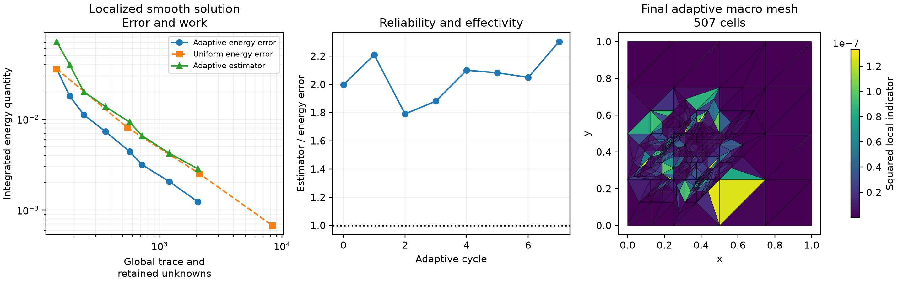
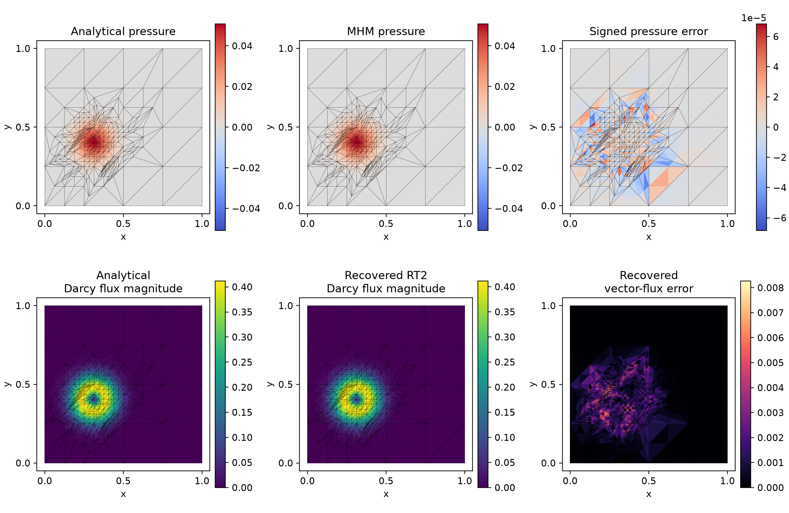
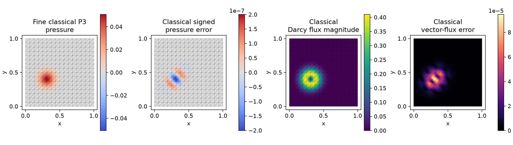

# Adaptive macro refinement and work

[Executable notebook](https://github.com/ipes-lncc/pymhm/blob/main/notebooks/darcy/reconstruction_and_indicators.ipynb) · [Download notebook](https://raw.githubusercontent.com/ipes-lncc/pymhm/main/notebooks/darcy/reconstruction_and_indicators.ipynb)

This lesson uses the estimator of
[Barrenechea et al. (2026)](https://doi.org/10.1137/24M1673073) on a smooth
localized exact pressure. The uniform studies in the
[recovery](flux-recovery.md) and [indicator](error-indicators.md) lessons first
verify their asymptotic estimates. Here eight actual adaptive solves test the
marking/refinement workflow and compare the same physical error against work.

## 1. Define a localized physical solution

$$
p(x,y)=x(1-x)y(1-y)\exp\!\left[-80\big((x-0.3)^2+(y-0.4)^2\big)\right].
$$

The pressure vanishes on every boundary edge. Set $K=I$, $q=-\nabla p$, and
$f=-\Delta p$. The notebook writes the NumPy derivatives explicitly and derives
the UFL source from the analytical expression independently. This is an
analytical extension of the paper's estimator examples, rather than a
reproduction of its heterogeneous-material application.

```python
def localized_forcing(domain):
    """Differentiate the analytical UFL pressure independently of NumPy."""
    x = ufl.SpatialCoordinate(domain)
    p = x[0]*(1-x[0])*x[1]*(1-x[1])*ufl.exp(-80*((x[0]-.3)**2+(x[1]-.4)**2))
    return -ufl.div(ufl.grad(p))
```

## 2. Declare the local and global variational equations

Reuse the explicitly written UFL volume and trace equations from the
[recovery lesson](flux-recovery.md). Choose P3 local pressure, independent P1
normal traces, RT2 reconstruction, two local edge subdivisions and the physical
constant volume moment. Only the source expression changes; the method and
polynomial degrees remain fixed.

$$
\begin{aligned}
(\nabla p_T,\nabla v)_T+\langle\lambda_T,v\rangle_{\partial T}&=(f,v)_T,\\
-\sum_T\langle p_T,\mu_T\rangle_{\partial T}&=0.
\end{aligned}
$$

## 3. Assemble, solve and measure before marking

Start with 32 macrotriangles. Rebuild the same declared forms after each
refinement. `solve_declared` in the notebook merely orchestrates those already
written forms and caller-chosen spaces; it does not select a Darcy formulation.

```python
adaptive_mesh = TriangleMesh.unit_square(4)
for step in range(8):
    solution = solve_declared(adaptive_mesh, 1, localized_source, localized_forcing)
    estimate = estimate_darcy_error(
        solution, homogeneous_dirichlet=True, degree=2, quadrature_order=16,
    )
    energy_error = estimate.energy_error(localized_gradient, order=16)
    assert estimate.total >= energy_error
    marked = mark_dorfler(estimate.local_squared, theta=0.5)
    if step < 7:
        adaptive_mesh = refine_triangles(adaptive_mesh, marked).mesh
```

The acquisition additionally integrates each physical error at orders 12 and
16 and checks original global compatibility and continuous-test equilibrium at every
cycle. A separate native eight-subdivision control verifies all original
local volume/trace rows for this localized pressure: maximum local relative
defect $4.20\times10^{-15}$ and full uncondensed defect relative to the
physical load $6.12\times10^{-15}$. These algebraic checks use the
unchanged $10^{-10}$ gate; they do not replace the physical-error study.
The mesh owner performs conforming closure; refining only the selected
triangles without this closure would not satisfy the estimator's mesh
hypotheses.

## 4. Distinguish marking from the chosen approximation scale

Dörfler marking satisfies

$$
\sum_{T\in\mathcal M}\eta_T^2\ge\theta\sum_T\eta_T^2,\qquad\theta=\tfrac12.
$$

This study refines the macro partition and rebuilds local meshes. Refining
local meshes or trace segments changes a different approximation scale and
requires rechecking degree and partition compatibility. Refinement ancestry is
available for preserving material and boundary markers.

## 5. Compare adaptive error against a matching uniform sequence

Uniform P3/P1/RT2 calculations use the same localized pressure, coefficient,
source, boundary conditions and local mesh ratio on $n=4,8,16,32$. Work counts
**trace plus retained mean unknowns**. The adaptive horizontal coordinate is
not a single fictitious mesh size; no uniform-grid exponent is fitted to it.



[PDF](../../assets/tutorials/methods/recovery-adaptive-work.pdf) · [SVG](../../assets/tutorials/methods/recovery-adaptive-work.svg)

| Adaptive cycle | Macrotriangles | Global trace + mean unknowns | Energy error | Effectivity |
| --- | --- | --- | --- | --- |
| 0 | 32 | 144 | 3.570890e-02 | 1.9984 |
| 1 | 42 | 184 | 1.792702e-02 | 2.2090 |
| 2 | 56 | 240 | 1.117302e-02 | 1.7902 |
| 3 | 86 | 360 | 7.311391e-03 | 1.8809 |
| 4 | 138 | 568 | 4.415988e-03 | 2.0999 |
| 5 | 175 | 717 | 3.152546e-03 | 2.0823 |
| 6 | 295 | 1197 | 2.060652e-03 | 2.0491 |
| 7 | 507 | 2045 | 1.237290e-03 | 2.3031 |

The last adaptive mesh has 2,045 global unknowns and energy error
$1.23729\times10^{-3}$. The matching uniform 16-subdivision mesh has 2,112
unknowns and error $2.51067\times10^{-3}$: a factor of 2.03 in physical
error at comparable global work. A smaller physical error at comparable work
is the relevant measured adaptive benefit. The estimator is checked against the exact energy error at every
cycle. Its nonconformity and divergence terms are retained throughout.



[PDF](../../assets/tutorials/methods/recovery-adaptive-fields.pdf) · [SVG](../../assets/tutorials/methods/recovery-adaptive-fields.svg)

Field/error panels preserve the actual macro partition and independent
one-sided values. These centroid display samples are separate from physical
volume integration. The independently assembled classical reference below uses exactly this
localized source, coefficient and boundary data. The analytical pressure
remains the exact comparator for all reported physical norms.


## 6. Verify a matching classical Galerkin reference

The global reference assembles a continuous P3 Galerkin space independently of
MHM. Its weak formulation has exactly the same identity coefficient and
localized source. The UFL source is derived from the analytical pressure above:

```python
def reference_forms(domain, V):
    p, v = ufl.TrialFunction(V), ufl.TestFunction(V)
    dx = ufl.Measure("dx", domain=domain, metadata={"quadrature_degree": 20})
    return (ufl.inner(ufl.grad(p), ufl.grad(v))*dx,
            localized_forcing(domain)*v*dx)
```

Use the notebook's explicitly defined `localized_pressure` and
`localized_gradient` callbacks for the analytical comparison. The boundary
selector below imposes the same zero pressure on all four sides. Execute all
three reference meshes with the same forms and degree:

```python
from examples.tutorial_recovery_reference import classical_reference_control


def boundary_nodes(points):
    """Select the homogeneous boundary values on the unit square."""
    return np.flatnonzero(np.any(np.isclose(points, 0) | np.isclose(points, 1), axis=1))


classical_rows = []
for n in (32, 64, 128):
    with threadpool_limits(1):
        row, reference_field = classical_reference_control(
            TriangleMesh.unit_square(n), 3, reference_forms, boundary_nodes,
            localized_pressure, localized_gradient,
        )
    row["mesh_resolution"] = n
    classical_rows.append(row)
    print(n, row["scalar_l2"], row["flux_l2"], row["quadrature_relative_difference"])
```

Native mesh/space mapping, essential elimination and independently integrated
physical norms use the reusable acquisition owners in
[the reference helper](https://github.com/ipes-lncc/pymhm/blob/main/examples/tutorial_recovery_reference.py).
The caller supplies the mesh, degree, these variational forms, boundary-node
indices and analytical pressure/gradient. No local MHM matrix or coefficients
are passed to the global reference.

The three refined reference meshes give:

| Global square subdivisions | P3 nodal unknowns | Pressure error | Physical vector-flux error |
| --- | --- | --- | --- |
| 32 × 32 | 9409 | 3.490465e-07 | 1.126836e-04 |
| 64 × 64 | 37249 | 2.150600e-08 | 1.414326e-05 |
| 128 × 128 | 148225 | 1.338314e-09 | 1.769402e-06 |

Pressure orders are 4.021 and 4.006; physical-flux
orders are 2.994 and 2.999. Both norm rules agree to a maximum
relative difference of 5.45e-12.



[PDF](../../assets/tutorials/methods/recovery-adaptive-classical-fields.pdf) · [SVG](../../assets/tutorials/methods/recovery-adaptive-classical-fields.svg)

The reference fields use the 64-subdivision global mesh. The overlay is the
16-subdivision uniform comparison macro mesh, rather than the adaptive mesh.
Every pressure/flux error shown compares the same analytical localized fields.

## 7. Decide when to change another scale

If the local solver or interface approximation dominates, macro refinement
alone can become inefficient. Change `MeshHierarchy` for local resolution and
`FaceSpace` for trace h/p refinement, then reassemble the declared equations.
`refine_darcy_budget` controls a requested macro-cell budget while preserving
the Dörfler bulk set and conforming closure, which can exceed that budget.

## References

- Gabriel R. Barrenechea, Larissa Martins, Weslley Pereira and Frédéric Valentin (2026). *An H(div; Ω)-Conforming Flux Reconstruction for the Multiscale Hybrid-Mixed Method*, Multiscale Modeling & Simulation 24(2), 399–428. [DOI: 10.1137/24M1673073](https://doi.org/10.1137/24M1673073); [accepted author manuscript](https://strathprints.strath.ac.uk/94435/).
- Christopher Harder, Diego Paredes and Frédéric Valentin (2013). *A family of Multiscale Hybrid-Mixed finite element methods for the Darcy equation with rough coefficients*, Journal of Computational Physics 245, 107–130. [DOI: 10.1016/j.jcp.2013.03.019](https://doi.org/10.1016/j.jcp.2013.03.019).
