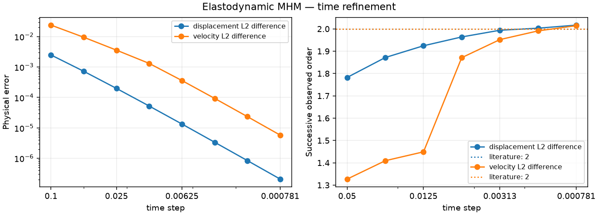

# Elastodynamic MHM

[Executable step-by-step notebook](https://github.com/ipes-lncc/pymhm/blob/main/notebooks/waves/elastodynamics/formulation_workflow.ipynb) · [Theory and degree conditions](../../theory/elasticity.md)


```python
from pathlib import Path
import numpy as np
from scipy import sparse
from pymhm import Equation, LocalEquations, MultiscaleProblem, assemble
from pymhm.meshes.triangle import TriangleMesh
from pymhm.linalg.dynamics import newmark_step
from pymhm.postprocessing.nodal import nodal_field
from examples.tutorial_elastodynamic_equations import prepare, initialize, advance

mesh = TriangleMesh.unit_square()
rho, dt = 2.4, 0.02
acceleration = np.array([1.0, -0.4])
traction = {int(face): np.zeros(2) for face in mesh.boundary_faces}

def force(time, points):
    """Return physical force density rho times the exact acceleration."""
    return rho * acceleration

```
## 1. Specify the spatial weak forms

The isotropic operators are

$$
\begin{aligned}
 m_T(u,v)&=(\rho u,v)_T,\\
 a_T(u,v)&=2(\mu\varepsilon(u),\varepsilon(v))_T
       +(\lambda_L\operatorname{div}u,\operatorname{div}v)_T.
\end{aligned}
$$

In UFL these integrands are `rho*inner(u,v)` and `2*mu*inner(sym(grad(u)),sym(grad(v))) + lame_lambda*div(u)*div(v)`. The companion's `prepare` integrates these declared isotropic operators with common Basix quadrature/scatter kernels, builds oriented traction maps, and owns reusable factors. Here density is 2.4 and both Lamé coefficients are one. This primal material is compressible; it has no uniform incompressible-limit claim.

## 2. Write source and interface response equations

Let $u_T^f,v_T^f$ be the force-driven Newmark history without interface force. Let $U_T,V_T$ be the responses to constant slabwise negative traction $Q_T\lambda$. Then

$$
\begin{aligned}
 u_T+U_T\lambda_T&=u_T^f,\\
 -\sum_TQ_T^T u_T&=-b,\\
 v_T&=v_T^f-V_T\lambda_T.
\end{aligned}
$$

The multiplier is negative physical Cauchy traction. Inertia makes the endpoint local operator invertible; no static rigid-motion kernel is inserted. Boundary traction is converted into fixed multiplier coordinates by the prepared geometric binding.

```python
def local_endpoint(item):
    """Write u + U lambda = u_free and signed endpoint displacement moments."""
    local, free_displacement, lift = item
    return LocalEquations(
        a=sparse.eye(local.mass.shape[0]),
        L=free_displacement,
        b=lift,
        c=-local.coupling.T,
        dofs=local.trace_dofs,
        field_data=(nodal_field("displacement", local.mesh, local.degree, components=2),),
    )

def global_endpoint(boundary):
    """Impose minus the exterior displacement moments on unfixed faces."""
    return Equation(0, -boundary)

```
## 3. Advance the local histories, assemble and solve

Use the shared Newmark primitive with beta=1/4 and gamma=1/2. All local steps finish at the same macro time. The example has one local step per macro step. `prepare` owns the native factors until its context exits. Full traction data allow the free rigid translation.

We first advance each local history, then pass its free displacement and interface response into the equations above. Assembly resolves each global face once. Named displacement and the recovered velocity remain in the executed local basis.

```python
records = []
fields = None
with prepare(mesh, time_step=dt, degree=2, density=rho, traction=traction) as data:
    previous = initialize(data)
    for step in range(4):
        free_u, free_v = [], []
        for index, local in enumerate(data.locals):
            u, v = newmark_step(
                local.mass, local.stiffness,
                data.step_factors[index], data.mass_factors[index], dt,
                previous.displacement[index], previous.velocity[index],
                local.load_at_time(force, step * dt),
                local.load_at_time(force, (step + 1) * dt),
            )
            free_u.append(u)
            free_v.append(v)
        items = tuple(zip(data.locals, free_u, data.lifts, strict=True))
        problem = MultiscaleProblem(
            global_endpoint(data.boundary), local_endpoint, items,
            data.trace_size, (0,) * len(items), fixed=data.fixed,
        )
        system = assemble(problem)
        solution = system.solve()
        velocity = tuple(
            v - lift @ solution.trace[local.trace_dofs]
            for local, lift, v in zip(data.locals, data.velocity_lifts, free_v, strict=True)
        )
        # Independently replay the original local Newmark histories and interface balance.
        reference = advance(data, previous, force)
        for computed, exact in zip(solution.fields, reference.displacement, strict=True):
            np.testing.assert_allclose(computed, exact, rtol=1e-10, atol=1e-12)
        for computed, exact in zip(velocity, reference.velocity, strict=True):
            np.testing.assert_allclose(computed, exact, rtol=1e-10, atol=1e-12)
        assert reference.l2_error(0.5 * reference.time**2 * acceleration) < 1e-11
        assert reference.l2_error(reference.time * acceleration, velocity=True) < 1e-10
        records.append({
            "time": reference.time,
            "displacement_L2": reference.l2_error(0.5 * reference.time**2 * acceleration),
            "velocity_L2": reference.l2_error(reference.time * acceleration, velocity=True),
            "global_original_relative_residual": solution.raw_residual,
        })
        fields = solution.field("displacement")
        previous = reference
records

```
## 4. Plot signed displacement with the macro mesh

This constant translation should have equal values on both sides of the interior macroface. Keep separate local coefficient vectors even when this patch is continuous. A genuine heterogeneous trajectory can have distinct one-sided values.

```python
import matplotlib.pyplot as plt
import matplotlib.tri as mtri

fig, axes = plt.subplots(1, 2, figsize=(9, 3.8), layout="constrained")
for component, ax in enumerate(axes):
    for field in fields:
        local_mesh = field.mesh
        values = field.evaluate(local_mesh.points)[:, component]
        image = ax.tripcolor(mtri.Triangulation(local_mesh.points[:, 0], local_mesh.points[:, 1], local_mesh.cells),
                     values, shading="gouraud", vmin=0.5*previous.time**2*acceleration[component]-1e-5,
                     vmax=0.5*previous.time**2*acceleration[component]+1e-5)
    fig.colorbar(image, ax=ax, label="Displacement")
    ax.triplot(mesh.points[:, 0], mesh.points[:, 1], mesh.cells, color="black", linewidth=0.7)
    ax.set(xlabel="x", ylabel="y", title=f"Displacement component {component + 1}", aspect="equal")
Path("build/tutorial-methods").mkdir(parents=True, exist_ok=True)
fig.savefig("build/tutorial-methods/elastodynamic-rigid-fields.png", dpi=200, metadata={"Author":"IPES Research Group", "License":"CC BY 4.0 — https://creativecommons.org/licenses/by/4.0/"})
plt.show()

```

## Independent classical Galerkin reference

On global P2 vector grids of 8, 16 and 32 subdivisions, assemble exactly the same density, isotropic energy and force. Zero exterior traction is the natural boundary condition. Initial displacement and velocity are zero. Use the common Newmark primitive and solve its positive inertial operator; no static rigid gauge is inserted. The exact rigid translation lies in every reference space, so these controls measure reproduction rather than a spatial rate.

```python
import ufl
from dolfinx import fem, mesh as native_mesh
from mpi4py import MPI
from pymhm import compile_form
from pymhm.linalg.linear import factorize

classical = []
for resolution in (8, 16, 32):
    domain = native_mesh.create_unit_square(MPI.COMM_SELF, resolution, resolution)
    space = fem.functionspace(domain, ("Lagrange", 2, (2,)))
    u, v = ufl.TrialFunction(space), ufl.TestFunction(space)
    dx = ufl.dx(domain=domain)
    mass_form = rho * ufl.inner(u,v)*dx
    stiffness_form = (2*ufl.inner(ufl.sym(ufl.grad(u)),ufl.sym(ufl.grad(v)))
                      + ufl.div(u)*ufl.div(v))*dx
    load_form = rho * ufl.inner(ufl.as_vector(tuple(acceleration)),v)*dx
    size = 2 * len(space.tabulate_dof_coordinates())
    M, K = compile_form(mass_form, (size,size)), compile_form(stiffness_form, (size,size))
    F = compile_form(load_form, (size,))
    displacement, velocity = np.zeros(size), np.zeros(size)
    with factorize(M) as mass_factor, factorize(M + dt**2/4*K) as step_factor:
        for step in range(4):
            displacement, velocity = newmark_step(M,K,step_factor,mass_factor,dt,
                                                   displacement,velocity,F,F)
    reference = fem.Function(space)
    reference.x.array[:] = displacement
    exact = ufl.as_vector(tuple(0.5*(4*dt)**2 * acceleration))
    difference = reference-exact
    error = np.sqrt(fem.assemble_scalar(fem.form(ufl.inner(difference,difference)*dx)))
    assert error < 1e-10
    classical.append({"resolution":resolution,"displacement_L2":float(error)})
classical

```

## 6. Qualified spatial and time refinement

The separate spatial study uses the analytical 3D displacement and velocity. Time differences use the same spatial discretization and a separately refined time reference; they are not exact-solution errors. Arbitrary asynchronous subcycling does not inherit the single-step global energy theorem.



[Vector SVG](../../assets/tutorials/methods/elastodynamics-convergence.svg) · [Publication PDF](../../assets/tutorials/methods/elastodynamics-convergence.pdf)

| Observable | Expected order | Penultimate interval | Final interval |
| --- | ---: | ---: | ---: |
| displacement L2 difference | 2 | 2.003 | 2.017 |
| velocity L2 difference | 2 | 1.991 | 2.014 |

Spaces: Fixed spatial space; Newmark beta=1/4, gamma=1/2; independently refined time reference. Refinement variable: time step.

[Numerical record](https://github.com/ipes-lncc/pymhm/blob/main/examples/results/elastodynamics/comparison.json), SHA-256 `21cb3e4a77d334139dfb53859acac4c9254ebe6b872dc46b0569ee91472e817d`.

## References

- Antonio Tadeu Gomes, Diego Paredes, Weslley Pereira, Roberto Souto and Frédéric Valentin (2017). *A Multiscale Hybrid-Mixed Method for the Elastodynamic Model with Rough Coefficients*. CILAMCE 2017. [DOI: 10.20906/CPS/CILAMCE2017-0399](https://doi.org/10.20906/CPS/CILAMCE2017-0399).
