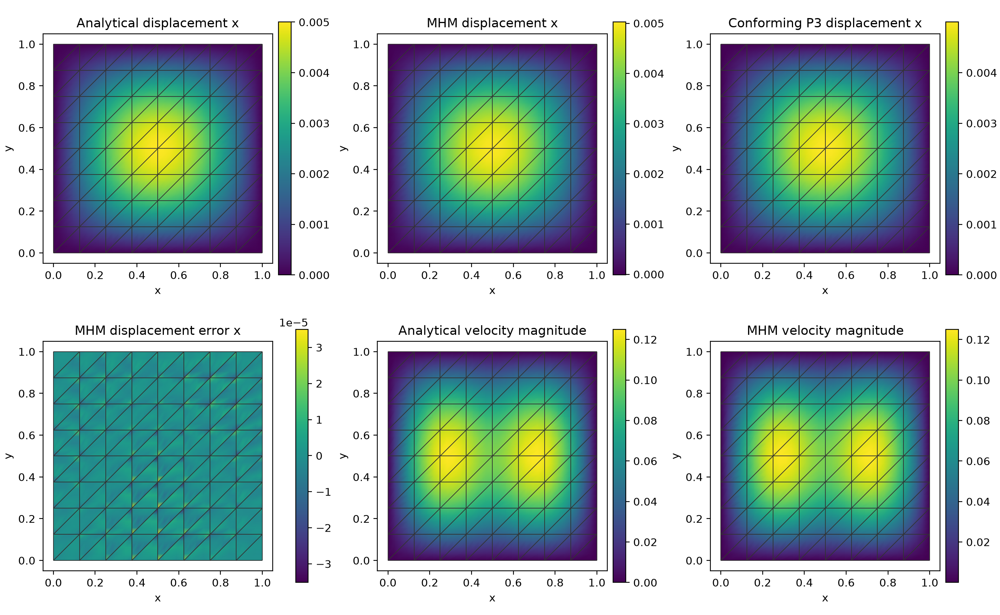
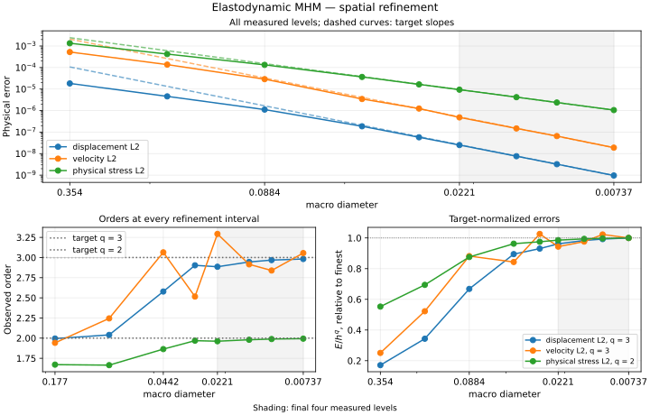
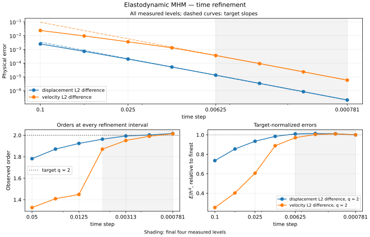

# Elastodynamic MHM

[Executable step-by-step notebook](https://github.com/ipes-lncc/pymhm/blob/main/notebooks/waves/elastodynamics/formulation_workflow.ipynb) · [Theory and degree conditions](../../theory/elasticity.md)


```python
from pathlib import Path
import numpy as np
from scipy import sparse
from pymhm import Equation, LocalEquations, MultiscaleProblem, assemble
from pymhm.meshes.triangle import TriangleMesh
from pymhm.linalg.dynamics import newmark_step
from pymhm.postprocessing.nodal import nodal_field
from examples.tutorial_elastodynamic_equations import prepare, initialize, advance

mesh = TriangleMesh.unit_square()
rho, dt = 2.4, 0.02
acceleration = np.array([1.0, -0.4])
traction = {int(face): np.zeros(2) for face in mesh.boundary_faces}

def force(time, points):
    """Return physical force density rho times the exact acceleration."""
    return rho * acceleration

```
## 1. Specify the spatial weak forms

The isotropic operators are

$$
\begin{aligned}
 m_T(u,v)&=(\rho u,v)_T,\\
 a_T(u,v)&=2(\mu\varepsilon(u),\varepsilon(v))_T
       +(\lambda_L\operatorname{div}u,\operatorname{div}v)_T.
\end{aligned}
$$

In UFL these integrands are `rho*inner(u,v)` and `2*mu*inner(sym(grad(u)),sym(grad(v))) + lame_lambda*div(u)*div(v)`. The companion's `prepare` integrates these declared isotropic operators with common Basix quadrature/scatter kernels, builds oriented traction maps, and owns reusable factors. Here density is 2.4 and both Lamé coefficients are one. This primal material is compressible; it has no uniform incompressible-limit claim.

## 2. Write source and interface response equations

Let $u_T^f,v_T^f$ be the force-driven Newmark history without interface force. Let $U_T,V_T$ be the responses to constant slabwise negative traction $Q_T\lambda$. Then

$$
\begin{aligned}
 u_T+U_T\lambda_T&=u_T^f,\\
 -\sum_TQ_T^T u_T&=-b,\\
 v_T&=v_T^f-V_T\lambda_T.
\end{aligned}
$$

The multiplier is negative physical Cauchy traction. Inertia makes the endpoint local operator invertible; no static rigid-motion kernel is inserted. Boundary traction is converted into fixed multiplier coordinates by the prepared geometric binding.

```python
def local_endpoint(item):
    """Write u + U lambda = u_free and signed endpoint displacement moments."""
    local, free_displacement, lift = item
    return LocalEquations(
        a=sparse.eye(local.mass.shape[0]),
        L=free_displacement,
        b=lift,
        c=-local.coupling.T,
        dofs=local.trace_dofs,
        field_data=(nodal_field("displacement", local.mesh, local.degree, components=2),),
    )

def global_endpoint(boundary):
    """Impose minus the exterior displacement moments on unfixed faces."""
    return Equation(0, -boundary)

```
## 3. Advance the local histories, assemble and solve

Use the shared Newmark primitive with beta=1/4 and gamma=1/2. All local steps finish at the same macro time. The example has one local step per macro step. `prepare` owns the native factors until its context exits. Full traction data allow the free rigid translation.

We first advance each local history, then pass its free displacement and interface response into the equations above. Assembly resolves each global face once. Named displacement and the recovered velocity remain in the executed local basis.

```python
records = []
fields = None
with prepare(mesh, time_step=dt, degree=2, density=rho, traction=traction) as data:
    previous = initialize(data)
    for step in range(4):
        free_u, free_v = [], []
        for index, local in enumerate(data.locals):
            u, v = newmark_step(
                local.mass, local.stiffness,
                data.step_factors[index], data.mass_factors[index], dt,
                previous.displacement[index], previous.velocity[index],
                local.load_at_time(force, step * dt),
                local.load_at_time(force, (step + 1) * dt),
            )
            free_u.append(u)
            free_v.append(v)
        items = tuple(zip(data.locals, free_u, data.lifts, strict=True))
        problem = MultiscaleProblem(
            global_endpoint(data.boundary), local_endpoint, items,
            data.trace_size, (0,) * len(items), fixed=data.fixed,
        )
        system = assemble(problem)
        solution = system.solve()
        velocity = tuple(
            v - lift @ solution.trace[local.trace_dofs]
            for local, lift, v in zip(data.locals, data.velocity_lifts, free_v, strict=True)
        )
        # Independently replay the original local Newmark histories and interface balance.
        reference = advance(data, previous, force)
        for computed, exact in zip(solution.fields, reference.displacement, strict=True):
            np.testing.assert_allclose(computed, exact, rtol=1e-10, atol=1e-12)
        for computed, exact in zip(velocity, reference.velocity, strict=True):
            np.testing.assert_allclose(computed, exact, rtol=1e-10, atol=1e-12)
        assert reference.l2_error(0.5 * reference.time**2 * acceleration) < 1e-11
        assert reference.l2_error(reference.time * acceleration, velocity=True) < 1e-10
        records.append({
            "time": reference.time,
            "displacement_L2": reference.l2_error(0.5 * reference.time**2 * acceleration),
            "velocity_L2": reference.l2_error(reference.time * acceleration, velocity=True),
            "global_original_relative_residual": solution.raw_residual,
        })
        fields = solution.field("displacement")
        previous = reference
records

```
## 4. Plot signed displacement with the macro mesh

This constant translation should have equal values on both sides of the interior macroface. Keep separate local coefficient vectors even when this patch is continuous. A genuine heterogeneous trajectory can have distinct one-sided values.

```python
import matplotlib.pyplot as plt
import matplotlib.tri as mtri

fig, axes = plt.subplots(1, 2, figsize=(9, 3.8), layout="constrained")
for component, ax in enumerate(axes):
    for field in fields:
        local_mesh = field.mesh
        values = field.evaluate(local_mesh.points)[:, component]
        image = ax.tripcolor(mtri.Triangulation(local_mesh.points[:, 0], local_mesh.points[:, 1], local_mesh.cells),
                     values, shading="gouraud", vmin=0.5*previous.time**2*acceleration[component]-1e-5,
                     vmax=0.5*previous.time**2*acceleration[component]+1e-5)
    fig.colorbar(image, ax=ax, label="Displacement")
    ax.triplot(mesh.points[:, 0], mesh.points[:, 1], mesh.cells, color="black", linewidth=0.7)
    ax.set(xlabel="x", ylabel="y", title=f"Displacement component {component + 1}", aspect="equal")
Path("build/tutorial-methods").mkdir(parents=True, exist_ok=True)
fig.savefig("build/tutorial-methods/elastodynamic-rigid-fields.png", dpi=200, metadata={"Author":"IPES Research Group", "License":"CC BY 4.0 — https://creativecommons.org/licenses/by/4.0/"})
plt.show()

```

## Independent classical Galerkin reference

On global P2 vector grids of 8, 16 and 32 subdivisions, assemble exactly the same density, isotropic energy and force. Zero exterior traction is the natural boundary condition. Initial displacement and velocity are zero. Use the common Newmark primitive and solve its positive inertial operator; no static rigid gauge is inserted. The exact rigid translation lies in every reference space, so these controls measure reproduction rather than a spatial rate.

```python
import ufl
from dolfinx import fem, mesh as native_mesh
from mpi4py import MPI
from pymhm import compile_form
from pymhm.linalg.linear import factorize

classical = []
for resolution in (8, 16, 32):
    domain = native_mesh.create_unit_square(MPI.COMM_SELF, resolution, resolution)
    space = fem.functionspace(domain, ("Lagrange", 2, (2,)))
    u, v = ufl.TrialFunction(space), ufl.TestFunction(space)
    dx = ufl.dx(domain=domain)
    mass_form = rho * ufl.inner(u,v)*dx
    stiffness_form = (2*ufl.inner(ufl.sym(ufl.grad(u)),ufl.sym(ufl.grad(v)))
                      + ufl.div(u)*ufl.div(v))*dx
    load_form = rho * ufl.inner(ufl.as_vector(tuple(acceleration)),v)*dx
    size = 2 * len(space.tabulate_dof_coordinates())
    M, K = compile_form(mass_form, (size,size)), compile_form(stiffness_form, (size,size))
    F = compile_form(load_form, (size,))
    displacement, velocity = np.zeros(size), np.zeros(size)
    with factorize(M) as mass_factor, factorize(M + dt**2/4*K) as step_factor:
        for step in range(4):
            displacement, velocity = newmark_step(M,K,step_factor,mass_factor,dt,
                                                   displacement,velocity,F,F)
    reference = fem.Function(space)
    reference.x.array[:] = displacement
    exact = ufl.as_vector(tuple(0.5*(4*dt)**2 * acceleration))
    difference = reference-exact
    error = np.sqrt(fem.assemble_scalar(fem.form(ufl.inner(difference,difference)*dx)))
    assert error < 1e-10
    classical.append({"resolution":resolution,"displacement_L2":float(error)})
classical

```

## 6. Define a smooth nonconstant dynamic problem

A translation patch verifies the equations but has no spatial approximation
error. The notebook therefore continues with zero initial and exterior
displacement on the square, unit density and Lamé coefficients, and

$$
\begin{aligned}
w(x,y)&=(\sin(\pi x)\sin(\pi y),
          \sin(2\pi x)\sin(\pi y)),\\
u_*(t,x,y)&=\tfrac12t^2w(x,y),
&v_*(t,x,y)&=tw(x,y),\\
\sigma(w)&=2\varepsilon(w)+(\nabla\cdot w)I,
&f(t,x,y)&=w-\tfrac12t^2\nabla\cdot\sigma(w).
\end{aligned}
$$

First declare the stress and source with UFL; the notebook independently
expands the derivatives in NumPy for the local force callback. The force is a
physical density, without an extra multiplier from the discrete mass matrix.

```python
def symbolic_dynamic_data(domain):
    x = ufl.SpatialCoordinate(domain)
    w = ufl.as_vector((ufl.sin(np.pi*x[0])*ufl.sin(np.pi*x[1]),
                       ufl.sin(2*np.pi*x[0])*ufl.sin(np.pi*x[1])))
    sigma = 2*ufl.sym(ufl.grad(w))+ufl.div(w)*ufl.Identity(2)
    return w, sigma, -ufl.div(sigma)
```

Use $P_3$ local displacement on one triangle and unsplit vector $P_1$ negative
traction. The notebook explicitly writes the endpoint equations before using
`advance` as their convenience execution loop. Its original local-history
replay checks the response reconstruction independently.

```python
macro = TriangleMesh.unit_square(8)
skeleton = SkeletonSpace(
    macro,tuple(FaceSpace.uniform(1) for _ in macro.faces),components=2,
)
with prepare(macro,skeleton=skeleton,time_step=0.005,degree=3,
             local_refinement=1,density=1,lame_lambda=1,lame_mu=1,
             quadrature_order=10) as data:
    state = initialize(data)
    for _ in range(20):
        state = advance(data,state,dynamic_force)
```

The notebook defines `dynamic_force` explicitly from the mathematical source.
The field panels compare the common physical time $T=0.1$. The spatial convergence
study compares endpoint errors at the same fixed $T=0.1$. Section 5.1 of
the publication specifies the spatial norms and rates; the temporal aggregation
of its plotted errors is not explicit. This tutorial additionally measures the maximum error
over every computed physical time as a separate control. Quadratic time
dependence reduces truncation pollution, while a separately halved time step
checks its influence on the discrete spatial result.



## 7. Refine the independent classical reference

The global conforming vector $P_3$ control independently assembles the UFL mass,
isotropic energy and symbolic source divergence. Strong exterior displacement
and zero initial data match the MHM physical problem. It uses the same
Newmark parameters, $\Delta t=0.005$ and $T=0.1$, with independent norm
quadrature degrees 14 and 18.

| Reference mesh | Displacement $L^2$ | Velocity $L^2$ | Physical stress $L^2$ |
| --- | ---: | ---: | ---: |
| $16\times16$ | $3.660\times10^{-8}$ | $7.345\times10^{-7}$ | $1.165\times10^{-5}$ |
| $32\times32$ | $2.268\times10^{-9}$ | $4.570\times10^{-8}$ | $1.458\times10^{-6}$ |
| $64\times64$ | $1.414\times10^{-10}$ | $2.850\times10^{-9}$ | $1.822\times10^{-7}$ |

Original momentum relative residuals remain below $4.4\times10^{-16}$.
Halving the time step on the finest reference changes displacement and stress
errors by 0.048% and 0.00037%, respectively, and velocity error by 0.95%.
The refined numerical reference is qualified against the exact physical fields;
it does not become an exact solution. The MHM uses its coarser independent
macro mesh and local traction responses.

## 8. Distinguish spatial MHM and temporal Newmark estimates

For smooth admissible local lifting spaces and $P_\ell$ negative traction,
Section 5.1 and Figure 3 of the original paper report displacement and velocity
$L^2$ order $\ell+2$ and broken $H^1$ order $\ell+1$ after time error is resolved.
Those dynamic rates are numerical results; the paper cites the theoretical
superconvergence result for the corresponding elastostatic formulation.
The present study measures physical Cauchy stress in $L^2$, with the gradient
target $\ell+1$. This differs from the paper's broken $H(\mathrm{div})$ stress
norm in equation (54), whose reported order is $\ell$.
Here $\ell=1$. Raw primal Cauchy stress has no asserted global $H(\mathrm{div})$
conformity. This two-dimensional manufactured qualification has explicitly
stated data and spaces; it is not the paper's three-dimensional table.
[Gomes et al. (2017)](https://doi.org/10.20906/CPS/CILAMCE2017-0399).

The refinement sequence retains macro-grid resolutions
$n=4,8,16,32,48,64,96,128,192$. The final four levels use the same analytical
source, local P3 space, P1 negative-traction trace, time step $0.005$ and endpoint
$T=0.1$. Rates use the actual consecutive mesh-size ratios, including the
non-dyadic intervals.

| Physical endpoint observable | Smooth-data target | Last three orders | Maximum/minimum of $E/H^q$ |
| --- | ---: | --- | ---: |
| displacement $L^2$ | 3 | 2.9447, 2.9681, 2.9816 | 1.0398 |
| velocity $L^2$ | 3 | 2.9153, 2.8390, 3.0551 | 1.0840 |
| Cauchy stress $L^2$ | 2 | 1.9796, 1.9886, 1.9934 | 1.0143 |

Displacement and stress have stable asymptotic tails. The velocity error follows
a third-order envelope: the fitted tail order is 2.9400 and its normalized
amplitude varies by 8.4%, while the consecutive slopes fluctuate around that
envelope. These observations retain all intervals rather than replacing them
with a single fitted order. The independently evaluated maximum-in-time norms
are preserved beside the endpoint norms in the same acquisition records.

A separate $n=128$ control halves the time step from $0.005$ to $0.0025$ at
the same endpoint $T=0.1$, preserving every spatial space and physical datum.
The displacement, velocity and stress error norms change by 0.2994%, 3.3131%
and 0.1391%, respectively. The maximum-in-time observations give the same
sensitivities to the stated precision. These are measured sensitivities of
physical error norms; the control belongs to $n=128$, rather than to the
finest $n=192$ level, and does not identify a unique cause of the velocity
slope fluctuations.

Its independent norm quadratures of orders 10 and 14 agree to within
$2.54\times10^{-12}$ relatively. Every endpoint response passes the replay
against the original local Newmark histories. The separately recorded global
displacement-moment compatibility residual is $1.07\times10^{-18}$.



The separate time study fixes its spatial discretization and compares it
against an independently refined time reference. These are time differences,
not exact continuum errors. Arbitrary asynchronous subcycling does not inherit
the single-step global energy theorem.



| Temporal observable | Expected order | Last three orders |
| --- | ---: | --- |
| displacement $L^2$ difference | 2 | 1.9938, 2.0030, 2.0168 |
| velocity $L^2$ difference | 2 | 1.9519, 1.9910, 2.0143 |

The figure retains all measured levels and uses the final four time levels
for the normalized-amplitude check. A second-order temporal result alone
does not establish the spatial multiscale estimates.

## References

- Antonio Tadeu Gomes, Diego Paredes, Weslley Pereira, Roberto Souto and Frédéric Valentin (2017). *A Multiscale Hybrid-Mixed Method for the Elastodynamic Model with Rough Coefficients*. CILAMCE 2017. [DOI: 10.20906/CPS/CILAMCE2017-0399](https://doi.org/10.20906/CPS/CILAMCE2017-0399).
