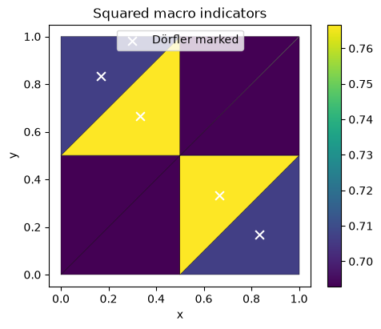

# Physical error indicators

[Complete executable notebook](https://github.com/ipes-lncc/pymhm/blob/main/notebooks/darcy/reconstruction_and_indicators.ipynb) · [Download](https://raw.githubusercontent.com/ipes-lncc/pymhm/main/notebooks/darcy/reconstruction_and_indicators.ipynb)


This lesson starts with user-written UFL local/global equations. It then defines a physical coefficient record, reconstructs an H(div) flux, evaluates an estimator and chooses cells for refinement. Numerical algorithms remain in the package; no physical-model constructor selects the equations.

The primary case is $p=\sin(2\pi x)\sin(2\pi y)$, $K=I$, $f=8\pi^2p$, with homogeneous Dirichlet pressure on the unit square. The formulation follows [Harder, Paredes and Valentin (2013)](https://doi.org/10.1016/j.jcp.2013.03.019). Flux recovery and the four-term estimator follow [Barrenechea, Martins, Pereira and Valentin (2026)](https://doi.org/10.1137/24M1673073).

Install the native UFL backend as explained in the installation guide. The workflow is **meshes → local forms → global forms → assemble → solve → recovery → indicators → marking**.

```python
import numpy as np
import matplotlib.pyplot as plt
import ufl
from pymhm import (
    Equation, FaceSpace, LocalContext, MeshHierarchy, SkeletonSpace, TriangleMesh,
    assemble, bind_interface, bind_problem, columns, solve,
)
from pymhm.postprocessing.solutions import DarcySolution
from pymhm.recovery.moments import reconstruct_darcy_moments
from pymhm.estimators.darcy import estimate_darcy_error
from pymhm.adaptivity.darcy import mark_dorfler
from threadpoolctl import threadpool_limits


def exact_pressure(points: np.ndarray) -> np.ndarray:
    """Analytical pressure; it vanishes on every exterior edge."""
    return np.sin(2 * np.pi * points[:, 0]) * np.sin(2 * np.pi * points[:, 1])


def exact_gradient(points: np.ndarray) -> np.ndarray:
    """Independently differentiated physical pressure gradient."""
    x, y = 2 * np.pi * points.T
    return 2 * np.pi * np.column_stack((np.cos(x) * np.sin(y), np.sin(x) * np.cos(y)))


def source(points: np.ndarray) -> np.ndarray:
    """Negative Laplacian computed independently of the discrete operator."""
    return 8 * np.pi**2 * exact_pressure(points)
```

## 1. Choose meshes and approximation spaces

For reconstruction degree $m=2$ and trace degree $\ell=1$, choose local degree $k=3$. This satisfies the two-dimensional restriction $k\ge\ell+2$ and $\ell\le m\le k$. The estimator additionally needs convex macrotriangles, a globally conforming fine partition, identity diffusion and homogeneous Dirichlet data. These are mathematical restrictions, not conventions inferred by the software.

```python
macro = TriangleMesh.unit_square(2)
local_meshes = tuple(macro.submesh(cell, 2) for cell in range(len(macro.cells)))
hierarchy = MeshHierarchy(macro, local_meshes)
skeleton = SkeletonSpace(macro, tuple(FaceSpace.uniform(1) for _ in macro.faces))
interface = bind_interface(skeleton, convention="normal")
```

## 2. Declare local equations

$$
\begin{aligned}
(\nabla p_T,\nabla v)_T+\langle\lambda_T,v\rangle_{\partial T}&=(f,v)_T,\\
-\langle p_T,\mu_T\rangle_{\partial T}&=g_T(\mu_T).
\end{aligned}
$$

The local volume form has a constant kernel. Its physical volume moment fixes the local complement and retains one mean per macrocell. The interface binding supplies normal incidence and numbering; the minus sign in the global test pairing is part of the formulation.

```python
def local_equations(local: LocalContext):
    """Declare primal diffusion, independent trace tests and physical mean."""
    space = local.native_space(degree=3)
    p, v = ufl.TrialFunction(space.space), ufl.TestFunction(space.space)
    x = ufl.SpatialCoordinate(space.mesh)
    dx = ufl.Measure("dx", domain=space.mesh, metadata={"quadrature_degree": 12})
    forcing = 8 * np.pi**2 * ufl.sin(2 * np.pi * x[0]) * ufl.sin(2 * np.pi * x[1])
    local.field("pressure", space)
    return local.equations(
        a=ufl.inner(ufl.grad(p), ufl.grad(v)) * dx,
        L=forcing * v * dx,
        b=local.trace_pairings(lambda phi, ds: phi * v * ds),
        c=local.trace_pairings(lambda phi, ds: -phi * p * ds, axis="rows"),
        kernel=np.ones((space.size, 1)), moments=columns(v * dx),
    )
```

## 3. Declare global boundary moments

$$
-\sum_T\langle p_T,\mu_T\rangle_{\partial T}
=-\langle p_D,\mu\rangle_{\partial\Omega},\qquad p_D=0.
$$

The Dirichlet load is therefore zero. Its sign is kept explicit so that changing the boundary data does not change the formulation accidentally.

```python
def global_equation(global_context):
    """Supply the weak Dirichlet moments in the bound interface layout."""
    boundary, fixed = global_context.boundary_data(0.0, order=8)
    assert not fixed
    return Equation(0, global_context.trace_load(-boundary))


problem = bind_problem(hierarchy, interface, local_equations,
                       global_equation=global_equation, retained=1)
```

## 4. Assemble, solve and name the physical result

Named fields preserve the native executed coefficient basis. `portable_coefficients` converts through its stored mapping; reshaping native vectors would not be equivalent. `DarcySolution` below is a data record for established reconstruction and estimator operations. Constructing it performs no PDE solve.

```python
with threadpool_limits(1):
    system = assemble(problem)
    coefficients = solve(system)
pressure_fields = coefficients.field("pressure")
solution = DarcySolution(
    skeleton=skeleton, local_meshes=local_meshes,
    pressure=tuple(field.portable_coefficients for field in pressure_fields),
    flux=(), hybrid=coefficients, formulation="primal", permeability=1.0,
    source=source, degree=3, quadrature_order=10,
)
print({"original_equation_residual": coefficients.raw_residual,
       "pressure_L2": solution.l2_error(exact_pressure, order=12)})
```

```text
{'original_equation_residual': 1.694165673686481e-16, 'pressure_L2': 0.1237896762091817}
```

## 5. Evaluate the four-term indicator

$$
\eta^2=\sum_T\big[(\eta_{1,T}+\eta_{3,T}+\eta_{\mathrm{osc},T})^2
+\eta_{2,T}^2\big].
$$

The contributions measure flux defect, potential nonconformity, divergence-projection defect and source oscillation. The recovered potential is a separate continuous field. For this unit-diffusion case, compare the estimator with the independently integrated broken energy error; numerical quadrature does not provide an interval-certified bound.

```python
estimate = estimate_darcy_error(solution, homogeneous_dirichlet=True,
                                degree=2, quadrature_order=10)
energy_error = estimate.energy_error(exact_gradient, order=12)
assert max(estimate.equilibrium_defect) < 1e-10
assert estimate.total >= energy_error
print({"energy_error": energy_error, "estimator": estimate.total,
       "effectivity": estimate.total / energy_error})
```

```text
{'energy_error': 1.8000808304439524, 'estimator': 2.3912395807993514, 'effectivity': 1.3284067806052922}
```

## 6. Plot physical fields with the actual macro mesh

Each field panel has its own color scale. Numerical values and errors are sampled independently in each local mesh, preserving interface sides.

```python
fig, axes = plt.subplots(1, 3, figsize=(12, 3.6), layout="constrained")
all_exact, all_values, panels = [], [], []
for fine, field in zip(local_meshes, pressure_fields, strict=True):
    points = fine.points[fine.cells].mean(axis=1)
    exact, values = exact_pressure(points), field.evaluate(points)
    panels.append((fine, exact, values))
    all_exact.extend(exact)
    all_values.extend(values)
common = max(np.max(np.abs(all_exact)), np.max(np.abs(all_values)))
error_max = max(np.max(abs(values - exact)) for _, exact, values in panels)
for index, (ax, title) in enumerate(zip(axes, ("Analytical pressure", "MHM pressure", "Pressure error"), strict=True)):
    for fine, exact, values in panels:
        value = (exact, values, values - exact)[index]
        limit = error_max if index == 2 else common
        artist = ax.tripcolor(*fine.points.T, fine.cells, facecolors=value,
                             vmin=-limit, vmax=limit, cmap="coolwarm")
    for edge in macro.faces:
        ax.plot(*macro.points[edge].T, color="black", lw=0.5, alpha=0.7)
    ax.set(title=title, xlabel="x", ylabel="y", aspect="equal")
    fig.colorbar(artist, ax=ax)
plt.show()
```


The field panels use one sample at each fine triangle’s centroid $x_t$, drawn as a constant triangle color. The analytical panel shows $p(x_t)$; the numerical panel shows $p_h(x_t)$, and the error panel shows the **signed** difference $p_h(x_t)-p(x_t)$. These are display samples of the continuous analytical and local polynomial fields. The physical error norms above use independent volume quadrature. Macro edges are overlaid and values from opposite sides of an interface remain separate.

## 7. Mark cells; choose the scale you want to improve

Dörfler marking selects a minimal sorted collection carrying the prescribed fraction of the squared indicator:

$$
\sum_{T\in\mathcal M}\eta_T^2\ge\theta\sum_T\eta_T^2.
$$

Marking is distinct from refining. Before changing a mesh, choose whether the dominant error comes from the macro partition, local approximation, or trace resolution. Refinement ancestry must preserve material and boundary markers. Rebuild the equations on the new spaces and compare error against work; a general adaptive sequence has no predetermined uniform-grid rate.

```python
marked = mark_dorfler(estimate.local_squared, theta=0.5)
assert estimate.local_squared[marked].sum() >= 0.5 * estimate.local_squared.sum()
fig, ax = plt.subplots(figsize=(5, 4), layout="constrained")
artist = ax.tripcolor(*macro.points.T, macro.cells, facecolors=estimate.local_squared,
                     edgecolors="black", cmap="viridis")
centers = macro.points[macro.cells[marked]].mean(axis=1)
ax.scatter(*centers.T, marker="x", color="white", s=60, label="Dörfler marked")
ax.set(xlabel="x", ylabel="y", title="Squared macro indicators", aspect="equal")
ax.legend()
fig.colorbar(artist, ax=ax)
plt.show()
print({"marked_macro_cells": np.flatnonzero(marked).tolist(), "marked_fraction":
       float(estimate.local_squared[marked].sum() / estimate.local_squared.sum())})
```



Each macrotriangle’s color represents its integrated squared indicator. Crosses locate the centroids of marked macroelements; they identify the selected cells and are not pointwise residual samples.

```text
{'marked_macro_cells': [2, 3, 4, 5], 'marked_fraction': 0.5152866001958776}
```

## Choose the estimator for the stated operator

The four-term estimator above applies to identity diffusion, convex macrotriangles, homogeneous Dirichlet pressure and a globally conforming fine partition; its degree conditions are $k\ge\ell+2$ and $\ell\le m\le k$. The notebook checks equilibrium, the energy upper bound and effectivity. A single effectivity value does not prove an estimator theorem for unrelated coefficients.

For heterogeneous positive-definite material use `pymhm.estimators.darcy_energy.estimate_weighted_darcy_error`, with certified ellipticity and representable boundary data. For velocity–pressure fields use `pymhm.estimators.flow.estimate_flow_error`; its pressure and momentum residuals use the same physical viscosity, drag and convection as the solution. For primal elasticity use `pymhm.estimators.elasticity.estimate_primal_elasticity_error`, with the physical material tensor and traction convention. These are distinct indicators; do not apply the scalar identity-diffusion guarantee to those systems. Their complete physical workflows are the [flow](stokes-brinkman.md) and [elasticity](primal-elasticity.md) tutorials.

## References

- Gabriel R. Barrenechea, Larissa Martins, Weslley Pereira, and Frédéric Valentin (2026). *An H(div; Ω)-Conforming Flux Reconstruction for the Multiscale Hybrid-Mixed Method*, Multiscale Modeling & Simulation 24(2), 399–428. [DOI: 10.1137/24M1673073](https://doi.org/10.1137/24M1673073).
- Rodolfo Araya, Christopher Harder, Diego Paredes, and Frédéric Valentin (2013). *Multiscale Hybrid-Mixed Method*, SIAM Journal on Numerical Analysis 51(6), 3505–3531. [DOI: 10.1137/120888223](https://doi.org/10.1137/120888223).
