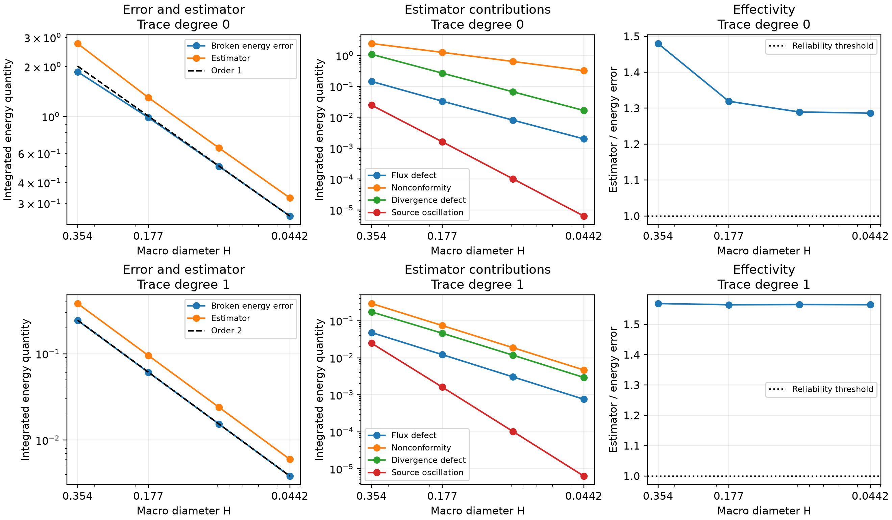

# Physical error indicators

[Executable notebook](https://github.com/ipes-lncc/pymhm/blob/main/notebooks/darcy/reconstruction_and_indicators.ipynb) · [Download notebook](https://raw.githubusercontent.com/ipes-lncc/pymhm/main/notebooks/darcy/reconstruction_and_indicators.ipynb)

Use the already declared local/global UFL equations in the
[flux-recovery lesson](flux-recovery.md), then measure the estimator alongside
the true physical error. The smooth analytical case uses the same data as
[Barrenechea et al. (2026), §6.1](https://doi.org/10.1137/24M1673073).
The purpose is to establish estimator reliability, its convergence, and a
stable effectivity over a resolved refinement sequence.

## 1. Solve the declared problem on compatible spaces

For $\ell=0$ use P2 local pressure; for $\ell=1$ use P3. The canonical
reconstruction is RT2 in both branches, with $h=H/2$. Identity diffusion,
homogeneous Dirichlet pressure, convex macrotriangles and a globally conforming
fine mesh are explicit inputs. They are hypotheses of the estimator, rather
than automatically selected properties of a Darcy model.

```python
with threadpool_limits(1):
    coefficients = solve(assemble(problem))
pressure_fields = coefficients.field("pressure")
```

The notebook constructs `DarcySolution` from these mapped coefficients and the
independently defined source. No opaque problem-specific solver selects the
physical formulation.

## 2. Form the four physical contributions

The estimator in equations (5.3)–(5.7) uses

$$
\begin{aligned}
\eta_{1,T}&=\lVert\nabla p_h+q_h^R\rVert_{0,T},\\
\eta_{2,T}&=\lVert\nabla(p_h-I_{\mathrm{OS}}p_h)\rVert_{0,T},\\
\eta_{3,T}&=\frac{H_T}{\pi}\lVert\Pi_{T,2}\operatorname{div}q_h^R-
\operatorname{div}q_h^R\rVert_{0,T},\\
\eta_{\mathrm{osc},T}&=\frac{H_T}{\pi}\lVert f-\Pi_{T,2}f\rVert_{0,T}.
\end{aligned}
$$

The conforming potential $I_{\mathrm{OS}}p_h$ and the canonical RT2 flux $q_h^R$
are separately reconstructed fields. Continuous-test equilibrium is checked
before the reliability estimate is evaluated. Global original compatibility is
a separate diagnostic; an [independent volume/trace-row observer](flux-recovery.md#4-assemble-solve-and-retain-the-executed-field-basis)
checks the local original equations on both degree branches.

```python
estimate = estimate_darcy_error(
    solution, homogeneous_dirichlet=True, degree=2, quadrature_order=16,
)
energy_error = estimate.energy_error(exact_gradient, order=16)
assert max(estimate.equilibrium_defect) < 1e-10
assert estimate.total >= energy_error
```

## 3. Compare with the true error and inspect effectivity

Theorem 5.2 yields

$$
\begin{aligned}
\lVert\nabla(p-p_h)\rVert_{0,\Omega}^2
&\le\sum_T\left[(\eta_{1,T}+\eta_{3,T}+\eta_{\mathrm{osc},T})^2
+\eta_{2,T}^2\right]=\eta^2,\\
I_{\mathrm{eff}}&=\frac{\eta}{\lVert\nabla(p-p_h)\rVert_{0,\Omega}}.
\end{aligned}
$$

The continuous theorem assumes exact integration. PyMHM reports positive
quadrature estimates and checks a second independent error rule; it does not
claim interval certification. An effectivity greater than one establishes the
measured upper bound. Effectivity need not converge to one: its efficiency
constant depends on the mesh ratio and approximation spaces.

## 4. Reach the smooth-case asymptotic regime

The current native study uses $n=4,8,16,32$ square subdivisions, with every
assembly and recovery recomputed. The broken energy error has order
$H^{\ell+1}$ under the stated regularity. For fixed $H/h=2$, the estimator
shows the same leading decay and stable effectivity; its individual contributions
are plotted separately. This is the
behavior illustrated by §6.1 of the paper; table ordinates are not asserted to
be identical.



[PDF](../../assets/tutorials/methods/recovery-estimator-convergence.pdf) · [SVG](../../assets/tutorials/methods/recovery-estimator-convergence.svg)

| Trace degree | Macro subdivisions | Broken energy error | Estimator | Effectivity |
| --- | --- | --- | --- | --- |
| 0 | 4 | 1.860873e+00 | 2.754206e+00 | 1.4801 |
| 0 | 8 | 9.865552e-01 | 1.301577e+00 | 1.3193 |
| 0 | 16 | 5.010100e-01 | 6.460385e-01 | 1.2895 |
| 0 | 32 | 2.514957e-01 | 3.235498e-01 | 1.2865 |
| 1 | 4 | 2.434897e-01 | 3.819492e-01 | 1.5686 |
| 1 | 8 | 6.097962e-02 | 9.540820e-02 | 1.5646 |
| 1 | 16 | 1.528115e-02 | 2.391859e-02 | 1.5652 |
| 1 | 32 | 3.826503e-03 | 5.987559e-03 | 1.5648 |

The independently assembled fine classical P3 baseline is checked against the
same analytical pressure and physical flux on three refined global meshes.
It is a numerical reference; the exact solution remains the analytical field.

## 5. Use the local indicator for a refinement decision

```python
marked = mark_dorfler(estimate.local_squared, theta=0.5)
assert estimate.local_squared[marked].sum() >= 0.5*estimate.local_squared.sum()
```

`local_squared` contains integrated squared macro indicators. These values are
not pointwise residual samples. Follow the [adaptive workflow](adaptivity.md)
to rebuild the equations after marking and compare error against actual work.

## References

- Gabriel R. Barrenechea, Larissa Martins, Weslley Pereira and Frédéric Valentin (2026). *An H(div; Ω)-Conforming Flux Reconstruction for the Multiscale Hybrid-Mixed Method*, Multiscale Modeling & Simulation 24(2), 399–428. [DOI: 10.1137/24M1673073](https://doi.org/10.1137/24M1673073); [accepted author manuscript](https://strathprints.strath.ac.uk/94435/).
- Christopher Harder, Diego Paredes and Frédéric Valentin (2013). *A family of Multiscale Hybrid-Mixed finite element methods for the Darcy equation with rough coefficients*, Journal of Computational Physics 245, 107–130. [DOI: 10.1016/j.jcp.2013.03.019](https://doi.org/10.1016/j.jcp.2013.03.019).
