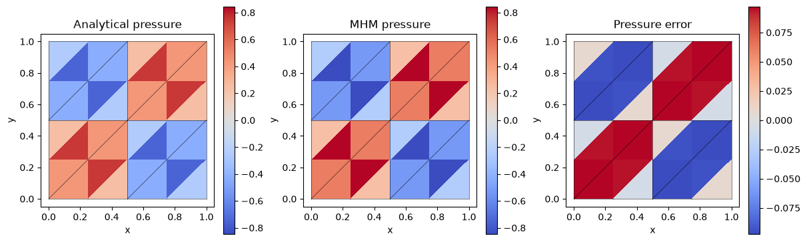

# Flux and conforming potential recovery

[Complete executable notebook](https://github.com/ipes-lncc/pymhm/blob/main/notebooks/darcy/reconstruction_and_indicators.ipynb) · [Download](https://raw.githubusercontent.com/ipes-lncc/pymhm/main/notebooks/darcy/reconstruction_and_indicators.ipynb)


This lesson starts with user-written UFL local/global equations. It then defines a physical coefficient record, reconstructs an H(div) flux, evaluates an estimator and chooses cells for refinement. Numerical algorithms remain in the package; no physical-model constructor selects the equations.

The primary case is $p=\sin(2\pi x)\sin(2\pi y)$, $K=I$, $f=8\pi^2p$, with homogeneous Dirichlet pressure on the unit square. The formulation follows [Harder, Paredes and Valentin (2013)](https://doi.org/10.1016/j.jcp.2013.03.019). Flux recovery and the four-term estimator follow [Barrenechea, Martins, Pereira and Valentin (2026)](https://doi.org/10.1137/24M1673073).

Install the native UFL backend as explained in the installation guide. The workflow is **meshes → local forms → global forms → assemble → solve → recovery → indicators → marking**.

```python
import numpy as np
import matplotlib.pyplot as plt
import ufl
from pymhm import (
    Equation, FaceSpace, LocalContext, MeshHierarchy, SkeletonSpace, TriangleMesh,
    assemble, bind_interface, bind_problem, columns, solve,
)
from pymhm.postprocessing.solutions import DarcySolution
from pymhm.recovery.moments import reconstruct_darcy_moments
from pymhm.estimators.darcy import estimate_darcy_error
from pymhm.adaptivity.darcy import mark_dorfler
from threadpoolctl import threadpool_limits


def exact_pressure(points: np.ndarray) -> np.ndarray:
    """Analytical pressure; it vanishes on every exterior edge."""
    return np.sin(2 * np.pi * points[:, 0]) * np.sin(2 * np.pi * points[:, 1])


def exact_gradient(points: np.ndarray) -> np.ndarray:
    """Independently differentiated physical pressure gradient."""
    x, y = 2 * np.pi * points.T
    return 2 * np.pi * np.column_stack((np.cos(x) * np.sin(y), np.sin(x) * np.cos(y)))


def source(points: np.ndarray) -> np.ndarray:
    """Negative Laplacian computed independently of the discrete operator."""
    return 8 * np.pi**2 * exact_pressure(points)
```

## 1. Choose meshes and approximation spaces

For reconstruction degree $m=2$ and trace degree $\ell=1$, choose local degree $k=3$. This satisfies the two-dimensional restriction $k\ge\ell+2$ and $\ell\le m\le k$. The estimator additionally needs convex macrotriangles, a globally conforming fine partition, identity diffusion and homogeneous Dirichlet data. These are mathematical restrictions, not conventions inferred by the software.

```python
macro = TriangleMesh.unit_square(2)
local_meshes = tuple(macro.submesh(cell, 2) for cell in range(len(macro.cells)))
hierarchy = MeshHierarchy(macro, local_meshes)
skeleton = SkeletonSpace(macro, tuple(FaceSpace.uniform(1) for _ in macro.faces))
interface = bind_interface(skeleton, convention="normal")
```

## 2. Declare local equations

$$
\begin{aligned}
(\nabla p_T,\nabla v)_T+\langle\lambda_T,v\rangle_{\partial T}&=(f,v)_T,\\
-\langle p_T,\mu_T\rangle_{\partial T}&=g_T(\mu_T).
\end{aligned}
$$

The local volume form has a constant kernel. Its physical volume moment fixes the local complement and retains one mean per macrocell. The interface binding supplies normal incidence and numbering; the minus sign in the global test pairing is part of the formulation.

```python
def local_equations(local: LocalContext):
    """Declare primal diffusion, independent trace tests and physical mean."""
    space = local.native_space(degree=3)
    p, v = ufl.TrialFunction(space.space), ufl.TestFunction(space.space)
    x = ufl.SpatialCoordinate(space.mesh)
    dx = ufl.Measure("dx", domain=space.mesh, metadata={"quadrature_degree": 12})
    forcing = 8 * np.pi**2 * ufl.sin(2 * np.pi * x[0]) * ufl.sin(2 * np.pi * x[1])
    local.field("pressure", space)
    return local.equations(
        a=ufl.inner(ufl.grad(p), ufl.grad(v)) * dx,
        L=forcing * v * dx,
        b=local.trace_pairings(lambda phi, ds: phi * v * ds),
        c=local.trace_pairings(lambda phi, ds: -phi * p * ds, axis="rows"),
        kernel=np.ones((space.size, 1)), moments=columns(v * dx),
    )
```

## 3. Declare global boundary moments

$$
-\sum_T\langle p_T,\mu_T\rangle_{\partial T}
=-\langle p_D,\mu\rangle_{\partial\Omega},\qquad p_D=0.
$$

The Dirichlet load is therefore zero. Its sign is kept explicit so that changing the boundary data does not change the formulation accidentally.

```python
def global_equation(global_context):
    """Supply the weak Dirichlet moments in the bound interface layout."""
    boundary, fixed = global_context.boundary_data(0.0, order=8)
    assert not fixed
    return Equation(0, global_context.trace_load(-boundary))


problem = bind_problem(hierarchy, interface, local_equations,
                       global_equation=global_equation, retained=1)
```

## 4. Assemble, solve and name the physical result

Named fields preserve the native executed coefficient basis. `portable_coefficients` converts through its stored mapping; reshaping native vectors would not be equivalent. `DarcySolution` below is a data record for established reconstruction and estimator operations. Constructing it performs no PDE solve.

```python
with threadpool_limits(1):
    system = assemble(problem)
    coefficients = solve(system)
pressure_fields = coefficients.field("pressure")
solution = DarcySolution(
    skeleton=skeleton, local_meshes=local_meshes,
    pressure=tuple(field.portable_coefficients for field in pressure_fields),
    flux=(), hybrid=coefficients, formulation="primal", permeability=1.0,
    source=source, degree=3, quadrature_order=10,
)
print({"original_equation_residual": coefficients.raw_residual,
       "pressure_L2": solution.l2_error(exact_pressure, order=12)})
```

```text
{'original_equation_residual': 1.694165673686481e-16, 'pressure_L2': 0.1237896762091817}
```

## 5. Reconstruct a flux and distinguish its conservation tests

The canonical RT moment reconstruction preserves boundary normal moments from the skeleton, averages interior normal moments and preserves raw interior vector moments. It is not the energy-minimizing RT0 equilibration. Its divergence balance is against continuous macro-local tests, not individual discontinuous fine-cell constants.

$$
\begin{aligned}
\langle q_h\cdot n,\phi\rangle_E&=\text{declared normal moments},\\
(q_h,\psi)_t&=(-\nabla p_h,\psi)_t.
\end{aligned}
$$

```python
recovered = reconstruct_darcy_moments(solution, degree=2, quadrature_order=10)
normal_defect = max(np.max(abs(row)) for row in recovered.normal_flux_residuals())
continuous_defect = max(np.max(abs(row)) for row in recovered.continuous_moment_residuals())
fine_defect = max(np.max(abs(row)) for row in recovered.fine_conservation_residuals())
assert normal_defect < 1e-10
assert continuous_defect < 1e-10
print({"normal_moment_defect": normal_defect,
       "continuous_test_balance_defect": continuous_defect,
       "fine_cell_balance_defect_not_imposed": fine_defect,
       "recovered_flux_L2": recovered.flux_l2_error(lambda x: -exact_gradient(x), order=12)})
```

```text
{'normal_moment_defect': np.float64(0.0), 'continuous_test_balance_defect': np.float64(1.1384941817418892e-11), 'fine_cell_balance_defect_not_imposed': np.float64(0.051186622282188746), 'recovered_flux_L2': 1.8060273070529842}
```

## 6. Plot physical fields with the actual macro mesh

Each field panel has its own color scale. Numerical values and errors are sampled independently in each local mesh, preserving interface sides.

```python
fig, axes = plt.subplots(1, 3, figsize=(12, 3.6), layout="constrained")
all_exact, all_values, panels = [], [], []
for fine, field in zip(local_meshes, pressure_fields, strict=True):
    points = fine.points[fine.cells].mean(axis=1)
    exact, values = exact_pressure(points), field.evaluate(points)
    panels.append((fine, exact, values))
    all_exact.extend(exact)
    all_values.extend(values)
common = max(np.max(np.abs(all_exact)), np.max(np.abs(all_values)))
error_max = max(np.max(abs(values - exact)) for _, exact, values in panels)
for index, (ax, title) in enumerate(zip(axes, ("Analytical pressure", "MHM pressure", "Pressure error"), strict=True)):
    for fine, exact, values in panels:
        value = (exact, values, values - exact)[index]
        limit = error_max if index == 2 else common
        artist = ax.tripcolor(*fine.points.T, fine.cells, facecolors=value,
                             vmin=-limit, vmax=limit, cmap="coolwarm")
    for edge in macro.faces:
        ax.plot(*macro.points[edge].T, color="black", lw=0.5, alpha=0.7)
    ax.set(title=title, xlabel="x", ylabel="y", aspect="equal")
    fig.colorbar(artist, ax=ax)
plt.show()
```



The field panels use one sample at each fine triangle’s centroid $x_t$, drawn as a constant triangle color. The analytical panel shows $p(x_t)$; the numerical panel shows $p_h(x_t)$, and the error panel shows the **signed** difference $p_h(x_t)-p(x_t)$. These are display samples of the continuous analytical and local polynomial fields. The physical error norms above use independent volume quadrature. Macro edges are overlaid and values from opposite sides of an interface remain separate.

## 7. Recover a conforming potential and a separately equilibrated RT0 flux

The Oswald potential averages incident finite-element nodal traces in the global continuous P3 space, then imposes the declared homogeneous boundary data. Its global coefficient vector supplies a single value at every shared node. This is a different field from the original broken pressure.

For strict fine-cell balance, instead solve the weighted RT0 minimization with the same physical source and a **degree-zero aligned** skeletal trace. Reassemble those newly declared spaces first; do not pass incompatible P1 trace data to the RT0 operator. The minimization is an available reconstruction, not an assertion of equivalence to the published RT2 moment operator.

```python
from pymhm.estimators.darcy import recover_potential
from pymhm.recovery.equilibrated import equilibrate_flux
from pymhm.fem.scalar.triangle import nodal_space

potential = recover_potential(solution, homogeneous_dirichlet=True)
_, potential_points = nodal_space(potential.mesh, potential.degree)
boundary_nodes = np.any(np.isclose(potential_points, 0.0) | np.isclose(potential_points, 1.0), axis=1)
assert np.max(abs(potential.values[boundary_nodes])) == 0.0
print({"conforming_potential_L2": potential.l2_error(exact_pressure, order=12),
       "potential_boundary_defect": float(np.max(abs(potential.values[boundary_nodes])))})

rt0_skeleton = SkeletonSpace(macro)
rt0_interface = bind_interface(rt0_skeleton, convention="normal")
rt0_problem = bind_problem(hierarchy, rt0_interface, local_equations,
                          global_equation=global_equation, retained=1)
with threadpool_limits(1):
    rt0_system = assemble(rt0_problem)
    rt0_coefficients = solve(rt0_system)
rt0_solution = DarcySolution(
    skeleton=rt0_skeleton, local_meshes=local_meshes,
    pressure=tuple(field.portable_coefficients for field in rt0_coefficients.field("pressure")),
    flux=(), hybrid=rt0_coefficients, formulation="primal", permeability=1.0,
    source=source, degree=3, quadrature_order=10,
)
equilibrated = equilibrate_flux(rt0_solution)
fine_balance = max(np.max(abs(row)) for row in equilibrated.conservation_residuals())
assert fine_balance < 1e-10
print({"equilibrated_fine_cell_balance": fine_balance,
       "equilibrated_Darcy_flux_L2": equilibrated.l2_error(lambda x: -exact_gradient(x), order=12)})
```

## Properties to assess

The RT2 moment reconstruction preserves the declared normal moments and continuous P2 divergence-test balance. Fine-cell constant balance is a separate diagnostic and is not imposed by that operator. RT0 equilibration imposes the fine-cell source averages with an aligned P0 normal trace. The Oswald potential is globally conforming with the explicitly imposed homogeneous boundary condition. A recovery need not improve every raw L2 error, so conservation and approximation are reported separately.

## References

- Gabriel R. Barrenechea, Larissa Martins, Weslley Pereira, and Frédéric Valentin (2026). *An H(div; Ω)-Conforming Flux Reconstruction for the Multiscale Hybrid-Mixed Method*, Multiscale Modeling & Simulation 24(2), 399–428. [DOI: 10.1137/24M1673073](https://doi.org/10.1137/24M1673073).
- Rodolfo Araya, Christopher Harder, Diego Paredes, and Frédéric Valentin (2013). *Multiscale Hybrid-Mixed Method*, SIAM Journal on Numerical Analysis 51(6), 3505–3531. [DOI: 10.1137/120888223](https://doi.org/10.1137/120888223).
