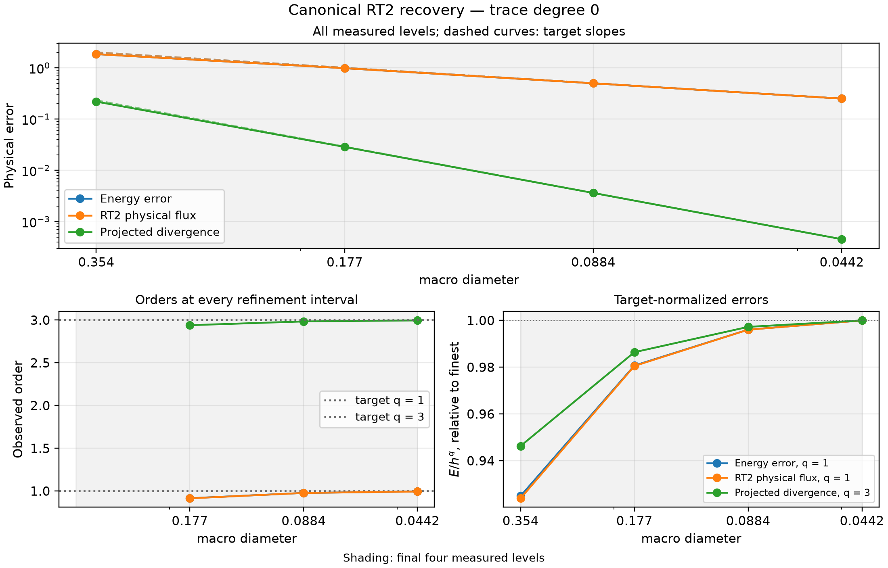
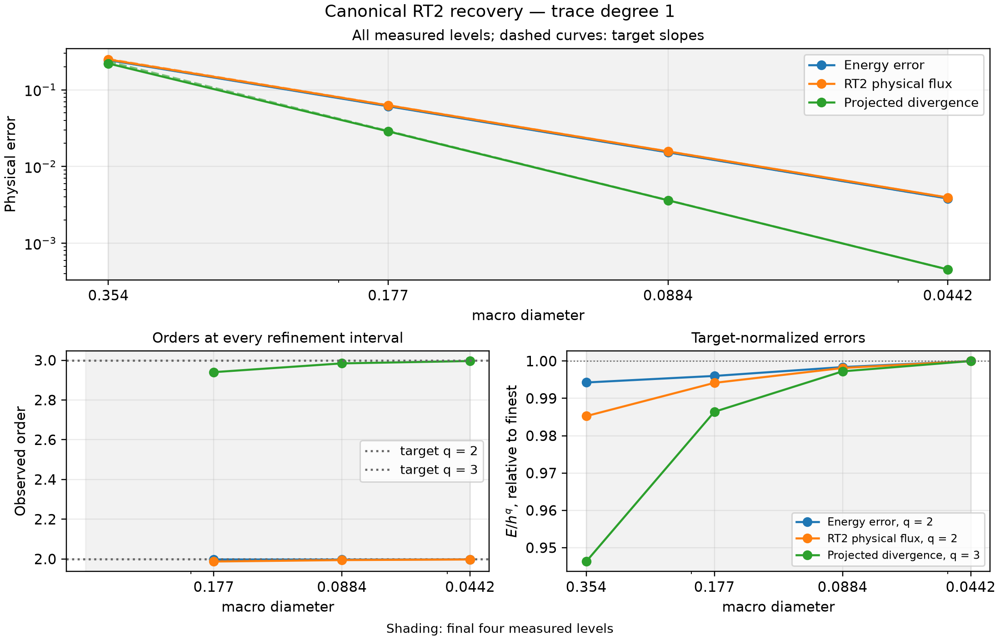
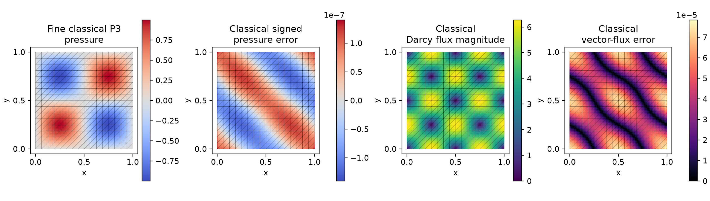
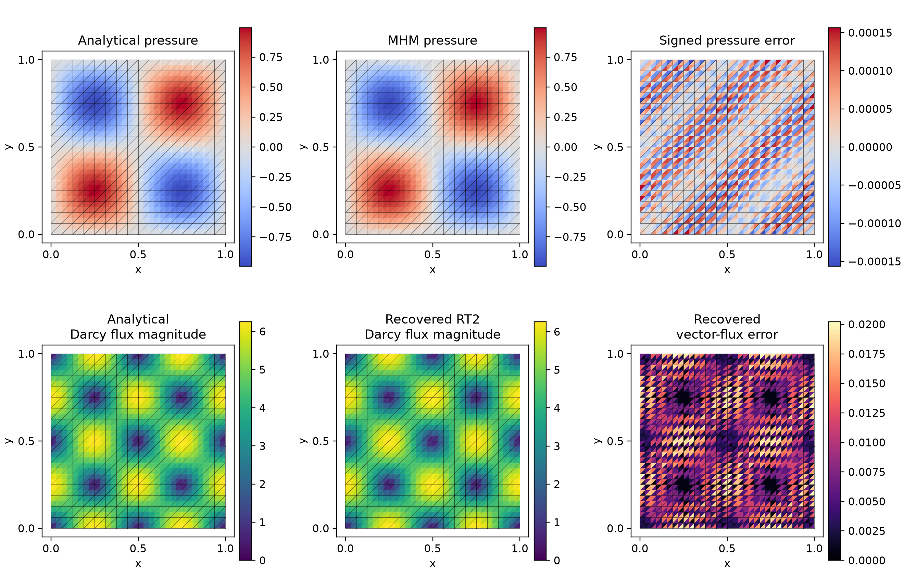
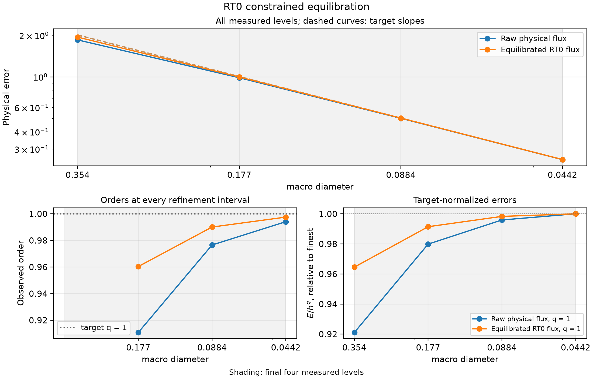
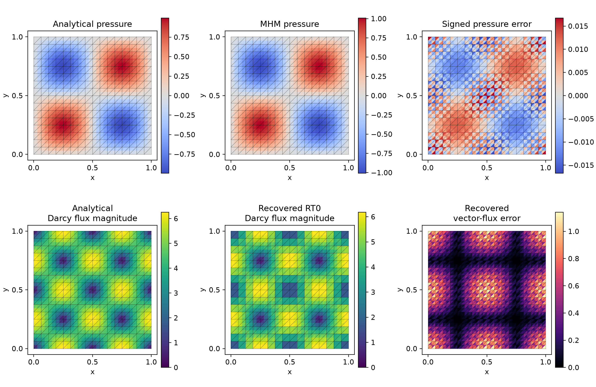

# Flux and conforming potential recovery

[Executable notebook](https://github.com/ipes-lncc/pymhm/blob/main/notebooks/darcy/reconstruction_and_indicators.ipynb) · [Download notebook](https://raw.githubusercontent.com/ipes-lncc/pymhm/main/notebooks/darcy/reconstruction_and_indicators.ipynb)

This tutorial first declares the local and global equations, then reconstructs
physical fields from their solution. The refined analytical study uses the data
of [Barrenechea et al. (2026), §6.1](https://doi.org/10.1137/24M1673073):
$p=\sin(2\pi x)\sin(2\pi y)$, $K=I$, $f=8\pi^2p$, and homogeneous Dirichlet
pressure on the unit square. The approximation spaces and mesh ratios are
stated explicitly; the numerical observations are PyMHM computations with these
data, rather than an assertion of identical published table ordinates.

The workflow is **meshes → local equations → global balance → assemble → solve
→ recovered fields → independently integrated errors**. Install the native
UFL backend following the [installation guide](../../installation.md).

## 1. Declare analytical fields and the source

The NumPy gradient and source are differentiated independently from the UFL
volume form. The exact physical Darcy flux is $q=-\nabla p$.

```python
import numpy as np
import matplotlib.pyplot as plt
import ufl
from pymhm import (
    Equation, FaceSpace, LocalContext, MeshHierarchy, SkeletonSpace, TriangleMesh,
    assemble, bind_interface, bind_problem, columns, solve,
)
from pymhm.postprocessing.solutions import DarcySolution
from pymhm.recovery.moments import reconstruct_darcy_moments
from pymhm.estimators.darcy import estimate_darcy_error
from pymhm.adaptivity.darcy import mark_dorfler
from threadpoolctl import threadpool_limits


def exact_pressure(points: np.ndarray) -> np.ndarray:
    """Analytical pressure; it vanishes on every exterior edge."""
    return np.sin(2 * np.pi * points[:, 0]) * np.sin(2 * np.pi * points[:, 1])


def exact_gradient(points: np.ndarray) -> np.ndarray:
    """Independently differentiated physical pressure gradient."""
    x, y = 2 * np.pi * points.T
    return 2 * np.pi * np.column_stack((np.cos(x) * np.sin(y), np.sin(x) * np.cos(y)))


def source(points: np.ndarray) -> np.ndarray:
    """Negative Laplacian computed independently of the discrete operator."""
    return 8 * np.pi**2 * exact_pressure(points)
```


## 2. Choose compatible spaces and bind their interface

The field illustration uses 512 macrotriangles, each containing four fine
triangles. The convergence study uses $n=4,8,16,32$ subdivisions per coordinate,
$H=\sqrt{2}/n$, and $h=H/2$. Trace degree $\ell=0$ uses P2 local pressure;
$\ell=1$ uses P3. RT reconstruction degree $m=2$ satisfies
$k\ge\ell+2$ and $\ell\le m\le k$ in both branches. Convex macrocells and a
conforming fine triangulation satisfy the estimator's geometric hypotheses.

```python
macro = TriangleMesh.unit_square(16)
local_meshes = tuple(macro.submesh(cell, 2) for cell in range(len(macro.cells)))
hierarchy = MeshHierarchy(macro, local_meshes)
skeleton = SkeletonSpace(macro, tuple(FaceSpace.uniform(1) for _ in macro.faces))
interface = bind_interface(skeleton, convention="normal")
```

## 3. Write the variational formulation as UFL

$$
\begin{aligned}
(\nabla p_T,\nabla v)_T+\langle\lambda_T,v\rangle_{\partial T}&=(f,v)_T,\\
-\sum_T\langle p_T,\mu_T\rangle_{\partial T}&=0.
\end{aligned}
$$

The local physical volume moment fixes the constant complement and retains one
mean per macrocell. The minus sign in the global pairing is mathematical; the
interface binding supplies numbering and normal orientation.

```python
def local_equations(local: LocalContext, degree: int = 3, forcing=None):
    """Declare primal diffusion, independent trace tests and physical mean."""
    space = local.native_space(degree=degree)
    p, v = ufl.TrialFunction(space.space), ufl.TestFunction(space.space)
    x = ufl.SpatialCoordinate(space.mesh)
    dx = ufl.Measure("dx", domain=space.mesh, metadata={"quadrature_degree": 20})
    forcing = (8 * np.pi**2 * ufl.sin(2 * np.pi * x[0]) * ufl.sin(2 * np.pi * x[1])
               if forcing is None else forcing(space.mesh))
    local.field("pressure", space)
    return local.equations(
        a=ufl.inner(ufl.grad(p), ufl.grad(v)) * dx,
        L=forcing * v * dx,
        b=local.trace_pairings(lambda phi, ds: phi * v * ds),
        c=local.trace_pairings(lambda phi, ds: -phi * p * ds, axis="rows"),
        kernel=np.ones((space.size, 1)), moments=columns(v * dx),
    )
```


```python
def global_equation(global_context):
    """Supply the weak Dirichlet moments in the bound interface layout."""
    boundary, fixed = global_context.boundary_data(0.0, order=8)
    assert not fixed
    return Equation(0, global_context.trace_load(-boundary))


problem = bind_problem(hierarchy, interface, local_equations,
                       global_equation=global_equation, retained=1)
```


## 4. Assemble, solve and retain the executed field basis

```python
with threadpool_limits(1):
    system = assemble(problem)
    coefficients = solve(system)
pressure_fields = coefficients.field("pressure")
solution = DarcySolution(
    skeleton=skeleton, local_meshes=local_meshes,
    pressure=tuple(field.portable_coefficients for field in pressure_fields),
    flux=tuple(-field.gradient(mesh.points[mesh.cells].mean(axis=1),
                               cells=np.arange(len(mesh.cells)))
               for mesh, field in zip(local_meshes, pressure_fields, strict=True)),
    hybrid=coefficients, formulation="primal", permeability=1.0,
    source=source, degree=3, quadrature_order=16,
)
print({"global_original_compatibility": coefficients.raw_residual,
       "pressure_L2": solution.l2_error(exact_pressure, order=12)})
```


`DarcySolution` is a physical coefficient record; constructing it performs no
additional PDE solve. Native fields carry their executed basis and expose
`portable_coefficients` through that mapping.

`coefficients.raw_residual` measures the original global compatibility defect
of the assembled trace/retained system. It is not the norm of all local
volume equations, nor a physical field error. A separate native observer checks
every original local volume row and the original trace equations of the same
eight-subdivision solve, reusing the shared original-row diagnostic:

| Native eight-subdivision control | Maximum relative local volume rows | Full uncondensed rows / physical load |
| --- | --- | --- |
| Sinusoidal P2/P0 | 3.321e-15 | 5.667e-15 |
| Sinusoidal P3/P1 | 1.040e-14 | 1.762e-14 |
| Localized P3/P1 | 4.196e-15 | 6.124e-15 |
| RT0-compatible sinusoidal P3/P0 | 1.376e-14 | 1.918e-14 |

These are Euclidean coefficient-row diagnostics with stated action/physical-load
scales. They retain the unchanged $10^{-10}$ gate and are distinct from physical
volume norms and the reconstruction's normal/continuous-test invariants.


## 5. Recover the canonical H(div) flux

The canonical RT moments preserve the skeletal boundary normal moments,
average the interior normal moments, and retain interior vector moments of the
raw physical flux:

$$
\begin{aligned}
\langle q_h^R\cdot n,\phi\rangle_e&=\text{declared normal moment},\\
(q_h^R,\psi)_t&=(-\nabla p_h,\psi)_t.
\end{aligned}
$$

```python
recovered = reconstruct_darcy_moments(solution, degree=2, quadrature_order=16)
normal_defect = max(np.max(abs(row)) for row in recovered.normal_flux_residuals())
continuous_defect = max(np.max(abs(row)) for row in recovered.continuous_moment_residuals())
assert normal_defect < 1e-10
assert continuous_defect < 1e-10
flux_error = recovered.flux_l2_error(lambda x: -exact_gradient(x), order=16)
projection_error = recovered.projected_divergence_l2_error(source, order=16)
```

The conservation identity is tested against continuous macro-local P2 functions.
It does not impose every discontinuous fine-cell constant balance. The raw
broken gradient, canonical RT flux, and independently equilibrated RT0 flux are
three distinct fields.

## 6. Verify the asymptotic estimates on four refined levels

Theorem 4.7 and Remark 5.1 of the accepted author manuscript give, for the
stated regularity and degree assumptions,

$$
\begin{aligned}
\lVert q-q_h^R\rVert_{0,\Omega}&\le C(h^k+H^{\ell+1}+h^{\ell+1}),\\
\lVert f-\Pi_{\Omega,2}\operatorname{div}q_h^R\rVert_{0,\Omega}&\le Ch^3.
\end{aligned}
$$

Thus the physical flux has order one or two as $\ell=0$ or $1$, and the
**projected** divergence has order three. Here $\Pi_{\Omega,2}$ acts separately
on each macrotriangle: its range is continuous P2 on that macrotriangle's
fine mesh, without continuity across macrofaces. The raw divergence is recorded
separately and is not assigned the projected-divergence estimate. Both norms
are integrated with 12 and 16 Gauss points per Duffy coordinate; their difference
is checked before accepting each level. The figures display every measured
level, every successive order, and the normalized $E/H^q$ plateau.



[PDF](../../assets/tutorials/methods/recovery-convergence-l0.pdf) · [SVG](../../assets/tutorials/methods/recovery-convergence-l0.svg)



[PDF](../../assets/tutorials/methods/recovery-convergence-l1.pdf) · [SVG](../../assets/tutorials/methods/recovery-convergence-l1.svg)

| Trace degree | Quantity | Three consecutive orders | Expected order | Max/min normalized amplitude |
| --- | --- | --- | --- | --- |
| 0 | Energy error | 0.916, 0.978, 0.994 | 1 | 1.081 |
| 0 | RT2 physical flux | 0.914, 0.977, 0.994 | 1 | 1.082 |
| 0 | Projected divergence | 2.940, 2.984, 2.996 | 3 | 1.057 |
| 1 | Energy error | 1.997, 1.997, 1.998 | 2 | 1.006 |
| 1 | RT2 physical flux | 1.987, 1.994, 1.997 | 2 | 1.015 |
| 1 | Projected divergence | 2.940, 2.984, 2.996 | 3 | 1.057 |

The baseline is independently assembled classical conforming P3 Galerkin on
$16\times16$, $32\times32$, and $64\times64$ global square subdivisions.
Its pressure and physical-flux errors against the analytical fields verify its
own refinement. The analytical solution supplies the exact comparator.

| Global square subdivisions | P3 nodal unknowns | Pressure error | Physical vector-flux error |
| --- | --- | --- | --- |
| 16 × 16 | 2401 | 1.967367e-05 | 3.291818e-03 |
| 32 × 32 | 9409 | 1.204168e-06 | 4.107999e-04 |
| 64 × 64 | 37249 | 7.463012e-08 | 5.128221e-05 |



[PDF](../../assets/tutorials/methods/recovery-classical-fields.pdf) · [SVG](../../assets/tutorials/methods/recovery-classical-fields.svg)

The global reference panels show the actual 64-subdivision solution with the
16-subdivision comparison macro mesh overlaid. These are distinct meshes.
Pressure orders are 4.030 and 4.012; flux orders are 3.002 and 3.002.

## 7. Inspect fields on a resolved mesh



[PDF](../../assets/tutorials/methods/recovery-refined-fields.pdf) · [SVG](../../assets/tutorials/methods/recovery-refined-fields.svg)

Every panel overlays the actual macro mesh and owns its color scale. Display
samples are taken independently at each fine-triangle centroid; no averaging
across an interface is used. Pressure error is signed; flux error is the
magnitude of the vector difference. Error norms use volume quadrature.

## 8. Recover a conforming potential or impose strict fine-cell balance

```python
from pymhm.estimators.darcy import recover_potential
potential = recover_potential(solution, homogeneous_dirichlet=True)
```

The Oswald potential averages incident finite-element nodal traces and imposes
the declared homogeneous boundary values. It is a separate continuous Pk field.
Its approximation error and boundary defect are reported in the notebook. The
following integrated errors use the same independently checked rules and all
four macro meshes; these potential orders are observations, rather than a
new universal reconstruction estimate.

| Trace degree | Macro subdivisions | Conforming potential error | Consecutive observed order |
| --- | --- | --- | --- |
| 0 | 4 | 9.535888e-02 | — |
| 0 | 8 | 2.630156e-02 | 1.858 |
| 0 | 16 | 6.759941e-03 | 1.960 |
| 0 | 32 | 1.703478e-03 | 1.989 |
| 1 | 4 | 4.687328e-03 | — |
| 1 | 8 | 5.518882e-04 | 3.086 |
| 1 | 16 | 6.893670e-05 | 3.001 |
| 1 | 32 | 8.671578e-06 | 2.991 |

`equilibrate_flux` instead solves a weighted RT0 minimization with strict
fine-cell source-average balance. Its P0 skeletal trace must align with fine
boundary edges. The notebook explicitly rebuilds those compatible spaces
before calling it. A dedicated [RT0 step-by-step notebook](https://github.com/ipes-lncc/pymhm/blob/main/notebooks/darcy/equilibrated_flux_workflow.ipynb)
measures both raw and equilibrated physical flux errors on four native refined
levels and checks every fine-cell balance. This available reconstruction is
not identified with the published RT2 moment operator.

| Macro subdivisions | Raw physical-flux error | Equilibrated RT0 error | Maximum fine-cell integrated defect |
| --- | --- | --- | --- |
| 4 | 1.853046e+00 | 1.942049e+00 | 1.005e-14 |
| 8 | 9.856433e-01 | 9.980867e-01 | 1.274e-14 |
| 16 | 5.008984e-01 | 5.024981e-01 | 1.337e-14 |
| 32 | 2.514818e-01 | 2.516832e-01 | 1.353e-14 |

The constrained RT0 flux has consecutive observed orders 0.96034, 0.99005
and 0.99751. The normalized first-order amplitude has max/min ratio 1.03677.
These order-one approximation controls concern the distinct P3/P0/RT0 workflow
and are not assigned the published RT2 reconstruction theorem.



[PDF](../../assets/tutorials/methods/recovery-rt0-convergence.pdf) · [SVG](../../assets/tutorials/methods/recovery-rt0-convergence.svg)



[PDF](../../assets/tutorials/methods/recovery-rt0-fields.pdf) · [SVG](../../assets/tutorials/methods/recovery-rt0-fields.svg)

The RT0 panels use 512 actual macrotriangles and independent one-sided
fine-cell centroid samples. Strict integrated fine-cell balance, H(div)
conformity and physical approximation error are separate properties.


The [indicator lesson](error-indicators.md) evaluates reliability and
convergence of the estimator; the [adaptive lesson](adaptivity.md) uses it on a
localized smooth solution.

## References

- Gabriel R. Barrenechea, Larissa Martins, Weslley Pereira and Frédéric Valentin (2026). *An H(div; Ω)-Conforming Flux Reconstruction for the Multiscale Hybrid-Mixed Method*, Multiscale Modeling & Simulation 24(2), 399–428. [DOI: 10.1137/24M1673073](https://doi.org/10.1137/24M1673073); [accepted author manuscript](https://strathprints.strath.ac.uk/94435/).
- Christopher Harder, Diego Paredes and Frédéric Valentin (2013). *A family of Multiscale Hybrid-Mixed finite element methods for the Darcy equation with rough coefficients*, Journal of Computational Physics 245, 107–130. [DOI: 10.1016/j.jcp.2013.03.019](https://doi.org/10.1016/j.jcp.2013.03.019).
