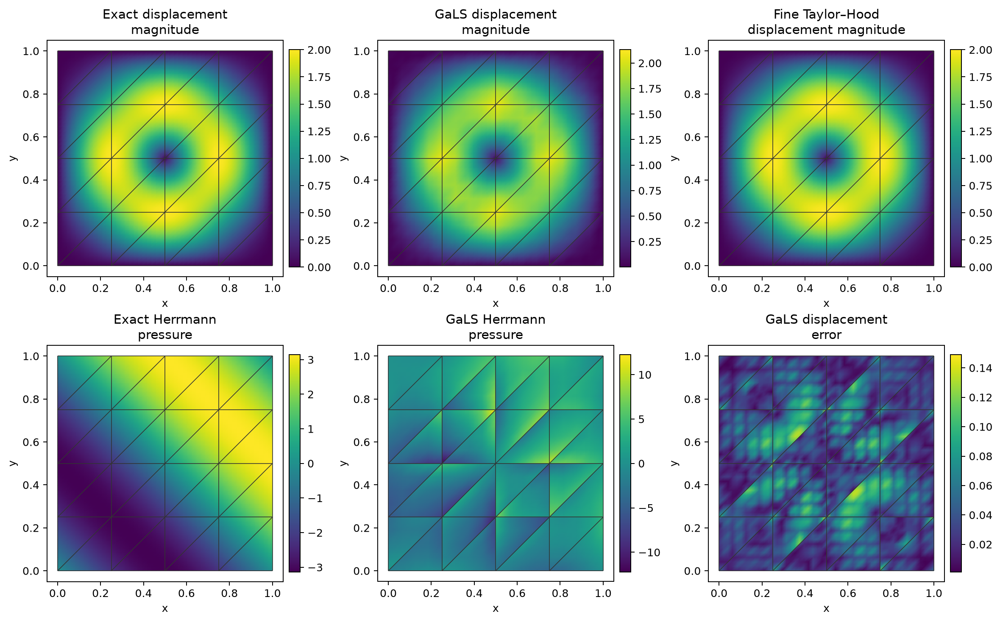
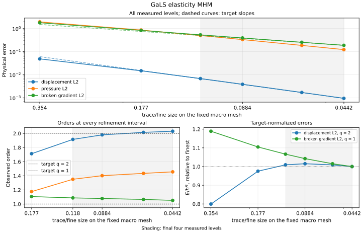

# Displacement–pressure GaLS MHM

**Follow the complete workflow: meshes → local equations → global equations → assemble → solve → physical fields and errors.**

[Executable notebook](https://github.com/ipes-lncc/pymhm/blob/main/notebooks/elasticity/gals_mhm_workflow.ipynb) · [Download notebook](https://raw.githubusercontent.com/ipes-lncc/pymhm/main/notebooks/elasticity/gals_mhm_workflow.ipynb) · [Theory and degree conditions](../../theory/elasticity.md)

The notebook prepares its verified companion workspace before these cells. `ROOT` denotes that writable workspace. Use the `introduction` environment with DOLFINx, UFL and Basix; see the [installation guide](../../installation.md). The local numerical algorithm remains in the package; this lesson defines the actual variational equations and physical data.

This tutorial builds the complete method from local and global equations. It uses the unit square, a smooth displacement, shear modulus $\mu=1$ and Lamé modulus $\lambda=4999$. The classical control is conforming Taylor–Hood on independent global meshes. See [Gomes, Pereira and Valentin (2024)](https://arxiv.org/abs/2403.16890v1) for the stabilized formulation and its hypotheses.

Run in the locked `introduction` Pixi environment with DOLFINx, UFL and Basix. The source notebook and its companion examples are separate from the installed PyMHM package.

```python
from types import SimpleNamespace

import basix.ufl
import matplotlib.pyplot as plt
import numpy as np
import ufl
from threadpoolctl import threadpool_limits

from pymhm import (
    Equation,
    FaceSpace,
    MeshHierarchy,
    MultiscaleProblem,
    SkeletonSpace,
    TriangleMesh,
    assemble,
    bind_interface,
    bind_problem,
    columns,
    solve,
)
from pymhm.core.equations import compile_form
from pymhm.fem.scalar.triangle import nodal_space
from pymhm.fem.vector.elasticity import rigid_modes
from pymhm.postprocessing.solutions import ElasticitySolution
```

## 1. Define physical data before choosing the method

The sign convention is

$$
p=-\lambda\nabla\cdot u,\qquad
\sigma=2\mu\varepsilon(u)-pI,\qquad -\nabla\cdot\sigma=f.
$$

The solenoidal trigonometric displacement has a small compressible correction proportional to $\beta=\mu/(\lambda+\mu)$. UFL differentiates the exact stress to derive the source. Independent NumPy expressions evaluate the exact fields for errors and figures.

```python
mu, lam, alpha = 1.0, 4999.0, 0.25


def exact_ufl(domain):
    """Differentiate the exact Cauchy stress symbolically, independently of assembly."""
    x = ufl.SpatialCoordinate(domain)
    beta = mu / (lam + mu)
    ue = ufl.as_vector(
        (
            (ufl.cos(2 * np.pi * x[0]) - 1) * ufl.sin(2 * np.pi * x[1]),
            (1 - ufl.cos(2 * np.pi * x[1])) * ufl.sin(2 * np.pi * x[0]),
        )
    )
    ue += beta * ufl.sin(np.pi * x[0]) * ufl.sin(np.pi * x[1]) * ufl.as_vector((1, 1))
    pe = -lam * beta * np.pi * ufl.sin(np.pi * (x[0] + x[1]))
    exact_sigma = 2 * mu * ufl.sym(ufl.grad(ue)) - pe * ufl.Identity(2)
    force = -ufl.div(exact_sigma)
    return ue, pe, force
```

```python
def exact_u(points):
    """Evaluate the boundary-vanishing displacement, including finite compressibility."""
    x, y = points.T
    beta = mu / (lam + mu)
    value = np.column_stack(
        (
            (np.cos(2 * np.pi * x) - 1) * np.sin(2 * np.pi * y),
            (1 - np.cos(2 * np.pi * y)) * np.sin(2 * np.pi * x),
        )
    )
    return value + beta * (np.sin(np.pi * x) * np.sin(np.pi * y))[:, None]


def exact_p(points):
    """Evaluate the zero-mean Herrmann pressure dictated by the displacement."""
    return -lam * mu / (lam + mu) * np.pi * np.sin(np.pi * points.sum(axis=1))


def exact_gradient(points):
    """Differentiate each displacement component in physical coordinates."""
    x, y = points.T
    sx, sy, cx, cy = (
        np.sin(2 * np.pi * x),
        np.sin(2 * np.pi * y),
        np.cos(2 * np.pi * x),
        np.cos(2 * np.pi * y),
    )
    gradient = (
        2
        * np.pi
        * np.stack(
            (np.column_stack((-sx * sy, (cx - 1) * cy)), np.column_stack(((1 - cy) * cx, sx * sy))),
            axis=1,
        )
    )
    correction = (
        mu
        / (lam + mu)
        * np.pi
        * np.column_stack(
            (np.cos(np.pi * x) * np.sin(np.pi * y), np.sin(np.pi * x) * np.cos(np.pi * y))
        )
    )
    return gradient + correction[:, None, :]


def exact_stress(points):
    """Evaluate the physical symmetric Cauchy stress."""
    gradient = exact_gradient(points)
    return mu * (gradient + gradient.swapaxes(1, 2)) - exact_p(points)[:, None, None] * np.eye(2)


exact = SimpleNamespace(
    displacement=exact_u, pressure=exact_p, gradient=exact_gradient, stress=exact_stress
)
```

## 2. Choose macro, local and interface spaces

There are $32$ macrotriangles. Each has its own refinement $r=4$, continuous vector $P_1$ displacement and continuous $P_1$ pressure. Each macroface carries two components of discontinuous $P_1$ negative traction. This $(k,r)=(1,4)$ choice resolves the linear trace; equal-order spaces require GaLS.

`MeshHierarchy` associates the independent local meshes. `bind_interface` handles geometric incidence signs; the physical signs remain in the equations.

```python
mu, lam, alpha = 1.0, 4999.0, 0.25
degree, refinement, n = 1, 4, 4
macro = TriangleMesh.unit_square(n)
skeleton = SkeletonSpace(macro, tuple(FaceSpace.uniform(1) for _ in macro.faces), 2)
hierarchy = MeshHierarchy(
    macro, tuple(macro.submesh(i, refinement) for i in range(len(macro.cells)))
)
interface = bind_interface(skeleton, convention="normal")
```

## 3. Translate every term of the local variational problem

Let $R(u,p)=\nabla\cdot(2\mu\varepsilon(u))-\nabla p$ and $\tau_h=\alpha h^2$. The local volume forms are

$$
\begin{aligned}
a_T((u,p),(v,q))
&=(2\mu\varepsilon(u),\varepsilon(v))_T
 -(p,\nabla\cdot v)_T-(q,\nabla\cdot u)_T\\
&\quad-\lambda^{-1}(p,q)_T
 -\sum_{t\subset T}(\tau_hR(u,p),R(v,q))_t,\\
L_T(v,q)&=(f,v)_T+\sum_{t\subset T}(\tau_h f,R(v,q))_t.
\end{aligned}
$$

Both the negative residual product and the positive source pairing are needed. For constant shear and affine displacement elements, the strong displacement residual vanishes inside each fine triangle. The inverse bound gives $0<\alpha<1/(2\mu)$; $\alpha=1/4$ satisfies it here. It must be recomputed for higher degree or variable shear.

The local kernel consists of the two translations and one rigid rotation, with pressure zero. Their physical displacement integrals fix the local lifting. `columns` records these moment forms, while `native.to_native` delegates coefficient ordering to the space adapter. `b` pairs negative traction with displacement; `c` independently records the negative transpose balance.

```python
def local_equations(local):
    """Declare native P1/P1 GaLS forms, rigid moments and negative physical traction."""
    element = basix.ufl.mixed_element(
        [
            basix.ufl.element(
                "Lagrange",
                "triangle",
                1,
                shape=(2,),
                lagrange_variant=basix.LagrangeVariant.equispaced,
            ),
            basix.ufl.element(
                "Lagrange", "triangle", 1, lagrange_variant=basix.LagrangeVariant.equispaced
            ),
        ]
    )
    native = local.native_space(element)
    domain = native.space.mesh
    x = ufl.SpatialCoordinate(domain)
    u, p = ufl.TrialFunctions(native.space)
    v, q = ufl.TestFunctions(native.space)
    ue, pe, force = exact_ufl(domain)
    dx = ufl.Measure("dx", domain=domain, metadata={"quadrature_degree": 8})

    def eps(w):
        """Return the symmetric physical displacement gradient."""
        return ufl.sym(ufl.grad(w))

    def residual(w, r):
        """Return the signed strong divergence of physical Cauchy stress."""
        return ufl.div(2 * mu * eps(w)) - ufl.grad(r)

    tau = alpha * ufl.CellDiameter(domain) ** 2
    a = (
        2 * mu * ufl.inner(eps(u), eps(v))
        - p * ufl.div(v)
        - q * ufl.div(u)
        - p * q / lam
        - tau * ufl.inner(residual(u, p), residual(v, q))
    ) * dx
    L = (ufl.inner(force, v) + tau * ufl.inner(force, residual(v, q))) * dx
    center = macro.points.mean(axis=0)
    rigid = [
        ufl.as_vector((1, 0)),
        ufl.as_vector((0, 1)),
        ufl.as_vector((-(x[1] - center[1]), x[0] - center[0])),
    ]
    nodes = nodal_space(local.mesh, 1)[1]
    kernel = native.to_native(rigid_modes(nodes, center).reshape(2 * len(nodes), 3), component=0)
    moments = columns(*(ufl.inner(v, z) * dx for z in rigid))
    b = local.trace_pairings(lambda multiplier, ds: ufl.inner(multiplier, v) * ds)
    c = local.trace_pairings(lambda test_trace, ds: -ufl.inner(test_trace, v) * ds, axis="rows")
    pressure_moment = compile_form(q * dx)
    local.field("displacement", native, component=0)
    local.field("pressure", native, component=1)
    return local.equations(
        a=a, L=L, b=b, c=c, kernel=kernel, moments=moments, metadata=(pressure_moment,)
    )
```

## 4. State the global equation and the physical pressure identity

The complete displacement is prescribed weakly at the outer boundary:

$$
\sum_T\langle u_T,\mu\rangle_{\partial T}
=\langle g,\mu\rangle_{\partial\Omega},\qquad g=0.
$$

Three rigid coordinates per macrocell remain in the global problem. With finite $\lambda$, pressure is determined by compressibility:

$$
\int_\Omega p/\lambda=-\int_{\partial\Omega}g\cdot n=0.
$$

For this constant material, the equivalent normalized row is $\int_\Omega p=0$. It is a physical identity, not a freely selected pressure gauge. At $\lambda=\infty$, zero net boundary displacement is necessary and the pressure mean becomes a gauge.

```python
def global_equation(global_context):
    """Impose homogeneous weak displacement through the global trace functional."""
    boundary, _ = global_context.boundary_data((0, 0), order=8)
    return Equation(0, global_context.trace_load(-boundary))


with threadpool_limits(1):
    problem = bind_problem(
        hierarchy, interface, local_equations, global_equation=global_equation, retained=3
    )
    system = assemble(problem)
    pressure_identity = system.mean_constraint([entry[0] for entry in system.local_metadata], 0.0)
    coefficients = solve(system, constraints=[pressure_identity])
    ufields = coefficients.field("displacement")
    pfields = coefficients.field("pressure")
    view = ElasticitySolution(
        skeleton,
        tuple(f.mesh for f in ufields),
        tuple(f.portable_coefficients.reshape(-1, 2) for f in ufields),
        tuple(f.portable_coefficients for f in pfields),
        coefficients,
        1,
        1,
        lam,
        mu,
        "gals",
        (alpha,) * len(ufields),
    )
```

## 5. Recover physical fields and test the original equations

The field declarations carry their executed native maps into the recovered solution. The `ElasticitySolution` view applies the physical constitutive law to those fields; it does not choose or solve a method. We check displacement and pressure equations separately before combining their original row residuals.

```python
from examples.core_elasticity_field_archive import ProductionObservation
from examples.minimal_flow_originals import original_diagnostics

errors = {
    "displacement_l2": view.l2_error(exact_u, 12),
    "pressure_l2": view.pressure_l2_error(exact_p, 12),
    "stress_l2": view.stress_l2_error(exact_stress, 12),
    "gradient_l2": view.h1_seminorm_error(exact_gradient, 12),
}
print(errors)
print("Reduced residual:", coefficients.residual)

observation = ProductionObservation(
    system=system,
    applied_boundary=-system.global_load[: system.trace_size],
    constraints=[pressure_identity],
)
blocks = [
    {
        "displacement_equilibrium": len(field.portable_coefficients),
        "pressure_compressibility": len(pfield.portable_coefficients),
    }
    for field, pfield in zip(ufields, pfields, strict=True)
]
physical = original_diagnostics(view, observation, blocks)
print(
    "Original uncondensed physical residual:", physical["full_uncondensed_relative_to_physical_rhs"]
)
assert physical["accepted"]
```

## 6. Assemble an independent fine classical reference

The following function writes the unstabilized conforming Taylor–Hood $P_2/P_1$ formulation. Its displacement boundary values are imposed strongly on global meshes with $32$ and $64$ squares per axis. The same material, source and pressure identity are used. Its own analytical errors must decrease before the fine field is used as a baseline. These global meshes are not passed to MHM.

```python
from dolfinx import fem

from pymhm.backends.spaces import bind_space, coefficient_map
from pymhm.postprocessing.fields import DiscreteField, FieldDefinition


def conforming_reference(resolution):
    """Solve the notebook's unstabilized Taylor–Hood form on a fine global mesh."""
    mesh = TriangleMesh.unit_square(resolution)
    element = basix.ufl.mixed_element(
        [
            basix.ufl.element(
                "Lagrange",
                "triangle",
                2,
                shape=(2,),
                lagrange_variant=basix.LagrangeVariant.equispaced,
            ),
            basix.ufl.element(
                "Lagrange", "triangle", 1, lagrange_variant=basix.LagrangeVariant.equispaced
            ),
        ]
    )
    native = bind_space(mesh, element)
    try:
        u, p = ufl.TrialFunctions(native.space)
        v, q = ufl.TestFunctions(native.space)
        domain = native.space.mesh
        ue, pe, force = exact_ufl(domain)
        dx = ufl.Measure("dx", domain=domain, metadata={"quadrature_degree": 12})
        a = (
            2 * mu * ufl.inner(ufl.sym(ufl.grad(u)), ufl.sym(ufl.grad(v)))
            - p * ufl.div(v)
            - q * ufl.div(u)
            - p * q / lam
        ) * dx
        L = ufl.inner(force, v) * dx
        _, nodes = nodal_space(mesh, 2)
        boundary_nodes = np.flatnonzero(np.any(np.isclose(nodes, 0) | np.isclose(nodes, 1), axis=1))
        portable = (2 * boundary_nodes[:, None] + np.arange(2)).ravel()
        native_ids = coefficient_map(native, component=0)[portable]
        fixed = dict(zip(native_ids, exact_u(nodes[boundary_nodes]).ravel(), strict=True))
        reference_problem = MultiscaleProblem.from_global(
            Equation(a, L),
            native.size,
            fixed=fixed,
        )
        # Finite lambda determines this zero integral by the displacement data.
        pressure_integral = compile_form(q * dx)
        result = solve(assemble(reference_problem), constraints=[(pressure_integral, 0.0)])
        numerical = fem.Function(native.space)
        numerical.x.array[:] = result.trace
        uh, ph = ufl.split(numerical)
        sigma_h = 2 * mu * ufl.sym(ufl.grad(uh)) - ph * ufl.Identity(2)
        sigma_e = 2 * mu * ufl.sym(ufl.grad(ue)) - pe * ufl.Identity(2)
        differences = {
            "displacement_l2": uh - ue,
            "pressure_l2": ph - pe,
            "stress_l2": sigma_h - sigma_e,
        }
        errors = {
            name: float(np.sqrt(fem.assemble_scalar(fem.form(ufl.inner(delta, delta) * dx))))
            for name, delta in differences.items()
        }
        fields = {
            name: DiscreteField(
                FieldDefinition(name, descriptor=native.descriptor(component=i)), result.trace
            )
            for i, name in enumerate(("displacement", "pressure"))
        }
        return fields, {
            "resolution": resolution,
            "triangles": len(mesh.cells),
            "unknowns": native.size,
            "errors": errors,
            "residual": result.residual,
        }
    finally:
        native.close()


with threadpool_limits(1):
    reference32, control32 = conforming_reference(32)
    reference64, control64 = conforming_reference(64)
print(control32)
print(control64)
assert all(
    control64["errors"][name] < control32["errors"][name]
    for name in ("displacement_l2", "stress_l2")
)
```

The independently refined classical control gives the following analytical errors:

| Global squares per axis | Displacement L2 | Physical stress L2 |
| --- | ---: | ---: |
| 32 | $1.0731\times10^{-4}$ | $4.3720\times10^{-2}$ |
| 64 | $1.3350\times10^{-5}$ | $1.0962\times10^{-2}$ |

## 7. Plot the physical fields on their actual meshes

The display helper preserves independent one-sided MHM samples and draws the macro mesh on every panel. Each panel has an independent color scale. The coarse MHM field and fine conforming field solve the same operator in different spaces.

```python
from examples.introduction.vector import plot_field_panels
from examples.plot_elasticity import field_arrays

samples = field_arrays(view, exact)
x, triangles = samples["points"], samples["cells"]
baseline_u = reference64["displacement"].evaluate(x)
panels = {
    "Exact displacement\nmagnitude": (
        x,
        triangles,
        np.linalg.norm(samples["exact_displacement"], axis=1),
    ),
    "GaLS displacement\nmagnitude": (x, triangles, np.linalg.norm(samples["displacement"], axis=1)),
    "Fine Taylor–Hood\ndisplacement magnitude": (x, triangles, np.linalg.norm(baseline_u, axis=1)),
    "Exact Herrmann\npressure": (x, triangles, samples["exact_pressure"]),
    "GaLS Herrmann\npressure": (x, triangles, samples["pressure"]),
    "GaLS displacement\nerror": (
        x,
        triangles,
        np.linalg.norm(samples["displacement"] - samples["exact_displacement"], axis=1),
    ),
}
figure = plot_field_panels(macro, panels, figsize=(13, 8))
plt.show()
```

[](../../assets/tutorials/methods/gals-elasticity-fields.svg)

The first coarse P1/P1 case has displacement error $4.8487\times10^{-2}$ and pressure error $1.9442$. The pressure panel retains its independent local values, including interface oscillations. Pressure requires its own refinement and error assessment; a good displacement profile does not qualify the pressure field.

## 8. Refine both skeletal and local scales

The smooth convergence campaign uses this same trigonometric data and $\lambda/\mu=4999$. It holds the $4\times4$ macro grid fixed, subdivides every trace into $s=1,2,4,8$ segments and chooses local refinement $r=4s$. The first row is the native UFL case executed above. The remaining rows are attributed archived acquisitions, not recomputed by reading them.

For this smooth admissible $P_1/P_1$ family, the reference orders are one for the broken gradient and two for displacement. Pressure is plotted separately; its measured order is not silently identified with displacement. Changing only the macro grid or only the trace with a fixed local resolution is a different study.

```python
import json

from examples.introduction.vector import observed_rates
from examples.tutorial_convergence import plot_method_series

record = json.loads((ROOT / "examples/results/elasticity.json").read_text())
rows = [row for row in record["refinement"] if row["method"] == "gals-p1"]
sizes = np.asarray([row["skeleton_size"] for row in rows])
errors = {
    label: np.array([row[key] for row in rows])
    for label, key in {
        "displacement L2": "displacement_l2",
        "pressure L2": "pressure_l2",
        "broken gradient L2": "gradient_l2",
    }.items()
}
series = dict(
    method="gals-elasticity",
    sizes=sizes.tolist(),
    errors={k: v.tolist() for k, v in errors.items()},
    rates={k: observed_rates(sizes, v).tolist() for k, v in errors.items()},
    expected={"displacement L2": 2.0, "broken gradient L2": 1.0},
    spaces="P1/P1, segmented P1 traction, r=4*segments",
    refinement="trace/fine size on a fixed macro mesh",
)
print("Final measured orders:", {k: v[-1] for k, v in series["rates"].items()})
figure = plot_method_series(series)
plt.show()
```



The final consecutive intervals confirm the stated smooth regime. A measured order for an observable without a separate stated reference is reported as **observed**.

| Physical observable | Penultimate order | Final order | Reference order |
| --- | ---: | ---: | ---: |
| displacement L2 | 2.0150 | 2.0311 | 2.0 |
| pressure L2 | 1.4345 | 1.4562 | observed |
| broken gradient L2 | 1.0657 | 1.0520 | 1.0 |

The [common convergence notebook](https://github.com/ipes-lncc/pymhm/blob/main/notebooks/convergence/method_rates.ipynb) preserves each sequence’s spaces, independent refinement variable and attributed numerical record.

## References

- [Gomes, Pereira and Valentin (2024), *A low-order locking-free multiscale finite element method for isotropic elasticity*, preprint v1](https://arxiv.org/abs/2403.16890v1).
- [Harder, Madureira and Valentin (2016), *A hybrid-mixed method for elasticity*](https://doi.org/10.1051/m2an/2015046).

The trigonometric data here are an analytical verification with explicitly derived source; they are not a claim of matching every table or local solver in the paper.
