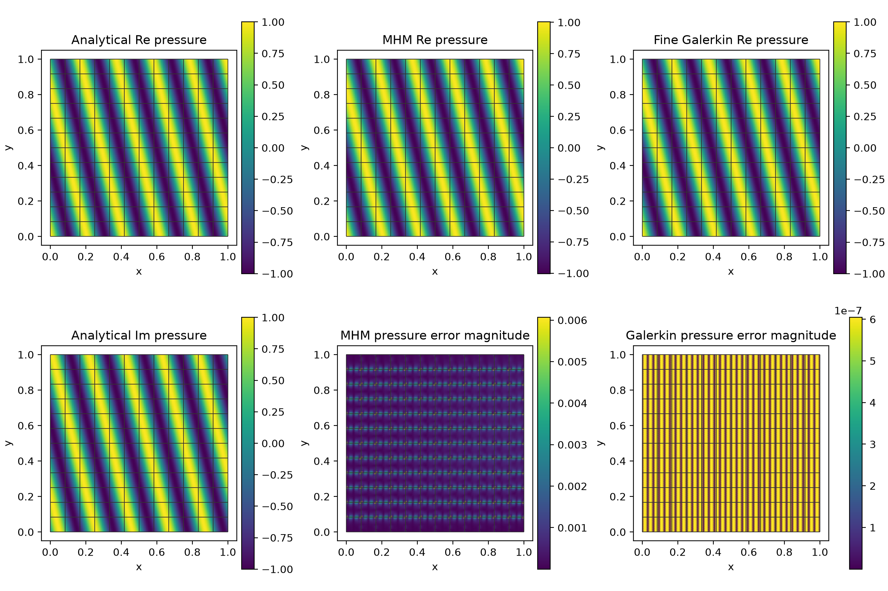
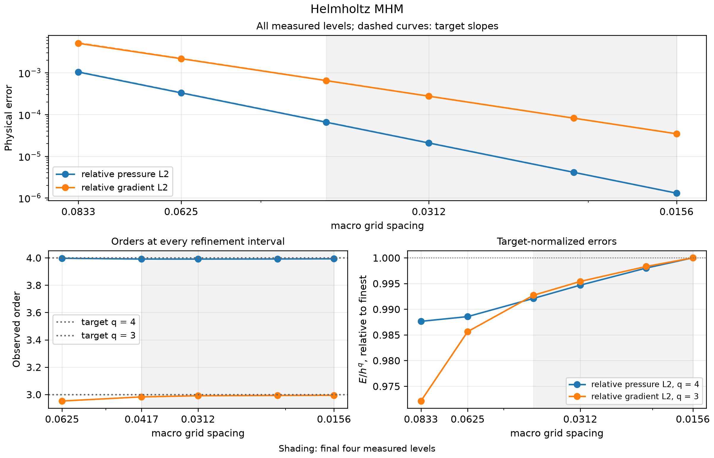

# Helmholtz MHM

Write a complex plane wave through real and imaginary components, define its
outgoing physical data and local/global weak forms, then assemble, solve and
postprocess. The refinement figure uses this same declared family.

[Complete executable notebook](https://github.com/ipes-lncc/pymhm/blob/main/notebooks/waves/helmholtz/introductory_methods.ipynb) · [Download notebook](https://raw.githubusercontent.com/ipes-lncc/pymhm/main/notebooks/waves/helmholtz/introductory_methods.ipynb) · [Theory and resolution conditions](../../theory/waves.md)

Run the locked `introduction` environment. The native UFL path executes;
complex coordinates are never discarded. The notebook also preserves a
low-frequency affine reproduction control after the plane-wave workflow.

## 1. Derive the physical operator and boundary data

On the unit square, choose unit density and modulus, $\omega=10\pi$,
$d=(\cos(\pi/13),\sin(\pi/13))$ and $p_*(x)=\exp(i\omega d\cdot x)$.
Since $\lVert d\rVert=1$, the independently manufactured volume source is zero:

$$
\begin{aligned}
-\Delta p-\omega^2p&=0,\\
\partial_np-i\omega p&=g,
&g&=i\omega(d\cdot n-1)p_* \quad\text{on }\partial\Omega.
\end{aligned}
$$

The unknown interior multiplier is $\lambda_K=-\partial_{n_K}p$. On the
physical exterior, the local impedance and prescribed $g$ already supply
the boundary condition. Exterior multiplier coordinates are fixed zero
placeholders; the actual physical exterior flux need not vanish.

Represent pressure by $z=(\Re p,\Im p)$ with interleaved real coordinates.
These are complex coordinates rather than a physical vector. The outgoing
term $-i\omega p$ becomes $\omega(z_1v_0-z_0v_1)$ in the real weak form.

## 2. Declare local and global variational equations

The local volume/Robin form and trial/test interface pairings are

$$
\begin{aligned}
a_K(p,v)&=(\nabla p,\nabla v)_K-\omega^2(p,v)_K
                   -\langle i\omega p,v\rangle_{\partial K\cap\partial\Omega},\\
b_K(\lambda,v)&=\langle\lambda,v\rangle_{\partial K\setminus\partial\Omega},\\
c_K(p,\mu)&=-\langle p,\mu\rangle_{\partial K\setminus\partial\Omega}.
\end{aligned}
$$

The notebook first writes `wave_forms` explicitly. Here `exterior` is its UFL
indicator of the physical boundary, $x=0,1$ or $y=0,1$:

```python
z, v = ufl.TrialFunction(V), ufl.TestFunction(V)
x = ufl.SpatialCoordinate(domain)
n = ufl.FacetNormal(domain)
phase = omega*(d[0]*x[0]+d[1]*x[1])
normal_factor = omega*(ufl.dot(ufl.as_vector(d),n)-1)
g = ufl.as_vector((-normal_factor*ufl.sin(phase),
                   normal_factor*ufl.cos(phase)))
a = (ufl.inner(ufl.grad(z),ufl.grad(v))-omega**2*ufl.inner(z,v))*dx
a += omega*(z[1]*v[0]-z[0]*v[1])*exterior*ds
L = ufl.inner(g,v)*exterior*ds
```

Choose a Basix Q4 element with two real coordinates, on a $2\times2$ fine
subdivision of each macro square. Declare the named field and pairings:

```python
def wave_local(local):
    native = local.native_space(wave_element)
    z,v = ufl.TrialFunction(native.space),ufl.TestFunction(native.space)
    a,L,exterior = wave_forms(native.space,native.mesh)
    b = local.trace_pairings(
        lambda phi,ds: ufl.inner(phi,v)*(1-exterior)*ds,
    )
    c = local.trace_pairings(
        lambda phi,ds: -ufl.inner(phi,z)*(1-exterior)*ds,axis="rows",
    )
    local.field("pressure",native)
    return local.equations(a=a,L=L,b=b,c=c)
```

The native binding owns coefficient ordering and the interface owns geometric
incidence signs. The mathematical signs stay visible in these expressions.
No retained static mode is inserted: the selected local wave operators are
invertible. Positive frequency alone does not exclude other local resonances.

## 3. Define meshes, assemble and solve

Use a $12\times12$ square macro grid with polynomial P2 complex normal traces:

```python
macro = CartesianMacroMesh(12)
skeleton = SkeletonSpace(
    macro,tuple(FaceSpace.uniform(2) for _ in macro.faces),components=2,
)
hierarchy = MeshHierarchy(
    macro,tuple(macro.submesh(i,2) for i in range(len(macro.cells))),
)
interface = bind_interface(skeleton,convention="normal")
problem = bind_problem(
    hierarchy,interface,wave_local,global_equation=Equation(0,0),
)
system = assemble(problem)
fixed = {int(dof):0.0 for face in macro.boundary_faces
                     for dof in skeleton.dofs(int(face))}
solution = solve(system,fixed=fixed)
pressure = solution.field("pressure")
```

The global equation imposes zero incident pressure jumps on interior faces,
with the sign of $c_K$. The Robin data are already part of each local load.
There is no exterior Dirichlet pressure condition or pressure gauge here.

Integrating the physical errors with independent product Gauss rules of orders
10 and 14 gives relative pressure error $1.03918\times10^{-3}$ and relative
broken gradient error $5.07579\times10^{-3}$. These native norms agree with
the attributed convergence record's n12 observations to about
$4.3\times10^{-11}$ relatively. A separate original uncondensed coefficient-row
check is accepted with relative residual $3.55\times10^{-14}$; it does not
replace the physical error integration.

## 4. Independently refine the classical reference

Assemble the same `wave_forms` on a single conforming global Q4 mesh, with the
same outgoing data, through `MultiscaleProblem.from_global`. This reference
uses no local response elimination or MHM multiplier. The native space is
closed explicitly; its portable coefficient map retains the declared nodal
basis for subsequent evaluation.

| Global subdivisions | Relative pressure $L^2$ | Relative broken gradient $L^2$ |
| --- | ---: | ---: |
| 16 | $3.9855\times10^{-4}$ | $2.4560\times10^{-3}$ |
| 32 | $1.2523\times10^{-5}$ | $1.5763\times10^{-4}$ |
| 64 | $3.9272\times10^{-7}$ | $9.9183\times10^{-6}$ |

Both analytical norms decrease on the refined global grids. The finest
reference is substantially more accurate than the coarse MHM illustration;
it remains a numerical approximation. Its global compatibility residual stays
below $2.2\times10^{-16}$.

## 5. Plot the wave, reference and physical errors



Every panel highlights the actual square macro mesh. Macrocells retain
independent one-sided pressure values. Independent colorbars expose the
reference's much smaller complex pressure error without merging scales.

## 6. Reach the fixed-frequency asymptotic regime

The smooth fixed-frequency study uses polynomial trace degree two and local Q4 pressure on refined Cartesian cells. It targets pressure order four and gradient order three after the frequency and local error are resolved. The recorded errors are PyMHM observations against the analytical field, not values digitized from a paper. This analytical variant is distinct from a matched reproduction of the published curves.



[Vector SVG](../../assets/tutorials/methods/helmholtz-convergence.svg) · [Publication PDF](../../assets/tutorials/methods/helmholtz-convergence.pdf)

| Observable | Expected order | Last three orders | Maximum/minimum of $E/H^q$ |
| --- | ---: | --- | ---: |
| relative pressure $L^2$ | 4 | 3.9910, 3.9918, 3.9930 | 1.0080 |
| relative gradient $L^2$ | 3 | 2.9906, 2.9928, 2.9941 | 1.0073 |

The plotted sequence retains all six measured levels. Its final four levels
are $n=24,32,48,64$, and non-dyadic consecutive rates use their actual grid-spacing
ratios. Normalized amplitudes vary by less than one percent across this window.
The comparison concerns fixed frequency, smooth analytical data and resolved
local polynomial approximation. It does not give a frequency-uniform pollution
bound or transfer these rates to resonant or unresolved heterogeneous data.

Spaces: Local Q4/r2; polynomial P2 face trace; fixed analytical plane wave and frequency. Refinement variable: macro grid spacing (square edge length).

[Numerical record](https://github.com/ipes-lncc/pymhm/blob/main/examples/results/helmholtz-article/published-convergence.json), SHA-256 `fcfae8fd22ded4b560dc6ad6fbfb7aecca7da8e2a5681cffaeff886ea6d12e9e`.


## References

- Théophile Chaumont-Frelet and Frédéric Valentin (2020). *A Multiscale Hybrid-Mixed Method for the Helmholtz Equation in Heterogeneous Domains*. SIAM Journal on Numerical Analysis 58(2), 1029–1067. [DOI: 10.1137/19M1255616](https://doi.org/10.1137/19M1255616).
