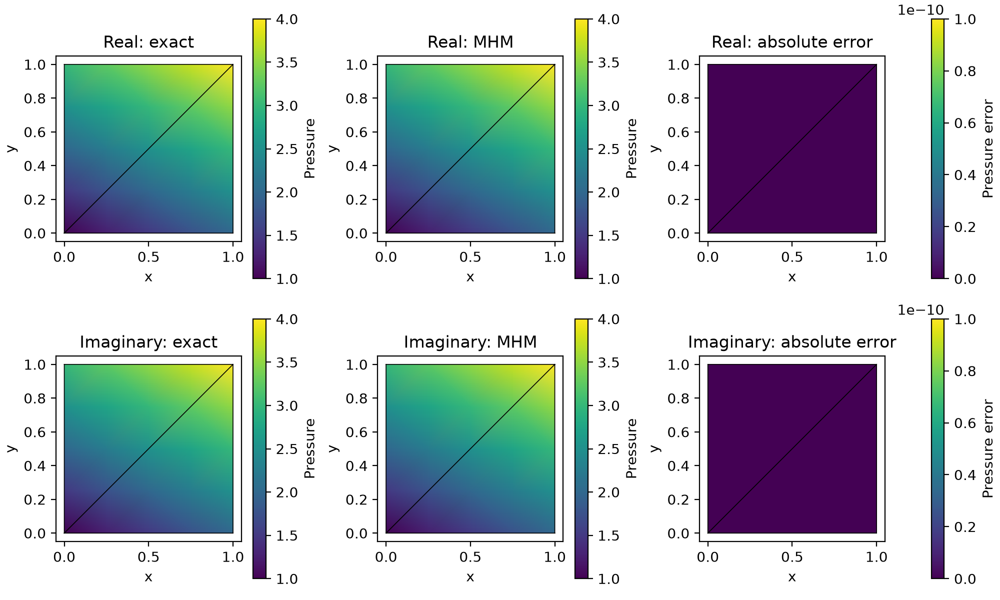

# Helmholtz MHM

Write a complex pressure problem through real and imaginary components, then assemble and solve the global continuity equations. This affine control teaches the workflow; a separate plane-wave sequence measures convergence.

[Executable notebook](https://github.com/ipes-lncc/pymhm/blob/main/notebooks/waves/helmholtz/introductory_methods.ipynb) · [Theory and resolution conditions](../../theory/waves.md)

## 1. Choose the operator and its physical trace


The primary native forms use the exact real/imaginary embedding of complex
pressure; no complex coefficient is discarded. Unit density/modulus give
$-\Delta p-\omega^2p=f$ with $\omega=1/2$ and the independent affine
source $f=-\omega^2p$. This chosen finite patch has invertible local operators;
positive frequency alone does not exclude local resonances in other inputs.

$$
\begin{aligned}
a_T(p,v)&=(\nabla p,\nabla v)_T-\omega^2(p,v)_T,\\
B_T\lambda&=\langle\lambda,v\rangle_{\partial T},\\
C_Tp&=-\langle p,\mu\rangle_{\partial T}.
\end{aligned}
$$

The signed trace is $-\nabla p\cdot n$ in two interleaved real components.
The global RHS explicitly prescribes negative complex Dirichlet moments.
The native example has no absorption, PML or resonance-avoidance claim.

The two Cartesian components below represent real and imaginary pressure, not a physical vector. The local operator has no static constant kernel because of its negative mass term. Invertibility must be checked against local resonances.

## 2. Declare meshes, UFL volume forms and signed pairings

Use the notebook companion for `NativeFormProvider`, a geometric assembly adapter. The callback defines the mathematical problem; the adapter creates the local mesh and oriented measures. In a locked FEM environment the following is the notebook's primary calculation.

```python
import numpy as np
import importlib.util
from pymhm import Equation, LocalEquations, MultiscaleProblem, assemble, columns, rows, compile_form
from pymhm.meshes.triangle import TriangleMesh
from pymhm.fem.traces.interval import FaceSpace, SkeletonSpace
from pymhm.fem.scalar.operators import boundary_data
from examples.variational_darcy import NativeFormProvider

import ufl
from dolfinx import fem

mesh = TriangleMesh.unit_square()
trace_space = SkeletonSpace(mesh, components=2)
omega = 0.5

def exact_components(points):
    """Return real/imaginary components of (1+i)(1+x+2y)."""
    scalar = 1 + points[:, 0] + 2 * points[:, 1]
    return np.column_stack((scalar, scalar))

def local_forms(context):
    """Write both real components of the complex Helmholtz equation."""
    space = fem.functionspace(context.space.mesh, ("Lagrange", 2, (2,)))
    u, v = ufl.TrialFunction(space), ufl.TestFunction(space)
    x = ufl.SpatialCoordinate(context.space.mesh)
    dx = ufl.dx(domain=context.space.mesh)
    exact = ufl.as_vector((1 + x[0] + 2 * x[1], 1 + x[0] + 2 * x[1]))
    return LocalEquations(
        (ufl.inner(ufl.grad(u), ufl.grad(v)) - omega**2 * ufl.inner(u, v)) * dx,
        ufl.inner(-(omega**2) * exact, v) * dx,
        columns(
            *(
                float(sign) * v[j] * context.ds(side + 1)
                for side, sign in enumerate(context.signs)
                for j in range(2)
            )
        ),
        rows(
            *(
                -float(sign) * u[j] * context.ds(side + 1)
                for side, sign in enumerate(context.signs)
                for j in range(2)
            )
        ),
        context.trace_dofs,
        metadata={"points": space.tabulate_dof_coordinates()[:, :2].copy()},
    )

boundary, _ = boundary_data(trace_space, exact_components)
problem = MultiscaleProblem(
    Equation(0, -boundary),
    NativeFormProvider(mesh, trace_space, local_forms, 2),
    range(len(mesh.cells)),
    trace_space.size,
    (0,) * len(mesh.cells),
)
system = assemble(problem)
solution = system.solve()
errors = [
    float(np.max(np.abs(field.reshape(-1, 2) - exact_components(record["points"]))))
    for field, record in zip(solution.fields, system.local_metadata, strict=True)
]
assert max(errors) < 1e-10
print(
    {
        "native_available": True,
        "spaces": "complex P2 pressure / P0 complex trace",
        "maximum_component_nodal_error_by_cell": errors,
        "global_original_relative_residual": solution.raw_residual,
    }
)
```

## 3. Read the global problem in the code

`Equation(0, -boundary)` imposes the pressure moments with the same sign as `C=-B.T`. `MultiscaleProblem` lists the actual macrocells and zero retained static modes. `assemble` eliminates local volume coefficients; `system.solve()` reconstructs the pressure in both components. The nodal affine check verifies exact reproduction and the original equations. It does not measure a convergence rate.

## 4. Evaluate complex fields

Recombine the returned components as `real + 1j * imaginary` in the executed basis. Compare real pressure, imaginary pressure and gradient separately. Use a common color scale for exact and numerical fields and a separate error color scale. The physical normal trace is the negative pressure gradient for the unit-density operator; absorbing boundaries and PML require their own complex terms.

The executable notebook includes this physical plot:

```python
assert native_available, "Select the locked introduction environment for this UFL demonstration."
import matplotlib.pyplot as plt
from matplotlib.tri import Triangulation

fig, axes = plt.subplots(2, 3, figsize=(10, 6), layout="constrained")
for component in range(2):
    for column in range(3):
        ax = axes[component, column]
        for values, record in zip(solution.fields, system.local_metadata, strict=True):
            points = record["points"]
            exact = exact_components(points)[:, component]
            numerical = values.reshape(-1, 2)[:, component]
            shown = (exact, numerical, np.abs(numerical - exact))[column]
            image = ax.tripcolor(Triangulation(points[:, 0], points[:, 1]), shown,
                                 shading="gouraud", vmin=0 if column==2 else 1,
                                 vmax=1e-10 if column==2 else 4)
        ax.triplot(mesh.points[:, 0], mesh.points[:, 1], mesh.cells, color="black", linewidth=0.6)
        name = "Real" if component==0 else "Imaginary"
        ax.set(title=f"{name}: {('exact', 'MHM', 'absolute error')[column]}",
               xlabel="x", ylabel="y", aspect="equal")
        fig.colorbar(image, ax=ax, label="Pressure" if column<2 else "Pressure error")
Path("build/tutorial-methods").mkdir(parents=True, exist_ok=True)
fig.savefig("build/tutorial-methods/helmholtz-affine-fields.png", dpi=200, metadata={"Author":"IPES Research Group", "License":"CC BY 4.0 — https://creativecommons.org/licenses/by/4.0/"})
plt.show()

```



## Independent conforming Galerkin reference

Assemble the same real/imaginary Helmholtz forms on global P2 grids of 16, 32 and 64 subdivisions. Prescribe the exact exterior pressure strongly and solve with the common sparse factorization owner. The affine field is exactly representable, so refinement verifies reproduction instead of supplying a fitted rate. The MHM example uses only two macrocells.

```python
from mpi4py import MPI
from dolfinx import mesh as native_mesh
from pymhm.linalg.linear import factorize

classical = []
for resolution in (16, 32, 64):
    domain = native_mesh.create_unit_square(MPI.COMM_SELF, resolution, resolution)
    space = fem.functionspace(domain, ("Lagrange", 2, (2,)))
    u, v = ufl.TrialFunction(space), ufl.TestFunction(space)
    x = ufl.SpatialCoordinate(domain)
    dx = ufl.dx(domain=domain)
    exact = ufl.as_vector((1+x[0]+2*x[1], 1+x[0]+2*x[1]))
    a = (ufl.inner(ufl.grad(u), ufl.grad(v)) - omega**2*ufl.inner(u,v))*dx
    L = -omega**2 * ufl.inner(exact, v)*dx
    points = space.tabulate_dof_coordinates()[:, :2]
    size = 2*len(points)
    matrix, load = compile_form(a, (size,size)), compile_form(L, (size,))
    exterior = np.any(np.isclose(points,0) | np.isclose(points,1), axis=1)
    fixed = (2*np.flatnonzero(exterior)[:,None] + np.arange(2)).ravel()
    free = np.setdiff1d(np.arange(size),fixed)
    values = np.zeros(size)
    values[fixed] = exact_components(points).ravel()[fixed]
    with factorize(matrix[free][:,free]) as factor:
        values[free] = factor.solve(load[free] - matrix[free][:,fixed] @ values[fixed])
    reference = fem.Function(space)
    reference.x.array[:] = values
    difference = reference-exact
    l2 = np.sqrt(fem.assemble_scalar(fem.form(ufl.inner(difference,difference)*dx)))
    assert l2 < 1e-10
    classical.append({"resolution":resolution,"pressure_L2":float(l2)})
classical

```

## 5. Measure resolved plane-wave convergence

The smooth fixed-frequency study uses polynomial trace degree two and local Q4 pressure on refined Cartesian cells. It targets pressure order four and gradient order three after the frequency and local error are resolved. The recorded errors are PyMHM observations against the analytical field, not values digitized from a paper. This analytical variant is distinct from a matched reproduction of the published curves.


[Vector SVG](../../assets/tutorials/methods/helmholtz-convergence.svg) · [Publication PDF](../../assets/tutorials/methods/helmholtz-convergence.pdf)

| Observable | Expected order | Penultimate interval | Final interval |
| --- | ---: | ---: | ---: |
| relative pressure L2 | 4 | 3.992 | 3.993 |
| relative gradient L2 | 3 | 2.993 | 2.994 |

Spaces: Local Q4/r2; polynomial P2 face trace; fixed analytical plane wave and frequency. Refinement variable: macro diameter.

[Numerical record](https://github.com/ipes-lncc/pymhm/blob/main/examples/results/helmholtz-article/published-convergence.json), SHA-256 `fcfae8fd22ded4b560dc6ad6fbfb7aecca7da8e2a5681cffaeff886ea6d12e9e`.


## References

- Théophile Chaumont-Frelet and Frédéric Valentin (2020). *A Multiscale Hybrid-Mixed Method for the Helmholtz Equation in Heterogeneous Domains*. SIAM Journal on Numerical Analysis 58(2), 1029–1067. [DOI: 10.1137/19M1255616](https://doi.org/10.1137/19M1255616).
