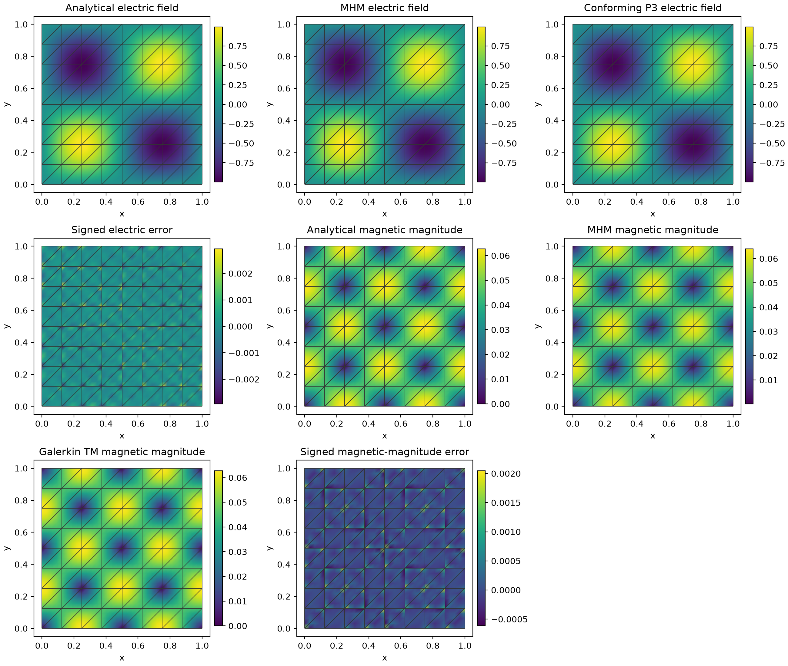
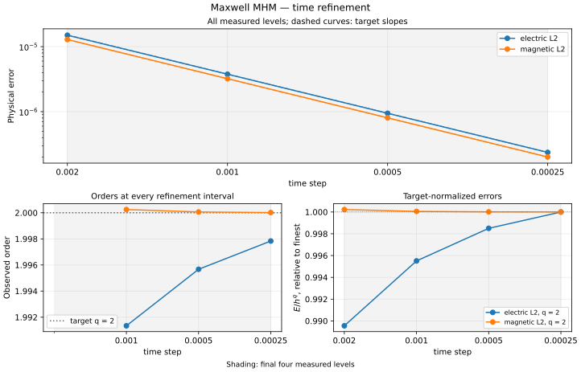

# Maxwell MHM

Advance user-written electric and magnetic equations with a tangential global
coupling. Start with a tetrahedral stationary patch to verify the declarations,
then propagate the original smooth two-dimensional TM cavity mode. Separate
spatial and temporal studies compare physical fields and the fixed semidiscrete
ODE, respectively. [The original analysis](../../theory/waves.md#maxwell-tangential-coupling-and-staggered-dynamics)
states their different error estimates.

[Executable notebook](https://github.com/ipes-lncc/pymhm/blob/main/notebooks/waves/maxwell/introductory_methods.ipynb) · [Theory and CFL conditions](../../theory/waves.md)

## 1. Distinguish electric and magnetic times


The shared differential matrix is $C=-\mathrm{curl}$, its electric pairing is
$-C^\top$, and $Q$ includes the signed tangential face maps. The canonical trace
is $\lambda=H\times n$. Exterior data satisfy $E_{\mathrm{tan}}-\lambda=g$.
Here $Z$ is the impedance face mass and $b$ contains the prescribed moments.

For an electric kick of duration $\tau$, use its average field as the local
unknown. The initialization uses $\tau=\Delta t/2$; later kicks use
$\tau=\Delta t$.

$$
\begin{aligned}
 w &= \tfrac12(E_{\mathrm{old}}+E_{\mathrm{new}}),\\
 M_e w+\tfrac{\tau}{2}Q\lambda
   &=M_e E_{\mathrm{old}}+\tfrac{\tau}{2}(F-C^\top H),\\
 -\sum_K Q_K^\top w_K+Z\lambda&=-b,\\
 E_{\mathrm{new}}&=2w-E_{\mathrm{old}}.
\end{aligned}
$$

The magnetic stage uses an independent mass problem with no trace coordinates.
It is assembled and reconstructed by the same generic core.

$$
 M_h H_{\mathrm{new}}=M_h H_{\mathrm{old}}+\Delta t\,C E.
$$
## 2. Write local providers and the global impedance equation

The notebook companion supplies integrated mass, curl and geometric tangential maps through `prepare`. These are coefficient operators. It does not choose the equations below. The minus transpose and the half-kick factor follow the preceding variational equations directly.

```python
import numpy as np
from pymhm.core.equations import Equation, LocalEquations
from pymhm.meshes.tetrahedron import TetraMesh
from threadpoolctl import threadpool_limits
from examples.tutorial_maxwell_equations import (
    Discretization, ElectricItem, MagneticItem,
    prepare, initialize, advance, l2_errors, compare_state,
)


def electric_local(item: ElectricItem) -> LocalEquations:
    """Declare the local midpoint field and its canonical tangential coupling."""
    local, Eold, H, F, duration = item
    return LocalEquations(
        a=local.electric_mass,
        L=local.electric_mass @ Eold + duration / 2 * (F - local.curl.T @ H),
        b=duration / 2 * local.coupling,
        c=-local.coupling.T,
        dofs=local.trace_dofs,
    )


def magnetic_local(item: MagneticItem) -> LocalEquations:
    """Declare the magnetic mass update with no global trace unknown."""
    local, E, Hold, dt = item
    return LocalEquations(
        a=local.magnetic_mass,
        L=local.magnetic_mass @ Hold + dt * (local.curl @ E),
        b=0, c=0, dofs=[],
    )


def electric_global(data: Discretization, boundary: np.ndarray) -> Equation:
    """Declare exterior impedance and prescribed tangential moments."""
    return Equation(a=data.impedance, L=-boundary)
```

## 3. Prepare mesh, data and initial staggered fields

The boundary callback supplies physical vectors; the geometric adapter projects their tangential part. No scalar normal binding is substituted for Maxwell's tangential map. `initialize` uses the electric provider with duration `dt/2`; the first electric field therefore has time `dt/2`, while magnetic time is zero.

```python
cube = TetraMesh.unit_cube()
mesh = TetraMesh(cube.points, cube.cells[:2])
electric = np.array([1.2, -0.3, 0.7])
magnetic = np.array([0.4, 0.8, -0.2])


def impedance_data(time: float, points: np.ndarray, normals: np.ndarray) -> np.ndarray:
    """Supply the stationary physical E_tan-(H cross n) boundary data."""
    return electric - np.cross(magnetic, normals)


with threadpool_limits(1):
    data = prepare(
        mesh, time_step=0.001, degree=2, local_refinement=2,
        absorbing=1.0, boundary_data=impedance_data, quadrature_order=5,
    )
    state = initialize(
        data, electric, magnetic,
        electric_provider=electric_local, global_provider=electric_global,
    )
print({
    "dt_times_frequency_bound": data.time_step * data.frequency_bound,
    "CFL_upper_limit": 2.0,
    "electric_time": state.electric_time,
    "magnetic_time": state.magnetic_time,
})
```

## 4. Assemble and solve at each electric kick

`advance` calls the declared providers and the generic multiscale assembly. It updates the magnetic field first, then solves the global tangential electric problem. Local factor reuse is an execution choice independent of these equations.

```python
trajectory = [state]
rows = []
with threadpool_limits(1):
    for step in range(4):
        state = advance(
            data, state,
            electric_provider=electric_local,
            magnetic_provider=magnetic_local,
            global_provider=electric_global,
        )
        trajectory.append(state)
        electric_error, magnetic_error = l2_errors(data, state, electric, magnetic)
        assert max(electric_error, magnetic_error) < 1e-9
        assert abs(state.energy_balance_residual) < 1e-10
        rows.append({
            "step": step + 1,
            "electric_time": state.electric_time,
            "magnetic_time": state.magnetic_time,
            "electric_l2": electric_error,
            "magnetic_l2": magnetic_error,
            "tangential_moment_norm": state.constraint_moment_norm,
            "original_electric_residual": state.original_electric_residual,
            "energy_balance_residual": state.energy_balance_residual,
        })
for row in rows:
    print(row)
```

## 5. Inspect physical fields and energy

Compare electric and magnetic fields at their own recorded times. The tangential moment norm, original electric equations and staggered energy balance are different checks. This stationary patch is not a propagation-accuracy test. The local spaces are discontinuous polynomial fields; they do not claim Nédélec conformity. The notebook also compares the declared providers against the uncondensed original coefficient equations on identical spaces. This is an algebraic check, not an independent physical discretization.

The stationary patch supplies no propagation baseline. The TM example below
has a separately assembled conforming scalar-wave Galerkin reference. That
exact two-dimensional reduction supplies a classical control for this TM
physical case; it does not qualify a general three-dimensional H(curl) solver.

The executable notebook includes this physical plot:

```python
import matplotlib.pyplot as plt
from itertools import combinations

fig = plt.figure(figsize=(10, 4.8), layout="constrained")
axes = [fig.add_subplot(1, 2, index+1, projection="3d") for index in range(2)]
for cell in range(len(mesh.cells)):
    points, E, H = state.sample(cell, np.full((1, 4), 0.25))
    points, E, H = points.reshape(-1, 3), E.reshape(-1, 3), H.reshape(-1, 3)
    for ax, values, color in zip(axes, (E, H), ("tab:blue", "tab:orange"), strict=True):
        ax.quiver(*points.T, *values.T, length=0.15, normalize=False, color=color)
        vertices = mesh.points[mesh.cells[cell]]
        for i, j in combinations(range(4), 2):
            ax.plot(*vertices[[i, j]].T, color="black", linewidth=0.6)
for ax, name, time in zip(axes, ("Electric field", "Magnetic field"),
                          (state.electric_time, state.magnetic_time), strict=True):
    ax.set(xlabel="x", ylabel="y", zlabel="z", title=f"{name}, t={time:g}",
           xlim=(-0.1,1.1), ylim=(-0.1,1.1), zlim=(-0.1,1.1))
    ax.set_box_aspect((1,1,1))
Path("build/tutorial-methods").mkdir(parents=True, exist_ok=True)
fig.savefig("build/tutorial-methods/maxwell-vector-fields.png", dpi=200, metadata={"Author":"IPES Research Group", "License":"CC BY 4.0 — https://creativecommons.org/licenses/by/4.0/"})
plt.show()

```


## 6. Propagate the original nonconstant TM mode

Section 6.2 of [Lanteri et al. (2018)](https://doi.org/10.1137/16M110037X)
uses the unit-square PEC cavity, unit permittivity and permeability, zero
current, one local triangle per macrocell and local $P_{\ell+2}$ fields.
The $P_\ell$ tangential multiplier is unchanged here. With
$\omega=2\pi\sqrt2$, its exact fields are

$$
\begin{aligned}
E_z(t,x,y)&=\cos(\omega t)\sin(2\pi x)\sin(2\pi y),\\
H_x(t,x,y)&=-\tfrac1{\sqrt2}\sin(\omega t)
                  \sin(2\pi x)\cos(2\pi y),\\
H_y(t,x,y)&=\tfrac1{\sqrt2}\sin(\omega t)
                  \cos(2\pi x)\sin(2\pi y).
\end{aligned}
$$

Write the exact callbacks, choose the tangential space and reuse the local
providers already declared above:

```python
from pymhm import TriangleMesh, FaceSpace
from pymhm.fem.vector.curl import TangentialTraceSpace

macro = TriangleMesh.unit_square(8)
trace = SkeletonSpace(macro, tuple(FaceSpace.uniform(1) for _ in macro.faces))
skeleton = TangentialTraceSpace(trace)
data = prepare(macro, skeleton=skeleton, time_step=0.0005,
               degree=3, local_refinement=1, absorbing=None, quadrature_order=8)
state = initialize(data, electric_at_zero, np.zeros(2),
                   electric_provider=electric_local, global_provider=electric_global)
for _ in range(20):
    state = advance(data, state, electric_provider=electric_local,
                    magnetic_provider=magnetic_local, global_provider=electric_global)
```

The notebook defines every exact callback before this cell. Homogeneous PEC
means the electric tangential trace vanishes on the exterior; `absorbing=None`
introduces no impedance loss. This nonconstant field is a propagation example,
not a stationary reproduction patch.



The illustration uses $t_H=0.01$ and $t_E=0.01025$ on an $8\times8$ macro grid. The spatial convergence study below measures every staggered sample through $t_H=0.05$.

Evaluate each field at its own staggered time. Keep separate values on incident
macrocells and display the actual macro mesh on analytical, numerical and error
panels. These are physical electric and magnetic fields; their broken curls do
not assert global Nédélec conformity.

## 7. Independently refine a classical physical baseline

For this exact TM reduction, $E_{tt}-\Delta E=0$ with zero exterior $E$,
$E(0)=\sin(2\pi x)\sin(2\pi y)$ and $E_t(0)=0$. Independently assemble the
global conforming $P_3$ mass and stiffness with UFL, march with average-acceleration
Newmark, and recover $H=-\operatorname{rot}\nabla\int_0^t E(s)\,ds$ by trapezoidal
integration. No MHM trace, local lifting or condensed operator enters this solve.
This is the same physical TM case, rather than the exact exponential of the
MHM coefficient ODE.

| Classical mesh | Electric $L^2$ error | Magnetic $L^2$ error |
| --- | ---: | ---: |
| $16\times16$ | $1.6592\times10^{-5}$ | $1.5940\times10^{-4}$ |
| $32\times32$ | $1.1054\times10^{-6}$ | $1.9876\times10^{-5}$ |
| $64\times64$ | $6.4592\times10^{-8}$ | $2.4810\times10^{-6}$ |

The reference uses $\Delta t=0.000125$, final time $0.05$, strong homogeneous
PEC data and independent error quadrature degrees 14 and 18. Original momentum
relative residuals stay below $7.9\times10^{-15}$. Its analytical refinement
errors qualify the physical baseline; its finest numerical field is not exact.
Halving the time step on the finest reference changes the electric error by
1.1% and the magnetic error by 0.0034%; the reference remains substantially
more accurate than the measured multiscale fields.
The MHM electric and magnetic errors use their own recorded times, so coefficient
agreement at an invented common time is not claimed. The classical table
qualifies the electric and magnetic $L^2$ fields; the MHM broken
$H(\mathrm{curl})$ error is evaluated directly against the analytical derivatives.

## 8. Reach the spatial estimates, then assess time integration

For $\ell=1$, Section 6.2 reports combined maximum-in-time $L^2$ order two
and combined broken $H(\mathrm{curl})$ order one. The comparison uses local $P_3$
fields, unsplit $P_1$ tangential traces, regular macrotriangles, smooth cavity
data and a recorded CFL-stable time step. Measure the same norm throughout the
march, with independent quadrature orders 8 and 12. In this TM reduction,
the electric curl is the rotated gradient of scalar $E$, while the magnetic
curl is $\partial_x H_y-\partial_y H_x$. The combined broken curl norm includes
both field $L^2$ errors and both cellwise curl errors. The individual electric
field can converge more rapidly; that is additional observed accuracy,
separate from the combined-field estimate.

All six macro-grid resolutions $n=16,24,32,48,64,96$ remain in the figure.
The common final four-level window is $n=32,48,64,96$, with unchanged local and
trace spaces, final magnetic time $0.05$ and time step $0.0005$. The mesh variable
is the square-grid spacing $H=1/n$. The consecutive orders use the actual
non-dyadic refinement ratios, and both target-normalized error amplitudes vary
by only approximately 3% across the final window.

| Physical maximum-in-time observable | Literature order | Last three orders | Maximum/minimum of $E/H^q$ |
| --- | ---: | --- | ---: |
| combined $L^2$ | 2 | 1.9399, 2.1034, 1.9856 | 1.0302 |
| combined broken $H(\mathrm{curl})$ | 1 | 1.0319, 1.0470, 1.0080 | 1.0301 |


A separate $n=64$ control halves the time step to $0.00025$ while preserving
the spaces and final magnetic time. The recorded combined $L^2$ and broken
$H(\mathrm{curl})$ error maxima change by 0.0534% and 0.1538%, respectively.
Each electric field retains its own staggered physical times. Its individual
$L^2$ error maximum changes by 5.85%; it has no separate asserted spatial rate,
and this control is not relabeled as an $n=96$ result. On the finest spatial
level, the original electric-row relative residual is
$3.5\times10^{-16}$, modified-energy relative drift is
$3.2\times10^{-14}$ and the recorded CFL product is 1.0641. Independent
quadrature orders 8 and 12 agree on its combined norms to within
$4.9\times10^{-14}$ relatively.

The separate time study fixes the complete spatial operator and compares
leapfrog against `scipy.linalg.expm` of that same constrained DG ODE at the
respective electric and magnetic times. This exact semidiscrete comparator
isolates time integration; it is not a classical spatial reference.



| Temporal observable | Expected order | Last three orders |
| --- | ---: | --- |
| electric $L^2$ | 2 | 1.9913, 1.9957, 1.9978 |
| magnetic $L^2$ | 2 | 2.0002, 2.0001, 2.0000 |

Time steps are $0.002,0.001,0.0005,0.00025$, with unchanged local and tangential
spaces. Numeric original electric-row residuals stay below
$1.25\times10^{-16}$ and the maximum modified-energy relative drift is
$9.8\times10^{-15}$. The temporal record reports the original electric equations and modified-energy
drift independently of the physical field errors.

The three-dimensional cavity sequence remains a separately identified
preasymptotic study; this TM qualification does not transfer a two-dimensional
rate or geometry hypothesis to it.

## References

- Stéphane Lanteri, Diego Paredes, Claire Scheid and Frédéric Valentin (2018). *The Multiscale Hybrid-Mixed Method for the Maxwell Equations in Heterogeneous Media*. Multiscale Modeling & Simulation 16(4), 1648–1683. [DOI: 10.1137/16M110037X](https://doi.org/10.1137/16M110037X).
