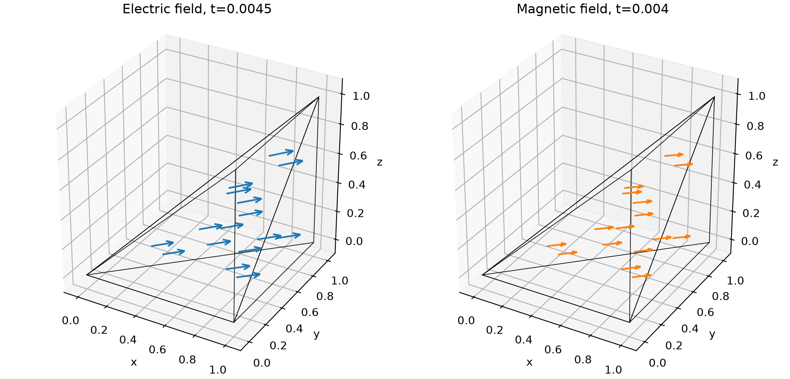
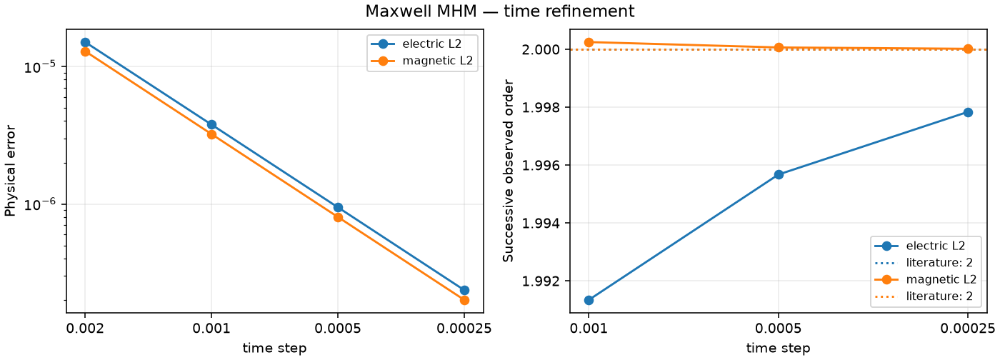

# Maxwell MHM

Advance user-written electric and magnetic equations with a tangential global coupling. The tetrahedral stationary patch below verifies the declarations over four steps. The final plot qualifies temporal order; [spatial targets from the original analysis](../../theory/waves.md#maxwell-tangential-coupling-and-staggered-dynamics) have separate refinement requirements.

[Executable notebook](https://github.com/ipes-lncc/pymhm/blob/main/notebooks/waves/maxwell/introductory_methods.ipynb) · [Theory and CFL conditions](../../theory/waves.md)

## 1. Distinguish electric and magnetic times


The shared differential matrix is $C=-\mathrm{curl}$, its electric pairing is
$-C^\top$, and $Q$ includes the signed tangential face maps. The canonical trace
is $\lambda=H\times n$. Exterior data satisfy $E_{\mathrm{tan}}-\lambda=g$.
Here $Z$ is the impedance face mass and $b$ contains the prescribed moments.

For an electric kick of duration $\tau$, use its average field as the local
unknown. The initialization uses $\tau=\Delta t/2$; later kicks use
$\tau=\Delta t$.

$$
\begin{aligned}
 w &= \tfrac12(E_{\mathrm{old}}+E_{\mathrm{new}}),\\
 M_e w+\tfrac{\tau}{2}Q\lambda
   &=M_e E_{\mathrm{old}}+\tfrac{\tau}{2}(F-C^\top H),\\
 -\sum_K Q_K^\top w_K+Z\lambda&=-b,\\
 E_{\mathrm{new}}&=2w-E_{\mathrm{old}}.
\end{aligned}
$$

The magnetic stage uses an independent mass problem with no trace coordinates.
It is assembled and reconstructed by the same generic core.

$$
 M_h H_{\mathrm{new}}=M_h H_{\mathrm{old}}+\Delta t\,C E.
$$
## 2. Write local providers and the global impedance equation

The notebook companion supplies integrated mass, curl and geometric tangential maps through `prepare`. These are coefficient operators. It does not choose the equations below. The minus transpose and the half-kick factor follow the preceding variational equations directly.

```python
import numpy as np
from pymhm.core.equations import Equation, LocalEquations
from pymhm.meshes.tetrahedron import TetraMesh
from threadpoolctl import threadpool_limits
from examples.tutorial_maxwell_equations import (
    Discretization, ElectricItem, MagneticItem,
    prepare, initialize, advance, l2_errors, compare_state,
)


def electric_local(item: ElectricItem) -> LocalEquations:
    """Declare the local midpoint field and its canonical tangential coupling."""
    local, Eold, H, F, duration = item
    return LocalEquations(
        a=local.electric_mass,
        L=local.electric_mass @ Eold + duration / 2 * (F - local.curl.T @ H),
        b=duration / 2 * local.coupling,
        c=-local.coupling.T,
        dofs=local.trace_dofs,
    )


def magnetic_local(item: MagneticItem) -> LocalEquations:
    """Declare the magnetic mass update with no global trace unknown."""
    local, E, Hold, dt = item
    return LocalEquations(
        a=local.magnetic_mass,
        L=local.magnetic_mass @ Hold + dt * (local.curl @ E),
        b=0, c=0, dofs=[],
    )


def electric_global(data: Discretization, boundary: np.ndarray) -> Equation:
    """Declare exterior impedance and prescribed tangential moments."""
    return Equation(a=data.impedance, L=-boundary)
```

## 3. Prepare mesh, data and initial staggered fields

The boundary callback supplies physical vectors; the geometric adapter projects their tangential part. No scalar normal binding is substituted for Maxwell's tangential map. `initialize` uses the electric provider with duration `dt/2`; the first electric field therefore has time `dt/2`, while magnetic time is zero.

```python
cube = TetraMesh.unit_cube()
mesh = TetraMesh(cube.points, cube.cells[:2])
electric = np.array([1.2, -0.3, 0.7])
magnetic = np.array([0.4, 0.8, -0.2])


def impedance_data(time: float, points: np.ndarray, normals: np.ndarray) -> np.ndarray:
    """Supply the stationary physical E_tan-(H cross n) boundary data."""
    return electric - np.cross(magnetic, normals)


with threadpool_limits(1):
    data = prepare(
        mesh, time_step=0.001, degree=2, local_refinement=2,
        absorbing=1.0, boundary_data=impedance_data, quadrature_order=5,
    )
    state = initialize(
        data, electric, magnetic,
        electric_provider=electric_local, global_provider=electric_global,
    )
print({
    "dt_times_frequency_bound": data.time_step * data.frequency_bound,
    "CFL_upper_limit": 2.0,
    "electric_time": state.electric_time,
    "magnetic_time": state.magnetic_time,
})
```

## 4. Assemble and solve at each electric kick

`advance` calls the declared providers and the generic multiscale assembly. It updates the magnetic field first, then solves the global tangential electric problem. Local factor reuse is an execution choice independent of these equations.

```python
trajectory = [state]
rows = []
with threadpool_limits(1):
    for step in range(4):
        state = advance(
            data, state,
            electric_provider=electric_local,
            magnetic_provider=magnetic_local,
            global_provider=electric_global,
        )
        trajectory.append(state)
        electric_error, magnetic_error = l2_errors(data, state, electric, magnetic)
        assert max(electric_error, magnetic_error) < 1e-9
        assert abs(state.energy_balance_residual) < 1e-10
        rows.append({
            "step": step + 1,
            "electric_time": state.electric_time,
            "magnetic_time": state.magnetic_time,
            "electric_l2": electric_error,
            "magnetic_l2": magnetic_error,
            "tangential_moment_norm": state.constraint_moment_norm,
            "original_electric_residual": state.original_electric_residual,
            "energy_balance_residual": state.energy_balance_residual,
        })
for row in rows:
    print(row)
```

## 5. Inspect physical fields and energy

Compare electric and magnetic fields at their own recorded times. The tangential moment norm, original electric equations and staggered energy balance are different checks. This stationary patch is not a propagation-accuracy test. The local spaces are discontinuous polynomial fields; they do not claim Nédélec conformity. The notebook also compares the declared providers against the uncondensed original coefficient equations on identical spaces. This is an algebraic check, not an independent physical discretization.

An independently refined conforming H(curl) reference is still required for a classical physical baseline. The algebraic comparison and stationary patch do not supply that reference.

The executable notebook includes this physical plot:

```python
import matplotlib.pyplot as plt
from itertools import combinations

fig = plt.figure(figsize=(10, 4.8), layout="constrained")
axes = [fig.add_subplot(1, 2, index+1, projection="3d") for index in range(2)]
for cell in range(len(mesh.cells)):
    points, E, H = state.sample(cell, np.full((1, 4), 0.25))
    points, E, H = points.reshape(-1, 3), E.reshape(-1, 3), H.reshape(-1, 3)
    for ax, values, color in zip(axes, (E, H), ("tab:blue", "tab:orange"), strict=True):
        ax.quiver(*points.T, *values.T, length=0.15, normalize=False, color=color)
        vertices = mesh.points[mesh.cells[cell]]
        for i, j in combinations(range(4), 2):
            ax.plot(*vertices[[i, j]].T, color="black", linewidth=0.6)
for ax, name, time in zip(axes, ("Electric field", "Magnetic field"),
                          (state.electric_time, state.magnetic_time), strict=True):
    ax.set(xlabel="x", ylabel="y", zlabel="z", title=f"{name}, t={time:g}",
           xlim=(-0.1,1.1), ylim=(-0.1,1.1), zlim=(-0.1,1.1))
    ax.set_box_aspect((1,1,1))
Path("build/tutorial-methods").mkdir(parents=True, exist_ok=True)
fig.savefig("build/tutorial-methods/maxwell-vector-fields.png", dpi=200, metadata={"Author":"IPES Research Group", "License":"CC BY 4.0 — https://creativecommons.org/licenses/by/4.0/"})
plt.show()

```



## 6. Verify space and time convergence separately

For the smooth 2D TM cavity family of [Lanteri, Paredes, Scheid and Valentin (2018)](https://doi.org/10.1137/16M110037X), trace degree one targets combined L2 order two and combined broken-curl order one. Degree two targets orders three and two. A spatial study must reduce the time step until temporal error is negligible. The plot and table below qualify temporal refinement against the exact constrained semidiscrete ODE at the respective staggered electric and magnetic times. They do not establish those spatial rates. The current 3D cavity sequence is preasymptotic and is not assigned the 2D rates.



[Vector SVG](../../assets/tutorials/methods/maxwell-convergence.svg) · [Publication PDF](../../assets/tutorials/methods/maxwell-convergence.pdf)

| Observable | Expected order | Penultimate interval | Final interval |
| --- | ---: | ---: | ---: |
| electric L2 | 2 | 1.996 | 1.998 |
| magnetic L2 | 2 | 2.000 | 2.000 |

Spaces: Fixed constrained spatial Maxwell operator; staggered electric/magnetic field times. Refinement variable: time step.

[Numerical record](https://github.com/ipes-lncc/pymhm/blob/main/examples/results/tutorial-methods/maxwell-current-refinement.json), SHA-256 `82a0d9c3d7a1e7ca1c8e4862276c23f26502013a8d1c0d770b1456a7afe7b1bd`.

## References

- Stéphane Lanteri, Diego Paredes, Claire Scheid and Frédéric Valentin (2018). *The Multiscale Hybrid-Mixed Method for the Maxwell Equations in Heterogeneous Media*. Multiscale Modeling & Simulation 16(4), 1648–1683. [DOI: 10.1137/16M110037X](https://doi.org/10.1137/16M110037X).
