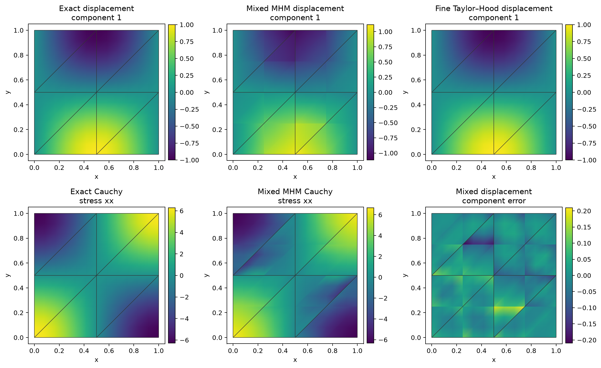
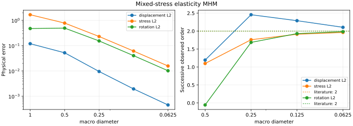

# Mixed H(div) stress MHM

**Follow the complete workflow: meshes → local equations → global equations → assemble → solve → physical fields and errors.**

[Executable notebook](https://github.com/ipes-lncc/pymhm/blob/main/notebooks/elasticity/mixed_stress_mhm_workflow.ipynb) · [Download notebook](https://raw.githubusercontent.com/ipes-lncc/pymhm/main/notebooks/elasticity/mixed_stress_mhm_workflow.ipynb) · [Theory and degree conditions](../../theory/elasticity.md)

The notebook prepares its verified companion workspace before these cells. `ROOT` denotes that writable workspace. Use the `introduction` environment with DOLFINx, UFL and Basix; see the [installation guide](../../installation.md). The local numerical algorithm remains in the package; this lesson defines the actual variational equations and physical data.

This notebook uses row-wise BDM stress, discontinuous displacement and weak rotation. You write the compliance, force balance, symmetry and normal-traction equations before assembling. Basix-based package kernels handle finite-element integration and Piola maps. The method follows [Devloo et al. (2021)](https://doi.org/10.1051/m2an/2021013), with the stable stress spaces of [Arnold, Falk and Winther (2007)](https://doi.org/10.1090/S0025-5718-07-01998-9).

Use the locked `introduction` Pixi environment for the independent classical UFL control. The multiscale equations themselves use the portable NumPy/SciPy backend.

```python
from dataclasses import replace

import basix.ufl
import matplotlib.pyplot as plt
import numpy as np
import ufl
from scipy import sparse
from threadpoolctl import threadpool_limits

from pymhm import (
    Equation,
    FaceSpace,
    MeshHierarchy,
    MultiscaleProblem,
    SkeletonSpace,
    TriangleMesh,
    assemble,
    bind_interface,
    bind_problem,
    solve,
)
from pymhm.core.equations import compile_form
from pymhm.fem.hdiv.bdm_family import BDMFamily
from pymhm.fem.scalar.triangle import multiindices, nodal_space
from pymhm.fem.vector.stress import (
    displacement_rigid_moments,
    mixed_elasticity_operators,
    rigid_values,
    stress_trace_moments,
    traction_mapping,
)
from pymhm.postprocessing.nodal import nodal_field
from pymhm.postprocessing.piola import hdiv_field
from pymhm.postprocessing.stress import MixedElasticitySolution
```

## 1. State physical fields and boundary data

On the unit square, choose a smooth solenoidal displacement:

$$
u=(\sin(\pi x)\cos(\pi y),-\cos(\pi x)\sin(\pi y)),\qquad \mu=1,\quad\lambda=2.
$$

Then $p=-\lambda\nabla\cdot u=0$, $\sigma=2\mu\varepsilon(u)$ and $f=2\pi^2u$. The weak rotation convention is $r=(\partial_yu_1-\partial_xu_2)/2$. The exact boundary displacement is nonzero on parts of the exterior; it must enter the global functional.

```python
def smooth_fields(points):
    """Define independent solenoidal displacement, physical stress, force and weak rotation."""
    x, y = np.pi * points.T
    u = np.column_stack((np.sin(x) * np.cos(y), -np.cos(x) * np.sin(y)))
    sigma = np.zeros((len(points), 2, 2))
    sigma[:, 0, 0] = 2 * np.pi * np.cos(x) * np.cos(y)
    sigma[:, 1, 1] = -sigma[:, 0, 0]
    return u, sigma, 2 * np.pi**2 * u, -np.pi * np.sin(x) * np.sin(y)


def exact_u(points):
    """Return the nonhomogeneous prescribed displacement."""
    return smooth_fields(points)[0]


def exact_ufl(domain):
    """State the same exact physical data for native classical assembly."""
    x = ufl.SpatialCoordinate(domain)
    ue = ufl.as_vector(
        (
            ufl.sin(np.pi * x[0]) * ufl.cos(np.pi * x[1]),
            -ufl.cos(np.pi * x[0]) * ufl.sin(np.pi * x[1]),
        )
    )
    return ue, ufl.as_ufl(0), 2 * np.pi**2 * ue
```

## 2. Declare compatible spaces and independent local meshes

Stress rows use BDM2; displacement and rotation use discontinuous $P_1$. They contain all three two-dimensional rigid modes. BDM1/P0/P0 omits the rigid rotation and is inadmissible for this local MHM construction.

Interior macrofaces use vector $P_1$ negative traction. Exterior faces retain full $P_2$ moments on each fine boundary edge, as required to represent the prescribed normal-stress space in this comparison. The normal/interior degrees can be enriched independently through `BDMFamily`; its divergence and rotation degrees change with the selected interior family.

```python
n, refinement = 2, 2
lam, mu = 2.0, 1.0
macro = TriangleMesh.unit_square(n)
boundary = set(macro.boundary_faces)
family = BDMFamily(2, 0)
skeleton = SkeletonSpace(
    macro,
    tuple(
        FaceSpace.uniform(2, refinement) if f in boundary else FaceSpace.uniform(1)
        for f in range(len(macro.faces))
    ),
    2,
)
hierarchy = MeshHierarchy(
    macro, tuple(macro.submesh(i, refinement) for i in range(len(macro.cells)))
)
interface = bind_interface(skeleton, convention="normal")


def source(points):
    """Return the independently derived physical body force."""
    return smooth_fields(points)[2]


def displacement(points):
    """Return the physical displacement including nonzero exterior values."""
    return smooth_fields(points)[0]
```

## 3. Identify each mathematical block of the local operator

For $\operatorname{asym}\tau=\tau_{12}-\tau_{21}$, the mixed forms are

$$
\begin{aligned}
(\mathcal A\sigma,\tau)_T+(u,\nabla\cdot\tau)_T
 +(r,\operatorname{asym}\tau)_T-\langle \widehat u,\tau n\rangle_{\partial T}&=0,\\
(\nabla\cdot\sigma,v)_T&=-(f,v)_T,\\
(\operatorname{asym}\sigma,s)_T&=0,\\
\langle\sigma n+\lambda_H,w\rangle_{\partial T}&=0.
\end{aligned}
$$

Here $\widehat u$ is an auxiliary local boundary displacement and $\lambda_H=-\sigma n$ is the global negative traction. The compliance in two dimensions is

$$
\mathcal A\sigma=\frac{1}{2\mu}
\left(\sigma-\frac{\lambda}{2(\mu+\lambda)}\operatorname{tr}(\sigma)I\right).
$$

`mixed_elasticity_operators` integrates precisely the compliance mass `mass`, row divergence `divergence`, weak symmetry `asymmetry` and volume force `force`. The following UFL expression is the same three volume equations; the actual portable solve below uses the shared kernels.

```python
def mixed_volume_form(space):
    """State the independent row-wise stress/displacement/rotation UFL volume form."""
    row0, row1, u, r = ufl.TrialFunctions(space)
    test0, test1, v, s = ufl.TestFunctions(space)
    sigma = ufl.as_matrix(((row0[0], row0[1]), (row1[0], row1[1])))
    tau = ufl.as_matrix(((test0[0], test0[1]), (test1[0], test1[1])))
    compliance = (sigma - lam / (2 * (mu + lam)) * ufl.tr(sigma) * ufl.Identity(2)) / (2 * mu)
    dx = ufl.Measure("dx", domain=space.mesh, metadata={"quadrature_degree": 10})
    _, _, f = exact_ufl(space.mesh)
    a = (
        ufl.inner(compliance, tau)
        + ufl.inner(u, ufl.div(tau))
        + ufl.inner(ufl.div(sigma), v)
        + r * (tau[0, 1] - tau[1, 0])
        + s * (sigma[0, 1] - sigma[1, 0])
    ) * dx
    return Equation(a, -ufl.inner(f, v) * dx)
```

```python
from pymhm.backends.spaces import bind_space

native_volume = bind_space(
    hierarchy.local_mesh(0),
    basix.ufl.mixed_element(
        [
            basix.ufl.element("BDM", "triangle", 2),
            basix.ufl.element("BDM", "triangle", 2),
            basix.ufl.element(
                "DG", "triangle", 1, shape=(2,), lagrange_variant=basix.LagrangeVariant.equispaced
            ),
            basix.ufl.element(
                "DG", "triangle", 1, lagrange_variant=basix.LagrangeVariant.equispaced
            ),
        ]
    ),
)
try:
    native_equation = mixed_volume_form(native_volume.space)
    native_matrix = compile_form(native_equation.a)
    native_load = compile_form(native_equation.L)
    print("Independent UFL volume blocks:", native_matrix.shape, native_load.shape)
finally:
    native_volume.close()
```

## 4. Include local boundary displacement and rigid moments

With $S$ extracting the stress normal moments and $N$ mapping skeletal traction into the fine normal basis, the four local blocks are

$$
\begin{pmatrix}
M_\mathcal A&D^T&W^T&-S\\
D&0&0&0\\
W&0&0&0\\
-S^T&0&0&0
\end{pmatrix}
\begin{pmatrix}\sigma\\u\\r\\\widehat u\end{pmatrix}
+\begin{pmatrix}0\\0\\0\\-N\end{pmatrix}\lambda_H
=\begin{pmatrix}0\\-F\\0\\0\end{pmatrix}.
$$

The boundary selector records the declared BDM normal-moment ordering; `traction_mapping` owns geometric orientation and trace partitions. Its blocks already use global coordinates, so `coordinates="global"` prevents applying incidence signs twice.

The kernel comprises translations and the coupled rigid displacement/rotation/boundary trace. Declared displacement integrals fix their physical coordinates. The linear boundary rigid trace has a constant and first Legendre coefficient; higher coefficients vanish. These are definitions of the physical modes, not a numerical nullspace search.

```python
def local_equations(local):
    """Declare mixed volume/normal-traction equations and moment-fixed physical rigid modes."""
    fine = local.mesh
    mass, divergence, asymmetry, force = mixed_elasticity_operators(
        fine, lam, mu, source, 10, family
    )
    ns, nu, nr = mass.shape[0], divergence.shape[0], asymmetry.shape[0]
    normal_size = 2 * (family.degree + 1)
    nb = normal_size * len(fine.boundary_faces)
    normal_rows = (normal_size * fine.boundary_faces[:, None] + np.arange(normal_size)).ravel()
    S = sparse.coo_matrix((np.ones(nb), (normal_rows, np.arange(nb))), shape=(ns, nb)).tocsc()
    A = sparse.bmat(
        [
            [mass, divergence.T, asymmetry.T, -S],
            [divergence, None, None, None],
            [asymmetry, None, None, None],
            [-S.T, None, None, None],
        ],
        format="csc",
    )
    L = np.r_[np.zeros(ns), -force, np.zeros(nr + nb)]
    N = traction_mapping(macro, local.cell, fine, skeleton, family)
    B = np.zeros((len(L), N.shape[1]))
    B[-nb:] = -N
    center = macro.points[macro.cells[local.cell]].mean(axis=0)
    nodes = np.einsum("qi,tij->tqj", multiindices(1), fine.points[fine.cells])
    Z = np.zeros((len(L), 3))
    Z[ns : ns + nu] = rigid_values(nodes, center).reshape(-1, 3)
    Z[ns + nu : ns + nu + nr, 2] = -1
    rigid_edges = rigid_values(fine.points[fine.faces[fine.boundary_faces]], center)
    edge_coefficients = np.zeros((len(rigid_edges), family.degree + 1, 2, 3))
    edge_coefficients[:, 0] = rigid_edges.mean(axis=1)
    edge_coefficients[:, 1] = (rigid_edges[:, 1] - rigid_edges[:, 0]) / 2
    Z[ns + nu + nr :] = edge_coefficients.reshape(-1, 3)
    M = np.zeros_like(Z)
    M[ns : ns + nu] = displacement_rigid_moments(fine, center, family)
    plain, weighted, scale = stress_trace_moments(fine, ns, lam, mu, 10, family)
    pressure_weights = np.r_[weighted / scale, np.zeros(nu + nr + nb)]
    selector = sparse.eye(len(L), format="csr")
    fields = (
        hdiv_field("stress", fine, family, components=2, reconstruction=selector[:ns]),
        nodal_field(
            "displacement",
            fine,
            1,
            components=2,
            discontinuous=True,
            reconstruction=selector[ns : ns + nu],
        ),
        nodal_field(
            "rotation", fine, 1, discontinuous=True, reconstruction=selector[ns + nu : ns + nu + nr]
        ),
    )
    equations = local.equations(
        a=A,
        L=L,
        b=B,
        c=-B.T,
        kernel=Z,
        moments=M,
        coordinates="global",
        metadata=(pressure_weights, ns, nu, nr),
    )
    return replace(equations, field_data=fields)
```

## 5. Declare the global boundary equation, assemble and solve

The global equation enforces continuity of the weak boundary displacement and the prescribed exterior moments. The sign follows the mixed local equations above; it differs from a primal convention because the boundary auxiliary appears with $-S$.

Finite $\lambda$ also implies

$$
\int_\Omega\frac{\operatorname{tr}\sigma}{2(\mu+\lambda)}
=\int_{\partial\Omega}g\cdot n=0.
$$

The normalized weighted-stress row below states this identity. At incompressibility the trace integral becomes a pressure gauge; pure traction instead needs displacement rigid gauges. `MixedElasticitySolution` only interprets the executed blocks and supplies physical diagnostics.

```python
def global_equation(context):
    """Enforce assembled boundary displacement moments with the mixed-method sign."""
    boundary, _ = context.boundary_data(displacement, order=10)
    return Equation(0, context.trace_load(boundary))


with threadpool_limits(1):
    problem = bind_problem(
        hierarchy, interface, local_equations, global_equation=global_equation, retained=3
    )
    system = assemble(problem)
    # The chosen solenoidal data have zero integrated normal boundary displacement.
    constraints = [system.mean_constraint([m[0] for m in system.local_metadata], 0.0)]
    coefficients = solve(system, constraints=constraints)
    sf, uf, rf = (coefficients.field(name) for name in ("stress", "displacement", "rotation"))
    view = MixedElasticitySolution(
        skeleton,
        tuple(f.mesh for f in uf),
        tuple(f.coefficients.reshape(-1, 2) for f in sf),
        tuple(f.coefficients.reshape(len(f.mesh.cells), 3, 2) for f in uf),
        tuple(f.coefficients.reshape(len(f.mesh.cells), 3) for f in rf),
        coefficients,
        source,
        10,
        family,
    )
```

## 6. Check physical errors, fine force balance and weak symmetry

Do not symmetrize the computed stress before measuring its error. Symmetry is enforced in the rotation test space; its pointwise skew part may be nonzero. Fine-cell force moments, skeletal normal traction and full original equations are checked independently.

```python
from examples.core_elasticity_field_archive import ProductionObservation
from examples.minimal_flow_originals import original_diagnostics

errors = {
    "displacement_l2": view.l2_error(displacement, 12),
    "stress_l2": view.stress_l2_error(lambda x: smooth_fields(x)[1], 12),
    "rotation_l2": view.rotation_l2_error(lambda x: smooth_fields(x)[3], 12),
    "stress_divergence_l2": view.divergence_l2_error(lambda x: -source(x), 12),
}
invariants = {
    "fine_force": max(float(np.max(abs(r))) for r in view.fine_force_residuals()),
    "weak_symmetry": max(float(np.max(abs(r))) for r in view.weak_symmetry_residuals()),
    "normal_traction": max(float(np.max(abs(r))) for r in view.normal_traction_residuals()),
}
print(errors)
print(invariants)
assert max(invariants.values()) < 1e-10

observation = ProductionObservation(
    system=system,
    applied_boundary=-system.global_load[: system.trace_size],
    constraints=constraints,
)
blocks = [
    {
        "stress_constitutive": ns,
        "force_balance": nu,
        "weak_symmetry": nr,
        "normal_traction_compatibility": len(field) - ns - nu - nr,
    }
    for field, (_, ns, nu, nr) in zip(coefficients.fields, system.local_metadata, strict=True)
]
physical = original_diagnostics(view, observation, blocks)
print("Original physical residual:", physical["full_uncondensed_relative_to_physical_rhs"])
assert physical["accepted"]
```

## 7. Build and refine the independent classical baseline

The classical Taylor–Hood displacement–pressure system uses the same material, force and nonhomogeneous boundary values on global $32\times32$ and $64\times64$ meshes. These meshes are independent of the coarse $2\times2$ macro partition. Analytical errors qualify the refined baseline before its field is plotted.

```python
from dolfinx import fem

from pymhm.backends.spaces import bind_space, coefficient_map
from pymhm.postprocessing.fields import DiscreteField, FieldDefinition


def conforming_reference(resolution):
    """Solve the notebook's unstabilized Taylor–Hood form on a fine global mesh."""
    mesh = TriangleMesh.unit_square(resolution)
    element = basix.ufl.mixed_element(
        [
            basix.ufl.element(
                "Lagrange",
                "triangle",
                2,
                shape=(2,),
                lagrange_variant=basix.LagrangeVariant.equispaced,
            ),
            basix.ufl.element(
                "Lagrange", "triangle", 1, lagrange_variant=basix.LagrangeVariant.equispaced
            ),
        ]
    )
    native = bind_space(mesh, element)
    try:
        u, p = ufl.TrialFunctions(native.space)
        v, q = ufl.TestFunctions(native.space)
        domain = native.space.mesh
        ue, pe, force = exact_ufl(domain)
        dx = ufl.Measure("dx", domain=domain, metadata={"quadrature_degree": 12})
        a = (
            2 * mu * ufl.inner(ufl.sym(ufl.grad(u)), ufl.sym(ufl.grad(v)))
            - p * ufl.div(v)
            - q * ufl.div(u)
            - p * q / lam
        ) * dx
        L = ufl.inner(force, v) * dx
        _, nodes = nodal_space(mesh, 2)
        boundary_nodes = np.flatnonzero(np.any(np.isclose(nodes, 0) | np.isclose(nodes, 1), axis=1))
        portable = (2 * boundary_nodes[:, None] + np.arange(2)).ravel()
        native_ids = coefficient_map(native, component=0)[portable]
        fixed = dict(zip(native_ids, exact_u(nodes[boundary_nodes]).ravel(), strict=True))
        reference_problem = MultiscaleProblem.from_global(
            Equation(a, L),
            native.size,
            fixed=fixed,
        )
        # Finite lambda determines this zero integral by the displacement data.
        pressure_integral = compile_form(q * dx)
        result = solve(assemble(reference_problem), constraints=[(pressure_integral, 0.0)])
        numerical = fem.Function(native.space)
        numerical.x.array[:] = result.trace
        uh, ph = ufl.split(numerical)
        sigma_h = 2 * mu * ufl.sym(ufl.grad(uh)) - ph * ufl.Identity(2)
        sigma_e = 2 * mu * ufl.sym(ufl.grad(ue)) - pe * ufl.Identity(2)
        differences = {
            "displacement_l2": uh - ue,
            "pressure_l2": ph - pe,
            "stress_l2": sigma_h - sigma_e,
        }
        errors = {
            name: float(np.sqrt(fem.assemble_scalar(fem.form(ufl.inner(delta, delta) * dx))))
            for name, delta in differences.items()
        }
        fields = {
            name: DiscreteField(
                FieldDefinition(name, descriptor=native.descriptor(component=i)), result.trace
            )
            for i, name in enumerate(("displacement", "pressure"))
        }
        return fields, {
            "resolution": resolution,
            "triangles": len(mesh.cells),
            "unknowns": native.size,
            "errors": errors,
            "residual": result.residual,
        }
    finally:
        native.close()


with threadpool_limits(1):
    reference32, control32 = conforming_reference(32)
    reference64, control64 = conforming_reference(64)
print(control32)
print(control64)
assert all(
    control64["errors"][name] < control32["errors"][name]
    for name in ("displacement_l2", "stress_l2")
)
```

The independently refined classical control gives the following analytical errors:

| Global squares per axis | Displacement L2 | Physical stress L2 |
| --- | ---: | ---: |
| 32 | $1.2181\times10^{-5}$ | $5.2267\times10^{-3}$ |
| 64 | $1.5213\times10^{-6}$ | $1.3077\times10^{-3}$ |

## 8. Plot stress and displacement with the actual macro mesh

Independent fine-cell samples preserve the two traces at reconstructed interfaces; the display helper never averages them.

```python
from IPython.display import SVG, display

from examples.introduction.vector import plot_field_panels
from examples.plot_mixed_elasticity import spatial_arrays

triangulation, x, numerical = spatial_arrays(view)
triangles = triangulation.triangles
ue, se, _, re = smooth_fields(x)
baseline = reference64["displacement"].evaluate(x)
panels = {
    "Exact displacement\ncomponent 1": (x, triangles, ue[:, 0]),
    "Mixed MHM displacement\ncomponent 1": (x, triangles, numerical[:, 0]),
    "Fine Taylor–Hood displacement\ncomponent 1": (x, triangles, baseline[:, 0]),
    "Exact Cauchy\nstress xx": (x, triangles, se[:, 0, 0]),
    "Mixed MHM Cauchy\nstress xx": (x, triangles, numerical[:, 1]),
}
# Numerical x component and weak rotation are sampled independently in each fine cell.
panels["Mixed displacement\ncomponent error"] = (x, triangles, numerical[:, 0] - ue[:, 0])
figure = plot_field_panels(macro, panels, figsize=(13, 8))
output = ROOT / "build" / "tutorial-method-workflows"
output.mkdir(parents=True, exist_ok=True)
figure.savefig(output / "mixed_stress-elasticity-fields.png", dpi=180, bbox_inches="tight")
figure.savefig(output / "mixed_stress-elasticity-fields.svg", bbox_inches="tight")
display(SVG(filename=str(output / "mixed_stress-elasticity-fields.svg")))
plt.show()
```

[](../../assets/tutorials/methods/mixed-elasticity-fields.svg)

## 9. Reach the smooth asymptotic regime

The archived refinement series uses this same smooth field, BDM2/DG-P1/DG-P1 local spaces, refinement two, interior vector $P_1$ tractions and full exterior fine-edge $P_2$ tractions. It increases the macro resolution through $1,2,4,8,16$. The current explicit equations above run its $n=2$ level; reading the remaining attributed records is not another solve.

The compatible smooth mixed stress/rotation estimates give order two. Displacement is shown separately. Rough coefficients, singular domains, different trace partitions or incomplete rigid spaces require their own regularity and stability assessment.

```python
import json
from io import StringIO

from IPython.display import SVG, display

from examples.introduction.vector import observed_rates
from examples.tutorial_convergence import plot_method_series

record = json.loads((ROOT / "examples/results/mixed-elasticity.json").read_text())
rows = record["convergence"]
sizes = np.asarray([1 / row["macro_resolution"] for row in rows])
errors = {
    label: np.array([row[key] for row in rows])
    for label, key in {
        "displacement L2": "displacement_l2",
        "stress L2": "stress_l2",
        "rotation L2": "rotation_l2",
    }.items()
}
series = dict(
    method="mixed-elasticity",
    sizes=sizes.tolist(),
    errors={k: v.tolist() for k, v in errors.items()},
    rates={k: observed_rates(sizes, v).tolist() for k, v in errors.items()},
    expected={"stress L2": 2.0, "rotation L2": 2.0},
    spaces="BDM2 stress / DG P1 displacement and rotation; interior P1, full boundary P2 traces",
    refinement="macro size H",
)
print("Final measured orders:", {k: v[-1] for k, v in series["rates"].items()})
figure = plot_method_series(series)
svg_buffer = StringIO()
figure.savefig(svg_buffer, format="svg")
display(SVG(svg_buffer.getvalue()))
plt.show()
```



The final consecutive intervals confirm the stated smooth regime. A measured order for an observable without a separate stated reference is reported as **observed**.

| Physical observable | Penultimate order | Final order | Reference order |
| --- | ---: | ---: | ---: |
| displacement L2 | 2.2899 | 2.1055 | observed |
| stress L2 | 1.9128 | 1.9631 | 2.0 |
| rotation L2 | 1.9310 | 1.9843 | 2.0 |

The [common convergence notebook](https://github.com/ipes-lncc/pymhm/blob/main/notebooks/convergence/method_rates.ipynb) preserves each sequence’s spaces, independent refinement variable and attributed numerical record.

## References

- [Devloo, Farias, Gomes, Pereira, dos Santos and Valentin (2021), *New H(div)-conforming multiscale hybrid-mixed methods for the elasticity problem on polygonal meshes*](https://doi.org/10.1051/m2an/2021013).
- [Arnold, Falk and Winther (2007), *Mixed finite element methods for linear elasticity with weakly imposed symmetry*](https://doi.org/10.1090/S0025-5718-07-01998-9).

This smooth verification uses independently stated analytical data and is not a claim of matching every original heterogeneous table.
