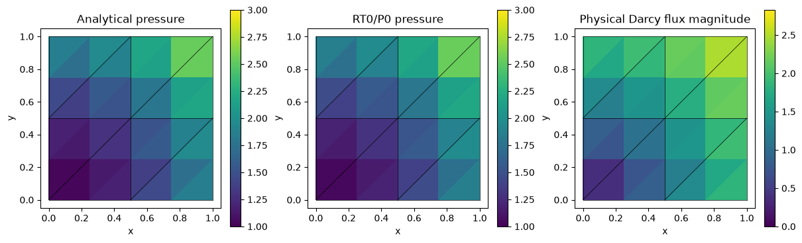
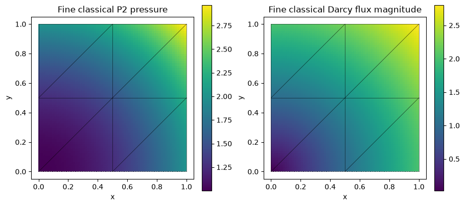
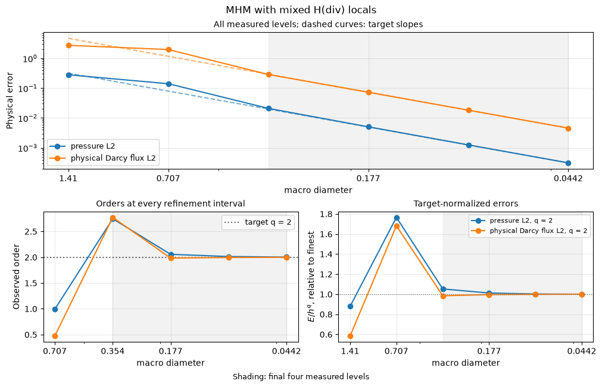
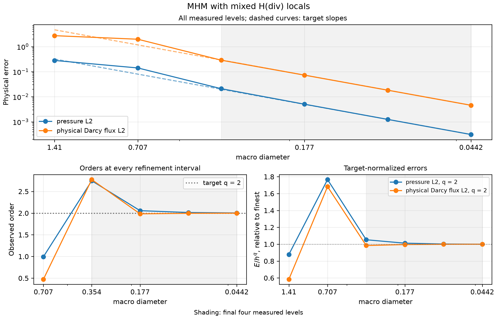

# MHM with mixed H(div) local problems

[Open the step-by-step notebook](https://github.com/ipes-lncc/pymhm/blob/main/notebooks/darcy/mixed_mhm_workflow.ipynb) · [Download notebook](https://raw.githubusercontent.com/ipes-lncc/pymhm/main/notebooks/darcy/mixed_mhm_workflow.ipynb) · [Theory and degree conditions](../../theory/elliptic.md)

We write every local block and the global boundary equation, then assemble, solve and evaluate the fields. No named Darcy constructor chooses the problem. The source is independently derived from $p=1+x^2+y^2$ and $q=-2(x,y)$: $f=\nabla\cdot q=-4$. Exterior pressure equals the analytical value.

The example uses portable Basix RT0/P0 local kernels. RT0 contains this affine radial flux; its P0 pressure is an approximation and should not be declared exact. The general mixed-local construction follows [Durán, Devloo, Gomes and Valentin (2019)](https://doi.org/10.1016/j.cma.2019.05.013).


```python
import numpy as np
import matplotlib.pyplot as plt
from scipy import sparse
from pymhm import Equation, LocalContext, MeshHierarchy, SkeletonSpace, TriangleMesh
from pymhm import assemble, bind_interface, bind_problem, solve
from pymhm.fem.scalar.operators import rt0_operators, rt0_evaluate, face_integration, triangle_quadrature


def exact_pressure(points: np.ndarray) -> np.ndarray:
    """Analytical nonhomogeneous boundary pressure."""
    return 1 + np.sum(points**2, axis=1)


def exact_flux(points: np.ndarray) -> np.ndarray:
    """Physical Darcy flux for identity permeability."""
    return -2 * points


def source(points: np.ndarray) -> np.ndarray:
    """Independently differentiated flux divergence."""
    return np.full(len(points), -4.0)
```

## 1. Define macro and local meshes

The P0 normal-flux skeleton controls the global approximation. Each macrotriangle has its own red-refined RT0/P0 local mesh. Numbering and face incidence come from the mesh and shared pairing owner.


```python
macro = TriangleMesh.unit_square(2)
local_meshes = tuple(macro.submesh(cell, 2) for cell in range(len(macro.cells)))
hierarchy = MeshHierarchy(macro, local_meshes)
skeleton = SkeletonSpace(macro)
interface = bind_interface(skeleton, convention="normal")
```

## 2. Translate the mixed weak problem into blocks


$$
\begin{aligned}
(K^{-1}q,r)_T-(p,\nabla\cdot r)_T+\langle\eta,r\cdot n_T\rangle_{\partial T}&=0,\\
-(\nabla\cdot q,w)_T&=-(f,w)_T,\\
\langle q\cdot n_T-\lambda_T,\xi\rangle_{\partial T}&=0.
\end{aligned}
$$


The flux, pressure and private boundary-pressure coefficients form $u_T=(q_T,p_T,\eta_T)$. The first two volume operators are $M$ and $D$; $N$ pairs boundary pressure with fine normal-flux coefficients. $F$ transports the skeletal normal-flux density to those integrated boundary coefficients.

The common Basix/FEM operations integrate these forms in their declared coefficient basis; the block matrix and signs below are the user's formulation. The final trace map already includes canonical normal incidence, so `coordinates="global"` explicitly avoids applying it again.


```python
def local_equations(local: LocalContext):
    """Declare the three mixed equations and their independent global test."""
    fine = local.mesh
    M, D, force = rt0_operators(fine, 1.0, source, order=6)
    _, F = face_integration(macro, local.cell, fine, skeleton)
    nq, npres, nb = len(fine.faces), len(fine.cells), len(fine.boundary_faces)
    N = sparse.coo_matrix((np.ones(nb), (fine.boundary_faces, np.arange(nb))),
                          shape=(nq, nb)).tocsc()
    zero = sparse.csc_matrix((npres, nb))
    a = sparse.bmat([[M, -D.T, N], [-D, None, zero],
                     [N.T, zero.T, None]], format="csc")
    b = np.zeros((nq + npres + nb, F.shape[1]))
    b[nq + npres:] = -F
    L = np.r_[np.zeros(nq), -force, np.zeros(nb)]
    constant_shift = np.r_[np.zeros(nq), np.ones(npres + nb)][:, None]
    pressure_integral = np.r_[np.zeros(nq), fine.areas, np.zeros(nb)][:, None]
    return local.equations(a=a, L=L, b=b, c=-b.T,
                          kernel=constant_shift, moments=pressure_integral,
                          coordinates="global", metadata=(fine, nq, npres))
```

## 3. Define the global boundary equation

The joint local kernel shifts pressure and auxiliary boundary pressure by the same constant. Its physical moment integrates only the volume pressure. The global pressure test uses $C=-B^T$; this mixed coefficient convention gives the **positive** Dirichlet boundary load. The primal pressure convention has a different load sign.


```python
def global_equation(global_context):
    """Declare weak exterior pressure in the mixed trace-test convention."""
    boundary, fixed = global_context.boundary_data(exact_pressure, order=6)
    assert not fixed
    return Equation(0, global_context.trace_load(boundary))


problem = bind_problem(hierarchy, interface, local_equations,
                       global_equation=global_equation, retained=1)
```

## 4. Assemble, solve and split the declared fields

The local block layout was explicitly declared, so the result can be interpreted without guessing coefficient locations. Auxiliary boundary pressure is not included in the physical pressure norm.


```python
system = assemble(problem)
coefficients = solve(system)
fields = []
for metadata, values in zip(system.local_metadata, coefficients.fields, strict=True):
    fine, nq, npres = metadata
    fields.append((fine, values[:nq], values[nq:nq + npres]))
assert coefficients.raw_residual < 1e-10
print({"original_equation_residual": coefficients.raw_residual})
```

```text
{'original_equation_residual': 9.127922134288862e-17}
```

## 5. Verify physical flux and fine-cell conservation

Integrate each field on its own fine cells. The RT0 physical flux is evaluated with the shared Piola/basis owner. Fine-cell conservation is imposed by the pressure/divergence equation; it is stronger than merely checking each macroelement's total outflow.


```python
bary, weights = triangle_quadrature(8)
pressure_squared, flux_squared, balance = 0.0, 0.0, []
for fine, q, p in fields:
    points = np.einsum("qi,tia->tqa", bary, fine.points[fine.cells])
    exact_p = exact_pressure(points.reshape(-1, 2)).reshape(points.shape[:2])
    exact_q = exact_flux(points.reshape(-1, 2)).reshape((*points.shape[:2], 2))
    q_values = rt0_evaluate(fine, q, bary)
    pressure_squared += fine.areas @ ((p[:, None] - exact_p)**2 @ weights)
    flux_squared += fine.areas @ (np.sum((q_values - exact_q)**2, axis=2) @ weights)
    _, divergence, force = rt0_operators(fine, 1.0, source, order=8)
    balance.append(np.max(abs(divergence @ q - force)))
assert np.sqrt(flux_squared) < 1e-10
assert max(balance) < 1e-10
print({"pressure_L2": float(np.sqrt(pressure_squared)),
       "physical_Darcy_flux_L2": float(np.sqrt(flux_squared)),
       "fine_cell_balance_max": float(max(balance))})
```

```text
{'pressure_L2': 0.1123841996605099, 'physical_Darcy_flux_L2': 9.637568944684991e-16, 'fine_cell_balance_max': 5.551115123125783e-17}
```

## 6. Plot analytical pressure, mixed pressure and the physical flux

All panels include the actual macro mesh. Piecewise-constant pressure is displayed independently on each fine cell; no artificial interpolation makes it look continuous.


```python
fig, axes = plt.subplots(1, 3, figsize=(12, 3.6), layout="constrained")
for index, title in enumerate(("Analytical pressure", "RT0/P0 pressure", "Physical Darcy flux magnitude")):
    for fine, q, p in fields:
        centers = fine.points[fine.cells].mean(axis=1)
        values = (exact_pressure(centers), p,
                  np.linalg.norm(rt0_evaluate(fine, q, np.array([[1/3, 1/3, 1/3]]))[:, 0], axis=1))[index]
        artist = axes[index].tripcolor(*fine.points.T, fine.cells, facecolors=values,
                                     vmin=0 if index == 2 else 1,
                                     vmax=2*np.sqrt(2) if index == 2 else 3)
    for edge in macro.faces:
        axes[index].plot(*macro.points[edge].T, color="black", lw=0.5)
    axes[index].set(title=title, xlabel="x", ylabel="y", aspect="equal")
    fig.colorbar(artist, ax=axes[index])
plt.show()
```


[](../../assets/tutorials/methods/mixed-mhm-field-00.png)


## Independently refined classical primal Galerkin baseline

The classical baseline uses one globally conforming P2 space on independent 16×16, 32×32 and 64×64 triangular grids, with the same physical coefficient, source and boundary values:


$$
(\nabla p_h^{\mathrm{CG}},\nabla v_h)=(f,v_h),\qquad
p_h^{\mathrm{CG}}\big\vert_{\partial\Omega}=p_D.
$$


The shared volume operator integrates this already stated form. The explicit essential lifting $A_{ff}p_f=f_f-A_{fb}p_D$ selects its classical boundary values. Check this reference's own errors before comparing fields. The multiscale solve above retains its simpler macro mesh and separate local spaces; it does not use this refined global grid. An exactly representable polynomial has roundoff-level classical errors on all three grids.


```python
from threadpoolctl import threadpool_limits
from pymhm.fem.scalar.triangle import scalar_operators, nodal_space, tabulate
from pymhm.fem.scalar.operators import triangle_quadrature
from pymhm.linalg.linear import solve_linear

classical_rows = []
bary, weights = triangle_quadrature(12)
for resolution in (16, 32, 64):
    reference_mesh = TriangleMesh.unit_square(resolution)
    A, _, forcing = scalar_operators(reference_mesh, 2, diffusion=1.0, source=source, order=12)
    dofs, nodes = nodal_space(reference_mesh, 2)
    boundary = np.flatnonzero(np.any(np.isclose(nodes, 0.0) | np.isclose(nodes, 1.0), axis=1))
    free = np.setdiff1d(np.arange(len(nodes)), boundary)
    reference_pressure = np.zeros(len(nodes))
    reference_pressure[boundary] = exact_pressure(nodes[boundary])
    rhs = forcing[free] - A[free][:, boundary] @ reference_pressure[boundary]
    with threadpool_limits(1):
        reference_pressure[free] = solve_linear(A[free][:, free], rhs)
    _, _, basis, gradient, _ = tabulate(reference_mesh, 2, bary)
    points = np.einsum("qi,tia->tqa", bary, reference_mesh.points[reference_mesh.cells])
    difference = reference_pressure[dofs] @ basis.T - exact_pressure(points.reshape(-1, 2)).reshape(points.shape[:2])
    error = float(np.sqrt(reference_mesh.areas @ (difference**2 @ weights)))
    classical_rows.append({"resolution": resolution, "elements": len(reference_mesh.cells),
                           "pressure_L2": error})
for row in classical_rows:
    print(row)
# Polynomial patches can be exactly represented, in which case all levels are
# at roundoff. Otherwise verify the classical reference's own refinement.
assert (max(row["pressure_L2"] for row in classical_rows) < 1e-10
        or all(b["pressure_L2"] < a["pressure_L2"] for a, b in zip(classical_rows, classical_rows[1:])))
centers = reference_mesh.points[reference_mesh.cells].mean(axis=1)
_, _, center_basis, center_gradient, _ = tabulate(reference_mesh, 2, np.full((1, 3), 1/3))
reference_values = (reference_pressure[dofs] @ center_basis.T)[:, 0]
reference_flux = -np.einsum("ti,tqia->tqa", reference_pressure[dofs], center_gradient)[:, 0]
fig, axes = plt.subplots(1, 2, figsize=(9, 4), layout="constrained")
for ax, values, title in zip(axes, (reference_values, np.linalg.norm(reference_flux, axis=1)),
                             ("Fine classical P2 pressure", "Fine classical Darcy flux magnitude"), strict=True):
    artist = ax.tripcolor(*reference_mesh.points.T, reference_mesh.cells, facecolors=values, cmap="viridis")
    for edge in macro.faces:
        ax.plot(*macro.points[edge].T, color="black", lw=0.5, alpha=0.7)
    ax.set(title=title, xlabel="x", ylabel="y", aspect="equal")
    fig.colorbar(artist, ax=ax)
plt.show()
```

```text
{'resolution': 16, 'elements': 512, 'pressure_L2': 7.0800880862213056e-15}
{'resolution': 32, 'elements': 2048, 'pressure_L2': 2.5572064813640326e-14}
{'resolution': 64, 'elements': 8192, 'pressure_L2': 1.1115309605907241e-13}
```


[](../../assets/tutorials/methods/mixed-mhm-field-01.png)


## 7. Verify a smooth mixed refinement

The polynomial patch above verifies the flux, pressure convention and fine-cell conservation. Its exactly representable flux cannot give a meaningful convergence rate. We therefore use a separate smooth unit-square sequence:


$$
p=\sin(2\pi x)\sin(2\pi y),\qquad
f=8\pi^2p,\qquad q=-\nabla p.
$$


Exterior pressure is zero. The three mixed saddle equations remain the ones written above; their local spaces are now RT1/P1 with P1 normal-flux traces and two fine subdivisions per macro edge. Mathematical RT1 corresponds to Basix degree two. Macro resolutions are $n=1,2,4,8,16,32$.

For this smooth convex-square problem and fixed $h=H/2$, theorem 4, equations (53)–(55), of [Durán, Devloo, Gomes and Valentin (2019)](https://doi.org/10.1016/j.cma.2019.05.013) gives order two for physical flux and for the un-enriched P1 pressure. The enhanced pressure estimate requires the corresponding interior enrichment and does not apply to this pair.

The recorded acquisition integrates both physical fields at independent quadrature orders 10 and 12, and checks original local/global equations, fine-cell divergence moments and oriented normal-flux moments. These controls differ from the error against the analytical fields. RT1/BDM and enriched families replace the compatible local operators; the declared global workflow is unchanged.

### Recompute every measured order

For successive physical errors $E_{i-1},E_i$ at the actual refinement sizes, compute


$$
r_i=\frac{\log(E_{i-1}/E_i)}{\log(h_{i-1}/h_i)}.
$$


The first code lines read one attributed numerical record. They preserve every level and display the complete error/order table. The plotting helper only measures and plots these errors: it constructs no local or global PDE. Targets below are declared from the stated hypotheses, rather than fitted from the data. The final four measured levels give three consecutive orders and a fitted terminal slope. For each declared target $q$, a nearly constant $E/h^q$ provides a second view of the asymptotic regime.


```python
import json
from IPython.display import Markdown, display
from examples.tutorial_convergence import refinement_series, asymptotic_summary, plot_method_series
refinement_record = ROOT / 'examples/results/tutorial-methods/mixed-mhm-current.json'
refinement_data = json.loads(refinement_record.read_text(encoding='utf-8'))
refinement_rows = refinement_data['rows']
refinement_error_keys = {'pressure L2': 'pressure_l2', 'physical Darcy flux L2': 'flux_l2'}
refinement_targets = {'pressure L2': 2.0, 'physical Darcy flux L2': 2.0}
refinement_rows = sorted(refinement_rows, key=lambda refinement_row: refinement_row['macro_diameter'], reverse=True)
refinement_sizes = np.asarray([refinement_row['macro_diameter'] for refinement_row in refinement_rows])
refinement_field_errors = {refinement_field: np.asarray([refinement_row[refinement_key] for refinement_row in refinement_rows]) for refinement_field, refinement_key in refinement_error_keys.items()}
refinement_orders = {refinement_field: np.log(refinement_values[:-1] / refinement_values[1:]) / np.log(refinement_sizes[:-1] / refinement_sizes[1:]) for refinement_field, refinement_values in refinement_field_errors.items()}
refinement_header = ['Refinement size'] + [refinement_column for refinement_field in refinement_error_keys for refinement_column in (refinement_field, 'Order')]
refinement_lines = [' | '.join(refinement_header), ' | '.join(['---'] * len(refinement_header))]
for refinement_index, refinement_size in enumerate(refinement_sizes):
    refinement_values = [f'{refinement_size:.6g}']
    for refinement_field in refinement_error_keys:
        refinement_values.extend([f'{refinement_field_errors[refinement_field][refinement_index]:.6e}', '—' if refinement_index == 0 else f'{refinement_orders[refinement_field][refinement_index - 1]:.3f}'])
    refinement_lines.append(' | '.join(refinement_values))
display(Markdown('\n'.join(refinement_lines)))
refinement_series_data = refinement_series(refinement_record, refinement_rows, 'macro_diameter', refinement_error_keys, refinement_targets, method='mixed-mhm', spaces='RT1/P1 locals; P1 normal-flux trace; two local edge subdivisions', rate_provenance='Durán, Devloo, Gomes and Valentin (2019), theorem 4, equations (53)–(55): smooth compatible un-enriched RT1/P1 spaces', refinement='macro diameter', root=ROOT)
print({'record': refinement_series_data['record'], 'sha256': refinement_series_data['sha256']})
for refinement_field, refinement_summary in asymptotic_summary(refinement_series_data).items():
    print(refinement_field, {'last_three_orders': [round(refinement_order, 3) for refinement_order in refinement_summary['orders']], 'fitted_order': round(refinement_summary['fitted_order'], 3), 'target': refinement_summary['target'], 'normalized_amplitude_ratio': refinement_summary.get('amplitude_ratio')})
plot_method_series(refinement_series_data)
plt.show()

```


Refinement size | pressure L2 | Order | physical Darcy flux L2 | Order
--- | --- | --- | --- | ---
1.41421 | 2.801158e-01 | — | 2.729029e+00 | —
0.707107 | 1.407425e-01 | 0.993 | 1.965643e+00 | 0.473
0.353553 | 2.097802e-02 | 2.746 | 2.874953e-01 | 2.773
0.176777 | 5.042521e-03 | 2.057 | 7.271039e-02 | 1.983
0.0883883 | 1.248438e-03 | 2.014 | 1.823489e-02 | 1.995
0.0441942 | 3.113361e-04 | 2.004 | 4.563337e-03 | 1.999


```text
{'record': 'examples/results/tutorial-methods/mixed-mhm-current.json', 'sha256': 'e4af57e118ab0b582f8dd6ba0189bff67ff17dda4ae030037577d18188034380'}
pressure L2 {'last_three_orders': [2.057, 2.014, 2.004], 'fitted_order': 2.024, 'target': 2.0, 'normalized_amplitude_ratio': 1.052822219804201}
physical Darcy flux L2 {'last_three_orders': [1.983, 1.995, 1.999], 'fitted_order': 1.993, 'target': 2.0, 'normalized_amplitude_ratio': 1.015855023418325}
```


[](../../assets/tutorials/methods/mixed-mhm-field-02.png)


The upper panel preserves all coarse and fine measurements. Dashed lines show declared target powers anchored at the finest measured error. The shaded interval always contains the final four levels; it does not select points to improve a fitted slope. Read the consecutive orders together with the target-normalized errors and the stated quadrature/local-equation controls. A slope alone does not establish the hypotheses of an error estimate.

## Reproduce this workflow

Open or download the notebook linked above. Its first cell acquires a checksum-verified companion containing inspectable support files and the individual convergence record. It then runs every numbered variational assembly and solve step. The final section reads the attributed refinement measurements and recomputes their orders; it does not rerun their full PDE acquisition.

Install the notebook and visualization extras, and use the [installation guide](../../installation.md) for any native UFL/DOLFINx requirements. From this source checkout, open the step-by-step workflow in its locked environment:

```bash
pixi run --locked -e introduction jupyter lab notebooks/darcy/mixed_mhm_workflow.ipynb
```

The displayed outputs come from all 10 executed code cells in the locked `introduction` environment, with no skipped cells or error outputs. The source SHA256 is `db84314d02a7aeff11d0f32c2a5f1c200c3de9ffe6c9ddb8016a24f4ec57f7be`; the executed notebook SHA256 is `e1137203c70e83242316a869bd1cb02d43173e3c364fe80c49f16ae556c2ff47`. The field, classical-reference and convergence plots are embedded outputs of that same execution.

## Match the mixed estimate to the refinement

For the smooth refinement, replace the RT0 polynomial patch by the RT1/P1 pair
and the sinusoidal data stated above. In the code, this changes the shared
H(div) tabulation, pressure basis and oriented normal-moment map; it does not
change the three declared saddle equations or the assembly workflow.
Mathematical RT degree one corresponds to Basix element degree two.

Theorem 4, equations (53)–(55), of
[Durán, Devloo, Gomes and Valentin (2019)](https://doi.org/10.1016/j.cma.2019.05.013)
separates the macro normal-flux degree from the local pressure/divergence
degree. For the present un-enriched RT1/P1 family on a convex square, smooth
pressure/flux and the fixed local subdivision ratio $h=H/2$, both physical
errors have order two:

$$
\lVert q-q_{Hh}\rVert_{L^2(\Omega)}
+\lVert p-p_{Hh}\rVert_{L^2(\Omega)}
=O(H^2).
$$

The current acquisition preserves the coarse levels $n=1,2,4,8,16$ and adds
$n=32$. Each level integrates the full physical pressure and vector flux at
orders 10 and 12, and checks fine-cell divergence moments and normal-flux
moments separately. The final four levels are $n=4,8,16,32$. The pressure
estimate is not the enhanced order available with additional interior
enrichment: P1 pressure retains its own approximation limit.

## Smooth refinement and the asymptotic regime

This independent qualification uses **RT1/P1 locals; P1 normal-flux trace; two local edge subdivisions** and refines the **macro diameter**. Its geometry, data and compatibility conditions are stated above. Its smooth rates do not transfer to a different material, unresolved local solve or singular physical domain. All coarse and fine measurements are retained. Successive orders use the actual refinement sizes and independently integrated physical errors:

$$
r_i=\frac{\log(E_{i-1}/E_i)}{\log(h_{i-1}/h_i)}.
$$

The terminal window always contains the **final four measured levels** and their three intervals. The fitted order uses those four points. For each justified target $q$, the amplitude ratio is the maximum divided by the minimum of $E/h^q$ in the same window; values near one show its stabilization. A pressure order labeled observed is not substituted for a proved energy estimate.

| Physical observable | Target $q$ | Final three orders | Fitted order | Amplitude ratio |
| --- | ---: | --- | ---: | ---: |
| pressure L2 | 2 | 2.057 / 2.014 / 2.004 | 2.024 | 1.053 |
| physical Darcy flux L2 | 2 | 1.983 / 1.995 / 1.999 | 1.993 | 1.016 |



Download the figure as [SVG](../../assets/tutorials/methods/mixed-mhm-convergence.svg) or [PDF](../../assets/tutorials/methods/mixed-mhm-convergence.pdf). Shading covers the same final four levels in every panel; dashed curves are target powers anchored to the finest measured error.

### Complete numerical sequence

| Refinement size | pressure L2 | Order | physical Darcy flux L2 | Order |
| ---: | ---: | ---: | ---: | ---: |
| 1.41421 | 2.801158e-01 | — | 2.729029e+00 | — |
| 0.707107 | 1.407425e-01 | 0.993 | 1.965643e+00 | 0.473 |
| 0.353553 | 2.097802e-02 | 2.746 | 2.874953e-01 | 2.773 |
| 0.176777 | 5.042521e-03 | 2.057 | 7.271039e-02 | 1.983 |
| 0.0883883 | 1.248438e-03 | 2.014 | 1.823489e-02 | 1.995 |
| 0.0441942 | 3.113361e-04 | 2.004 | 4.563337e-03 | 1.999 |

The current acquisition compares full physical norms at error quadrature orders 10 and 12; the largest relative difference over all levels and fields is `9.926e-11`. It also checks the original method equations in their declared coefficient coordinates, retaining global compatibility, local reconstruction and physical field errors as separate quantities. Its source closure is unchanged during execution. The norm-only record contains no persisted coefficient vector.

### Local Galerkin sensitivity at fixed macro resolution

Hold $n=8$, the physical data and all trace spaces fixed, and double only the local subdivisions from 2 to 4. Pairwise differences are integrated on the nested finer partition using the executed coefficient bases. Discontinuous pressure and independent interface values remain separate. Both solutions are also compared directly with the analytical fields:

| Field | Coarse error | Refined error | Field difference | Difference / coarse error |
| --- | ---: | ---: | ---: | ---: |
| pressure L2 | 5.042521e-03 | 1.562872e-03 | 4.780680e-03 | 9.481e-01 |
| physical Darcy flux L2 | 7.271039e-02 | 6.251168e-02 | 3.686673e-02 | 5.070e-01 |

A material part of the coarse error responds to local refinement. The macro sequence therefore exercises both the fine-space and skeleton terms in the mixed estimate. With fixed $h/H$, the un-enriched P1 pressure retains order two; its measured rate is not an enhanced pressure estimate obtained by ignoring the fine approximation term.

The full physical-error norms agree at quadrature orders 10 and 12, with maximum relative change `5.551e-16`. For the two-grid sensitivity, the change in the integrated field difference divided by the coarse analytical error is `1.032e-15`. This scale assesses the local contribution to that physical error and remains meaningful when the two fields differ only at roundoff. The raw differences at both quadrature orders and their unscaled relative changes remain in the [local-control record](https://github.com/ipes-lncc/pymhm/blob/main/examples/results/tutorial-methods/scalar-local-controls-current.json) (SHA256 `8933c2e8c4f68a626276c4a0fc8e1b06e14334f8f8c413a2649137de27fe2350`). Original equations and reconstruction constraints retain their separate unchanged checks.

Durán, Devloo, Gomes and Valentin (2019), theorem 4, equations (53)–(55): smooth compatible un-enriched RT1/P1 spaces. The [source numerical record](https://github.com/ipes-lncc/pymhm/blob/main/examples/results/tutorial-methods/mixed-mhm-current.json) has SHA256 `e4af57e118ab0b582f8dd6ba0189bff67ff17dda4ae030037577d18188034380` and retains its execution attribution. The step-by-step notebook linked at the top now reads this individual record, displays this complete sequence and recomputes every order. The [shared rate notebook](https://github.com/ipes-lncc/pymhm/blob/main/notebooks/convergence/method_rates.ipynb) compares methods. Reading these measurements does not execute the underlying PDE acquisition.

## References for this method

- Omar Durán, Philippe R. B. Devloo, Sônia M. Gomes, and Frédéric Valentin (2019). *A multiscale hybrid method for Darcy’s problems using mixed finite element local solvers*, Computer Methods in Applied Mechanics and Engineering 354, 213–244. [DOI: 10.1016/j.cma.2019.05.013](https://doi.org/10.1016/j.cma.2019.05.013).
