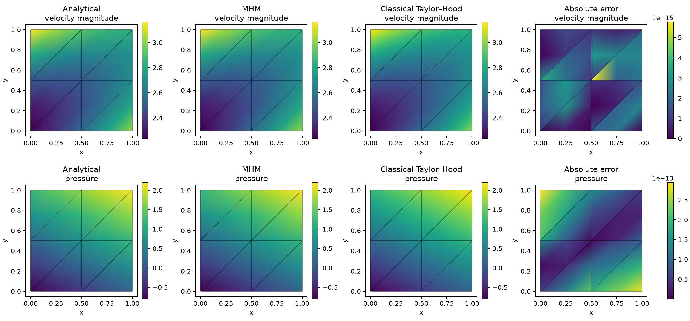
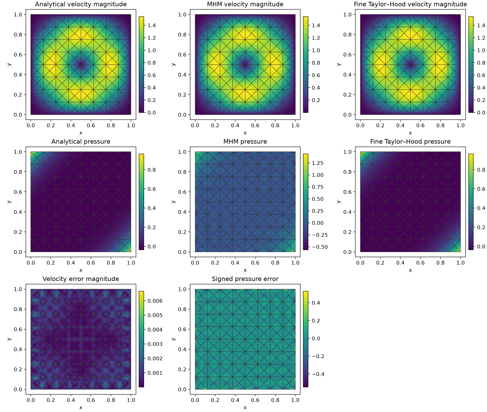
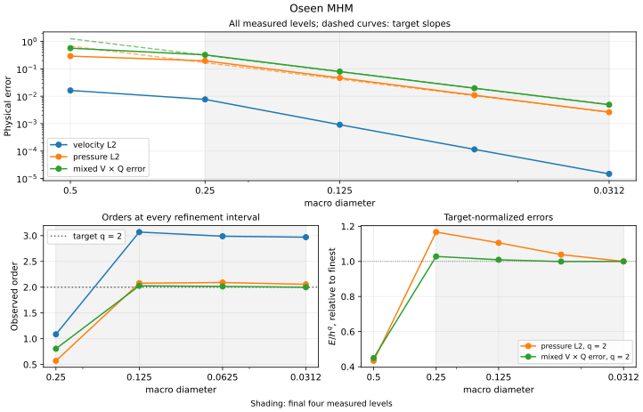

# Oseen MHM

Write a velocity–pressure local problem and its global interface equation with
UFL, then assemble, solve and recover the two physical fields. The convection
velocity is prescribed; the interface unknown is the half-advection
pseudotraction.

[Complete executable notebook](https://github.com/ipes-lncc/pymhm/blob/main/notebooks/flow/oseen_variational.ipynb) · [Download notebook](https://raw.githubusercontent.com/ipes-lncc/pymhm/main/notebooks/flow/oseen_variational.ipynb) · [Theory and space conditions](../../theory/flow.md)

Run the notebook in the locked `introduction` environment. It first verifies an
affine Taylor–Hood example, includes independently assembled classical controls,
and closes with the separately identified smooth stabilized convergence study.

## 1. Declare the physical problem

On the unit square, take viscosity and drag equal to one and convection
$\beta=(2,3)$. Choose the solution before assembling any operator:

$$
\begin{aligned}
-\Delta u+(\beta\cdot\nabla)u+u+\nabla p&=f,
&\nabla\cdot u&=0,\\
u_*&=(1-x+2y,-2-x+y),
&p_*&=x+2y-0.8,\\
f&=u_*+(5,3).
\end{aligned}
$$

The source follows independently from $\Delta u_*=0$,
$(\beta\cdot\nabla)u_*=(4,1)$ and $\nabla p_*=(1,2)$. Prescribe the exact velocity
on the exterior and the **global** pressure integral $0.7$.

```python
def exact_velocity(x):
    return np.column_stack((1-x[:, 0]+2*x[:, 1], -2-x[:, 0]+x[:, 1]))

def exact_pressure(x):
    return x[:, 0]+2*x[:, 1]-0.8
```

## 2. Associate meshes and a vector trace

Use Taylor–Hood P2 velocity/P1 pressure on each refined macrotriangle. The
vector trace has two components and P1 approximation on each macroface.

```python
macro = TriangleMesh.unit_square(2)
skeleton = SkeletonSpace(
    macro, tuple(FaceSpace.uniform(1) for _ in macro.faces), components=2,
)
hierarchy = MeshHierarchy(
    macro, tuple(macro.submesh(i, 2) for i in range(len(macro.cells))),
)
interface = bind_interface(skeleton, convention="normal")
```

The binding owns incident normal signs, face numbering and native coefficient
maps. These geometric details do not change the mathematical signs below.

## 3. Write momentum and incompressibility

For divergence-free constant convection, the skew form is

$$
\begin{aligned}
a_K((u,p),(v,q))={}&(\nabla u,\nabla v)_K+(u,v)_K\\
&+\tfrac12[(\beta\cdot\nabla u,v)_K-(u,\beta\cdot\nabla v)_K]\\
&-(p,\nabla\cdot v)_K-(q,\nabla\cdot u)_K.
\end{aligned}
$$

The notebook's `oseen_volume_forms` contains this form directly:

```python
u, p = ufl.TrialFunctions(W)
v, q = ufl.TestFunctions(W)
x = ufl.SpatialCoordinate(domain)
beta = ufl.as_vector((2.0, 3.0))
truth = ufl.as_vector((1-x[0]+2*x[1], -2-x[0]+x[1]))
force = truth+ufl.as_vector((5.0, 3.0))
dx = ufl.Measure("dx", domain=domain, metadata={"quadrature_degree": 8})
a = (
    ufl.inner(ufl.grad(u), ufl.grad(v))+ufl.inner(u, v)
    +0.5*(ufl.inner(ufl.grad(u)*beta, v)-ufl.inner(u, ufl.grad(v)*beta))
    -p*ufl.div(v)-q*ufl.div(u)
)*dx
L = ufl.inner(force, v)*dx
pressure_mean = q*dx
```

For variable convection, the effective reaction is
$\gamma-\tfrac12\nabla\cdot\beta$; its positivity hypothesis and the coefficient
derivatives must be declared. See [Araya et al. (2021)](https://doi.org/10.1007/s10444-020-09833-8).

The integration-by-parts boundary quantity is

$$
\lambda_K=(-\nabla u+pI+\tfrac12u\otimes\beta)n_K.
$$

It is distinct from the vector-Laplacian traction and from a physical velocity.
The local trial and global test pairings are independent declarations:

```python
binding = local.native_space(taylor_hood_element)
W = binding.space
u, p = ufl.TrialFunctions(W)
v, q = ufl.TestFunctions(W)
a, L, mean_form = oseen_volume_forms(W, binding.mesh)
b = local.trace_pairings(lambda phi, ds: ufl.inner(phi, v)*ds)
c = local.trace_pairings(lambda phi, ds: -ufl.inner(phi, u)*ds, axis="rows")
```

The notebook defines `taylor_hood_element` explicitly using a Basix mixed element.
No ready-made Oseen problem constructor is used.

## 4. Retain physical moments and declare named fields

Positive drag removes the translational nullspace. Two translations can still
be retained as **coarse modes**, with velocity-integral moments; they must not
be described as an exact kernel.

```python
_, velocity_dofs = W.sub(0).collapse()
translations = np.zeros((binding.size, 2))
translations[velocity_dofs] = np.tile(np.eye(2), (len(velocity_dofs)//2, 1))
local.field("velocity", binding, component=0)
local.field("pressure", binding, component=1)
return local.equations(
    a=a, L=L, b=b, c=c, coarse_basis=translations,
    moments=columns(v[0]*dx, v[1]*dx),
    metadata={"pressure_weights": compile_form(mean_form)},
)
```

Field declarations capture the executed basis. They allow physical evaluation
without exposing native degree-of-freedom permutations to the user.

## 5. State the global equation and pressure gauge

The global equation imposes interior velocity moments and the exterior velocity
moments with the sign chosen in `c`:

$$
-\sum_K\langle\mu_K,u_K\rangle_{\partial K}
=-\langle\mu,u_*\rangle_{\partial\Omega}.
$$

```python
def global_equation(context):
    boundary, _ = context.boundary_data(exact_velocity, order=6)
    return Equation(0, -context.trace_load(boundary))

problem = bind_problem(
    hierarchy, interface, local_oseen,
    global_equation=global_equation, retained=2,
)
system = assemble(problem)
weights = [record["pressure_weights"] for record in system.local_metadata]
gauge = system.mean_constraint(weights, 0.7)
solution = solve(system, constraints=(gauge,))
velocity = solution.field("velocity")
pressure = solution.field("pressure")
```

One global gauge integrates reconstructed pressure. A separate mean imposed in
every local pressure space would change these equations.

## 6. Compare independent classical fields

The notebook assembles the same displayed UFL volume forms directly in globally
conforming P2/P1 spaces on $8\times8$ and $16\times16$ meshes. It imposes strong
exterior velocity coefficients and the same pressure integral through
`MultiscaleProblem.from_global`, without multiscale condensation.

Independent physical-point checks give MHM velocity error $3.56\times10^{-15}$,
pressure error $2.26\times10^{-13}$ and pressure integral $0.7$ for this affine
control. These roundoff values verify polynomial reproduction and gauge
consistency; a polynomial patch has no meaningful fitted rate.



Every field panel includes the actual macro mesh. Incident reconstructions are
evaluated independently.

## 7. Finish with a smooth asymptotic refinement family

The notebook next defines the smooth refinement problem explicitly, assembles
its stabilized local and global equations, and plots the resulting fields. It
then reads the attributed refinement record, prints its SHA-256 digest and
computes consecutive rates. This second family uses **stabilized P3/P3 local
fields, vector P1 traces and a crisscross macro mesh**. Its local spaces and
operator differ from the affine Taylor–Hood control above.

For that rate family the independently differentiated data are

$$
\begin{aligned}
\psi&=-128x^2(1-x)^2y^2(1-y)^2,
&u_*&=(\partial_y\psi,-\partial_x\psi),\\
p_*&=(x-y)^6-\tfrac1{28},
&\beta&=(1,1)/\sqrt2,\quad\nu=\gamma=1.
\end{aligned}
$$

The equal-order local form adds the Oseen residual and its adjoint convection
sign, rather than using the Taylor–Hood form without stabilization:

$$
\begin{aligned}
R(u,p)&=-\nu\Delta u+(\nabla u)\beta+\gamma u+\nabla p,\\
R^*(v,q)&=-\nu\Delta v-(\nabla v)\beta+\gamma v+\nabla q,\\
a_K^{\rm US}&=a_K+\sum_\tau\kappa_\tau(\nabla\cdot u,\nabla\cdot v)_\tau
-\sum_\tau\delta_\tau(R(u,p),R^*(v,q))_\tau.
\end{aligned}
$$

Its load includes $-\sum_\tau\delta_\tau(f,R^*(v,q))_\tau$. With the computed
inverse constant $m_\tau$, define $d_\tau=4\nu/m_\tau$ and
$b_\tau=h_\tau\lVert\beta\rVert_\infty$:

$$
\delta_\tau=\frac{h_\tau^2}
{\max(\gamma h_\tau^2,d_\tau)+\max(d_\tau,b_\tau)},
\qquad\kappa_\tau=b_\tau\min(1,b_\tau/d_\tau).
$$

In the notebook, the source is differentiated symbolically from the physical
solution, before compiling a form. The same function declares the stabilized
local form and the unstabilized classical reference:

```python
x = ufl.SpatialCoordinate(domain)
psi = -128*x[0]**2*(1-x[0])**2*x[1]**2*(1-x[1])**2
truth = ufl.as_vector((psi.dx(1), -psi.dx(0)))
truth_pressure = (x[0]-x[1])**6-1/28
beta = ufl.as_vector((1/np.sqrt(2), 1/np.sqrt(2)))
force = (-ufl.div(ufl.grad(truth))+ufl.grad(truth)*beta
         +truth+ufl.grad(truth_pressure))
residual = -ufl.div(ufl.grad(u))+ufl.grad(u)*beta+u+ufl.grad(p)
adjoint = -ufl.div(ufl.grad(v))-ufl.grad(v)*beta+v+ufl.grad(q)
a += (kappa*ufl.div(u)*ufl.div(v)-delta*ufl.inner(residual, adjoint))*dx
L = (ufl.inner(force, v)-delta*ufl.inner(force, adjoint))*dx
```

The tutorial computes the required local inverse constant using the shared
finite-element tabulation and inverse-bound operations, then binds the displayed
$\delta_\tau$ and $\kappa_\tau$ as native coefficient values. It declares the
velocity and pressure fields, two retained velocity moments, negative velocity
jump pairing and one global zero-mean pressure gauge explicitly. With eight
macro grid subdivisions, its independently integrated velocity, pressure and
product-norm errors are $9.1431\times10^{-4}$, $4.6453\times10^{-2}$ and
$7.9393\times10^{-2}$. The original uncondensed local and global equations have
relative residual $1.36\times10^{-14}$; the reconstructed pressure mean is
within $7.3\times10^{-16}$ of zero.

For the independent classical reference, the notebook sets $\delta=\kappa=0$
and assembles the same physical UFL operator in globally conforming P2/P1
Taylor–Hood spaces, with strong zero exterior velocity and the same pressure
gauge. Its own analytical errors decrease on three global meshes:

| Global subdivisions | Velocity $L^2$ error | Pressure $L^2$ error | Product-norm error |
| --- | ---: | ---: | ---: |
| 16 | $6.7828\times10^{-4}$ | $3.1377\times10^{-3}$ | $8.3591\times10^{-2}$ |
| 32 | $8.4786\times10^{-5}$ | $3.0846\times10^{-4}$ | $2.1030\times10^{-2}$ |
| 64 | $1.0602\times10^{-5}$ | $4.6421\times10^{-5}$ | $5.2672\times10^{-3}$ |



The reference is a numerical approximation. The MHM panels retain independent
incident reconstructions and the actual crisscross macro mesh; the coarse
pressure visualization exposes its larger interface errors rather than smoothing
them away.

The direct literature comparison uses the product norm defined in
[Araya et al. (2021), Section 2.2](https://doi.org/10.1007/s10444-020-09833-8):

$$
\begin{aligned}
\lVert(e_u,e_p)\rVert_{V\times Q}^2
={}&d_\Omega^{-2}\lVert e_u\rVert_{L^2(\Omega)}^2
+\sum_K\lVert\nabla e_u\rVert_{L^2(K)}^2
+\lVert e_p\rVert_{L^2(\Omega)}^2.
\end{aligned}
$$

For face degree one, Section 5.1 reports order two in this norm. The same
observable is integrated here, with $d_\Omega=\sqrt2$ on the unit square.
The last three orders are $2.0268$, $2.0144$ and $1.9991$. Pressure has orders
$2.0778$, $2.0904$ and $2.0549$, consistent with that product-norm estimate.
The separately plotted velocity $L^2$ orders $3.0692$, $2.9885$ and $2.9697$
are **observed additional accuracy**; the cited Oseen product-norm result
does not by itself prove a third-order velocity $L^2$ estimate.

The comparison assumes constant positive viscosity, full Dirichlet velocity,
smooth data, a regular mesh family and positive effective reaction
$\gamma-\tfrac12\nabla\cdot\beta$. These conditions hold for this fixed
coefficient example. The stabilized P3/P3 local pair and vector P1 traces
are preserved throughout refinement. The
[theory page](../../theory/flow.md#space-compatibility-and-rates) explains the
coercivity and residual-test requirements; decreasing viscosity is a different
parameter study.



The notebook identifies the exact JSON acquisition and its source digest.
The [flow gallery](../../gallery/flow.md) links the other current Oseen studies.
This study qualifies the declared uniform mesh family; adaptive refinement
is evaluated in the separate gallery studies.

## References

- Rodolfo Araya, Cristian Cárcamo, Abner H. Poza and Frédéric Valentin (2021).
  *An adaptive multiscale hybrid-mixed method for the Oseen equations*.
  Advances in Computational Mathematics 47, article 15.
  [DOI: 10.1007/s10444-020-09833-8](https://doi.org/10.1007/s10444-020-09833-8).
