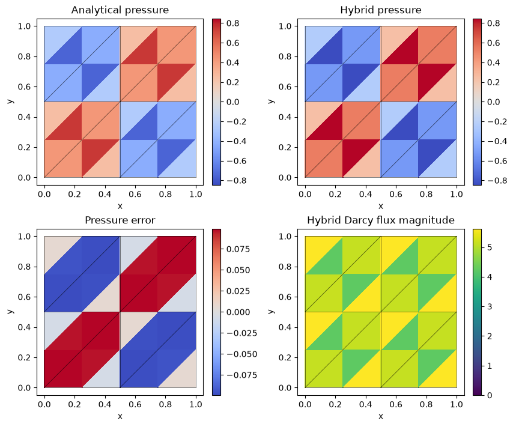
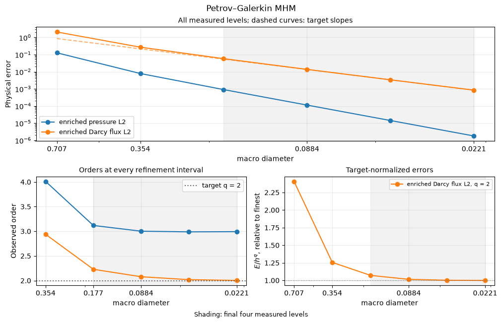
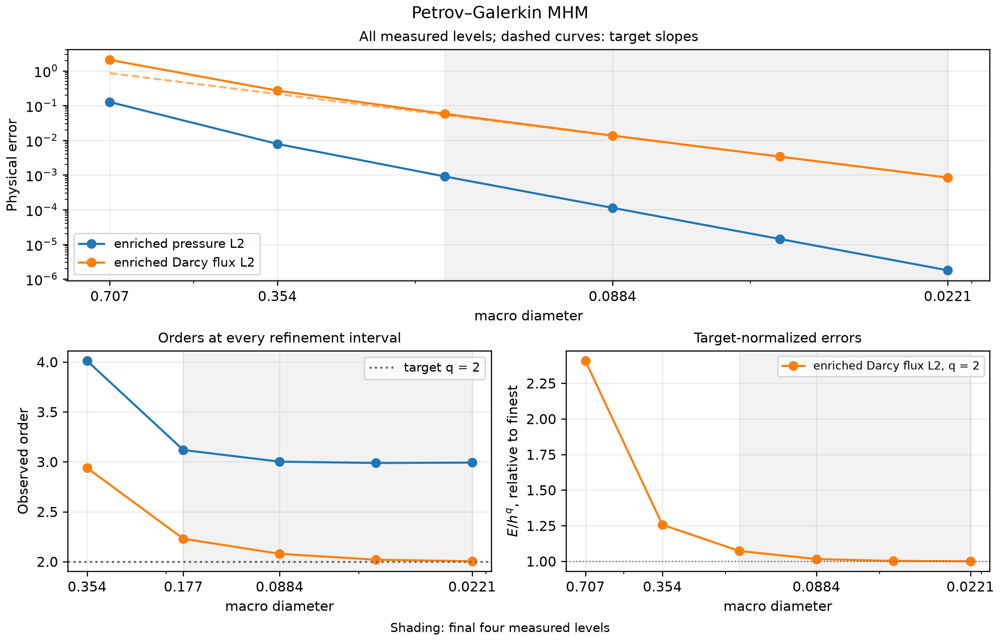

# Residual Petrov–Galerkin MHM

[Open the step-by-step notebook](https://github.com/ipes-lncc/pymhm/blob/main/notebooks/darcy/pgmhm_workflow.ipynb) · [Download notebook](https://raw.githubusercontent.com/ipes-lncc/pymhm/main/notebooks/darcy/pgmhm_workflow.ipynb) · [Theory and degree conditions](../../theory/alternatives.md)

We declare the primal local equations, add a user-written global residual form, and lift its boundary residual through the same local solver owner. The physical pressure is $p=\sin(2\pi x)\sin(2\pi y)$, with identity diffusion and independently derived source $8\pi^2p$. Exterior pressure is zero.

The construction follows [Fernando, Martins, Pereira and Valentin (2023)](https://doi.org/10.1007/s40314-023-02304-y). The trace multiplier of the base field differs from the enriched conservative normal flux. Neither volume gradient is automatically H(div)-conforming.


```python
import numpy as np
import matplotlib.pyplot as plt
import ufl
from pymhm import (
    Equation, FaceSpace, LocalContext, MeshHierarchy, SkeletonSpace, TriangleMesh,
    assemble, bind_interface, bind_problem, columns, solve,
)
from threadpoolctl import threadpool_limits


def exact_pressure(points: np.ndarray) -> np.ndarray:
    """Analytical pressure; it vanishes on every exterior edge."""
    return np.sin(2 * np.pi * points[:, 0]) * np.sin(2 * np.pi * points[:, 1])


def exact_gradient(points: np.ndarray) -> np.ndarray:
    """Independently differentiated physical pressure gradient."""
    x, y = 2 * np.pi * points.T
    return 2 * np.pi * np.column_stack((np.cos(x) * np.sin(y), np.sin(x) * np.cos(y)))


def source(points: np.ndarray) -> np.ndarray:
    """Negative Laplacian computed independently of the discrete operator."""
    return 8 * np.pi**2 * exact_pressure(points)
from scipy import sparse
from pymhm import with_global_equation
from pymhm.fem.scalar.triangle import scalar_operators, trace_coupling
from pymhm.fem.traces.jump import face_jump_form
from pymhm.postprocessing.nodal import nodal_field
from pymhm.postprocessing.fields import DiscreteField
from pymhm.core.reconstruction import reconstruct_local
from pymhm.postprocessing.solutions import PGMHMSolution
```

## 1. Define spaces

Choose trace degree one and local degree three. In two dimensions this meets the energy-estimate restriction $k\ge\ell+d$ and $\ell\ge1$. Select $\alpha=0.1$ and certified diffusion lower bound one.


```python
macro = TriangleMesh.unit_square(2)
local_meshes = tuple(macro.submesh(cell, 2) for cell in range(len(macro.cells)))
hierarchy = MeshHierarchy(macro, local_meshes)
skeleton = SkeletonSpace(macro, tuple(FaceSpace.uniform(1) for _ in macro.faces))
interface = bind_interface(skeleton, convention="normal")
degree, alpha, lower = 3, 0.1, 1.0
```

## 2. Define the primal volume and independent trace forms


$$
A_T(p,v)=(\nabla p,\nabla v)_T,\qquad
B_T(\lambda,v)=\langle\lambda,v\rangle_{\partial T},\qquad
C_T(p,\mu)=-\langle p,\mu\rangle_{\partial T}.
$$


For reference, the volume integrand is `ufl.inner(ufl.grad(p), ufl.grad(v)) * dx`. Here the shared Basix `scalar_operators` operation integrates this declared volume form in the portable nodal basis used by the common jump operator. It supplies element tabulation and quadrature; it does not select the multiscale method. The block signs, kernel, physical moment and global equation below are explicit. `trace_coupling` already applies canonical incidence, hence `coordinates="global"`.


```python
def local_equations(local: LocalContext):
    """Declare volume diffusion, physical mean and signed scalar trace forms."""
    fine = local.mesh
    A, mass, force = scalar_operators(fine, degree, diffusion=1.0, source=source, order=12)
    B = trace_coupling(macro, local.cell, fine, skeleton, degree)
    constant = np.ones((A.shape[0], 1))
    field = nodal_field("pressure", fine, degree)
    local.field("pressure", evaluator=field.evaluator,
                gradient_evaluator=field.gradient_evaluator, basis_id=field.basis_id)
    return local.equations(a=A, L=force, b=B, c=-B.T,
                          kernel=constant, moments=mass @ constant,
                          coordinates="global", metadata=(fine,))


def global_equation(global_context):
    """Homogeneous weak Dirichlet pressure in the independent trace test."""
    boundary, _ = global_context.boundary_data(0.0, order=8)
    return Equation(0, global_context.trace_load(-boundary))


problem = bind_problem(hierarchy, interface, local_equations,
                       global_equation=global_equation, retained=1)
with threadpool_limits(1):
    base_system = assemble(problem)
```

## 3. Write the global residual jump equation

Let $J_F z+j_F^f$ be the one-sided pressure jump reconstructed from reduced coordinates $z$, and set $\tau_F=\alpha/(2H_F)$. The additional global terms are


$$
\begin{aligned}
D_{\mathrm{jump}}&=\sum_F J_F^T W_F\tau_FJ_F,\\
g_{\mathrm{jump}}&=\sum_FJ_F^TW_F\tau_F(p_D-j_F^f).
\end{aligned}
$$


`face_jump_form` supplies executed response maps, common quadrature and one-sided trace evaluation. The multiplication and global accumulation below implement the two displayed forms. Coincident global entries are summed by sparse COO assembly.


```python
penalties = tuple(face_jump_form(base_system, skeleton, face, degree, 12,
                                 alpha, lower, 0.0)
                  for face in range(len(macro.faces)))
rows, columns_, entries = [], [], []
load = np.zeros_like(base_system.rhs)
for data in penalties:
    weighted = data.weights * data.coefficient
    block = data.jump.T @ (weighted[:, None] * data.jump)
    forcing = data.jump.T @ (weighted * (data.prescribed - data.source_jump))
    rows.extend(np.repeat(data.indices, len(data.indices)))
    columns_.extend(np.tile(data.indices, len(data.indices)))
    entries.extend(block.ravel())
    np.add.at(load, data.indices, forcing)
D_jump = sparse.coo_matrix((entries, (rows, columns_)),
                          shape=base_system.matrix.shape).tocsc()
system = with_global_equation(base_system, Equation(D_jump, load))
with threadpool_limits(1):
    coefficients = solve(system)
```

## 4. Define and solve the enrichment problem

The normal correction is $\delta\lambda_F=-\tau_F([p]-p_D)$. Its local boundary load is assembled from the declared one-sided pairing, and the correction has zero physical volume mean:


$$
A_T\delta p_T=-B_T\delta\lambda_T,\qquad \int_T\delta p_T=0.
$$


The same `reconstruct_local` owner solves this additional local load. No factorization or basis algorithm is copied into the notebook. The final `PGMHMSolution` is a physical data record for norms and conservation; it does not construct or choose the problem.


```python
coordinates = np.r_[coefficients.trace, *coefficients.coarse]
extra = [np.zeros(len(response.problem.load)) for response in system.responses]
for data in penalties:
    jump = data.jump @ coordinates[data.indices] + data.source_jump - data.prescribed
    normal_correction = -data.coefficient * jump
    for cell, sign, evaluation in data.sides:
        extra[cell] += sign * (evaluation.T @ (data.weights * normal_correction))
enriched = []
for response, base, boundary_load in zip(system.responses, coefficients.fields, extra, strict=True):
    local_problem = response.problem.with_load(-boundary_load)
    correction = reconstruct_local(local_problem, np.zeros(local_problem.coupling.shape[1]),
                                   np.zeros(local_problem.coarse_basis.shape[1]))
    enriched.append(base + correction)
solution = PGMHMSolution(skeleton, local_meshes, coefficients.fields, tuple(enriched),
                        coefficients, system, 1.0, source, degree, 12,
                        alpha, lower, penalties, tuple(extra))
pressure_fields = tuple(DiscreteField(nodal_field("pressure", fine, degree), values)
                        for fine, values in zip(local_meshes, enriched, strict=True))
print({"pressure_L2": solution.l2_error(exact_pressure, order=12, enriched=True),
       "Darcy_flux_L2": solution.flux_l2_error(lambda x: -exact_gradient(x), order=12, enriched=True),
       "enriched_macro_balance": float(np.max(abs(solution.conservation_residuals())))})
assert np.max(abs(solution.conservation_residuals())) < 1e-10
```

```text
{'pressure_L2': 0.12576942534393837, 'Darcy_flux_L2': 1.8288671828046679, 'enriched_macro_balance': 3.497202527569243e-15}
```

## 5. Plot the enriched physical pressure

The macro mesh is shown on every analytical, numerical and error panel.


```python
fig, axes = plt.subplots(2, 2, figsize=(8.5, 7), layout="constrained")
all_exact, all_values, panels = [], [], []
for fine, field in zip(local_meshes, pressure_fields, strict=True):
    points = fine.points[fine.cells].mean(axis=1)
    exact, values = exact_pressure(points), field.evaluate(points)
    flux_magnitude = np.linalg.norm(-field.gradient(points), axis=1)
    panels.append((fine, exact, values, flux_magnitude))
    all_exact.extend(exact)
    all_values.extend(values)
common = max(np.max(np.abs(all_exact)), np.max(np.abs(all_values)))
error_max = max(np.max(abs(values - exact)) for _, exact, values, _ in panels)
flux_max = max(np.max(flux) for _, _, _, flux in panels)
titles = ("Analytical pressure", "Hybrid pressure", "Pressure error", "Hybrid Darcy flux magnitude")
for index, (ax, title) in enumerate(zip(axes.flat, titles, strict=True)):
    for fine, exact, values, flux in panels:
        value = (exact, values, values - exact, flux)[index]
        limit = (common, common, error_max, flux_max)[index]
        artist = ax.tripcolor(*fine.points.T, fine.cells, facecolors=value,
                             vmin=0.0 if index == 3 else -limit,
                             vmax=limit, cmap="viridis" if index == 3 else "coolwarm")
    for edge in macro.faces:
        ax.plot(*macro.points[edge].T, color="black", lw=0.5, alpha=0.7)
    ax.set(title=title, xlabel="x", ylabel="y", aspect="equal")
    fig.colorbar(artist, ax=ax)
plt.show()
```


[](../../assets/tutorials/methods/pgmhm-field-00.png)


## Independently refined classical primal Galerkin baseline

The classical baseline uses one globally conforming P2 space on independent 16×16, 32×32 and 64×64 triangular grids, with the same physical coefficient, source and boundary values:


$$
(\nabla p_h^{\mathrm{CG}},\nabla v_h)=(f,v_h),\qquad
p_h^{\mathrm{CG}}\big\vert_{\partial\Omega}=p_D.
$$


The shared volume operator integrates this already stated form. The explicit essential lifting $A_{ff}p_f=f_f-A_{fb}p_D$ selects its classical boundary values. Check this reference's own errors before comparing fields. The multiscale solve above retains its simpler macro mesh and separate local spaces; it does not use this refined global grid. An exactly representable polynomial has roundoff-level classical errors on all three grids.


```python
from threadpoolctl import threadpool_limits
from pymhm.fem.scalar.triangle import scalar_operators, nodal_space, tabulate
from pymhm.fem.scalar.operators import triangle_quadrature
from pymhm.linalg.linear import solve_linear

classical_rows = []
bary, weights = triangle_quadrature(12)
for resolution in (16, 32, 64):
    reference_mesh = TriangleMesh.unit_square(resolution)
    A, _, forcing = scalar_operators(reference_mesh, 2, diffusion=1.0, source=source, order=12)
    dofs, nodes = nodal_space(reference_mesh, 2)
    boundary = np.flatnonzero(np.any(np.isclose(nodes, 0.0) | np.isclose(nodes, 1.0), axis=1))
    free = np.setdiff1d(np.arange(len(nodes)), boundary)
    reference_pressure = np.zeros(len(nodes))
    reference_pressure[boundary] = exact_pressure(nodes[boundary])
    rhs = forcing[free] - A[free][:, boundary] @ reference_pressure[boundary]
    with threadpool_limits(1):
        reference_pressure[free] = solve_linear(A[free][:, free], rhs)
    _, _, basis, gradient, _ = tabulate(reference_mesh, 2, bary)
    points = np.einsum("qi,tia->tqa", bary, reference_mesh.points[reference_mesh.cells])
    difference = reference_pressure[dofs] @ basis.T - exact_pressure(points.reshape(-1, 2)).reshape(points.shape[:2])
    error = float(np.sqrt(reference_mesh.areas @ (difference**2 @ weights)))
    classical_rows.append({"resolution": resolution, "elements": len(reference_mesh.cells),
                           "pressure_L2": error})
for row in classical_rows:
    print(row)
# Polynomial patches can be exactly represented, in which case all levels are
# at roundoff. Otherwise verify the classical reference's own refinement.
assert (max(row["pressure_L2"] for row in classical_rows) < 1e-10
        or all(b["pressure_L2"] < a["pressure_L2"] for a, b in zip(classical_rows, classical_rows[1:])))
centers = reference_mesh.points[reference_mesh.cells].mean(axis=1)
_, _, center_basis, center_gradient, _ = tabulate(reference_mesh, 2, np.full((1, 3), 1/3))
reference_values = (reference_pressure[dofs] @ center_basis.T)[:, 0]
reference_flux = -np.einsum("ti,tqia->tqa", reference_pressure[dofs], center_gradient)[:, 0]
fig, axes = plt.subplots(1, 2, figsize=(9, 4), layout="constrained")
for ax, values, title in zip(axes, (reference_values, np.linalg.norm(reference_flux, axis=1)),
                             ("Fine classical P2 pressure", "Fine classical Darcy flux magnitude"), strict=True):
    artist = ax.tripcolor(*reference_mesh.points.T, reference_mesh.cells, facecolors=values, cmap="viridis")
    for edge in macro.faces:
        ax.plot(*macro.points[edge].T, color="black", lw=0.5, alpha=0.7)
    ax.set(title=title, xlabel="x", ylabel="y", aspect="equal")
    fig.colorbar(artist, ax=ax)
plt.show()
```

```text
{'resolution': 16, 'elements': 512, 'pressure_L2': 0.0005479034106938733}
{'resolution': 32, 'elements': 2048, 'pressure_L2': 6.873255317566801e-05}
{'resolution': 64, 'elements': 8192, 'pressure_L2': 8.600387223616975e-06}
```


[](../../assets/tutorials/methods/pgmhm-field-01.png)


## 6. Reach the smooth enriched-flux regime

The smooth unit-square sequence uses the same declared residual-jump equations and enrichment, with $p=\sin(2\pi x)\sin(2\pi y)$, independently derived $f=8\pi^2p$, identity permeability and homogeneous exterior pressure. Its spaces are P3 local pressure on one triangle, P1 traces and $\alpha=0.1$, on all macro resolutions $n=2,4,8,16,32,64$.

The energy estimates in section 5 of [Fernando et al. (2023)](https://doi.org/10.1007/s40314-023-02304-y) separate $h^k$ and $H^{\ell+1}$, with $\ell\geq1$ and $k\geq\ell+d$. Here $\ell=1$, $k=3$, $d=2$; the second-order term governs the enriched physical flux. Pressure order three is observed. The reconstructed vector field is the enriched volume gradient, and does not become a globally H(div)-conforming flux merely because macro balance holds.

The acquisition checks the original enriched local nodal equations, the global jump equation and the separate macro balance. Independent order-10 and order-12 quadratures control the full pressure and physical vector-flux errors. Read all six levels below, including their coarse behavior.

### Recompute every measured order

For successive physical errors $E_{i-1},E_i$ at the actual refinement sizes, compute


$$
r_i=\frac{\log(E_{i-1}/E_i)}{\log(h_{i-1}/h_i)}.
$$


The first code lines read one attributed numerical record. They preserve every level and display the complete error/order table. The plotting helper only measures and plots these errors: it constructs no local or global PDE. Targets below are declared from the stated hypotheses, rather than fitted from the data. The final four measured levels give three consecutive orders and a fitted terminal slope. For each declared target $q$, a nearly constant $E/h^q$ provides a second view of the asymptotic regime.


```python
import json
from IPython.display import Markdown, display
from examples.tutorial_convergence import refinement_series, asymptotic_summary, plot_method_series
refinement_record = ROOT / 'examples/results/tutorial-methods/pgmhm-current.json'
refinement_data = json.loads(refinement_record.read_text(encoding='utf-8'))
refinement_rows = refinement_data['rows']
refinement_error_keys = {'enriched pressure L2': 'pressure_l2', 'enriched Darcy flux L2': 'flux_l2'}
refinement_targets = {'enriched Darcy flux L2': 2.0}
refinement_rows = sorted(refinement_rows, key=lambda refinement_row: refinement_row['macro_diameter'], reverse=True)
refinement_sizes = np.asarray([refinement_row['macro_diameter'] for refinement_row in refinement_rows])
refinement_field_errors = {refinement_field: np.asarray([refinement_row[refinement_key] for refinement_row in refinement_rows]) for refinement_field, refinement_key in refinement_error_keys.items()}
refinement_orders = {refinement_field: np.log(refinement_values[:-1] / refinement_values[1:]) / np.log(refinement_sizes[:-1] / refinement_sizes[1:]) for refinement_field, refinement_values in refinement_field_errors.items()}
refinement_header = ['Refinement size'] + [refinement_column for refinement_field in refinement_error_keys for refinement_column in (refinement_field, 'Order')]
refinement_lines = [' | '.join(refinement_header), ' | '.join(['---'] * len(refinement_header))]
for refinement_index, refinement_size in enumerate(refinement_sizes):
    refinement_values = [f'{refinement_size:.6g}']
    for refinement_field in refinement_error_keys:
        refinement_values.extend([f'{refinement_field_errors[refinement_field][refinement_index]:.6e}', '—' if refinement_index == 0 else f'{refinement_orders[refinement_field][refinement_index - 1]:.3f}'])
    refinement_lines.append(' | '.join(refinement_values))
display(Markdown('\n'.join(refinement_lines)))
refinement_series_data = refinement_series(refinement_record, refinement_rows, 'macro_diameter', refinement_error_keys, refinement_targets, method='pgmhm', spaces='P3/r1 locals; P1 trace; residual enrichment; alpha=0.1', rate_provenance='Fernando et al. (2023), section 5 energy estimates: ell>=1, k>=ell+d; pressure order three observed', refinement='macro diameter', root=ROOT)
print({'record': refinement_series_data['record'], 'sha256': refinement_series_data['sha256']})
for refinement_field, refinement_summary in asymptotic_summary(refinement_series_data).items():
    print(refinement_field, {'last_three_orders': [round(refinement_order, 3) for refinement_order in refinement_summary['orders']], 'fitted_order': round(refinement_summary['fitted_order'], 3), 'target': refinement_summary['target'], 'normalized_amplitude_ratio': refinement_summary.get('amplitude_ratio')})
plot_method_series(refinement_series_data)
plt.show()

```


Refinement size | enriched pressure L2 | Order | enriched Darcy flux L2 | Order
--- | --- | --- | --- | ---
0.707107 | 1.264513e-01 | — | 2.069721e+00 | —
0.353553 | 7.844525e-03 | 4.011 | 2.700667e-01 | 2.938
0.176777 | 9.037788e-04 | 3.118 | 5.761044e-02 | 2.229
0.0883883 | 1.128686e-04 | 3.001 | 1.364393e-02 | 2.078
0.0441942 | 1.422729e-05 | 2.988 | 3.366902e-03 | 2.019
0.0220971 | 1.788673e-06 | 2.992 | 8.397340e-04 | 2.003


```text
{'record': 'examples/results/tutorial-methods/pgmhm-current.json', 'sha256': 'c863231e79d60fe867fb492c7869396b5cb74eed001564d49fef634454ace47f'}
enriched pressure L2 {'last_three_orders': [3.001, 2.988, 2.992], 'fitted_order': 2.993, 'target': None, 'normalized_amplitude_ratio': None}
enriched Darcy flux L2 {'last_three_orders': [2.078, 2.019, 2.003], 'fitted_order': 2.032, 'target': 2.0, 'normalized_amplitude_ratio': 1.0719621019646848}
```


[](../../assets/tutorials/methods/pgmhm-field-02.png)


The upper panel preserves all coarse and fine measurements. Dashed lines show declared target powers anchored at the finest measured error. The shaded interval always contains the final four levels; it does not select points to improve a fitted slope. Read the consecutive orders together with the target-normalized errors and the stated quadrature/local-equation controls. A slope alone does not establish the hypotheses of an error estimate.

## Reproduce this workflow

Open or download the notebook linked above. Its first cell acquires a checksum-verified companion containing inspectable support files and the individual convergence record. It then runs every numbered variational assembly and solve step. The final section reads the attributed refinement measurements and recomputes their orders; it does not rerun their full PDE acquisition.

Install the notebook and visualization extras, and use the [installation guide](../../installation.md) for any native UFL/DOLFINx requirements. From this source checkout, open the step-by-step workflow in its locked environment:

```bash
pixi run --locked -e introduction jupyter lab notebooks/darcy/pgmhm_workflow.ipynb
```

The displayed outputs come from all 9 executed code cells in the locked `introduction` environment, with no skipped cells or error outputs. The source SHA256 is `2e8020c6eb7a34a85b6451a6b70504f146ba6f82f655ff38837f23b8706259d1`; the executed notebook SHA256 is `04f9bd204bda2f1a92a89863bc579a26ffc00c61403a0109f9c533ef91faa538`. The field, classical-reference and convergence plots are embedded outputs of that same execution.

## Resolve the terminal energy regime

The convergence study keeps the same sinusoidal problem and explicitly
declared jump/enrichment forms as the tutorial. Fix $\ell=1$, $k=3$,
single-triangle local meshes and $\alpha=0.1$; refine the macro mesh through
$n=2,4,8,16,32,64$. The degree condition $k\ge\ell+d$ holds in two dimensions,
and $\ell\ge1$. The theorem requires sufficiently small stabilization, without
supplying a universal admissible numerical threshold.

The energy estimates in section 5 of
[Fernando, Martins, Pereira and Valentin (2023)](https://doi.org/10.1007/s40314-023-02304-y)
retain both local and skeletal approximation terms:

$$
\lVert p-\widetilde p_{Hh}\rVert_V
\le C\bigl(
 h^k\lvert p\rvert_{H^{k+1}(\mathcal T_H)}
 +H^{\ell+1}\lvert K\nabla p\rvert_{H^{\ell+1}(\mathcal T_H)}
\bigr).
$$

For $h=H$, the third-order local contribution decreases faster than the
second-order skeletal term. The new $n=64$ level makes the final three
physical-flux intervals visible together. The plotted observable is
$-K\nabla\widetilde p_{Hh}$ after the explicitly defined enrichment;
its macro balance is checked separately. The raw gradient is not claimed
to be a globally H(div)-conforming flux. The measured third-order pressure
is distinguished from the proved second-order energy target.

## Smooth refinement and the asymptotic regime

This independent qualification uses **P3/r1 locals; P1 trace; residual enrichment; alpha=0.1** and refines the **macro diameter**. Its geometry, data and compatibility conditions are stated above. Its smooth rates do not transfer to a different material, unresolved local solve or singular physical domain. All coarse and fine measurements are retained. Successive orders use the actual refinement sizes and independently integrated physical errors:

$$
r_i=\frac{\log(E_{i-1}/E_i)}{\log(h_{i-1}/h_i)}.
$$

The terminal window always contains the **final four measured levels** and their three intervals. The fitted order uses those four points. For each justified target $q$, the amplitude ratio is the maximum divided by the minimum of $E/h^q$ in the same window; values near one show its stabilization. A pressure order labeled observed is not substituted for a proved energy estimate.

| Physical observable | Target $q$ | Final three orders | Fitted order | Amplitude ratio |
| --- | ---: | --- | ---: | ---: |
| enriched pressure L2 | observed | 3.001 / 2.988 / 2.992 | 2.993 | — |
| enriched Darcy flux L2 | 2 | 2.078 / 2.019 / 2.003 | 2.032 | 1.072 |



Download the figure as [SVG](../../assets/tutorials/methods/pgmhm-convergence.svg) or [PDF](../../assets/tutorials/methods/pgmhm-convergence.pdf). Shading covers the same final four levels in every panel; dashed curves are target powers anchored to the finest measured error.

### Complete numerical sequence

| Refinement size | enriched pressure L2 | Order | enriched Darcy flux L2 | Order |
| ---: | ---: | ---: | ---: | ---: |
| 0.707107 | 1.264513e-01 | — | 2.069721e+00 | — |
| 0.353553 | 7.844525e-03 | 4.011 | 2.700667e-01 | 2.938 |
| 0.176777 | 9.037788e-04 | 3.118 | 5.761044e-02 | 2.229 |
| 0.0883883 | 1.128686e-04 | 3.001 | 1.364393e-02 | 2.078 |
| 0.0441942 | 1.422729e-05 | 2.988 | 3.366902e-03 | 2.019 |
| 0.0220971 | 1.788673e-06 | 2.992 | 8.397340e-04 | 2.003 |

The current acquisition compares full physical norms at error quadrature orders 10 and 12; the largest relative difference over all levels and fields is `6.487e-10`. It also checks the original method equations in their declared coefficient coordinates, retaining global compatibility, local reconstruction and physical field errors as separate quantities. Its source closure is unchanged during execution. The norm-only record contains no persisted coefficient vector.

### Local Galerkin sensitivity at fixed macro resolution

Hold $n=8$, the physical data and all trace spaces fixed, and double only the local subdivisions from 1 to 2. Pairwise differences are integrated on the nested finer partition using the executed coefficient bases. Discontinuous pressure and independent interface values remain separate. Both solutions are also compared directly with the analytical fields:

| Field | Coarse error | Refined error | Field difference | Difference / coarse error |
| --- | ---: | ---: | ---: | ---: |
| pressure L2 | 9.037788e-04 | 9.732966e-04 | 3.316190e-04 | 3.669e-01 |
| physical Darcy flux L2 | 5.761044e-02 | 6.214497e-02 | 3.480406e-02 | 6.041e-01 |

At this coarse macro resolution, local refinement changes the enriched fields substantially and slightly increases both analytical errors. The table preserves that nonmonotonic result: local refinement alone does not guarantee monotonic pressure or volume-flux error for this jump-penalized formulation. The primary macro study uses its stated r1 family throughout, refining $h$ and $H$ together; its terminal order is compared with the full $h^3+H^2$ energy estimate.

The full physical-error norms agree at quadrature orders 10 and 12, with maximum relative change `1.066e-14`. For the two-grid sensitivity, the change in the integrated field difference divided by the coarse analytical error is `3.479e-15`. This scale assesses the local contribution to that physical error and remains meaningful when the two fields differ only at roundoff. The raw differences at both quadrature orders and their unscaled relative changes remain in the [local-control record](https://github.com/ipes-lncc/pymhm/blob/main/examples/results/tutorial-methods/scalar-local-controls-current.json) (SHA256 `8933c2e8c4f68a626276c4a0fc8e1b06e14334f8f8c413a2649137de27fe2350`). Original equations and reconstruction constraints retain their separate unchanged checks.

Fernando et al. (2023), section 5 energy estimates: ell>=1, k>=ell+d; pressure order three observed. The [source numerical record](https://github.com/ipes-lncc/pymhm/blob/main/examples/results/tutorial-methods/pgmhm-current.json) has SHA256 `c863231e79d60fe867fb492c7869396b5cb74eed001564d49fef634454ace47f` and retains its execution attribution. The step-by-step notebook linked at the top now reads this individual record, displays this complete sequence and recomputes every order. The [shared rate notebook](https://github.com/ipes-lncc/pymhm/blob/main/notebooks/convergence/method_rates.ipynb) compares methods. Reading these measurements does not execute the underlying PDE acquisition.

## References for this method

- Honório Fernando, Larissa Martins, Weslley Pereira, and Frédéric Valentin (2023). *A Petrov–Galerkin multiscale hybrid-mixed method for the Darcy equation on polytopes*. Computational and Applied Mathematics 42, article 173. [DOI: 10.1007/s40314-023-02304-y](https://doi.org/10.1007/s40314-023-02304-y).
