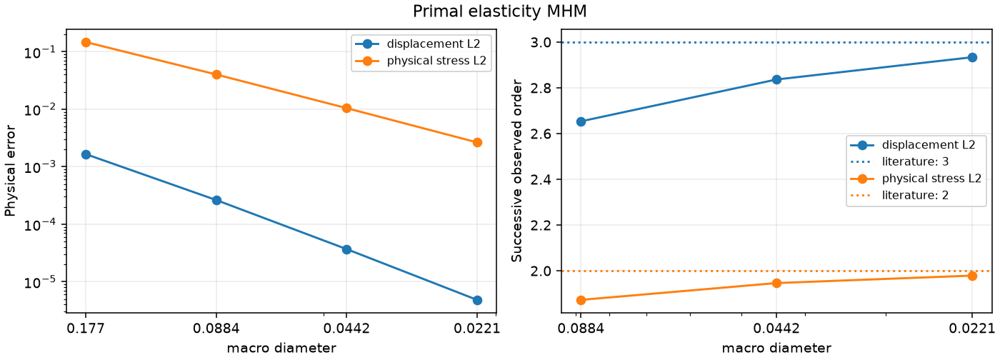

# Primal elasticity MHM

Follow **meshes → local equations → global equations → assemble → solve → physical fields**. We prescribe horizontal extension of a square containing a smooth oscillatory elastic material. The fine conforming reference is refined independently; it is not an exact solution.

[Executable notebook](https://github.com/ipes-lncc/pymhm/blob/main/notebooks/introduction/multiscale_elasticity.ipynb) · [Theory and degree conditions](../../theory/elasticity.md)

## 1. Define material, loading and scales


On the unit square, impose a one-percent horizontal extension on the whole exterior, with no body force:

$$
-\nabla\cdot\sigma=0,\qquad
\sigma=2\mu\varepsilon(\boldsymbol u)+\lambda\operatorname{div}(\boldsymbol u)I,
\qquad\boldsymbol u_D=(0.01x,0).
$$

Here $\varepsilon(\boldsymbol u)=(\nabla\boldsymbol u+\nabla\boldsymbol u^T)/2$. Use a smooth material with short wavelength and Lamé-modulus contrast $e^3\simeq20.1$:

$$
\lambda(x,y)=\mu(x,y)=\exp\!\left(1.5\sin(16\pi x)\sin(16\pi y)\right).
$$

The material wavelength is $1/8$. Taking $\lambda=\mu$ gives Poisson ratio $1/4$ in plane strain, so this case isolates multiscale heterogeneity rather than near-incompressibility. The stiffness is uniformly positive on symmetric strains. Both methods solve the same tensor, domain and boundary values.
```python
import numpy as np
import ufl
from pymhm import Equation, LocalEquations, MeshHierarchy, LocalContext, assemble, columns, bind_interface, bind_problem
from pymhm.meshes.triangle import TriangleMesh
from pymhm.fem.scalar.triangle import nodal_space
from pymhm.fem.scalar.operators import boundary_data
from pymhm.fem.traces.interval import FaceSpace, SkeletonSpace
from pymhm.execution.cpu import ExecutionConfig
from numpy.typing import NDArray
Array = NDArray[np.float64]

def micro_modulus(points: Array) -> Array:
    """Return smooth plane-strain Lamé values in [exp(-1.5),exp(1.5)], wavelength 1/8.

    Both lambda and mu equal this value, hence Poisson ratio is 1/4 and
    heterogeneity is separated from near-incompressibility and locking.
    """
    return np.exp(1.5 * np.sin(16 * np.pi * points[:, 0]) * np.sin(16 * np.pi * points[:, 1]))


def extension_boundary(points: Array) -> Array:
    """Prescribe a one-percent horizontal extension, with zero vertical displacement."""
    return np.column_stack((0.01 * points[:, 0], np.zeros(len(points))))
```

```python
macro = TriangleMesh.unit_square(4)
local_degree, local_refinement, trace_segments = 3, 16, 4
skeleton = SkeletonSpace(
    macro, tuple(FaceSpace.uniform(1, trace_segments) for _ in macro.faces), components=2
)
print(
    {
        "macro_triangles": len(macro.cells),
        "material_wavelength": 1 / 8,
        "material_contrast": float(np.exp(3.0)),
        "local_degree": local_degree,
        "local_refinement": local_refinement,
        "trace_degree": 1,
        "trace_segments": trace_segments,
    }
)
```

## 2. Identify the kernel before solving


Integration by parts yields

$$
\int_T \left[2\mu\varepsilon(\boldsymbol u):\varepsilon(\boldsymbol v)
+\lambda\operatorname{div}\boldsymbol u\operatorname{div}\boldsymbol v\right]
-\langle\sigma\boldsymbol n_T,\boldsymbol v\rangle_{\partial T}=0.
$$

Declare the skeletal multiplier $\boldsymbol\lambda=-\sigma\boldsymbol n_F$: it is **negative physical Cauchy traction** in the unique macroface orientation. Thus the local equation is $A_T\boldsymbol u+B_T\boldsymbol\lambda=0$, with the signed trace map $B_T$.

The local energy has three exact rigid modes: translations $(1,0)$ and $(0,1)$, and centered rotation $(-(y-y_T),x-x_T)$. Their physical $L^2$ moments select a unique response in the complement, while three retained coordinates represent the rigid component. We declare these modes, rather than infer them from a numerically rotated nullspace.

The trace contains the restrictions of rigid motions: degree one. The local degree is three. [Harder, Madureira and Valentin (2016), Lemma 6.6](https://doi.org/10.1051/m2an/2015046) give the sufficient rule $k\ge\ell+2$ for odd-degree traces on a single triangular local element. Our refined and segmented spaces differ from that single-element setting, so the rule alone is not their stability theorem. Segments align with the fine boundary and each covers four fine edges. We additionally check the rank of the actual trace pairing; an algebraic residual alone would not establish compatibility.

| Weak-form term | Visible code |
| --- | --- |
| $2\mu\varepsilon(u):\varepsilon(v)+\lambda\operatorname{div}u\operatorname{div}v$ | UFL expression `a` |
| $\langle s_{TF}\lambda,v\rangle$ | `local.trace_pairings(lambda phi, ds: inner(phi,v)*ds)` |
| Rigid kernel | `kernel` |
| Physical rigid moments | `columns` of UFL linear forms |
| Global displacement continuity | independent UFL pairing `-inner(phi,u)*ds`, with `axis="rows"` |
```python
def rigid_modes(points: Array, center: Array) -> Array:
    """Return two translations and centered counterclockwise rotation, shape (n,2,3)."""
    modes = np.zeros((len(points), 2, 3))
    modes[:, :, :2] = np.eye(2)
    modes[:, 0, 2] = -(points[:, 1] - center[1])
    modes[:, 1, 2] = points[:, 0] - center[0]
    return modes
```

## 3. Translate each weak term into UFL

`local.native_space` binds the Basix element to this macrocell's fine mesh. The field declaration records the actual coefficient basis. Both trial and test trace pairings use the bound orientation.

```python
def local_elasticity(local: LocalContext) -> LocalEquations:
    """Declare plane-strain UFL energy, negative Cauchy traction and rigid moments."""
    cell, fine = local.cell, local.mesh
    import basix
    import basix.ufl

    element = basix.ufl.element(
        "Lagrange",
        "triangle",
        local_degree,
        lagrange_variant=basix.LagrangeVariant.equispaced,
        shape=(2,),
    )
    binding = local.native_space(element)
    domain, space, mapping = binding.mesh, binding.space, binding.mapping
    u, v = ufl.TrialFunction(space), ufl.TestFunction(space)
    x = ufl.SpatialCoordinate(domain)
    mu = ufl.exp(1.5 * ufl.sin(16 * np.pi * x[0]) * ufl.sin(16 * np.pi * x[1]))
    lam = mu
    dx = ufl.Measure("dx", domain=domain, metadata={"quadrature_degree": 16})
    # This is exactly the physical energy written above.
    a = (
        2 * mu * ufl.inner(ufl.sym(ufl.grad(u)), ufl.sym(ufl.grad(v)))
        + lam * ufl.div(u) * ufl.div(v)
    ) * dx
    _, nodes = nodal_space(fine, local_degree)
    center = macro.points[macro.cells[cell]].mean(axis=0)
    portable_kernel = rigid_modes(nodes, center).reshape(-1, 3)
    kernel = binding.to_native(portable_kernel)
    rigid = (
        ufl.as_vector((1.0, 0.0)),
        ufl.as_vector((0.0, 1.0)),
        ufl.as_vector((-(x[1] - center[1]), x[0] - center[0])),
    )
    moments = columns(*(ufl.inner(v, mode) * dx for mode in rigid))
    local.field("displacement", binding)
    b = local.trace_pairings(lambda phi, ds: ufl.inner(phi, v) * ds)
    c = local.trace_pairings(lambda phi, ds: -ufl.inner(phi, u) * ds, axis="rows")
    return local.equations(
        a=a,
        L=np.zeros(len(mapping)),
        b=b,
        c=c,
        kernel=kernel,
        moments=moments,
        metadata=(fine, mapping),
    )
```

## 4. Impose global continuity and displacement data


The global weak equation imposes displacement-jump moments on interior macrofaces and prescribed displacement moments on the exterior. With $C=-B^T$, its additional load is $-\langle\boldsymbol\mu,\boldsymbol u_D\rangle_{\partial\Omega}$. Full displacement data remove the three global rigid ambiguities, so no additional physical gauge is required.

Only the macroface and three retained rigid coordinates per macroelement enter the global matrix. The local fields are recovered in their executed native basis, then mapped to the portable nodal representation for physical evaluation.
```python
boundary, fixed = boundary_data(skeleton, extension_boundary, order=8)
hierarchy = MeshHierarchy(
    macro, tuple(macro.submesh(cell, local_refinement) for cell in range(len(macro.cells)))
)
problem = bind_problem(
    hierarchy,
    bind_interface(skeleton, convention="normal"),
    local_elasticity,
    global_equation=lambda global_problem: Equation(0, global_problem.trace_load(-boundary)),
    retained=3,
    fixed=fixed,
)
system = assemble(problem, execution=ExecutionConfig("serial", native_threads=1))
solution = system.solve()
displacement_fields = solution.field("displacement")
inspect_elasticity_solution(system, solution, macro)
```

## 5. Evaluate physical fields and the reference

The notebook evaluates the named displacement fields in their executed native bases, then assembles an independent conforming P2 reference on meshes 32, 64 and 128. It reports successive reference differences, displacement errors and Cauchy-stress errors separately. Analytical, numerical and error panels carry the actual macro mesh. Stress obtained from the primal gradient is a raw stress; it is not a mixed H(div) stress.

[See the rendered heterogeneous fields](../introduction/multiscale_elasticity.md).

## 6. Verify the smooth asymptotic rate

The heterogeneous example illustrates material resolution. Its rates cannot be inferred from a smooth constant-material theorem. The separate smooth manufactured study below uses P3 displacement, P1 vector traction and one local triangle per macrocell; it targets displacement order three and stress order two. The load is derived from the analytical displacement independently of assembly.



[Vector SVG](../../assets/tutorials/methods/primal-elasticity-convergence.svg) · [Publication PDF](../../assets/tutorials/methods/primal-elasticity-convergence.pdf)

| Observable | Expected order | Penultimate interval | Final interval |
| --- | ---: | ---: | ---: |
| displacement L2 | 3 | 2.836 | 2.934 |
| physical stress L2 | 2 | 1.946 | 1.979 |

Spaces: P3 local displacement; one local subdivision; P1 physical traction; fixed homogeneous anisotropic tensor. Refinement variable: macro diameter.

[Numerical record](https://github.com/ipes-lncc/pymhm/blob/main/examples/results/tutorial-methods/primal-elasticity-current.json), SHA-256 `1c18fa9f0d85048c9a6e846d1118eaf8c86da62cc295050386f445f6686fdfc1`.


## References


- Christopher Harder, Alexandre L. Madureira, and Frédéric Valentin (2016). *A hybrid-mixed method for elasticity*, ESAIM: M2AN 50, 311–336. [DOI: 10.1051/m2an/2015046](https://doi.org/10.1051/m2an/2015046).
