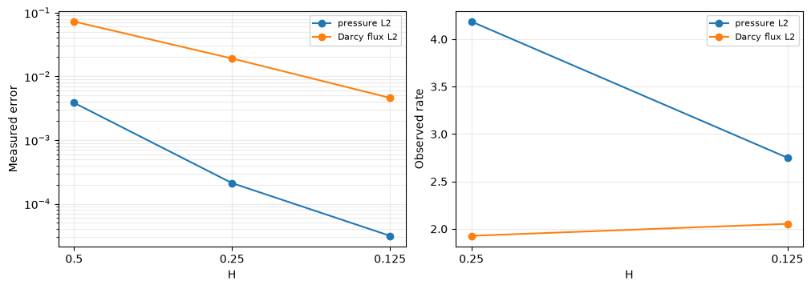
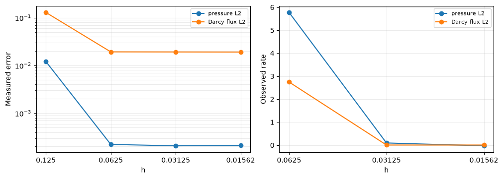
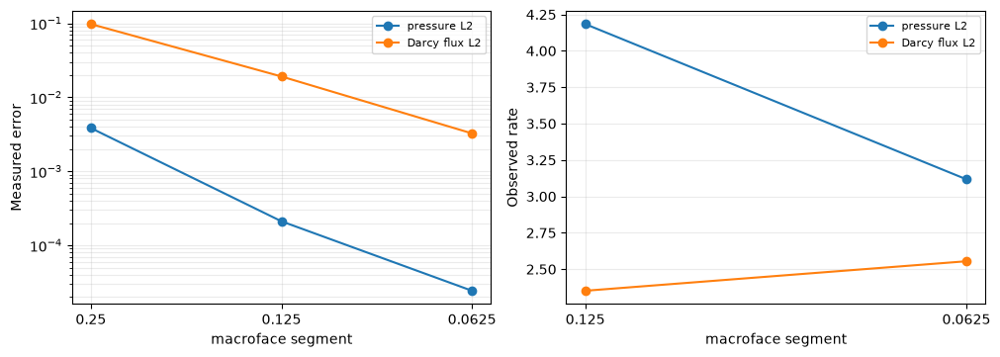
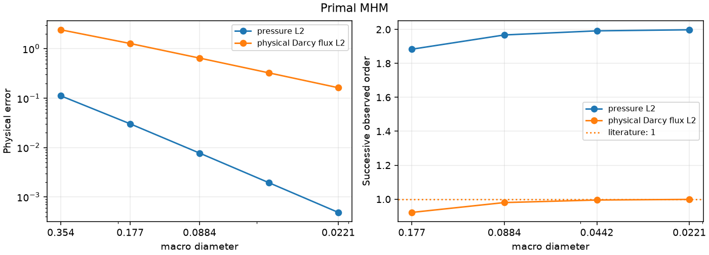

# Primal MHM

[Open the step-by-step notebook](https://github.com/ipes-lncc/pymhm/blob/main/notebooks/introduction/darcy_multiscale_convergence.ipynb) · [Download notebook](https://raw.githubusercontent.com/ipes-lncc/pymhm/main/notebooks/introduction/darcy_multiscale_convergence.ipynb) · [Theory and degree conditions](../../theory/elliptic.md)

Follow the numbered steps: state the variational problem, choose the local and trace spaces, declare the local and global equations, solve, and inspect the physical fields.

The main workflow is **meshes → spaces → local equations → global balance → assemble → solve → fields and errors**. `MeshHierarchy` associates macro and local meshes; `bind_interface` and `LocalContext` own supported numbering, geometric orientation and native coordinate conversions. The mathematical forms, physical trace meaning, local modes and gauge remain explicit in the cells below. Fully manual/custom spaces use the same numerical owners; see the [custom-interface notebook](https://github.com/ipes-lncc/pymhm/blob/main/notebooks/foundations/operators/custom_interface.ipynb).

This notebook builds primal MHM step by step: bind the macro and local meshes, declare the spaces, write local UFL equations and the global balance, then assemble and solve. A small macro mesh controls the global problem; independent local fine meshes resolve the material oscillations. The baseline is classical conforming Galerkin assembled on several much finer global meshes.

Install `pymhm[notebooks,visualization]` and the compatible native DOLFINx/UFL backend, then open this notebook with `jupyter lab` in a writable directory. Run the cells in order. Physical data and equations are declared here; downloaded companion helpers provide evaluation, norms, plots and archives.

The manufactured solution distinguishes the finite-reference error from the multiscale error. This is an analytical control devised for this tutorial, rather than a matched paper reproduction.

The local Neumann responses, skeletal flux unknowns and retained cell constants follow [Harder, Paredes and Valentin (2013)](https://doi.org/10.1016/j.jcp.2013.03.019). The oscillatory manufactured data and refinement sequence are defined for this tutorial.

Field evaluation, norms, plots and executed-array archives use the importable
[supporting scalar helpers](https://github.com/ipes-lncc/pymhm/blob/main/examples/introduction/scalar.py).
The physical data and local/global variational equations remain explicit below.


The PyMHM distribution contains only the library. The first cell explicitly
downloads a checksum-verified companion archive and prepares the declared data
using its local Python helpers. You can inspect these support files in `ROOT`.
Complete studies and historical replay retain their existing opt-in flags.


```python
from pathlib import Path
import os
import sys
from pymhm.io.workspace import workspace_from_archive

# Download verified support files; this operation does not execute them.
COMPANION_URL = "https://ipes-lncc.github.io/pymhm/downloads/74c5f3e0ffa8e572f4716c0342e3a3f97e1163300a1b56e4b5111b26a47283bd/darcy_multiscale_convergence-companion.zip"
COMPANION_SHA256 = "74c5f3e0ffa8e572f4716c0342e3a3f97e1163300a1b56e4b5111b26a47283bd"
WORKSPACE = Path(
    os.environ.get("PYMHM_WORKSPACE", Path.cwd() / ".pymhm-companions" / COMPANION_SHA256)
)
ROOT = workspace_from_archive(COMPANION_URL, sha256=COMPANION_SHA256, directory=WORKSPACE)
os.environ["PYMHM_WORKSPACE"] = str(ROOT)
if str(ROOT) not in sys.path:
    sys.path.insert(0, str(ROOT))

# Explicitly prepare declared data with the downloaded Python helpers.
from scripts.notebook_reproduction import notebook_workspace

ROOT = notebook_workspace("introduction/darcy_multiscale_convergence.ipynb", directory=ROOT)
root = ROOT
print("Workspace:", ROOT)


import numpy as np
import matplotlib.pyplot as plt
from dataclasses import dataclass
from functools import partial
from typing import Any
from pymhm import Equation, LocalEquations, assemble, columns
from pymhm import MeshHierarchy, LocalContext, bind_interface, bind_problem
from pymhm.core.equations import compile_form
from pymhm.fem.traces.interval import FaceSpace, SkeletonSpace
from examples.introduction.scalar import (
    Array,
    dirichlet_solve,
    evaluate_bound_pressure,
    evaluate_qk,
    grid_quadrature,
    native_scalar_space,
    observed_rates,
    physical_errors,
    plot_convergence,
    plot_field_panels,
    rectangle_panel,
)
import ufl
from pymhm import ExecutionConfig, CartesianMacroMesh
from pymhm.fem.scalar.quadrilateral import qk_space, quadrilateral_operators
from pymhm.fem.scalar.operators import boundary_data

```

```text
Workspace: ./build/docs-restructure/exact-source-workspaces-final/introduction/darcy_multiscale_convergence
```

## 1. Physical problem and an independently derived source

On $\Omega=(0,1)^2$, Darcy's law and conservation are


$$
\boldsymbol q=-K\nabla p,\qquad\nabla\cdot\boldsymbol q=f,
\qquad p=0\quad\text{on }\partial\Omega.
$$


Choose $\varepsilon=1/8$, $a=1.5$ and


$$
\begin{aligned}
K(x,y)&=\mathrm{diag}\!\left(e^{a\sin(\omega x)},e^{a\cos(\omega y)}\right),
\qquad\omega=2\pi/\varepsilon,\\
p_\star(x,y)&=\sin(\pi x)\sin(\pi y).
\end{aligned}
$$


The uniform spectral contrast is $e^{2a}\simeq20.1$. Eight oscillations fit in each direction, even when only four macroelements fit in that direction. Differentiate **before** discretizing:


$$
f=\pi^2(K_{xx}+K_{yy})p_\star
 -(\partial_xK_{xx})\partial_xp_\star
 -(\partial_yK_{yy})\partial_yp_\star.
$$


The data class below implements these expressions directly. Its source never applies an assembled matrix to the exact coefficients. The coefficient is smooth, but its derivatives depend on $\varepsilon$; our convergence measurements keep $\varepsilon$ fixed.


```python
@dataclass(frozen=True)
class OscillatoryDarcyData:
    """Smooth anisotropic diffusion with declared wavelength and contrast.

    ``Kxx=exp(a*sin(2*pi*x/epsilon))`` and
    ``Kyy=exp(a*cos(2*pi*y/epsilon))``; cross entries vanish. Thus the
    uniform spectral contrast is ``exp(2*a)``, independently of the mesh.
    """

    epsilon: float = 0.125
    amplitude: float = 1.5

    def permeability(self, points: Array) -> Array:
        """Return the physical SPD tensor at XY points, with no averaging."""
        phase = 2 * np.pi * points / self.epsilon
        tensors = np.zeros((len(points), 2, 2))
        tensors[:, 0, 0] = np.exp(self.amplitude * np.sin(phase[:, 0]))
        tensors[:, 1, 1] = np.exp(self.amplitude * np.cos(phase[:, 1]))
        return tensors

    def pressure(self, points: Array) -> Array:
        """Return ``sin(pi*x)*sin(pi*y)`` on the unit square."""
        return np.sin(np.pi * points[:, 0]) * np.sin(np.pi * points[:, 1])

    def gradient(self, points: Array) -> Array:
        """Return the independently differentiated exact pressure gradient."""
        x, y = np.pi * points.T
        return np.pi * np.column_stack((np.cos(x) * np.sin(y), np.sin(x) * np.cos(y)))

    def flux(self, points: Array) -> Array:
        """Return exact physical Darcy flux ``-K grad(p)``."""
        return -np.einsum("qab,qb->qa", self.permeability(points), self.gradient(points))

    def source(self, points: Array) -> Array:
        """Return independently differentiated ``-div(K grad(p))``.

        This expression uses analytic derivatives of both K and p, never the
        assembled operator or a discretely manufactured right-hand side.
        """
        omega = 2 * np.pi / self.epsilon
        k = self.permeability(points)
        derivative_x = self.amplitude * omega * np.cos(omega * points[:, 0]) * k[:, 0, 0]
        derivative_y = -self.amplitude * omega * np.sin(omega * points[:, 1]) * k[:, 1, 1]
        gradient = self.gradient(points)
        return (
            np.pi**2 * (k[:, 0, 0] + k[:, 1, 1]) * self.pressure(points)
            - derivative_x * gradient[:, 0]
            - derivative_y * gradient[:, 1]
        )

```

## 2. Choose the three approximation scales

`macro` defines the global element size. `local_refinement` chooses how each macroelement resolves the material, while the trace degree and segments choose the interface approximation. The convergence study varies these choices separately.


```python
data = OscillatoryDarcyData(epsilon=1 / 8, amplitude=1.5)
exact = lambda points: (data.pressure(points), data.gradient(points))
macro = CartesianMacroMesh(4, 4)
# H=1/4; h_local=H/r=1/64; degree k=2; trace degree ell=1.
local_degree, local_refinement, trace_segments = 2, 16, 2
skeleton = SkeletonSpace(
    macro, tuple(FaceSpace.uniform(1, trace_segments, continuous=True) for _ in macro.faces)
)
print(
    {
        "macro_cells": len(macro.cells),
        "H": 1 / 4,
        "local_h": 1 / 64,
        "epsilon": data.epsilon,
        "spectral_contrast": float(np.exp(2 * data.amplitude)),
    }
)

```

```text
{'macro_cells': 16, 'H': 0.25, 'local_h': 0.015625, 'epsilon': 0.125, 'spectral_contrast': 20.085536923187668}
```

## 3. Translate the weak formulation into local and global objects

On each macroelement $T$, pressure uses a continuous $Q_k$ fine space. The skeletal multiplier $\lambda$ is the physical normal Darcy flux in the unique orientation $\boldsymbol n_F$ of face $F$. The normal interface binding derives $s_{TF}=\boldsymbol n_T\cdot\boldsymbol n_F$ from the macroface topology. Write the trace integrals in UFL; `LocalContext` supplies their basis supports and coefficient maps.


$$
\begin{aligned}
a_T(p_T,v)+\langle s_{TF}\lambda,v\rangle_{\partial T}&=(f,v)_T,\\
a_T(p_T,v)&=\int_T K\nabla p_T\cdot\nabla v.
\end{aligned}
$$


| Mathematical term | Code declaration |
| --- | --- |
| Local energy and source | `a=inner(K*grad(p),grad(v))*dx`, `L=f*v*dx` in UFL |
| Oriented normal-flux pairing | `local.trace_pairings(lambda phi, ds: phi*v*ds)` |
| Constant kernel and physical average | `kernel`, `moments` in `LocalEquations` |
| Weak pressure continuity | `local.trace_pairings(lambda phi, ds: -phi*p*ds, axis="rows")` |
| Macroface coordinates | `bind_interface(skeleton, convention="normal")` supplies local/global maps |

Interior faces have zero pressure-jump moments; Dirichlet faces have prescribed pressure moments. With the declared sign $C=-B^T$, the additional global right-hand side is


$$
-\sum_T\langle s_{TF}\mu,p_T\rangle_{\partial T}
=-\langle\mu,p_D\rangle_{\Gamma_D}.
$$


`Equation(0, ...)` stores this additional global term. One constant mode per macroelement gives the compatibility equation imposing **macro conservation**. The plotted raw flux $-K\nabla p_h$ is not an $H(\mathrm{div})$ reconstruction and is not guaranteed to conserve on every fine cell.

The provider below declares the executable UFL weak forms and each coupling sign. `local.native_space` owns the native geometry and coefficient convention, while `local.trace_pairings` binds both interface forms independently. The provider supplies no face DOF indices or nodal permutation. The generic `assemble` operation owns elimination, assembly and reconstruction; no PDE-specific problem constructor is used.


```python
def ufl_coefficient_source(domain: Any, physical_data: OscillatoryDarcyData) -> tuple[Any, Any]:
    """Declare the same smooth K and independently differentiated manufactured f in UFL."""
    x = ufl.SpatialCoordinate(domain)
    a, omega = physical_data.amplitude, 2 * np.pi / physical_data.epsilon
    kxx = ufl.exp(a * ufl.sin(omega * x[0]))
    kyy = ufl.exp(a * ufl.cos(omega * x[1]))
    tensor = ufl.as_matrix(((kxx, 0.0), (0.0, kyy)))
    exact_pressure = ufl.sin(np.pi * x[0]) * ufl.sin(np.pi * x[1])
    pressure_x = np.pi * ufl.cos(np.pi * x[0]) * ufl.sin(np.pi * x[1])
    pressure_y = np.pi * ufl.sin(np.pi * x[0]) * ufl.cos(np.pi * x[1])
    kxx_x = a * omega * ufl.cos(omega * x[0]) * kxx
    kyy_y = -a * omega * ufl.sin(omega * x[1]) * kyy
    force = np.pi**2 * (kxx + kyy) * exact_pressure - kxx_x * pressure_x - kyy_y * pressure_y
    return tensor, force


@dataclass(frozen=True)
class DarcyLocalProvider:
    """Declare primal Qk UFL energy, physical flux coupling and pressure moments."""

    macro: CartesianMacroMesh
    skeleton: SkeletonSpace
    data: object
    degree: int
    refinement: int
    quadrature_order: int

    def __call__(self, local: LocalContext) -> LocalEquations:
        """Declare K grad(p)·grad(v), f v, oriented normal flux and the constant average."""
        cell, fine = local.cell, local.mesh
        import basix
        import basix.ufl

        element = basix.ufl.element(
            "Lagrange",
            "quadrilateral",
            self.degree,
            lagrange_variant=basix.LagrangeVariant.equispaced,
        )
        binding = local.native_space(element)
        domain, space = binding.mesh, binding.space
        mapping = binding.mapping
        p, v = ufl.TrialFunction(space), ufl.TestFunction(space)
        K, f = ufl_coefficient_source(domain, self.data)
        dx = ufl.Measure(
            "dx", domain=domain, metadata={"quadrature_degree": 2 * self.quadrature_order - 1}
        )
        # These executed UFL forms are the local weak formulation, directly.
        a = ufl.inner(K * ufl.grad(p), ufl.grad(v)) * dx
        load = f * v * dx
        local.field("pressure", binding)
        b = local.trace_pairings(lambda phi, ds: phi * v * ds)
        c = local.trace_pairings(lambda phi, ds: -phi * p * ds, axis="rows")
        area = float(fine.areas.sum())
        return local.equations(
            a=a,
            L=load,
            b=b,
            c=c,
            kernel=np.ones((len(mapping), 1)),
            moments=columns((v / area) * dx),
            metadata=(fine, mapping),
        )

```

## 4. Construct, assemble and solve the global problem

`retained=1` retains one pressure-average coordinate per macroelement; `bind_problem` derives its global coordinate layout. The global equation imposes pressure through boundary moments, without fixing local pressure nodes. Dirichlet data remove the global constant-pressure ambiguity, so no additional physical gauge is required.

The local problems compute source responses and responses to trace basis functions. Their coefficients are recovered after solving for the macroface and retained coordinates. They do not create a large conforming global mesh.

### Evaluate pressure in its executed coefficient basis

Before reconstructing fields, define how the x-fastest Qk coefficients represent pressure and physical gradients. The second function selects a macrocell and evaluates its independent local coefficients. This is field evaluation, not another solve; it preserves the distinction between broken pressure and physical Darcy flux.


```python
provider = DarcyLocalProvider(macro, skeleton, data, local_degree, local_refinement, 7)
boundary, fixed = boundary_data(skeleton, data.pressure, order=7)
hierarchy = MeshHierarchy(
    macro, tuple(macro.submesh(cell, local_refinement) for cell in range(len(macro.cells)))
)
interface = bind_interface(skeleton, convention="normal")
problem = bind_problem(
    hierarchy,
    interface,
    provider,
    global_equation=lambda global_problem: Equation(0, global_problem.trace_load(-boundary)),
    retained=1,
    fixed=fixed,
)
system = assemble(problem, execution=ExecutionConfig("serial", native_threads=1))
solution = system.solve()
pressure_fields = solution.field("pressure")
local_meshes = tuple(field.mesh for field in pressure_fields)
mhm_fields = tuple(field.portable_coefficients for field in pressure_fields)
mhm_evaluator = partial(evaluate_bound_pressure, macro, pressure_fields)
print(
    {
        "global_unknowns": system.matrix.shape[0],
        "largest_local_unknowns": max(len(v) for v in solution.fields),
        "original_equations_relative_residual": solution.raw_residual,
    }
)
# Named fields carry their mesh and executed basis; no index map is needed to evaluate.
first_point = macro.points[macro.cells[0]].mean(axis=0, keepdims=True)
print("First macrocell pressure at its center:", pressure_fields[0].evaluate(first_point))

```

```text
{'global_unknowns': 136, 'largest_local_unknowns': 1089, 'original_equations_relative_residual': 1.068655151817424e-16}
First macrocell pressure at its center: [0.14646015]
```

### Optional numerical equivalence after the UFL definition

The main formulation above is the executed UFL weak form. Once its operator and coordinate conventions are explicit, `quadrilateral_operators` provides an alternative assembled representation. The following control verifies equivalence on one local mesh; it does not select the global/local problem or hide its forms. The classical baseline below remains an explicit UFL assembly.


```python
declared = problem.local_provider(0)
fine, mapping = declared.metadata
ufl_a = compile_form(declared.a)
ufl_load = compile_form(declared.L, (len(mapping),))
ready_a, _, ready_load = quadrilateral_operators(
    fine,
    local_degree,
    permeability=data.permeability,
    source=data.source,
    order=provider.quadrature_order,
)
operator_defect = np.max(np.abs((ufl_a[mapping][:, mapping] - ready_a).data), initial=0.0)
load_defect = float(np.max(np.abs(ufl_load[mapping] - ready_load), initial=0.0))
print({"UFL_vs_ready_operator_max": float(operator_defect), "UFL_vs_ready_source_max": load_defect})
assert operator_defect < 1e-10 * max(1.0, float(np.max(np.abs(ready_a.data))))
assert load_defect < 1e-10 * max(1.0, float(np.max(np.abs(ready_load))))

```

```text
{'UFL_vs_ready_operator_max': 2.842170943040401e-14, 'UFL_vs_ready_source_max': 8.326672684688674e-17}
```

## 5. Classical primal Galerkin on independently refined global meshes

Now assemble **one global continuous matrix**, without an MHM skeleton or local condensation. The operator, permeability, source and boundary values are identical. Strong Dirichlet values eliminate boundary nodes; `dirichlet_solve`, defined below, performs only that generic algebraic elimination.


$$
A^{\rm CG}_{ij}=\int_\Omega K\nabla\phi_j\cdot\nabla\phi_i,
\qquad F^{\rm CG}_i=\int_\Omega f\phi_i.
$$


Evaluate pressure and raw gradients directly from the executed nodal basis. Integrate on a common grid resolving every compared finite-element mesh, with physical Gauss weights. The field measurements are pressure $L^2$, vector Darcy flux $L^2$, and flux energy


$$
\left(\int_\Omega\boldsymbol e_q^T K^{-1}\boldsymbol e_q\right)^{1/2}.
$$


The baseline is assembled independently as a different classical discretization, while sharing PyMHM basis and integration kernels. It is not an independent external-code comparison. Successive references are compared, and the analytical solution separately verifies their errors.


```python
reference_rows, reference_evaluators = [], []
error_points, error_weights = grid_quadrature(macro.bounds, (128, 128), order=7)
for n in (32, 64, 128):
    fine = CartesianMacroMesh(n, n)
    domain, space, mapping = native_scalar_space(fine, 2)
    p, v = ufl.TrialFunction(space), ufl.TestFunction(space)
    K, f = ufl_coefficient_source(domain, data)
    dx = ufl.Measure("dx", domain=domain, metadata={"quadrature_degree": 13})
    a_cg = compile_form(ufl.inner(K * ufl.grad(p), ufl.grad(v)) * dx)
    load_cg = compile_form(f * v * dx)
    _, nodes = qk_space(fine, 2)
    exterior = np.flatnonzero(np.any(np.isclose(nodes, 0) | np.isclose(nodes, 1), axis=1))
    coefficients = dirichlet_solve(
        a_cg, load_cg, mapping[exterior], data.pressure(nodes[exterior])
    )[mapping]
    evaluator = partial(evaluate_qk, fine, 2, coefficients)
    reference_evaluators.append(evaluator)
    errors = physical_errors(evaluator, exact, data.permeability, error_points, error_weights)
    reference_rows.append({"n": n, "unknowns": len(nodes), **errors})
reference_rows

```


```text
[{'n': 32,
  'unknowns': 4225,
  'pressure_L2': 1.6318965471072642e-05,
  'flux_L2': 0.0014999740470356766,
  'flux_energy': 0.0009521702553866294,
  'pressure_relative': 3.2637930942145284e-05,
  'flux_relative': 0.0003056354275708311,
  'energy_relative': 0.00033401766442094175},
 {'n': 64,
  'unknowns': 16641,
  'pressure_L2': 1.2191024764276339e-06,
  'flux_L2': 0.0004247613394424418,
  'flux_energy': 0.0002514193228832236,
  'pressure_relative': 2.4382049528552678e-06,
  'flux_relative': 8.654957320935687e-05,
  'energy_relative': 8.819693174058399e-05},
 {'n': 128,
  'unknowns': 66049,
  'pressure_L2': 9.400677112227076e-08,
  'flux_L2': 0.00010915481614597537,
  'flux_energy': 6.370482539257987e-05,
  'pressure_relative': 1.8801354224454152e-07,
  'flux_relative': 2.224143742361506e-05,
  'energy_relative': 2.2347407797708685e-05}]
```


```python
reference_refinement = [
    physical_errors(first, second, data.permeability, error_points, error_weights)
    for first, second in zip(reference_evaluators[:-1], reference_evaluators[1:])
]
print("Successive reference differences:", reference_refinement)
reference = reference_evaluators[-1]
comparison = physical_errors(
    mhm_evaluator, reference, data.permeability, error_points, error_weights
)
exact_errors = physical_errors(mhm_evaluator, exact, data.permeability, error_points, error_weights)
print("MHM versus fine CG:", comparison)
print("MHM versus exact solution:", exact_errors)
# The exact solution keeps this conclusion independent of reference uncertainty.
assert reference_rows[-1]["flux_L2"] < reference_rows[0]["flux_L2"]
assert reference_rows[-1]["pressure_L2"] < reference_rows[0]["pressure_L2"]

```

```text
Successive reference differences: [{'pressure_L2': 1.5234803545787962e-05, 'flux_L2': 0.0014259004433549434, 'flux_energy': 0.0009183771099355073, 'pressure_relative': 3.0469539470096415e-05, 'flux_relative': 0.0002905424940205197, 'energy_relative': 0.0003221631601870045}, {'pressure_L2': 1.1518268950028591e-06, 'flux_L2': 0.00041098995715294415, 'flux_energy': 0.00024321466063586947, 'pressure_relative': 2.303653459930783e-06, 'flux_relative': 8.374351625547069e-05, 'energy_relative': 8.531876779310019e-05}]
```

```text
MHM versus fine CG: {'pressure_L2': 0.00021110534459098504, 'flux_L2': 0.019092751630456182, 'flux_energy': 0.012636675043133412, 'pressure_relative': 0.0004222106286862625, 'flux_relative': 0.0038903484834588446, 'energy_relative': 0.004432897017240737}
MHM versus exact solution: {'pressure_L2': 0.00021110587827487606, 'flux_L2': 0.01909305299115969, 'flux_energy': 0.012636835728455987, 'pressure_relative': 0.0004222117565497521, 'flux_relative': 0.003890409588164581, 'energy_relative': 0.004432953383926143}
```

## 6. Plot the coefficient, pressure and physical flux

The overlay is the actual macro mesh used by MHM, on every analytical, numerical and reference panel. Duplicate interface coordinates belong to separate local triangulations, preserving both one-sided values. Neither the broken pressure nor its raw flux is smoothed across macrofaces.

The permeability tensor has two distinct diagonal components: $K_{xx}$ controls transport in the x direction and $K_{yy}$ in the y direction. Plot both with the same physical color limits to compare their oscillations. The field panels then place the analytical pressure and Darcy flux beside MHM and the refined classical reference.


```python
permeability_panels = {
    "Permeability $K_{xx}$": rectangle_panel(
        macro, exact, quantity="permeability_xx", permeability=data.permeability
    ),
    "Permeability $K_{yy}$": rectangle_panel(
        macro, exact, quantity="permeability_yy", permeability=data.permeability
    ),
}
permeability_bounds = (np.exp(-data.amplitude), np.exp(data.amplitude))
plot_field_panels(
    macro,
    permeability_panels,
    figsize=(12, 4.8),
    color_limits={label: permeability_bounds for label in permeability_panels},
)
plt.show()

panels = {
    "Analytical pressure": rectangle_panel(macro, exact),
    "MHM pressure": rectangle_panel(macro, mhm_evaluator),
    "Fine CG pressure": rectangle_panel(macro, reference),
    "Analytical Darcy flux magnitude": rectangle_panel(
        macro, exact, quantity="flux_magnitude", permeability=data.permeability
    ),
    "MHM Darcy flux magnitude": rectangle_panel(
        macro, mhm_evaluator, quantity="flux_magnitude", permeability=data.permeability
    ),
    "Fine CG Darcy flux magnitude": rectangle_panel(
        macro, reference, quantity="flux_magnitude", permeability=data.permeability
    ),
}
plot_field_panels(macro, panels, figsize=(15, 9))
plt.show()

```


[](../../assets/tutorials/darcy_multiscale_convergence/figure_17_0.png)


[](../../assets/tutorials/darcy_multiscale_convergence/figure_17_1.png)


## 7. Separate macro size, local size and macroface resolution

There are three independent controls: macro size $H$, local size $h=H/r$, and the trace space (degree $\ell$ and segmentation). Simultaneous refinement can hide which control limits the accuracy. Keep $k=2$ and $\ell=1$ and run:

1. $H=1/2,1/4,1/8$ with fixed $h=1/64$ and two segments per face;
2. $h=1/8,1/16,1/32,1/64$ with fixed $H=1/4$ and two segments per face;
3. one, two and four segments per face with fixed $H=1/4$ and $h=1/64$.

The driver below repeats the same visible local/global declarations. Successive observed rates use $\log(e_i/e_{i+1})/\log(s_i/s_{i+1})$, where $s$ is $H$, $h$, or segment length. A plateau indicates another limiting scale; these measurements are not universal rate claims.


```python
def run_discretization(n: int, refinement: int, segments: int) -> dict:
    """Repeat the declared local/global equations for one explicit resolution."""
    grid = CartesianMacroMesh(n, n)
    trace = SkeletonSpace(
        grid, tuple(FaceSpace.uniform(1, segments, continuous=True) for _ in grid.faces)
    )
    local = DarcyLocalProvider(grid, trace, data, 2, refinement, 7)
    boundary, fixed = boundary_data(trace, data.pressure, order=7)
    hierarchy = MeshHierarchy(
        grid, tuple(grid.submesh(cell, refinement) for cell in range(len(grid.cells)))
    )
    declared = bind_problem(
        hierarchy,
        bind_interface(trace, convention="normal"),
        local,
        global_equation=lambda global_problem: Equation(0, global_problem.trace_load(-boundary)),
        retained=1,
        fixed=fixed,
    )
    assembled = assemble(declared, execution=ExecutionConfig("serial", native_threads=1))
    resolved = assembled.solve()
    evaluate = partial(evaluate_bound_pressure, grid, resolved.field("pressure"))
    return {
        "H": 1 / n,
        "h": 1 / (n * refinement),
        "segments": segments,
        "trace_segment_length": 1 / (n * segments),
        "global_unknowns": assembled.matrix.shape[0],
        "residual": resolved.raw_residual,
        **physical_errors(evaluate, exact, data.permeability, error_points, error_weights),
    }


macro_rows = [run_discretization(n, 64 // n, 2) for n in (2, 4, 8)]
local_rows = [run_discretization(4, r, 2) for r in (2, 4, 8, 16)]
trace_rows = [run_discretization(4, 16, s) for s in (1, 2, 4)]
for name, rows, variable in (
    ("H", macro_rows, "H"),
    ("h", local_rows, "h"),
    ("macroface segment", trace_rows, "trace_segment_length"),
):
    scales = [row[variable] for row in rows]
    print(name, rows)
    print("Observed pressure rates:", observed_rates(scales, [r["pressure_L2"] for r in rows]))
    print("Observed flux rates:", observed_rates(scales, [r["flux_L2"] for r in rows]))
    figure = plot_convergence(
        scales,
        {
            "pressure L2": [r["pressure_L2"] for r in rows],
            "Darcy flux L2": [r["flux_L2"] for r in rows],
        },
    )
    for axis in figure.axes:
        axis.set_xlabel(name)
    plt.show()

```

```text
H [{'H': 0.5, 'h': 0.015625, 'segments': 2, 'trace_segment_length': 0.25, 'global_unknowns': 40, 'residual': 1.749128621307829e-16, 'pressure_L2': 0.0038440419910070298, 'flux_L2': 0.07258266496359879, 'flux_energy': 0.07565780837943056, 'pressure_relative': 0.0076880839820140595, 'flux_relative': 0.014789478447457602, 'energy_relative': 0.026540468269346668}, {'H': 0.25, 'h': 0.015625, 'segments': 2, 'trace_segment_length': 0.125, 'global_unknowns': 136, 'residual': 1.068655151817424e-16, 'pressure_L2': 0.00021110587827487606, 'flux_L2': 0.01909305299115969, 'flux_energy': 0.012636835728455987, 'pressure_relative': 0.0004222117565497521, 'flux_relative': 0.003890409588164581, 'energy_relative': 0.004432953383926143}, {'H': 0.125, 'h': 0.015625, 'segments': 2, 'trace_segment_length': 0.0625, 'global_unknowns': 496, 'residual': 9.738926168654487e-17, 'pressure_L2': 3.13681029287548e-05, 'flux_L2': 0.004601788846461332, 'flux_energy': 0.003121177398685673, 'pressure_relative': 6.27362058575096e-05, 'flux_relative': 0.0009376626912035086, 'energy_relative': 0.0010948970302890838}]
Observed pressure rates: [4.18658544 2.75059657]
Observed flux rates: [1.92657722 2.05278112]
```


[](../../assets/tutorials/darcy_multiscale_convergence/figure_19_1.png)


```text
h [{'H': 0.25, 'h': 0.125, 'segments': 2, 'trace_segment_length': 0.125, 'global_unknowns': 136, 'residual': 9.231134756817656e-17, 'pressure_L2': 0.012105242280670614, 'flux_L2': 0.12919546359592954, 'flux_energy': 0.09348496639326725, 'pressure_relative': 0.024210484561341228, 'flux_relative': 0.02632492931086992, 'energy_relative': 0.032794166753791494}, {'H': 0.25, 'h': 0.0625, 'segments': 2, 'trace_segment_length': 0.125, 'global_unknowns': 136, 'residual': 9.61531316556648e-17, 'pressure_L2': 0.00022120794842649276, 'flux_L2': 0.01925385654937096, 'flux_energy': 0.011696612799026125, 'pressure_relative': 0.0004424158968529855, 'flux_relative': 0.003923174997916797, 'energy_relative': 0.0041031267955124375}, {'H': 0.25, 'h': 0.03125, 'segments': 2, 'trace_segment_length': 0.125, 'global_unknowns': 136, 'residual': 1.4723033894585078e-16, 'pressure_L2': 0.00020700692400061393, 'flux_L2': 0.019169351587717043, 'flux_energy': 0.01258764699064487, 'pressure_relative': 0.00041401384800122785, 'flux_relative': 0.0039059562266067238, 'energy_relative': 0.004415698163836526}, {'H': 0.25, 'h': 0.015625, 'segments': 2, 'trace_segment_length': 0.125, 'global_unknowns': 136, 'residual': 1.068655151817424e-16, 'pressure_L2': 0.00021110587827487606, 'flux_L2': 0.01909305299115969, 'flux_energy': 0.012636835728455987, 'pressure_relative': 0.0004222117565497521, 'flux_relative': 0.003890409588164581, 'energy_relative': 0.004432953383926143}]
Observed pressure rates: [ 5.77408492  0.0957242  -0.02828773]
Observed flux rates: [2.74633606 0.00634591 0.00575373]
```


[](../../assets/tutorials/darcy_multiscale_convergence/figure_19_3.png)


```text
macroface segment [{'H': 0.25, 'h': 0.015625, 'segments': 1, 'trace_segment_length': 0.25, 'global_unknowns': 96, 'residual': 8.273871608877269e-17, 'pressure_L2': 0.003837047167965644, 'flux_L2': 0.09746442298581488, 'flux_energy': 0.09155965342166678, 'pressure_relative': 0.007674094335931288, 'flux_relative': 0.019859397334962923, 'energy_relative': 0.03211877436633216}, {'H': 0.25, 'h': 0.015625, 'segments': 2, 'trace_segment_length': 0.125, 'global_unknowns': 136, 'residual': 1.068655151817424e-16, 'pressure_L2': 0.00021110587827487606, 'flux_L2': 0.01909305299115969, 'flux_energy': 0.012636835728455987, 'pressure_relative': 0.0004222117565497521, 'flux_relative': 0.003890409588164581, 'energy_relative': 0.004432953383926143}, {'H': 0.25, 'h': 0.015625, 'segments': 4, 'trace_segment_length': 0.0625, 'global_unknowns': 216, 'residual': 1.4389516488569565e-16, 'pressure_L2': 2.4324400283789275e-05, 'flux_L2': 0.0032500837373435256, 'flux_energy': 0.0022417239886972436, 'pressure_relative': 4.864880056757855e-05, 'flux_relative': 0.0006622386131727295, 'energy_relative': 0.0007863881556319045}]
Observed pressure rates: [4.18395784 3.11749061]
Observed flux rates: [2.35182789 2.55449901]
```


[](../../assets/tutorials/darcy_multiscale_convergence/figure_19_5.png)


## 8. Interpret accuracy and cost with their physical meaning

The residual of the original equations checks assembly and reconstruction. It does not replace field errors or an inf-sup argument. The declared local kernel is the constant pressure mode, and physical moments fix each local response's mean. Global Dirichlet moments remove the global gauge.

Compare global MHM unknowns with the fine Galerkin unknowns, and compare **flux errors** as well as pressure errors. A convincing pressure image may hide insufficiently resolved gradients. Local setup and solves remain part of the multiscale cost. This notebook reports dimensions and accuracy, without claiming a timing speedup.

The smooth coefficient gives a controlled analytical study. The following SPE10 tutorial instead uses jumps and high contrast, resolves pixel integration, and measures the numerical baseline's own refinement.

## References

- Christopher Harder, Diego Paredes, and Frédéric Valentin (2013). *A family of Multiscale Hybrid-Mixed finite element methods for the Darcy equation with rough coefficients*, Journal of Computational Physics 245, 107–130. [DOI: 10.1016/j.jcp.2013.03.019](https://doi.org/10.1016/j.jcp.2013.03.019).

## Reproduce this tutorial

[View the source notebook](https://github.com/ipes-lncc/pymhm/blob/main/notebooks/introduction/darcy_multiscale_convergence.ipynb) or [download the notebook](https://raw.githubusercontent.com/ipes-lncc/pymhm/main/notebooks/introduction/darcy_multiscale_convergence.ipynb), then open it:

```bash
python -m pip install 'pymhm[notebooks,visualization]'
jupyter lab darcy_multiscale_convergence.ipynb
```

The first cell explicitly downloads a SHA256-verified companion archive. Acquisition does not execute its code. The local support files are inspectable in the printed `ROOT` directory; the following helper call prepares only the declared inputs. The library distribution contains only `pymhm`. Notebooks, support code and data are separate downloads. Native UFL forms require the compatible DOLFINx/UFL backend described in the [installation guide](../../installation.md). A clone and Pixi are unnecessary.

For batch execution, extract the same companion, change to its workspace, and use its local runner with the actual downloaded notebook path:

```bash
python -m scripts.run_notebooks /path/to/darcy_multiscale_convergence.ipynb --timeout 7200
```

The runner uses the active Python interpreter and writes an executed copy and receipt under `build/notebooks/introduction/`. Larger data and field archives have [documented download links](../../data.md) and verified checksums.

The displayed figures and numerical outputs correspond to the retained validated execution of notebook SHA256 `57a5c1ec9b47a1cdf57dd7283c1bc688ab989031e315b33456a1b5f7810483d3` in the [publication manifest](../introduction/manifest.json). Current instructions use the separately downloaded local `examples` and `scripts` support modules. Running the current source produces a separate receipt for its actual notebook, support bytes and environment. Timings describe the recorded hardware and solver settings; measure your own environment on an idle machine.

## Smooth refinement and the asymptotic regime

The following independent qualification study uses **P1 local pressure; P0 normal-flux trace** and refines the **macro diameter**. It states its own geometry, data and spaces; its smooth rates are not transferred to the oscillatory teaching case or to singular material interfaces. Successive orders use the independently integrated physical errors:

$$
r_i=\frac{\log(E_{i-1}/E_i)}{\log(h_{i-1}/h_i)}.
$$

| Physical observable | Literature order under its hypotheses | Last three measured orders |
| --- | ---: | --- |
| pressure L2 | reported observation | 1.968 / 1.992 / 1.998 |
| physical Darcy flux L2 | 1 | 0.980 / 0.995 / 0.999 |



Download the figure as [SVG](../../assets/tutorials/methods/primal-mhm-convergence.svg) or [PDF](../../assets/tutorials/methods/primal-mhm-convergence.pdf).

Harder, Paredes and Valentin (2013): first-order energy; second-order pressure observed. The [source numerical record](https://github.com/ipes-lncc/pymhm/blob/main/examples/results/darcy_2013_comparison.json) has SHA256 `81ccaf3b9e11a385ed92c01547881d18a5ad02ef694ea0cfd3aa9fa699011155`. Its execution attribution remains in that record. The [rate notebook](https://github.com/ipes-lncc/pymhm/blob/main/notebooks/convergence/method_rates.ipynb) recomputes the orders; reading existing measurements does not execute the underlying PDE.

## References for this method

- Christopher Harder, Diego Paredes, and Frédéric Valentin (2013). *A family of Multiscale Hybrid-Mixed finite element methods for the Darcy equation with rough coefficients*, Journal of Computational Physics 245, 107–130. [DOI: 10.1016/j.jcp.2013.03.019](https://doi.org/10.1016/j.jcp.2013.03.019).
- Rodolfo Araya, Christopher Harder, Diego Paredes, and Frédéric Valentin (2013). *Multiscale Hybrid-Mixed Method*, SIAM Journal on Numerical Analysis 51(6), 3505–3531. [DOI: 10.1137/120888223](https://doi.org/10.1137/120888223).
