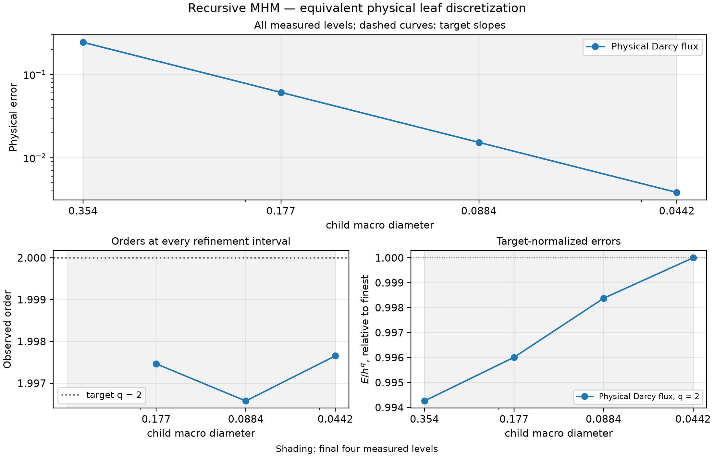

# Recursive physical local–global problems

[Executable notebook](https://github.com/ipes-lncc/pymhm/blob/main/notebooks/darcy/reconstruction_and_indicators.ipynb) · [Download notebook](https://raw.githubusercontent.com/ipes-lncc/pymhm/main/notebooks/darcy/reconstruction_and_indicators.ipynb)

A local operator can itself be a `MultiscaleProblem`. This lesson uses a real
two-level Darcy problem with analytical pressure
$p=\sin(2\pi x)\sin(2\pi y)$, $K=I$, homogeneous Dirichlet data, and the
independently differentiated source $f=8\pi^2p$. It compares every reconstructed
leaf against the same flattened MHM discretization before evaluating spatial
convergence. The [algebraic hierarchy notebook](https://github.com/ipes-lncc/pymhm/blob/main/notebooks/foundations/operators/variational_hierarchy.ipynb)
remains useful for inspecting individual matrix blocks.

## 1. Define two physical macro scales and the leaf mesh

Each outer macrotriangle contains four child macrotriangles. Each child has
four fine triangles for the P3 local pressure. Child normal traces are P1;
**two independent P1 segments** on every parent face represent exactly the two
child boundary traces. Thus parent restriction introduces no projection error.

```python
outer = TriangleMesh.unit_square(n)
children = tuple(outer.submesh(i, 2) for i in range(len(outer.cells)))
outer_trace = SkeletonSpace(outer, tuple(FaceSpace.uniform(1, 2) for _ in outer.faces))
```

## 2. Declare the leaf equations explicitly

The leaf provider is the user-written UFL form in the
[recovery lesson](flux-recovery.md):

$$
\begin{aligned}
(\nabla p_t,\nabla v)_t+\langle\xi_t,v\rangle_{\partial t}&=(f,v)_t,\\
-\sum_t\langle p_t,\mu_t\rangle_{\partial t}&=0.
\end{aligned}
$$

P3 pressure and P1 traces satisfy the two-dimensional primal MHM degree
condition. The physical constant mode and volume moment remain explicit.
The source is not discarded when the child operator is condensed.

## 3. Declare another global problem as this scale's local provider

```python
def recursive_provider(local: LocalContext):
    """Build the child global equations inside one outer macrotriangle."""
    child_macro = local.mesh
    leaf_meshes = tuple(child_macro.submesh(i, 2) for i in range(len(child_macro.cells)))
    child_trace = SkeletonSpace(child_macro, tuple(FaceSpace.uniform(1) for _ in child_macro.faces))
    child = bind_problem(
        MeshHierarchy(child_macro, leaf_meshes), bind_interface(child_trace, convention="normal"),
        local_equations, retained=1,
    )
    kernel = np.r_[np.zeros(child_trace.size), np.ones(len(child_macro.cells))][:, None]
    moments = np.r_[np.zeros(child_trace.size), child_macro.areas][:, None]
    return local.nested(child, kernel=kernel, moments=moments)
```

The child leaves its exterior pressure moments to the parent. Its constant
mode is zero in normal-trace coordinates and one in each retained pressure
mean. Multiplication by child areas supplies the physical volume moment.
The child provider's local complement has zero physical moment, so these
retained coordinates represent the actual mean without a source offset.

## 4. Define the outer balance, assemble and solve

```python
recursive_problem = bind_problem(
    MeshHierarchy(outer, children), bind_interface(outer_trace, convention="normal"),
    recursive_provider, global_equation=global_equation, retained=1,
)
coefficients = solve(assemble(recursive_problem))
leaves = coefficients.field("pressure", recursive=True)
```

The outer equation uses the same weak Dirichlet moments and sign convention
as the explicit primal formulation. `recursive=True` recovers every named leaf
field through the stored hierarchy; it does not perform another solve.
The interface binding owns signed normal restrictions and segment numbering.
An unrepresentable parent trace is rejected. Custom interfaces can supply
exact `boundary_dofs` and `trace_map` deliberately.

## 5. Compare the identical flattened discretization

The notebook joins the actual child meshes, including their executed diagonals,
then assembles a separately declared one-level MHM problem on that mesh.
No change is made to leaf degree, local mesh ratio, source, boundary values or
trace spaces. The coefficient difference tests associative condensation;
it is separate from the physical error against the analytical solution.

| Outer subdivisions | Child macrocells | Outer trace DOFs | Physical vector-flux error | Maximum flattened coefficient difference |
| --- | --- | --- | --- | --- |
| 2 | 32 | 64 | 2.434897e-01 | 2.331e-15 |
| 4 | 128 | 224 | 6.097962e-02 | 7.938e-15 |
| 8 | 512 | 832 | 1.528115e-02 | 7.966e-15 |
| 16 | 2048 | 3200 | 3.826503e-03 | 2.459e-14 |

The parent and child `raw_residual` diagnostics check original global
compatibility, rather than the norm of every original local volume row. Native
homogeneous and nonhomogeneous polynomial controls additionally verify the
physical constant/gauge and boundary lifting conventions.
The physical-flux error in this table measures the raw field $-\nabla p_h$
against the exact Darcy flux; RT2 recovery is a separate postprocessing step.

## 6. Demonstrate the inherited asymptotic rate

The outer sequence is $n=2,4,8,16$, so child macro diameters are
$H_c=\sqrt{2}/(2n)$. The flattened P3/P1 MHM error estimate predicts physical
Darcy-flux order $H_c^2$ for the smooth solution. Exact recursive condensation
inherits this discretization's rate; it is not a distinct universal theorem
for an arbitrary hierarchy whose interface approximation changes.



[PDF](../../assets/tutorials/methods/recovery-recursive-convergence.pdf) · [SVG](../../assets/tutorials/methods/recovery-recursive-convergence.svg)

The three consecutive physical-flux orders are 1.99746, 1.99657 and
1.99765; the normalized $E/H_c^2$ max/min ratio is 1.00578.
The physical errors use independent orders 12 and 16 quadrature. Refinement
keeps the parent/child/local ratios and degrees fixed. The baseline classical
P3 Galerkin calculation in the shared notebook verifies its own refinement on
three finer global meshes against the same analytical fields.


[PDF](../../assets/tutorials/methods/recovery-refined-fields.pdf) · [SVG](../../assets/tutorials/methods/recovery-refined-fields.svg)

These field panels show the equivalent flattened leaf solution. Equality of
its coefficient vectors with the recursive leaves is verified in the table;
the illustration corresponds to outer $n=8$ and 512 child macrotriangles.
Each panel overlays that child macro partition, which includes the outer
macro edges, and preserves independent fine-cell centroid samples. The flux
panels show the RT2 recovery of this same leaf solution; their vector error
is distinct from the raw-flux error in the convergence table.

## References

- Christopher Harder and Frédéric Valentin (2016). *Foundations of the MHM Method*, in *Building Bridges: Connections and Challenges in Modern Approaches to Numerical Partial Differential Equations*, Lecture Notes in Computational Science and Engineering 114. [DOI: 10.1007/978-3-319-41640-3_13](https://doi.org/10.1007/978-3-319-41640-3_13).
- Christopher Harder, Diego Paredes and Frédéric Valentin (2013). *A family of Multiscale Hybrid-Mixed finite element methods for the Darcy equation with rough coefficients*. [DOI: 10.1016/j.jcp.2013.03.019](https://doi.org/10.1016/j.jcp.2013.03.019).
