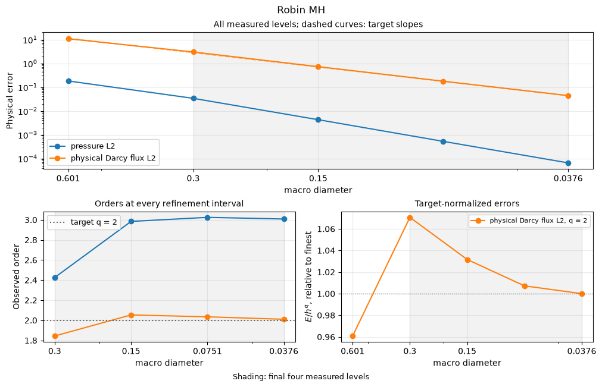

# Robin MH

[Open the step-by-step notebook](https://github.com/ipes-lncc/pymhm/blob/main/notebooks/darcy/robin_mh_workflow.ipynb) · [Download notebook](https://raw.githubusercontent.com/ipes-lncc/pymhm/main/notebooks/darcy/robin_mh_workflow.ipynb) · [Theory and degree conditions](../../theory/alternatives.md)

We write the Robin weak equations directly in UFL. Our independently manufactured data are $p=\sin(2\pi x)\sin(2\pi y)$, $K=I$, $f=8\pi^2p$, and homogeneous exterior pressure. Follow **meshes → local forms → global forms → assemble → solve → physical fields**.

The modified multiplier is $\lambda_T=(q-p\sigma)\cdot n_T$, where $q=-\nabla p$ and $\sigma=\nu(x-x_0)/2$. Consequently this multiplier cannot be plotted or tested as $q\cdot n_T$. The method follows [Barrenechea, Gomes and Paredes (2024)](https://doi.org/10.1137/22M1542556).


```python
import numpy as np
import matplotlib.pyplot as plt
import ufl
from pymhm import (
    Equation, FaceSpace, LocalContext, MeshHierarchy, SkeletonSpace, TriangleMesh,
    assemble, bind_interface, bind_problem, columns, solve,
)
from threadpoolctl import threadpool_limits


def exact_pressure(points: np.ndarray) -> np.ndarray:
    """Analytical pressure; it vanishes on every exterior edge."""
    return np.sin(2 * np.pi * points[:, 0]) * np.sin(2 * np.pi * points[:, 1])


def exact_gradient(points: np.ndarray) -> np.ndarray:
    """Independently differentiated physical pressure gradient."""
    x, y = 2 * np.pi * points.T
    return 2 * np.pi * np.column_stack((np.cos(x) * np.sin(y), np.sin(x) * np.cos(y)))


def source(points: np.ndarray) -> np.ndarray:
    """Negative Laplacian computed independently of the discrete operator."""
    return 8 * np.pi**2 * exact_pressure(points)
```

## 1. Define macro, local and interface spaces

The hierarchy owns mesh association. The interface binding owns geometric incidence and numbering; variational signs are declared separately.


```python
macro = TriangleMesh.unit_square(2)
local_meshes = tuple(macro.submesh(cell, 2) for cell in range(len(macro.cells)))
hierarchy = MeshHierarchy(macro, local_meshes)
skeleton = SkeletonSpace(macro, tuple(FaceSpace.uniform(1) for _ in macro.faces))
interface = bind_interface(skeleton, convention="normal")
```

## 2. Declare the local Robin equations


$$
(\nabla p_T,\nabla v)_T+\langle\sigma\cdot n_T\,p_T,v\rangle_{\partial T}
+\langle\lambda_T,v\rangle_{\partial T}=(f,v)_T.
$$


Choose $x_0=(0,0)$ and $\nu=1/4$. On this unit-square problem, $R=\sqrt{2}/2$ gives the admissible sufficient bound $\nu\le 1/(4R^2)=1/2$. The Robin operator has no constant kernel: it retains no pressure mean. The global test remains the independent negative pressure trace pairing.


```python
def local_equations(local: LocalContext):
    """Declare Robin diffusion and its independent pressure trace test."""
    space = local.native_space(degree=3)
    p, v = ufl.TrialFunction(space.space), ufl.TestFunction(space.space)
    x = ufl.SpatialCoordinate(space.mesh)
    dx = ufl.Measure("dx", domain=space.mesh, metadata={"quadrature_degree": 12})
    forcing = 8 * np.pi**2 * ufl.sin(2 * np.pi * x[0]) * ufl.sin(2 * np.pi * x[1])
    ds = ufl.Measure("ds", domain=space.mesh, metadata={"quadrature_degree": 12})
    normal = ufl.FacetNormal(space.mesh)
    sigma = 0.25 * x / 2
    local.field("pressure", space)
    return local.equations(
        a=ufl.inner(ufl.grad(p), ufl.grad(v)) * dx + ufl.dot(sigma, normal) * p * v * ds,
        L=forcing * v * dx,
        b=local.trace_pairings(lambda phi, ds: phi * v * ds),
        c=local.trace_pairings(lambda phi, ds: -phi * p * ds, axis="rows"),
    )
```

## 3. Declare global pressure continuity and boundary moments


$$
-\sum_T\langle p_T,\mu_T\rangle_{\partial T}=-\langle p_D,\mu\rangle_{\partial\Omega}.
$$


The trace maps carry canonical incidence. The negative sign is the mathematical global-test convention. Zero retained coordinates reflect the invertible local Robin operator.


```python
def global_equation(global_context):
    """Supply the weak Dirichlet moments in the bound interface layout."""
    boundary, fixed = global_context.boundary_data(0.0, order=8)
    assert not fixed
    return Equation(0, global_context.trace_load(-boundary))


problem = bind_problem(hierarchy, interface, local_equations,
                       global_equation=global_equation, retained=0)
```

## 4. Assemble and solve

Assembly solves the independent local equations and sums their interface contributions. Solving reconstructs named local fields in their executed coefficient bases.


```python
with threadpool_limits(1):
    system = assemble(problem)
    coefficients = solve(system)
pressure_fields = coefficients.field("pressure")
```

## 5. Integrate physical errors

Pressure and its broken gradient are integrated separately with positive order-12 quadrature. No algebraic residual is used as a substitute for these errors.


```python
from pymhm.fem.scalar.operators import triangle_quadrature
bary, weights = triangle_quadrature(12)
pressure_error, gradient_error = 0.0, 0.0
for fine, field in zip(local_meshes, pressure_fields, strict=True):
    points = np.einsum("qi,tia->tqa", bary, fine.points[fine.cells])
    flat = points.reshape(-1, 2)
    ep = (field.evaluate(flat) - exact_pressure(flat)).reshape(points.shape[:2])
    eg = (field.gradient(flat) - exact_gradient(flat)).reshape(*points.shape[:2], 2)
    pressure_error += np.einsum("t,q,tq->", fine.areas, weights, ep**2)
    gradient_error += np.einsum("t,q,tq->", fine.areas, weights, np.sum(eg**2, axis=-1))
print({"original_equation_residual": coefficients.raw_residual,
       "pressure_L2": float(np.sqrt(pressure_error)),
       "broken_gradient_L2": float(np.sqrt(gradient_error))})
assert coefficients.raw_residual < 1e-10
```

```text
{'original_equation_residual': 1.4784624037949213e-16, 'pressure_L2': 0.12338705246283269, 'broken_gradient_L2': 1.7942089859434043}
```

## 6. Plot analytical, numerical and error fields

Independent local panels retain one-sided values. Every panel shows the actual macro partition.


```python
fig, axes = plt.subplots(2, 2, figsize=(8.5, 7), layout="constrained")
all_exact, all_values, panels = [], [], []
for fine, field in zip(local_meshes, pressure_fields, strict=True):
    points = fine.points[fine.cells].mean(axis=1)
    exact, values = exact_pressure(points), field.evaluate(points)
    flux_magnitude = np.linalg.norm(-field.gradient(points), axis=1)
    panels.append((fine, exact, values, flux_magnitude))
    all_exact.extend(exact)
    all_values.extend(values)
common = max(np.max(np.abs(all_exact)), np.max(np.abs(all_values)))
error_max = max(np.max(abs(values - exact)) for _, exact, values, _ in panels)
flux_max = max(np.max(flux) for _, _, _, flux in panels)
titles = ("Analytical pressure", "Hybrid pressure", "Pressure error", "Hybrid Darcy flux magnitude")
for index, (ax, title) in enumerate(zip(axes.flat, titles, strict=True)):
    for fine, exact, values, flux in panels:
        value = (exact, values, values - exact, flux)[index]
        limit = (common, common, error_max, flux_max)[index]
        artist = ax.tripcolor(*fine.points.T, fine.cells, facecolors=value,
                             vmin=0.0 if index == 3 else -limit,
                             vmax=limit, cmap="viridis" if index == 3 else "coolwarm")
    for edge in macro.faces:
        ax.plot(*macro.points[edge].T, color="black", lw=0.5, alpha=0.7)
    ax.set(title=title, xlabel="x", ylabel="y", aspect="equal")
    fig.colorbar(artist, ax=ax)
plt.show()
```


[](../../assets/tutorials/methods/robin-mh-field-00.png)


## Independently refined classical primal Galerkin baseline

The classical baseline uses one globally conforming P2 space on independent 16×16, 32×32 and 64×64 triangular grids, with the same physical coefficient, source and boundary values:


$$
(\nabla p_h^{\mathrm{CG}},\nabla v_h)=(f,v_h),\qquad
p_h^{\mathrm{CG}}\big\vert_{\partial\Omega}=p_D.
$$


The shared volume operator integrates this already stated form. The explicit essential lifting $A_{ff}p_f=f_f-A_{fb}p_D$ selects its classical boundary values. Check this reference's own errors before comparing fields. The multiscale solve above retains its simpler macro mesh and separate local spaces; it does not use this refined global grid. An exactly representable polynomial has roundoff-level classical errors on all three grids.


```python
from threadpoolctl import threadpool_limits
from pymhm.fem.scalar.triangle import scalar_operators, nodal_space, tabulate
from pymhm.fem.scalar.operators import triangle_quadrature
from pymhm.linalg.linear import solve_linear

classical_rows = []
bary, weights = triangle_quadrature(12)
for resolution in (16, 32, 64):
    reference_mesh = TriangleMesh.unit_square(resolution)
    A, _, forcing = scalar_operators(reference_mesh, 2, diffusion=1.0, source=source, order=12)
    dofs, nodes = nodal_space(reference_mesh, 2)
    boundary = np.flatnonzero(np.any(np.isclose(nodes, 0.0) | np.isclose(nodes, 1.0), axis=1))
    free = np.setdiff1d(np.arange(len(nodes)), boundary)
    reference_pressure = np.zeros(len(nodes))
    reference_pressure[boundary] = exact_pressure(nodes[boundary])
    rhs = forcing[free] - A[free][:, boundary] @ reference_pressure[boundary]
    with threadpool_limits(1):
        reference_pressure[free] = solve_linear(A[free][:, free], rhs)
    _, _, basis, gradient, _ = tabulate(reference_mesh, 2, bary)
    points = np.einsum("qi,tia->tqa", bary, reference_mesh.points[reference_mesh.cells])
    difference = reference_pressure[dofs] @ basis.T - exact_pressure(points.reshape(-1, 2)).reshape(points.shape[:2])
    error = float(np.sqrt(reference_mesh.areas @ (difference**2 @ weights)))
    classical_rows.append({"resolution": resolution, "elements": len(reference_mesh.cells),
                           "pressure_L2": error})
for row in classical_rows:
    print(row)
# Polynomial patches can be exactly represented, in which case all levels are
# at roundoff. Otherwise verify the classical reference's own refinement.
assert (max(row["pressure_L2"] for row in classical_rows) < 1e-10
        or all(b["pressure_L2"] < a["pressure_L2"] for a, b in zip(classical_rows, classical_rows[1:])))
centers = reference_mesh.points[reference_mesh.cells].mean(axis=1)
_, _, center_basis, center_gradient, _ = tabulate(reference_mesh, 2, np.full((1, 3), 1/3))
reference_values = (reference_pressure[dofs] @ center_basis.T)[:, 0]
reference_flux = -np.einsum("ti,tqia->tqa", reference_pressure[dofs], center_gradient)[:, 0]
fig, axes = plt.subplots(1, 2, figsize=(9, 4), layout="constrained")
for ax, values, title in zip(axes, (reference_values, np.linalg.norm(reference_flux, axis=1)),
                             ("Fine classical P2 pressure", "Fine classical Darcy flux magnitude"), strict=True):
    artist = ax.tripcolor(*reference_mesh.points.T, reference_mesh.cells, facecolors=values, cmap="viridis")
    for edge in macro.faces:
        ax.plot(*macro.points[edge].T, color="black", lw=0.5, alpha=0.7)
    ax.set(title=title, xlabel="x", ylabel="y", aspect="equal")
    fig.colorbar(artist, ax=ax)
plt.show()
```

```text
{'resolution': 16, 'elements': 512, 'pressure_L2': 0.0005479034106938733}
{'resolution': 32, 'elements': 2048, 'pressure_L2': 6.873255317566801e-05}
{'resolution': 64, 'elements': 8192, 'pressure_L2': 8.600387223616975e-06}
```


[](../../assets/tutorials/methods/robin-mh-field-01.png)


## 7. Keep the Robin and local refinement terms distinct

The complete smooth acquisition uses the identity coefficient on the unit square with the paper's independently differentiated data $p=\sin(6\pi x)\sin(14\pi y)$ and $f=232\pi^2p$, P3 local pressure, two local subdivisions, P1 Robin traces and $\nu=1/4$. L-shaped **macroelements** partition the square; the physical domain has no reentrant corner.

Corollary 2.7 of [Barrenechea, Gomes and Paredes (2024)](https://doi.org/10.1137/22M1542556) separates the local Galerkin and skeletal energy contributions:


$$
\lVert K^{1/2}\nabla(p-p_{Hh})\rVert
\lesssim H^{\ell+1}\lvert K\nabla p+p\sigma\rvert_{\ell+1}
+h^k\lvert p\rvert_{k+1}.
$$


Thus $\ell=1$, $k=3$ and a fixed local subdivision ratio give second-order physical flux. Pressure order three is a measurement for these smooth data. The Robin multiplier is not the physical Darcy flux, so the error below uses $q=-K\nabla p$. The record states its assembly/error quadrature, equation checks and execution sources. It is read as attributed numerical data; this cell does not execute the campaign again.

### Recompute every measured order

For successive physical errors $E_{i-1},E_i$ at the actual refinement sizes, compute


$$
r_i=\frac{\log(E_{i-1}/E_i)}{\log(h_{i-1}/h_i)}.
$$


The first code lines read one attributed numerical record. They preserve every level and display the complete error/order table. The plotting helper only measures and plots these errors: it constructs no local or global PDE. Targets below are declared from the stated hypotheses, rather than fitted from the data. The final four measured levels give three consecutive orders and a fitted terminal slope. For each declared target $q$, a nearly constant $E/h^q$ provides a second view of the asymptotic regime.


```python
import json
from IPython.display import Markdown, display
from examples.tutorial_convergence import refinement_series, asymptotic_summary, plot_method_series
refinement_record = ROOT / 'examples/results/mh/comparison.json'
refinement_data = json.loads(refinement_record.read_text(encoding='utf-8'))
refinement_rows = [refinement_row for refinement_row in refinement_data['smooth'] if refinement_row['mesh'] == 'L-polygons' and refinement_row['trace_degree'] == 1]
refinement_error_keys = {'pressure L2': 'pressure_error_l2', 'physical Darcy flux L2': 'flux_error_l2'}
refinement_targets = {'physical Darcy flux L2': 2.0}
refinement_rows = sorted(refinement_rows, key=lambda refinement_row: refinement_row['macro_diameter'], reverse=True)
refinement_sizes = np.asarray([refinement_row['macro_diameter'] for refinement_row in refinement_rows])
refinement_field_errors = {refinement_field: np.asarray([refinement_row[refinement_key] for refinement_row in refinement_rows]) for refinement_field, refinement_key in refinement_error_keys.items()}
refinement_orders = {refinement_field: np.log(refinement_values[:-1] / refinement_values[1:]) / np.log(refinement_sizes[:-1] / refinement_sizes[1:]) for refinement_field, refinement_values in refinement_field_errors.items()}
refinement_header = ['Refinement size'] + [refinement_column for refinement_field in refinement_error_keys for refinement_column in (refinement_field, 'Order')]
refinement_lines = [' | '.join(refinement_header), ' | '.join(['---'] * len(refinement_header))]
for refinement_index, refinement_size in enumerate(refinement_sizes):
    refinement_values = [f'{refinement_size:.6g}']
    for refinement_field in refinement_error_keys:
        refinement_values.extend([f'{refinement_field_errors[refinement_field][refinement_index]:.6e}', '—' if refinement_index == 0 else f'{refinement_orders[refinement_field][refinement_index - 1]:.3f}'])
    refinement_lines.append(' | '.join(refinement_values))
display(Markdown('\n'.join(refinement_lines)))
refinement_series_data = refinement_series(refinement_record, refinement_rows, 'macro_diameter', refinement_error_keys, refinement_targets, method='robin-mh', spaces='P3/r2 locals; P1 Robin trace; nu=1/4', rate_provenance='Barrenechea, Gomes and Paredes (2024), corollary 2.7: smooth energy order two; pressure order three observed', refinement='macro diameter', root=ROOT)
print({'record': refinement_series_data['record'], 'sha256': refinement_series_data['sha256']})
for refinement_field, refinement_summary in asymptotic_summary(refinement_series_data).items():
    print(refinement_field, {'last_three_orders': [round(refinement_order, 3) for refinement_order in refinement_summary['orders']], 'fitted_order': round(refinement_summary['fitted_order'], 3), 'target': refinement_summary['target'], 'normalized_amplitude_ratio': refinement_summary.get('amplitude_ratio')})
plot_method_series(refinement_series_data)
plt.show()

```


Refinement size | pressure L2 | Order | physical Darcy flux L2 | Order
--- | --- | --- | --- | ---
0.600925 | 1.815189e-01 | — | 1.080378e+01 | —
0.300463 | 3.378326e-02 | 2.426 | 3.009670e+00 | 1.844
0.150231 | 4.269770e-03 | 2.984 | 7.249964e-01 | 2.054
0.0751157 | 5.247353e-04 | 3.024 | 1.769622e-01 | 2.035
0.0375578 | 6.522051e-05 | 3.008 | 4.392428e-02 | 2.010


```text
{'record': 'examples/results/mh/comparison.json', 'sha256': '0e49ca0d9f39bf10d94b911b0cd64624194652a5932222bac1f1b00fa0086f39'}
pressure L2 {'last_three_orders': [2.984, 3.024, 3.008], 'fitted_order': 3.007, 'target': None, 'normalized_amplitude_ratio': None}
physical Darcy flux L2 {'last_three_orders': [2.054, 2.035, 2.01], 'fitted_order': 2.033, 'target': 2.0, 'normalized_amplitude_ratio': 1.070617413814136}
```


[](../../assets/tutorials/methods/robin-mh-field-02.png)


The upper panel preserves all coarse and fine measurements. Dashed lines show declared target powers anchored at the finest measured error. The shaded interval always contains the final four levels; it does not select points to improve a fitted slope. Read the consecutive orders together with the target-normalized errors and the stated quadrature/local-equation controls. A slope alone does not establish the hypotheses of an error estimate.

## Reproduce this workflow

Open or download the notebook linked above. Its first cell acquires a checksum-verified companion containing inspectable support files and the individual convergence record. It then runs every numbered variational assembly and solve step. The final section reads the attributed refinement measurements and recomputes their orders; it does not rerun their full PDE acquisition.

Install the notebook and visualization extras, and use the [installation guide](../../installation.md) for any native UFL/DOLFINx requirements. From this source checkout, open the step-by-step workflow in its locked environment:

```bash
pixi run --locked -e introduction jupyter lab notebooks/darcy/robin_mh_workflow.ipynb
```

The displayed outputs come from all 10 executed code cells in the locked `introduction` environment, with no skipped cells or error outputs. The source SHA256 is `01a6b2fe54e754871498c576fffab2fd7e96151cce93d6c8a48efee972d2df8d`; the executed notebook SHA256 is `997175c44ef62113deec34d173e58ffb3bcc27fdabca7ab29b873693446553e8`. The field, classical-reference and convergence plots are embedded outputs of that same execution.

## Keep the Robin and local discretization errors distinct

The final smooth study follows section 4.1, equation (4.1), of
[Barrenechea, Gomes and Paredes (2024)](https://doi.org/10.1137/22M1542556):
identity diffusion, homogeneous pressure and the paper's smooth frequencies
$n=3$, $m=7$. The declared L-shaped polygon partitions form a mesh family
inside the square; the physical domain is not an L-shaped domain with a
re-entrant singularity. P1 Robin traces, local P3 pressure, two local
subdivisions and $\nu=1/4$ are fixed throughout refinement.

Corollary 2.7 controls the broken energy error by the sum of skeletal and
local interpolation errors:

$$
\lVert p-p_{Hh}\rVert_V
\le C\bigl(
 H^{\ell+1}\lvert K\nabla p+p\sigma\rvert_{H^{\ell+1}(\mathcal T_H)}
 +h^k\lvert p\rvert_{H^{k+1}(\mathcal T_H)}
\bigr).
$$

Here $\ell=1$, $k=3$ and $h$ decreases proportionally to $H$. Thus the
second-order term governs the asymptotic physical-flux error; the observed
third-order pressure is reported separately. The boundary multiplier is the
Robin quantity declared earlier, not the physical Darcy flux. Its coefficient
error is not substituted for the independently integrated volume flux error.

## Smooth refinement and the asymptotic regime

This independent qualification uses **P3/r2 locals; P1 Robin trace; nu=1/4** and refines the **macro diameter**. Its geometry, data and compatibility conditions are stated above. Its smooth rates do not transfer to a different material, unresolved local solve or singular physical domain. All coarse and fine measurements are retained. Successive orders use the actual refinement sizes and independently integrated physical errors:

$$
r_i=\frac{\log(E_{i-1}/E_i)}{\log(h_{i-1}/h_i)}.
$$

The terminal window always contains the **final four measured levels** and their three intervals. The fitted order uses those four points. For each justified target $q$, the amplitude ratio is the maximum divided by the minimum of $E/h^q$ in the same window; values near one show its stabilization. A pressure order labeled observed is not substituted for a proved energy estimate.

| Physical observable | Target $q$ | Final three orders | Fitted order | Amplitude ratio |
| --- | ---: | --- | ---: | ---: |
| pressure L2 | observed | 2.984 / 3.024 / 3.008 | 3.007 | — |
| physical Darcy flux L2 | 2 | 2.054 / 2.035 / 2.010 | 2.033 | 1.071 |


Download the figure as [SVG](../../assets/tutorials/methods/robin-mh-convergence.svg) or [PDF](../../assets/tutorials/methods/robin-mh-convergence.pdf). Shading covers the same final four levels in every panel; dashed curves are target powers anchored to the finest measured error.

### Complete numerical sequence

| Refinement size | pressure L2 | Order | physical Darcy flux L2 | Order |
| ---: | ---: | ---: | ---: | ---: |
| 0.600925 | 1.815189e-01 | — | 1.080378e+01 | — |
| 0.300463 | 3.378326e-02 | 2.426 | 3.009670e+00 | 1.844 |
| 0.150231 | 4.269770e-03 | 2.984 | 7.249964e-01 | 2.054 |
| 0.0751157 | 5.247353e-04 | 3.024 | 1.769622e-01 | 2.035 |
| 0.0375578 | 6.522051e-05 | 3.008 | 4.392428e-02 | 2.010 |

Barrenechea, Gomes and Paredes (2024), corollary 2.7: smooth energy order two; pressure order three observed. The [source numerical record](https://github.com/ipes-lncc/pymhm/blob/main/examples/results/mh/comparison.json) has SHA256 `0e49ca0d9f39bf10d94b911b0cd64624194652a5932222bac1f1b00fa0086f39` and retains its execution attribution. The step-by-step notebook linked at the top now reads this individual record, displays this complete sequence and recomputes every order. The [shared rate notebook](https://github.com/ipes-lncc/pymhm/blob/main/notebooks/convergence/method_rates.ipynb) compares methods. Reading these measurements does not execute the underlying PDE acquisition.

## References for this method

- Gabriel R. Barrenechea, Antonio Tadeu A. Gomes, and Diego Paredes (2024). *A Multiscale Hybrid Method*. SIAM Journal on Scientific Computing 46(3), A1628–A1657. [DOI: 10.1137/22M1542556](https://doi.org/10.1137/22M1542556).
