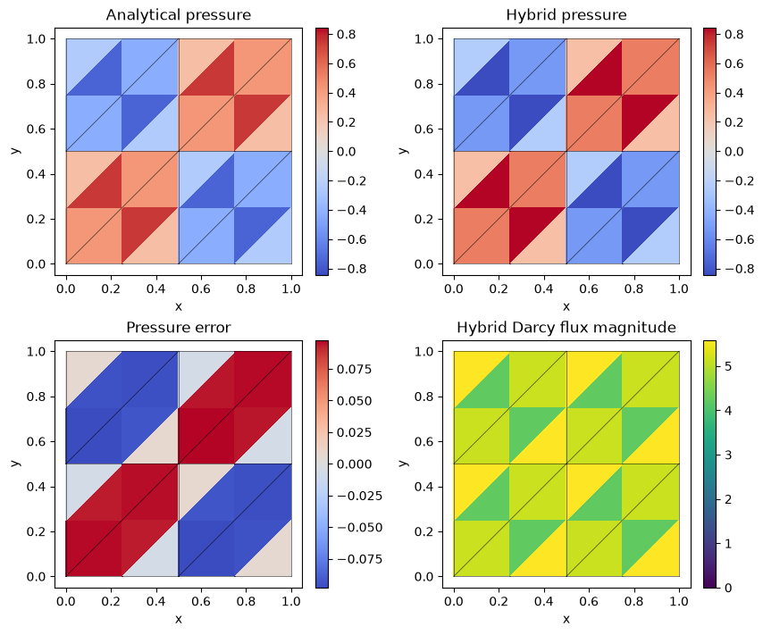
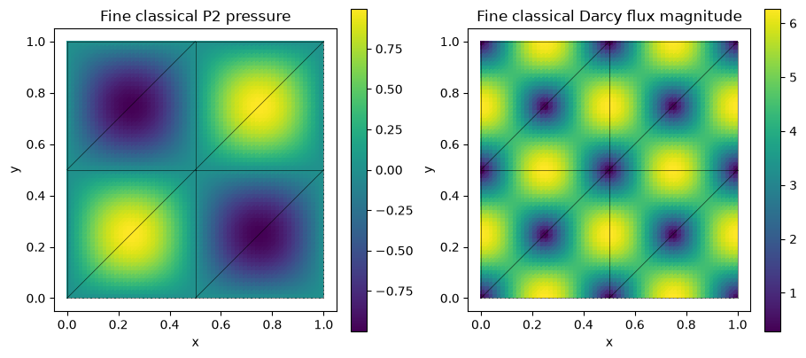
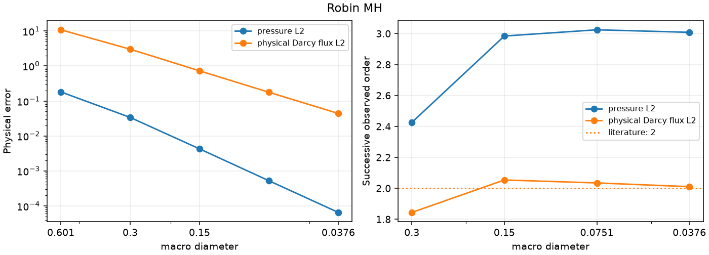

# Robin MH

[Open the step-by-step notebook](https://github.com/ipes-lncc/pymhm/blob/main/notebooks/darcy/robin_mh_workflow.ipynb) · [Download notebook](https://raw.githubusercontent.com/ipes-lncc/pymhm/main/notebooks/darcy/robin_mh_workflow.ipynb) · [Theory and degree conditions](../../theory/alternatives.md)


We write the Robin weak equations directly in UFL. Our independently manufactured data are $p=\sin(2\pi x)\sin(2\pi y)$, $K=I$, $f=8\pi^2p$, and homogeneous exterior pressure. Follow **meshes → local forms → global forms → assemble → solve → physical fields**.

The modified multiplier is $\lambda_T=(q-p\sigma)\cdot n_T$, where $q=-\nabla p$ and $\sigma=\nu(x-x_0)/2$. Consequently this multiplier cannot be plotted or tested as $q\cdot n_T$. The method follows [Barrenechea, Gomes and Paredes (2024)](https://doi.org/10.1137/22M1542556).

```python
import numpy as np
import matplotlib.pyplot as plt
import ufl
from pymhm import (
    Equation, FaceSpace, LocalContext, MeshHierarchy, SkeletonSpace, TriangleMesh,
    assemble, bind_interface, bind_problem, columns, solve,
)
from threadpoolctl import threadpool_limits


def exact_pressure(points: np.ndarray) -> np.ndarray:
    """Analytical pressure; it vanishes on every exterior edge."""
    return np.sin(2 * np.pi * points[:, 0]) * np.sin(2 * np.pi * points[:, 1])


def exact_gradient(points: np.ndarray) -> np.ndarray:
    """Independently differentiated physical pressure gradient."""
    x, y = 2 * np.pi * points.T
    return 2 * np.pi * np.column_stack((np.cos(x) * np.sin(y), np.sin(x) * np.cos(y)))


def source(points: np.ndarray) -> np.ndarray:
    """Negative Laplacian computed independently of the discrete operator."""
    return 8 * np.pi**2 * exact_pressure(points)
```

## 1. Define macro, local and interface spaces

The hierarchy owns mesh association. The interface binding owns geometric incidence and numbering; variational signs are declared separately.

```python
macro = TriangleMesh.unit_square(2)
local_meshes = tuple(macro.submesh(cell, 2) for cell in range(len(macro.cells)))
hierarchy = MeshHierarchy(macro, local_meshes)
skeleton = SkeletonSpace(macro, tuple(FaceSpace.uniform(1) for _ in macro.faces))
interface = bind_interface(skeleton, convention="normal")
```

## 2. Declare the local Robin equations

$$
(\nabla p_T,\nabla v)_T+\langle\sigma\cdot n_T\,p_T,v\rangle_{\partial T}
+\langle\lambda_T,v\rangle_{\partial T}=(f,v)_T.
$$

Choose $x_0=(0,0)$ and $\nu=1/4$. On this unit-square problem, $R=\sqrt{2}/2$ gives the admissible sufficient bound $\nu\le 1/(4R^2)=1/2$. The Robin operator has no constant kernel: it retains no pressure mean. The global test remains the independent negative pressure trace pairing.

```python
def local_equations(local: LocalContext):
    """Declare Robin diffusion and its independent pressure trace test."""
    space = local.native_space(degree=3)
    p, v = ufl.TrialFunction(space.space), ufl.TestFunction(space.space)
    x = ufl.SpatialCoordinate(space.mesh)
    dx = ufl.Measure("dx", domain=space.mesh, metadata={"quadrature_degree": 12})
    forcing = 8 * np.pi**2 * ufl.sin(2 * np.pi * x[0]) * ufl.sin(2 * np.pi * x[1])
    ds = ufl.Measure("ds", domain=space.mesh, metadata={"quadrature_degree": 12})
    normal = ufl.FacetNormal(space.mesh)
    sigma = 0.25 * x / 2
    local.field("pressure", space)
    return local.equations(
        a=ufl.inner(ufl.grad(p), ufl.grad(v)) * dx + ufl.dot(sigma, normal) * p * v * ds,
        L=forcing * v * dx,
        b=local.trace_pairings(lambda phi, ds: phi * v * ds),
        c=local.trace_pairings(lambda phi, ds: -phi * p * ds, axis="rows"),
    )
```

## 3. Declare global pressure continuity and boundary moments

$$
-\sum_T\langle p_T,\mu_T\rangle_{\partial T}=-\langle p_D,\mu\rangle_{\partial\Omega}.
$$

The trace maps carry canonical incidence. The negative sign is the mathematical global-test convention. Zero retained coordinates reflect the invertible local Robin operator.

```python
def global_equation(global_context):
    """Supply the weak Dirichlet moments in the bound interface layout."""
    boundary, fixed = global_context.boundary_data(0.0, order=8)
    assert not fixed
    return Equation(0, global_context.trace_load(-boundary))


problem = bind_problem(hierarchy, interface, local_equations,
                       global_equation=global_equation, retained=0)
```

## 4. Assemble and solve

Assembly solves the independent local equations and sums their interface contributions. Solving reconstructs named local fields in their executed coefficient bases.

```python
with threadpool_limits(1):
    system = assemble(problem)
    coefficients = solve(system)
pressure_fields = coefficients.field("pressure")
```

## 5. Integrate physical errors

Pressure and its broken gradient are integrated separately with positive order-12 quadrature. No algebraic residual is used as a substitute for these errors.

```python
from pymhm.fem.scalar.operators import triangle_quadrature
bary, weights = triangle_quadrature(12)
pressure_error, gradient_error = 0.0, 0.0
for fine, field in zip(local_meshes, pressure_fields, strict=True):
    points = np.einsum("qi,tia->tqa", bary, fine.points[fine.cells])
    flat = points.reshape(-1, 2)
    ep = (field.evaluate(flat) - exact_pressure(flat)).reshape(points.shape[:2])
    eg = (field.gradient(flat) - exact_gradient(flat)).reshape(*points.shape[:2], 2)
    pressure_error += np.einsum("t,q,tq->", fine.areas, weights, ep**2)
    gradient_error += np.einsum("t,q,tq->", fine.areas, weights, np.sum(eg**2, axis=-1))
print({"original_equation_residual": coefficients.raw_residual,
       "pressure_L2": float(np.sqrt(pressure_error)),
       "broken_gradient_L2": float(np.sqrt(gradient_error))})
assert coefficients.raw_residual < 1e-10
```

```text
{'original_equation_residual': 1.4784624037949213e-16, 'pressure_L2': 0.12338705246283269, 'broken_gradient_L2': 1.7942089859434043}
```

## 6. Plot analytical, numerical and error fields

Independent local panels retain one-sided values. Every panel shows the actual macro partition.

```python
fig, axes = plt.subplots(2, 2, figsize=(8.5, 7), layout="constrained")
all_exact, all_values, panels = [], [], []
for fine, field in zip(local_meshes, pressure_fields, strict=True):
    points = fine.points[fine.cells].mean(axis=1)
    exact, values = exact_pressure(points), field.evaluate(points)
    flux_magnitude = np.linalg.norm(-field.gradient(points), axis=1)
    panels.append((fine, exact, values, flux_magnitude))
    all_exact.extend(exact)
    all_values.extend(values)
common = max(np.max(np.abs(all_exact)), np.max(np.abs(all_values)))
error_max = max(np.max(abs(values - exact)) for _, exact, values, _ in panels)
flux_max = max(np.max(flux) for _, _, _, flux in panels)
titles = ("Analytical pressure", "Hybrid pressure", "Pressure error", "Hybrid Darcy flux magnitude")
for index, (ax, title) in enumerate(zip(axes.flat, titles, strict=True)):
    for fine, exact, values, flux in panels:
        value = (exact, values, values - exact, flux)[index]
        limit = (common, common, error_max, flux_max)[index]
        artist = ax.tripcolor(*fine.points.T, fine.cells, facecolors=value,
                             vmin=0.0 if index == 3 else -limit,
                             vmax=limit, cmap="viridis" if index == 3 else "coolwarm")
    for edge in macro.faces:
        ax.plot(*macro.points[edge].T, color="black", lw=0.5, alpha=0.7)
    ax.set(title=title, xlabel="x", ylabel="y", aspect="equal")
    fig.colorbar(artist, ax=ax)
plt.show()
```



The field panels use one sample at each fine triangle’s centroid $x_t$, drawn as a constant triangle color. The analytical panel shows $p(x_t)$; the numerical panel shows $p_h(x_t)$, and the error panel shows the **signed** difference $p_h(x_t)-p(x_t)$. These are display samples of the continuous analytical and local polynomial fields. The physical error norms above use independent volume quadrature. Macro edges are overlaid and values from opposite sides of an interface remain separate. The Darcy flux magnitude panel samples $\lVert-\nabla p_h(x_t)\rVert$, with identity permeability.

## Independently refined classical primal Galerkin baseline

The classical baseline uses one globally conforming P2 space on independent 16×16, 32×32 and 64×64 triangular grids, with the same physical coefficient, source and boundary values:

$$
(\nabla p_h^{\mathrm{CG}},\nabla v_h)=(f,v_h),\qquad
p_h^{\mathrm{CG}}\big\vert_{\partial\Omega}=p_D.
$$

The shared volume operator integrates this already stated form. The explicit essential lifting $A_{ff}p_f=f_f-A_{fb}p_D$ selects its classical boundary values. Check this reference's own errors before comparing fields. The multiscale solve above retains its simpler macro mesh and separate local spaces; it does not use this refined global grid. An exactly representable polynomial has roundoff-level classical errors on all three grids.

```python
from threadpoolctl import threadpool_limits
from pymhm.fem.scalar.triangle import scalar_operators, nodal_space, tabulate
from pymhm.fem.scalar.operators import triangle_quadrature
from pymhm.linalg.linear import solve_linear

classical_rows = []
bary, weights = triangle_quadrature(12)
for resolution in (16, 32, 64):
    reference_mesh = TriangleMesh.unit_square(resolution)
    A, _, forcing = scalar_operators(reference_mesh, 2, diffusion=1.0, source=source, order=12)
    dofs, nodes = nodal_space(reference_mesh, 2)
    boundary = np.flatnonzero(np.any(np.isclose(nodes, 0.0) | np.isclose(nodes, 1.0), axis=1))
    free = np.setdiff1d(np.arange(len(nodes)), boundary)
    reference_pressure = np.zeros(len(nodes))
    reference_pressure[boundary] = exact_pressure(nodes[boundary])
    rhs = forcing[free] - A[free][:, boundary] @ reference_pressure[boundary]
    with threadpool_limits(1):
        reference_pressure[free] = solve_linear(A[free][:, free], rhs)
    _, _, basis, gradient, _ = tabulate(reference_mesh, 2, bary)
    points = np.einsum("qi,tia->tqa", bary, reference_mesh.points[reference_mesh.cells])
    difference = reference_pressure[dofs] @ basis.T - exact_pressure(points.reshape(-1, 2)).reshape(points.shape[:2])
    error = float(np.sqrt(reference_mesh.areas @ (difference**2 @ weights)))
    classical_rows.append({"resolution": resolution, "elements": len(reference_mesh.cells),
                           "pressure_L2": error})
for row in classical_rows:
    print(row)
# Polynomial patches can be exactly represented, in which case all levels are
# at roundoff. Otherwise verify the classical reference's own refinement.
assert (max(row["pressure_L2"] for row in classical_rows) < 1e-10
        or all(b["pressure_L2"] < a["pressure_L2"] for a, b in zip(classical_rows, classical_rows[1:])))
centers = reference_mesh.points[reference_mesh.cells].mean(axis=1)
_, _, center_basis, center_gradient, _ = tabulate(reference_mesh, 2, np.full((1, 3), 1/3))
reference_values = (reference_pressure[dofs] @ center_basis.T)[:, 0]
reference_flux = -np.einsum("ti,tqia->tqa", reference_pressure[dofs], center_gradient)[:, 0]
fig, axes = plt.subplots(1, 2, figsize=(9, 4), layout="constrained")
for ax, values, title in zip(axes, (reference_values, np.linalg.norm(reference_flux, axis=1)),
                             ("Fine classical P2 pressure", "Fine classical Darcy flux magnitude"), strict=True):
    artist = ax.tripcolor(*reference_mesh.points.T, reference_mesh.cells, facecolors=values, cmap="viridis")
    for edge in macro.faces:
        ax.plot(*macro.points[edge].T, color="black", lw=0.5, alpha=0.7)
    ax.set(title=title, xlabel="x", ylabel="y", aspect="equal")
    fig.colorbar(artist, ax=ax)
plt.show()
```

```text
{'resolution': 16, 'elements': 512, 'pressure_L2': 0.0005479034106938733}
{'resolution': 32, 'elements': 2048, 'pressure_L2': 6.873255317566801e-05}
{'resolution': 64, 'elements': 8192, 'pressure_L2': 8.600387223616975e-06}
```



The classical panels also use fine-cell centroid samples for display. Its pressure and gradient are evaluated from the conforming P2 coefficients; the reference-refinement errors are integrated independently of these plotting samples. The overlaid macro mesh belongs to the multiscale comparison.

## 7. Verify the qualified convergence study

The corresponding rendered method tutorial ends with the attributed smooth refinement sequence and its literature order. The small workflow above teaches the equations; the refinement campaign states its own spaces and refinement variable. Recompute the measured orders in the shared convergence notebook, keeping local and skeletal refinement distinct.

## Smooth refinement and the asymptotic regime

The following independent qualification study uses **P3/r2 locals; P1 Robin trace; nu=1/4** and refines the **macro diameter**. It states its own geometry, data and spaces; its smooth rates are not transferred to the oscillatory teaching case or to singular material interfaces. Successive orders use the independently integrated physical errors:

$$
r_i=\frac{\log(E_{i-1}/E_i)}{\log(h_{i-1}/h_i)}.
$$

| Physical observable | Literature order under its hypotheses | Last three measured orders |
| --- | ---: | --- |
| pressure L2 | reported observation | 2.984 / 3.024 / 3.008 |
| physical Darcy flux L2 | 2 | 2.054 / 2.035 / 2.010 |



Download the figure as [SVG](../../assets/tutorials/methods/robin-mh-convergence.svg) or [PDF](../../assets/tutorials/methods/robin-mh-convergence.pdf).

Barrenechea, Gomes and Paredes (2024): smooth energy order two; pressure order three observed. The [source numerical record](https://github.com/ipes-lncc/pymhm/blob/main/examples/results/mh/comparison.json) has SHA256 `0e49ca0d9f39bf10d94b911b0cd64624194652a5932222bac1f1b00fa0086f39`. Its execution attribution remains in that record. The [rate notebook](https://github.com/ipes-lncc/pymhm/blob/main/notebooks/convergence/method_rates.ipynb) recomputes the orders; reading existing measurements does not execute the underlying PDE.

## References for this method

- Gabriel R. Barrenechea, Antonio Tadeu A. Gomes, and Diego Paredes (2024). *A Multiscale Hybrid Method*. SIAM Journal on Scientific Computing 46(3), A1628–A1657. [DOI: 10.1137/22M1542556](https://doi.org/10.1137/22M1542556).
