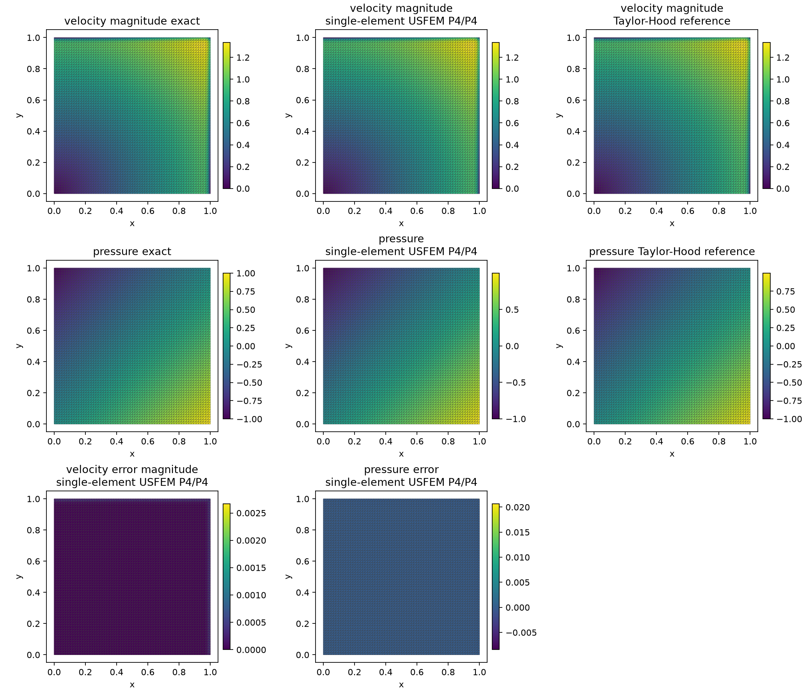
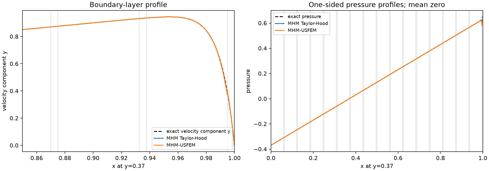
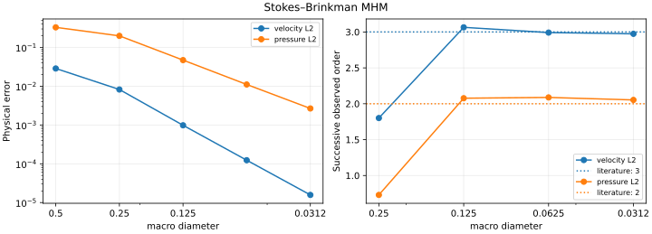
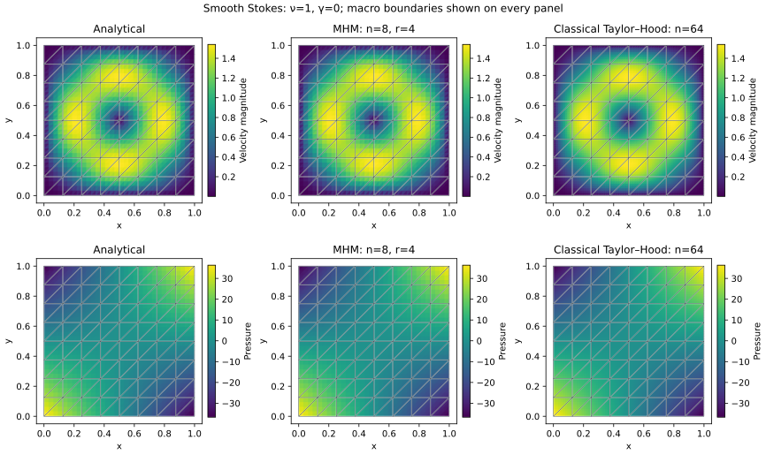
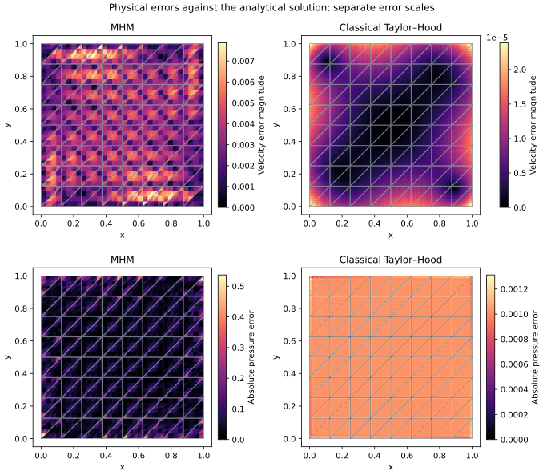
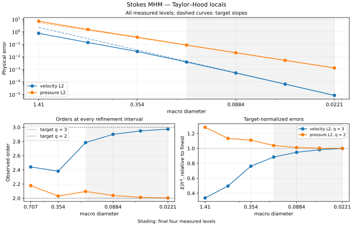

# Stokes–Brinkman MHM

Build mixed velocity–pressure UFL equations on local meshes, couple them through
a vector pseudotraction trace, and impose one physical pressure gauge after
assembly. This tutorial compares stable Taylor–Hood local Galerkin with the
residual-stabilized equal-order MHM-USFEM variant.

[Executable boundary-layer notebook](https://github.com/ipes-lncc/pymhm/blob/main/notebooks/introduction/stokes_brinkman_boundary_layer.ipynb) · [Download notebook](https://raw.githubusercontent.com/ipes-lncc/pymhm/main/notebooks/introduction/stokes_brinkman_boundary_layer.ipynb) · [Theory and degree conditions](../../theory/flow.md)

The notebook runs in `introduction`; it declares its exact data, local and
reference UFL forms, global equation, physical norms and plotting workflow in
successive cells. Convergence on the difficult layer is separated from the
smooth asymptotic study at the end of this page.

## 1. Start with the PDE and analytical layer

Use the vector-Laplacian convention from Section 3.1.2 of
[Araya et al. (2017)](https://doi.org/10.1016/j.cma.2017.05.027):

$$
\begin{aligned}
-\nu\Delta u+\gamma u+\nabla p&=f,
&\nabla\cdot u&=0,\\
u_*&=(y-g(y),x-g(x)),
&p_*&=x-y,\\
g(s)&=\frac{e^{(s-1)/\nu}-e^{-1/\nu}}{1-e^{-1/\nu}},
&\nu&=10^{-2},\quad\gamma=1.
\end{aligned}
$$

The layer width is $\nu$. Prescribe $u_*$ on the entire exterior and set the
physical pressure integral to zero. Differentiate these analytical functions
to obtain the source, before constructing the discrete operator:

$$
f=\nu(g''(y),g''(x))+\gamma u_*+(1,-1).
$$

```python
denominator = -np.expm1(-1/NU)
x = ufl.SpatialCoordinate(domain)
g = lambda s: (ufl.exp((s-1)/NU)-np.exp(-1/NU))/denominator
truth_u = ufl.as_vector((x[1]-g(x[1]), x[0]-g(x[0])))
truth_p = x[0]-x[1]
force = (
    ufl.as_vector((ufl.exp((x[1]-1)/NU), ufl.exp((x[0]-1)/NU)))
    /(NU*denominator)+GAMMA*truth_u+ufl.as_vector((1.0, -1.0))
)
```

The source includes both resistance and the pressure gradient. An exponential
layer that a local mesh does not resolve need not exhibit an asymptotic rate.

## 2. Choose macro, local and interface spaces

The Taylor–Hood comparison uses P2 velocity/P1 pressure with four subdivisions
per macro edge, including an interior vertex in each local triangulation.
Its equal-order comparison uses P2/P2 on the same local meshes. The vector trace
uses P0 coordinates on complete macrofaces for this comparison.

```python
macro = TriangleMesh.unit_square(n)
skeleton = SkeletonSpace(
    macro, tuple(FaceSpace.uniform(0) for _ in macro.faces), components=2,
)
hierarchy = MeshHierarchy(
    macro, tuple(macro.submesh(i, 4) for i in range(len(macro.cells))),
)
interface = bind_interface(skeleton, convention="normal")
```

The separate polynomial convergence family uses **one local triangle per
macrocell**, unsplit P$\ell$ traces and stabilized P$_{\ell+2}$/P$_{\ell+2}$ local
spaces, for $\ell=0,1,2$. It satisfies the two-dimensional sufficient condition
$k-\ell\ge2$. These are distinct approximation families; their results must
retain their own space descriptions. [Araya et al. (2025)](https://doi.org/10.1137/24M1649368)
states the lifting, degree and regularity hypotheses.

## 3. Write the local momentum and incompressibility forms

For $w=(u,p)$ and $z=(v,q)$, the pressure test convention is

$$
B_K(w,z)=\nu(\nabla u,\nabla v)_K+\gamma(u,v)_K
-(p,\nabla\cdot v)_K-(q,\nabla\cdot u)_K.
$$

Use a Basix mixed element, then write this equation with UFL:

```python
pressure_degree = velocity_degree if stabilized else velocity_degree-1
element = basix.ufl.mixed_element([
    basix.ufl.element("Lagrange", "triangle", velocity_degree, shape=(2,)),
    basix.ufl.element("Lagrange", "triangle", pressure_degree),
])
W = dolfinx.fem.functionspace(domain, element)
u, p = ufl.TrialFunctions(W)
v, q = ufl.TestFunctions(W)
dx = ufl.Measure("dx", domain=domain, metadata={"quadrature_degree": 28})
a = (
    NU*ufl.inner(ufl.grad(u), ufl.grad(v))+GAMMA*ufl.inner(u, v)
    -p*ufl.div(v)-q*ufl.div(u)
)*dx
L = ufl.inner(force, v)*dx
mean_form = q*dx
```

For USFEM, declare the complete momentum residual and include its matching
source term:

$$
\begin{aligned}
R(u,p)&=-\nu\Delta u+\gamma u+\nabla p,\\
B_K^{\mathrm{US}}(w,z)&=B_K(w,z)-\sum_{\tau\subset K}
\kappa_\tau(R(w),R(z))_\tau,\\
F_K^{\mathrm{US}}(z)&=(f,v)_K-\sum_{\tau\subset K}
\kappa_\tau(f,R(z))_\tau.
\end{aligned}
$$

```python
R = -NU*ufl.div(ufl.grad(u))+GAMMA*u+ufl.grad(p)
Rtest = -NU*ufl.div(ufl.grad(v))+GAMMA*v+ufl.grad(q)
h = ufl.CellDiameter(domain)
tau = h**2/(ufl.max_value(GAMMA*h**2, 4*NU/inverse_m)+4*NU/inverse_m)
a -= tau*ufl.inner(R, Rtest)*dx
L -= tau*ufl.inner(force, Rtest)*dx
```

`inverse_m` is computed on the **actual velocity polynomial space** with
[`laplacian_inverse_bound`](../../api/elements.md). The notebook displays the
quotient and verifies its matrix inequality. Keeping only a pressure-gradient
penalty would omit resistance and higher-order Laplacian terms from this method.
The negative residual sign and stabilized load are essential.

## 4. Declare both interface actions

The local unknown is the oriented vector-Laplacian pseudotraction,

$$
\lambda_K=(-\nu\nabla u+pI)n_K.
$$

This convention follows the grad–grad volume form. Symmetric Cauchy stress uses
a different natural traction and kernel. Binding handles the incidence signs;
the mathematical pairings remain visible:

```python
binding = local.native_space(W)
u, p = ufl.TrialFunctions(W)
v, q = ufl.TestFunctions(W)
b = local.trace_pairings(lambda phi, ds: ufl.inner(phi, v)*ds)
c = local.trace_pairings(lambda phi, ds: -ufl.inner(phi, u)*ds, axis="rows")
```

Thus local equations have $A_Kw_K+B_K\lambda=F_K$ and the global equation has
$-\sum_K B_K^{\mathsf T}w_K=-\langle\mu,u_*\rangle_{\partial\Omega}$.
The exterior functional prescribes velocity moments, not traction.

The notebook keeps the portable coefficient layout used by its scientific
archives. Its adapter transports `a`, `L`, `b`, `c`, pressure weights and named
velocity/pressure fields into that same executed basis. That storage step
follows the displayed UFL formulation and does not define the PDE. When no
custom archive layout is required, `local.equations` accepts these native forms
directly, as the [Oseen notebook](oseen.md) demonstrates.

## 5. Declare global boundary data, assemble and solve

Positive resistance makes the displayed local velocity kernel trivial, so
`retained=0`. The global pressure shift still requires one physical gauge.

```python
def global_equation(context):
    boundary, fixed = context.boundary_data(truth.velocity, order=32)
    return Equation(0, -context.trace_load(boundary))
problem = bind_problem(
    hierarchy, interface, provider,
    global_equation=global_equation, retained=0,
)
system = assemble(problem)
gauge = system.mean_constraint(
    [record["pressure_weights"] for record in system.local_metadata], 0.0,
)
solution = solve(system, constraints=(gauge,))
velocity = solution.field("velocity")
pressure = solution.field("pressure")
```

The complete notebook defines `provider` from the UFL forms and its field
adapter. In the pure Stokes limit $\gamma=0$, retain the two-dimensional velocity
translations with their physical moment equations; changing only `GAMMA` while
keeping a trivial kernel configuration is insufficient.

## 6. Inspect physical fields and a classical reference

The independent classical baseline assembles the displayed Taylor–Hood P2/P1
volume forms globally on $32\times32$, $64\times64$ and $128\times128$ meshes.
It imposes strong exterior velocity and the same zero pressure integral. Its
refinement errors are measured against the available exact fields before it is
used as a numerical baseline.





All analytical, numerical and error fields show the actual macro mesh; profile
markers identify macroface crossings. Independently reconstructed incident
values remain separate. The notebook measures velocity, pressure, velocity
gradient, fine-cell divergence and macro mass balance. Macro conservation does
not establish pointwise incompressibility or an H(div) velocity reconstruction.

## 7. Finish with asymptotic rates on smooth data

The difficult layer's measured P2/P2, P3/P3 and P4/P4 sequences are documented
in the [canonical boundary-layer case](../../cases/introduction-layers.md#incompressible-brinkman-flow).
They approach the reported orders as the layer resolves, with their
pre-asymptotic slopes stated explicitly.

### Stabilized equal-order local problems

For a clean final rate check, the separate smooth Stokes family uses viscosity
one, zero resistance, stabilized P3/P3 local fields and vector P1 traces on a
crisscross macro mesh. Its pressure mean and translational local kernels are
part of that source configuration. The smooth-data estimates require regular macroelements, admissible local lifting spaces,
resolved local approximation and the stated pressure gauge. The final four
levels are $H=1/4,1/8,1/16,1/32$; the table shows all three intervals, rather
than choosing only the final favorable slope. The normalized amplitude
$E/H^q$ is approximately constant in this window.
[Araya et al. (2017)](https://doi.org/10.1016/j.cma.2017.05.027) and
[Araya et al. (2025)](https://doi.org/10.1137/24M1649368) state the local
stability, regularity and lifting hypotheses.

| Physical observable | Reference order | Last three orders | Maximum/minimum of $E/H^q$ |
| --- | ---: | --- | ---: |
| velocity $L^2$ | 3 | 3.0644, 2.9914, 2.9741 | 1.0457 |
| pressure $L^2$ | 2 | 2.0771, 2.0881, 2.0532 | 1.1635 |



This USFEM study is a smooth asymptotic control, with separately declared data
and spaces; it does not imply those rates for an unresolved boundary layer.

### Refined Taylor–Hood local Galerkin problems

The Galerkin variant has a separate refinement study. On each diagonal
macrotriangle, divide each edge into four parts and use continuous P2 velocity
and continuous P1 pressure on the resulting 16 fine triangles. The vector P1
multiplier remains unsplit on each macroface. In the pure Stokes problem,
retain both velocity translations in the global formulation and impose the
physical pressure integral once over the whole domain. These are the same
kernel and gauge conventions used in the notebook's variational construction.

Both smooth studies use the analytical fields

$$
\begin{aligned}
\psi(x,y)&=128x^2(1-x)^2y^2(1-y)^2,\\
\boldsymbol u&=(\partial_y\psi,-\partial_x\psi),\\
p(x,y)&=150(x-\tfrac12)(y-\tfrac12),\\
\boldsymbol f&=-\Delta\boldsymbol u+\nabla p.
\end{aligned}
$$

They have viscosity one, zero resistance and homogeneous exterior velocity.
The positive prefactor of $\psi$ reverses the velocity in the polynomial example
of [Araya et al. (2017), Section 3.1.1](https://doi.org/10.1016/j.cma.2017.05.027),
while retaining its pressure. These are analytical qualifications of the
formulations, rather than reproductions of that paper's figure. Section 2.2
admits stable local Galerkin pairs, subject to the trace-lifting condition (48).
The sufficient degree condition for single-element equal-order USFEM spaces
does not describe these refined Taylor–Hood spaces.





The illustration uses an $8\times8$ macro grid with two diagonal triangles per
square and a separate global Taylor–Hood reference on a $64\times64$ grid.
Every panel shows the actual macro mesh. The convergence study retains all
seven macro-grid resolutions $n=1,2,4,8,16,32,64$ and uses the actual triangle
diameter $H=\sqrt{2}/n$. Its final four levels give the following tail.

| Physical observable | Smooth-data order | Last three orders | Maximum/minimum of $E/H^q$ |
| --- | ---: | --- | ---: |
| velocity $L^2$ | 3 | 2.9006, 2.9491, 2.9740 | 1.1300 |
| pressure $L^2$ | 2 | 2.0392, 2.0125, 2.0043 | 1.0396 |



The independent UFL reference assembles the same Stokes operator and analytical
source globally, with strong exterior velocity and zero physical pressure
integral. Its own refinement is measured against the exact fields.

| Global reference grid | Velocity $L^2$ error | Pressure $L^2$ error |
| --- | ---: | ---: |
| $32\times32$ | $8.4796\times10^{-5}$ | $9.4591\times10^{-3}$ |
| $64\times64$ | $1.0602\times10^{-5}$ | $2.3640\times10^{-3}$ |
| $128\times128$ | $1.3255\times10^{-6}$ | $5.9097\times10^{-4}$ |

The local operator has exactly the two translational null modes in both triangle
orientations. The divergence block has full pressure-row rank, and the P1
trace coupling has full rank on mean-free velocities. Independent UFL assembly
also checks the volume operator, analytical source, signed trace coupling and
physical moments. These finite-dimensional checks accompany the stability and
regularity hypotheses; they are not uniform inf-sup estimates. The records check
all original local momentum and incompressibility equations, global trace rows
and the pressure gauge. Independent error quadratures of orders 12 and 16
agree on the measured norms.

## References

- Rodolfo Araya, Christopher Harder, Abner H. Poza and Frédéric Valentin (2017).
  *Multiscale hybrid-mixed method for the Stokes and Brinkman equations—The
  method*. Computer Methods in Applied Mechanics and Engineering 324, 29–53.
  [DOI: 10.1016/j.cma.2017.05.027](https://doi.org/10.1016/j.cma.2017.05.027).
- Rodolfo Araya, Christopher Harder, Abner H. Poza and Frédéric Valentin (2025).
  *Multiscale Hybrid-Mixed Methods for the Stokes and Brinkman Equations—A Priori
  Analysis*. SIAM Journal on Numerical Analysis 63(2), 588–618.
  [DOI: 10.1137/24M1649368](https://doi.org/10.1137/24M1649368).
