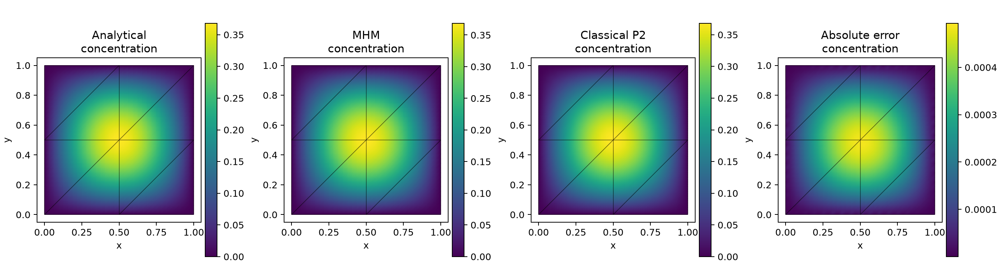
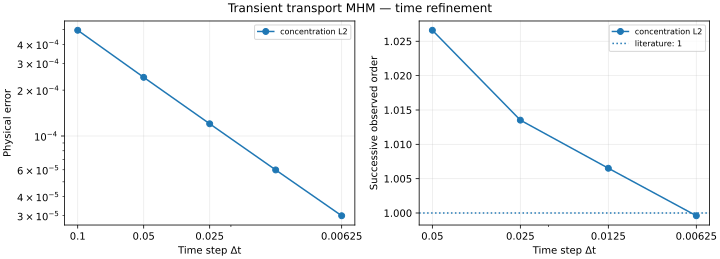

# Transient transport MHM

Write the capacity-weighted mass, conservative transport and interface forms
with UFL. A backward-Euler time loop updates physical source loads and previous
concentration while the generic offline system reuses unchanged local and global
operators.

[Complete executable notebook](https://github.com/ipes-lncc/pymhm/blob/main/notebooks/transport/transient_variational.ipynb) · [Download notebook](https://raw.githubusercontent.com/ipes-lncc/pymhm/main/notebooks/transport/transient_variational.ipynb) · [Spatial theory](../../theory/transport.md)

Run in `introduction`. The notebook declares the entire problem and time loop;
it does not call a ready-made transport simulation. Its final study measures
**temporal** order with fixed spatial spaces, separately from spatial MHM rates.

## 1. Choose the physical concentration and initial data

On the unit square, capacity and diffusion are one, reaction is $1/2$, and
constant transport velocity is $\beta=(1/4,-1/2)$:

$$
\begin{aligned}
\partial_t c+\nabla\cdot(-\nabla c+\beta c)+\tfrac12c&=f,\\
c_*(x,y,t)&=e^{-t}\phi(x,y),
&\phi(x,y)&=\sin(\pi x)\sin(\pi y),\\
f(x,y,t)&=e^{-t}\big[(2\pi^2-\tfrac12)\phi+\beta\cdot\nabla\phi\big].
\end{aligned}
$$

The concentration is zero on the exterior. The source is derived from the PDE,
not from the discrete matrix. Initial concentration is the independent physical
$L^2$ projection of $\phi$. Physical transport flux and skeletal multiplier are

$$
j=-\nabla c+\beta c,
\qquad\lambda_K=(-\nabla c+\tfrac12\beta c)\cdot n_K.
$$

Their advection contributions differ. The multiplier is not the complete
transport flux used in a physical conservation diagnostic.
[Harder et al. (2015)](https://doi.org/10.1137/130938499) and
[Araya et al. (2024)](https://doi.org/10.1016/j.cma.2024.117089) give the underlying
conservative hybrid formulation.

## 2. Bind macro, local and interface meshes

The spatial approximation remains unchanged through the time-refinement study:
P2 concentration on fine triangles and segmented P1 normal traces. The local
mesh has twice as many edge subdivisions as the interface partition, providing
an enriched local trace lifting.

```python
macro = TriangleMesh.unit_square(2)
local_refinement = 16
skeleton = SkeletonSpace(
    macro,
    tuple(FaceSpace.uniform(1, local_refinement//2) for _ in macro.faces),
)
hierarchy = MeshHierarchy(
    macro, tuple(macro.submesh(i, local_refinement) for i in range(len(macro.cells))),
)
interface = bind_interface(skeleton, convention="normal")
```

The binding supplies incident orientation and geometric support. A trace space
richer than the independent local boundary responses can introduce redundant
multipliers; it is not repaired by a solver perturbation.

## 3. Translate backward Euler into a local equation

For a step of length $\Delta t$, the local equation is

$$
\begin{aligned}
\tfrac1{\Delta t}(c_K^{n+1},v)_K+a_K(c_K^{n+1},v)
+\langle\lambda_K^{n+1},v\rangle_{\partial K}
&=(f^{n+1},v)_K+\tfrac1{\Delta t}(c_K^n,v)_K,\\
a_K(c,v)&=(\nabla c,\nabla v)_K+\tfrac12(c,v)_K\\
&\quad+\tfrac12[(\beta\cdot\nabla c,v)_K-(c,\beta\cdot\nabla v)_K].
\end{aligned}
$$

Inside `local_time_equations`, first obtain a P2 native space and declare the
independent analytical source profile:

```python
binding = local.native_space(degree=2)
V = binding.space
c, v = ufl.TrialFunction(V), ufl.TestFunction(V)
x = ufl.SpatialCoordinate(binding.mesh)
beta = ufl.as_vector((0.25, -0.5))
phi = ufl.sin(np.pi*x[0])*ufl.sin(np.pi*x[1])
grad_phi = np.pi*ufl.as_vector((
    ufl.cos(np.pi*x[0])*ufl.sin(np.pi*x[1]),
    ufl.sin(np.pi*x[0])*ufl.cos(np.pi*x[1]),
))
force_profile = (2*np.pi**2-0.5)*phi+ufl.dot(beta, grad_phi)
dx = ufl.Measure("dx", domain=binding.mesh, metadata={"quadrature_degree": 12})
```

Then assemble mass and load profiles, and write the step operator:

```python
mass = compile_form(c*v*dx)
initial_load = compile_form(phi*v*dx)
initial = solve_linear(mass, initial_load)
source_profile = compile_form(force_profile*v*dx)
a = (
    (1/dt+0.5)*c*v+ufl.inner(ufl.grad(c), ufl.grad(v))
    +0.5*(ufl.dot(beta, ufl.grad(c))*v-c*ufl.dot(beta, ufl.grad(v)))
)*dx
L = np.exp(-dt)*source_profile+mass@initial/dt
b = local.trace_pairings(lambda phi, ds: phi*v*ds)
balance = local.trace_pairings(lambda phi, ds: -phi*c*ds, axis="rows")
```

A different capacity multiplies both the mass operator and the old-state mass
load. A SUPG extension would require the consistent Petrov contribution in
**both** source and old-state mass; changing only the left side defines another
scheme.

## 4. Retain a coarse mode and declare the physical field

Positive mass removes the constant nullspace. Retaining the constant as a
coarse mode remains useful, but it is not an exact `kernel`:

```python
local.field("concentration", binding)
return local.equations(
    a=a, L=L, b=b, c=balance,
    coarse_basis=np.ones((binding.size, 1)), moments=columns(v*dx),
    metadata={"mass": mass, "initial": initial, "source_profile": source_profile},
)
```

With homogeneous exterior concentration, `Equation(0, 0)` supplies the
additional global load. Local balance pairings enforce its boundary and
interior concentration moments. No pressure-style gauge is needed.

## 5. Assemble once per step size, then update loads

The mathematical update is $F_K^{n+1}=e^{-t_{n+1}}F_K+M_Kc_K^n/\Delta t$.
The notebook's explicit time loop delegates elimination and factor reuse to the
existing numerical owners:

```python
problem = bind_problem(
    hierarchy, interface, partial(local_time_equations, dt=dt),
    global_equation=Equation(0, 0), retained=1,
)
system = assemble(problem)
records = system.local_metadata
previous = tuple(record["initial"] for record in records)
with OfflineMultiscaleSystem(system) as prepared, factorize(system.matrix) as factor:
    for step in range(1, steps+1):
        time = step*dt
        loads = tuple(
            np.exp(-time)*record["source_profile"]+record["mass"]@old/dt
            for record, old in zip(records, previous, strict=True)
        )
        updated = prepared.with_loads(loads)
        solution = updated.solve(factorization=factor)
        previous = solution.fields
concentration = solution.field("concentration")
```

A source update leaves the operator unchanged. Changing the time step,
coefficients or spaces requires a new assembly. The context managers release
prepared native resources when the loop ends.

## 6. Check physical fields against an independently refined reference

The notebook also writes the globally conforming P2 UFL mass and conservative
transport equation explicitly. It applies strong zero concentration and the
same backward-Euler steps on successively refined global meshes. The reference uses $\Delta t=0.00625$ on $16\times16$, $32\times32$ and
$64\times64$ meshes. Physical concentration differences decrease from
$2.5077\times10^{-5}$ to $3.1391\times10^{-6}$; the finest reference is used
as the numerical baseline.

The analytical concentration supplies the exact error. Error integration is
independent of assembly and is checked with two quadrature orders. Original
physical-equation residuals are evaluated at every time step.



The same macro mesh is visible on all analytical, numerical and error panels.
Macrocells retain their independent incident values.

## 7. Finish with first-order temporal convergence

Keep the above spatial approximation fixed and integrate to $t=1$ with
$\Delta t=0.1,0.05,0.025,0.0125,0.00625$. The final consecutive physical
concentration error ratios must approach the first-order backward-Euler target
while remaining above the fixed spatial floor. Measured consecutive orders are $1.0266$, $1.0135$, $1.0065$ and $0.9996$;
the final concentration $L^2$ error is $2.9934\times10^{-5}$. Original physical
equation residuals remain below $1.24\times10^{-15}$. Both error curves and measured
orders are plotted; a reference slope alone is not evidence of that order.



The notebook records the actual errors, original-equation checks and independently
refined classical comparisons. This experiment establishes the smooth temporal
order of the displayed scheme; heterogeneous geometry, transport-dominated
layers, spatial MHM rates and monotonicity need separate assessments. See the
[transport gallery](../../gallery/transient-transport.md) for the other current
physical studies.

The final provenance cell reads the executed notebook file, rather than expecting
it inside the support archive. The public runner supplies `PYMHM_NOTEBOOK_SOURCE`.
For manual execution, save the downloaded notebook as `transient_variational.ipynb`
in the working directory. If you rename or move it, set `PYMHM_NOTEBOOK_SOURCE` to
its path before running this cell. A checkout also supports its ordinary
`notebooks/transport/transient_variational.ipynb` location.

```python
source_file = Path(os.environ.get("PYMHM_NOTEBOOK_SOURCE", "transient_variational.ipynb"))
if not source_file.is_file() and "PYMHM_NOTEBOOK_SOURCE" not in os.environ:
    source_file = Path.cwd()/"notebooks/transport/transient_variational.ipynb"
source_bytes = source_file.read_bytes()
source_notebook = json.loads(source_bytes)
scientific_cells = [
    {"cell_type": cell["cell_type"],
     "source": "".join(cell["source"])
               if isinstance(cell["source"], list) else cell["source"]}
    for cell in source_notebook["cells"]
    if "pymhm-companion-bootstrap" not in cell.get("metadata", {}).get("tags", [])
]
scientific_bytes = json.dumps(
    scientific_cells, ensure_ascii=False, sort_keys=True, separators=(",", ":")
).encode("utf-8")
study["source_notebook_sha256"] = hashlib.sha256(source_bytes).hexdigest()
study["scientific_cells_sha256"] = hashlib.sha256(scientific_bytes).hexdigest()
```

The first digest identifies the literal acquired source bytes. The second
identifies every scientific and explanatory cell, excluding only the generated
installer tagged `pymhm-companion-bootstrap`. Outputs and execution counts are
excluded from that second identity; the equations and their parameters remain
part of it.

## References

- Christopher Harder, Diego Paredes and Frédéric Valentin (2015).
  *On a Multiscale Hybrid-Mixed Method for Advective-Reactive Dominated Problems
  with Heterogeneous Coefficients*. Multiscale Modeling & Simulation 13(2),
  491–518. [DOI: 10.1137/130938499](https://doi.org/10.1137/130938499).
- Rodolfo Araya, Fabrice Jaillet, Diego Paredes and Frédéric Valentin (2024).
  *Generalizing the multiscale hybrid-mixed method for reactive-advective-diffusive
  equations*. Computer Methods in Applied Mechanics and Engineering 428,
  117089. [DOI: 10.1016/j.cma.2024.117089](https://doi.org/10.1016/j.cma.2024.117089).
